# SGM8552 Single-Supply, Dual Rail-to-Rail I/O Precision Operational Amplifier

# GENERAL DESCRIPTION

# FEATURES

The SGM8552 is a dual, precision operational amplifier which can operate from $\pm . 5 \lor$ to $5 . 5 \lor$ single supply. The device provides rail-to-rail input and output operation.

The SGM8552 offers a low offset voltage less than $2 0 \mu \nu$ and an ultra-low bias current of 10pA. The combination of characteristics makes the SGM8552 a good choice for temperature measurements, pressure and position sensors, strain gauge amplifiers and medical instrumentation, or any other $2 . 5 \lor$ to $5 . 5 \lor$ applications requiring precision and long-term stability.

The SGM8552 is available in Green SOIC-8 and MSOP-8 packages and ESD (HBM) reaches $8 \mathsf { k V } .$ It is specified over the extended industrial temperature range ( $\angle 0 ^ { \circ } \mathsf { C }$ to $+ 1 2 5 ^ { \circ } \mathrm { C }$ ).

● Low Offset Voltage: $\pmb { 2 0 } \mu \nu$ (MAX)   
● Ultra-Low Input Bias Current: 10pA Large-Signal Voltage Gain: 145dB (TYP) at 5V   
● PSRR: 110dB (TYP)   
● CMRR: 105dB (TYP)   
● Overload Recovery Time: ${ \tt6 0 \mu \leq }$ (at $\mathsf { V } _ { \mathsf { S } } = \mathsf { 5 V } _ { \mathsf { \Omega } }$ )   
● Rail-to-Rail Input and Output   
● Supply Voltage Range: 2.5V to 5.5V   
● Low Supply Current: $\ 9 3 0 \mu \mu$ (TYP)   
● No External Capacitors Required   
● $\yen 40$ to $+ 1 2 5 \%$ Operating Temperature Range   
● Available in Green SOIC-8 and MSOP-8 Packages

# APPLICATIONS

Pressure Sensors Temperature Measurements Precision Current Sensing Electronic Scales Strain Gauge Amplifiers Handheld Test Equipment Thermocouple Amplifiers Medical Instrumentation

# PACKAGE/ORDERING INFORMATION

<table><tr><td rowspan=1 colspan=1>MODEL</td><td rowspan=1 colspan=1>PACKAGEDESCRIPTION</td><td rowspan=1 colspan=1>SPECIFIEDTEMPERATURERANGE</td><td rowspan=1 colspan=1>ORDERINGNUMBER</td><td rowspan=1 colspan=1>PACKAGEMARKING</td><td rowspan=1 colspan=1>PACKINGOPTION</td></tr><tr><td rowspan=2 colspan=1>SGM8552</td><td rowspan=1 colspan=1>SOIC-8</td><td rowspan=1 colspan=1>-40 to +125°</td><td rowspan=1 colspan=1>SGM8552XS8G/TR</td><td rowspan=1 colspan=1>SGM8552XS8XXXXX</td><td rowspan=1 colspan=1>Tape and Reel, 2500</td></tr><tr><td rowspan=1 colspan=1>MSOP-8</td><td rowspan=1 colspan=1>-40° to +125°</td><td rowspan=1 colspan=1>SGM8552XMS8G/TR</td><td rowspan=1 colspan=1>SGM8552XMS8XXXXX</td><td rowspan=1 colspan=1>Tape and Reel, 3000</td></tr></table>

# MARKING INFORMATION

NOTE: XXXXX $=$ Date Code and Vendor Code.

Green (RoHS & HSF): SG Micro Corp defines "Green" to mean Pb-Free (RoHS compatible) and free of halogen substances. If you have additional comments or questions, please contact your SGMICRO representative directly.

# ABSOLUTE MAXIMUM RATINGS

Supply Voltage... .6V Input Voltage Range.. . $( - \mathsf { V } \mathsf { s } ) - 0 . 3 \mathsf { V }$ to $( + \mathsf { V } _ { \mathbb { S } } ) + 0 . 3 \mathsf { V }$ Differential Input Voltage Range. . -5V to 5V Junction Temperature. .. $+ 1 5 0 ^ { \circ } \mathrm { C }$ Storage Temperature Range . . $\mathtt { - 6 5 \mathrm { ^ \circ C } }$ to $+ 1 5 0 ^ { \circ } \mathrm { C }$ Lead Temperature (Soldering, 10s).. . $+ 2 6 0 ^ { \circ } \mathrm { C }$ ESD Susceptibility HBM.. .8000V MM.. ..400V

# RECOMMENDED OPERATING CONDITIONS

Operating Temperature Range... .. $\scriptscriptstyle - 4 0 ^ { \circ } \mathsf { C }$ to $+ 1 2 5 \mathrm { ^ \circ C }$

# OVERSTRESS CAUTION

Stresses beyond those listed in Absolute Maximum Ratings may cause permanent damage to the device. Exposure to absolute maximum rating conditions for extended periods may affect reliability. Functional operation of the device at any conditions beyond those indicated in the Recommended Operating Conditions section is not implied.

# ESD SENSITIVITY CAUTION

This integrated circuit can be damaged if ESD protections are not considered carefully. SGMICRO recommends that all integrated circuits be handled with appropriate precautions. Failure to observe proper handling and installation procedures can cause damage. ESD damage can range from subtle performance degradation to complete device failure. Precision integrated circuits may be more susceptible to damage because even small parametric changes could cause the device not to meet the published specifications.

# DISCLAIMER

SG Micro Corp reserves the right to make any change in circuit design, or specifications without prior notice.

# PIN CONFIGURATION

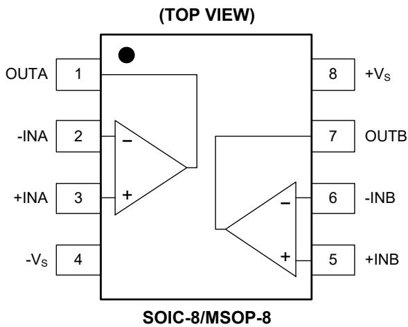

# ELECTRICAL CHARACTERISTICS

$( \mathsf { V } \mathsf { s } = 5 \mathsf { V }$ , $\mathsf { V c m } = 2 . 5 \mathsf { V }$ , VOUT $= 2 . 5 \lor$ , F $\mathsf { u l l } = - 4 0 ^ { \circ } \mathsf { C }$ to $+ 1 2 5 \mathrm { ^ \circ C }$ , typical values are at ${ \sf T } _ { \sf A } = + 2 5 ^ { \circ } { \sf C }$ , unless otherwise noted.)   
NOTE: 1. PSRR and CMRR are affected by the matching between external gain-setting resistor ratios.   

<table><tr><td rowspan=1 colspan=1>PARAMETER</td><td rowspan=1 colspan=1>CONDITIONS</td><td rowspan=1 colspan=1>TEMP</td><td rowspan=1 colspan=1>MIN</td><td rowspan=1 colspan=1>TYP</td><td rowspan=1 colspan=1>MAX</td><td rowspan=1 colspan=1>UNITS</td></tr><tr><td rowspan=1 colspan=7>Input Characteristics</td></tr><tr><td rowspan=2 colspan=1>Input Offset Voltage (Vos)</td><td rowspan=2 colspan=1></td><td rowspan=1 colspan=1>+25°C</td><td rowspan=1 colspan=1></td><td rowspan=1 colspan=1>4</td><td rowspan=1 colspan=1>20</td><td rowspan=2 colspan=1>μV</td></tr><tr><td rowspan=1 colspan=1>Full</td><td rowspan=1 colspan=1></td><td rowspan=1 colspan=1></td><td rowspan=1 colspan=1>24</td></tr><tr><td rowspan=1 colspan=1>Input Bias Current (Ib)</td><td rowspan=1 colspan=1></td><td rowspan=1 colspan=1>+25°C</td><td rowspan=1 colspan=1></td><td rowspan=1 colspan=1>10</td><td rowspan=1 colspan=1></td><td rowspan=1 colspan=1>pA</td></tr><tr><td rowspan=1 colspan=1>Input Offset Current (los)</td><td rowspan=1 colspan=1></td><td rowspan=1 colspan=1>+25°C</td><td rowspan=1 colspan=1></td><td rowspan=1 colspan=1>5</td><td rowspan=1 colspan=1></td><td rowspan=1 colspan=1>pA</td></tr><tr><td rowspan=1 colspan=1>Input Voltage Range</td><td rowspan=1 colspan=1></td><td rowspan=1 colspan=1>+25°C</td><td rowspan=1 colspan=1>0</td><td rowspan=1 colspan=1></td><td rowspan=1 colspan=1>5</td><td rowspan=1 colspan=1>V</td></tr><tr><td rowspan=2 colspan=1>Common Mode Rejection Ratio (CMRR)</td><td rowspan=2 colspan=1>Vcm = 0V to 5V</td><td rowspan=1 colspan=1>+25°</td><td rowspan=1 colspan=1>90</td><td rowspan=1 colspan=1>105</td><td rowspan=1 colspan=1></td><td rowspan=2 colspan=1>dB</td></tr><tr><td rowspan=1 colspan=1>Full</td><td rowspan=1 colspan=1>83</td><td rowspan=1 colspan=1></td><td rowspan=1 colspan=1></td></tr><tr><td rowspan=2 colspan=1>Large-Signal Voltage Gain (Avo)</td><td rowspan=2 colspan=1>RL = 10kΩ, VouT = 0.3V to 4.7V</td><td rowspan=1 colspan=1>+25°</td><td rowspan=1 colspan=1>100</td><td rowspan=1 colspan=1>145</td><td rowspan=1 colspan=1></td><td rowspan=2 colspan=1>dB</td></tr><tr><td rowspan=1 colspan=1>Full</td><td rowspan=1 colspan=1>97</td><td rowspan=1 colspan=1></td><td rowspan=1 colspan=1></td></tr><tr><td rowspan=1 colspan=1>Input Offset Voltage Drift (∆Vos/ΔT)</td><td rowspan=1 colspan=1></td><td rowspan=1 colspan=1>Full</td><td rowspan=1 colspan=1></td><td rowspan=1 colspan=1>20</td><td rowspan=1 colspan=1></td><td rowspan=1 colspan=1>nV/</td></tr><tr><td rowspan=1 colspan=1>Output Characteristics</td><td></td><td></td><td></td><td></td><td></td><td rowspan=1 colspan=1></td></tr><tr><td rowspan=4 colspan=1>Output Voltage High (Voh)</td><td rowspan=2 colspan=1>RL = 100kΩ to -Vs</td><td rowspan=1 colspan=1>+25°C</td><td rowspan=1 colspan=1>4.99</td><td rowspan=1 colspan=1>4.998</td><td rowspan=1 colspan=1></td><td rowspan=4 colspan=1>V</td></tr><tr><td rowspan=1 colspan=1>Full</td><td rowspan=1 colspan=1>4.987</td><td rowspan=1 colspan=1></td><td rowspan=1 colspan=1></td></tr><tr><td rowspan=2 colspan=1>RL = 10kΩ to -Vs</td><td rowspan=1 colspan=1>+25°C</td><td rowspan=1 colspan=1>4.985</td><td rowspan=1 colspan=1>4.996</td><td rowspan=1 colspan=1></td></tr><tr><td rowspan=1 colspan=1>Full</td><td rowspan=1 colspan=1>4.98</td><td rowspan=1 colspan=1></td><td rowspan=1 colspan=1></td></tr><tr><td rowspan=4 colspan=1>Output Voltage Low (VoL)</td><td rowspan=2 colspan=1>RL = 100kΩ to +Vs</td><td rowspan=1 colspan=1>+25°C</td><td rowspan=1 colspan=1></td><td rowspan=1 colspan=1>2</td><td rowspan=1 colspan=1>10</td><td rowspan=4 colspan=1>mV</td></tr><tr><td rowspan=1 colspan=1>Full</td><td rowspan=1 colspan=1></td><td rowspan=1 colspan=1></td><td rowspan=1 colspan=1>13</td></tr><tr><td rowspan=2 colspan=1>RL = 10kΩ to +Vs</td><td rowspan=1 colspan=1>+25°C</td><td rowspan=1 colspan=1></td><td rowspan=1 colspan=1>6</td><td rowspan=1 colspan=1>15</td></tr><tr><td rowspan=1 colspan=1>Full</td><td rowspan=1 colspan=1></td><td rowspan=1 colspan=1></td><td rowspan=1 colspan=1>20</td></tr><tr><td rowspan=2 colspan=1>Short-Circuit Limit (Isc)</td><td rowspan=2 colspan=1>VouT = 2.5V, RL = 10Ω to GND</td><td rowspan=1 colspan=1>+25°C</td><td rowspan=1 colspan=1>40</td><td rowspan=1 colspan=1>48</td><td rowspan=1 colspan=1></td><td rowspan=2 colspan=1>mA</td></tr><tr><td rowspan=1 colspan=1>Full</td><td rowspan=1 colspan=1>23</td><td rowspan=1 colspan=1></td><td rowspan=1 colspan=1></td></tr><tr><td rowspan=1 colspan=7>Power Supply</td></tr><tr><td rowspan=2 colspan=1>Power Supply Rejection Ratio (PSRR)</td><td rowspan=2 colspan=1>Vs = 2.5V to 5.5V</td><td rowspan=1 colspan=1>+25°C</td><td rowspan=1 colspan=1>90</td><td rowspan=1 colspan=1>110</td><td rowspan=1 colspan=1></td><td rowspan=2 colspan=1>dB</td></tr><tr><td rowspan=1 colspan=1>Full</td><td rowspan=1 colspan=1>80</td><td rowspan=1 colspan=1></td><td rowspan=1 colspan=1></td></tr><tr><td rowspan=2 colspan=1>Quiescent Current (Io)</td><td rowspan=2 colspan=1>VouT = Vs/2</td><td rowspan=1 colspan=1>+25°</td><td rowspan=1 colspan=1></td><td rowspan=1 colspan=1>930</td><td rowspan=1 colspan=1>1110</td><td rowspan=2 colspan=1>μA</td></tr><tr><td rowspan=1 colspan=1>Full</td><td rowspan=1 colspan=1></td><td rowspan=1 colspan=1></td><td rowspan=1 colspan=1>1760</td></tr><tr><td rowspan=1 colspan=7>Dynamic Performance</td></tr><tr><td rowspan=1 colspan=1>Gain-Bandwidth Product (GBP)</td><td rowspan=1 colspan=1>Av =+100</td><td rowspan=1 colspan=1>+25°</td><td rowspan=1 colspan=1></td><td rowspan=1 colspan=1>1.53</td><td rowspan=1 colspan=1></td><td rowspan=1 colspan=1>MHz</td></tr><tr><td rowspan=1 colspan=1>Slew Rate (SR)</td><td rowspan=1 colspan=1>Av = +1, RL = 10kΩ, 2V output step</td><td rowspan=1 colspan=1>+25°C</td><td rowspan=1 colspan=1></td><td rowspan=1 colspan=1>0.90</td><td rowspan=1 colspan=1></td><td rowspan=1 colspan=1>V/μs</td></tr><tr><td rowspan=1 colspan=1>Overload Recovery Time</td><td rowspan=1 colspan=1>Av = -100, RL = 10kΩ, ViN = 200mV (RET to GND)</td><td rowspan=1 colspan=1>+25°C</td><td rowspan=1 colspan=1></td><td rowspan=1 colspan=1>0.06</td><td rowspan=1 colspan=1></td><td rowspan=1 colspan=1>ms</td></tr><tr><td rowspan=1 colspan=7>Noise Performance</td></tr><tr><td rowspan=1 colspan=1>Input Voltage Noise (en P-p)</td><td rowspan=1 colspan=1>0.1Hz to 10Hz</td><td rowspan=1 colspan=1>+25°C</td><td rowspan=1 colspan=1></td><td rowspan=1 colspan=1>0.80</td><td rowspan=1 colspan=1></td><td rowspan=1 colspan=1>μVpp</td></tr><tr><td rowspan=1 colspan=1>Input Voltage Noise Density (en)</td><td rowspan=1 colspan=1>f = 1kHz</td><td rowspan=1 colspan=1>+25°C</td><td rowspan=1 colspan=1></td><td rowspan=1 colspan=1>47.5</td><td rowspan=1 colspan=1></td><td rowspan=1 colspan=1>nV/√z</td></tr><tr><td rowspan=1 colspan=1>Input Current Noise Density (in)</td><td rowspan=1 colspan=1>f = 1kHz</td><td rowspan=1 colspan=1>+25°C</td><td rowspan=1 colspan=1></td><td rowspan=1 colspan=1>130</td><td rowspan=1 colspan=1></td><td rowspan=1 colspan=1>fA/√Hz</td></tr></table>

# ELECTRICAL CHARACTERISTICS (continued)

$( \mathsf { V s } = 2 . 5 \mathsf { V }$ , $\mathsf { V } _ { \mathsf { C M } } = 1 . 2 5 \mathsf { V }$ , $\mathsf { V o u r } = 1 . 2 5 \mathsf { V }$ , $\mathsf { F u l l } = \mathsf { - } 4 0 ^ { \circ } \mathsf { C }$ to $+ 1 2 5 \mathrm { ^ \circ C }$ , typical values are at $T _ { \mathsf { A } } = + 2 5 ^ { \circ } \mathsf { C }$ , unless otherwise noted.)

NOTE: 1. PSRR and CMRR are affected by the matching between external gain-setting resistor ratios.   

<table><tr><td rowspan=1 colspan=1>PARAMETER</td><td rowspan=1 colspan=1>CONDITIONS</td><td rowspan=1 colspan=1>TEMP</td><td rowspan=1 colspan=1>MIN</td><td rowspan=1 colspan=1>TYP</td><td rowspan=1 colspan=1>MAX</td><td rowspan=1 colspan=1>UNITS</td></tr><tr><td rowspan=1 colspan=7>Input Characteristics</td></tr><tr><td rowspan=2 colspan=1>Input Offset Voltage (Vos)</td><td rowspan=2 colspan=1></td><td rowspan=1 colspan=1>+25°C</td><td rowspan=1 colspan=1></td><td rowspan=1 colspan=1>3</td><td rowspan=1 colspan=1>20</td><td rowspan=2 colspan=1>μV</td></tr><tr><td rowspan=1 colspan=1>Full</td><td rowspan=1 colspan=1></td><td rowspan=1 colspan=1></td><td rowspan=1 colspan=1>24</td></tr><tr><td rowspan=1 colspan=1>Input Bias Current (IB)</td><td rowspan=1 colspan=1></td><td rowspan=1 colspan=1>+25°C</td><td rowspan=1 colspan=1></td><td rowspan=1 colspan=1>10</td><td rowspan=1 colspan=1></td><td rowspan=1 colspan=1>pA</td></tr><tr><td rowspan=1 colspan=1>Input Offset Current (los)</td><td rowspan=1 colspan=1></td><td rowspan=1 colspan=1>+25°C</td><td rowspan=1 colspan=1></td><td rowspan=1 colspan=1>10</td><td rowspan=1 colspan=1></td><td rowspan=1 colspan=1>pA</td></tr><tr><td rowspan=1 colspan=1>Input Voltage Range</td><td rowspan=1 colspan=1></td><td rowspan=1 colspan=1>+25°C</td><td rowspan=1 colspan=1>0</td><td rowspan=1 colspan=1></td><td rowspan=1 colspan=1>2.5</td><td rowspan=1 colspan=1>V</td></tr><tr><td rowspan=2 colspan=1>Common Mode Rejection Ratio (&quot;1) (CMRR)</td><td rowspan=2 colspan=1>Vcm = 0V to 2.5V</td><td rowspan=1 colspan=1>+25°</td><td rowspan=1 colspan=1>90</td><td rowspan=1 colspan=1>105</td><td rowspan=1 colspan=1></td><td rowspan=2 colspan=1>dB</td></tr><tr><td rowspan=1 colspan=1>Full</td><td rowspan=1 colspan=1>81</td><td rowspan=1 colspan=1></td><td rowspan=1 colspan=1></td></tr><tr><td rowspan=2 colspan=1>Large-Signal Voltage Gain (Avo)</td><td rowspan=2 colspan=1>RL = 10kΩ, VouT = 0.3V to 2.4V</td><td rowspan=1 colspan=1>+25°C</td><td rowspan=1 colspan=1>100</td><td rowspan=1 colspan=1>135</td><td rowspan=1 colspan=1></td><td rowspan=2 colspan=1>dB</td></tr><tr><td rowspan=1 colspan=1>Full</td><td rowspan=1 colspan=1>94</td><td rowspan=1 colspan=1></td><td rowspan=1 colspan=1></td></tr><tr><td rowspan=1 colspan=1>Input Offset Voltage Drift (∆Vos/∆T)</td><td rowspan=1 colspan=1></td><td rowspan=1 colspan=1>Full</td><td rowspan=1 colspan=1></td><td rowspan=1 colspan=1>20</td><td rowspan=1 colspan=1></td><td rowspan=1 colspan=1>nV/</td></tr><tr><td rowspan=1 colspan=7>Output Characteristics</td></tr><tr><td rowspan=4 colspan=1>Output Voltage High (VoH)</td><td rowspan=2 colspan=1>RL = 100kΩ to -Vs</td><td rowspan=1 colspan=1>+25°C</td><td rowspan=1 colspan=1>2.49</td><td rowspan=1 colspan=1>2.499</td><td rowspan=1 colspan=1></td><td rowspan=4 colspan=1>V</td></tr><tr><td rowspan=1 colspan=1>Full</td><td rowspan=1 colspan=1>2.488</td><td rowspan=1 colspan=1></td><td rowspan=1 colspan=1></td></tr><tr><td rowspan=2 colspan=1>RL = 10kΩ to -Vs</td><td rowspan=1 colspan=1>+25°C</td><td rowspan=1 colspan=1>2.485</td><td rowspan=1 colspan=1>2.498</td><td rowspan=1 colspan=1></td></tr><tr><td rowspan=1 colspan=1>Full</td><td rowspan=1 colspan=1>2.482</td><td rowspan=1 colspan=1></td><td rowspan=1 colspan=1></td></tr><tr><td rowspan=4 colspan=1>Output Voltage Low (VoL)</td><td rowspan=2 colspan=1>RL = 100kΩ to +Vs</td><td rowspan=1 colspan=1>+25°C</td><td rowspan=1 colspan=1></td><td rowspan=1 colspan=1>1</td><td rowspan=1 colspan=1>10</td><td rowspan=4 colspan=1>mV</td></tr><tr><td rowspan=1 colspan=1>Full</td><td rowspan=1 colspan=1></td><td rowspan=1 colspan=1></td><td rowspan=1 colspan=1>12</td></tr><tr><td rowspan=2 colspan=1>RL = 10kΩ to +Vs</td><td rowspan=1 colspan=1>+25°C</td><td rowspan=1 colspan=1></td><td rowspan=1 colspan=1>3</td><td rowspan=1 colspan=1>15</td></tr><tr><td rowspan=1 colspan=1>Full</td><td rowspan=1 colspan=1></td><td rowspan=1 colspan=1></td><td rowspan=1 colspan=1>18</td></tr><tr><td rowspan=2 colspan=1>Short-Circuit Limit (Isc)</td><td rowspan=2 colspan=1>VouT = 1.25V, RL = 10Ω to GND</td><td rowspan=1 colspan=1>+25°C</td><td rowspan=1 colspan=1>20</td><td rowspan=1 colspan=1>28</td><td rowspan=1 colspan=1></td><td rowspan=2 colspan=1>mA</td></tr><tr><td rowspan=1 colspan=1>Full</td><td rowspan=1 colspan=1>15</td><td rowspan=1 colspan=1></td><td rowspan=1 colspan=1></td></tr><tr><td rowspan=1 colspan=7>Power Supply</td></tr><tr><td rowspan=2 colspan=1>Power Supply Rejection Ratio (1) (PSRR)</td><td rowspan=2 colspan=1>Vs = 2.5V to 5.5V</td><td rowspan=1 colspan=1>+25°C</td><td rowspan=1 colspan=1>90</td><td rowspan=1 colspan=1>110</td><td rowspan=1 colspan=1></td><td rowspan=2 colspan=1>dB</td></tr><tr><td rowspan=1 colspan=1>Full</td><td rowspan=1 colspan=1>80</td><td rowspan=1 colspan=1></td><td rowspan=1 colspan=1></td></tr><tr><td rowspan=2 colspan=1>Quiescent Current (Io)</td><td rowspan=2 colspan=1>VouT = Vs/2</td><td rowspan=1 colspan=1>+25°C</td><td rowspan=1 colspan=1></td><td rowspan=1 colspan=1>1000</td><td rowspan=1 colspan=1>1110</td><td rowspan=2 colspan=1>μA</td></tr><tr><td rowspan=1 colspan=1>Full</td><td rowspan=1 colspan=1></td><td rowspan=1 colspan=1></td><td rowspan=1 colspan=1>2090</td></tr><tr><td rowspan=1 colspan=7>Dynamic Performance</td></tr><tr><td rowspan=1 colspan=1>Gain-Bandwidth Product (GBP)</td><td rowspan=1 colspan=1>Av = +100</td><td rowspan=1 colspan=1>+25°C</td><td rowspan=1 colspan=1></td><td rowspan=1 colspan=1>1.51</td><td rowspan=1 colspan=1></td><td rowspan=1 colspan=1>MHz</td></tr><tr><td rowspan=1 colspan=1>Slew Rate (SR)</td><td rowspan=1 colspan=1>Av = +1, RL = 10kΩ, 2V output step</td><td rowspan=1 colspan=1>+25°C</td><td rowspan=1 colspan=1></td><td rowspan=1 colspan=1>0.90</td><td rowspan=1 colspan=1></td><td rowspan=1 colspan=1>V/μs</td></tr><tr><td rowspan=1 colspan=1>Overload Recovery Time</td><td rowspan=1 colspan=1>Av = -100, RL = 10kΩ, ViN = 200mV (RET to GND)</td><td rowspan=1 colspan=1>+25°C</td><td rowspan=1 colspan=1></td><td rowspan=1 colspan=1>0.03</td><td rowspan=1 colspan=1></td><td rowspan=1 colspan=1>ms</td></tr><tr><td rowspan=1 colspan=7>Noise Performance</td></tr><tr><td rowspan=1 colspan=1>Input Voltage Noise (en P-)</td><td rowspan=1 colspan=1>0.1Hz to 10Hz</td><td rowspan=1 colspan=1>+25°C</td><td rowspan=1 colspan=1></td><td rowspan=1 colspan=1>0.95</td><td rowspan=1 colspan=1></td><td rowspan=1 colspan=1>μVp.p</td></tr><tr><td rowspan=1 colspan=1>Input Voltage Noise Density (en)</td><td rowspan=1 colspan=1>f = 1kHz</td><td rowspan=1 colspan=1>+25°C</td><td rowspan=1 colspan=1></td><td rowspan=1 colspan=1>53</td><td rowspan=1 colspan=1></td><td rowspan=1 colspan=1>nV/√sqz</td></tr><tr><td rowspan=1 colspan=1>Input Current Noise Density (in)</td><td rowspan=1 colspan=1>f= 1kHz</td><td rowspan=1 colspan=1>+25°C</td><td rowspan=1 colspan=1></td><td rowspan=1 colspan=1>160</td><td rowspan=1 colspan=1></td><td rowspan=1 colspan=1>fA/√Hz</td></tr></table>

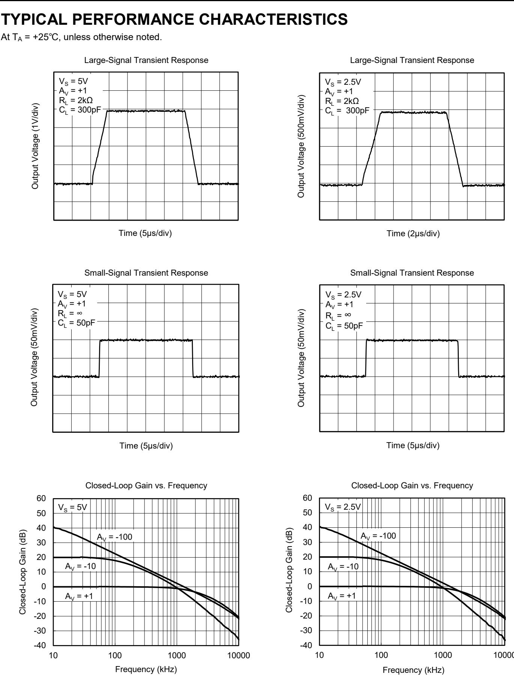

# TYPICAL PERFORMANCE CHARACTERISTICS (continued)

At ${ \sf T } _ { \sf A } = + 2 5 ^ { \circ } { \sf C }$ , unless otherwise noted.

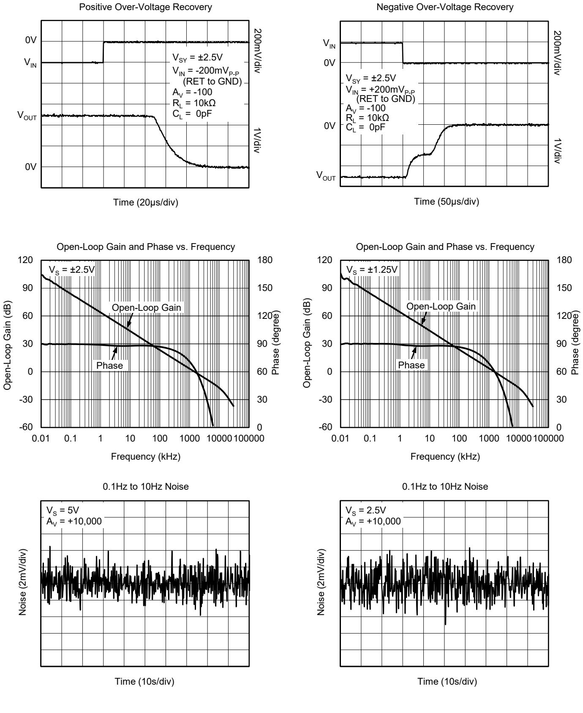

# TYPICAL PERFORMANCE CHARACTERISTICS (continued)

At ${ \sf T } _ { \sf A } = + 2 5 ^ { \circ } { \sf C }$ , unless otherwise noted.

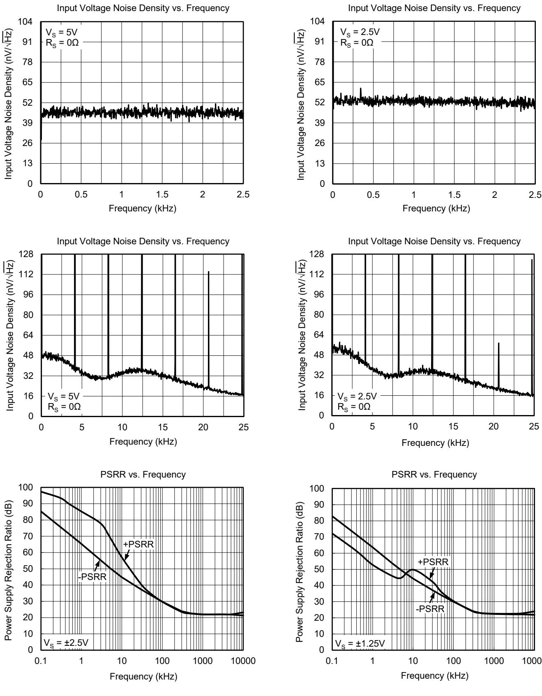

# TYPICAL PERFORMANCE CHARACTERISTICS (continued)

At ${ \sf T } _ { \sf A } = + 2 5 ^ { \circ } { \sf C }$ , unless otherwise noted.

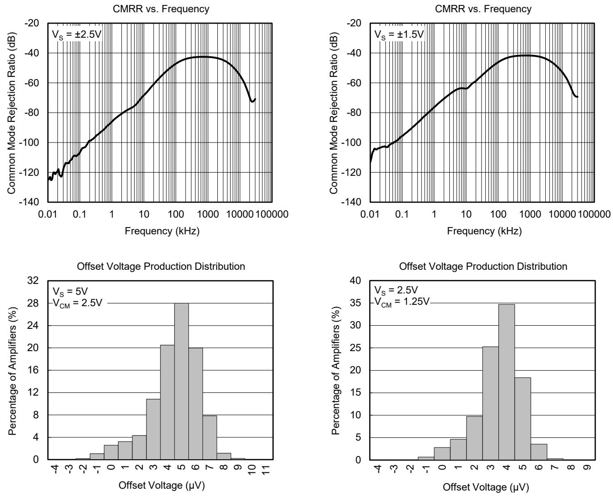

# REVISION HISTORY

NOTE: Page numbers for previous revisions may differ from page numbers in the current version.

DECEMBER 2023 ‒ REV.A.4 to REV.B

Page

Updated Absolute Maximum Ratings section.................... ......................................... ...................................... ..... 2   
Updated Electrical Characteristics section ...................................... .................................................... .................................................... ...... 3, 4   
Updated Typical Performance Characteristics section .. .... 6, 8

# JANUARY 2013 ‒ REV.A.3 to REV.A.4

# Page

Added Tape and Reel Information section .. .. 12, 13

# DECEMBER 2011 ‒ REV.A.2 to REV.A.3

# Page

Changed Electrical Characteristics section . ......................................... .... 3, 4   
Changed Typical Performance Characteristics section ......................................... ......................................... ....... 7   
Changed Package Outline Dimensions section . .. 9, 10

# MAY 2011 ‒ REV.A.1 to REV.A.2

# Page

Changed packages’ name.... ... All

APRIL 2010 ‒ REV.A to REV.A.1 Page

Changed Typical Performance Characteristics section .. . 8

Changes from Original (MARCH 2010) to REV.A Page

Changed from product preview to production data.. . All

# PACKAGE OUTLINE DIMENSIONS SOIC-8

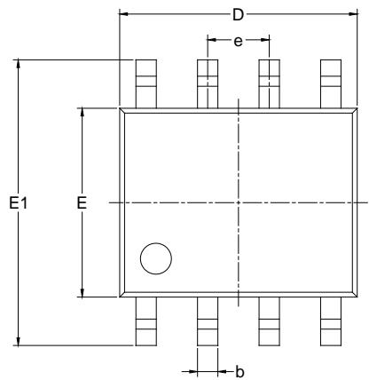

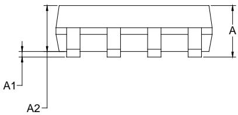

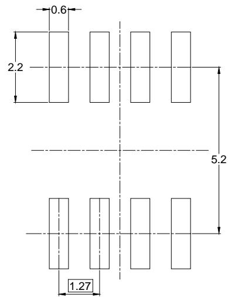  
RECOMMENDED LAND PATTERN (Unit: mm)

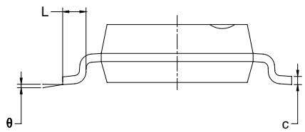

<table><tr><td rowspan=2 colspan=1>Symbol</td><td rowspan=1 colspan=2>DimensionsIn Millimeters</td><td rowspan=1 colspan=2>DimensionsIn Inches</td></tr><tr><td rowspan=1 colspan=1>MIN</td><td rowspan=1 colspan=1>MAX</td><td rowspan=1 colspan=1>MIN</td><td rowspan=1 colspan=1>MAX</td></tr><tr><td rowspan=1 colspan=1>A</td><td rowspan=1 colspan=1>1.350</td><td rowspan=1 colspan=1>1.750</td><td rowspan=1 colspan=1>0.053</td><td rowspan=1 colspan=1>0.069</td></tr><tr><td rowspan=1 colspan=1>A1</td><td rowspan=1 colspan=1>0.100</td><td rowspan=1 colspan=1>0.250</td><td rowspan=1 colspan=1>0.004</td><td rowspan=1 colspan=1>0.010</td></tr><tr><td rowspan=1 colspan=1>A2</td><td rowspan=1 colspan=1>1.350</td><td rowspan=1 colspan=1>1.550</td><td rowspan=1 colspan=1>0.053</td><td rowspan=1 colspan=1>0.061</td></tr><tr><td rowspan=1 colspan=1>b</td><td rowspan=1 colspan=1>0.330</td><td rowspan=1 colspan=1>0.510</td><td rowspan=1 colspan=1>0.013</td><td rowspan=1 colspan=1>0.020</td></tr><tr><td rowspan=1 colspan=1>c</td><td rowspan=1 colspan=1>0.170</td><td rowspan=1 colspan=1>0.250</td><td rowspan=1 colspan=1>0.006</td><td rowspan=1 colspan=1>0.010</td></tr><tr><td rowspan=1 colspan=1>D</td><td rowspan=1 colspan=1>4.700</td><td rowspan=1 colspan=1>5.100</td><td rowspan=1 colspan=1>0.185</td><td rowspan=1 colspan=1>0.200</td></tr><tr><td rowspan=1 colspan=1>E</td><td rowspan=1 colspan=1>3.800</td><td rowspan=1 colspan=1>4.000</td><td rowspan=1 colspan=1>0.150</td><td rowspan=1 colspan=1>0.157</td></tr><tr><td rowspan=1 colspan=1>E1</td><td rowspan=1 colspan=1>5.800</td><td rowspan=1 colspan=1>6.200</td><td rowspan=1 colspan=1>0.228</td><td rowspan=1 colspan=1>0.244</td></tr><tr><td rowspan=1 colspan=1>e</td><td rowspan=1 colspan=2>1.27 BSC</td><td rowspan=1 colspan=2>0.050 BSC</td></tr><tr><td rowspan=1 colspan=1>L</td><td rowspan=1 colspan=1>0.400</td><td rowspan=1 colspan=1>1.270</td><td rowspan=1 colspan=1>0.016</td><td rowspan=1 colspan=1>0.050</td></tr><tr><td rowspan=1 colspan=1>θ</td><td rowspan=1 colspan=1>0°</td><td rowspan=1 colspan=1>8°</td><td rowspan=1 colspan=1>0°</td><td rowspan=1 colspan=1>8°</td></tr></table>

NOTES: 1. Body dimensions do not include mode flash or protrusion. 2. This drawing is subject to change without notice.

# PACKAGE OUTLINE DIMENSIONS

# MSOP-8

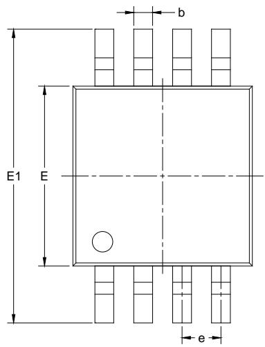

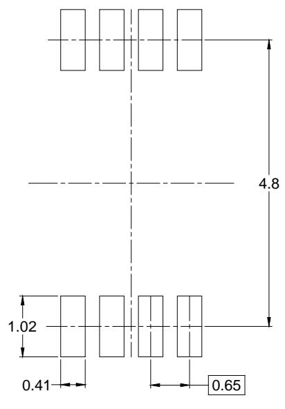  
RECOMMENDED LAND PATTERN (Unit: mm)

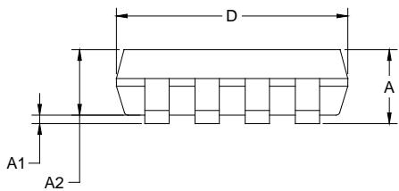

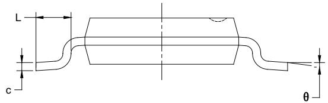

<table><tr><td rowspan=2 colspan=1>Symbol</td><td rowspan=1 colspan=2>DimensionsIn Millimeters</td><td rowspan=1 colspan=2>DimensionsIn Inches</td></tr><tr><td rowspan=1 colspan=1>MIN</td><td rowspan=1 colspan=1>MAX</td><td rowspan=1 colspan=1>MIN</td><td rowspan=1 colspan=1>MAX</td></tr><tr><td rowspan=1 colspan=1>A</td><td rowspan=1 colspan=1>0.820</td><td rowspan=1 colspan=1>1.100</td><td rowspan=1 colspan=1>0.032</td><td rowspan=1 colspan=1>0.043</td></tr><tr><td rowspan=1 colspan=1>A1</td><td rowspan=1 colspan=1>0.020</td><td rowspan=1 colspan=1>0.150</td><td rowspan=1 colspan=1>0.001</td><td rowspan=1 colspan=1>0.006</td></tr><tr><td rowspan=1 colspan=1>A2</td><td rowspan=1 colspan=1>0.750</td><td rowspan=1 colspan=1>0.950</td><td rowspan=1 colspan=1>0.030</td><td rowspan=1 colspan=1>0.037</td></tr><tr><td rowspan=1 colspan=1>b</td><td rowspan=1 colspan=1>0.250</td><td rowspan=1 colspan=1>0.380</td><td rowspan=1 colspan=1>0.010</td><td rowspan=1 colspan=1>0.015</td></tr><tr><td rowspan=1 colspan=1>c</td><td rowspan=1 colspan=1>0.090</td><td rowspan=1 colspan=1>0.230</td><td rowspan=1 colspan=1>0.004</td><td rowspan=1 colspan=1>0.009</td></tr><tr><td rowspan=1 colspan=1>D</td><td rowspan=1 colspan=1>2.900</td><td rowspan=1 colspan=1>3.100</td><td rowspan=1 colspan=1>0.114</td><td rowspan=1 colspan=1>0.122</td></tr><tr><td rowspan=1 colspan=1>E</td><td rowspan=1 colspan=1>2.900</td><td rowspan=1 colspan=1>3.100</td><td rowspan=1 colspan=1>0.114</td><td rowspan=1 colspan=1>0.122</td></tr><tr><td rowspan=1 colspan=1>E1</td><td rowspan=1 colspan=1>4.750</td><td rowspan=1 colspan=1>5.050</td><td rowspan=1 colspan=1>0.187</td><td rowspan=1 colspan=1>0.199</td></tr><tr><td rowspan=1 colspan=1>e</td><td rowspan=1 colspan=2>0.650 BSC</td><td rowspan=1 colspan=2>0.026 BSC</td></tr><tr><td rowspan=1 colspan=1>L</td><td rowspan=1 colspan=1>0.400</td><td rowspan=1 colspan=1>0.800</td><td rowspan=1 colspan=1>0.016</td><td rowspan=1 colspan=1>0.031</td></tr><tr><td rowspan=1 colspan=1>θ</td><td rowspan=1 colspan=1>0°</td><td rowspan=1 colspan=1>6°</td><td rowspan=1 colspan=1>0°</td><td rowspan=1 colspan=1>6°</td></tr></table>

NOTES: 1. Body dimensions do not include mode flash or protrusion. 2. This drawing is subject to change without notice.

# TAPE AND REEL INFORMATION

REEL DIMENSIONS

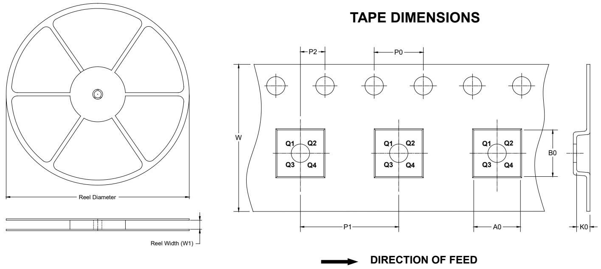

NOTE: The picture is only for reference. Please make the object as the standard.

# KEY PARAMETER LIST OF TAPE AND REEL

<table><tr><td rowspan=1 colspan=1>Package Type</td><td rowspan=1 colspan=1>ReelDiameter</td><td rowspan=1 colspan=1>Reel WidthW1(mm)</td><td rowspan=1 colspan=1>A0(mm)</td><td rowspan=1 colspan=1>BO(mm)</td><td rowspan=1 colspan=1>KO(mm)</td><td rowspan=1 colspan=1>PO(mm)</td><td rowspan=1 colspan=1>P1(mm)</td><td rowspan=1 colspan=1>P2(mm)</td><td rowspan=1 colspan=1>W(mm)</td><td rowspan=1 colspan=1>Pin1Quadrant</td></tr><tr><td rowspan=1 colspan=1>SOIC-8</td><td rowspan=1 colspan=1>13&quot;</td><td rowspan=1 colspan=1>12.4</td><td rowspan=1 colspan=1>6.40</td><td rowspan=1 colspan=1>5.40</td><td rowspan=1 colspan=1>2.10</td><td rowspan=1 colspan=1>4.0</td><td rowspan=1 colspan=1>8.0</td><td rowspan=1 colspan=1>2.0</td><td rowspan=1 colspan=1>12.0</td><td rowspan=1 colspan=1>Q1</td></tr><tr><td rowspan=1 colspan=1>MSOP-8</td><td rowspan=1 colspan=1>13&quot;</td><td rowspan=1 colspan=1>12.4</td><td rowspan=1 colspan=1>5.20</td><td rowspan=1 colspan=1>3.30</td><td rowspan=1 colspan=1>1.50</td><td rowspan=1 colspan=1>4.0</td><td rowspan=1 colspan=1>8.0</td><td rowspan=1 colspan=1>2.0</td><td rowspan=1 colspan=1>12.0</td><td rowspan=1 colspan=1>Q1</td></tr></table>

# CARTON BOX DIMENSIONS

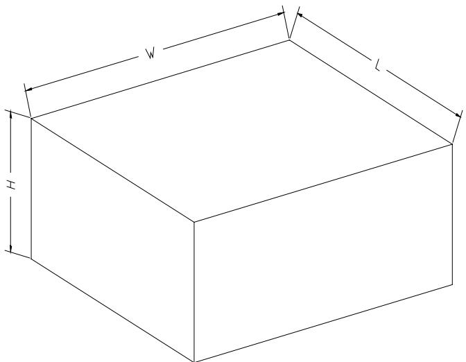  
NOTE: The picture is only for reference. Please make the object as the standard.

# KEY PARAMETER LIST OF CARTON BOX

<table><tr><td rowspan=1 colspan=1>Reel Type</td><td rowspan=1 colspan=1>Length(mm)</td><td rowspan=1 colspan=1>Width(mm)</td><td rowspan=1 colspan=1>Height(mm)</td><td rowspan=1 colspan=1>Pizza/Carton</td><td rowspan=1 colspan=1></td></tr><tr><td rowspan=1 colspan=1>13&quot;</td><td rowspan=1 colspan=1>386</td><td rowspan=1 colspan=1>280</td><td rowspan=1 colspan=1>370</td><td rowspan=1 colspan=1>5</td><td rowspan=1 colspan=1>DD0002</td></tr></table>