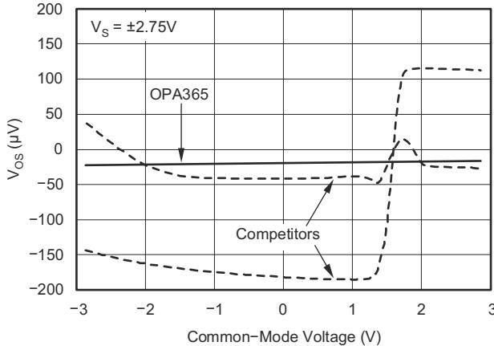

# OPAx365 50-MHz, Zerø-Crossover, Low-Distortion, High-CMRR, RRI/O, Single-Supply Operational Amplifiers

# 1 Features

• Gain bandwidth: 50 MHz • Zerø-crossover distortion topology:

Excellent $T H \mathsf { D } { + } \mathsf { N }$ : $0 . 0 0 0 4 \%$ CMRR: 100 dB (minimum) Rail-to-rail input and output • Input $1 0 0 ~ \mathsf { m V }$ beyond supply rail • Low noise: $4 . 5 \ : \mathsf { n V } / \sqrt { \mathsf { H } z }$ at $1 0 0 ~ \mathsf { k H z }$ • Slew rate: $2 5 \vee / \mu \ s$ • Fast settling: $0 . 3 \mu \mathsf { s }$ to $0 . 0 1 \%$ • Precision: – Low offset: $1 0 0 \mu \nu$ – Low input bias current: 0.2 pA • 2.2-V to 5.5-V operation

# 2 Applications

Signal conditioning Data acquisition • Process control • Active filters , Test equipment • Audio Wideband amplifiers

# 3 Description

The OPA365 and OPA2365 (OPAx365) zerø- crossover series, rail-to-rail, high-performance, CMOS operational amplifiers are optimized for very low voltage, single-supply applications. Rail-to-rail input or output, low-noise (4.5 nV/√Hz), and high-speed operation (50-MHz gain bandwidth) make these devices an excellent choice for driving sampling analog-to-digital converters (ADCs). Applications include audio, signal conditioning, and sensor amplification.

Special features include an excellent common-mode rejection ratio (CMRR), no input stage crossover distortion, high input impedance, and rail-to-rail input and output swing. The input common-mode range includes both the negative and positive supplies. The output voltage swing is within $1 0 ~ \mathsf { m V }$ of the rails.

The OPA365 (single version) is available in the microsize SOT23-5 (SOT-5) and SOIC-8 packages. The OPA2365 (dual version) is offered in the SOIC-8 package. All versions are specified for operation from $- 4 0 ^ { \circ } \mathsf { C }$ to $+ 1 2 5 ^ { \circ } \mathrm { C }$ . Single and dual versions have identical specifications for maximum design flexibility.

Device Information   

<table><tr><td rowspan=1 colspan=1>PART NUMBER</td><td rowspan=1 colspan=1>CHANNEL COUNT</td><td rowspan=1 colspan=1>PACKAGE(1)</td></tr><tr><td rowspan=2 colspan=1>OPA365</td><td rowspan=2 colspan=1>Single</td><td rowspan=1 colspan=1>D (SOIC, 8)</td></tr><tr><td rowspan=1 colspan=1>DBV (SOT-23, 5)</td></tr><tr><td rowspan=1 colspan=1>OPA2365</td><td rowspan=1 colspan=1>Dual</td><td rowspan=1 colspan=1>D (SOIC, 8)</td></tr></table>

(1) For all available packages, see the orderable addendum at the end of the data sheet.

  
Copyright $\circledcirc$ 2016, Texas Instruments Incorporated

# Table of Contents

# 1 Features.. 1

2 Applications.. 1   
3 Description.. .1   
4 Revision History.. . 2   
5 Device Comparison Table. .3   
6 Pin Configuration and Functions. .4   
7 Specifications.. . 5   
7.1 Absolute Maximum Ratings.. . 5   
7.2 ESD Ratings.. 5   
7.3 Recommended Operating Conditions... . 5   
7.4 Thermal Information: OPA365.. 5   
7.5 Thermal Information: OPA2365... 6   
7.6 Electrical Characteristics.. .6   
7.7 Typical Characteristics.. 8

# 8 Detailed Description.. .12

8.1 Overview.. . 12   
8.2 Functional Block Diagram.. . 12..13   
8.3 Feature Description..

# 9 Application and Implementation.. 17

9.1 Application Information.. 17   
9.2 Typical Application. . 18. 19   
9.3 System Examples..   
9.4 Power Supply Recommendations.. . 21   
9.5 Layout... . 21

# 10 Device and Documentation Support.. .23

10.1 Device Support.. 23   
10.2 Documentation Support.. 24   
10.3 Receiving Notification of Documentation Updates..24   
10.4 Support Resources.. 24   
10.5 Trademarks.. .24   
10.6 Electrostatic Discharge Caution.. .24   
10.7 Glossary.... .24

# 11 Mechanical, Packaging, and Orderable

Information.. 24

# 4 Revision History

NOTE: Page numbers for previous revisions may differ from page numbers in the current version.

Changes from Revision F (April 2020) to Revision G (May 2023)

• Updated the numbering format for tables, figures, and cross-references throughout the document.. 1   
• Added new row for ${ \mathsf { T L V } } { \times } 3 6 5$ in Device Comparison Table . 3

Changes from Revision E (August 2016) to Revision F (April 2020) Page

• Added Device Comparison Table . 3

# Changes from Revision D (June 2009) to Revision E (August 2016) Page

Added ESD Ratings table, Feature Description section, Device Functional Modes, Application and Implementation section, Power Supply Recommendations section, Layout section, Device and Documentation Support section, and Mechanical, Packaging, and Orderable Information section. 1 Added current package designators to last paragraph of Description section .

# 5 Device Comparison Table

<table><tr><td rowspan=1 colspan=1>DEVICE</td><td rowspan=1 colspan=1>INPUT TYPE</td><td rowspan=1 colspan=1>OFFSETDRIFT,TYPICAL(μV/C)</td><td rowspan=1 colspan=1>MINIMUM GAINSTABLE</td><td rowspan=1 colspan=1>IQ/CHANNEL,TYPICAL (mA)</td><td rowspan=1 colspan=1>GAINBANDWIDTH(MHz)</td><td rowspan=1 colspan=1>SLEW RATE(V/μs)</td><td rowspan=1 colspan=1>VOLTAGENOISE (nV/√Hz)</td></tr><tr><td rowspan=1 colspan=1>OPAx365</td><td rowspan=1 colspan=1>CMOS</td><td rowspan=1 colspan=1>1</td><td rowspan=1 colspan=1>1 V/V</td><td rowspan=1 colspan=1>4.6</td><td rowspan=1 colspan=1>50</td><td rowspan=1 colspan=1>25</td><td rowspan=1 colspan=1>4.5</td></tr><tr><td rowspan=1 colspan=1>TLVx365</td><td rowspan=1 colspan=1>CMOS</td><td rowspan=1 colspan=1>0.4</td><td rowspan=1 colspan=1>1 V/V</td><td rowspan=1 colspan=1>4.6</td><td rowspan=1 colspan=1>50</td><td rowspan=1 colspan=1>27</td><td rowspan=1 colspan=1>4.5</td></tr><tr><td rowspan=1 colspan=1>OPAx607</td><td rowspan=1 colspan=1>CMOS</td><td rowspan=1 colspan=1>0.3</td><td rowspan=1 colspan=1>6 V/V</td><td rowspan=1 colspan=1>0.9</td><td rowspan=1 colspan=1>50</td><td rowspan=1 colspan=1>24</td><td rowspan=1 colspan=1>3.8</td></tr><tr><td rowspan=1 colspan=1>OPAx837</td><td rowspan=1 colspan=1>Bipolar</td><td rowspan=1 colspan=1>0.4</td><td rowspan=1 colspan=1>1 V/V</td><td rowspan=1 colspan=1>0.6</td><td rowspan=1 colspan=1>50</td><td rowspan=1 colspan=1>105</td><td rowspan=1 colspan=1>4.7</td></tr></table>

# 6 Pin Configuration and Functions

  
Figure 6-1. OPA365: DBV Package, 5-Pin SOT-23 (Top View)

(1) NC denotes no internal connection.

  
Figure 6-2. OPA365: D Package, 8-Pin SOIC (Top View)

Pin Functions: OPA365   

<table><tr><td rowspan=1 colspan=3>PIN</td><td rowspan=2 colspan=1>TYPE</td><td rowspan=2 colspan=1>DESCRIPTION</td></tr><tr><td rowspan=1 colspan=1>NAME</td><td rowspan=1 colspan=1>SOIC</td><td rowspan=1 colspan=1>SOT</td></tr><tr><td rowspan=1 colspan=1>-IN</td><td rowspan=1 colspan=1>2</td><td rowspan=1 colspan=1>4</td><td rowspan=1 colspan=1>Input</td><td rowspan=1 colspan=1>Negative (inverting) input</td></tr><tr><td rowspan=1 colspan=1>+IN</td><td rowspan=1 colspan=1>3</td><td rowspan=1 colspan=1>3</td><td rowspan=1 colspan=1>Input</td><td rowspan=1 colspan=1>Positive (noninverting) input</td></tr><tr><td rowspan=1 colspan=1>NC</td><td rowspan=1 colspan=1>1,5,8</td><td rowspan=1 colspan=1>−</td><td rowspan=1 colspan=1></td><td rowspan=1 colspan=1>No internal connection (can be left floating)</td></tr><tr><td rowspan=1 colspan=1>V-</td><td rowspan=1 colspan=1>4</td><td rowspan=1 colspan=1>2</td><td rowspan=1 colspan=1>−</td><td rowspan=1 colspan=1>Negative (lowest) power supply</td></tr><tr><td rowspan=1 colspan=1>V+</td><td rowspan=1 colspan=1>7</td><td rowspan=1 colspan=1>5</td><td rowspan=1 colspan=1></td><td rowspan=1 colspan=1>Positive (highest) power supply</td></tr><tr><td rowspan=1 colspan=1>VoUT</td><td rowspan=1 colspan=1>6</td><td rowspan=1 colspan=1>1</td><td rowspan=1 colspan=1>Output</td><td rowspan=1 colspan=1>Output</td></tr></table>

  
Figure 6-3. OPA2365: D Package, 8-Pin SOIC (Top View)

Pin Functions: OPA2365   

<table><tr><td rowspan=1 colspan=2>PIN</td><td rowspan=2 colspan=1>TYPE</td><td rowspan=2 colspan=1>DESCRIPTION</td></tr><tr><td rowspan=1 colspan=1>NAME</td><td rowspan=1 colspan=1>NO.</td></tr><tr><td rowspan=1 colspan=1>-IN A</td><td rowspan=1 colspan=1>2</td><td rowspan=1 colspan=1>Input</td><td rowspan=1 colspan=1>Negative (inverting) input signal, channel A</td></tr><tr><td rowspan=1 colspan=1>+IN A</td><td rowspan=1 colspan=1>3</td><td rowspan=1 colspan=1>Input</td><td rowspan=1 colspan=1>Positive (noninverting) input signal, channel A</td></tr><tr><td rowspan=1 colspan=1>-IN B</td><td rowspan=1 colspan=1>6</td><td rowspan=1 colspan=1>Input</td><td rowspan=1 colspan=1>Negative (inverting) input signal, channel B</td></tr><tr><td rowspan=1 colspan=1>+IN B</td><td rowspan=1 colspan=1>5</td><td rowspan=1 colspan=1>Input</td><td rowspan=1 colspan=1>Positive (noninverting) input signal, channel B</td></tr><tr><td rowspan=1 colspan=1>V-</td><td rowspan=1 colspan=1>4</td><td rowspan=1 colspan=1>−</td><td rowspan=1 colspan=1>Negative (lowest) power supply</td></tr><tr><td rowspan=1 colspan=1>V+</td><td rowspan=1 colspan=1>8</td><td rowspan=1 colspan=1>−</td><td rowspan=1 colspan=1>Positive (highest) power supply</td></tr><tr><td rowspan=1 colspan=1>VoOUTA</td><td rowspan=1 colspan=1>1</td><td rowspan=1 colspan=1>Output</td><td rowspan=1 colspan=1>Output, channel A</td></tr><tr><td rowspan=1 colspan=1>VoUTB</td><td rowspan=1 colspan=1>7</td><td rowspan=1 colspan=1>Output</td><td rowspan=1 colspan=1>Output, channel B</td></tr></table>

# 7 Specifications 7.1 Absolute Maximum Ratings

Over operating free-air temperature range (unless otherwise noted).(1)

<table><tr><td></td><td></td><td rowspan=1 colspan=1>MIN       MAX</td><td rowspan=1 colspan=1>UNIT</td></tr><tr><td rowspan=2 colspan=1>Voltage</td><td rowspan=1 colspan=1>Supply voltage</td><td rowspan=1 colspan=1>5.5</td><td rowspan=1 colspan=1>V</td></tr><tr><td rowspan=1 colspan=1>Signal input terminals, voltage(2)</td><td rowspan=1 colspan=1>-0.5       0.5</td><td rowspan=1 colspan=1>V</td></tr><tr><td rowspan=2 colspan=1>Current</td><td rowspan=1 colspan=1>Signal input terminals, current(2)</td><td rowspan=1 colspan=1>-10        10</td><td rowspan=1 colspan=1>mA</td></tr><tr><td rowspan=1 colspan=1>Output short-circuit(3)</td><td rowspan=1 colspan=1>Continuous</td><td rowspan=1 colspan=1></td></tr><tr><td rowspan=3 colspan=1>Temperature</td><td rowspan=1 colspan=1>Operating, TA</td><td rowspan=1 colspan=1>-40       150</td><td rowspan=1 colspan=1>°C</td></tr><tr><td rowspan=1 colspan=1>Junction, Tj</td><td rowspan=1 colspan=1>150</td><td rowspan=1 colspan=1>°C</td></tr><tr><td rowspan=1 colspan=1>Storage, Tstg</td><td rowspan=1 colspan=1>-65       150</td><td rowspan=1 colspan=1>°C</td></tr></table>

(1) Stresses beyond those listed under Absolute Maximum Ratings may cause permanent damage to the device. These are stress ratings only, which do not imply functional operation of the device at these or any other conditions beyond those indicated under Recommended Operating Conditions. Exposure to absolute-maximum-rated conditions for extended periods may affect device reliability.   
(2) Input terminals are diode-clamped to the power-supply rails. Input signals that can swing more than $0 . 5 \lor$ beyond the supply rails should be current limited to $1 0 ~ \mathsf { m A }$ or less.   
(3) Short-circuit to ground, one amplifier per package.

# 7.2 ESD Ratings

<table><tr><td></td><td></td><td></td><td rowspan=1 colspan=1>VALUE</td><td rowspan=1 colspan=1>UNIT</td></tr><tr><td rowspan=3 colspan=1>V(ESD)</td><td rowspan=3 colspan=1>Electrostatic discharge</td><td rowspan=1 colspan=1>Human-body model (HBM), per ANSI/ESDA/JEDEC JS-001(1)</td><td rowspan=1 colspan=1>±4000</td><td rowspan=3 colspan=1>V</td></tr><tr><td rowspan=1 colspan=1>Charged-device model (CDM), per JEDEC specification JESD22-C101(2)</td><td rowspan=1 colspan=1>±1000</td></tr><tr><td rowspan=1 colspan=1>Machine model</td><td rowspan=1 colspan=1>±400</td></tr></table>

(1) JEDEC document JEP155 states that 500-V HBM allows safe manufacturing with a standard ESD control process.   
(2) JEDEC document JEP157 states that 250-V CDM allows safe manufacturing with a standard ESD control process.

# 7.3 Recommended Operating Conditions

Over operating free-air temperature range (unless otherwise noted).

<table><tr><td></td><td>MIN</td><td>NOM MAX</td><td>UNIT</td></tr><tr><td>Power supply voltage, (V+) - (V)</td><td>2.2</td><td>5.5</td><td>V</td></tr><tr><td>Specified temperature</td><td>-40</td><td>+125</td><td>°C</td></tr><tr><td>Operating temperature</td><td>-40</td><td>+150</td><td>°C</td></tr></table>

# 7.4 Thermal Information: OPA365

<table><tr><td rowspan=3 colspan=2>THERMAL METRIC(1)</td><td rowspan=1 colspan=2>OPA365</td><td rowspan=3 colspan=1>UNIT</td></tr><tr><td rowspan=1 colspan=1>DBV (SOT-23)</td><td rowspan=1 colspan=1>D (SOIC)</td></tr><tr><td rowspan=1 colspan=1>5 PINS</td><td rowspan=1 colspan=1>8 PINS</td></tr><tr><td rowspan=1 colspan=1>RθJA</td><td rowspan=1 colspan=1>Junction-to-ambient thermal resistance</td><td rowspan=1 colspan=1>206.9</td><td rowspan=1 colspan=1>140.1</td><td rowspan=1 colspan=1>°C/W</td></tr><tr><td rowspan=1 colspan=1>ReJC(top)</td><td rowspan=1 colspan=1>Junction-to-case (top) thermal resistance</td><td rowspan=1 colspan=1>69.4</td><td rowspan=1 colspan=1>89.8</td><td rowspan=1 colspan=1>°C/W</td></tr><tr><td rowspan=1 colspan=1>RθJB</td><td rowspan=1 colspan=1>Junction-to-board thermal resistance</td><td rowspan=1 colspan=1>34.2</td><td rowspan=1 colspan=1>80.6</td><td rowspan=1 colspan=1>°C/W</td></tr><tr><td rowspan=1 colspan=1>4JT</td><td rowspan=1 colspan=1>Junction-to-top characterization parameter</td><td rowspan=1 colspan=1>1.8</td><td rowspan=1 colspan=1>28.7</td><td rowspan=1 colspan=1>°C/W</td></tr><tr><td rowspan=1 colspan=1>4JBr$</td><td rowspan=1 colspan=1>Junction-to-board characterization parameter</td><td rowspan=1 colspan=1>33.9</td><td rowspan=1 colspan=1>80.1</td><td rowspan=1 colspan=1>°C/W</td></tr><tr><td rowspan=1 colspan=1>ReJC(bot)</td><td rowspan=1 colspan=1>Junction-to-case (bottom) thermal resistance</td><td rowspan=1 colspan=1>N/A</td><td rowspan=1 colspan=1>N/A</td><td rowspan=1 colspan=1>°C/W</td></tr></table>

(1) For more information about traditional and new thermal metrics, see the Semiconductor and IC Package Thermal Metrics application report.

# 7.5 Thermal Information: OPA2365

<table><tr><td rowspan=3 colspan=2>THERMAL METRIC(1)</td><td rowspan=1 colspan=1>OPA2365</td><td rowspan=3 colspan=1>UNIT</td></tr><tr><td rowspan=1 colspan=1>D (SOIC)</td></tr><tr><td rowspan=1 colspan=1>8 PINS</td></tr><tr><td rowspan=1 colspan=1>RθJA</td><td rowspan=1 colspan=1>Junction-to-ambient thermal resistance</td><td rowspan=1 colspan=1>115.5</td><td rowspan=1 colspan=1>°C/W</td></tr><tr><td rowspan=1 colspan=1>ReJC(top)</td><td rowspan=1 colspan=1>Junction-to-case (top) thermal resistance</td><td rowspan=1 colspan=1>60.1</td><td rowspan=1 colspan=1>°C/W</td></tr><tr><td rowspan=1 colspan=1>RθJB</td><td rowspan=1 colspan=1>Junction-to-board thermal resistance</td><td rowspan=1 colspan=1>56.9</td><td rowspan=1 colspan=1>°C/W</td></tr><tr><td rowspan=1 colspan=1>4\qr$</td><td rowspan=1 colspan=1>Junction-to-top characterization parameter</td><td rowspan=1 colspan=1>9.5</td><td rowspan=1 colspan=1>°C/W</td></tr><tr><td rowspan=1 colspan=1>4JB$</td><td rowspan=1 colspan=1>Junction-to-board characterization parameter</td><td rowspan=1 colspan=1>56.3</td><td rowspan=1 colspan=1>°C/W</td></tr><tr><td rowspan=1 colspan=1>ReJC(bot)</td><td rowspan=1 colspan=1>Junction-to-case (bottom) thermal resistance</td><td rowspan=1 colspan=1>N/A</td><td rowspan=1 colspan=1>°C/W</td></tr></table>

(1) For more information about traditional and new thermal metrics, see the Semiconductor and IC Package Thermal Metrics application report.

# 7.6 Electrical Characteristics

at $\mathsf { T } _ { \mathsf { A } } = 2 5 ^ { \circ } \mathsf { C }$ , $\mathsf { R } _ { \mathsf { L } } = 1 0 ~ \mathsf { k } \Omega$ connected to ${ \tt V } _ { \tt S } / 2$ , $\mathsf { V } _ { \mathsf { C M } } = \mathsf { V } _ { \mathsf { S } } / 2$ , and $\mathsf { V } _ { \mathsf { O U T } } = \mathsf { V } _ { \mathsf { S } } / 2$ (unless otherwise noted)   

<table><tr><td rowspan=1 colspan=2>PARAMETER</td><td rowspan=1 colspan=1>TEST CONDITIONS</td><td rowspan=1 colspan=1>MIN    TYP   MAX</td><td rowspan=1 colspan=1>UNIT</td></tr><tr><td rowspan=1 colspan=5>OFFSET VOLTAGE</td></tr><tr><td rowspan=1 colspan=1>Vos</td><td rowspan=1 colspan=1> Input offset voltage</td><td rowspan=1 colspan=1></td><td rowspan=1 colspan=1>100     200</td><td rowspan=1 colspan=1>μV</td></tr><tr><td rowspan=1 colspan=1>dVos/aT</td><td rowspan=1 colspan=1>Input offset voltage versus drift</td><td rowspan=1 colspan=1>At TA = -40°C to +125°</td><td rowspan=1 colspan=1>1</td><td rowspan=1 colspan=1>μV/C</td></tr><tr><td rowspan=1 colspan=1>PSRR</td><td rowspan=1 colspan=1>Input offset voltage versus powersupply</td><td rowspan=1 colspan=1>Vs= 2.2 V to 5.5 V,at TA = -40°C to +125°</td><td rowspan=1 colspan=1>10</td><td rowspan=1 colspan=1>μVN</td></tr><tr><td rowspan=1 colspan=1></td><td rowspan=1 colspan=1>Channel separation, DC</td><td rowspan=1 colspan=1></td><td rowspan=1 colspan=1>0.2</td><td rowspan=1 colspan=1>μV/√</td></tr></table>

# INPUT BIAS CURRENT

<table><tr><td rowspan=2 colspan=1>IB</td><td rowspan=2 colspan=1>Input bias current</td><td rowspan=1 colspan=1></td><td rowspan=1 colspan=1></td><td rowspan=1 colspan=1>±0.2    ±10</td><td rowspan=1 colspan=1>pA</td></tr><tr><td rowspan=1 colspan=1>Over temperature</td><td rowspan=1 colspan=1>Over temperature At TA = -40°C to +125°</td><td rowspan=1 colspan=1>See Section 7.7</td><td rowspan=1 colspan=1></td></tr><tr><td rowspan=1 colspan=1>los</td><td rowspan=1 colspan=2>Input offset current</td><td rowspan=1 colspan=1></td><td rowspan=1 colspan=1>±0.2    ±10</td><td rowspan=1 colspan=1>pA</td></tr></table>

NOISE

<table><tr><td rowspan=1 colspan=1>en</td><td rowspan=1 colspan=1>Input voltage noise</td><td rowspan=1 colspan=1>f = 0.1 Hz to 10 Hz</td><td rowspan=1 colspan=1>5</td><td rowspan=1 colspan=1>μVpp</td></tr><tr><td rowspan=1 colspan=1>en</td><td rowspan=1 colspan=1>Input voltage noise density</td><td rowspan=1 colspan=1>f = 100 kHz</td><td rowspan=1 colspan=1>4.5</td><td rowspan=1 colspan=1>nV/√Hz</td></tr><tr><td rowspan=1 colspan=1>in</td><td rowspan=1 colspan=1>Input current noise density</td><td rowspan=1 colspan=1>f = 10 kHz</td><td rowspan=1 colspan=1>4</td><td rowspan=1 colspan=1>fA/√Hz</td></tr></table>

# INPUT VOLTAGE RANGE

<table><tr><td rowspan=1 colspan=1>VcM</td><td rowspan=1 colspan=1>Common-mode voltage range</td><td rowspan=1 colspan=1></td><td rowspan=1 colspan=1>(V+) +(V-) - 0.10.1</td><td rowspan=1 colspan=1>V</td></tr><tr><td rowspan=1 colspan=1>CMRR</td><td rowspan=1 colspan=1>Common-mode rejection ratio</td><td rowspan=1 colspan=1>(V-) - 0.1 V ≤ VcM ≤ (V+) + 0.1 V,at TA = -40°C to +125°</td><td rowspan=1 colspan=1>100     120</td><td rowspan=1 colspan=1>dB</td></tr></table>

# INPUT CAPACITANCE

<table><tr><td rowspan=1 colspan=1>Differential</td><td rowspan=1 colspan=1></td><td rowspan=1 colspan=1>6</td><td rowspan=1 colspan=1>pF</td></tr><tr><td rowspan=1 colspan=1>Common-mode</td><td rowspan=1 colspan=1></td><td rowspan=1 colspan=1>2</td><td rowspan=1 colspan=1>pF</td></tr></table>

# OPEN-LOOP GAIN

<table><tr><td rowspan="4">AOL</td><td rowspan="4">Open-loop voltage gain</td><td>RL = 10 kΩ, 100 mV &lt; Vo &lt; (V+) - 100 mV, at TA = -40° to +125°</td><td>100</td><td>120</td><td rowspan="4">dB</td></tr><tr><td>RL = 600 Ω, 200 mV &lt; Vo &lt; (V+) - 200 mV</td><td>100</td><td>120</td></tr><tr><td>RL = 600 Ω, 200 mV &lt; Vo &lt; (V+) - 200 mV,</td><td></td><td></td></tr><tr><td>at TA = -40°C to +125°</td><td>94</td><td></td></tr></table>

# 7.6 Electrical Characteristics (continued)

at $\mathsf { T } _ { \mathsf { A } } = 2 5 ^ { \circ } \mathsf { C }$ , $\mathsf { R } _ { \mathsf { L } } = 1 0 ~ \mathsf { k } \Omega$ connected to ${ \tt V } _ { \tt S } / 2$ , $\mathsf { V } _ { \mathsf { C M } } = \mathsf { V } _ { \mathsf { S } } / 2$ , and $\mathsf { V } _ { \mathsf { O U T } } = \mathsf { V } _ { \mathsf { S } } / 2$ (unless otherwise noted)

<table><tr><td rowspan=1 colspan=3>PARAMETER</td><td rowspan=1 colspan=1>TEST CONDITIONS</td><td rowspan=1 colspan=1>MIN    TYP    MAX</td><td rowspan=1 colspan=1>UNIT</td></tr><tr><td rowspan=1 colspan=6>FREQUENCY RESPONSE</td></tr><tr><td rowspan=1 colspan=1>GBW</td><td rowspan=1 colspan=2>Gain-bandwidth product</td><td rowspan=1 colspan=1>$V_s}=5 v5$</td><td rowspan=1 colspan=1>50</td><td rowspan=1 colspan=1>MHz</td></tr><tr><td rowspan=1 colspan=1>SR</td><td rowspan=1 colspan=2>Slew rate</td><td rowspan=1 colspan=1>$Vs = 5 V, G = 1$</td><td rowspan=1 colspan=1>25</td><td rowspan=1 colspan=1>V/μs</td></tr><tr><td rowspan=2 colspan=1>ts</td><td rowspan=2 colspan=1>Settling time</td><td rowspan=1 colspan=1>0.1%</td><td rowspan=1 colspan=1>Vs = 5 V, 4-V step, G = +1</td><td rowspan=1 colspan=1>200</td><td rowspan=2 colspan=1>ns</td></tr><tr><td rowspan=1 colspan=1>0.01%</td><td rowspan=1 colspan=1>Vs= 5 V, 4-V step, G = +1</td><td rowspan=1 colspan=1>300</td></tr><tr><td rowspan=1 colspan=1></td><td rowspan=1 colspan=2>Overload recovery time</td><td rowspan=1 colspan=1>Vs = 5 V, ViN × Gain &gt; Vs</td><td rowspan=1 colspan=1>&lt;0.1</td><td rowspan=1 colspan=1>μs</td></tr><tr><td rowspan=1 colspan=1>THD+N</td><td rowspan=1 colspan=2>Total harmonic distortion + noise(1)</td><td rowspan=1 colspan=1>Vs =5V,RL= 600 Ω, Vo = 4 Vpp,G = 1, f= 1 kHz</td><td rowspan=1 colspan=1>0.0004%</td><td rowspan=1 colspan=1></td></tr><tr><td rowspan=1 colspan=1>OUTPUT</td><td></td><td></td><td></td><td rowspan=1 colspan=1></td><td rowspan=1 colspan=1></td></tr><tr><td rowspan=1 colspan=1></td><td rowspan=1 colspan=2>Voltage output swing from rail</td><td rowspan=1 colspan=1>RL= 10 kΩ, Vs = 5.5 V,at TA = -40°C to +125°</td><td rowspan=1 colspan=1>10      20</td><td rowspan=1 colspan=1>mV</td></tr><tr><td rowspan=1 colspan=1>Isc</td><td rowspan=1 colspan=2>Short-circuit current</td><td rowspan=1 colspan=1></td><td rowspan=1 colspan=1>±65</td><td rowspan=1 colspan=1>mA</td></tr><tr><td rowspan=1 colspan=1>CL</td><td rowspan=1 colspan=2>Capacitive load drive</td><td rowspan=1 colspan=1></td><td rowspan=1 colspan=1>See Section 7.7</td><td rowspan=1 colspan=1></td></tr><tr><td rowspan=1 colspan=1></td><td rowspan=1 colspan=2>Open-loop output impedance</td><td rowspan=1 colspan=1>f = 1 MHz, Io = 0 mA</td><td rowspan=1 colspan=1>30</td><td rowspan=1 colspan=1>Q</td></tr><tr><td rowspan=1 colspan=1>POWER SUPPLY</td><td rowspan=1 colspan=2></td><td rowspan=1 colspan=1></td><td rowspan=1 colspan=1></td><td rowspan=1 colspan=1></td></tr><tr><td rowspan=1 colspan=1>V_s$</td><td rowspan=1 colspan=2>Specified voltage range</td><td rowspan=1 colspan=1></td><td rowspan=1 colspan=1>2.2                5.5</td><td rowspan=1 colspan=1>V</td></tr><tr><td rowspan=2 colspan=1>IQ</td><td rowspan=2 colspan=1>Quiescent currentper amplifier</td><td rowspan=1 colspan=1></td><td rowspan=1 colspan=1>lo = 0 mA</td><td rowspan=1 colspan=1>4.6       5</td><td rowspan=2 colspan=1>mA</td></tr><tr><td rowspan=1 colspan=1>Over temperature</td><td rowspan=1 colspan=1>At TA = -40°C to +125°</td><td rowspan=1 colspan=1>5</td></tr></table>

(1) 3rd-order filter; bandwidth $8 0 ~ \mathsf { k H z }$ at $^ { - 3 }$ dB.

# 7.7 Typical Characteristics

  
at $\mathsf { T } _ { \mathsf { A } } = 2 5 ^ { \circ } \mathsf { C }$ , $\mathsf { V } _ { \mathsf { S } } = 5 \mathsf { V }$ , and $\complement _ { \mathrm { L } } = 0$ pF (unless otherwise noted)

  
Figure 7-2. Power-Supply and Common-Mode Rejection Ratio vs Frequency

  
Figure 7-1. Open-Loop Gain and Phase vs Frequency

  
Figure 7-4. Offset Voltage Drift Production Distribution

  
Figure 7-3. Offset Voltage Production Distribution   
Figure 7-5. Input Bias Current vs Temperature

  
Figure 7-6. Input Bias Current vs Common-Mode Voltage

# 7.7 Typical Characteristics (continued)

at $\mathsf { T } _ { \mathsf { A } } = 2 5 ^ { \circ } \mathsf { C }$ , $\mathsf { V } _ { \mathsf { S } } = 5 \mathsf { V }$ , and $\complement _ { \mathrm { L } } = 0$ pF (unless otherwise noted)

  
Figure 7-7. OPA365 Output Voltage vs Output Current

  
Figure 7-8. OPA2365 Output Voltage vs Output Current

  
Figure 7-9. Short-Circuit Current vs Temperature

  
Figure 7-11. Quiescent Current vs Temperature

  
Figure 7-10. Quiescent Current vs Supply Voltage   
Figure 7-12. 0.1-Hz to 10-Hz Input Voltage Noise

# 7.7 Typical Characteristics (continued)

at $\mathsf { T } _ { \mathsf { A } } = 2 5 ^ { \circ } \mathsf { C }$ , $\mathsf { V } _ { \mathsf { S } } = 5 \mathsf { V }$ , and $\complement _ { \mathrm { L } } = 0$ pF (unless otherwise noted)

  
Figure 7-13. Total Harmonic Distortion $^ +$ Noise vs Frequency

  
Figure 7-14. Input Voltage Noise Spectral Density

  
Figure 7-15. Overshoot vs Capacitive Load   
Figure 7-17. Large-Signal Step Response

  
Figure 7-16. Small-Signal Step Response   
Figure 7-18. Small-Signal Step Response

# 7.7 Typical Characteristics (continued)

at $\mathsf { T } _ { \mathsf { A } } = 2 5 ^ { \circ } \mathsf { C }$ , $\mathsf { V } _ { \mathsf { S } } = 5 \mathsf { V }$ , and $\complement _ { \mathrm { L } } = 0$ pF (unless otherwise noted)

  
Figure 7-19. Large-Signal Step Response

# 8 Detailed Description 8.1 Overview

The ${ \mathsf { O P A } } \times 3 6 5$ series of operational amplifiers feature rail-to-rail, high performance that make these devices an excellent choice for driving ADCs. Other typical applications include signal conditioning, cell phone power amplifier control loops, audio, and sensor amplification. The OPAx365 is a wideband amplifier that can be operated with either a single supply or dual supplies.

Furthermore, the OPA365 amplifier parameters are fully specified from $_ { 2 . 2 \vee }$ to $5 . 5 \lor .$ Many of the specifications apply from $\scriptscriptstyle - 4 0 ^ { \circ } \mathsf { C }$ to $+ 1 2 5 ^ { \circ } \mathrm { C }$ . Parameters that can exhibit significant variance with regard to operating voltage or temperature are presented in Section 7.7.

# 8.2 Functional Block Diagram

  
Copyright $\circledcirc$ 2016, Texas Instruments Incorporated

# 8.3 Feature Description

# 8.3.1 Rail-to-Rail Input

The OPAx365 product family features true rail-to-rail input operation, with supply voltages as low as $\pm 1 . 1 \lor$ (2.2 V). A unique zerø-crossover input topology eliminates the input offset transition region typical of many railto-rail, complementary stage operational amplifiers. This topology also allows the OPAx365 to provide excdellent common-mode performance over the entire input range, which extends $1 0 0 ~ \mathsf { m V }$ beyond both power-supply rails, as shown in Figure 8-1. When driving ADCs, the highly linear $\mathsf { V } _ { \mathsf { C M } }$ range of the ${ \mathsf { O P A } } \times 3 6 5$ makes sure that the op amp or ADC system linearity performance is not compromised.

  
Figure 8-1. OPA365 Linear Offset Over the Entire Common-Mode Range

For a simplified schematic illustrating the rail-to-rail input circuitry, see Section 8.2.

# 8.3.2 Input and ESD Protection

The OPAx365 devices incorporate internal electrostatic discharge (ESD) protection circuits on all pins. In the case of input and output pins, this protection primarily consists of current steering diodes connected between the input and power-supply pins. These ESD protection diodes also provide in-circuit, input overdrive protection, provided that the current is limited to $1 0 \mathsf { m A }$ , as stated in Section 7.1. Figure 8-2 shows how a series input resistor can be added to the driven input to limit the input current. The added resistor contributes thermal noise at the amplifier input and the value must be kept to the minimum in noise-sensitive applications.

  
Figure 8-2. Input Current Protection

# 8.3.3 Capacitive Loads

The OPAx365 can be used in applications where driving a capacitive load is required. As with all op amps, there can be specific instances where the ${ \mathsf { O P A } } \times 3 6 5$ become unstable, leading to oscillation. The particular op-amp circuit configuration, layout, gain, and output loading are some of the factors to consider when establishing whether an amplifier will be stable in operation. An op amp in the unity-gain $( + 1 - \mathsf { V } / \mathsf { V } )$ buffer configuration and driving a capacitive load exhibits a greater tendency to be unstable than an amplifier operated at a higher noise gain. The capacitive load, in conjunction with the op amp output resistance, creates a pole within the feedback loop that degrades the phase margin. The degradation of the phase margin increases as the capacitive loading increases.

When operating in the unity-gain configuration, the OPAx365 remain stable with a pure capacitive load up to approximately 1 nF. The equivalent series resistance (ESR) of some very large capacitors $( \mathsf C _ { \mathsf { L } } > \mathsf { 1 } \ \mu \mathsf F )$ is sufficient to alter the phase characteristics in the feedback loop such that the amplifier remains stable. Increasing the amplifier closed-loop gain allows the amplifier to drive increasingly larger capacitance. This increased capability is evident when observing the overshoot response of the amplifier at higher voltage gains; see also Figure 7-15.

Figure 8-3 shows one technique to increase the capacitive load drive capability of the amplifier operating in unity gain is to insert a small resistor, typically $1 0 ~ \Omega$ to ${ \mathfrak { 2 0 } } \ \Omega$ , in series with the output. This resistor significantly reduces the overshoot and ringing associated with large capacitive loads. A possible problem with this technique is that a voltage divider is created with the added series resistor and any resistor connected in parallel with the capacitive load. The voltage divider introduces a gain error at the output that reduces the output swing. The error contributed by the voltage divider is sometimes insignificant. For instance, with a load resistance, $\mathsf { R } _ { \mathsf { L } } = 1 0 ~ \mathsf { k } \Omega$ , and $\mathsf { R } _ { \mathbb { S } } = 2 0 \Omega$ , the gain error is only about $0 . 2 \%$ . However, when $\mathsf { R } _ { \mathsf { L } }$ is decreased to $6 0 0 \Omega$ , which the OPAx365 are able to drive, the error increases to $7 . 5 \%$ .

  
Figure 8-3. Improving Capacitive Load Drive

# 8.3.4 Achieving an Output Level of Zero Volts (0 V)

Certain single-supply applications require the op amp output to swing from $_ { 0 \mathrm { ~ V ~ } }$ to a positive full-scale voltage and have high accuracy. An example is an op amp employed to drive a single-supply ADC having an input range from $_ { 0 \mathrm { ~ V ~ } }$ to $5 \lor .$ Rail-to-rail output amplifiers with very light output loading can achieve an output level within millivolts of $0 \vee$ (or $+ \mathsf { V } _ { \mathsf { S } }$ at the high end), but not $0 \vee .$ Furthermore, the deviation from $_ { 0 \vee }$ only becomes greater as the load current required increases. This increased deviation is a result of limitations of the CMOS output stage.

When a pulldown resistor is connected from the amplifier output to a negative voltage source, the OPAx365 can achieve an output level of $0 \ V ,$ and even a few millivolts below $0 \ V .$ Below this limit, nonlinearity and limiting conditions become evident. Figure 8-4 illustrates a circuit using this technique.

A pulldown current of approximately $5 0 0 ~ \mu \mathsf { A }$ is required when the ${ \mathsf { O P A } } \times 3 6 5$ is connected as a unity-gain buffer. A practical termination voltage $( \mathsf { V } _ { \mathsf { N E G } } )$ is $- 5 \vee$ , but other convenient negative voltages also can be used. Pulldown resistor $\mathsf { R } _ { \mathsf { L } }$ is calculated from $\mathsf { R } _ { \mathsf { L } } = [ ( \mathsf { V } _ { \mathsf { O } } - \mathsf { V } _ { \mathsf { N E G } } ) / ( 5 0 0 \mu \mathsf { A } ) ]$ .

Using a minimum output voltage $( \mathsf { V } _ { 0 } )$ of $0 \vee ,$ $\prime , \ \mathsf { R } _ { \mathsf { L } } = [ 0 \ \mathsf { V } - ( - 5 \ \mathsf { V } ) ] \ / \ ( 5 0 0 \ \mu \mathsf { A } ) ] = \ 1 0 \ \ k \Omega$ . Keep in mind that lower termination voltages result in smaller pulldown resistors that load the output during positive output voltage excursions.

# Note

This technique does not work with all op amps; apply only to op amps such as the OPAx365 that have been specifically designed to operate in this manner. Also, operating the ${ \mathsf { O P A } } \times 3 6 5$ output at $_ { 0 \vee }$ changes the output-stage operating conditions, resulting in somewhat lower open-loop gain and bandwidth.

Keep these precautions in mind when driving a capacitive load because these conditions can affect circuit transient response and stability.

  
Figure 8-4. Swing-to-Ground

# 8.3.5 Active Filtering

The OPAx365 are an excellent choice for active filter applications requiring a wide bandwidth, fast slew rate, lownoise, single-supply operational amplifier. Figure 8-5 shows a 500-kHz, second-order, low-pass filter using the multiple-feedback (MFB) topology. The components have been selected to provide a maximally-flat Butterworth response. Beyond the cutoff frequency, rolloff is −40 dB/dec. The Butterworth response is great for applications requiring predictable gain characteristics such as the antialiasing filter used ahead of an ADC.

  
Figure 8-5. Second-Order Butterworth, 500-kHz Low-Pass Filter

One point to observe when considering the MFB filter is that the output is inverted, relative to the input. If this inversion is not required, or not desired, a noninverting output can be achieved through one of these options:

• Add an inverting amplifier.   
Add an additional second-order MFB stage.   
• Use a noninverting filter topology such as Sallen-Key.

The Sallen-Key topology is shown in Figure 8-6.

  
Figure 8-6. Configured as a Three-Pole, $2 0 - \kappa H z$ , Sallen-Key Filter

# 8.4 Device Functional Modes

The OPA365 family has a single functional mode and are operational when the power-supply voltage is greater than 2.2 V (±1.1 V). The maximum power supply voltage for the OPA365 family is 5.5 V $( \pm 2 . 7 5 \lor )$ .

# 9 Application and Implementation

# Note

Information in the following applications sections is not part of the TI component specification, and TI does not warrant its accuracy or completeness. TI’s customers are responsible for determining suitability of components for their purposes, as well as validating and testing their design implementation to confirm system functionality.

# 9.1 Application Information

# 9.1.1 Basic Amplifier Configurations

As with other single-supply op amps, the ${ \mathsf { O P A } } \times 3 6 5$ can be operated with either a single supply or dual supplies. Figure 9-1 shows a typical dual-supply connection, which is accompanied by a single-supply connection. The OPAx365 are configured as a basic inverting amplifier with a gain of $- 1 0 \lor N .$ The dual-supply connection has an output voltage centered on zero, while the single-supply connection has an output centered on the commonmode voltage $\mathsf { V } _ { \mathsf { C M } }$ . For the circuit shown, this voltage is $1 . 5 \ V ,$ but can be any value within the common-mode input voltage range. The OPAx365 $\mathsf { V } _ { \mathsf { C M } }$ range extends $1 0 0 ~ \mathsf { m V }$ beyond the power-supply rails.

  
Figure 9-1. Basic Circuit Connections

Figure 9-2 shows a single-supply, electret microphone application where $\mathsf { V } _ { \mathsf { C M } }$ is provided by a resistive divider.   
The divider also provides the bias voltage for the electret element.

  
Figure 9-2. Microphone Preamplifier

# 9.2 Typical Application

Low-pass filters are commonly employed in signal processing applications to reduce noise and prevent aliasing. The OPAx365 are designed to construct high-speed, high-precision active filters. Figure 9-3 illustrates a secondorder low-pass filter commonly encountered in signal processing applications.

  
Figure 9-3. Second-Order Low-Pass Filter

# 9.2.1 Design Requirements

Use the following parameters for this design example:

• Gain $= 5$ V/V (inverting gain)   
• Low-pass cutoff frequency $= 2 5 \mathsf { k H z }$   
Second-order Chebyshev filter response with 3-dB gain peaking in the passband

# 9.2.2 Detailed Design Procedure

The infinite-gain multiple-feedback circuit for a low-pass network function is shown in Figure 9-3. Use Equation 1 to calculate the voltage transfer function.

$$
\frac { \mathrm { O u t p u t } } { \mathsf { I n p u t } } ( \mathbb { s } ) = \frac { - 1 / \mathsf { R } _ { 1 } \mathsf { R } _ { 3 } \mathsf { C } _ { 2 } \mathsf { C } _ { 5 } } { \mathbb { s } ^ { 2 } + \left( \mathbb { s } / \mathsf { C } _ { 2 } \right) \left( 1 / \mathsf { R } _ { 1 } + 1 / \mathsf { R } _ { 3 } + 1 / \mathsf { R } _ { 4 } \right) + 1 / \mathsf { R } _ { 3 } \mathsf { R } _ { 4 } \mathsf { C } _ { 2 } \mathsf { C } _ { 5 } }
$$

This circuit produces a signal inversion. For this circuit, the gain at dc and the low-pass cutoff frequency are calculated using Equation 2.

$$
\begin{array} { l } { \displaystyle \mathsf { G a i n } = \frac { \mathsf { R } _ { 4 } } { \mathsf { R } _ { 1 } } } \\ { \displaystyle \mathsf { f } _ { \mathsf { C } } = \frac { 1 } { 2 \pi } \sqrt { \left( 1 / \mathsf { R } _ { 3 } \mathsf { R } _ { 4 } \mathsf { C } _ { 2 } \mathsf { C } _ { 5 } \right) } } \end{array}
$$

Software tools are readily available to simplify filter design. The filter design tool is a simple, powerful, and easy-to-use active filter design program. The filter design tool allows the user to create optimized filter designs using a selection of TI operational amplifiers and passive components from TI's vendor partners.

# 9.2.3 Application Curve

  
Figure 9-4. OPA365 Second-Order $2 5 \times 1 2$ , Chebyshev, Low-Pass Filter

# 9.3 System Examples

# 9.3.1 Driving an Analog-to-Digital Converter

Very wide common-mode input range, rail-to-rail input and output voltage capability, and high speed make the OPAx365 excellent drivers for modern ADCs. Also, because the OPAx365 are free of the input offset transition characteristics inherent to some rail-to-rail CMOS op amps, these devices provide low THD and excellent linearity throughout the input voltage swing range.

Figure 9-5 shows the OPA365 driving an ADS8326, 16-bit, 250-kSPS converter. The amplifier is connected as a unity-gain, noninverting buffer and has an output swing to $0 \vee ,$ making these devices directly compatible with the ADC minus full-scale input level. The 0-V level is achieved by powering the ${ \mathsf { O P A 3 6 5 \ V - } }$ pin with a small negative voltage established by the diode forward voltage drop. A small, signal-switching diode or Schottky diode provides a negative supply voltage of $- 0 . 3 \vee$ to $- 0 . 7 \lor .$ The supply rail-to-rail is equal to $\vee +$ , plus the small negative voltage.

  
Copyright $\circledcirc$ 2016, Texas Instruments Incorporated   
Figure 9-5. Driving the ADS8326

(1) Suggested value; can require adjustment based on specific application. (2) Single-supply applications lose a small number of ADC codes near ground due to op amp output swing limitations. If a negative power supply is available, this simple circuit creates a $- 0 . 3 – \lor$ supply to allow output swing to true ground potential.

One method to drive an ADC that negates the need for an output swing down to $0 \vee$ uses a slightly compressed ADC full-scale input range (FSR). For example, Figure 9-6 shows that the 16-bit ADS8361 has a maximum FSR of $_ { 0 \mathrm { ~ V ~ } }$ to $5 \lor$ when powered by a $5 { - } \mathsf { V }$ supply and $V _ { \mathsf { R E F } }$ of $_ { 2 . 5 \ V . }$ The idea is to match the ADC input range with the op-amp full-linear output-swing range; for example, an output range of $0 . 1 ~ \mathsf { V }$ to $4 . 9 \ V .$ The reference output from the ADS8361 ADC is divided down from $_ { 2 . 5 \ V }$ to $2 . 4 \lor$ using a resistive divider. The ADC FSR then becomes $4 . 8 ~ \mathsf { V } _ { \mathsf { P P } }$ centered on a common-mode voltage of $_ { 2 . 5 \ V . }$ Current from the ADS8361 reference pin is limited to approximately $\pm 1 0 \mu \mathsf { A }$ . Here, $5 \mu \mathsf { A }$ is used to bias the divider. The resistors must be precise to maintain the ADC gain accuracy. An additional benefit of this method is the elimination of the negative supply voltage; these devices require no additional power-supply current.

  
Figure 9-6. Driving the ADS8361

A resistor-capacitor (RC) network, consisting of $\mathsf { R } _ { 1 }$ and ${ \mathsf { C } } _ { 1 }$ , is included between the op amp and the ADS8361. The RC network not only provides a high-frequency filter function, but more importantly serves as a charge reservoir used for charging the converter internal hold capacitance. This capability maintains the op-amp output linearity as the ADC input characteristics change throughout the conversion cycle. Depending on the particular application and ADC, some optimization of the $\mathsf { R } _ { 1 }$ and ${ \mathsf { C } } _ { 1 }$ values can be required for best transient performance.

Figure 9-7 illustrates the OPA2365 dual op amp providing signal conditioning within an ADS1258 bridge sensor circuit. The OPA2365 is connected as a differential-in and differential-out amplifier after the ADS1258 16:1 multiplexer. The voltage gain for this stage is approximately 10 V/V. Driving the ADS1258 internal ADC in differential mode, rather than in a single-ended mode, exploits the full linearity performance capability of the converter. For best common-mode rejection, the two ${ \sf R } _ { 2 }$ resistors must be closely matched.

Note that in Figure 9-7, the amplifiers, bridges, ADS1258, and internal reference are powered by the same single 5-V supply. This ratiometric connection helps cancel excitation voltage drift effects and noise. For best performance, the 5-V supply must be as free as possible from noise and transients.

When the ADS1258 data rate is set to maximum and the chop feature is enabled, this circuit yields 12 bits of noise-free resolution with a $5 0 { \cdot } \mathsf { m V }$ full-scale input.

The chop feature is used to reduce the ADS1258 offset and offset drift to very low levels. A 2.2-nF capacitor is required across the ADC inputs to bypass the sampling currents. The 47-Ω resistors provide isolation for the OPA2365 outputs from the relatively large, 2.2-nF capacitive load.

  
Figure 9-7. Conditioning Input Signals to the ADS1258 on a Single Supply

NOTE: $\mathsf { G } = 1 + 2 \mathsf { R } _ { 2 } / \mathsf { R } _ { 1 }$ . Match $\mathsf { R } _ { 2 }$ resistors for optimum CMRR. Copyright $\circledcirc$ 2016, Texas Instruments Incorporated

# 9.4 Power Supply Recommendations

The OPAx365 family is specified for operation from $_ { 2 . 2 \mathrm { ~ V ~ } }$ to $5 . 5 ~ \lor$ $( \pm 1 . 1 ~ \lor$ to $\pm 2 . 7 5 \mathrm { ~ V ~ }$ ); many specifications apply from $\scriptscriptstyle - 4 0 ^ { \circ } \mathsf { C }$ to $12 5 ^ { \circ } \mathrm { C }$ . Parameters that can exhibit significant variance with regard to operating voltage or temperature are presented in Section 7.7.

# 9.5 Layout

# 9.5.1 Layout Guidelines

For best operational performance of the device, use good PCB layout practices, including:

Noise can propagate into analog circuitry through the power pins of the circuit as a whole and operational   
amplifier. Bypass capacitors are used to reduce the coupled noise by providing low-impedance power   
sources local to the analog circuitry. Connect low-ESR, 0.1-µF ceramic bypass capacitors between each supply pin and ground, placed as close to the device as possible. A single bypass capacitor from $\vee +$ to ground is applicable for singlesupply applications. The OPAx365 are capable of high-output current (in excess of $6 5 ~ \mathsf { m A }$ ). Applications with low-impedance loads or capacitive loads with fast transient signals demand large currents from the power supplies. Larger bypass capacitors such as 1-µF solid tantalum capacitors can improve dynamic performance in these applications. Separate grounding for analog and digital portions of circuitry is one of the simplest and most-effective methods of noise suppression. One or more layers on multilayer PCBs are usually devoted to ground planes. A ground plane helps distribute heat and reduces EMI noise pickup. Make sure to physically separate digital and analog grounds paying attention to the flow of the ground current.   
To reduce parasitic coupling, run the input traces as far away from the supply or output traces as possible. If these traces cannot be kept separate, crossing the sensitive trace perpendicular is much better as opposed to in parallel with the noisy trace.   
Place the external components as close to the device as possible. As Figure 9-8 shows, keep RF and RG close to the inverting input to minimize parasitic capacitance.   
Keep the length of input traces as short as possible. Always remember that the input traces are the most sensitive part of the circuit.   
Consider a driven, low-impedance guard ring around the critical traces. A guard ring can significantly reduce leakage currents from nearby traces that are at different potentials.   
For best performance, clean the PCB following board assembly.   
Any precision integrated circuit can experience performance shifts due to moisture ingress into the plastic package. Following any aqueous PCB cleaning process, bake the PCB assembly to remove moisture introduced into the device packaging during the cleaning process. A low-temperature, post-cleaning bake at $8 5 ^ { \circ } \mathsf { C }$ for 30 minutes is sufficient for most circumstances.

# 9.5.2 Layout Example

  
Figure 9-8. Layout Recommendation   
Figure 9-9. Schematic Representation

# 10 Device and Documentation Support 10.1 Device Support

# 10.1.1 Development Support

10.1.1.1 PSpice® for TI

PSpice® for TI is a design and simulation environment that helps evaluate performance of analog circuits. Create subsystem designs and prototype solutions before committing to layout and fabrication, reducing development cost and time to market.

# 10.1.1.2 TINA-TI™ Simulation Software (Free Download)

TINA-TI™ simulation software is a simple, powerful, and easy-to-use circuit simulation program based on a SPICE engine. TINA-TI simulation software is a free, fully-functional version of the TINA™ software, preloaded with a library of macromodels, in addition to a range of both passive and active models. TINA-TI simulation software provides all the conventional dc, transient, and frequency domain analysis of SPICE, as well as additional design capabilities.

Available as a free download from the Design tools and simulation web page, TINA-TI simulation software offers extensive post-processing capability that allows users to format results in a variety of ways. Virtual instruments offer the ability to select input waveforms and probe circuit nodes, voltages, and waveforms, creating a dynamic quick-start tool.

# Note

These files require that either the TINA software or TINA-TI software be installed. Download the free TINA-TI simulation software from the TINA-TI™ software folder.

# 10.1.1.3 DIP-Adapter-EVM

Speed up your op amp prototyping and testing with the DIP-Adapter-EVM, which provides a fast, easy and inexpensive way to interface with small, surface-mount devices. Connect any supported op amp using the included Samtec terminal strips or wire them directly to existing circuits. The DIP-Adapter-EVM kit supports the following industry-standard packages: D or U (SOIC-8), PW (TSSOP-8), DGK (VSSOP-8), DBV (SOT-23-6, SOT-23-5 and SOT-23-3), DCK (SC70-6 and SC70-5), and DRL (SOT563-6).

# 10.1.1.4 DIYAMP-EVM

The DIYAMP-EVM is a unique evaluation module (EVM) that provides real-world amplifier circuits, enabling the user to quickly evaluate design concepts and verify simulations. This EVM is available in three industry-standard packages (SC70, SOT23, and SOIC) and 12 popular amplifier configurations, including amplifiers, filters, stability compensation, and comparator configurations for both single and dual supplies.

# 10.1.1.5 TI Reference Designs

TI reference designs are analog solutions created by TI’s precision analog applications experts. TI reference designs offer the theory of operation, component selection, simulation, complete PCB schematic and layout, bill of materials, and measured performance of many useful circuits. TI reference designs are available online at https://www.ti.com/reference-designs.

# 10.1.1.6 Filter Design Tool

The filter design tool is a simple, powerful, and easy-to-use active filter design program. The filter design tool allows the user to create optimized filter designs using a selection of TI operational amplifiers and passive components from TI's vendor partners.

Available as a web-based tool from the Design tools and simulation web page, the filter design tool allows the user to design, optimize, and simulate complete multistage active filter solutions within minutes.

# 10.2 Documentation Support

# 10.2.1 Related Documentation

The following documents are relevant to using the OPAx365, and recommended for reference. All are available for download at www.ti.com unless otherwise noted.

Texas Instruments, FilterPro™ MFB and Sallen-Key Low-Pass Filter Design Program User Guide   
Texas Instruments, Low Power Input and Reference Driver Circuit for ADS8318 and ADS8319 application   
report   
Texas Instruments, Op Amp Performance Analysis application bulletin   
Texas Instruments, Single-Supply Operation of Operational Amplifiers application bulletin   
Texas Instruments, The Best of Baker's Best – Amplifiers eBook

# 10.3 Receiving Notification of Documentation Updates

To receive notification of documentation updates, navigate to the device product folder on ti.com. Click on Subscribe to updates to register and receive a weekly digest of any product information that has changed. For change details, review the revision history included in any revised document.

# 10.4 Support Resources

TI E2E™ support forums are an engineer's go-to source for fast, verified answers and design help — straight from the experts. Search existing answers or ask your own question to get the quick design help you need.

Linked content is provided "AS IS" by the respective contributors. They do not constitute TI specifications and do not necessarily reflect TI's views; see TI's Terms of Use.

# 10.5 Trademarks

TINA-TI™ and TI E2E™ are trademarks of Texas Instruments.   
TINA™ is a trademark of DesignSoft, Inc.   
PSpice® is a registered trademark of Cadence Design Systems, Inc.   
All trademarks are the property of their respective owners.

# 10.6 Electrostatic Discharge Caution

This integrated circuit can be damaged by ESD. Texas Instruments recommends that all integrated circuits be handled with appropriate precautions. Failure to observe proper handling and installation procedures can cause damage.

ESD damage can range from subtle performance degradation to complete device failure. Precision integrated circuits may be more susceptible to damage because very small parametric changes could cause the device not to meet its published specifications.

# 10.7 Glossary

# TI Glossary

This glossary lists and explains terms, acronyms, and definitions.

# 11 Mechanical, Packaging, and Orderable Information

The following pages include mechanical, packaging, and orderable information. This information is the most current data available for the designated devices. This data is subject to change without notice and revision of this document. For browser-based versions of this data sheet, refer to the left-hand navigation.

# PACKAGING INFORMATION

<table><tr><td rowspan=2 colspan=1>Orderable part number</td><td rowspan=1 colspan=1>Status</td><td rowspan=1 colspan=1>Material type</td><td rowspan=1 colspan=1>Package | Pins</td><td rowspan=1 colspan=1>Package qty | Carrier</td><td rowspan=1 colspan=1>RoHS</td><td rowspan=1 colspan=1>Lead finish/         MSL rating/</td><td rowspan=1 colspan=1>Op temp ()</td><td rowspan=2 colspan=1>Part marking(6)</td></tr><tr><td rowspan=1 colspan=1>(1)</td><td rowspan=1 colspan=1>(2)</td><td rowspan=1 colspan=1></td><td rowspan=1 colspan=1></td><td rowspan=1 colspan=1>(3)</td><td rowspan=1 colspan=1>Ball material        Peakk reflow(4)                   (5)</td><td rowspan=1 colspan=1></td></tr><tr><td rowspan=1 colspan=1>OPA2365AID</td><td rowspan=1 colspan=2>Active   Production</td><td rowspan=1 colspan=1>SOIC (D) | 8</td><td rowspan=1 colspan=1>75 | TUBE</td><td rowspan=1 colspan=1>Yes</td><td rowspan=1 colspan=2>NIPDAU      Level-1-260C-UNLIM      -40 to 125</td><td rowspan=1 colspan=1>O2365A</td></tr><tr><td rowspan=1 colspan=1>OPA2365AID.A</td><td rowspan=1 colspan=1>Active</td><td rowspan=1 colspan=1>Production</td><td rowspan=1 colspan=1>SOIC (D) | 8</td><td rowspan=1 colspan=1>75 | TUBE</td><td rowspan=1 colspan=1>Yes</td><td rowspan=1 colspan=1>NIPDAU      Level-1-260C-UNLIM</td><td rowspan=1 colspan=1>-40 to 125</td><td rowspan=1 colspan=1>O2365A</td></tr><tr><td rowspan=1 colspan=1>OPA2365AIDG4</td><td rowspan=1 colspan=1>Active</td><td rowspan=1 colspan=1>Production</td><td rowspan=1 colspan=1>SOIC (D) | 8</td><td rowspan=1 colspan=1>75 | TUBE</td><td rowspan=1 colspan=1>Yes</td><td rowspan=1 colspan=1>NIPDAU      Level-1-260C-UNLIM</td><td rowspan=1 colspan=1>-40 to 125</td><td rowspan=1 colspan=1>O2365A</td></tr><tr><td rowspan=1 colspan=1>OPA2365AIDR</td><td rowspan=1 colspan=1>Active</td><td rowspan=1 colspan=1>Production</td><td rowspan=1 colspan=1>SOIC (D) | 8</td><td rowspan=1 colspan=1>2500 | LARGE T&amp;R</td><td rowspan=1 colspan=1>Yes</td><td rowspan=1 colspan=1>NIPDAU      Level-1-260C-UNLIM</td><td rowspan=1 colspan=1>-40 to 125</td><td rowspan=1 colspan=1>O2365A</td></tr><tr><td rowspan=1 colspan=1>OPA2365AIDR.A</td><td rowspan=1 colspan=1>Active</td><td rowspan=1 colspan=1>Production</td><td rowspan=1 colspan=1>SOIC (D) | 8</td><td rowspan=1 colspan=1>2500 | LARGE T&amp;R</td><td rowspan=1 colspan=1>Yes</td><td rowspan=1 colspan=1>NIPDAU      Level-1-260C-UNLIM</td><td rowspan=1 colspan=1>-40 to 125</td><td rowspan=1 colspan=1>O2365A</td></tr><tr><td rowspan=1 colspan=1>OPA2365AIDRG4</td><td rowspan=1 colspan=1>Active</td><td rowspan=1 colspan=1>Production</td><td rowspan=1 colspan=1>SOIC (D) | 8</td><td rowspan=1 colspan=1>2500 | LARGE T&amp;R</td><td rowspan=1 colspan=1>Yes</td><td rowspan=1 colspan=1>NIPDAU      Level-1-260C-UNLIM</td><td rowspan=1 colspan=1>-40 to 125</td><td rowspan=1 colspan=1>O2365A</td></tr><tr><td rowspan=1 colspan=1>OPA365AID</td><td rowspan=1 colspan=1>Active</td><td rowspan=1 colspan=1>Production</td><td rowspan=1 colspan=1>SOIC (D) | 8</td><td rowspan=1 colspan=1>75 | TUBE</td><td rowspan=1 colspan=1>Yes</td><td rowspan=1 colspan=1>NIPDAU      Level-1-260C-UNLIM</td><td rowspan=1 colspan=1>-40 to 125</td><td rowspan=1 colspan=1>O365A</td></tr><tr><td rowspan=1 colspan=1>OPA365AID.A</td><td rowspan=1 colspan=1>Active</td><td rowspan=1 colspan=1>Production</td><td rowspan=1 colspan=1>SOIC (D) | 8</td><td rowspan=1 colspan=1>75 | TUBE</td><td rowspan=1 colspan=1>Yes</td><td rowspan=1 colspan=1>NIPDAU      Level-1-260C-UNLIM</td><td rowspan=1 colspan=1>-40 to 125</td><td rowspan=1 colspan=1>0365A</td></tr><tr><td rowspan=1 colspan=1>OPA365AIDBVR</td><td rowspan=1 colspan=1>Active</td><td rowspan=1 colspan=1>Production</td><td rowspan=1 colspan=1>SOT-23 (DBV) | 5</td><td rowspan=1 colspan=1>3000 | LARGE T&amp;R</td><td rowspan=1 colspan=1>Yes</td><td rowspan=1 colspan=1>NIPDAU      Level-1-260C-UNLIM</td><td rowspan=1 colspan=1>-40 to 125</td><td rowspan=1 colspan=1>OAVQ</td></tr><tr><td rowspan=1 colspan=1>OPA365AIDBVR.A</td><td rowspan=1 colspan=1>Active</td><td rowspan=1 colspan=1>Production</td><td rowspan=1 colspan=1>SOT-23 (DBV) | 5</td><td rowspan=1 colspan=1>3000 | LARGE T&amp;R</td><td rowspan=1 colspan=1>Yes</td><td rowspan=1 colspan=1>NIPDAU      Level-1-260C-UNLIM</td><td rowspan=1 colspan=1>-40 to 125</td><td rowspan=1 colspan=1>OAVQ</td></tr><tr><td rowspan=1 colspan=1>OPA365AIDBVRG4</td><td rowspan=1 colspan=1>Active</td><td rowspan=1 colspan=1>Production</td><td rowspan=1 colspan=1>SOT-23 (DBV) | 5</td><td rowspan=1 colspan=1>3000 | LARGE T&amp;R</td><td rowspan=1 colspan=1>Yes</td><td rowspan=1 colspan=1>NIPDAU      Level-1-260C-UNLIM</td><td rowspan=1 colspan=1>-40 to 125</td><td rowspan=1 colspan=1>OAVQ</td></tr><tr><td rowspan=1 colspan=1>OPA365AIDBVT</td><td rowspan=1 colspan=1>Active</td><td rowspan=1 colspan=1>Production</td><td rowspan=1 colspan=1>SOT-23 (DBV) | 5</td><td rowspan=1 colspan=1>250 | SMALL T&amp;R</td><td rowspan=1 colspan=1>Yes</td><td rowspan=1 colspan=1>NIPDAU      Level-1-260C-UNLIM</td><td rowspan=1 colspan=1>-40 to 125</td><td rowspan=1 colspan=1>OAVQ</td></tr><tr><td rowspan=1 colspan=1>OPA365AIDBVT.A</td><td rowspan=1 colspan=1>Active</td><td rowspan=1 colspan=1>Production</td><td rowspan=1 colspan=1>SOT-23 (DBV) | 5</td><td rowspan=1 colspan=1>250 | SMALL T&amp;R</td><td rowspan=1 colspan=1>Yes</td><td rowspan=1 colspan=1>NIPDAU      Level-1-260C-UNLIM</td><td rowspan=1 colspan=1>-40 to 125</td><td rowspan=1 colspan=1>OAVQ</td></tr><tr><td rowspan=1 colspan=1>OPA365AIDBVTG4</td><td rowspan=1 colspan=1>Active</td><td rowspan=1 colspan=1>Production</td><td rowspan=1 colspan=1>SOT-23 (DBV) | 5</td><td rowspan=1 colspan=1>250 | SMALL T&amp;R</td><td rowspan=1 colspan=1>Yes</td><td rowspan=1 colspan=1>NIPDAU      Level-1-260C-UNLIM</td><td rowspan=1 colspan=1>-40 to 125</td><td rowspan=1 colspan=1>OAVQ</td></tr><tr><td rowspan=1 colspan=1>OPA365AIDG4</td><td rowspan=1 colspan=1>Active</td><td rowspan=1 colspan=1>Production</td><td rowspan=1 colspan=1>SOIC (D) | 8</td><td rowspan=1 colspan=1>75 | TUBE</td><td rowspan=1 colspan=1>Yes</td><td rowspan=1 colspan=1>NIPDAU      Level-1-260C-UNLIM</td><td rowspan=1 colspan=1>-40 to 125</td><td rowspan=1 colspan=1>0365A</td></tr><tr><td rowspan=1 colspan=1>OPA365AIDR</td><td rowspan=1 colspan=1>Active</td><td rowspan=1 colspan=1>Production</td><td rowspan=1 colspan=1>SOIC (D) | 8</td><td rowspan=1 colspan=1>2500 | LARGE T&amp;R</td><td rowspan=1 colspan=1>Yes</td><td rowspan=1 colspan=1>NIPDAU      Level-1-260C-UNLIM</td><td rowspan=1 colspan=1>-40 to 125</td><td rowspan=1 colspan=1>O365A</td></tr><tr><td rowspan=1 colspan=1>OPA365AIDR.A</td><td rowspan=1 colspan=1>Active</td><td rowspan=1 colspan=1>Production</td><td rowspan=1 colspan=1>SOIC (D) | 8</td><td rowspan=1 colspan=1>2500 | LARGE T&amp;R</td><td rowspan=1 colspan=1>Yes</td><td rowspan=1 colspan=1>NIPDAU      Level-1-260C-UNLIM</td><td rowspan=1 colspan=1>-40 to 125</td><td rowspan=1 colspan=1>0365A</td></tr><tr><td rowspan=1 colspan=1>OPA365AIDRG4</td><td rowspan=1 colspan=1>Active</td><td rowspan=1 colspan=1>Production</td><td rowspan=1 colspan=1>SOIC (D) | 8</td><td rowspan=1 colspan=1>2500 | LARGE T&amp;R</td><td rowspan=1 colspan=1>Yes</td><td rowspan=1 colspan=1>NIPDAU      Level-1-260C-UNLIM</td><td rowspan=1 colspan=1>-40 to 125</td><td rowspan=1 colspan=1>0365A</td></tr></table>

(1) Status: For more details on status, see our product life cycle.

(2) Material type: When designated, preproduction parts are prototypes/experimental devices, and are not yet approved or released for full production. Testing and final process, including without limitation quality assurance, reliability performance testing, and/or process qualification, may not yet be complete, and this item is subject to further changes or possible discontinuation. If available for ordering, purchases will be subject to an additional waiver at checkout, and are intended for early internal evaluation purposes only. These items are sold without warranties of any kind.

(3) RoHS values: Yes, No, RoHS Exempt. See the TI RoHS Statement for additional information and value definition.

ial: Parts may have multiple material finish options. Finish options are separated by a vertical ruled line. Lead finish/Ball material values may wrap to two lines if the finish value exceeds the maximum (5) MSL rating/Peak reflow: The moisture sensitivity level ratings and peak solder (reflow) temperatures. In the event that a part has multiple moisture sensitivity ratings, only the lowest level per JEDEC standards is shown.Refer to the shipping label for the actual reflow temperature that will be used to mount the part to the printed circuit board.

(6) Part marking: There may be an additional marking, which relates to the logo, the lot trace code information, or the environmental category of the part.

Multiple part markings will be inside parentheses. Only one part marking contained in parentheses and separated by a "\~" will appear on a part. If a line is indented then it is a continuation of the previous line and the two combined represent the entire part marking for that device.

Important Information and Disclaimer:The information provided on this page represents TI's knowledge and belief as of the date that it is provided. TI bases its knowledge and belief on information provided by third parties, and makes no representation or warranty as to the accuracy of such information. Efforts are underway to better integrate information from third parties. TI has taken and continues to take reasonable steps to provide representative and accurate information but may not have conducted destructive testing or chemical analysis on incoming materials and chemicals. TI and TI suppliers consider certain information to be proprietary, and thus CAS numbers and other limited information may not be available for release.

no event shall TI's liability arising out of such information exceed the total purchase price of the TI part(s) at issue in this document sold by TI to Customer on an annual basis.

# OTHER QUALIFIED VERSIONS OF OPA2365, OPA365 :

Automotive : OPA2365-Q1, OPA365-Q1

Enhanced Product : OPA365-EP

NOTE: Qualified Version Definitions:

• Automotive - Q100 devices qualified for high-reliability automotive applications targeting zero defects

• Enhanced Product - Supports Defense, Aerospace and Medical Applications

# TAPE AND REEL INFORMATION

<table><tr><td rowspan=1 colspan=1>A0</td><td rowspan=1 colspan=1>A0 Dimension designed to accommodate the component width</td></tr><tr><td rowspan=1 colspan=1>B0</td><td rowspan=1 colspan=1>Dimension designed to accommodate the component length</td></tr><tr><td rowspan=1 colspan=1>K0</td><td rowspan=1 colspan=1>Dimension designed to accommodate the component thickness</td></tr><tr><td rowspan=1 colspan=1>W</td><td rowspan=1 colspan=1>Overall width of the carrier tape</td></tr><tr><td rowspan=1 colspan=1>P1</td><td rowspan=1 colspan=1>Pitch between successive cavity centers</td></tr></table>

# QUADRANT ASSIGNMENTS FOR PIN 1 ORIENTATION IN TAPE

\*All dimensions are nominal   

<table><tr><td rowspan=1 colspan=1>Device</td><td rowspan=1 colspan=1>PackageType</td><td rowspan=1 colspan=1>PackageDrawing</td><td rowspan=1 colspan=1>Pins</td><td rowspan=1 colspan=1>SPQ</td><td rowspan=1 colspan=1>ReelDiameter(mm)</td><td rowspan=1 colspan=1>ReelWidthW1 (mm)</td><td rowspan=1 colspan=1>A0(mm)</td><td rowspan=1 colspan=1>B0(mm)</td><td rowspan=1 colspan=1>KO(mm)</td><td rowspan=1 colspan=1>P1(mm)</td><td rowspan=1 colspan=1>W(mm)</td><td rowspan=1 colspan=1>Pin1Quadrant</td></tr><tr><td rowspan=1 colspan=1>OPA2365AIDR</td><td rowspan=1 colspan=1>SOIC</td><td rowspan=1 colspan=1>D</td><td rowspan=1 colspan=1>8</td><td rowspan=1 colspan=1>2500</td><td rowspan=1 colspan=1>330.0</td><td rowspan=1 colspan=1>12.4</td><td rowspan=1 colspan=1>6.4</td><td rowspan=1 colspan=1>5.2</td><td rowspan=1 colspan=1>2.1</td><td rowspan=1 colspan=1>8.0</td><td rowspan=1 colspan=1>12.0</td><td rowspan=1 colspan=1>Q1</td></tr><tr><td rowspan=1 colspan=1>OPA365AIDBVR</td><td rowspan=1 colspan=1>SOT-23</td><td rowspan=1 colspan=1>DBV</td><td rowspan=1 colspan=1>5</td><td rowspan=1 colspan=1>3000</td><td rowspan=1 colspan=1>178.0</td><td rowspan=1 colspan=1>9.0</td><td rowspan=1 colspan=1>3.3</td><td rowspan=1 colspan=1>3.2</td><td rowspan=1 colspan=1>1.4</td><td rowspan=1 colspan=1>4.0</td><td rowspan=1 colspan=1>8.0</td><td rowspan=1 colspan=1>Q3</td></tr><tr><td rowspan=1 colspan=1>OPA365AIDBVT</td><td rowspan=1 colspan=1>SOT-23</td><td rowspan=1 colspan=1>DBV</td><td rowspan=1 colspan=1>5</td><td rowspan=1 colspan=1>250</td><td rowspan=1 colspan=1>178.0</td><td rowspan=1 colspan=1>9.0</td><td rowspan=1 colspan=1>3.3</td><td rowspan=1 colspan=1>3.2</td><td rowspan=1 colspan=1>1.4</td><td rowspan=1 colspan=1>4.0</td><td rowspan=1 colspan=1>8.0</td><td rowspan=1 colspan=1>Q3</td></tr><tr><td rowspan=1 colspan=1>OPA365AIDR</td><td rowspan=1 colspan=1>SOIC</td><td rowspan=1 colspan=1>D</td><td rowspan=1 colspan=1>8</td><td rowspan=1 colspan=1>2500</td><td rowspan=1 colspan=1>330.0</td><td rowspan=1 colspan=1>12.4</td><td rowspan=1 colspan=1>6.4</td><td rowspan=1 colspan=1>5.2</td><td rowspan=1 colspan=1>2.1</td><td rowspan=1 colspan=1>8.0</td><td rowspan=1 colspan=1>12.0</td><td rowspan=1 colspan=1>Q1</td></tr></table>

\*All dimensions are nominal   

<table><tr><td rowspan=1 colspan=1>Device</td><td rowspan=1 colspan=1>Package Type</td><td rowspan=1 colspan=1>Package Drawing</td><td rowspan=1 colspan=1>Pins</td><td rowspan=1 colspan=1>SPQ</td><td rowspan=1 colspan=1>Length (mm)</td><td rowspan=1 colspan=1>Width (mm)</td><td rowspan=1 colspan=1>Height (mm)</td></tr><tr><td rowspan=1 colspan=1>OPA2365AIDR</td><td rowspan=1 colspan=1>SOIC</td><td rowspan=1 colspan=1>D</td><td rowspan=1 colspan=1>8</td><td rowspan=1 colspan=1>2500</td><td rowspan=1 colspan=1>353.0</td><td rowspan=1 colspan=1>353.0</td><td rowspan=1 colspan=1>32.0</td></tr><tr><td rowspan=1 colspan=1>OPA365AIDBVR</td><td rowspan=1 colspan=1>SOT-23</td><td rowspan=1 colspan=1>DBV</td><td rowspan=1 colspan=1>5</td><td rowspan=1 colspan=1>3000</td><td rowspan=1 colspan=1>180.0</td><td rowspan=1 colspan=1>180.0</td><td rowspan=1 colspan=1>18.0</td></tr><tr><td rowspan=1 colspan=1>OPA365AIDBVT</td><td rowspan=1 colspan=1>SOT-23</td><td rowspan=1 colspan=1>DBV</td><td rowspan=1 colspan=1>5</td><td rowspan=1 colspan=1>250</td><td rowspan=1 colspan=1>180.0</td><td rowspan=1 colspan=1>180.0</td><td rowspan=1 colspan=1>18.0</td></tr><tr><td rowspan=1 colspan=1>OPA365AIDR</td><td rowspan=1 colspan=1>SOIC</td><td rowspan=1 colspan=1>D</td><td rowspan=1 colspan=1>8</td><td rowspan=1 colspan=1>2500</td><td rowspan=1 colspan=1>353.0</td><td rowspan=1 colspan=1>353.0</td><td rowspan=1 colspan=1>32.0</td></tr></table>

# TUBE

  
B - Alignment groove width

\*All dimensions are nominal   

<table><tr><td rowspan=1 colspan=1>Device</td><td rowspan=1 colspan=1>Package Name</td><td rowspan=1 colspan=1>Package Type</td><td rowspan=1 colspan=1>Pins</td><td rowspan=1 colspan=1>SPQ</td><td rowspan=1 colspan=1>L (mm)</td><td rowspan=1 colspan=1>W (mm)</td><td rowspan=1 colspan=1>T (μm)</td><td rowspan=1 colspan=1>B (mm)</td></tr><tr><td rowspan=1 colspan=1>OPA2365AID</td><td rowspan=1 colspan=1>D</td><td rowspan=1 colspan=1>SOIC</td><td rowspan=1 colspan=1>8</td><td rowspan=1 colspan=1>75</td><td rowspan=1 colspan=1>506.6</td><td rowspan=1 colspan=1>8</td><td rowspan=1 colspan=1>3940</td><td rowspan=1 colspan=1>4.32</td></tr><tr><td rowspan=1 colspan=1>OPA2365AID.A</td><td rowspan=1 colspan=1>D</td><td rowspan=1 colspan=1>SOIC</td><td rowspan=1 colspan=1>8</td><td rowspan=1 colspan=1>75</td><td rowspan=1 colspan=1>506.6</td><td rowspan=1 colspan=1>8</td><td rowspan=1 colspan=1>3940</td><td rowspan=1 colspan=1>4.32</td></tr><tr><td rowspan=1 colspan=1>OPA2365AIDG4</td><td rowspan=1 colspan=1>D</td><td rowspan=1 colspan=1>SOIC</td><td rowspan=1 colspan=1>8</td><td rowspan=1 colspan=1>75</td><td rowspan=1 colspan=1>506.6</td><td rowspan=1 colspan=1>8</td><td rowspan=1 colspan=1>3940</td><td rowspan=1 colspan=1>4.32</td></tr><tr><td rowspan=1 colspan=1>OPA365AID</td><td rowspan=1 colspan=1>D</td><td rowspan=1 colspan=1>SOIC</td><td rowspan=1 colspan=1>8</td><td rowspan=1 colspan=1>75</td><td rowspan=1 colspan=1>506.6</td><td rowspan=1 colspan=1>8</td><td rowspan=1 colspan=1>3940</td><td rowspan=1 colspan=1>4.32</td></tr><tr><td rowspan=1 colspan=1>OPA365AID.A</td><td rowspan=1 colspan=1>D</td><td rowspan=1 colspan=1>SOIC</td><td rowspan=1 colspan=1>8</td><td rowspan=1 colspan=1>75</td><td rowspan=1 colspan=1>506.6</td><td rowspan=1 colspan=1>8</td><td rowspan=1 colspan=1>3940</td><td rowspan=1 colspan=1>4.32</td></tr><tr><td rowspan=1 colspan=1>OPA365AIDG4</td><td rowspan=1 colspan=1>D</td><td rowspan=1 colspan=1>SOIC</td><td rowspan=1 colspan=1>8</td><td rowspan=1 colspan=1>75</td><td rowspan=1 colspan=1>506.6</td><td rowspan=1 colspan=1>8</td><td rowspan=1 colspan=1>3940</td><td rowspan=1 colspan=1>4.32</td></tr></table>

  
4214825/C 02/2019

# NOTES:

1. Linear dimensions are in inches [millimeters]. Dimensions in parenthesis are for reference only. Controlling dimensions are in inches. Dimensioning and tolerancing per ASME Y14.5M.   
2. This drawing is subject to change without notice.   
3. This dimension does not include mold flash, protrusions, or gate burrs. Mold flash, protrusions, or gate burrs shall not exceed .006 [0.15] per side.   
4. This dimension does not include interlead flash.   
5. Reference JEDEC registration MS-012, variation AA.

SMALL OUTLINE INTEGRATED CIRCUIT

  
NOTES: (continued)

SMALL OUTLINE INTEGRATED CIRCUIT

SMALL OUTLINE TRANSISTOR

NOTES:

1. All linear dimensions are in millimeters. Any dimensions in parenthesis are for reference only. Dimensioning and tolerancing per ASME $\mathsf { Y } 1 4 . 5 \mathsf { M }$ .   
2. This drawing is subject to change without notice.   
3. Refernce JEDEC MO-178.   
4. Body dimensions do not include mold flash, protrusions, or gate burrs. Mold flash, protrusions, or gate burrs shall not exceed $0 . 2 5 ~ \mathsf { m m }$ per side.   
5. Support pin may differ or may not be present.

SMALL OUTLINE TRANSISTOR

  
NOTES: (continued)

6. Publication IPC-7351 may have alternate designs.   
7. Solder mask tolerances between and around signal pads can vary based on board fabrication site.

SMALL OUTLINE TRANSISTOR

  
NOTES: (continued)

8. Laser cutting apertures with trapezoidal walls and rounded corners may offer better paste release. IPC-7525 may have alternate design recommendations.   
9. Board assembly site may have different recommendations for stencil design.

# IMPORTANT NOTICE AND DISCLAIMER

TI PROVIDES TECHNICAL AND RELIABILITY DATA (INCLUDING DATA SHEETS), DESIGN RESOURCES (INCLUDING REFERENCE DESIGNS), APPLICATION OR OTHER DESIGN ADVICE, WEB TOOLS, SAFETY INFORMATION, AND OTHER RESOURCES “AS IS” AND WITH ALL FAULTS, AND DISCLAIMS ALL WARRANTIES, EXPRESS AND IMPLIED, INCLUDING WITHOUT LIMITATION ANY IMPLIED WARRANTIES OF MERCHANTABILITY, FITNESS FOR A PARTICULAR PURPOSE OR NON-INFRINGEMENT OF THIRD PARTY INTELLECTUAL PROPERTY RIGHTS.

These resources are intended for skilled developers designing with TI products. You are solely responsible for (1) selecting the appropriate TI products for your application, (2) designing, validating and testing your application, and (3) ensuring your application meets applicable standards, and any other safety, security, regulatory or other requirements.

These resources are subject to change without notice. TI grants you permission to use these resources only for development of an application that uses the TI products described in the resource. Other reproduction and display of these resources is prohibited. No license is granted to any other TI intellectual property right or to any third party intellectual property right. TI disclaims responsibility for, and you will fully indemnify TI and its representatives against, any claims, damages, costs, losses, and liabilities arising out of your use of these resources.

TI’s products are provided subject to TI’s Terms of Sale or other applicable terms available either on ti.com or provided in conjunction with such TI products. TI’s provision of these resources does not expand or otherwise alter TI’s applicable warranties or warranty disclaimers for TI products.

TI objects to and rejects any additional or different terms you may have proposed.

Mailing Address: Texas Instruments, Post Office Box 655303, Dallas, Texas 75265 Copyright $\circledcirc$ 2025, Texas Instruments Incorporated