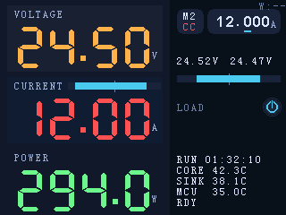
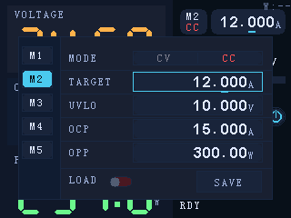

# 本机 Preset UI（触屏 + 旋钮）需求与概要设计

## 背景

当前系统存在 Web/HTTP 入口与板间协议能力，但在“只有硬件面板”的使用场景下，无法完成预设（Preset）的完整配置与切换。需要在 ESP32‑S3（digital）侧提供一套本机 UI 与交互，使用户在无外设/无网络时也能完成 Preset 的编辑、保存与明确激活生效。

相关资料（参考现有规格，不在本文重复展开）：

- Preset 数据模型与安全语义基线：`docs/dev-notes/cv-mode-presets-v1.md`
- HTTP API（现有控制/预设接口）：`docs/interfaces/network-http-api.md`

## 目标

- 仅通过触屏 + 旋钮完成 Preset（1..5）的：
  - 查看/编辑全部字段；
  - 保存到 EEPROM；
  - 明确激活并生效（禁止“静默激活”）。
- 激活 preset、以及激活 preset 的 mode 变化时，强制执行“安全关断负载”（后续由负载开关颜色表达，不在本设计内确定开关位置）。
- 低风险数值编辑：光标位可选范围受限，避免大步跳变。
- 保存失败必须阻塞，直到保存成功（量产保留）。

## 非目标（Out of scope）

- 不做 Wi‑Fi/网络配置、校准、SoftReset 等非 preset 相关功能。
- 不在本设计中确定 **主界面**“负载开关（LOAD）”UI 位置与交互。
- 不扩展 preset 数量与字段（固定 5 组，字段集以现有协议/固件模型为准）。

## 术语

- **激活 preset**（`active_preset`）：当前实际用于控制的 preset。
- **编辑 preset**（`editing_preset`）：设置面板中当前被编辑/显示的 preset（不一定激活）。
- **工作副本**（working）：RAM 中可变的 preset 值（编辑会修改）。
- **已保存快照**（saved）：最近一次成功保存（写 EEPROM 成功）后的 preset 值，用于回退。
- **未保存改动**（dirty）：working 与 saved 不一致。
- **安全关断负载**：将负载置为安全关闭态（例如 `load_enabled=false` / `output_enabled=false` 或等价语义），不要求 toast/弹窗提示。

## UI 信息架构

UI mock（320×240 PNG）：

- 主界面（Dashboard）

  

- 预设设置面板（LOAD=OFF）

  

- 预设设置面板（LOAD=ON）

  

### 1) 主界面（Main）

- 将当前界面中“CC/CV 选择区域”替换为 `<PRESET><MODE>` 的入口按钮（视觉为组合展示，例如 `M2` + `CC`，不要求使用斜杠文本）。
- 主界面上显示“当前激活 preset 编号 + 其 mode”，作为用户确认当前工作状态的唯一真值来源。
- 主界面不提供直接切 mode / 调 target 的交互（本设计替换 `docs/interfaces/main-display-ui.md` 中 control row 的 CC/CV/target 直改交互）；所有 preset 字段编辑均在设置面板完成。

### 2) 预设设置面板（Preset Settings Panel）

- 触发方式：点击主界面 `<PRESET><MODE>` 按钮打开；可关闭返回主界面。
- 顶部：tabs（M1..M5）用于选择 **editing_preset**（单击只切换编辑对象，不激活）。
- 中部：字段编辑区（见“字段与格式”）。
- 底部：左侧为 **LOAD** 滑动开关（负载开关，非 preset 字段）；右侧为 `SAVE` 按钮（无 `Apply` 按钮）。

#### MODE 字段：双选按钮（CV / CC）

- 表现形式：分段控件（segmented control），直接显示两个选项 `CV` 与 `CC`。
- 交互：点击某一段立即设置 `mode`（无需进入“字段编辑态”再旋钮切换）。
  - 若 `editing_preset_id == active_preset_id` 且 `mode` 实际发生变化：必须执行“安全关断负载”（`load_enabled=false`），避免静默切换后继续出力。
  - 若当前仅在编辑非激活 preset：不影响当前输出状态。
- 视觉：延续主界面语义色：`CC` 红 `#FF5252`、`CV` 橙 `#FFB24A`；未选中项用灰 `#7A7F8C`。
- 尺寸：分段控件高度建议 ≤ **12 px**（与 UI mock 一致），并与下一行选中高亮保持 ≥ **1 px** 间隙，避免视觉粘连。

#### LOAD 滑动开关（视觉规范）

> 需要在 UI mock 与实现中保持一致：像素级渲染，避免缩放造成的模糊或形变。

- 结构：外轮廓胶囊（1 px）+ 胶囊背景（track）+ 圆形滑块（thumb）。
- 轮廓：位于背景胶囊外侧一圈，线宽 **1 px**（推荐使用 `divider #1C2A3F`）。
- 尺寸：背景胶囊（track）的高度必须 **等于** 圆形滑块（thumb）的直径（推荐 thumb 直径 10 px）。
- 颜色：
  - `OFF`：track 使用更暗的红色（例如 `#4A1824`），thumb 为灰色（`#555F75`）。
  - `ON`：track 使用更暗的绿色（例如 `#134B2D`），thumb 为主题色（`#4CC9F0`）。
- 渲染：thumb 必须为严格正圆（在 320×240 的像素网格下可清晰辨认），不得用“类圆形位图”糊弄。

## 核心交互规范

### A. 快速切换（主界面按住滑动，松手激活）

- 手势：在主界面 `<PRESET><MODE>` 区域 **按住并左右滑动**。
- 视觉：采用“选中项保持在中间、列表循环滚动（wrap-around）”的 iPhone 选择器风格。
- 行为：
  - 滑动过程中仅“预览选择”，不改变激活 preset；
  - **松手（touch up）时**才提交：切换激活 preset 到最终选中项，并立刻生效；
  - 提交激活时必须执行“安全关断负载”。

### B. 设置面板 tabs：单击仅编辑，双击当前 tab 才激活

- 单击任一 tab：
  - 仅切换 `editing_preset`（显示并编辑该 preset 的字段）；
  - 不改变激活 preset。
- 双击激活（禁止静默激活）：
  - 仅当“双击发生在**当前已选中的 tab**”时触发激活；
  - 若第一次点击导致 tab 发生切换，则该序列不触发激活；
  - 双击判定窗口：**350ms**（并做去抖）。
- 激活成功后：
  - 切换 `active_preset` 为该 tab 对应 preset；
  - 强制执行“安全关断负载”。

### C. 字段选择与旋钮调值

- 触屏负责选择“当前正在编辑的字段”。
- 旋钮旋转负责调整字段数值；旋钮单击用于“光标位向右循环”。
- 光标位限制（降低误操作风险）：
  - 电流/电压：仅允许选中 `ones/tenths/hundredths/thousandths`（不允许直接选中十位）。
  - 功率：允许选中 `tens/ones/tenths/hundredths`（允许十位；不允许直接选中百位）。

### D. 保存（允许无改动点击；失败阻塞；同一按钮重试）

- `保存`只保存当前 `editing_preset`。
- 当当前 preset 无改动时：按钮呈“禁用效果”，但仍允许点击触发保存尝试。
- 每次保存尝试必须 toast 提示成功/失败。
- 保存失败时进入阻塞态：
  - 禁止切换 tab、禁止继续编辑、禁止关闭面板；
  - 只允许重复点击同一个 `保存` 继续重试；
  - 保存成功后解除阻塞态。
  - 阻塞态必须显示一条**持续可见**的解释文案（不依赖 toast），推荐两行（SmallFont）：`SAVE FAILED` + `RETRY SAVE`。

## 字段与格式（固定宽度显示）

> 显示格式要求固定宽度（含前导 0），以保证光标位稳定且可预测。

### 字段集合（按 mode）

> `V-LIM` / `I-LIM` / `P-LIM` 对应 `docs/dev-notes/cv-mode-presets-v1.md` 的 limit 字段语义。

- `mode`：`CC` / `CV`
- mode=CC（恒流）字段：
  - `TARGET`：电流目标，显示 `DD.dddA`
  - `V-LIM`：欠压阈值（`min_v_mv`），显示 `DD.dddV`
  - `P-LIM`：功率上限（`max_p_mw`），显示 `DDD.ddW`
  - 注：CC 模式不显示 `I-LIM` 行；`max_i_total` 仍作为内部安全上限存在（用于 clamp/保护），但不是 UI 字段。
- mode=CV（电压钳位）字段：
  - `TARGET`：电压目标，显示 `DD.dddV`
  - `I-LIM`：总电流上限（`max_i_ma_total`），显示 `DD.dddA`
  - `V-LIM`：欠压阈值（`min_v_mv`），显示 `DD.dddV`
  - `P-LIM`：功率上限（`max_p_mw`），显示 `DDD.ddW`

### 显示格式（冻结：固定长度对齐）

- 目标值与各 `*-LIM` 的“值字符串”固定为 **7 字符**（单位紧贴，无空格），用于右对齐与行对齐：
  - 电流/电压：`DD.dddX`（例如 `01.200A`、`24.500V`）
  - 功率：`DDD.ddW`（例如 `300.00W`）

## 状态模型（概要）

### UI 状态

- `view = Main | PresetPanel | PresetPanelBlocked`
  - `PresetPanelBlocked` 仅由“保存失败”进入，保存成功退出。

### Preset 数据状态

建议在 RAM 中维护以下概念（具体结构由实现阶段决定）：

- `working[preset_id]`：当前可变工作副本
- `saved[preset_id]`：最近一次成功保存快照（用于回退）
- `dirty[preset_id]`：是否存在未保存改动
- `active_preset_id`：当前激活 preset
- `editing_preset_id`：面板当前编辑 preset
- `active_preset` 始终绑定 `working[active_preset_id]`（激活 dirty 时直接使用 working 生效；无需先保存）。

### 未保存改动的丢弃规则（冻结）

- 关闭设置面板：丢弃所有**非激活 preset** 的未保存改动（回退到 `saved`）。
- 切换激活 preset 时：
  - 丢弃“原激活 preset”的未保存改动（回退到 `saved`）；
  - 然后再切换 `active_preset_id`。
- 激活 preset 后的未保存改动：
  - 不因关闭面板而回退；
  - 仅在“该 preset 不再激活”时回退（见上）。

## 安全关断负载（触发条件）

必须触发安全关断负载的事件：

1. 激活 preset（主界面快速切换松手提交；或面板双击当前 tab 激活）。
2. **激活 preset** 的 `mode(CC↔CV)` 发生变化。

注：其他字段（`target/min_v/max_i_total/max_p`）的调整不额外要求强制关断；若底层保护（如欠压锁存/限功率等）导致等效退流属于正常行为。

## 验收标准（实现阶段基线）

- 主界面按住滑动仅预览；松手才激活并关断负载。
- 设置面板单击 tab 不激活；双击“当前 tab”才激活并关断负载。
- 目标字段随 mode 切换显示并编辑对应值（CC→电流目标；CV→电压目标）。
- 电流/电压/功率显示均为固定宽度格式；光标循环与可选位限制按本文规定生效。
- 保存按钮无改动时禁用视觉但可点；保存成功/失败 toast；保存失败阻塞且只能重复点同一保存按钮重试。
- 保存失败阻塞态必须显示持续可见的解释文案（例如 `SAVE FAILED` + `RETRY SAVE`）。
- 未保存改动丢弃规则按本文冻结规则生效。
- 所有 UI 文案中 `LOAD` 一词保持一致，不出现 `OUTPUT`。
