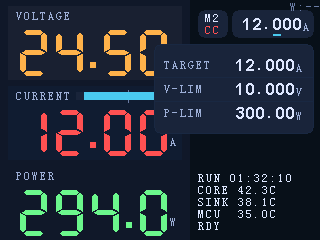
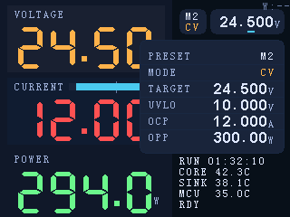

# 本机 Preset UI（触屏 + 旋钮）需求与概要设计

## 背景

当前系统存在 Web/HTTP 入口与板间协议能力，但在“只有硬件面板”的使用场景下，无法完成预设（Preset）的完整配置与切换。需要在 ESP32‑S3（digital）侧提供一套本机 UI 与交互，使用户在无外设/无网络时也能完成 Preset 的编辑、保存与明确激活生效。

相关资料（参考现有规格，不在本文重复展开）：

- Preset 数据模型与安全语义基线：`docs/dev-notes/cv-mode-presets-v1.md`
- HTTP API（现有控制/预设接口）：`docs/interfaces/network-http-api.md`

## 目标

- 仅通过触屏 + 旋钮完成 Preset（1..5）的：
  - 查看/编辑全部字段；
  - 保存到 EEPROM；
  - 明确激活并生效（禁止“静默激活”）。
- 激活 preset、以及激活 preset 的 mode 变化时，强制执行“安全关断负载”（后续由负载开关颜色表达，不在本设计内确定开关位置）。
- 低风险数值编辑：光标位可选范围受限，避免大步跳变。
- 保存失败必须阻塞，直到保存成功（量产保留）。

## 非目标（Out of scope）

- 不做 Wi‑Fi/网络配置、校准、SoftReset 等非 preset 相关功能。
- 不在本设计中确定 **主界面**“负载开关（LOAD）”UI 位置与交互。
- 不扩展 preset 数量与字段（固定 5 组，字段集以现有协议/固件模型为准）。

## 术语

- **激活 preset**（`active_preset`）：当前实际用于控制的 preset。
- **编辑 preset**（`editing_preset`）：设置面板中当前被编辑/显示的 preset（不一定激活）。
- **工作副本**（working）：RAM 中可变的 preset 值（编辑会修改）。
- **已保存快照**（saved）：最近一次成功保存（写 EEPROM 成功）后的 preset 值，用于回退。
- **未保存改动**（dirty）：working 与 saved 不一致。
- **安全关断负载**：将负载置为安全关闭态（例如 `load_enabled=false` / `output_enabled=false` 或等价语义），不要求 toast/弹窗提示。

## UI 信息架构

UI mock（320×240 PNG）：

- 主界面（Dashboard）

  

- 预设设置面板（LOAD=OFF）

  

- 预设设置面板（LOAD=ON）

  

### 1) 主界面（Main）

- 将当前界面中“CC/CV 选择区域”替换为两个**独立**的圆角按钮（control row）：
  - 左侧 **Preset/Mode**：两行显示 `M#` / `CC|CV`（作为进入 Preset Panel / 快速切换 preset 的入口）。
  - 右侧 **Setpoint**：显示 active preset 的 target 摘要 `DD.dddU`（数值部分更大，单位仍用小字号），作为“目标值设置”的入口。
- 主界面上显示“当前激活 preset 编号 + 其 mode”，作为用户确认当前工作状态的唯一真值来源。
- 主界面保持 Preset/Mode 与 Setpoint 为两个独立按钮（避免误触与死区）；但 Setpoint 按钮内部支持“按字符选编辑位 + 横向拖动选位”，用于直接选择旋钮调节的数字位（见 A2）。旋钮在主界面用于对 active preset 的 target 做小步进微调；完整字段编辑仍在设置面板完成。

### 2) 预设设置面板（Preset Settings Panel）

- 触发方式：点击主界面 `<PRESET><MODE>` 按钮打开；可关闭返回主界面。
- 顶部：tabs（M1..M5）用于选择 **editing_preset**（单击只切换编辑对象，不激活）。
- 中部：字段编辑区（见“字段与格式”）。
- 底部：左侧为 **LOAD** 滑动开关（负载开关，非 preset 字段）；右侧为 `SAVE` 按钮（无 `Apply` 按钮）。

#### MODE 字段：双选按钮（CV / CC）

- 表现形式：分段控件（segmented control），直接显示两个选项 `CV` 与 `CC`。
- 交互：点击某一段立即设置 `mode`（无需进入“字段编辑态”再旋钮切换）。
  - 若 `editing_preset_id == active_preset_id` 且 `mode` 实际发生变化：必须执行“安全关断负载”（`load_enabled=false`），避免静默切换后继续出力。
  - 若当前仅在编辑非激活 preset：不影响当前输出状态。
- 视觉：延续主界面语义色：`CC` 红 `#FF5252`、`CV` 橙 `#FFB24A`；未选中项用灰 `#7A7F8C`。
- 尺寸：分段控件高度建议 ≤ **12 px**（与 UI mock 一致），并与下一行选中高亮保持 ≥ **1 px** 间隙，避免视觉粘连。

#### LOAD 滑动开关（视觉规范）

> 需要在 UI mock 与实现中保持一致：像素级渲染，避免缩放造成的模糊或形变。

- 结构：外轮廓胶囊（1 px）+ 胶囊背景（track）+ 圆形滑块（thumb）。
- 轮廓：位于背景胶囊外侧一圈，线宽 **1 px**（推荐使用 `divider #1C2A3F`）。
- 尺寸：背景胶囊（track）的高度必须 **等于** 圆形滑块（thumb）的直径（推荐 thumb 直径 10 px）。
- 颜色：
  - `OFF`：track 使用更暗的红色（例如 `#4A1824`），thumb 为灰色（`#555F75`）。
  - `ON`：track 使用更暗的绿色（例如 `#134B2D`），thumb 为主题色（`#4CC9F0`）。
- 渲染：thumb 必须为严格正圆（在 320×240 的像素网格下可清晰辨认），不得用“类圆形位图”糊弄。

## 核心交互规范

### A. 快速切换（主界面按住滑动，松手激活）

- 手势：在主界面 **Preset/Mode** 区域（左侧 `M# / CC|CV` 按钮）**按住并左右滑动**。
- 视觉：滑动时仅改变“预览 preset”（更新 `M# / CC|CV` 显示），并在按钮下方显示一个“预设值信息面板”（见 A1）。
- 行为：
  - 滑动过程中仅“预览选择”，不改变激活 preset；
  - **松手（touch up）时**才提交：切换激活 preset 到最终选中项，并立刻生效；
  - 提交激活时必须执行“安全关断负载”。
- 边界（禁止循环）：预览 preset 不允许头尾循环（不做 wrap-around），范围钳制在 `M1..M5`。
- 提示音：
  - 预览每跨 **1** 个 preset：播放 **detent tick**（必须可数；跨 N 步必须响 N 次）。
  - 在 `M1` 继续向左或在 `M5` 继续向右并触发“将要越界的步进”：播放 **异常操作音（UI fail）**，且同一次手势最多播放一次。
  - 松手提交激活：不额外播放 UI ok（避免在多次 tick 之后多出一声导致“数不清”）。
- 预设值信息面板：
  - 显示时机：仅在拖动手势期间显示；松手立即消失。
  - 位置：显示在按钮下方（不要求改变主布局，允许临时覆盖右侧信息区）。
  - 内容：按“设置面板当前 mode 的字段集合”展示字段和值（见“字段集合（按 mode）”）；字段集合随预览 preset 的 mode 变化而变化。
  - 字体：字段“值”使用主界面 Setpoint 目标值的数字字体与字号；字段名可使用 SmallFont。

### A1. 预设预览信息面板（Preset preview info panel）

> 生成 mock：`(cd tools/ui-mock && cargo run)`，输出为 `docs/assets/on-device-preset-ui/preset-preview-panel-{cc,cv}.png`。

- CC 示例（`TARGET / V-LIM / P-LIM`）：

  

- CV 示例（`TARGET / I-LIM / V-LIM / P-LIM`）：

  

#### 字段与顺序（冻结）

- `mode=CC`：`TARGET` → `V-LIM` → `P-LIM`
- `mode=CV`：`TARGET` → `I-LIM` → `V-LIM` → `P-LIM`

#### 几何（冻结；逻辑坐标 320×240）

- 外框（圆角矩形）：
  - `x=154, y=44, w=160`
  - `h=90`（CC，3 行）/ `h=114`（CV，4 行）
  - `radius=6`，`border=1 px`
  - 与主界面 control-row 的垂直关系：`control_row_bottom=38`，面板 `y=44`（间距 6px，严格位于按钮下方）
  - 对齐：面板右边缘 `x+w=314` 与主界面 Setpoint pill 右边缘对齐（允许覆盖右侧信息区）
- 内容区：
  - `pad_x=10`，`pad_y=8`
  - `row_h=24`
  - 行分隔线：每行底部 1px，`x=155..313`（即 `PANEL_LEFT+border .. PANEL_RIGHT-border`）
- 逐行定位（第 `i` 行，从 0 开始）：
  - `row_top = y + border + pad_y + i*row_h`
  - `label_x = x + pad_x`
  - `value_right = x + w - pad_x`（右对齐）

#### 颜色（冻结）

- 背景：`#1C2638`（与主界面 control-row pill 背景同色系）
- 外框/分隔线：`#1C2A3F`（divider）
- 字段名/单位：`#9AB0D8`
- 数字：`#DFE7FF`

#### 字体与对齐（冻结）

- 字段名（`TARGET`/`I-LIM`/`V-LIM`/`P-LIM`）：`SmallFont`（8×12），左对齐。
- 字段值：按固定宽度 7 字符值串（见“显示格式（冻结）”）拆分为：
  - 数字部分（末尾单位前的 6 字符，例如 `24.500` / `300.00`）：使用主界面 Setpoint 的数字字体 `SetpointFont`（10×18）。
  - 单位字符（末尾 1 字符，例如 `V/A/W`）：使用 `SmallFont`，与数字部分做**底边对齐**（参考主界面 Setpoint 的单位对齐方式）。
  - 数字与单位之间 `unit_gap=1 px`；整体在 `value_right` 处右对齐。

### A2. 目标值设置（主界面 Setpoint 按钮）

- 目标：通过触屏直接选择“旋钮将要调节的数字位”（编辑位），替代原来的“循环切换步进档位”交互。
- 点击选位：
  - 点击 Setpoint 按钮内的字符位置，直接选择对应数字位为编辑位（不循环）。
  - 点击到小数点时采用就近吸附（更靠近个位选个位；更靠近十分位选十分位）。
  - 点击到不可选数字位（例如电流/电压的十位）时就近吸附到最近可选位。
  - 选位发生变化：播放 **UI ok**；未变化：不发声。
- 横向拖动选位：
  - 在 Setpoint 按钮内左右拖动可跨多位移动编辑位（不循环）。
  - 编辑位每跨 **1** 位：播放 **detent tick**（必须可数；跨 N 位必须响 N 次）。
  - 到达最左/最右可选位后继续向外并触发“将要越界的步进”：播放 **UI fail**，且同一次手势最多播放一次。
- 可选位限制（降低误操作风险）：电流/电压仅允许 `ones/tenths/hundredths/thousandths`（不允许直接选中十位）。

### B. 设置面板 tabs：单击仅编辑，双击当前 tab 才激活

- 单击任一 tab：
  - 仅切换 `editing_preset`（显示并编辑该 preset 的字段）；
  - 不改变激活 preset。
- 双击激活（禁止静默激活）：
  - 仅当“双击发生在**当前已选中的 tab**”时触发激活；
  - 若第一次点击导致 tab 发生切换，则该序列不触发激活；
  - 双击判定窗口：**350ms**（并做去抖）。
- 激活成功后：
  - 切换 `active_preset` 为该 tab 对应 preset；
  - 强制执行“安全关断负载”。

### C. 字段选择与旋钮调值

- 触屏负责选择“当前正在编辑的字段”。
- 旋钮旋转负责调整字段数值；旋钮单击用于“光标位向右循环”。
- 光标位限制（降低误操作风险）：
  - 电流/电压：仅允许选中 `ones/tenths/hundredths/thousandths`（不允许直接选中十位）。
  - 功率：允许选中 `tens/ones/tenths/hundredths`（允许十位；不允许直接选中百位）。

### D. 保存（允许无改动点击；失败阻塞；同一按钮重试）

- `保存`只保存当前 `editing_preset`。
- 当当前 preset 无改动时：按钮呈“禁用效果”，但仍允许点击触发保存尝试。
- 每次保存尝试必须 toast 提示成功/失败。
- 保存失败时进入阻塞态：
  - 禁止切换 tab、禁止继续编辑、禁止关闭面板；
  - 只允许重复点击同一个 `保存` 继续重试；
  - 保存成功后解除阻塞态。
  - 阻塞态必须显示一条**持续可见**的解释文案（不依赖 toast），推荐两行（SmallFont）：`SAVE FAILED` + `RETRY SAVE`。

## 字段与格式（固定宽度显示）

> 显示格式要求固定宽度（含前导 0），以保证光标位稳定且可预测。

### 字段集合（按 mode）

> `V-LIM` / `I-LIM` / `P-LIM` 对应 `docs/dev-notes/cv-mode-presets-v1.md` 的 limit 字段语义。

- `mode`：`CC` / `CV`
- mode=CC（恒流）字段：
  - `TARGET`：电流目标，显示 `DD.dddA`
  - `V-LIM`：欠压阈值（`min_v_mv`），显示 `DD.dddV`
  - `P-LIM`：功率上限（`max_p_mw`），显示 `DDD.ddW`
  - 注：CC 模式不显示 `I-LIM` 行；`max_i_total` 仍作为内部安全上限存在（用于 clamp/保护），但不是 UI 字段。
- mode=CV（电压钳位）字段：
  - `TARGET`：电压目标，显示 `DD.dddV`
  - `I-LIM`：总电流上限（`max_i_ma_total`），显示 `DD.dddA`
  - `V-LIM`：欠压阈值（`min_v_mv`），显示 `DD.dddV`
  - `P-LIM`：功率上限（`max_p_mw`），显示 `DDD.ddW`

### 显示格式（冻结：固定长度对齐）

- 目标值与各 `*-LIM` 的“值字符串”固定为 **7 字符**（单位紧贴，无空格），用于右对齐与行对齐：
  - 电流/电压：`DD.dddX`（例如 `01.200A`、`24.500V`）
  - 功率：`DDD.ddW`（例如 `300.00W`）

## 状态模型（概要）

### UI 状态

- `view = Main | PresetPanel | PresetPanelBlocked`
  - `PresetPanelBlocked` 仅由“保存失败”进入，保存成功退出。

### Preset 数据状态

建议在 RAM 中维护以下概念（具体结构由实现阶段决定）：

- `working[preset_id]`：当前可变工作副本
- `saved[preset_id]`：最近一次成功保存快照（用于回退）
- `dirty[preset_id]`：是否存在未保存改动
- `active_preset_id`：当前激活 preset
- `editing_preset_id`：面板当前编辑 preset
- `active_preset` 始终绑定 `working[active_preset_id]`（激活 dirty 时直接使用 working 生效；无需先保存）。

### 未保存改动的丢弃规则（冻结）

- 关闭设置面板：丢弃所有**非激活 preset** 的未保存改动（回退到 `saved`）。
- 切换激活 preset 时：
  - 丢弃“原激活 preset”的未保存改动（回退到 `saved`）；
  - 然后再切换 `active_preset_id`。
- 激活 preset 后的未保存改动：
  - 不因关闭面板而回退；
  - 仅在“该 preset 不再激活”时回退（见上）。

## 安全关断负载（触发条件）

必须触发安全关断负载的事件：

1. 激活 preset（主界面快速切换松手提交；或面板双击当前 tab 激活）。
2. **激活 preset** 的 `mode(CC↔CV)` 发生变化。

注：其他字段（`target/min_v/max_i_total/max_p`）的调整不额外要求强制关断；若底层保护（如欠压锁存/限功率等）导致等效退流属于正常行为。

## 验收标准（实现阶段基线）

- 主界面按住滑动仅预览；松手才激活并关断负载。
- 主界面快速切换：预览不循环；拖动每步 tick 可数；越界 UI fail（每手势最多一次）；拖动期间显示预设值信息面板（按钮下方），松手立即消失；松手提交不额外播放 UI ok。
- 设置面板单击 tab 不激活；双击“当前 tab”才激活并关断负载。
- 目标字段随 mode 切换显示并编辑对应值（CC→电流目标；CV→电压目标）。
- 主界面 Setpoint：点击直达选位（UI ok）；横向拖动跨位选位（detent tick）；越界 UI fail（每手势最多一次）；电流/电压/功率显示均为固定宽度格式；可选位限制按本文规定生效。
- 保存按钮无改动时禁用视觉但可点；保存成功/失败 toast；保存失败阻塞且只能重复点同一保存按钮重试。
- 保存失败阻塞态必须显示持续可见的解释文案（例如 `SAVE FAILED` + `RETRY SAVE`）。
- 未保存改动丢弃规则按本文冻结规则生效。
- 所有 UI 文案中 `LOAD` 一词保持一致，不出现 `OUTPUT`。
