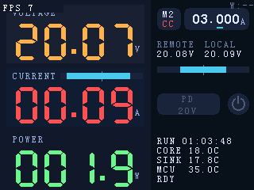

# USB‑PD Sink：5V/20V 两态切换（STM32G431 UCPD）

本文档定义：数字板（ESP32‑S3）主界面 PD 按钮、数字↔模拟板协议扩展、以及模拟板（STM32G431）USB‑PD Sink 的最小实现范围，用于快速验证 **5V/20V 切换**。

## 1. 背景与目标

- 模拟板 MCU（STM32G431）具备 USB‑PD Sink（UCPD）硬件能力，希望通过 USB‑C/PD 获取固定电压（本轮仅需 5V/20V）。
- 数字板提供一个“PD 按钮”用于切换目标（本轮验证用；未来作为 PD Sink 设置面板入口）。
- 目标档位需要 **持久化**（重启/断电后保留用户选择）。
- 不做“自动回退”：若 20V 协商失败，保持用户目标为 20V，仅以 UI 错误态提示，等待用户手动切回 5V。

## 2. 范围与非目标

### 2.1 范围（In scope）

- 数字板（ESP32‑S3）：
  - Dashboard 增加一个 PD 两行按钮，显示目标电压（取整）。
  - 按钮在未 Attach 时也允许点击：点击仅更新“目标档位”，Attach 后自动应用。
  - 使用本地遥测 `v_local_mv` 验证是否已在目标电压（不依赖远端 VBUS）。
  - 将目标档位持久化到外置 EEPROM（M24C64）。
- 数字↔模拟板协议：
  - 新增 `PD_SINK_REQUEST (0x27)` 控制消息（带 ACK_REQ，返回 ACK/NACK）。
  - 新增 `PD_STATUS (0x13)` 遥测消息：模拟板上报 **Attach/合同电压电流** 与 **可用档位（Fixed/PPS 能力摘要）**。
  - ACK 仅表示“请求被接收并记录”，不代表 PD 协商成功。
- 模拟板（STM32G431）：
  - 基于 UCPD 实现 PD Sink 的固定 PDO 请求：在 5V 与 20V 间切换。
  - 电流请求策略固定：按 **3A 上限**，且不超过 Source PDO 宣告的最大电流。

### 2.2 非目标（Out of scope）

- PPS 的完整协商与 UI 详情面板（本轮只预留协议字段与 UI 文案扩展点）。
- 不要求 UI **依赖** `PD_STATUS` 做“是否已达目标”的验收判定：本轮仍以 `v_local_mv` 阈值为准（`PD_STATUS` 用于可选档位展示与后续扩展）。
- 协商期间强制关闭负载（明确不做）。

## 3. 术语

- **Attach**：USB‑C 物理连接并完成 CC 附着（本轮由 `v_local_mv` 的粗阈值推断）。
- **目标档位**（`desired_target_mv`）：用户期望的 VBUS 目标电压（仅 5000/20000）。
- **应用**：模拟板发起 PD Request 并形成新合同（contract），导致 `v_local_mv` 达到目标范围。

## 4. 数字板 UI（Dashboard）

UI mock（320×240，示意：用 PD 两行按钮替换 LOAD 文本标签，右侧保留电源图标按钮）：

### 4.1 布局（替换 LOAD 标签为 PD 按钮）

现有 UI 在右侧 `LOAD_ROW_TOP` 行绘制 `LOAD` 文本 + 右侧电源图标按钮。本设计将：

- **保留右侧电源图标按钮**（现有输出开关语义不改）。
- **移除 `LOAD` 文本标签**，将其空间替换为 **PD 两行按钮**。

建议按钮区域（以现有布局常量为基准）：

- PD 按钮容器：`x = 198 .. (LOAD_BUTTON_LEFT - 10)`；`y = LOAD_ROW_TOP .. (LOAD_ROW_TOP + LOAD_BUTTON_SIZE)`  
  - 目标：与右侧电源开关图标 **至少留出约 10px 间距**，避免贴边。
  - 宽度约 75–80 px，高度 27 px，可容纳两行 SmallFont（12 px 高）+ 3 px 间距。
- 外观：圆角矩形（半径建议 6px），颜色沿用主界面 control row / bar-track 风格。

### 4.2 文案（两行）

- 第一行：`PD`（未来可扩展为 `PPS`）。
- 第二行：目标电压取整显示：`5V` / `20V`。

### 4.3 状态样式（“未激活样式” + 协商态）

按钮始终可点（即使未 Attach），但视觉上区分状态：

- `Standby`（未 Attach 或链路不可用）：灰化/未激活样式（仍显示目标电压）。
- `Negotiating`（已 Attach，且在 `T_pd` 窗口内等待目标达成）：橙色强调（可选轻微闪烁）。
- `Active`（已 Attach 且 `v_local_mv` 达到目标范围）：主题色强调。
- `Error`（已 Attach，但 `T_pd` 超时仍未达到目标范围）：红色强调（可选闪烁）。

配色建议（沿用现有调色板）：

- 容器底色：`bar-track #1C2638`；边框：`divider #1C2A3F`
- 文本：
  - Standby：`#555F75`
  - Negotiating：`#FFB347`
  - Active：`#4CC9F0`
  - Error：`#FF5252`

### 4.4 点击行为与自动应用

- 点击（任何时候均允许）：
  - 切换 `desired_target_mv`：`5000 ↔ 20000`
  - 立刻持久化到 EEPROM（仅当值变化时写入）
  - 若链路可用：下发 `PD_SINK_REQUEST`（见第 5 节）
  - 若未 Attach：保持 Standby（目标已保存，等待 Attach 后自动应用）
- 自动应用：
  - 侦测到 **Attach 上升沿**（见 4.5）后，自动下发一次当前 `desired_target_mv`。
  - 侦测到链路恢复（如重新收到 `HELLO/FAST_STATUS`）后，也自动补发一次当前 `desired_target_mv`（避免模拟板复位后丢失策略）。

### 4.5 “Attach / 达标”判定（仅使用 `v_local_mv`）

本轮采用粗阈值（后续可用 PD 状态遥测替代）：

- Attach 判定：`v_local_mv >= 2000 mV`
- 5V 达标：`v_local_mv <= 7000 mV`
- 20V 达标：`v_local_mv >= 18000 mV`
- 协商窗口：`T_pd = 2 s`

说明：

- `v_local_mv` 来自模拟板遥测 `FastStatus.v_local_mv`，仅以本地测量为准。
- 本阈值用于 UI 判定与“Attach 上升沿”检测；不是 PD 协议层的严格判据。

## 5. 板间协议扩展（USB‑PD）

### 5.1 消息与可靠性

- 方向：ESP32‑S3 → STM32G431
- 消息：`PD_SINK_REQUEST`（建议 ID：`0x27`）
- 可靠性：请求帧必须置位 `FLAG_ACK_REQ`；模拟侧用同一 `msg` 回 ACK/NACK（`len=0`）。
  - ACK：`FLAG_IS_ACK`
  - NACK：`FLAG_IS_NACK`（仅用于“解析失败/不支持”，不用于“协商失败”）

### 5.2 Payload（CBOR map）

字段编号建议（用于 `loadlynx-protocol`）：

| 字段号 | 名称 | 类型 | 语义 |
| --- | --- | --- | --- |
| `0` | `mode` | `u8` | `0=Fixed`，`1=PPS`（预留） |
| `1` | `target_mv` | `u32` | 目标电压（仅允许 `5000` 或 `20000`） |

### 5.3 语义（“记录策略”与“应用时机”）

- 模拟侧收到并 ACK 后：
  - 记录 `{mode,target_mv}` 作为当前策略；
  - 若已 Attach：尝试立即发起 PD Request 切换合同；
  - 若未 Attach：延后到 Attach 事件发生后自动应用。
- 电流请求策略不由数字侧配置：模拟侧固定使用 **3A 上限**，并对每个 PDO 做夹紧：`I_req_ma = min(3000, pdo_max_ma)`。
- 协商失败不回 NACK：由 UI 通过 `v_local_mv` 的超时/阈值判定显示 Error。

### 5.4 `PD_STATUS (0x13)`：Attach/合同与可选档位上报

该消息用于让数字板获取“模拟板观察到的可选档位（Source Capabilities 摘要）”与“当前合同电压/电流”，从而：

- 在 UI 上区分“20V 可用 / 不可用”（仍允许点击切换目标，但可提示不可用）。
- 为后续 PD/PPS 设置面板提供数据基础。

#### 5.4.1 消息与节奏

- 方向：STM32G431 → ESP32‑S3
- 消息：`PD_STATUS`（建议 ID：`0x13`）
- 可靠性：遥测帧默认不要求 ACK；建议按事件触发并限频（例如 ≤2 Hz）。
- 发送时机（建议）：
  - Detach：发送 `attached=false`，清空合同与档位列表
  - 收到 Source Capabilities 并完成解析：发送一次（填充 `fixed_pdos`/`pps_pdos`）
  - 合同变化（5V↔20V）或重新协商完成：发送一次（更新 `contract_*`）

#### 5.4.2 Payload（CBOR map）

字段编号建议（用于 `loadlynx-protocol`）：

| 字段号 | 名称 | 类型 | 语义 |
| --- | --- | --- | --- |
| `0` | `attached` | `bool` | 是否已 Attach |
| `1` | `contract_mv` | `u32` | 当前合同电压（未知时为 `0`） |
| `2` | `contract_ma` | `u32` | 当前合同电流（未知时为 `0`） |
| `3` | `fixed_pdos` | array | Fixed PDO 列表：每项为 `[mv, max_ma]` |
| `4` | `pps_pdos` | array | PPS APDO 列表（预留）：每项为 `[min_mv, max_mv, max_ma]` |

说明：

- `fixed_pdos` / `pps_pdos` 可以为空数组；当 `attached=false` 时应为空。
- `contract_ma` 推荐填“已生效合同对应的电流值”；若底层实现只能提供“请求值”，可先填请求值（实现阶段再统一口径）。

#### 5.4.3 数字板使用方式（UI）

- 判断 20V 是否“可选”：在 `fixed_pdos` 中查找 `mv==20000`。
  - 不存在：UI 可显示“不可用/将失败”的灰化或 Error 样式（仍允许点击切换目标，满足“未 Attach 也可点”的交互要求）。
  - 存在：后续可在详情页展示该档位 `max_ma`（例如 `20V @ 1500mA`）。
- 本轮“达标判定”仍以 `v_local_mv` 为准；`PD_STATUS` 用于能力/合同信息展示与后续扩展。

## 6. 持久化：数字板 EEPROM（M24C64）

数字板已有外置 EEPROM 用于 calibration 与 presets（见 `firmware/digital/src/eeprom.rs`）。本功能将目标档位持久化到 EEPROM 的新区域。

### 6.1 存储位置（建议）

- Calibration blob：`0x0000 .. (0x0000 + EEPROM_PROFILE_LEN - 1)`（由 `loadlynx_calibration_format` 定义）
- Presets blob：`EEPROM_PRESETS_BASE_ADDR .. (EEPROM_PRESETS_BASE_ADDR + EEPROM_PRESETS_LEN - 1)`
- **PD 配置 blob（新增）**：`EEPROM_PD_BASE_ADDR = EEPROM_PRESETS_BASE_ADDR + EEPROM_PRESETS_LEN`
  - 建议长度：`EEPROM_PD_LEN = 32`（留足扩展空间）

### 6.2 Blob 格式（建议，CRC32）

定长小端结构（与 presets blob 风格一致）：

- `magic[4] = "LLPD"`
- `fmt_version: u8 = 1`
- `mode: u8`（`0=Fixed`，`1=PPS` 预留）
- `reserved: [u8; 2] = 0`
- `target_mv: u32`（5000/20000）
- `reserved: [u8; 16] = 0`
- `crc32_ieee: u32`（覆盖 CRC 字段之前的全部字节）

无效/CRC 不匹配时回退到默认：

- `mode=Fixed`，`target_mv=5000`

### 6.3 写入策略

- 仅当用户点击导致值变化时写入一次（避免无意义写放大）。
- EEPROM 写失败不阻塞 UI：UI 仍更新目标，但应记录错误日志；下次点击/重启可再次尝试写入。

## 7. 模拟板 PD Sink（STM32G431 UCPD）最小策略

> 本节仅规定“预期行为与边界”，不绑定具体库实现方式；实现阶段可参考独立的 UCPD/PD 例程或既有内部项目。

### 7.1 状态机（建议）

- `Detached`：未 Attach（无 PD 通信）。
- `Attached`：Attach 后等待 Source Capabilities。
- `Negotiating`：选择 PDO 并发送 Request；等待 Accept/PS_RDY。
- `Ready`：合同已生效，维持运行；支持再次发送 Request 做 5V↔20V 切换。
- `Error`：协议级失败/超时；保持当前合同不变，等待后续用户再次请求或重新 Attach。

### 7.2 PDO 选择与电流请求

- 目标 5V：选择 Fixed 5V PDO（通常为第 1 个），请求电流 `I_req_ma`（见下）。
- 目标 20V：选择 Fixed 20V PDO；若无 20V Fixed PDO，视为“协商失败”。
- 电流请求：
  - `I_req_ma = min(3000, pdo_max_ma)`（3A 作为上限，且不超过 PDO 能力）

### 7.3 切换策略

- 当收到新的 `PD_SINK_REQUEST`：
  - 若 `target_mv` 有变化，且当前已 Attach/Ready：立即发起新的 Request。
  - 若未 Attach：仅记录策略，等待 Attach 事件后自动应用。
- 不自动回退：20V 失败时不主动切回 5V；保持用户目标为 20V，但合同可能仍停留在 5V（由 Source/协议决定），由 UI 呈现 Error。

## 8. 测试计划（实现阶段）

### 8.1 基本流程

1. 上电（无 USB‑C）：PD 按钮显示 EEPROM 中的目标（默认 5V），呈现 Standby 样式；可点击切换 5V/20V。
2. 插入支持 20V 的 PD Source：
   - 若目标为 20V：自动下发请求并在 `T_pd` 内使 `v_local_mv >= 18000mV`。
   - 若目标为 5V：保持/切回到 `v_local_mv <= 7000mV`。
3. 已 Attach 时反复点击切换：观察 `v_local_mv` 在 5V/20V 间变化，UI 状态在 Negotiating→Active 间切换。

### 8.2 持久化验证

- 将目标切到 20V，重启/断电再上电：UI 仍显示 20V；Attach 后自动应用 20V。

### 8.3 负向用例

- 使用不支持 20V 的 Source：目标切到 20V 后，`T_pd` 超时仍未达到 `>=18000mV`，UI 显示 Error；不自动回退到 5V。

## 9. 验收标准（Given/When/Then）

- Given 数字板 UI 可用  
  - When 点击 PD 按钮  
    - Then 目标在 `5V↔20V` 切换，且该目标被写入 EEPROM（掉电后仍保留）。
- Given 未 Attach（`v_local_mv < 2000mV`）  
  - When 点击切到 20V  
    - Then UI 仍允许切换并显示 20V（Standby 样式），插入 USB‑C 后自动应用 20V。
- Given 已 Attach（`v_local_mv >= 2000mV`）且链路正常  
  - When 目标切到 20V  
    - Then `2s` 内 `v_local_mv >= 18000mV`，UI 显示 Active(20V)；否则显示 Error。
  - When 目标切到 5V  
    - Then `2s` 内 `v_local_mv <= 7000mV`，UI 显示 Active(5V)。
- Given 已 Attach 且模拟板已解析 Source Capabilities  
  - When 模拟板上报 `PD_STATUS (0x13)`  
    - Then `fixed_pdos` 至少包含 `5000`；若 Source 支持 20V，则包含 `20000` 且提供对应 `max_ma`；数字板据此显示“20V 可用/不可用”。
- Given 20V 协商失败（Source 不支持或被拒绝）  
  - When 超时后仍未达到 20V 阈值  
    - Then UI 显示 Error，且系统不自动切回 5V（等待用户手动切回）。

## 10. 开放问题（需主人确认）

（本轮无）
