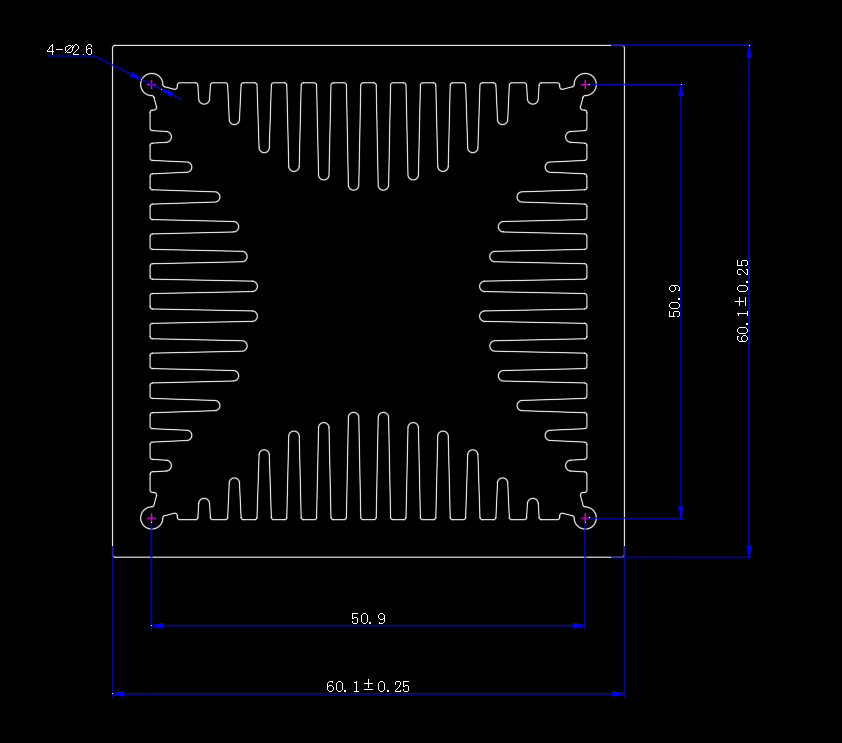

# Fan + “风洞款”散热片组合说明（Delta AFB0612EH 版）

规范参照：[“风洞款”散热片文档](../heatsinks/wind_tunnel_60x60x60.md)；风扇数据来源于 [Delta AFB0612EH-A 数据手册](./datasheets/Delta-AFB0612EH-A.md)。

## 1. 风扇参数一览

- **型号**：Delta AFB0612EH（四线版），由 Taobao 渠道确认为 4 线版本。[1][2][6]
- **外形**：60 mm × 60 mm × 25 mm。[1][2]
- **额定电压**：12 V DC（工作范围 4 – 13.8 V）。[2]
- **额定电流**：0.38 A（制造商），当前批次商家实测 0.48 A。[1][2]
- **功率**：4.56 W。[2]
- **风量**：38.35 CFM（≈0.018 m³/s）。[2]
- **静压**：0.544 inch H₂O（13.81 mm H₂O）。[2]
- **转速**：6800 RPM。[2]
- **噪声**：46.5 dB(A)。[2]
- **轴承**：滚珠结构。[2]
- **寿命**：70 000 h @ 40 °C。[2]

## 2. 散热片（风洞款 60×60×60）参数

- 购买规格选择 “60*60*60【切白】”，即 60 mm × 60 mm 截面、60 mm 高度的挤压型材，未阳极处理。[3][6]
- 同系列商品支持长度与孔位定制，属于“风洞”结构，常用于功放/功率器件集中安装面散热。[6]
- 有效通流截面：`Aₐ ≈ 0.0026 m²`（规范区间 0.0023–0.0026 m²）。
- 等效换热面积：`A ≈ 0.066 m²`（由 P_total×L 中值获得）。

**截面要点（见规范文档）：** 四向鳍片、每边约 12 根，内净口约 50.9 mm，开孔率约 72%。

## 3. 气动估算（以 25 °C 空气为例）

## 4. 风扇与散热片配合分析

## 3. 气动估算（以 25 °C 空气为例）

- 内净开口参考图纸标注约 50.9 mm，以 50.9 mm × 50.9 mm 作为核心有效风口的保守估计，考虑四边鳍片侵入后的开孔率约 ~72%。据此取有效流通面积 **Aₐ ≈ 0.0601² × 0.72 ≈ 0.0026 m²**（等价于直接按内净口面积 **0.0509² m²** 估算；与像素统计 0.0023–0.0026 m² 区间一致）。
- 风扇体积流量 38.35 CFM（0.0181 m³/s）保持不变，平均流速 **v = Q/Aₐ ≈ 6.9–7.9 m/s**。取中值 7.4 m/s 进行后续估算。
- 较高流速意味着压损将受导风结构与旁路漏风影响明显；应做周边封堵并尽量贴合风扇，才能充分利用 60 mm 风扇的静压能力。

## 4. 换热系数估算（25 °C 空气）

- 侧向大通道（约 12.7 mm 宽 × 51 mm 高）对应水力直径 **Dh ≈ 20 mm**，Re ≈ 1.1×10⁴，处于湍流区。使用 Dittus–Boelter 相关式，得到 **Nu ≈ 34，h ≈ 43 W/m²·K**。
- 中央窄通道（约 2.1 mm 宽 × 51 mm 高）水力直径 **Dh ≈ 4.0 mm**，Re ≈ 2.2×10³，位于层流/过渡区。对于高纵横比矩形道，定热流条件下 **Nu ≈ 7.5**，可估算 **h ≈ 48 W/m²·K**。
- 综合来看，实际换热系数落在 **45–55 W/m²·K** 区间。随着风扇静压或通道长度变化（雷诺数提高），此数值可进一步上升。

## 5. 承载能力（功耗 vs. 温差）

- 四边鳍片近似看作等节距条片。以顶部（或底部）约 12 根 U 形鳍片估算，单根两侧换热周长近似 2×通道高度；左右两侧阶梯鳍片长度略短。按像素测量加权，综合湿周估算为 **P_total ≈ 1.0–1.2 m**，与原估算一致量级。
- 对应来风方向长度 L = 60 mm（0.06 m），总换热面积 **A ≈ P_total × L ≈ 0.060–0.072 m²**。
- 以 h = 45–55 W/m²·K、A = 0.066 m²（中值）估算，可得：

  | ΔT (K) | h = 45 W/m²·K | h = 55 W/m²·K |
  | ------ | ------------- | ------------- |
  | 30     | ≈ 89 W        | ≈ 109 W       |
  | 40     | ≈ 118 W       | ≈ 146 W       |
  | 50     | ≈ 148 W       | ≈ 182 W       |

  损耗能力与长度成线性关系；若切割至 80 mm（0.08 m），换热面积约 ~0.080 m²，可按同一系数放大。

## 6. 设计与安装要点

1. **界面导热**：三颗功率器件建议使用薄导热垫或硅脂，并控制锁紧力矩在 0.5–0.7 N·m，避免器件翘曲。
2. **基板扩散**：截面显示中央骨架厚度有限，建议在 TO-220 下方补充铜垫或延长底面接触，以平衡热流密度。
3. **气流组织**：风扇应与散热片正面密合，可使用泡棉框/3D 打印导风罩封堵四周空隙，减少旁路漏风。
4. **维护与洁净**：窄通道（~2 mm）容易积尘，应考虑可拆卸防尘网或定期清洁策略，以维持有效面积与流速。
5. **电气隔离**：若器件背板与散热片存在电位差，仍需配合绝缘导热片与绝缘垫圈；检查导热材料的耐压等级满足系统需求。

## 7. 结论摘要

- 自由风速约 7.4 m/s；良好导风密封下可维持高流速。
- 综合换热系数 h ≈ 45–55 W/m²·K；ΔT=40 K 对应 ≈ 118–146 W。

## 参考资料

1. ElecSpares，“AFB0612EH-A / -AR00 / -ZGY 12V 0.48A Delta Fan” 产品页，2025-10-19 获取。[1]  
2. Delta Fans 官方产品页，“AFB0612EH-A”，2025-10-19 获取。[2]  
3. Delta，《AFB0612EH-A 规格书》，见 [数据手册副本](./datasheets/Delta-AFB0612EH-A.md)。  
4. Taobao “已买到的宝贝” 页面记录，2025-10-19 截图。[3]  
5. Diodes Incorporated，《TO247 Standard Package Outline》，2025-10-19 获取。[4]  
6. Vishay，《True 2 Pin TO-220 Dimensions》，2025-10-19 获取。[5]  
7. Taobao 商品页 `847286073514`，2025-10-19 获取。[6]  
8. Engineers Edge，“Convective Heat Transfer Coefficients Table Chart”，2025-10-19 获取。[7]

[1]: https://www.elecspares.com/product/afb0612eh-a-afb0612eh-ar00-zgy-12v-0-48a-delta-fan/  
[2]: https://www.delta-fan.com/products/AFB0612EH-A.html  
[3]: https://buyertrade.taobao.com/trade/itemlist/list_bought_items.htm  
[4]: https://www.diodes.com/assets/Package-Files/TO247_Standard.pdf  
[5]: https://www.vishay.com/docs/95259/to220t2p.pdf  
[6]: https://www.taobao.com/list/item/847286073514.htm  
[7]: https://www.engineersedge.com/heat_transfer/convective_heat_transfer_coefficients__13378.htm
