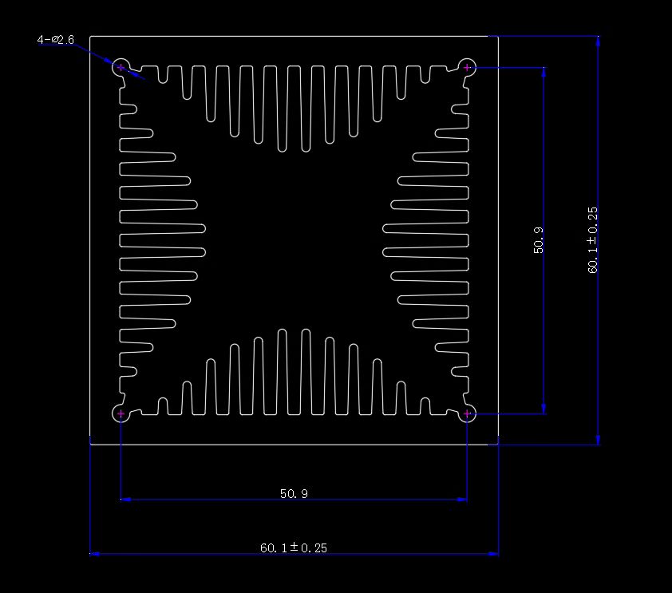

# “风洞款”散热片 — 60×60×60（挤压型）

> 型号别名：60×60×60 风洞型、四向内齿散热片。本文仅描述散热片本体几何与量测方法，不对风扇或风量作任何假设。

## 截面图与标注

## 核心几何（基于截面图复核）

- 外形：60.1 ± 0.25 mm 正方截面，高度 60 mm（可定制长度）。
- 内净口：约 50.9 mm（图上标注，见“复测模板”）。
- 结构：中心对称“四向”风道，四边均向内延伸鳍片；每边约 12 根，合计 ≈ 48 根。
- 鳍片类型：
  - 顶/底：纵向 U 形细齿；
  - 左/右：阶梯式横向片齿。
- 壁厚：外壁约 4.3 mm；内侧与鳍片阵列之间留有 ~12.7 mm 侧向通道。

注：截面图仅供像素量测参考；以图纸标注为准，并在现场重新测量确认。

## 像素量测近似参数（容许 ±0.3 mm 误差）

- **像素尺**：外边 60.1 mm 对应 512 px → **0.117 mm/px**。
- **内净口**：434 px ≈ **50.9 mm**（与图纸一致）。
- **侧通道（左右）**：外壁至内腔平均 **4.6 mm**。
- **内腔高度**：约 **50.9 mm**（方形），对应换热通道有效高度。
- **顶部纵向鳍片**（按 y=140–170 px 多行统计）：
  - 数量：每个方向约 **12 根**（上下相同）。
  - 平均鳍厚（齿尖）：**0.18 mm**；靠根部处量得 **0.32 mm** 左右。
  - 平均节距（鳍厚 + 气道）：**3.3 mm**；从中心向两端逐渐增大，末端鳍片明显缩短。
- **中央开口（上下对吹通道）**：像素统计约 **13.6 mm** 宽。
- **内表面积**（鳍片 + 内壁，长度 60 mm）：像素积分约 **0.137 m²**（≈1370 cm²）。
- **左右阶梯鳍**：每侧 ≈12 级，平均厚度与纵向鳍同量级；阶梯长度随高度逐渐增大（需实物确认）。
- **开孔率**：以内腔 50.9 mm 方形计算，理论值约 **0.72**。

> 测量方法：以 60.1 mm 纵/横标注换算像素尺，在多条扫描线（y=160–370 px）上统计亮/暗段长度；逼近实值时舍去最外侧墙体及中央大孔后取均值。受抗锯齿与图像分辨率影响，厚度类数据建议作为“到货前估计”，最终仍需到现场用卡尺校正。

## 有效通风截面（与风扇无关的几何量）

- 有效开孔率（依据截面像素与内净口）：约 72%。
- 对应有效流通面积 Aₐ：Aₐ ≈ 0.0023–0.0026 m²（仅由几何决定）。
- 当获得风量 Q 时，可计算平均流速 v：v = Q / Aₐ（SI：m/s，Q 用 m³/s）。

## 换热计算框架（参数化，不假设风扇）

- 近似湿周 P_total：1.0–1.2 m（由四边 12×4 鳍片几何推得，可在“现场复测清单”复算修正）。
- 来风方向长度 L（切割长度，单位 m）得到等效换热面积：A ≈ P_total × L。
- 估算步骤（自行填入工况参数）：
  1) 给定空气性质（ρ, μ, k, Pr）与平均流速 v（由 Q/Aₐ 计算）。
  2) 依据代表水力直径 D_h 估算 Re = ρ v D_h / μ。
  3) 选用相关式（如 Dittus–Boelter/Gnielinski，按通道类型与 Re、Pr 取值）求 Nu，进而 h = Nu·k/D_h。
  4) 损耗能力 P ≈ h · A · ΔT（未计鳍片效率与界面热阻）。

注：上式仅给出计算路径，不给出具体数值；请在确定风量/风速后代入计算。

## 现场复测清单

- 内净口尺寸：黄色框四边各 3 点，记均值；
- 每边鳍片计数：期望 12 根，记录异常；
- 鳍片厚度 t、间距 s、有效高度 h_eff：每边各抽样 3 处；
- 复算开孔率/湿周/面积，回填到本页；
- 拍照并编号，保存为 `docs/heatsinks/assets/wt6060/现场-YYYYMMDD/…`。

## 与系统集成要点

- 与所选风扇或风道严密贴合，优先封堵四周旁路以维持静压；
- 器件（TO‑247×2 + TO‑220×1）沿底面布置，器件间距 ≥ 5 mm；
- 建议定期清洁，窄通道易积尘；
- 若存在电位差，配合绝缘导热片与绝缘垫圈，校核耐压。
