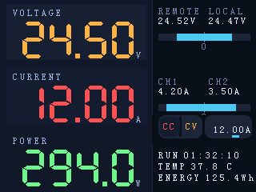
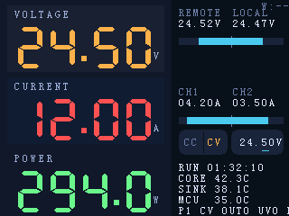

# LoadLynx Main Display UI

> Mock is rendered at 320×240 px, matching the landscape frame buffer of the P024C128-CTP module (`docs/other-datasheets/p024c128-ctp.md`).

## Panel Constraints

- Module: Shenzhen P&O P024C128-CTP, 2.4 in, RGB vertical stripe, 4-wire SPI.
- Native grid: 320 px (X) × 240 px (Y) when mounted landscape in the enclosure.
- Active area: 48.96 mm × 36.72 mm; enforce ≥4 px safe margins and align objects to an 8 px baseline wherever possible.

## Layout Breakdown

| Zone | Pixel bounds (x1,y1)-(x2,y2) | Notes |
| --- | --- | --- |
| Left primary block | (0,0)-(189,239) | Holds voltage, current, power. Each card is 72 px tall with 6 px gutters and tinted slab backgrounds to reinforce grouping. |
| Right status block | (190,0)-(319,239) | Remote/local voltage、CH1/CH2 currents、runtime、temperature、energy，依次垂直排列。 |

### Left block element map

| Element | Style | Content | Font | Placement (px) |
| --- | --- | --- | --- | --- |
| Voltage label | `#9AB0D8` caption | VOLTAGE | SmallFont (8×12) | (16,10) |
| Voltage digits | `#FFB347` | 24.50 (decimal dot rendered manually) | SevenSegNumFont (32×50) | 左区 80 px 高度段 #1：数字/单位右对齐至 x=170，绘制区域 `(24,28)-(170,72)` |
| Voltage unit | `#9AB0D8` | V | SmallFont | 基线 y=72，与数字紧贴 |
| Current label | `#9AB0D8` | CURRENT | SmallFont | (16,90) |
| Current digits | `#FF5252` | 12.00 | SevenSegNumFont | 左区 80 px 高度段 #2：区域 `(24,108)-(170,152)`，右对齐至 x=170 |
| Current unit | `#9AB0D8` | A | SmallFont | 基线 y=152，与数字相连 |
| Power label | `#9AB0D8` | POWER | SmallFont | (16,170) |
| Power digits | `#6EF58C` | 294.0 | SevenSegNumFont | 左区 80 px 高度段 #3：区域 `(24,188)-(170,232)`，右对齐至 x=170，支持 0.1 W 精度 |
| Power unit | `#9AB0D8` | W | SmallFont | 基线 y=232，与数字紧贴并仍留 8 px 底边距 |

### 数字精度规范（布局稳定：固定总位数）

| 指标 | 显示形式 | 备注 |
| --- | --- | --- |
| 左列电压/电流 | 固定 `DD.dd`（4 个数字 + 1 个小数点），四舍五入到 0.01 → 例如 `24.50`, `03.20` | 固定宽度用于布局稳定；两位整数不足时左侧补零。异常/超出显示能力时显示 `99.99`。 |
| 左列功率 | 固定 `DDD.d`（4 个数字 + 1 个小数点），四舍五入到 0.1 → 例如 `294.0`, `001.1` | 固定宽度用于布局稳定；三位整数不足时左侧补零。异常/超出显示能力时显示 `999.9`。 |
| 右列远/近端电压、通道电流 | 固定 `DD.dd` + 单位（例如 `24.52V`, `04.20A`），四舍五入到 0.01 | 保持与左侧主读数一致的总位数策略以避免“空间忽大忽小”的观感。 |
| 温度 | 0 或 1 位小数（`37°` 或 `37.8°`），根据传感器噪声门限自动选择 | 单位符号与数值之间保留 1 空格。 |
| 运行时间、能量 | 现有格式 (`HH:MM:SS`, `125.4Wh`) | 如需更多精度，在右列列表中扩展即可。 |

### Right block element map（对称双值布局）

| Pair | Payload | Font | Color | Placement |
| --- | --- | --- | --- | --- |
| Voltage pair | 左列 REMOTE `24.52 V`，右列 LOCAL `24.47 V` | 标签 SmallFont；数值 SmallFont（字符间距 0，强制 4 位数格式） | 文本 `#DFE7FF`、标签 `#6D7FA4` | 左列起点 (198,8)，右列起点 (258,8) |
| Voltage mirror bar | 中心 0 V，左右各 55 px 行程（上限 40 V） | — | 轨道 `#1C2638`，填充与两侧条统一使用 `#4CC9F0`，中心刻度 `#6D7FA4` | 长条 `(198,44)-(314,50)`，中心 x=256 |
| Current pair | 左列 CH1 `4.20 A`，右列 CH2 `3.50 A` | 标签 SmallFont；数值 SmallFont（字符间距 0，强制 4 位数格式） | 同上 | 左列起点 (198,96)，右列起点 (258,96) |
| Current mirror bar | 0 A 居中，上限 5 A/通道 | — | 轨道 `#1C2638`，填充 `#4CC9F0` | 长条 `(198,132)-(314,138)`，中心 x=256 |
| Control row (v2) | 模式切换（CC/CV）+ 当前 preset 目标值（单位随模式变更） | SmallFont | 背景 `#1C2638`；CC 文本 `#FF5252`；CV 文本 `#FFB347`；数值 `#DFE7FF`；选中位下划线 `#4CC9F0` | 行背景：`y=144..172`；MODE pill `(198,144)-(252,172)`；VALUE pill `(256,144)-(314,172)`；默认选中十分位（0.1），不显示“步长”文本 |
| Run status line | “RUN 01:32:10” | SmallFont | `#DFE7FF` | Baseline at `(198,200)` |
| Temperature line | “TEMP 37.8°C” | SmallFont | `#DFE7FF` | Baseline at `(198,214)` |
| Energy line | “ENERGY 125.4Wh” | SmallFont | `#DFE7FF` | Baseline at `(198,228)` |

> Mirror bars：中心刻度标注 `0`，左半对应该对数据中的左值，右半对应右值。左/右填充长度 = `min(value / limit, 1.0) * half_width`，其中电压上限 40 V，电流上限 5 A。

## Color Palette

| Token | Hex | Usage |
| --- | --- | --- |
| canvas | `#05070D` | Root background. |
| left-base | `#101829` | Base fill for the left column. |
| card tints | `#171F33` / `#141D2F` / `#111828` | Voltage/current/power slabs. |
| voltage-accent | `#FFB347` | High-visibility voltage digits. |
| current-accent | `#FF5252` | High-visibility current digits. |
| power-accent | `#6EF58C` | High-visibility power digits. |
| caption | `#9AB0D8` | All labels and units. |
| right-label | `#6D7FA4` | Secondary text in the right block. |
| right-value | `#DFE7FF` | Status numerics. |
| bar-track | `#1C2638` | Neutral progress-bar background. |
| bar-fill | `#4CC9F0` | Remote/local voltage + channel load percentage. |
| divider | `#1C2A3F` | Column split. |

## Typography (UTFT bitmap fonts)

| Usage | Font | Notes |
| --- | --- | --- |
| Large numerics | `SevenSegNumFont` (32×50) | Numeric-only font from rinkydink; decimal dot drawn as a 6×6 block aligned 8 px above the baseline. Stored at `docs/assets/fonts/SevenSegNumFont.c`. |
| Labels & units | `SmallFont` (8×12) | Default UTFT font. Stored at `docs/assets/fonts/SmallFont.c`. |
| Status values | `SmallFont` (8×12) | Current firmware UI uses UTFT `SmallFont` for all right-column text (labels + values) for predictable spacing. |

All fonts were downloaded from http://rinkydinkelectronics.com/r_fonts.php (Public Domain) and rendered pixel-by-pixel to ensure firmware/layout parity.

## Data Binding & Refresh

1. **Left metrics**
   - Sample at 1 kHz, low-pass (α = 0.3), refresh UI at 20 Hz.
   - When a limit is exceeded, flash a 2 px strip along the top edge of the affected card using `#FF5252` (over) or `#6EF58C` (under).
   - Decimal dot: draw a filled 6×6 square at `y = glyph_baseline − 8` so it lines up with the mock.
2. **Right status**
   - Voltage bars = `clamp(V_measured / V_range)` with default `V_range = 30 V`.
   - Channel bars = `clamp(I_actual / I_rating)`（默认：CH1 5 A，CH2 5 A，对应两路 5 A 额定功率通道；总目标电流 <2 A 时 CH2 预期为 0 A，≥2 A 时两路条形图预期近似对称）。
   - **Control row (v2)** replaces the legacy “SET I” line:
     - Shows the **current preset** `mode` (`CC`/`CV`) and the **current preset target** (unit follows the active mode).
     - Target value is sourced from the digital preset model (not measured values), right-aligned to x=314.
     - The selected adjustment digit is indicated by a short underline; do not show explicit “step” text.
   - Runtime + energy update at 2 Hz, temperature at 5 Hz. Keep color semantics fixed for muscle memory.

## Interaction Hooks

### Control row (v2) touch + encoder

#### Tap targets (logical pixel bounds)

- MODE pill background: `(198,144)-(252,172)` (rounded rectangle, no border)
  - **CC button**: `(200,146)-(224,170)`
  - **CV button**: `(226,146)-(250,170)`
- VALUE pill background: `(256,144)-(314,172)` (rounded rectangle, no border)
  - Tap the **ones / tenths / hundredths** digit to select the active adjustment digit (highlighted by a short underline). The underline is *not* a “step display”.

#### Behavior

- Tap **CC** / **CV**: updates the **current preset** `mode` immediately (temporary v2 behavior; no extra “apply” step), and MUST force `output_enabled=false` for safety.
- Rotate encoder: adjusts the selected target for the **current preset**:
  - CC: `target_i_ma` (A)
  - CV: `target_v_mv` (V)
  - Adjustment digit options: ones / tenths / hundredths; default is tenths (0.1).
  - The selected digit MUST be remembered (do not show step text in the UI).
- Encoder push button (temporary v2 behavior):
  - Short press: toggle `output_enabled` for the current preset.
  - Long press (~800ms): cycle `active_preset_id` (P1..P5), and force `output_enabled=false`.

### Operator quick guide (v2)

- Tap the **CC** or **CV** text inside the right-side rounded pill to switch the current preset mode (output is forced OFF for safety).
- Tap a digit in the right-side value pill to select the adjustment digit (underline indicates ones / tenths / hundredths; default is tenths = 0.1).
- Rotate the encoder to change the current preset target:
  - CC → current target (A)
  - CV → voltage target (V)

## Assets

- `docs/assets/main-display/main-display-mock-v2-cc.png` — pixel-level mock (v2, CC active).
- `docs/assets/main-display/main-display-mock-v2-cv.png` — pixel-level mock (v2, CV active).
- `docs/assets/fonts/*.c` — raw UTFT fonts bundled for reproducible rendering.

## Regenerating the mock PNGs

Run:

- `cargo run --manifest-path tools/ui-mock/Cargo.toml`

This renders `UiSnapshot::demo()` through the firmware UI code and writes fresh PNGs into `docs/assets/main-display/`.
