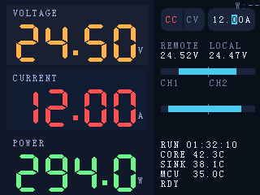
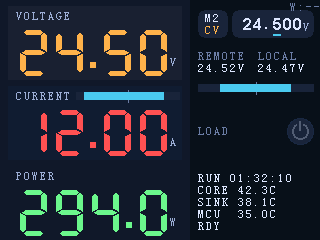

# LoadLynx Main Display UI

> Mock is rendered at 320×240 px, matching the landscape frame buffer of the P024C128-CTP module (`docs/other-datasheets/p024c128-ctp.md`).
>
> NOTE: The main-screen control row interaction is defined by `docs/plan/0005:on-device-preset-ui/PLAN.md` and replaces the legacy “tap CC/CV + encoder digit adjust” behavior previously described here.

## 需求说明

- 左列 `CURRENT`：将两路电流镜像条（CH1/CH2）移动到 `CURRENT` 标签右侧，仅显示条形图（不显示 `CH1/CH2` 文本标签）；条形图宽度自适应剩余空间，不得溢出当前卡片。
- 右列：删除原 `CH1/CH2` 电流区块（标签与条形图均不显示）。
- 除以上要点外，其余布局与信息保持不变（control row、左列三大读数、右列 status lines 等）。

## Panel Constraints

- Module: Shenzhen P&O P024C128-CTP, 2.4 in, RGB vertical stripe, 4-wire SPI.
- Native grid: 320 px (X) × 240 px (Y) when mounted landscape in the enclosure.
- Active area: 48.96 mm × 36.72 mm; enforce ≥4 px safe margins and align objects to an 8 px baseline wherever possible.

## Layout Breakdown

| Zone | Pixel bounds (x1,y1)-(x2,y2) | Notes |
| --- | --- | --- |
| Left primary block | (0,0)-(189,239) | Holds voltage, current, power. Each card is 72 px tall with 6 px gutters and tinted slab backgrounds to reinforce grouping. |
| Right status block | (190,0)-(319,239) | control row、Remote/local voltage、status lines，依次垂直排列。 |

### Left block element map

| Element | Style | Content | Font | Placement (px) |
| --- | --- | --- | --- | --- |
| Voltage label | `#9AB0D8` caption | VOLTAGE | SmallFont (8×12) | (16,10) |
| Voltage digits | `#FFB347` | 24.50 (decimal dot rendered manually) | SevenSegNumFont (32×50) | 左区 80 px 高度段 #1：数字/单位右对齐至 x=170，绘制区域 `(24,28)-(170,72)` |
| Voltage unit | `#9AB0D8` | V | SmallFont | 基线 y=72，与数字紧贴 |
| Current label | `#9AB0D8` | CURRENT | SmallFont | (16,90) |
| Current mirror bar | 轨道 `#1C2638`、填充 `#4CC9F0`、中心刻度 `#6D7FA4` | Mirror bar（CH1 left / CH2 right，无标签） | — | `CURRENT` 标签右侧，动态宽度：`x=(label_end+4)..(CARD_BG_RIGHT-2)`（限制在当前卡片背景内，不得溢出到右侧区块）；默认 `CURRENT` 文本宽 56 px → `x=76..180`；`y=92..99` |
| Current digits | `#FF5252` | 12.00 | SevenSegNumFont | 左区 80 px 高度段 #2：区域 `(24,108)-(170,152)`，右对齐至 x=170 |
| Current unit | `#9AB0D8` | A | SmallFont | 基线 y=152，与数字相连 |
| Power label | `#9AB0D8` | POWER | SmallFont | (16,170) |
| Power digits | `#6EF58C` | 294.0 | SevenSegNumFont | 左区 80 px 高度段 #3：区域 `(24,188)-(170,232)`，右对齐至 x=170，支持 0.1 W 精度 |
| Power unit | `#9AB0D8` | W | SmallFont | 基线 y=232，与数字紧贴并仍留 8 px 底边距 |

### 数字精度规范（布局稳定：固定总位数）

| 指标 | 显示形式 | 备注 |
| --- | --- | --- |
| 左列电压/电流 | 固定 `DD.dd`（4 个数字 + 1 个小数点），四舍五入到 0.01 → 例如 `24.50`, `03.20` | 固定宽度用于布局稳定；两位整数不足时左侧补零。异常/超出显示能力时显示 `99.99`。 |
| 左列功率 | 固定 `DDD.d`（4 个数字 + 1 个小数点），四舍五入到 0.1 → 例如 `294.0`, `001.1` | 固定宽度用于布局稳定；三位整数不足时左侧补零。异常/超出显示能力时显示 `999.9`。 |
| 右列远/近端电压 | 固定 `DD.dd` + 单位（例如 `24.52V`），四舍五入到 0.01 | 保持与左侧主读数一致的总位数策略以避免“空间忽大忽小”的观感。 |
| 电流镜像条 | 仅显示两路镜像条形图（无 `CH1/CH2` 文本标签，不显示单通道数值） | 条形图位于左列 `CURRENT` 标签右侧；右列不再显示 `CH1/CH2` 区块。 |
| 温度 | 0 或 1 位小数（`37°` 或 `37.8°`），根据传感器噪声门限自动选择 | 单位符号与数值之间保留 1 空格。 |
| 运行时间、能量 | 现有格式 (`HH:MM:SS`, `125.4Wh`) | 如需更多精度，在右列列表中扩展即可。 |

### Right block element map（对称双值布局）

| Pair | Payload | Font | Color | Placement |
| --- | --- | --- | --- | --- |
| Control row | 主界面 Preset 概览与入口：左侧两行 `M#` / `CC|CV`（独立按钮）+ 右侧 target 摘要（独立按钮，单位随 mode 变更） | SmallFont + SetpointFont | 背景 `#1C2638`；`CC` 红 `#FF5252`；`CV` 橙 `#FFB347`；数字 `#DFE7FF`；单位 `#9AB0D8` | 两个圆角矩形：Preset/Mode `(198,10)-(228,38)`；Setpoint `(232,10)-(314,38)`；分别用于：显示 active preset（含编号与 mode）+ 显示 target 摘要；交互语义详见 `docs/plan/0005:on-device-preset-ui/PLAN.md`。 |
| Voltage pair | 左列 REMOTE `24.52 V`，右列 LOCAL `24.47 V` | 标签 SmallFont；数值 SmallFont（字符间距 0，强制 4 位数格式） | 文本 `#DFE7FF`、标签 `#6D7FA4` | 左列起点 (198,50)，右列起点 (258,50) |
| Voltage mirror bar | 中心 0 V，左右各 55 px 行程（上限 40 V） | — | 轨道 `#1C2638`，填充与两侧条统一使用 `#4CC9F0`，中心刻度 `#6D7FA4` | 长条 `(198,84)-(314,91)`，中心 x=256 |
| Status lines (5) | 运行时间 + 温度 + 状态行（例如 `RUN 01:32:10`、`CORE 42.3C`、`SINK 38.1C`、`MCU 35.0C`、`RDY` / `CAL` / `OFF` / `LNK` / `UVLO` / `OCF` / `OVP` / `OTP` / `FLT 0x12345678`） | SmallFont | 默认 `#DFE7FF`；**Status line #5 在异常时闪烁（`#FF5252` ⇄ `#FFFFFF`）** | Right block 底部对齐：Top-left at `(198,172)` 起，每行 +12px，底边距约 12px（**每行最多 15 字符**，避免右侧被裁切） |

### Status line #5：状态文案（对外缩写，禁止 debug 噪声）

- 正常就绪：`RDY`
- 模拟板离线（从未建链）：`OFF`
- 校准缺失：`CAL`
- 当显示“原因缩写”（`OFF/LNK/UVLO/OCP/OPP/OCF/OVP/OTP/FLT`）时，需要闪烁（文本双色切换），用于提示“异常/无法启用/强制关断”。
- 最高级别故障（Critical）：
  - 链路持续故障：`LNK`（曾经建链后连续掉线；短暂掉线仅屏幕提示；持续掉线达到阈值后进入 Critical，默认：连续无有效帧 `≥3s`）
  - 模拟板故障（`fault_flags != 0`）：优先显示更具体的缩写（若可判定）：
    - `OCF`：过流故障（Over‑Current Fault）
    - `OVP`：过压故障（Over‑Voltage Protection）
    - `OTP`：过温故障（Over‑Temperature Protection）
  - 无法判定/多故障并存：`FLT` 或 `FLT 0x12345678`（保留位域便于排查）
- 预设保护触发（Protection Trip，等待用户确认）：
  - `UVLO`：欠压锁存触发（Undervoltage Lockout）
  - `OCP`：过流保护触发（相对预设阈值，Over‑Current Protection）
  - `OPP`：过功率保护触发（相对预设阈值，Over‑Power Protection）
- UX 约束：
  - 在用户**未尝试启用负载**之前，UI 不应主动显示 `UVLO/OCP/OPP` 这类“负载输入相关”的缩写（启用前未连接被测设备是常见情况）；启用失败后可短暂显示原因缩写用于解释。
- **禁止显示**：`P1..P5`、`CC/CV`、`OUT0/OUT1`、`UV0/UV1` 等调试位域（易误读且会被裁切）

> Mirror bars：中心刻度标注 `0`，左半对应该对数据中的左值，右半对应右值。左/右填充长度 = `min(value / limit, 1.0) * half_width`，其中电压上限 40 V，电流上限 5 A。

### Control row：目标值文本格式（固定宽度）

- 主界面的 target 摘要文本固定为 7 字符：`DD.dddU`（例如 `12.000A`、`24.500V`）。
- 数值部分 `DD.ddd` 使用 `SetpointFont`（10×18）绘制；单位 `U` 仍使用 `SmallFont`（8×12）绘制并紧贴其右侧。
- 主界面不显示“选中位高亮”（避免被误认为可点选子区域）。

## Color Palette

| Token | Hex | Usage |
| --- | --- | --- |
| canvas | `#05070D` | Root background. |
| left-base | `#101829` | Base fill for the left column. |
| card tints | `#171F33` / `#141D2F` / `#111828` | Voltage/current/power slabs. |
| voltage-accent | `#FFB347` | High-visibility voltage digits. |
| current-accent | `#FF5252` | High-visibility current digits. |
| power-accent | `#6EF58C` | High-visibility power digits. |
| caption | `#9AB0D8` | All labels and units. |
| right-label | `#6D7FA4` | Secondary text in the right block. |
| right-value | `#DFE7FF` | Status numerics. |
| bar-track | `#1C2638` | Neutral progress-bar background. |
| bar-fill | `#4CC9F0` | Remote/local voltage + channel load percentage. |
| divider | `#1C2A3F` | Column split. |

## Typography (UTFT bitmap fonts)

| Usage | Font | Notes |
| --- | --- | --- |
| Large numerics | `SevenSegNumFont` (32×50) | Numeric-only font from rinkydink; decimal dot drawn as a 6×6 block aligned 8 px above the baseline. Stored at `docs/assets/fonts/SevenSegNumFont.c`. |
| Labels & units | `SmallFont` (8×12) | Default UTFT font. Stored at `docs/assets/fonts/SmallFont.c`. |
| Setpoint digits | `SetpointFont` (10×18) | Larger numeric font for the control-row target summary (`DD.ddd`). Derived from UTFT `arial_bold` (16×16) by cropping (no resampling) into a consistent 10 px window and padding the height to 18 px; unit stays on `SmallFont`. |
| Status values | `SmallFont` (8×12) | Current firmware UI uses UTFT `SmallFont` for all right-column text (labels + values) for predictable spacing. |

`SevenSegNumFont` / `SmallFont` were downloaded from http://rinkydinkelectronics.com/r_fonts.php (Public Domain). `SetpointFont` is a small custom bitmap font to keep the control row readable without changing the overall layout grid.

## Data Binding & Refresh

1. **Left metrics**
   - Sample at 1 kHz, low-pass (α = 0.3), refresh UI at 20 Hz.
   - When a limit is exceeded, flash a 2 px strip along the top edge of the affected card using `#FF5252` (over) or `#6EF58C` (under).
   - Decimal dot: draw a filled 6×6 square at `y = glyph_baseline − 8` so it lines up with the mock.
   - 左侧 `CURRENT` 仅显示合计电流主读数（数值 + 单位）；两路通道电流以 `CURRENT` 标签右侧镜像条形图表达（无文字标签，不显示单通道数值文本）。
2. **Right status**
   - Voltage bars = `clamp(V_measured / V_range)` with default `V_range = 40 V`.
   - **Control row** replaces the legacy “SET I” line:
     - Shows the active preset `<M#><MODE>` and a target summary `DD.dddU` (unit follows the active mode).
     - Target value is sourced from the digital preset model (not measured values).
     - No per-digit adjustment highlight is shown on the main screen; editing occurs in the Preset Panel.
   - Runtime + energy update at 2 Hz, temperature at 5 Hz. Keep color semantics fixed for muscle memory.

## Interaction Hooks

### USB‑PD settings panel

- 入口：主界面 `PD` 按钮**短按**进入 `USB‑PD Settings` 面板；`Back` 返回主界面。
- 模式切换：顶部 `Fixed / PPS` 两段式按钮切换模式（仅切换编辑视图，不自动联动负载开关/设定值）。
- 能力列表：
  - `Fixed`：全量展示 Fixed PDO 列表；点击行选择目标 PDO（以 `PDO{pos}` 表示 object position，1-based）。
  - `PPS`：全量展示 PPS APDO 列表；**必须点击行显式选择**目标 APDO（`APDO{pos}`）后才允许 Apply（不做自动选）。
- 编辑与越界：
  - `PPS` 电压步进：`20mV/step`，并严格限制在所选 APDO 的 `min_mv..=max_mv` 范围内。
  - `Fixed/PPS` 请求电流 `Ireq`：`50mA/step`，并严格限制在所选 PDO/APDO 的 `Imax` 内。
- Apply 行为：
  - 点击 `Apply` 会把配置保存到 EEPROM，并触发数字板→模拟板的 PD 协商策略下发（`PD_SINK_REQUEST`）。
  - 若所选 PDO/APDO 在当前能力列表中不存在（例如更换了不支持该档位的充电器），面板显示 `Unavailable` 并禁用 `Apply`。

### Preset entry + quick switch

- Tap the Preset/Mode pill (`M# / CC|CV`) to open the Preset Panel.
- Press-and-swipe within the Preset/Mode pill performs a quick preset preview; releasing commits activation (and forces load OFF). Exact behavior and safety rules are defined in `docs/plan/0005:on-device-preset-ui/PLAN.md`.
- Tap the Setpoint pill (`DD.dddU`) to cycle encoder step size for the active preset (1.000 → 0.100 → 0.010 → 0.001 → …).

### Operator quick guide

- Tap `<M#><MODE>` to open the Preset Panel for full editing and saving.
- Use quick switch (press-and-swipe) to change active preset when you just need to move between stored presets quickly.

## Assets

- `docs/assets/main-display/main-display-mock-cc.png` — pixel-level mock (CC active).
- `docs/assets/main-display/main-display-mock-cv.png` — pixel-level mock (CV active).
- `docs/assets/usb-pd-settings-panel-rendered/pd-settings-fixed.png` — USB‑PD Settings（Fixed）渲染 mock。
- `docs/assets/usb-pd-settings-panel-rendered/pd-settings-pps.png` — USB‑PD Settings（PPS）渲染 mock。
- `docs/assets/usb-pd-settings-panel-rendered/pd-settings-unavailable.png` — USB‑PD Settings（Unavailable）渲染 mock。
- `docs/assets/fonts/*.c` — raw UTFT fonts bundled for reproducible rendering.
