# IRFP260NPBF Datasheet (Markdown Extract)

> Source PDF: https://www.infineon.com/assets/row/public/documents/24/49/infineon-irfp260n-datasheet-en.pdf

# infineon

<table><tr><td rowspan=1 colspan=1>V(BR)DSS</td><td rowspan=1 colspan=1>200V</td></tr><tr><td rowspan=1 colspan=1>RDS(on)max.</td><td rowspan=1 colspan=1>0.04Ω</td></tr><tr><td rowspan=1 colspan=1>ID</td><td rowspan=1 colspan=1>50A</td></tr></table>

# Features

Advanced Process Technology   
Dynamic dv/dt Rating   
$1 7 5 ^ { \circ } \complement$ Operating Temperature   
Fast Switching   
Fully Avalanche Rated   
Ease of Paralleling   
Simple Drive Requirements   
Lead-Free

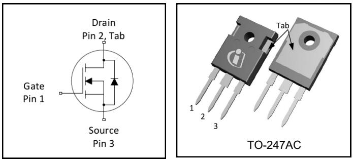

# Description

Fifth Generation HEXFET Power MOSFETs utilizes advanced processing techniques to achieve extremely low onresistance per silicon area. This benefit combined with the fast switching speed and ruggedized device design that HEXFET power MOSFETs are well known for, provides the designer with an extremely efficient and reliable device for use in a wide variety of other applications.

The TO-247AC package is preferred for commercial-industrial applications where higher power levels preclude th use of TO-220 devices. The TO-247AC is similar but superior to the earlier TO-218 package because of its isolated mounting hole.

<table><tr><td rowspan=2 colspan=1>Base part number</td><td rowspan=2 colspan=1>Package Type</td><td rowspan=1 colspan=2>Standard Pack</td><td rowspan=2 colspan=1>Orderable Part Number</td></tr><tr><td rowspan=1 colspan=1>Form</td><td rowspan=1 colspan=1>Quantity</td></tr><tr><td rowspan=1 colspan=1>IRFP260NPbF</td><td rowspan=1 colspan=1>TO-247AC</td><td rowspan=1 colspan=1>Tube</td><td rowspan=1 colspan=1>25</td><td rowspan=1 colspan=1>IRFP260NPbF</td></tr></table>

<table><tr><td rowspan=1 colspan=1>Symbol</td><td rowspan=1 colspan=1>Parameter</td><td rowspan=1 colspan=1>Max.</td><td rowspan=1 colspan=1>Units</td></tr><tr><td rowspan=1 colspan=1>ID @ Tc = 25°C</td><td rowspan=1 colspan=1>Continuous Drain Current, VGs @ 10V</td><td rowspan=1 colspan=1>50</td><td rowspan=3 colspan=1>A</td></tr><tr><td rowspan=1 colspan=1>ID @ Tc = 100°C</td><td rowspan=1 colspan=1>Continuous Drain Current, Vgs @ 10V</td><td rowspan=1 colspan=1>35</td></tr><tr><td rowspan=1 colspan=1>IDM</td><td rowspan=1 colspan=1>Pulsed Drain Current</td><td rowspan=1 colspan=1>200</td></tr><tr><td rowspan=1 colspan=1>PD @Tc = 25°C</td><td rowspan=1 colspan=1>Maximum Power Dissipation</td><td rowspan=1 colspan=1>300</td><td rowspan=1 colspan=1>W</td></tr><tr><td rowspan=1 colspan=1></td><td rowspan=1 colspan=1>Linear Derating Factor</td><td rowspan=1 colspan=1>2.0</td><td rowspan=1 colspan=1>W/</td></tr><tr><td rowspan=1 colspan=1>VGs</td><td rowspan=1 colspan=1>Gate-to-Source Voltage</td><td rowspan=1 colspan=1>±20</td><td rowspan=1 colspan=1>V</td></tr><tr><td rowspan=1 colspan=1>EAS</td><td rowspan=1 colspan=1>Single Pulse Avalanche Energy</td><td rowspan=1 colspan=1>560</td><td rowspan=1 colspan=1>mJ</td></tr><tr><td rowspan=1 colspan=1>AR</td><td rowspan=1 colspan=1>Avalanche Current</td><td rowspan=1 colspan=1>50</td><td rowspan=1 colspan=1>A</td></tr><tr><td rowspan=1 colspan=1>EAR</td><td rowspan=1 colspan=1>Repetitive Avalanche Energy⑦</td><td rowspan=1 colspan=1>30</td><td rowspan=1 colspan=1>mJ</td></tr><tr><td rowspan=1 colspan=1>dv/dt</td><td rowspan=1 colspan=1>Peak Diode Recovery dv/dt③</td><td rowspan=1 colspan=1>10</td><td rowspan=1 colspan=1>V/ns</td></tr><tr><td rowspan=1 colspan=1>TJTSTG</td><td rowspan=1 colspan=1>Operating Junction andStorage Temperature Range</td><td rowspan=1 colspan=1>-55 to + 175</td><td rowspan=2 colspan=1>C</td></tr><tr><td rowspan=1 colspan=1></td><td rowspan=1 colspan=1>Soldering Temperature, for 10 seconds (1.6mm from case)</td><td rowspan=1 colspan=1>300</td></tr><tr><td rowspan=1 colspan=1></td><td rowspan=1 colspan=1>Mounting torque, 6-32 or M3 screw</td><td rowspan=1 colspan=1>10 lbf·in (1.1N•m)</td><td rowspan=1 colspan=1></td></tr></table>

Thermal Resistance   

<table><tr><td rowspan=1 colspan=1>Symbol</td><td rowspan=1 colspan=1>Parameter</td><td rowspan=1 colspan=1>Typ.</td><td rowspan=1 colspan=1>Max.</td><td rowspan=1 colspan=1>Units</td></tr><tr><td rowspan=1 colspan=1>RθJc</td><td rowspan=1 colspan=1>Junction-to-Case</td><td rowspan=1 colspan=1></td><td rowspan=1 colspan=1>0.50</td><td rowspan=3 colspan=1>°C/W</td></tr><tr><td rowspan=1 colspan=1>Rθcs</td><td rowspan=1 colspan=1>Case-to-Sink, Flat, Greased Surface</td><td rowspan=1 colspan=1>0.24</td><td rowspan=1 colspan=1></td></tr><tr><td rowspan=1 colspan=1>RθJA$</td><td rowspan=1 colspan=1>Junction-to-Ambient</td><td rowspan=1 colspan=1></td><td rowspan=1 colspan=1>40</td></tr></table>

Static $\textcircled { \bullet } \mathsf { T } _ { \mathsf { J } } = 2 5 ^ { \circ } \mathsf { C }$ (unless otherwise specified)   

<table><tr><td rowspan=1 colspan=1></td><td rowspan=1 colspan=1>Parameter</td><td rowspan=1 colspan=1>Min.</td><td rowspan=1 colspan=1>Typ.</td><td rowspan=1 colspan=1>Max.</td><td rowspan=1 colspan=1>Units</td><td rowspan=1 colspan=1>Conditions</td></tr><tr><td rowspan=1 colspan=1>V(BR)DSS</td><td rowspan=1 colspan=1>Drain-to-Source Breakdown Voltage</td><td rowspan=1 colspan=1>200</td><td rowspan=1 colspan=1></td><td rowspan=1 colspan=1>—</td><td rowspan=1 colspan=1>V</td><td rowspan=1 colspan=1>VGs = 0V, ID = 250μA</td></tr><tr><td rowspan=1 colspan=1>ΔV(BR)DSs/ΔTj</td><td rowspan=1 colspan=1>Breakdown Voltage Temp. Coefficient</td><td rowspan=1 colspan=1></td><td rowspan=1 colspan=1>0.26</td><td rowspan=1 colspan=1></td><td rowspan=1 colspan=1>V/</td><td rowspan=1 colspan=1>Reference to 25°C, ID = 1mA</td></tr><tr><td rowspan=1 colspan=1>RDS(on)</td><td rowspan=1 colspan=1>Static Drain-to-Source On-Resistance</td><td rowspan=1 colspan=1>—</td><td rowspan=1 colspan=1></td><td rowspan=1 colspan=1>0.04</td><td rowspan=1 colspan=1>Ω</td><td rowspan=1 colspan=1>VGs = 10V, ID = 28A ④</td></tr><tr><td rowspan=1 colspan=1>VGs(th)</td><td rowspan=1 colspan=1>Gate Threshold Voltage</td><td rowspan=1 colspan=1>2.0</td><td rowspan=1 colspan=1></td><td rowspan=1 colspan=1>4.0</td><td rowspan=1 colspan=1>V</td><td rowspan=1 colspan=1>VDs = VGs, ID = 250μA</td></tr><tr><td rowspan=1 colspan=1>gfs</td><td rowspan=1 colspan=1>Forward Trans conductance</td><td rowspan=1 colspan=1>27</td><td rowspan=1 colspan=1></td><td rowspan=1 colspan=1></td><td rowspan=1 colspan=1>S</td><td rowspan=1 colspan=1>VDs = 50V, ID = 28A④</td></tr><tr><td rowspan=2 colspan=1>IDss</td><td rowspan=2 colspan=1>Drain-to-Source Leakage Current</td><td rowspan=1 colspan=1>—</td><td rowspan=1 colspan=1></td><td rowspan=1 colspan=1>25</td><td rowspan=1 colspan=1>μA</td><td rowspan=1 colspan=1>VDs = 200V, VGs = 0V</td></tr><tr><td rowspan=1 colspan=1>—</td><td rowspan=1 colspan=1></td><td rowspan=1 colspan=1>250</td><td rowspan=1 colspan=1>μA</td><td rowspan=1 colspan=1>VDs = 160V,VGs = 0V,Tj=150°C</td></tr><tr><td rowspan=2 colspan=1>Igss</td><td rowspan=1 colspan=1>Gate-to-Source Forward Leakage</td><td rowspan=1 colspan=1>—</td><td rowspan=1 colspan=1>—</td><td rowspan=1 colspan=1>100</td><td rowspan=1 colspan=1>nA</td><td rowspan=1 colspan=1>VGs = 20V</td></tr><tr><td rowspan=1 colspan=1>Gate-to-Source Reverse Leakage</td><td rowspan=1 colspan=1></td><td rowspan=1 colspan=1></td><td rowspan=1 colspan=1>-100</td><td rowspan=1 colspan=1>nA</td><td rowspan=1 colspan=1>VGs =-20V</td></tr></table>

Dynamic Electrical Characteristics $\textcircled { \bullet } \mathsf { T } _ { \mathsf { J } } = 2 5 ^ { \circ } \mathsf { C }$ (unless otherwise specified)   

<table><tr><td rowspan=1 colspan=1>Qg</td><td rowspan=1 colspan=1>Total Gate Charge</td><td rowspan=1 colspan=1>—</td><td rowspan=1 colspan=1></td><td rowspan=1 colspan=1>234</td><td rowspan=2 colspan=1>nC</td><td rowspan=3 colspan=1>|D = 28AVDs = 160VVGs = 10V ④</td></tr><tr><td rowspan=1 colspan=1>Qgs</td><td rowspan=1 colspan=1>Gate-to-Source Charge</td><td rowspan=1 colspan=1></td><td rowspan=1 colspan=1></td><td rowspan=1 colspan=1>38</td></tr><tr><td rowspan=1 colspan=1>Qgd</td><td rowspan=1 colspan=1>Gate-to-Drain Charge</td><td rowspan=1 colspan=1>—</td><td rowspan=1 colspan=1></td><td rowspan=1 colspan=1>110</td><td rowspan=1 colspan=1></td></tr><tr><td rowspan=1 colspan=1>td(on)</td><td rowspan=1 colspan=1>Turn-On Delay Time</td><td rowspan=1 colspan=1>—</td><td rowspan=1 colspan=1>17</td><td rowspan=1 colspan=1></td><td rowspan=1 colspan=1></td><td rowspan=4 colspan=1>VDD = 100V|D = 28ARG= 1.8ΩVGs = 10V ④</td></tr><tr><td rowspan=1 colspan=1>tr</td><td rowspan=1 colspan=1>Rise Time</td><td rowspan=1 colspan=1>—</td><td rowspan=1 colspan=1>60</td><td rowspan=1 colspan=1>—</td><td rowspan=1 colspan=1>ns</td></tr><tr><td rowspan=1 colspan=1>td(off)</td><td rowspan=1 colspan=1>Turn-Off Delay Time</td><td rowspan=1 colspan=1>—</td><td rowspan=1 colspan=1>55</td><td rowspan=1 colspan=1>—</td><td rowspan=1 colspan=1>ns</td></tr><tr><td rowspan=1 colspan=1>tf</td><td rowspan=1 colspan=1>Fall Time</td><td rowspan=1 colspan=1>—</td><td rowspan=1 colspan=1>48</td><td rowspan=1 colspan=1>—</td><td rowspan=1 colspan=1></td></tr><tr><td rowspan=1 colspan=1>LD</td><td rowspan=1 colspan=1>Internal Drain Inductance</td><td rowspan=1 colspan=1>—</td><td rowspan=1 colspan=1>5.0</td><td rowspan=1 colspan=1>—</td><td rowspan=2 colspan=1>nH</td><td rowspan=2 colspan=1>Between lead,                     D6mm (0.25in.)from packageand center of die contact</td></tr><tr><td rowspan=1 colspan=1>Ls</td><td rowspan=1 colspan=1>Internal Source Inductance</td><td rowspan=1 colspan=1>—</td><td rowspan=1 colspan=1>13</td><td rowspan=1 colspan=1>—</td></tr><tr><td rowspan=1 colspan=1>Ciss</td><td rowspan=1 colspan=1>Input Capacitance</td><td rowspan=1 colspan=1>—</td><td rowspan=1 colspan=1>4057</td><td rowspan=1 colspan=1>—</td><td rowspan=3 colspan=1>pF</td><td rowspan=3 colspan=1>VGs = 0VVDs = 25Vf = 1.0MHz</td></tr><tr><td rowspan=1 colspan=1>Coss</td><td rowspan=1 colspan=1>Output Capacitance</td><td rowspan=1 colspan=1>—</td><td rowspan=1 colspan=1>603</td><td rowspan=1 colspan=1>—</td></tr><tr><td rowspan=1 colspan=1>Crss</td><td rowspan=1 colspan=1>Reverse Transfer Capacitance</td><td rowspan=1 colspan=1>—</td><td rowspan=1 colspan=1>161</td><td rowspan=1 colspan=1>—</td></tr></table>

Diode Characteristics   

<table><tr><td rowspan=1 colspan=1></td><td rowspan=1 colspan=1>Parameter</td><td rowspan=1 colspan=1>Min.</td><td rowspan=1 colspan=1>Typ.</td><td rowspan=1 colspan=1>Max.</td><td rowspan=1 colspan=1>Units</td><td rowspan=1 colspan=1>Conditions</td></tr><tr><td rowspan=1 colspan=1>Is</td><td rowspan=1 colspan=1>Continuous Source Current(Body Diode)</td><td rowspan=1 colspan=1></td><td rowspan=1 colspan=1></td><td rowspan=1 colspan=1>50</td><td rowspan=2 colspan=1>A</td><td rowspan=2 colspan=1>MOSFET symbol                   Dshowing theintegral reversep-n junction diode.                 ls</td></tr><tr><td rowspan=1 colspan=1>IsM</td><td rowspan=1 colspan=1>Pulsed Source Current(Body Diode)</td><td rowspan=1 colspan=1></td><td rowspan=1 colspan=1></td><td rowspan=1 colspan=1>200</td></tr><tr><td rowspan=1 colspan=1>VsD</td><td rowspan=1 colspan=1>Diode Forward Voltage</td><td rowspan=1 colspan=1></td><td rowspan=1 colspan=1></td><td rowspan=1 colspan=1>1.3</td><td rowspan=1 colspan=1>V</td><td rowspan=1 colspan=1>Tj = 25°C,Is = 28A,VGs = 0V ④</td></tr><tr><td rowspan=1 colspan=1>trr</td><td rowspan=1 colspan=1>Reverse Recovery Time</td><td rowspan=1 colspan=1></td><td rowspan=1 colspan=1>268</td><td rowspan=1 colspan=1>402</td><td rowspan=1 colspan=1>ns</td><td rowspan=2 colspan=1>T j = 25°C , IF = 28Adi/dt = 100A/μs ④</td></tr><tr><td rowspan=1 colspan=1>Qrr</td><td rowspan=1 colspan=1>Reverse Recovery Charge</td><td rowspan=1 colspan=1></td><td rowspan=1 colspan=1>1.9</td><td rowspan=1 colspan=1>2.8</td><td rowspan=1 colspan=1>μC</td></tr></table>

$\textcircled{1}$ Repetitive rating; pulse width limited by max. junction temperature. $\textcircled{2}$ Starting ${ \sf T } _ { \mathsf { J } } = 2 5 ^ { \circ } { \sf C }$ , $\mathsf { L } = 1 . 5 \mathsf { m H }$ , $\mathsf { R } _ { \mathsf { G } } = 2 5 \Omega$ , $1 _ { \mathsf { A S } } = 2 8 \mathsf { A }$ . $\textcircled{3}$ $\mathsf { I } _ { \mathsf { S D } } \leq 2 8 \mathsf { A }$ , di/dt $\leq 4 8 6 \mathsf { A } / \mu \mathsf { s }$ , $\mathsf { V } _ { \mathsf { D D } } \leq \mathsf { V } _ { ( \mathsf { B R } ) \mathsf { D S S } }$ , $\mathsf { T } _ { \mathsf { J } } \leq 1 7 5 ^ { \circ } \mathsf { C }$ . $\textcircled{4}$ Pulse width $\leq 4 0 0 \mu \mathsf { s }$ ; duty cycle $\leq 2 \%$ .

# Notes:

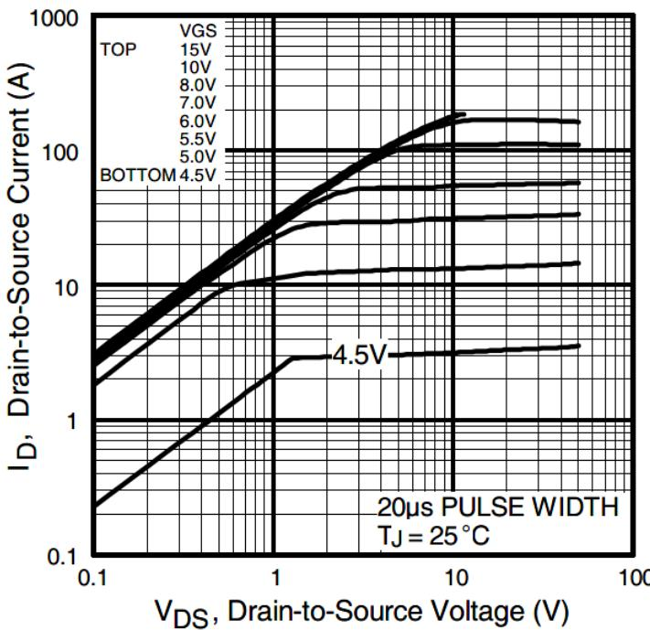  
Fig. 1 Typical Output Characteristics

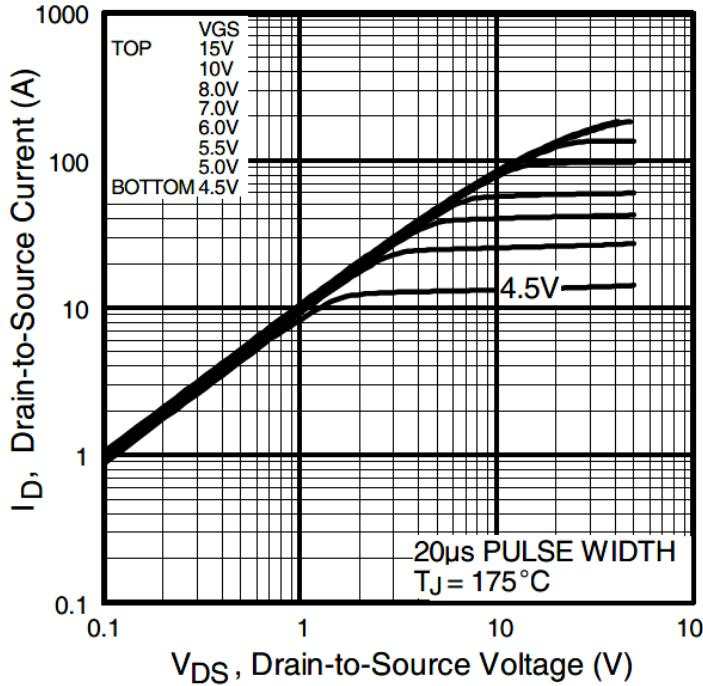  
Fig. 2 Typical Output Characteristics

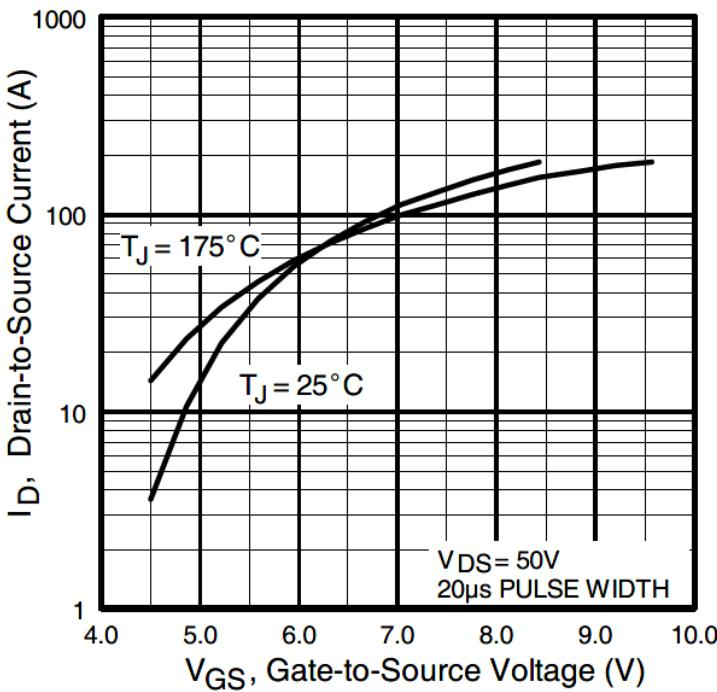  
Fig. 3 Typical Transfer Characteristics

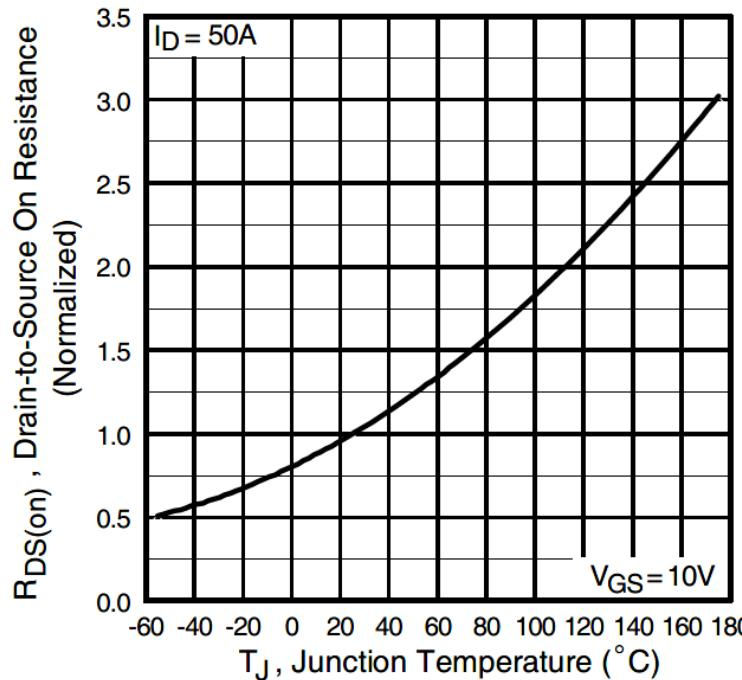  
Fig. 4 Normalized On-Resistance vs. Temperature

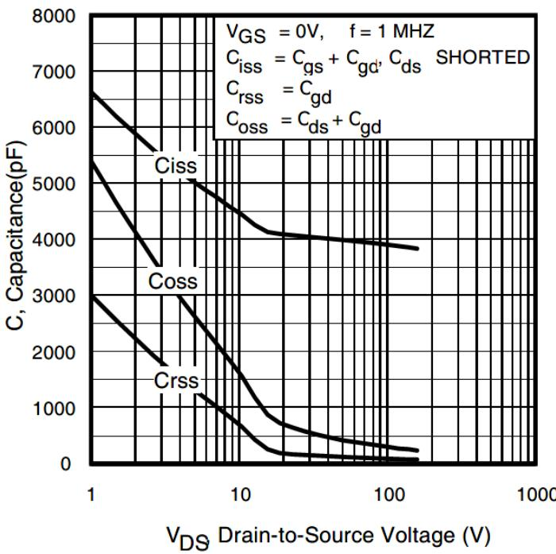  
Fig 5. Typical Capacitance vs. Drain-to-Source Voltage

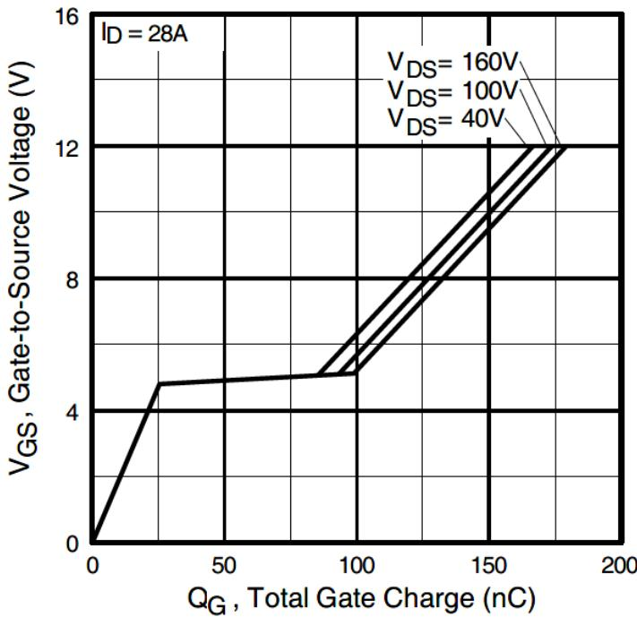  
Fig 6. Typical Gate Charge vs. Gate-to-Source Voltage

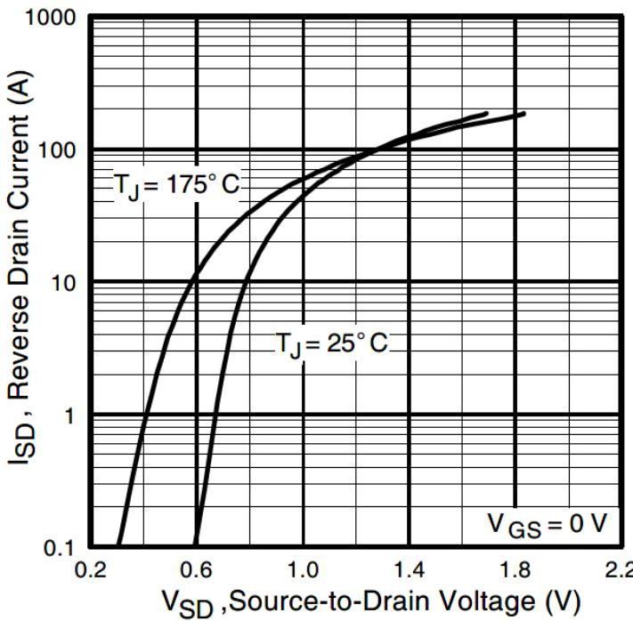  
Fig. 7 Typical Source-to-Drain Diode Forward Voltage

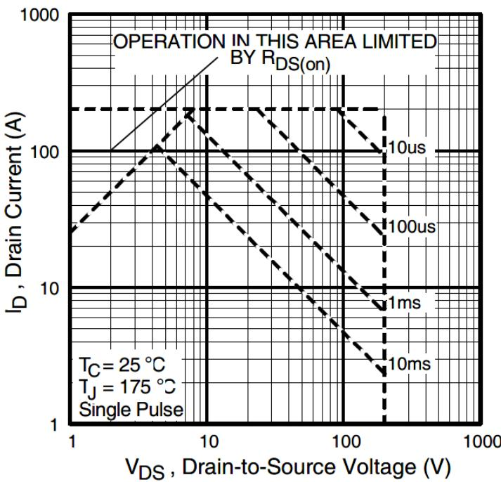  
Fig 8. Maximum Safe Operating Area

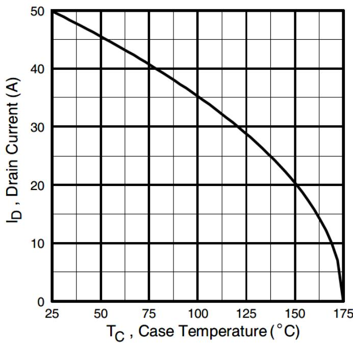  
Fig 9. Maximum Drain Current vs. Case Temperature

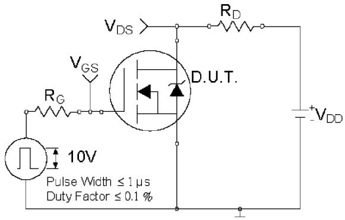  
Fig 10a. Switching Time Test Circuit

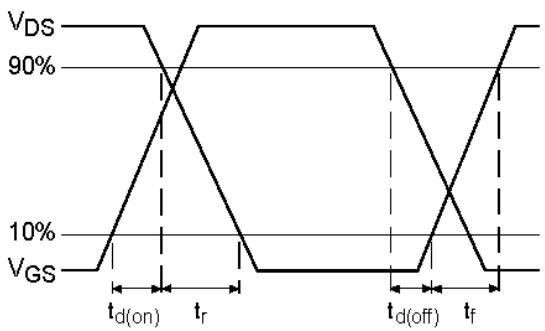  
Fig 10a. Switching Time Waveforms

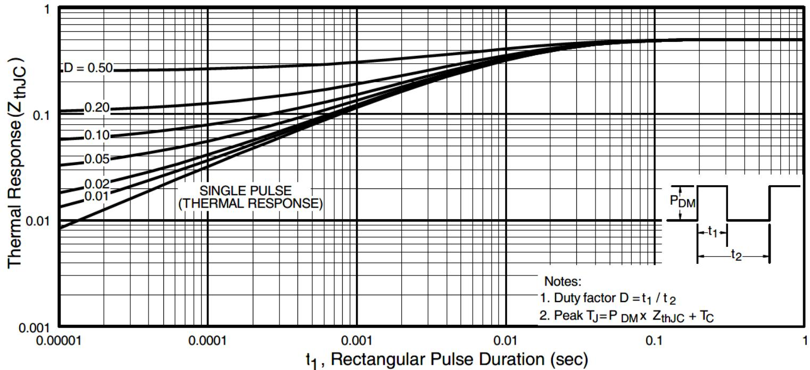  
Fig 11. Maximum Effective Transient Thermal Impedance, Junction-to-Case

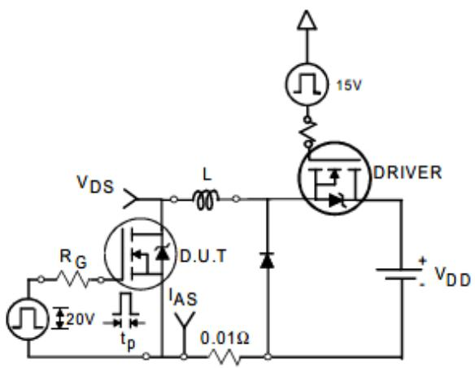  
Fig. 12a. Unclamped Inductive Test Circuit

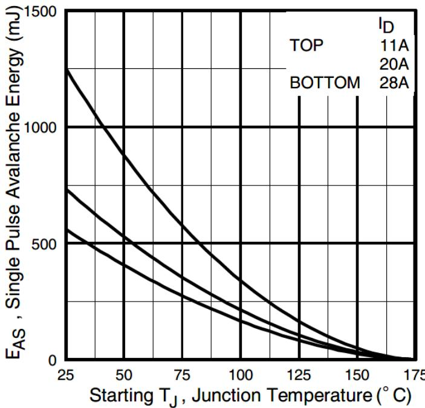  
Fig 12c. Maximum Avalanche Energy vs. Drain Current

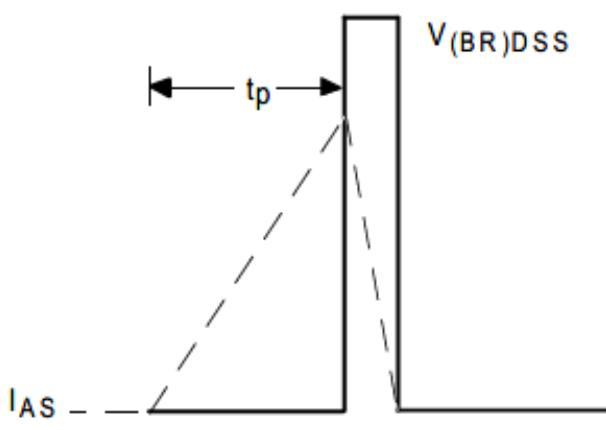  
Fig. 12b. Unclamped Inductive Waveforms

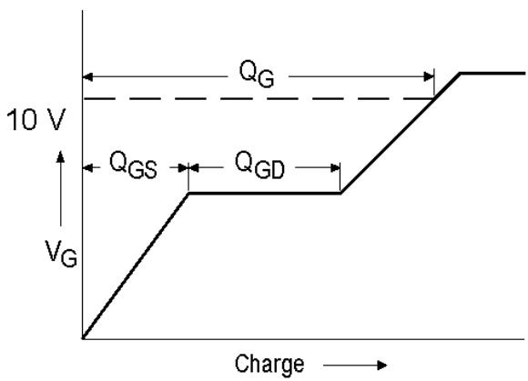  
Fig 13a. Basic Gate Charge Waveform

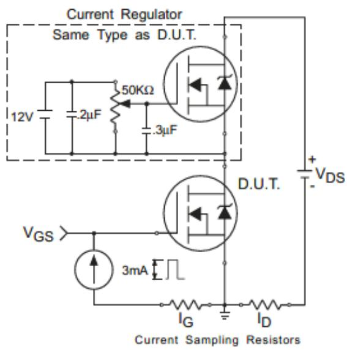  
Fig 13b. Gate Charge Test Circuit

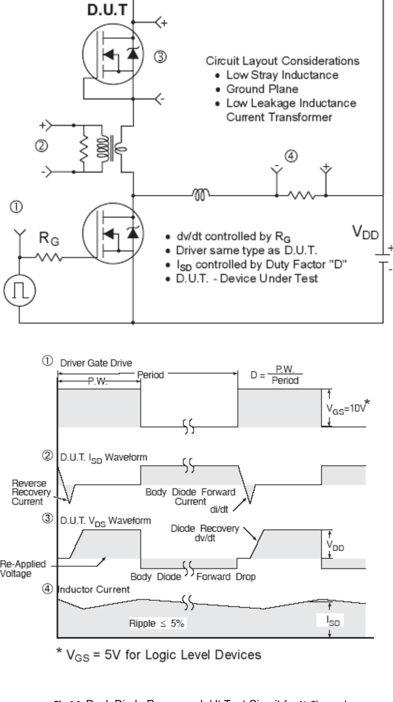  
Fig 14. Peak Diode Recovery dv/dt Test Circuit for N-Channel HEXFET® Power MOSFETs

# TO-247AC Package Outline (Dimensions are

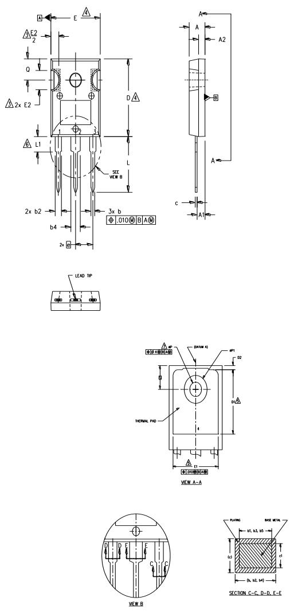

# NOTES:

1. DIMENSIONING AND TOLERANCING AS PER ASME Y14.5M 1994 DIMENSIONS ARE SHOWN IN INCHES. CONTOUR OF SLOT OPTIONAL. DIMENSION D & E DO NOT INCLUDE MOLD FLASH. MOLD FLASH SHALL NOT EXCEED .005" (0.127) PER SIDE. THESE DIMENSIONS ARE MEASURED AT THE OUTERMOST EXTREMES OF THE PLASTIC BODY. THERMAL PAD CONTOUR OPTIONAL WITHIN DIMENSIONS D1 & E1. LEAD FINISH UNCONTROLLED IN L1. ØP TO HAVE A MAXIMUM DRAFT ANGLE OF 1.5 $\cdot$ TO THE TOP OF THE PART WTH A MAXIMUM HOLE DIAMETER OF .154 INCH.   
8. OUTLINE CONFORMS TO JEDEC OUTLINE TO-247AC .

# LEAD ASSIGNMENTS

# HEXFET

1.- GATE   
2.- DRAIN   
3.- SOURCE   
4.- DRAIN

# IGBTs, CoPACK

1.- GATE   
2.- COLLECTOR   
3.- EMITTER   
4.- COLLECTOR

DIODES

1.- ANODE/OPEN   
2.- CATHODE   
3.- ANODE

<table><tr><td rowspan="3">SYMBOL</td><td colspan="4">DIMENSIONS</td><td rowspan="3">NOTES</td></tr><tr><td colspan="2">INCHES</td><td colspan="2">MILLIME TERS</td></tr><tr><td>MIN.</td><td>MAX.</td><td>MIN.</td><td>MAX.</td></tr><tr><td>A</td><td>.183</td><td>.209</td><td>4.65</td><td>5.31</td><td></td></tr><tr><td>A1</td><td>.087</td><td>.102</td><td>2.21</td><td>2.59</td><td></td></tr><tr><td>A2</td><td>.059</td><td>.098</td><td>1.50</td><td>2.49</td><td></td></tr><tr><td>b</td><td>.039</td><td>.055</td><td>0.99</td><td>1.40</td><td></td></tr><tr><td>b1</td><td>.039</td><td>.053</td><td>0.99</td><td>1.35</td><td></td></tr><tr><td>b2</td><td>.065</td><td>.094</td><td>1.65</td><td>2.39</td><td></td></tr><tr><td>b3</td><td>.065</td><td>.092</td><td>1.65</td><td>2.34</td><td></td></tr><tr><td>b4</td><td>.102</td><td>.135</td><td>2.59</td><td>3.43</td><td></td></tr><tr><td>b5</td><td>.102</td><td>.133</td><td>2.59</td><td>3.38</td><td></td></tr><tr><td>C</td><td>.015</td><td>.035</td><td>0.38</td><td>0.89</td><td></td></tr><tr><td>c1</td><td>.015</td><td>.033</td><td>0.38</td><td>0.84</td><td></td></tr><tr><td>D</td><td>.776</td><td>.815</td><td>19.71</td><td>20.70</td><td>4</td></tr><tr><td>D1</td><td>.515</td><td>-</td><td>13.08</td><td>-</td><td>5</td></tr><tr><td>D2</td><td>.020</td><td>.053</td><td>0.51</td><td>1.35</td><td></td></tr><tr><td>E</td><td>.602</td><td>.625</td><td>15.29</td><td>15.87</td><td>4</td></tr><tr><td>E1 E2</td><td>.530</td><td></td><td>13.46</td><td></td><td></td></tr><tr><td>e</td><td>.178</td><td>.216</td><td>4.52</td><td>5.49</td><td></td></tr><tr><td>øk</td><td colspan="2">.215 BSC</td><td>5.46 BSC</td><td></td><td></td></tr><tr><td colspan="2">L</td><td>.010</td><td>0.25</td><td></td><td></td></tr><tr><td>L1</td><td>.559 .146</td><td>.634 .169</td><td>14.20 3.71</td><td>16.10 4.29</td><td></td></tr><tr><td>øP</td><td>.140</td><td>.144</td><td>3.56</td><td>3.66</td><td></td></tr><tr><td>ØP1</td><td></td><td>.291</td><td></td><td>7.39</td><td></td></tr><tr><td>Q</td><td>.209</td><td>.224</td><td>5.31</td><td>5.69</td><td></td></tr><tr><td>S</td><td>.217 BSC</td><td></td><td></td><td></td><td></td></tr><tr><td colspan="2"></td><td></td><td>5.51 BSC</td><td></td><td></td></tr></table>

# TO-247AC Part Marking Information

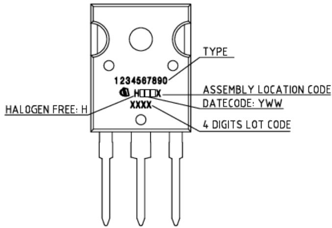

TO-247AC package is not recommended for Surface Mount Application.

# Revision History

<table><tr><td>Date</td><td>Rev.</td><td>Comments</td></tr><tr><td rowspan="3">2024-10-08</td><td rowspan="3">2.1</td><td>Update datasheet to Infineon format</td></tr><tr><td>Updated Part marking -page 8</td></tr><tr><td>Added disclaimer on last page.</td></tr></table>

# Trademarks

All referenced product or service names and trademarks are the property of their respective owners.

# We Listen to Your Comments

Any information within this document that you feel is wrong, unclear or missing at all? Your feedback will help us to continuously improve the quality of this document. Please send your proposal (including a reference to this document) to: erratum@infineon.com

Published by   
Infineon Technologies AG   
81726 München, Germany   
$\circledcirc$ 2024 Infineon Technologies AG All Rights Reserved.

# Legal Disclaimer

The information given in this document shall in no event be regarded as a guarantee of conditions or characteristics

(“Beschaffenheitsgarantie”).

With respect to any examples, hints or any typical values stated herein and/or any information regarding the application of the product, Infineon Technologies hereby disclaims any and all warranties and liabilities of any kind, including without limitation warranties of non-infringement of intellectual property rights of any third party.

In addition, any information given in this document is subject to customer’s compliance with its obligations stated in this document and any applicable legal requirements, norms and standards concerning customer’s products and any use of the product of Infineon Technologies in customer’s applications.

The data contained in this document is exclusively intended for technically trained staff. It is the responsibility of customer’s technical departments to evaluate the suitability of the product for the intended application and the completeness of the product information given in this document with respect to such application.

# Information

For further information on the product, technology, delivery terms and conditions and prices please contact your nearest Infineon Technologies office (www.infineon.com).

# Warnings

Due to technical requirements products may contain dangerous substances. For information on the types in question please contact your nearest Infineon Technologies office.

The Infineon Technologies component described in this Data Sheet may be used in life support devices or systems and or automotive, aviation and aerospace applications or systems only with the express written approval of Infineon Technologies, if a failure of such components can reasonably be expected to cause the failure of that life support, automotive, aviation and aerospace device or system or to affect the safety or effectiveness of that device or system. Life support devices or systems are intended to be implanted in the human body or to support and/or maintain and sustain and/or protect human life. If they fail, it is reasonable to assume that the health of the user or other persons may be endangered.