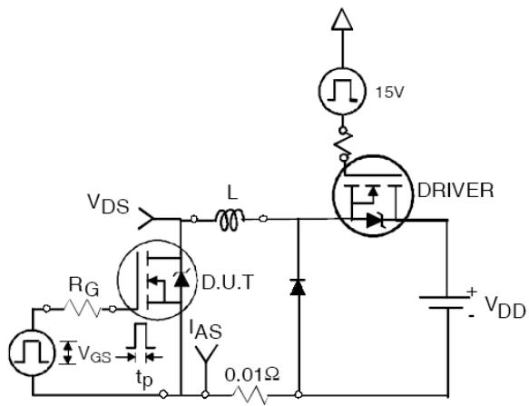

# IRFP4227PBF Datasheet (Markdown Extract)

> Source PDF: https://www.infineon.com/assets/row/public/documents/24/49/infineon-irfp4227-datasheet-en.pdf?fileId=5546d462533600a40153562927642004

<table><tr><td rowspan=1 colspan=3>Key Parameters</td></tr><tr><td rowspan=1 colspan=1>VDs max</td><td rowspan=1 colspan=1>200</td><td rowspan=1 colspan=1>V</td></tr><tr><td rowspan=1 colspan=1>VDS (Avalanche) typ.</td><td rowspan=1 colspan=1>240</td><td rowspan=1 colspan=1>V</td></tr><tr><td rowspan=1 colspan=1>RDs(on) typ. @ 10V</td><td rowspan=1 colspan=1>21</td><td rowspan=1 colspan=1>mΩ</td></tr><tr><td rowspan=1 colspan=1>IRp max @ Tc= 100°</td><td rowspan=1 colspan=1>130</td><td rowspan=1 colspan=1>A</td></tr><tr><td rowspan=1 colspan=1>Tj max</td><td rowspan=1 colspan=1>175</td><td rowspan=1 colspan=1>°C</td></tr></table>

# Features

Advanced Process Technology   
Key Parameters Optimized for PDP Sustain, Energy Recovery and Pass Switch Applications Low EuRating  Reduce Power Dissipation in D Sustain, nerg Recovery and ass Switch Applicatons Low $\mathtt { Q _ { G } }$ for Fast Response High Repetitive Peak Current Capability for Reliable Operation Short Fall & Rise Times for Fast Switching EMPY $1 7 5 ^ { \circ } \mathrm { C }$ Operating Junction Temperature for Improved Ruggedness Repetitive Avalanche Capability for Robustness and Reliability

# Description

Thi EXowe OS  ally e o ustai; ergevery&ass p area and low EpuLse rating. Additional features of this MOSFET are $1 7 5 ^ { \circ } \mathrm { C }$ operating junction temperature and high device for PDP driving applications

<table><tr><td rowspan=1 colspan=4>Absolute Maximum Ratings</td></tr><tr><td rowspan=1 colspan=1>Symbol</td><td rowspan=1 colspan=1>Parameter</td><td rowspan=1 colspan=1>Max.</td><td rowspan=1 colspan=1>Units</td></tr><tr><td rowspan=1 colspan=1>VGs</td><td rowspan=1 colspan=1>Gate-to-Source Voltage</td><td rowspan=1 colspan=1>± 30</td><td rowspan=1 colspan=1>V</td></tr><tr><td rowspan=1 colspan=1>|D @ Tc = 25°C</td><td rowspan=1 colspan=1>Continuous Drain Current, VGs @ 10V</td><td rowspan=1 colspan=1>65</td><td rowspan=4 colspan=1>A</td></tr><tr><td rowspan=1 colspan=1>ID @ Tc = 100°C</td><td rowspan=1 colspan=1>Continuous Drain Current, Vgs @ 10V</td><td rowspan=1 colspan=1>46</td></tr><tr><td rowspan=1 colspan=1>IDM</td><td rowspan=1 colspan=1>Pulsed Drain Current</td><td rowspan=1 colspan=1>260</td></tr><tr><td rowspan=1 colspan=1>|RP @ Tc =100°C</td><td rowspan=1 colspan=1>Repetitive Peak Current </td><td rowspan=1 colspan=1>130</td></tr><tr><td rowspan=1 colspan=1>PD @Tc = 25°C</td><td rowspan=1 colspan=1>Maximum Power Dissipation</td><td rowspan=1 colspan=1>330</td><td rowspan=2 colspan=1>W</td></tr><tr><td rowspan=1 colspan=1>PD @Tc = 100°C</td><td rowspan=1 colspan=1>Maximum Power Dissipation</td><td rowspan=1 colspan=1>190</td></tr><tr><td rowspan=1 colspan=1></td><td rowspan=1 colspan=1>Linear Derating Factor</td><td rowspan=1 colspan=1>2.2</td><td rowspan=1 colspan=1>W/</td></tr><tr><td rowspan=1 colspan=1>TJTsTG</td><td rowspan=1 colspan=1>Operating Junction andStorage Temperature Range</td><td rowspan=1 colspan=1>-40 to + 175</td><td rowspan=2 colspan=1>°C</td></tr><tr><td rowspan=1 colspan=1></td><td rowspan=1 colspan=1>Soldering Temperature, for 10 seconds (1.6mm from case)</td><td rowspan=1 colspan=1>300</td></tr><tr><td rowspan=1 colspan=1></td><td rowspan=1 colspan=1>Mounting torque, 6-32 or M3 screw</td><td rowspan=1 colspan=1>10 lbf·in (1.1N•m)</td><td rowspan=1 colspan=1></td></tr></table>

# Thermal Resistance

<table><tr><td rowspan=1 colspan=1>Symbol</td><td rowspan=1 colspan=1>Parameter</td><td rowspan=1 colspan=1>Typ.</td><td rowspan=1 colspan=1>Max.</td><td rowspan=1 colspan=1>Units</td></tr><tr><td rowspan=1 colspan=1>RθJc</td><td rowspan=1 colspan=1>Junction-to-Case ④</td><td rowspan=1 colspan=1>—</td><td rowspan=1 colspan=1>0.45</td><td rowspan=3 colspan=1>C/W</td></tr><tr><td rowspan=1 colspan=1>Rθcs</td><td rowspan=1 colspan=1>Case-to-Sink, Flat, Greased Surface</td><td rowspan=1 colspan=1>0.50</td><td rowspan=1 colspan=1></td></tr><tr><td rowspan=1 colspan=1>RθJA</td><td rowspan=1 colspan=1>Junction-to-Ambient ④</td><td rowspan=1 colspan=1></td><td rowspan=1 colspan=1>62</td></tr></table>

Electrical Characteristics $\textcircled { \bullet } \mathsf { T } _ { \mathsf { J } } = 2 5 ^ { \circ } \mathsf { C }$ (unless otherwise specified)   

<table><tr><td rowspan=1 colspan=1></td><td rowspan=1 colspan=1>Parameter</td><td rowspan=1 colspan=1>Min.</td><td rowspan=1 colspan=1>Typ.</td><td rowspan=1 colspan=1>Max.</td><td rowspan=1 colspan=2>Units</td><td rowspan=1 colspan=1>Conditions</td></tr><tr><td rowspan=1 colspan=1>V(BR)SS</td><td rowspan=1 colspan=1>Drain-to-Source Breakdown Voltage</td><td rowspan=1 colspan=1>200</td><td rowspan=1 colspan=1></td><td rowspan=1 colspan=1></td><td rowspan=1 colspan=2>V</td><td rowspan=1 colspan=1>VGs = 0V, ID = 250μA</td></tr><tr><td rowspan=1 colspan=1>ΔV(BR)DSs/ΔTj</td><td rowspan=1 colspan=1>Breakdown Voltage Temp. Coefficient</td><td rowspan=1 colspan=1></td><td rowspan=1 colspan=1>170</td><td rowspan=1 colspan=1></td><td rowspan=1 colspan=2>mV/C</td><td rowspan=1 colspan=1>Reference to 25°C, ID = 1mA</td></tr><tr><td rowspan=1 colspan=1>RDS(on)</td><td rowspan=1 colspan=1>Static Drain-to-Source On-Resistance</td><td rowspan=1 colspan=1></td><td rowspan=1 colspan=1>21</td><td rowspan=1 colspan=1>25</td><td rowspan=1 colspan=2>mΩ</td><td rowspan=1 colspan=1>Vgs = 10V, ID = 46A </td></tr><tr><td rowspan=1 colspan=1>VGs(th)</td><td rowspan=1 colspan=1>Gate Threshold Voltage</td><td rowspan=1 colspan=1>3.0</td><td rowspan=1 colspan=1></td><td rowspan=1 colspan=1>5.0</td><td rowspan=1 colspan=2>V</td><td rowspan=2 colspan=1>VDs = VGs, ID = 250μA</td></tr><tr><td rowspan=1 colspan=1>ΔVGs(h)ΔTJ</td><td rowspan=1 colspan=1>Gate Threshold Voltage Temp. Coefficient</td><td rowspan=1 colspan=1></td><td rowspan=1 colspan=1>-13</td><td rowspan=1 colspan=1></td><td rowspan=1 colspan=2>mV/C</td></tr><tr><td rowspan=2 colspan=1>IDss</td><td rowspan=2 colspan=1>Drain-to-Source Leakage Current</td><td rowspan=1 colspan=1></td><td rowspan=1 colspan=1></td><td rowspan=1 colspan=1>20</td><td rowspan=1 colspan=2>μA</td><td rowspan=1 colspan=1>VDs = 200V, VGs = 0V</td></tr><tr><td rowspan=1 colspan=1></td><td rowspan=1 colspan=1></td><td rowspan=1 colspan=1>1.0</td><td rowspan=1 colspan=2>mA</td><td rowspan=1 colspan=1>VDs = 200V,VGs = 0V,Tj=125°C</td></tr><tr><td rowspan=2 colspan=1>IGss</td><td rowspan=1 colspan=1>Gate-to-Source Forward Leakage</td><td rowspan=1 colspan=1>—</td><td rowspan=1 colspan=1>—</td><td rowspan=1 colspan=1>100</td><td rowspan=1 colspan=2>nA</td><td rowspan=1 colspan=1>VGs = 20V</td></tr><tr><td rowspan=1 colspan=1>Gate-to-Source Reverse Leakage</td><td rowspan=1 colspan=1></td><td rowspan=1 colspan=1></td><td rowspan=1 colspan=1>-100</td><td rowspan=1 colspan=2>nA</td><td rowspan=1 colspan=1>VGs =-20V</td></tr><tr><td rowspan=1 colspan=1>gfs</td><td rowspan=1 colspan=1>Forward Trans conductance</td><td rowspan=1 colspan=1>49</td><td rowspan=1 colspan=1>—</td><td rowspan=1 colspan=1></td><td rowspan=1 colspan=2>S</td><td rowspan=1 colspan=1>VDs = 25V, ID = 46A</td></tr><tr><td rowspan=1 colspan=1>Qg</td><td rowspan=1 colspan=1>Total Gate Charge</td><td rowspan=1 colspan=1></td><td rowspan=1 colspan=1>70</td><td rowspan=1 colspan=1>98</td><td rowspan=2 colspan=2>nC</td><td rowspan=2 colspan=1>|D = 46A,VDs = 100V 10V VGs = 10V</td></tr><tr><td rowspan=1 colspan=1>Qgd</td><td rowspan=1 colspan=1>Gate-to-Drain Charge</td><td rowspan=1 colspan=1></td><td rowspan=1 colspan=1>23</td><td rowspan=1 colspan=1></td></tr><tr><td rowspan=1 colspan=1>td(on)</td><td rowspan=1 colspan=1>Turn-On Delay Time</td><td rowspan=1 colspan=1></td><td rowspan=1 colspan=1>33</td><td rowspan=1 colspan=1></td><td rowspan=1 colspan=2></td><td rowspan=4 colspan=1>Vdd = 100V, Vgs = 10V |D = 46ARG= 2.5ΩSee Fig. 22</td></tr><tr><td rowspan=1 colspan=1>tr</td><td rowspan=1 colspan=1>Rise Time</td><td rowspan=1 colspan=1></td><td rowspan=1 colspan=1>20</td><td rowspan=1 colspan=1></td><td rowspan=3 colspan=2>ns</td><td rowspan=1 colspan=1>ns</td></tr><tr><td rowspan=1 colspan=1>t d(of)</td><td rowspan=1 colspan=1>Turn-Off Delay Time</td><td rowspan=1 colspan=1></td><td rowspan=1 colspan=1>21</td><td rowspan=1 colspan=1></td></tr><tr><td rowspan=1 colspan=1>tf</td><td rowspan=1 colspan=1>Fall Time</td><td rowspan=1 colspan=1></td><td rowspan=1 colspan=1>31</td><td rowspan=1 colspan=1></td></tr><tr><td rowspan=1 colspan=1>tst</td><td rowspan=1 colspan=1>Shoot Through Blocking Time</td><td rowspan=1 colspan=1>100</td><td rowspan=1 colspan=1></td><td rowspan=1 colspan=1></td><td rowspan=1 colspan=2>ns</td><td rowspan=1 colspan=1>VDD = 160V,VGs = 15V,RG= 4.7Ω</td></tr><tr><td rowspan=2 colspan=1>EPULsE</td><td rowspan=2 colspan=1>Energy per Pulse</td><td rowspan=1 colspan=1></td><td rowspan=1 colspan=1>570</td><td rowspan=1 colspan=1></td><td rowspan=1 colspan=2>μJ</td><td rowspan=1 colspan=1>L = 220nH, C = 0.4μF, VGs = 15VVDD = 160V, RG= 4.7Ω, Tj = 25°C</td></tr><tr><td rowspan=1 colspan=1></td><td rowspan=1 colspan=1>910</td><td rowspan=1 colspan=1></td><td rowspan=1 colspan=2>μJ</td><td rowspan=1 colspan=1>L = 220nH, C = 0.4μF, VGs = 15VVDD = 160V, RG= 4.7Ω, Tj = 100°C</td></tr><tr><td rowspan=1 colspan=1>Ciss</td><td rowspan=1 colspan=1>Input Capacitance</td><td rowspan=1 colspan=1></td><td rowspan=1 colspan=1>4600</td><td rowspan=1 colspan=1></td><td rowspan=3 colspan=2>pF</td><td rowspan=3 colspan=1>VGs = 0VVDs = 25Vf = 1.0MHz</td></tr><tr><td rowspan=1 colspan=1>Coss</td><td rowspan=1 colspan=1>Output Capacitance</td><td rowspan=1 colspan=1></td><td rowspan=1 colspan=1>460</td><td rowspan=1 colspan=1></td></tr><tr><td rowspan=1 colspan=1>Crss</td><td rowspan=1 colspan=1>Reverse Transfer Capacitance</td><td rowspan=1 colspan=1></td><td rowspan=1 colspan=1>91</td><td rowspan=1 colspan=1></td></tr><tr><td rowspan=1 colspan=1>Coss eff.</td><td rowspan=1 colspan=1>Effective Output Capacitance</td><td rowspan=1 colspan=1></td><td rowspan=1 colspan=1>360</td><td rowspan=1 colspan=1></td><td rowspan=1 colspan=2></td><td rowspan=1 colspan=1>VGs = 0V, VDs = 0V to 160V</td></tr><tr><td rowspan=1 colspan=1>LD</td><td rowspan=1 colspan=1>Internal Drain Inductance</td><td rowspan=1 colspan=1></td><td rowspan=1 colspan=1>5.0</td><td rowspan=1 colspan=1></td><td rowspan=2 colspan=2>nH</td><td rowspan=2 colspan=1>Between lead,                    96mm (0.25in.)from packageand center of die contact      5</td></tr><tr><td rowspan=1 colspan=1>Ls</td><td rowspan=1 colspan=1>Internal Source Inductance</td><td rowspan=1 colspan=1></td><td rowspan=1 colspan=1>13</td><td rowspan=1 colspan=1></td></tr></table>

# Avalanche Characteristics

<table><tr><td rowspan=1 colspan=1></td><td rowspan=1 colspan=1>Parameter</td><td rowspan=1 colspan=1>Typ.</td><td rowspan=1 colspan=1>Max.</td><td rowspan=1 colspan=1>Units</td></tr><tr><td rowspan=1 colspan=1>EAs</td><td rowspan=1 colspan=1>Single Pulse Avalanche Energy</td><td rowspan=1 colspan=1></td><td rowspan=1 colspan=1>140</td><td rowspan=2 colspan=1>mJ</td></tr><tr><td rowspan=1 colspan=1>EAR</td><td rowspan=1 colspan=1>Repetitive Avalanche Energy</td><td rowspan=1 colspan=1></td><td rowspan=1 colspan=1>33</td></tr><tr><td rowspan=1 colspan=1>VDs(Avalanche)</td><td rowspan=1 colspan=1>Repetitive Avalanche Voltage</td><td rowspan=1 colspan=1>240</td><td rowspan=1 colspan=1></td><td rowspan=1 colspan=1>V</td></tr><tr><td rowspan=1 colspan=1>AS</td><td rowspan=1 colspan=1>Avalanche Current②</td><td rowspan=1 colspan=1></td><td rowspan=1 colspan=1>39</td><td rowspan=1 colspan=1>A</td></tr></table>

Diode Characteristics   

<table><tr><td rowspan=1 colspan=1></td><td rowspan=1 colspan=1>Parameter</td><td rowspan=1 colspan=1>Min.</td><td rowspan=1 colspan=1>Typ.</td><td rowspan=1 colspan=1>Max.</td><td rowspan=1 colspan=1>Units</td><td rowspan=1 colspan=1>Conditions</td></tr><tr><td rowspan=1 colspan=1>|s @ Tc= 25°</td><td rowspan=1 colspan=1>Continuous Source Current(Body Diode)</td><td rowspan=1 colspan=1></td><td rowspan=1 colspan=1></td><td rowspan=1 colspan=1>65</td><td rowspan=2 colspan=1>A</td><td rowspan=2 colspan=1>MOSFET symbolshowing thelintegral reversep-n junction diode.</td></tr><tr><td rowspan=1 colspan=1>|sM</td><td rowspan=1 colspan=1>Pulsed Source Current(Body Diode)</td><td rowspan=1 colspan=1></td><td rowspan=1 colspan=1></td><td rowspan=1 colspan=1>260</td></tr><tr><td rowspan=1 colspan=1>VsD</td><td rowspan=1 colspan=1>Diode Forward Voltage</td><td rowspan=1 colspan=1></td><td rowspan=1 colspan=1></td><td rowspan=1 colspan=1>1.3</td><td rowspan=1 colspan=1>V</td><td rowspan=1 colspan=1>Tj = 25°C,Is = 46A,VGs = 0V ③</td></tr><tr><td rowspan=1 colspan=1>trr</td><td rowspan=1 colspan=1>Reverse Recovery Time</td><td rowspan=1 colspan=1></td><td rowspan=1 colspan=1>100</td><td rowspan=1 colspan=1>150</td><td rowspan=1 colspan=1>ns</td><td rowspan=2 colspan=1>TJ = 25°C ,IF = 46A, VDD = 50Vdi/dt = 100A/μs </td></tr><tr><td rowspan=1 colspan=1>Qrr</td><td rowspan=1 colspan=1>Reverse Recovery Charge</td><td rowspan=1 colspan=1>—</td><td rowspan=1 colspan=1>430</td><td rowspan=1 colspan=1>640</td><td rowspan=1 colspan=1>nC</td></tr></table>

$\textcircled{1}$ Repetitive rating; pulse width limited by max. junction temperature. $\textcircled{2}$ starting ${ \sf T } _ { \mathsf { J } } = 2 5 ^ { \circ } { \sf C }$ , $\mathsf { L } = 0 . 1 8 \mathsf { m H }$ , $\mathsf { R } _ { \mathsf { G } } = 2 5 \Omega$ , $\mathsf { I } _ { \mathsf { A S } } = 3 8 \mathsf { A }$ . $\textcircled{3}$ Pulse width $\leq 4 0 0 \mu \mathsf { s }$ ;duty cycle $\leq 2 \%$ . $\textcircled{4}$ E $\mathsf { R } _ { \Theta }$ is measured at ${ \mathsf T } _ { \mathsf J }$ of approximately $9 0 ^ { \circ } \mathsf { C }$ . $\textcircled{5}$ Half sine wave with duty cycle $= 0 . 2 5$ , ton=1μsec.

# Notes:

  
Fig. 1. Typical Output Characteristics

  
Fig. 2. Typical Output Characteristics

  
Fig. 3. Typical Transfer Characteristics

  
Fig. 4. Normalized On-Resistance vs. Temperature

  
Fig 5. Typical EpuLsSE VS. Drain-to-Source Voltage

  
Fig 6. Typical EpuLsE VS. Drain Current

  
Fig. 7. Typical EpuLSE VS. Temperature

  
Fig 9. Typical Capacitance vs.Drain-to-Source Voltage

  
Fig 11. Maximum Drain Current vs. Case Temperature

  
Fig 8. Typical Source-Drain Diode Forward Voltage

  
Fig 10. Typical Gate Charge vs. Gate-to-Source Voltage

  
Fig 12. Maximum Safe Operating Area

  
Fig. 13. On-Resistance Vs. Gate Voltage

  
Fig. 15. Threshold Voltage vs. Temperature

  
Fig. 14. Maximum Avalanche Energy Vs. Temperature

  
Fig. 16. Typical Repetitive peak Current vs. Case temperature   
Fig 17. Maximum Effective Transient Thermal Impedance, Junction-to-Case

  
Fig 18. Diode Reverse Recovery Test Circuit for N-Channel HEXFET $\textsuperscript { \textregistered }$ Power MOSFETs

  
Fig 19a. Unclamped Inductive Test Circuit

  
Fig 19b. Unclamped Inductive Waveforms

  
Fig 20a. Gate Charge Test Circuit

  
Fig 20b. Gate Charge Waveform

  
Fig 21a. $\mathbf { \Delta t } _ { \mathsf { s t } }$ and EpuLsE Test Circuit

  
Fig 21b. tst Test Waveforms

  
Fig 21c. EpuLsE Test Waveforms

  
Fig 22a. Switching Time Test Circuit

  
Fig 22b. Switching Time Waveforms

# TO-247AC Package Outline (Dimensions are shown in millimeters (inches))

# NOTES:

. DIMENSIONING AND TOLERANCING AS PER ASME Y14.5M 1994. DIMENSIONS ARE SHOWN IN INCHES. CONTOUR OF SLOT OPTIONAL. DIMENSION D & E DO NOT INCLUDE MOLD FLASH. MOLD FLASH SHALL NOT EXCEED .005" (0.127) LEAD FINISH UNCONTROLLED IN L1. ØP TO HAVE A MAXIMUM DRAFT ANGLE OF 1.5 $\cdot$ TO THE TOP OF THE PART WTH A MAXIMUM HOLE DIAMETER OF .154 INCH.   
8. OUTLINE CONFORMS TO JEDEC OUTLINE TO-247AC .

LEAD ASSIGNMENTS

HEXFET   
1.- GATE   
2.- DRAIN   
3.- SOURCE   
4.- DRAIN

<table><tr><td rowspan="3">SYMBOL</td><td colspan="4">DIMENSIONS</td><td rowspan="3"></td></tr><tr><td colspan="2">INCHES</td><td colspan="2">MILLIME TERS</td></tr><tr><td>MIN.</td><td>MAX.</td><td>MIN.</td><td>MAX.</td></tr><tr><td>A</td><td>.183</td><td>.209</td><td>4.65</td><td>5.31</td><td></td></tr><tr><td>A1</td><td>.087</td><td>.102</td><td>2.21</td><td>2.59</td><td></td></tr><tr><td>A2</td><td>.059</td><td>.098</td><td>1.50</td><td>2.49</td><td></td></tr><tr><td>b</td><td>.039</td><td>.055</td><td>0.99</td><td>1.40</td><td></td></tr><tr><td>b1</td><td>.039</td><td>.053</td><td>0.99</td><td>1.35</td><td></td></tr><tr><td>b2</td><td>.065</td><td>.094</td><td>1.65</td><td>2.39</td><td></td></tr><tr><td>b3</td><td>.065</td><td>.092</td><td>1.65</td><td>2.34</td><td></td></tr><tr><td>b4</td><td>.102</td><td>.135</td><td>2.59</td><td>3.43</td><td></td></tr><tr><td>b5</td><td>.102</td><td>.133</td><td>2.59</td><td>3.38</td><td></td></tr><tr><td>c</td><td>.015</td><td>.035</td><td>0.38</td><td>0.89</td><td></td></tr><tr><td>c1</td><td>.015</td><td>.033</td><td>0.38</td><td>0.84</td><td></td></tr><tr><td>D</td><td>.776</td><td>.815</td><td>19.71</td><td>20.70</td><td>4</td></tr><tr><td>D1</td><td>.515</td><td>-</td><td>13.08</td><td>-</td><td>5</td></tr><tr><td>D2</td><td>.020</td><td>.053</td><td>0.51</td><td>1.35</td><td></td></tr><tr><td>E</td><td>.602</td><td>.625</td><td>15.29</td><td>15.87</td><td>4</td></tr><tr><td>E1</td><td>.530</td><td>-</td><td>13.46</td><td></td><td></td></tr><tr><td>E2</td><td>.178</td><td>.216</td><td>4.52</td><td>5.49</td><td></td></tr><tr><td>e</td><td colspan="2">.215 BSC</td><td colspan="2">5.46 BSC</td><td></td></tr><tr><td>øk</td><td colspan="2">.010</td><td colspan="2">0.25</td><td></td></tr><tr><td>L L1</td><td>.559 .146</td><td>.634 .169</td><td>14.20 3.71</td><td>16.10 4.29</td><td></td></tr><tr><td>øP</td><td>.140</td><td>.144</td><td>3.56</td><td>3.66</td><td></td></tr><tr><td>0P1</td><td>-</td><td>.291</td><td>-</td><td>7.39</td><td></td></tr><tr><td>0</td><td>.209</td><td>.224</td><td>5.31</td><td>5.69</td><td></td></tr><tr><td>S</td><td></td><td></td><td></td><td></td><td></td></tr><tr><td></td><td colspan="2">.217 BSC</td><td colspan="2">5.51 BSC</td><td></td></tr></table>

# IGBTs, CoPACK

1.- GATE   
2.- COLLECTOR   
3.- EMITTER   
4.- COLLECTOR

DIODES

1.- ANODE/OPEN   
2.- CATHODE   
3.- ANODE

# TO-247AC Part Marking Information

TO-247AC package is not recommended for Surface Mount Application.

# Revision History

<table><tr><td rowspan=1 colspan=1>Date</td><td rowspan=1 colspan=1>Rev.</td><td rowspan=1 colspan=1>Comments</td></tr><tr><td rowspan=1 colspan=1>2013-09-06</td><td rowspan=1 colspan=1>2.0</td><td rowspan=1 colspan=1>•  Final data sheet</td></tr><tr><td rowspan=1 colspan=1>2024-12-05</td><td rowspan=1 colspan=1>2.1</td><td rowspan=1 colspan=1>•  Update datasheet to Infineon format•   Updated Part marking -page 8•  Added disclaimer on last page.</td></tr></table>

# Trademarks

All referenced product or service names and trademarks are the property of their respective owners.

# We Listen to Your Comments

A erratum@infineon.com

Published by   
Infineon Technologies AG   
81726 München, Germany   
$\textcircled{2} 2 0 2 4$ Infineon Technologies AG All Rights Reserved.

# Legal Disclaimer

Talrn ("Beschaffenheitsgarantie").

warranties of non-infringement of intellectual property rights of any third party.

Il product of Infineon Technologies in customer's applications.

Tl I cumetecnial departent toevalate the uitablythe prodct orhentendedappliatinn the completeness of the product information given in this document with respect to such application.

# Information

nfineon Technologies office (www.infineon.com).

# Warnings

contact your nearest Infineon Technologies office.

is reasonable to assume that the health of the user or other persons may be endangered.

# Revision history

IRFP4227PbF

# Revision 2025-01-13, Rev. 1.0

<table><tr><td rowspan=1 colspan=3>Previous revisions</td></tr><tr><td rowspan=1 colspan=1>Revision</td><td rowspan=1 colspan=1>Date</td><td rowspan=1 colspan=1>Subjects (major changes since last revision)</td></tr><tr><td rowspan=1 colspan=1>1.0</td><td rowspan=1 colspan=1>2025-01-13</td><td rowspan=1 colspan=1>Update datasheet to Infineon format, Updated Part marking -page 8</td></tr></table>

# Trademarks

All referenced product or service names and trademarks are the property of their respective owners.

Published by   
Infineon Technologies AG   
81726 München, Germany   
$\textcircled{2} 2 0 2 5$ Infineon Technologies AG All Rights Reserved.

# Legal Disclaimer

Tintelctal poery hirry

I customer's applications.

T document with respect to such application.

# Information

infineon.com).

# Warnings

nearest Infineon Technologies Office.

T endangered.