# IRFP4468PBF Datasheet (Markdown Extract)

> Source PDF: https://www.infineon.com/dgdl/Infineon-IRFP4468-DataSheet-v01_01-EN.pdf?fileId=5546d462533600a40153562c73472019

# MOSFET

# StrongIRFET™ Power MOSFET, 100 V

# Features

•  High Efficiency Synchronous Rectification in SMPS   
•  Uninterruptible Power Supply   
•  High Speed Power Switching   
• $1 7 5 ^ { \circ } \mathsf { C }$ operating temperature   
•  Hard Switched and High Frequency Circuits   
•  Product validation according to JEDEC standard

# Benefits

•  Improved Gate, Avalanche and Dynamic dV/dt Ruggedness •  Fully Characterized Capacitance and Avalanche SOA •  Pb‑free lead plating; RoHS compliant •  Lead free, Halogen‑free according to IEC61249‑2‑21

# Product validation

Fully qualified according to JEDEC for Industrial Applications

# PG‑TO247‑3

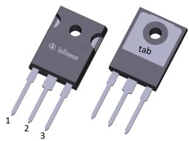

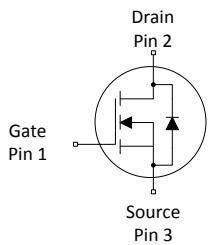

Table 1 Key per formance parame ters   

<table><tr><td rowspan=1 colspan=1>Parameter</td><td rowspan=1 colspan=1>Value</td><td rowspan=1 colspan=1>Unit</td></tr><tr><td rowspan=1 colspan=1>V\Ds</td><td rowspan=1 colspan=1>100</td><td rowspan=1 colspan=1>V</td></tr><tr><td rowspan=1 colspan=1>RDS(on),max</td><td rowspan=1 colspan=1>2.6</td><td rowspan=1 colspan=1>mΩ</td></tr><tr><td rowspan=1 colspan=1>D</td><td rowspan=1 colspan=1>195</td><td rowspan=1 colspan=1>A</td></tr><tr><td rowspan=1 colspan=1>Coss</td><td rowspan=1 colspan=1>149</td><td rowspan=1 colspan=1>nc</td></tr><tr><td rowspan=1 colspan=1>QG (0V..10V)</td><td rowspan=1 colspan=1>363</td><td rowspan=1 colspan=1>nc</td></tr></table>

<table><tr><td rowspan=1 colspan=1>Part number</td><td rowspan=1 colspan=1>Package</td><td rowspan=1 colspan=1>Marking</td><td rowspan=1 colspan=1>Related links</td></tr><tr><td rowspan=1 colspan=1>IRFP4468PbF</td><td rowspan=1 colspan=1>PG-T0247-3</td><td rowspan=1 colspan=1>IRFP4468</td><td rowspan=1 colspan=1>-</td></tr></table>

# Table of contents

Description   
Maximum ratings   . . . .  3   
Thermal characteristics .  4   
Electrical characteristics .  5   
Electrical characteristics diagrams .  7   
Package outlines .  11   
Revision history .  13   
Trademarks 14   
Disclaimer .  14

# 1   Maximum ratings

at $T _ { \mathsf { A } } { = } 2 5 \ { } ^ { \circ } \mathsf { C }$ , unless otherwise specified

Table 2      Maximum ra tings   

<table><tr><td rowspan=2 colspan=1>Parameter</td><td rowspan=2 colspan=1>Symbol</td><td rowspan=1 colspan=3>Values</td><td rowspan=2 colspan=2>Unit</td><td rowspan=2 colspan=1>Note / Test condition</td></tr><tr><td rowspan=1 colspan=1>Min.</td><td rowspan=1 colspan=1>Typ.</td><td rowspan=1 colspan=1>Max.</td></tr><tr><td rowspan=4 colspan=1>Continuous drain current 1)</td><td rowspan=4 colspan=1>|D</td><td rowspan=4 colspan=1></td><td rowspan=4 colspan=1></td><td rowspan=1 colspan=1>195</td><td rowspan=1 colspan=2></td><td rowspan=1 colspan=1>VGs=10 V, Tc=25°C</td></tr><tr><td rowspan=2 colspan=1>150</td><td rowspan=1 colspan=2></td><td rowspan=2 colspan=1></td><td rowspan=2 colspan=1>VG=10 V, Tc=100 °</td></tr><tr><td rowspan=1 colspan=2>A</td></tr><tr><td rowspan=1 colspan=1>25</td><td rowspan=1 colspan=2></td><td rowspan=1 colspan=1>=10 V, =25° RTHJ40°/</td></tr><tr><td rowspan=1 colspan=1>Pulsed drain current 3</td><td rowspan=1 colspan=1>D,pulse</td><td rowspan=1 colspan=1>-</td><td rowspan=1 colspan=1>-</td><td rowspan=1 colspan=1>780</td><td rowspan=1 colspan=2>A</td><td rowspan=1 colspan=1>Tc=25°C</td></tr><tr><td rowspan=1 colspan=1>Avalanche energy, single pulse </td><td rowspan=1 colspan=1>EAS</td><td rowspan=1 colspan=1>-</td><td rowspan=1 colspan=1>-</td><td rowspan=1 colspan=1>740</td><td rowspan=1 colspan=2>mJ</td><td rowspan=1 colspan=1>D=180 A, RGs=25</td></tr><tr><td rowspan=1 colspan=1>Gate source voltage</td><td rowspan=1 colspan=1>VGS</td><td rowspan=1 colspan=1>-20</td><td rowspan=1 colspan=1>-</td><td rowspan=1 colspan=1>20</td><td rowspan=1 colspan=2>V</td><td rowspan=1 colspan=1></td></tr><tr><td rowspan=2 colspan=1>Power dissipation</td><td rowspan=2 colspan=1>Ptot</td><td rowspan=2 colspan=1></td><td rowspan=2 colspan=1></td><td rowspan=1 colspan=1>517</td><td rowspan=1 colspan=2>−</td><td rowspan=1 colspan=1>Tc=25°C</td></tr><tr><td rowspan=1 colspan=1>3.8</td><td rowspan=1 colspan=2>W</td><td rowspan=1 colspan=1>TA=25 °C, RTHJA=40 °C/W 2)</td></tr><tr><td rowspan=1 colspan=1>Operating and storage temperature</td><td rowspan=1 colspan=1>T, Tstg</td><td rowspan=1 colspan=1>-55</td><td rowspan=1 colspan=1></td><td rowspan=1 colspan=1>175</td><td rowspan=1 colspan=2>°C</td><td rowspan=1 colspan=1></td></tr></table>

Rating refers to the product only with datasheet specified absolute maximum values, maintaining case temperature as  1) specified. For other case temperatures please refer to Diagram 2. De‑rating will be required based on the actual environmental conditions.

Device on2) $4 0 \mathsf { m m } \times 4 0 \mathsf { m m } \times 1 . 5 \mathsf { m m }$ epoxy PCB FR4 with $6 { \mathsf { c m } } ^ { 2 }$ (one layer, $7 0 \mu \mathrm { m }$ thick) copper area for drain connection. PCB is vertical in still air.

See Diagram 3 for more detailed information 3) .

See Diagram 13 for more detailed information 4) .

# 2   Thermal characteristics

Table 3 Thermal charac teris tics   

<table><tr><td rowspan=2 colspan=1>Parameter</td><td rowspan=2 colspan=1>Symbol</td><td rowspan=1 colspan=3>Values</td><td rowspan=2 colspan=1>Unit</td><td rowspan=2 colspan=1>Unit Note / Test condition</td></tr><tr><td rowspan=1 colspan=1>Min.</td><td rowspan=1 colspan=1>Typ.</td><td rowspan=1 colspan=1>Max.</td></tr><tr><td rowspan=1 colspan=1>Thermal resistance, junction - case</td><td rowspan=1 colspan=1>RthJc</td><td rowspan=3 colspan=1></td><td rowspan=1 colspan=1>0.2</td><td rowspan=1 colspan=1>0.29</td><td rowspan=3 colspan=1>C/w -</td><td rowspan=3 colspan=1></td></tr><tr><td rowspan=1 colspan=1>Thermal resistance, junction -ambient 5)</td><td rowspan=1 colspan=1>RthJA</td><td rowspan=1 colspan=1>-</td><td rowspan=1 colspan=1>40</td></tr><tr><td rowspan=1 colspan=1>Case-to-Sink, Flat Greased Surface</td><td rowspan=1 colspan=1>Rthcs</td><td rowspan=1 colspan=1>0.24</td><td rowspan=1 colspan=1></td></tr></table>

Device on5) $4 0 \mathsf { m m } \times 4 0 \mathsf { m m } \times 1 . 5 \mathsf { m m }$ epoxy PCB FR4 with $6 { \mathsf { c m } } ^ { 2 }$ (one layer, $7 0 \mu \mathrm { m }$ thick) copper area for drain connection. PCB is vertical in still air.

# 3   Electrical characteristics

at $T _ { \mathrm { j } } { = } 2 5 ^ { \circ } \mathsf C$ , unless otherwise specified

Table 4      S ta tic charac teris tics   

<table><tr><td rowspan=2 colspan=1>Parameter</td><td rowspan=2 colspan=1>Symbol</td><td rowspan=1 colspan=3>Values</td><td rowspan=2 colspan=1>Unit</td><td rowspan=2 colspan=1>Note / Test condition</td></tr><tr><td rowspan=1 colspan=1>Min.</td><td rowspan=1 colspan=1>Typ.</td><td rowspan=1 colspan=1>Max.</td></tr><tr><td rowspan=1 colspan=1>Drain-source breakdown voltage</td><td rowspan=1 colspan=1>V(BDSS</td><td rowspan=1 colspan=1>100</td><td rowspan=1 colspan=1>-</td><td rowspan=1 colspan=1></td><td rowspan=1 colspan=1>V</td><td rowspan=1 colspan=1>VGs=0 V,h=1 mA</td></tr><tr><td rowspan=1 colspan=1>Gate threshold voltage</td><td rowspan=1 colspan=1>VGs((th)</td><td rowspan=1 colspan=1>2.0</td><td rowspan=1 colspan=1>3.0</td><td rowspan=1 colspan=1>4.0</td><td rowspan=1 colspan=1>V</td><td rowspan=1 colspan=1>Vs=Gs, =1000 μA</td></tr><tr><td rowspan=2 colspan=1>Zero gate voltage drain current</td><td rowspan=2 colspan=1>Dss</td><td rowspan=2 colspan=1></td><td rowspan=1 colspan=1>0.1</td><td rowspan=1 colspan=1>1</td><td rowspan=1 colspan=1>μA</td><td rowspan=1 colspan=1>V=100V,=0 V, T=25°C</td></tr><tr><td rowspan=1 colspan=1>10</td><td rowspan=1 colspan=1>100</td><td rowspan=1 colspan=1>μA</td><td rowspan=1 colspan=1>V=100 V, Gs=0 V, =125°</td></tr><tr><td rowspan=1 colspan=1>Gate-source leakage current</td><td rowspan=1 colspan=1>GsSS</td><td rowspan=1 colspan=1></td><td rowspan=1 colspan=1>10</td><td rowspan=1 colspan=1>100</td><td rowspan=1 colspan=1>nA</td><td rowspan=1 colspan=1>VGs=20 V, VDs=0 V</td></tr><tr><td rowspan=1 colspan=1>Drain-source on-state resistance</td><td rowspan=1 colspan=1>RDs(on)</td><td rowspan=1 colspan=1></td><td rowspan=1 colspan=1>2.3</td><td rowspan=1 colspan=1>2.6</td><td rowspan=1 colspan=1>mΩ</td><td rowspan=1 colspan=1>VGs=10 V, 1D=180 A</td></tr><tr><td rowspan=1 colspan=1>Gate resistance</td><td rowspan=1 colspan=1>RG</td><td rowspan=1 colspan=1></td><td rowspan=1 colspan=1>0.90</td><td rowspan=1 colspan=1></td><td rowspan=1 colspan=1>2</td><td rowspan=1 colspan=1>-</td></tr><tr><td rowspan=1 colspan=1>Transconductance </td><td rowspan=1 colspan=1>gfs</td><td rowspan=1 colspan=1>185</td><td rowspan=1 colspan=1>370</td><td rowspan=1 colspan=1></td><td rowspan=1 colspan=1>S</td><td rowspan=1 colspan=1>|V|||)x =180A</td></tr></table>

Defined by design. Not subject to production test. 6)

Table 5 Dynamic charac teris tics   

<table><tr><td rowspan=2 colspan=1>Parameter</td><td rowspan=2 colspan=1>Symbol</td><td rowspan=1 colspan=3>Values</td><td rowspan=2 colspan=1>Unit</td><td rowspan=2 colspan=1>Note / Test condition</td></tr><tr><td rowspan=1 colspan=1>Min.</td><td rowspan=1 colspan=1>Typ.</td><td rowspan=1 colspan=1>Max.</td></tr><tr><td rowspan=1 colspan=1>Input capacitance 7</td><td rowspan=1 colspan=1>Cis</td><td rowspan=3 colspan=1></td><td rowspan=1 colspan=1>22000</td><td rowspan=1 colspan=1>29000</td><td rowspan=3 colspan=1>pF</td><td rowspan=3 colspan=1>VG=0V,V=50 V, f=1 MHz</td></tr><tr><td rowspan=1 colspan=1>Output capacitance7</td><td rowspan=1 colspan=1>Coss</td><td rowspan=1 colspan=1>1300</td><td rowspan=1 colspan=1>1700</td></tr><tr><td rowspan=1 colspan=1>Reverse transfer capacitance 7</td><td rowspan=1 colspan=1>Crss</td><td rowspan=1 colspan=1>580</td><td rowspan=1 colspan=1>1000</td></tr><tr><td rowspan=1 colspan=1>Turn-on delay time</td><td rowspan=1 colspan=1>td((n)</td><td rowspan=4 colspan=1></td><td rowspan=1 colspan=1>53</td><td rowspan=4 colspan=1></td><td rowspan=4 colspan=1>ns</td><td rowspan=4 colspan=1>V=65 V, =10 V, D=180 A,RG,ex=2.7 </td></tr><tr><td rowspan=1 colspan=1>Rise time</td><td rowspan=1 colspan=1>t.</td><td rowspan=1 colspan=1>245</td></tr><tr><td rowspan=1 colspan=1>Turn-off delay time</td><td rowspan=1 colspan=1>td(ff)</td><td rowspan=1 colspan=1>171</td></tr><tr><td rowspan=1 colspan=1>Fall time</td><td rowspan=1 colspan=1>tf</td><td rowspan=1 colspan=1>278</td></tr></table>

Defined by design. Not subject to production test. 7)

Table 6      Ga te charge charac teris tics 8 )   

<table><tr><td rowspan=2 colspan=1>Parameter</td><td rowspan=2 colspan=1>Symbol</td><td rowspan=1 colspan=3>Values</td><td rowspan=2 colspan=1>Unit</td><td rowspan=2 colspan=1>Note / Test condition</td></tr><tr><td rowspan=1 colspan=1>Min.</td><td rowspan=1 colspan=1>Typ.</td><td rowspan=1 colspan=1>Max.</td></tr><tr><td rowspan=1 colspan=1>Gate to source charge</td><td rowspan=1 colspan=1>Qgs</td><td rowspan=6 colspan=1></td><td rowspan=1 colspan=1>104</td><td rowspan=1 colspan=1></td><td rowspan=1 colspan=1>nC</td><td rowspan=6 colspan=1>V=50 V=180A=0 o 10 V</td></tr><tr><td rowspan=1 colspan=1>Gate charge at threshold</td><td rowspan=1 colspan=1>Qg(th)</td><td rowspan=1 colspan=1>65</td><td rowspan=1 colspan=1></td><td rowspan=1 colspan=1>nC</td></tr><tr><td rowspan=1 colspan=1>Gate to drain charge 9</td><td rowspan=1 colspan=1>Qgd</td><td rowspan=1 colspan=1>96</td><td rowspan=1 colspan=1>144</td><td rowspan=1 colspan=1>nC</td></tr><tr><td rowspan=1 colspan=1>Switching charge</td><td rowspan=1 colspan=1>Qsw</td><td rowspan=1 colspan=1>134</td><td rowspan=1 colspan=1>-</td><td rowspan=1 colspan=1>nc</td></tr><tr><td rowspan=1 colspan=1>Gate charge total 9)</td><td rowspan=1 colspan=1>Q_8$</td><td rowspan=1 colspan=1>363</td><td rowspan=1 colspan=1>540</td><td rowspan=1 colspan=1>nC</td></tr><tr><td rowspan=1 colspan=1>Gate plateau voltage</td><td rowspan=1 colspan=1>Vplaeau</td><td rowspan=1 colspan=1>4.8</td><td rowspan=1 colspan=1>-</td><td rowspan=1 colspan=1>V</td></tr><tr><td rowspan=1 colspan=1>Gate charge total, sync. FET</td><td rowspan=1 colspan=1>Qg(sync)</td><td rowspan=1 colspan=1>-</td><td rowspan=1 colspan=1>312</td><td rowspan=1 colspan=1>-</td><td rowspan=1 colspan=1>nC</td><td rowspan=1 colspan=1>VDs=0.1V, VGs=0 to 10 V</td></tr><tr><td rowspan=1 colspan=1>Output charge 9)</td><td rowspan=1 colspan=1>Qoss</td><td rowspan=1 colspan=1></td><td rowspan=1 colspan=1>149</td><td rowspan=1 colspan=1>224</td><td rowspan=1 colspan=1>nC</td><td rowspan=1 colspan=1>VDs=50 V, VGs=0 V</td></tr></table>

See figure 16 for gate charge parameter definition 8) . Defined by design. Not subject to production test. 9)

Table 7      Reverse diode   

<table><tr><td rowspan=2 colspan=1>Parameter</td><td rowspan=2 colspan=1>Symbol</td><td rowspan=1 colspan=3>Values</td><td rowspan=2 colspan=1>Unit</td><td rowspan=2 colspan=1>Note / Test condition</td></tr><tr><td rowspan=1 colspan=1>Min.</td><td rowspan=1 colspan=1>Typ.</td><td rowspan=1 colspan=1>Max.</td></tr><tr><td rowspan=1 colspan=1>Diode continuous forward current</td><td rowspan=1 colspan=1>s</td><td rowspan=2 colspan=1></td><td rowspan=2 colspan=1></td><td rowspan=1 colspan=1>177</td><td rowspan=2 colspan=1>A</td><td rowspan=2 colspan=1>Tc=25°C</td></tr><tr><td rowspan=1 colspan=1>Diode pulse current</td><td rowspan=1 colspan=1>s,pulse</td><td rowspan=1 colspan=1>780</td></tr><tr><td rowspan=1 colspan=1>Diode forward voltage</td><td rowspan=1 colspan=1>VsD</td><td rowspan=1 colspan=1></td><td rowspan=1 colspan=1>0.96</td><td rowspan=1 colspan=1>1.3</td><td rowspan=1 colspan=1>V</td><td rowspan=1 colspan=1>VGs=0 V, 1=180 A, T=25 °C</td></tr><tr><td rowspan=1 colspan=1>Reverse recovery time</td><td rowspan=1 colspan=1>trr</td><td rowspan=2 colspan=1>−</td><td rowspan=1 colspan=1>88</td><td rowspan=2 colspan=1>−</td><td rowspan=1 colspan=1>ns</td><td rowspan=2 colspan=1>V=85 V, I=180 A, dip/dt=100 A/µs</td></tr><tr><td rowspan=1 colspan=1>Reverse recovery charge</td><td rowspan=1 colspan=1>Qrr</td><td rowspan=1 colspan=1>333</td><td rowspan=1 colspan=1>nC</td></tr></table>

# 4   Electrical characteristics diagrams

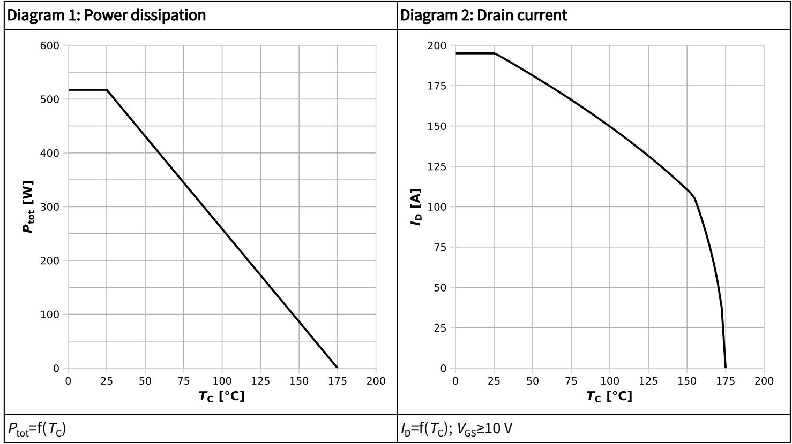

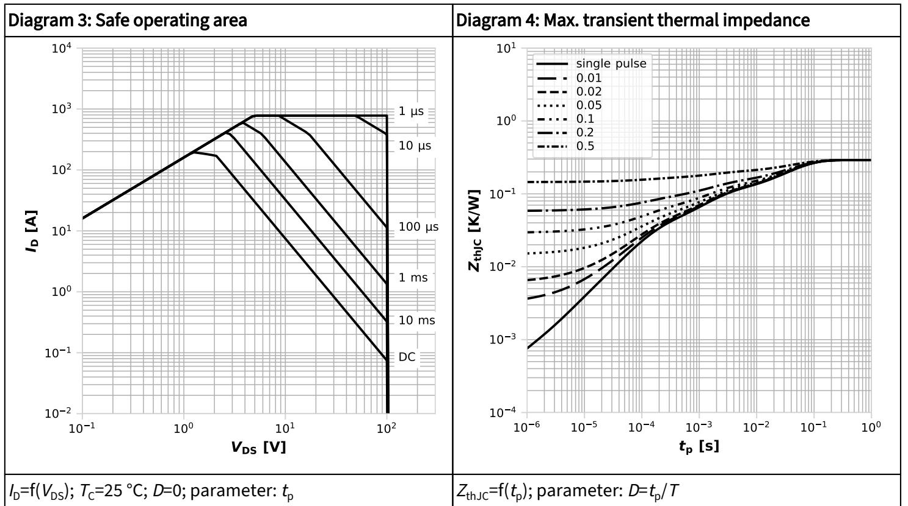

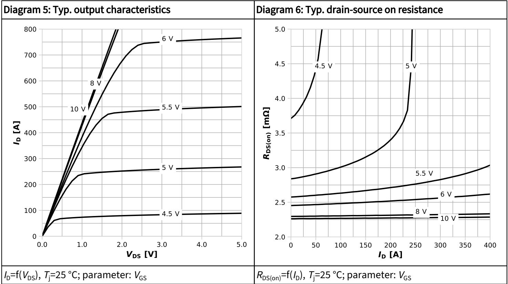

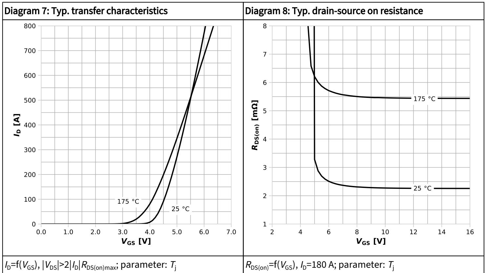

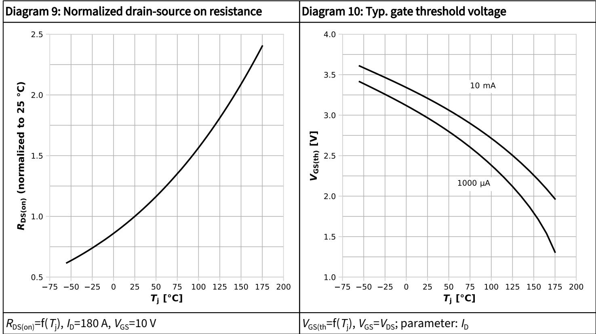

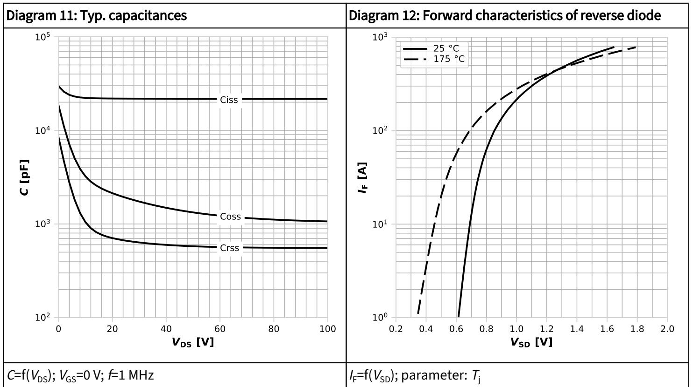

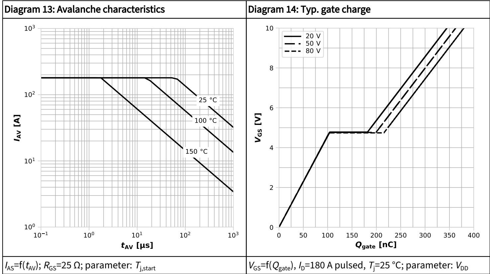

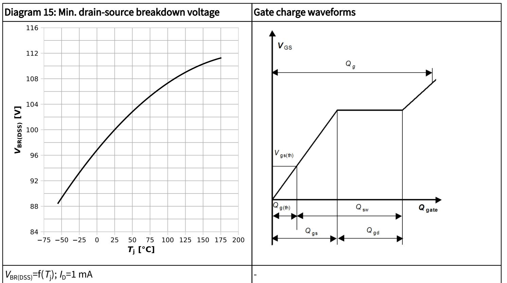

# 5   Package outlines

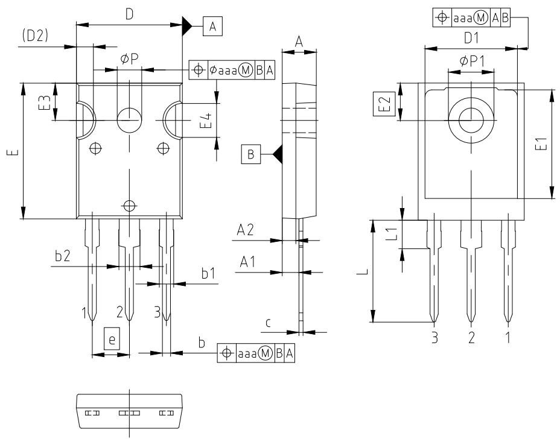

<table><tr><td rowspan=1 colspan=3>PACKAGE - GROUP PG-T0247-3-U03NUMBER:</td><td rowspan=1 colspan=3></td></tr><tr><td rowspan=2 colspan=1>DIMENSIONS</td><td rowspan=1 colspan=2>MILLIMETERS</td><td rowspan=2 colspan=1>DIMENSIONS</td><td rowspan=1 colspan=2>MILLIMETERS</td></tr><tr><td rowspan=1 colspan=1>MIN.</td><td rowspan=1 colspan=1>MAX.</td><td rowspan=1 colspan=1>MIN.</td><td rowspan=1 colspan=1>MAX.</td></tr><tr><td rowspan=1 colspan=1>A</td><td rowspan=1 colspan=1>4.83</td><td rowspan=1 colspan=1>5.13</td><td rowspan=1 colspan=1>E2</td><td rowspan=1 colspan=1>5.51</td><td rowspan=1 colspan=1></td></tr><tr><td rowspan=1 colspan=1>A1</td><td rowspan=1 colspan=1>2.21</td><td rowspan=1 colspan=1>2.59</td><td rowspan=1 colspan=1>E3</td><td rowspan=1 colspan=1>5.31</td><td rowspan=1 colspan=1>5.69</td></tr><tr><td rowspan=1 colspan=1>A2</td><td rowspan=1 colspan=1>1.50</td><td rowspan=1 colspan=1>2.50</td><td rowspan=1 colspan=1>E4</td><td rowspan=1 colspan=1>4.50</td><td rowspan=1 colspan=1>5.50</td></tr><tr><td rowspan=1 colspan=1>b</td><td rowspan=1 colspan=1>0.99</td><td rowspan=1 colspan=1>1.41</td><td rowspan=1 colspan=1>e</td><td rowspan=1 colspan=1>5.46</td><td rowspan=1 colspan=1></td></tr><tr><td rowspan=1 colspan=1>b1</td><td rowspan=1 colspan=1>1.65</td><td rowspan=1 colspan=1>2.39</td><td rowspan=1 colspan=1>L</td><td rowspan=1 colspan=1>14.20</td><td rowspan=1 colspan=1>16.10</td></tr><tr><td rowspan=1 colspan=1>b2</td><td rowspan=1 colspan=1>2.59</td><td rowspan=1 colspan=1>3.43</td><td rowspan=1 colspan=1>L1</td><td rowspan=1 colspan=1>3.71</td><td rowspan=1 colspan=1>4.29</td></tr><tr><td rowspan=1 colspan=1>c</td><td rowspan=1 colspan=1>0.38</td><td rowspan=1 colspan=1>0.89</td><td rowspan=1 colspan=1>N</td><td rowspan=1 colspan=1>3</td><td rowspan=1 colspan=1></td></tr><tr><td rowspan=1 colspan=1>D</td><td rowspan=1 colspan=1>15.29</td><td rowspan=1 colspan=1>15.87</td><td rowspan=1 colspan=1>ØP</td><td rowspan=1 colspan=1>3.56</td><td rowspan=1 colspan=1>3.66</td></tr><tr><td rowspan=1 colspan=1>D1</td><td rowspan=1 colspan=1>13.46</td><td rowspan=1 colspan=1>13.66</td><td rowspan=1 colspan=1>ØP1</td><td rowspan=1 colspan=1>7.19</td><td rowspan=1 colspan=1>7.39</td></tr><tr><td rowspan=1 colspan=1>D2</td><td rowspan=1 colspan=1>2.50</td><td rowspan=1 colspan=1></td><td rowspan=1 colspan=1>aaa</td><td rowspan=1 colspan=2>0.25</td></tr><tr><td rowspan=1 colspan=1>E</td><td rowspan=1 colspan=1>19.70</td><td rowspan=1 colspan=1>20.70</td><td rowspan=2 colspan=3></td></tr><tr><td rowspan=1 colspan=1>E1</td><td rowspan=1 colspan=1>13.08</td><td rowspan=1 colspan=1>13.28</td></tr></table>

NOTES: (1) DIMENSIONS DO NOT INCLUDE MOLD FLASH, PROTRUSION OR GATE BURRS (2) N IS THE NUMBER OF LEADS

Figure 1   Ou tline PG ‑TO247 ‑3, dimensions in mm

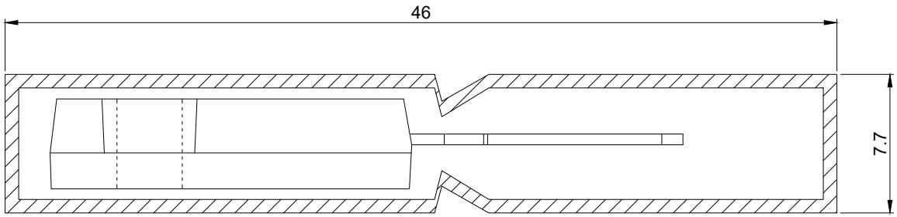

All dimensions are in units mm The drawing is in compliance with ISO 128-30, Projection Method 1 [ $\circled { \phi }$ ]

Figure 2   Packaging va rian t PG ‑TO247 ‑3, dimensions in mm

# Revision history

IRFP4468PbF

# Revision 2025 ‑01 ‑29, Rev. 1.0

<table><tr><td rowspan=1 colspan=3>Previous revisions</td></tr><tr><td rowspan=1 colspan=1>Revision</td><td rowspan=1 colspan=1>Date</td><td rowspan=1 colspan=1>Subjects (major changes since last revision)</td></tr><tr><td rowspan=1 colspan=1>1.0</td><td rowspan=1 colspan=1>2025-01-29</td><td rowspan=1 colspan=1>updated switch time and trr</td></tr></table>

# P u b l i c StrongIRFET™ Power MOSFET, 100 V IRFP4468PbF

# Trademarks

All referenced product or service names and trademarks are the property of their respective owners.

We Listen to Your Comments Any information within this document that you feel is wrong, unclear or missing at all? Your feedback will help us to continuously improve the quality of this document. Please send your proposal (including a reference to this document) to: erratum@infineon.com

Published by   
Infineon Technologies AG   
81726 München, Germany   
$\textcircled { \mathtt { c } } 2 0 2 5$ Infineon Technologies AG All Rights Reserved.

# Important notice

The products which may also include samples and may be comprised of hardware or software or both (“Product”) are sold or provided and delivered by Infineon Technologies AG and its affiliates (“Infineon”) subject to the terms and conditions of the frame supply contract or other written agreement(s) executed by a customer and Infineon or, in the absence of the foregoing, the applicable Sales Conditions of Infineon. General terms and conditions of a customer or deviations from applicable Sales Conditions of Infineon shall only be binding for Infineon if and to the extent Infineon has given its express written consent.

For the avoidance of doubt, Infineon disclaims all warranties of non‑infringement of third‑party rights and implied warranties such as warranties of fitness for a specific use/purpose or merchantability.

Infineon shall not be responsible for any information with respect to samples, the application or customer’s specific use of any Product or for any examples or typical values given in this document.

The data contained in this document is exclusively intended for technically qualified and skilled customer representatives. It is the responsibility of the customer to evaluate the suitability of the Product for the intended application and the customer’s specific use and to verify all relevant technical data contained in this document in the intended application and the customer’s specific use. The customer is responsible for properly designing, programming, and testing the functionality and safety of the intended application, as well as complying with any legal requirements related to its use.

Unless otherwise explicitly approved by Infineon, Products may not be used in any application where a failure of the Product or any consequences of the use thereof can reasonably be expected to result in personal injury. However, the foregoing shall not prevent the customer from using any Product in such fields of use that Infineon has explicitly designed and sold it for, provided that the overall responsibility for the application lies with the customer.

If the Product includes security features:

Because no computing device can be absolutely secure, and despite security measures implemented in the Product, Infineon does not guarantee that the Product will be free from intrusion, data theft or loss, or other breaches (“Security Breaches”), and Infineon shall have no liability arising out of any Security Breaches.

If this document includes or references software:

The software is owned by Infineon under the intellectual property laws and treaties of the United States, Germany, and other countries worldwide. All rights reserved. Therefore, you may use the software only as provided in the software license agreement accompanying the software. If no software license agreement applies, Infineon hereby grants you a personal, non‑exclusive, non‑transferable license (without the right to sublicense) under its intellectual property rights in the software (a) for software provided in source code form, to modify and reproduce the software solely for use with Infineon hardware products, only internally within your organization, and (b) to distribute the software in binary code form externally to end users, solely for use on Infineon hardware products. Any other use, reproduction, modification, translation, or compilation of the software is prohibited.

For further information on technology, delivery terms and conditions and prices please contact your nearest Infineon Technologies Office (www.   
infineon.com).