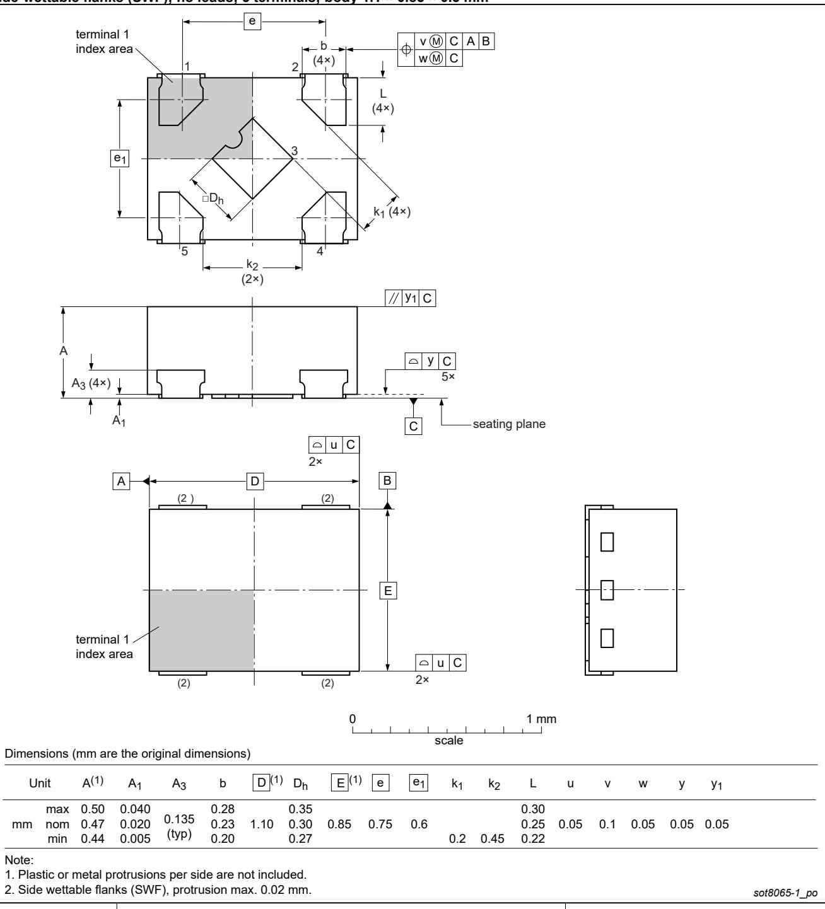

# X.

# 74LVC1G08

# Single 2-input AND gate

Rev. 16.1 — 3 September 2024

# 1. General description

The 74LVC1G08 is a single 2-input AND gate. Inputs can be driven from either 3.3 V or 5 V devices. This feature allows the use of these devices as translators in mixed $3 . 3 \lor$ and 5 V applications.

Schmitt trigger action at all inputs makes the circuit tolerant of slower input rise and fall time.

This device is fully specified for partial power-down applications using IOFF. The IOFF circuitry disables the output, preventing the damaging backflow current through the device when it is powered down.

# 2. Features and benefits

Wide supply voltage range from 1.65 V to $5 . 5 \lor$ High noise immunity $\pm 2 4 ~ \mathsf { m A }$ output drive $( \mathsf { V } _ { \mathsf { C C } } = 3 . 0 \mathsf { V } )$ CMOS low power dissipation Direct interface with TTL levels Overvoltage tolerant inputs to $5 . 5 \lor$ IOFF circuitry provides partial Power-down mode operation Latch-up performance $\leq 2 5 0 ~ \mathrm { m A }$ Complies with JEDEC standard: JESD8-7 (1.65 V to 1.95 V) JESD8-5 $2 . 3 \mathsf { V }$ to 2.7 V) JESD8C (2.7 V to 3.6 V) JESD36 (4.5 V to 5.5 V) • ESD protection: • HBM: ANSI/ESDA/JEDEC JS-001 class 2 exceeds 2000 V . CDM: ANSI/ESDA/JEDEC JS-002 class C3 exceeds 1000 V Multiple package options Specified from $- 4 0 ~ ^ { \circ } \mathsf C$ to $+ 8 5 ~ ^ { \circ } \mathsf C$ and $- 4 0 ~ ^ { \circ } \mathsf C$ to $+ 1 2 5 ^ { \circ } \mathrm { C }$

# nexperia

# 3. Ordering information

Table 1. Ordering information   

<table><tr><td rowspan=2 colspan=3>Type number</td><td rowspan=1 colspan=4>Package</td></tr><tr><td rowspan=1 colspan=1></td><td rowspan=1 colspan=1>Temperature range</td><td rowspan=1 colspan=1>Name</td><td rowspan=1 colspan=1>Description</td><td rowspan=1 colspan=1>Version</td></tr><tr><td rowspan=1 colspan=3>74LVC1G08GW</td><td rowspan=1 colspan=1>74LVC1G08GW</td><td rowspan=1 colspan=1>-40 °C to +125 </td><td rowspan=1 colspan=1>TSSOP5</td><td rowspan=1 colspan=1>plastic thin shrink small outline package; 5 leads;body width 1.25 mm</td></tr><tr><td rowspan=1 colspan=3>74LVC1G08GV</td><td rowspan=1 colspan=1>-40 °C to +125 </td><td rowspan=1 colspan=1>SC-74A</td><td rowspan=1 colspan=1>plastic surface-mounted package; 5 leads</td><td rowspan=1 colspan=1>SOT753</td></tr><tr><td rowspan=1 colspan=3>74LVC1G08GM</td><td rowspan=1 colspan=1>-40 °C to +125 </td><td rowspan=1 colspan=1>XSON6</td><td rowspan=1 colspan=1>plastic extremely thin small outline package; no leads;6 terminals; body 1 x 1.45 × 0.5 mm</td><td rowspan=1 colspan=1>SOT886</td></tr><tr><td rowspan=1 colspan=3>74LVC1G08GN</td><td rowspan=1 colspan=1>-40 °C to +125 </td><td rowspan=1 colspan=1>XSON6</td><td rowspan=1 colspan=1>extremely thin small outline package; no leads;6 terminals; body 0.9 x 1.0 × 0.35 mm</td><td rowspan=1 colspan=1>SOT1115</td></tr><tr><td rowspan=1 colspan=3>74LVC1G08GS</td><td rowspan=1 colspan=1>-40  to +125 </td><td rowspan=1 colspan=1>XSON6</td><td rowspan=1 colspan=1>extremely thin small outline package; no leads;6 terminals; body 1.0 x 1.0 × 0.35 mm</td><td rowspan=1 colspan=1>SOT1202</td></tr><tr><td rowspan=1 colspan=3>74LVC1G08GX</td><td rowspan=1 colspan=1>-40 C to +125 </td><td rowspan=1 colspan=1>X2SON5</td><td rowspan=1 colspan=1>plastic thermal enhanced extremely thinsmall outline package; no leads; 5 terminals;body 0.8 × 0.8 × 0.32 mm</td><td rowspan=1 colspan=1>SOT1226-3</td></tr><tr><td rowspan=1 colspan=3>74LVC1G08GZ</td><td rowspan=1 colspan=1>-40 ° to +125 </td><td rowspan=1 colspan=1>XSON5</td><td rowspan=1 colspan=1>plastic thermal enhanced extremely thin small outlinepackage with side-wettable flanks (SWF); no leads;5 terminals; body 1.1 × 0.85 × 0.5 mm</td><td rowspan=1 colspan=1>SOT8065-1</td></tr></table>

# 4. Marking

Table 2. Marking   

<table><tr><td rowspan=1 colspan=1>Type number</td><td rowspan=1 colspan=1>Marking code [1]</td></tr><tr><td rowspan=1 colspan=1>74LVC1G08GW</td><td rowspan=1 colspan=1>VE</td></tr><tr><td rowspan=1 colspan=1>74LVC1G08GV</td><td rowspan=1 colspan=1>V08</td></tr><tr><td rowspan=1 colspan=1>74LVC1G08GM</td><td rowspan=1 colspan=1>VE</td></tr><tr><td rowspan=1 colspan=1>74LVC1G08GN</td><td rowspan=1 colspan=1>VE</td></tr><tr><td rowspan=1 colspan=1>74LVC1G08GS</td><td rowspan=1 colspan=1>VE</td></tr><tr><td rowspan=1 colspan=1>74LVC1G08GX</td><td rowspan=1 colspan=1>VE</td></tr><tr><td rowspan=1 colspan=1>74LVC1G08GZ</td><td rowspan=1 colspan=1>VE</td></tr></table>

[1] The pin 1 indicator is located on the lower left corner of the device, below the marking cod

# 5. Functional diagram

  
Fig. 1. Logic symbol

  
Fig. 2. IEC logic symbol

  
Fig. 3. Logic diagram

# 6. Pinning information

# 6.1. Pinning

# 6.2. Pin description

Table 3. Pin description   

<table><tr><td rowspan=2 colspan=1>Symbol</td><td rowspan=1 colspan=2>Pin</td><td rowspan=2 colspan=1>Description</td></tr><tr><td rowspan=1 colspan=1>TSSOP5, SC-74A , XSON5 and X2SON5</td><td rowspan=1 colspan=1>XSON6</td></tr><tr><td rowspan=1 colspan=1>B</td><td rowspan=1 colspan=1>1</td><td rowspan=1 colspan=1>1</td><td rowspan=1 colspan=1>data input</td></tr><tr><td rowspan=1 colspan=1>A</td><td rowspan=1 colspan=1>2</td><td rowspan=1 colspan=1>2</td><td rowspan=1 colspan=1>data input</td></tr><tr><td rowspan=1 colspan=1>GND</td><td rowspan=1 colspan=1>3</td><td rowspan=1 colspan=1>3</td><td rowspan=1 colspan=1>ground (0 V)</td></tr><tr><td rowspan=1 colspan=1>Y</td><td rowspan=1 colspan=1>4</td><td rowspan=1 colspan=1>4</td><td rowspan=1 colspan=1>data output</td></tr><tr><td rowspan=1 colspan=1>n.c.</td><td rowspan=1 colspan=1>-</td><td rowspan=1 colspan=1>5</td><td rowspan=1 colspan=1>not connected</td></tr><tr><td rowspan=1 colspan=1>Vcc</td><td rowspan=1 colspan=1>5</td><td rowspan=1 colspan=1>6</td><td rowspan=1 colspan=1>supply voltage</td></tr></table>

# 7. Functional description

# Table 4. Function table

$H = H I G H$ voltage level; $L = L O W$ voltage level.

<table><tr><td rowspan=1 colspan=2>Input</td><td rowspan=1 colspan=1>Output</td></tr><tr><td rowspan=1 colspan=1>A</td><td rowspan=1 colspan=1>B</td><td rowspan=1 colspan=1>Y</td></tr><tr><td rowspan=1 colspan=1>L</td><td rowspan=1 colspan=1>L</td><td rowspan=1 colspan=1>L</td></tr><tr><td rowspan=1 colspan=1>L</td><td rowspan=1 colspan=1>H</td><td rowspan=1 colspan=1>L</td></tr><tr><td rowspan=1 colspan=1>H</td><td rowspan=1 colspan=1>L</td><td rowspan=1 colspan=1>L</td></tr><tr><td rowspan=1 colspan=1>H</td><td rowspan=1 colspan=1>H</td><td rowspan=1 colspan=1>H</td></tr></table>

# 8. Limiting values

Table 5. Limiting values In accordance with the Absolute Maximum Rating System (IEC 60134). Voltages are referenced to GND $( g r o u n d = 0 \ V )$ .   

<table><tr><td rowspan=1 colspan=1>Symbol</td><td rowspan=1 colspan=1>Parameter</td><td rowspan=1 colspan=1>Conditions</td><td rowspan=1 colspan=1>Min</td><td rowspan=1 colspan=1>Max</td><td rowspan=1 colspan=1>Unit</td></tr><tr><td rowspan=1 colspan=1>Vcc</td><td rowspan=1 colspan=1>supply voltage</td><td rowspan=1 colspan=1></td><td rowspan=1 colspan=1>-0.5</td><td rowspan=1 colspan=1>+6.5</td><td rowspan=1 colspan=1>V</td></tr><tr><td rowspan=1 colspan=1>Ik</td><td rowspan=1 colspan=1>input clamping current</td><td rowspan=1 colspan=1>V1&lt;OV</td><td rowspan=1 colspan=1>-50</td><td rowspan=1 colspan=1>-</td><td rowspan=1 colspan=1>mA</td></tr><tr><td rowspan=1 colspan=1>VI</td><td rowspan=1 colspan=1>input voltage</td><td rowspan=1 colspan=1>[1]</td><td rowspan=1 colspan=1>-0.5</td><td rowspan=1 colspan=1>+6.5</td><td rowspan=1 colspan=1>V</td></tr><tr><td rowspan=1 colspan=1>lok</td><td rowspan=1 colspan=1>output clamping current</td><td rowspan=1 colspan=1>Vo &gt; Vcc or Vo&lt;O V</td><td rowspan=1 colspan=1>-</td><td rowspan=1 colspan=1>±50</td><td rowspan=1 colspan=1>mA</td></tr><tr><td rowspan=2 colspan=1>Vo</td><td rowspan=2 colspan=1>output voltage</td><td rowspan=1 colspan=1>Active mode                                   [1]</td><td rowspan=1 colspan=1>-0.5</td><td rowspan=1 colspan=1>Vcc + 0.5</td><td rowspan=1 colspan=1>V</td></tr><tr><td rowspan=1 colspan=1>Power-down mode; Vcc = 0 V                [1]</td><td rowspan=1 colspan=1>-0.5</td><td rowspan=1 colspan=1>+6.5</td><td rowspan=1 colspan=1>V</td></tr><tr><td rowspan=1 colspan=1>lo</td><td rowspan=1 colspan=1>output current</td><td rowspan=1 colspan=1>Vo = 0 V to Vcc</td><td rowspan=1 colspan=1>-</td><td rowspan=1 colspan=1>±50</td><td rowspan=1 colspan=1>mA</td></tr><tr><td rowspan=1 colspan=1>Icc</td><td rowspan=1 colspan=1>supply current</td><td rowspan=1 colspan=1></td><td rowspan=1 colspan=1>-</td><td rowspan=1 colspan=1>100</td><td rowspan=1 colspan=1>mA</td></tr><tr><td rowspan=1 colspan=1>IGND</td><td rowspan=1 colspan=1>ground current</td><td rowspan=1 colspan=1></td><td rowspan=1 colspan=1>-100</td><td rowspan=1 colspan=1></td><td rowspan=1 colspan=1>mA</td></tr><tr><td rowspan=1 colspan=1>Ptot</td><td rowspan=1 colspan=1>total power dissipation</td><td rowspan=1 colspan=1>Tamb = -40 °C to +125 °                     [2]</td><td rowspan=1 colspan=1>-</td><td rowspan=1 colspan=1>250</td><td rowspan=1 colspan=1>mW</td></tr><tr><td rowspan=1 colspan=1>Tstg</td><td rowspan=1 colspan=1>storage temperature</td><td rowspan=1 colspan=1></td><td rowspan=1 colspan=1>-65</td><td rowspan=1 colspan=1>+150</td><td rowspan=1 colspan=1>°C</td></tr></table>

[1] The input and output voltage ratings may be exceeded if the input and output current ratings are observed. [2] For SOT353-1 (TSSOP5) package: $\mathsf { P } _ { \mathrm { t o t } }$ derates linearly with $3 . 3 \ : \mathrm { m W } / \mathsf { K }$ above $7 4 ~ ^ { \circ } \mathsf { C }$ . For SOT753 (SC-74A) package: $\mathsf { P } _ { \mathrm { t o t } }$ derates linearly with 3.8 mW/K above $8 5 ~ ^ { \circ } \mathsf { C }$ . For SOT886 (XSON6) package: $\mathsf { P } _ { \mathrm { t o t } }$ derates linearly with 3.3 mW/K above $7 4 ~ ^ { \circ } \mathsf { C }$ . For SOT1115 (XSON6) package: $\mathsf { P } _ { \mathrm { t o t } }$ derates linearly with 3.2 mW/K above $7 1 ^ { \circ } \mathsf { C }$ . For SOT1202 (XSON6) package: $\mathsf { P } _ { \mathrm { t o t } }$ derates linearly with $3 . 3 \ : \mathrm { m W } / \mathsf { K }$ above $7 4 ^ { \circ } \mathsf { C }$ . For SOT1226-3 (X2SON5) package: $\mathsf { P } _ { \mathrm { t o t } }$ derates linearly with 3.0 mW/K above $6 7 ~ ^ { \circ } \mathsf { C }$ . For SOT8065-1 (XSON5) package: $\mathsf { P } _ { \mathrm { t o t } }$ derates linearly with 3.2 mW/K above ${ 7 2 ^ { \circ } } \mathsf { C }$ .

# 9. Recommended operating conditions

Table 6. Recommended operating conditions   

<table><tr><td rowspan=1 colspan=1>Symbol</td><td rowspan=1 colspan=1>Parameter</td><td rowspan=1 colspan=1>Conditions</td><td rowspan=1 colspan=1>Min</td><td rowspan=1 colspan=1>Typ</td><td rowspan=1 colspan=1>Max</td><td rowspan=1 colspan=1>Unit</td></tr><tr><td rowspan=1 colspan=1>Vcc</td><td rowspan=1 colspan=1>supply voltage</td><td rowspan=1 colspan=1></td><td rowspan=1 colspan=1>1.65</td><td rowspan=1 colspan=1>-</td><td rowspan=1 colspan=1>5.5</td><td rowspan=1 colspan=1>V</td></tr><tr><td rowspan=1 colspan=1>V1</td><td rowspan=1 colspan=1>input voltage</td><td rowspan=1 colspan=1></td><td rowspan=1 colspan=1>0</td><td rowspan=1 colspan=1>-</td><td rowspan=1 colspan=1>5.5</td><td rowspan=1 colspan=1>V</td></tr><tr><td rowspan=2 colspan=1>Vo</td><td rowspan=2 colspan=1>output voltage</td><td rowspan=1 colspan=1>Active mode</td><td rowspan=1 colspan=1>0</td><td rowspan=1 colspan=1>-</td><td rowspan=1 colspan=1>Vcc</td><td rowspan=1 colspan=1>V</td></tr><tr><td rowspan=1 colspan=1>Power-down mode; Vcc = 0 V</td><td rowspan=1 colspan=1>0</td><td rowspan=1 colspan=1>-</td><td rowspan=1 colspan=1>5.5</td><td rowspan=1 colspan=1>V</td></tr><tr><td rowspan=1 colspan=1>Tamb</td><td rowspan=1 colspan=1>ambient temperature</td><td rowspan=1 colspan=1></td><td rowspan=1 colspan=1>-40</td><td rowspan=1 colspan=1>-</td><td rowspan=1 colspan=1>+125</td><td rowspan=1 colspan=1>°C</td></tr><tr><td rowspan=2 colspan=1>Δt/ΔV</td><td rowspan=2 colspan=1>input transition rise and fall rate</td><td rowspan=1 colspan=1>Vcc = 1.65 V to 2.7 V</td><td rowspan=1 colspan=1>-</td><td rowspan=1 colspan=1>-</td><td rowspan=1 colspan=1>20</td><td rowspan=1 colspan=1>ns/</td></tr><tr><td rowspan=1 colspan=1>Vcc = 2.7 V to 5.5 V</td><td rowspan=1 colspan=1>-</td><td rowspan=1 colspan=1>-</td><td rowspan=1 colspan=1>10</td><td rowspan=1 colspan=1>ns/V</td></tr></table>

# 10. Static characteristics

Table 7. Static characteristics At recommended operating conditions. Voltages are referenced to GND $( g r o u n d = 0 \ V )$   

<table><tr><td rowspan=2 colspan=1>Symbol</td><td rowspan=2 colspan=1>SymbolParameter</td><td rowspan=2 colspan=1>Conditions</td><td rowspan=1 colspan=3>-40 °C to +85 </td><td rowspan=1 colspan=2>-40 °C to +125 </td><td rowspan=2 colspan=1>Unit</td></tr><tr><td rowspan=1 colspan=1>Min</td><td rowspan=1 colspan=1>Typ [1]</td><td rowspan=1 colspan=1>Max</td><td rowspan=1 colspan=1>Min</td><td rowspan=1 colspan=1>Max</td></tr><tr><td rowspan=4 colspan=1>VIH</td><td rowspan=4 colspan=1>HIGH-level inputvoltage</td><td rowspan=1 colspan=1>Vcc = 1.65 V to 1.95 V</td><td rowspan=1 colspan=1>0.65Vcc</td><td rowspan=1 colspan=1>-</td><td rowspan=1 colspan=1>-</td><td rowspan=1 colspan=1>0.65Vcc</td><td rowspan=1 colspan=1>-</td><td rowspan=1 colspan=1>V</td></tr><tr><td rowspan=1 colspan=1>Vcc = 2.3 V to 2.7 V</td><td rowspan=1 colspan=1>1.7</td><td rowspan=1 colspan=1>-</td><td rowspan=1 colspan=1>-</td><td rowspan=1 colspan=1>1.7</td><td rowspan=1 colspan=1>-</td><td rowspan=1 colspan=1>V</td></tr><tr><td rowspan=1 colspan=1>Vcc = 2.7 V to 3.6 V</td><td rowspan=1 colspan=1>2.0</td><td rowspan=1 colspan=1>-</td><td rowspan=1 colspan=1>-</td><td rowspan=1 colspan=1>2.0</td><td rowspan=1 colspan=1>-</td><td rowspan=1 colspan=1>V</td></tr><tr><td rowspan=1 colspan=1>Vcc = 4.5 V to 5.5 V</td><td rowspan=1 colspan=1>0.7Vcc</td><td rowspan=1 colspan=1>-</td><td rowspan=1 colspan=1>-</td><td rowspan=1 colspan=1>0.7Vcc</td><td rowspan=1 colspan=1>-</td><td rowspan=1 colspan=1>V</td></tr><tr><td rowspan=4 colspan=1>VIL</td><td rowspan=4 colspan=1>LOW-level inputvoltage</td><td rowspan=1 colspan=1>Vcc = 1.65 V to 1.95 V</td><td rowspan=1 colspan=1>-</td><td rowspan=1 colspan=1>-</td><td rowspan=1 colspan=1>0.35Vcc</td><td rowspan=1 colspan=1>-</td><td rowspan=1 colspan=1>0.35Vcc</td><td rowspan=1 colspan=1>V</td></tr><tr><td rowspan=1 colspan=1>Vcc = 2.3 V to 2.7 V</td><td rowspan=1 colspan=1>-</td><td rowspan=1 colspan=1>-</td><td rowspan=1 colspan=1>0.7</td><td rowspan=1 colspan=1>-</td><td rowspan=1 colspan=1>0.7</td><td rowspan=1 colspan=1>V</td></tr><tr><td rowspan=1 colspan=1>Vcc = 2.7 V to 3.6 V</td><td rowspan=1 colspan=1></td><td rowspan=1 colspan=1>-</td><td rowspan=1 colspan=1>0.8</td><td rowspan=1 colspan=1>-</td><td rowspan=1 colspan=1>0.8</td><td rowspan=1 colspan=1>V</td></tr><tr><td rowspan=1 colspan=1>Vcc = 4.5 V to 5.5 V</td><td rowspan=1 colspan=1>-</td><td rowspan=1 colspan=1>-</td><td rowspan=1 colspan=1>0.3Vcc</td><td rowspan=1 colspan=1>-</td><td rowspan=1 colspan=1>0.3Vcc</td><td rowspan=1 colspan=1>V</td></tr><tr><td rowspan=7 colspan=1>VoH</td><td rowspan=7 colspan=1>HIGH-leveloutput voltage</td><td rowspan=1 colspan=1>VI = VIH Or VIL</td><td rowspan=1 colspan=1></td><td rowspan=1 colspan=1></td><td rowspan=1 colspan=1></td><td rowspan=1 colspan=1></td><td rowspan=1 colspan=1></td><td rowspan=1 colspan=1></td></tr><tr><td rowspan=1 colspan=1>lo = -100 μA;Vcc = 1.65 V to 5.5 V</td><td rowspan=1 colspan=1>Vcc - 0.1</td><td rowspan=1 colspan=1>-</td><td rowspan=1 colspan=1>-</td><td rowspan=1 colspan=1>Vcc - 0.1</td><td rowspan=1 colspan=1>-</td><td rowspan=1 colspan=1>V</td></tr><tr><td rowspan=1 colspan=1>lo = -4 mA; Vcc = 1.65 V</td><td rowspan=1 colspan=1>1.2</td><td rowspan=1 colspan=1>-</td><td rowspan=1 colspan=1>-</td><td rowspan=1 colspan=1>0.95</td><td rowspan=1 colspan=1>-</td><td rowspan=1 colspan=1>V</td></tr><tr><td rowspan=1 colspan=1>lo = -8 mA; Vcc = 2.3 V</td><td rowspan=1 colspan=1>1.9</td><td rowspan=1 colspan=1>-</td><td rowspan=1 colspan=1>-</td><td rowspan=1 colspan=1>1.7</td><td rowspan=1 colspan=1>-</td><td rowspan=1 colspan=1>V</td></tr><tr><td rowspan=1 colspan=1>lo =-12 mA;Vcc = 2.7 V</td><td rowspan=1 colspan=1>2.2</td><td rowspan=1 colspan=1>-</td><td rowspan=1 colspan=1>-</td><td rowspan=1 colspan=1>1.9</td><td rowspan=1 colspan=1>-</td><td rowspan=1 colspan=1>V</td></tr><tr><td rowspan=1 colspan=1>lo =-24 mA; Vcc = 3.0 V</td><td rowspan=1 colspan=1>2.3</td><td rowspan=1 colspan=1>-</td><td rowspan=1 colspan=1>-</td><td rowspan=1 colspan=1>2.0</td><td rowspan=1 colspan=1>-</td><td rowspan=1 colspan=1>V</td></tr><tr><td rowspan=1 colspan=1>lo = -32 mA; Vcc = 4.5 V</td><td rowspan=1 colspan=1>3.8</td><td rowspan=1 colspan=1>-</td><td rowspan=1 colspan=1>-</td><td rowspan=1 colspan=1>3.4</td><td rowspan=1 colspan=1>-</td><td rowspan=1 colspan=1>V</td></tr><tr><td rowspan=7 colspan=1>VoL</td><td rowspan=7 colspan=1>LOW-level outputvoltage</td><td rowspan=1 colspan=1>VI = VIH or VIL</td><td rowspan=1 colspan=1></td><td rowspan=1 colspan=1></td><td rowspan=1 colspan=1></td><td rowspan=1 colspan=1></td><td rowspan=1 colspan=1></td><td rowspan=1 colspan=1></td></tr><tr><td rowspan=1 colspan=1>lo = 100 μA;Vcc = 1.65 V to 5.5 V</td><td rowspan=1 colspan=1>-</td><td rowspan=1 colspan=1>-</td><td rowspan=1 colspan=1>0.10</td><td rowspan=1 colspan=1>-</td><td rowspan=1 colspan=1>0.10</td><td rowspan=1 colspan=1>V</td></tr><tr><td rowspan=1 colspan=1>lo = 4 mA; Vcc = 1.65 V</td><td rowspan=1 colspan=1>-</td><td rowspan=1 colspan=1>-</td><td rowspan=1 colspan=1>0.45</td><td rowspan=1 colspan=1>-</td><td rowspan=1 colspan=1>0.70</td><td rowspan=1 colspan=1>V</td></tr><tr><td rowspan=1 colspan=1>lo = 8 mA; Vcc = 2.3 V</td><td rowspan=1 colspan=1>-</td><td rowspan=1 colspan=1>-</td><td rowspan=1 colspan=1>0.30</td><td rowspan=1 colspan=1>-</td><td rowspan=1 colspan=1>0.45</td><td rowspan=1 colspan=1>V</td></tr><tr><td rowspan=1 colspan=1>lo = 12 mA; Vcc = 2.7 V</td><td rowspan=1 colspan=1>-</td><td rowspan=1 colspan=1>-</td><td rowspan=1 colspan=1>0.40</td><td rowspan=1 colspan=1>-</td><td rowspan=1 colspan=1>0.60</td><td rowspan=1 colspan=1>V</td></tr><tr><td rowspan=1 colspan=1>lo = 24 mA; Vcc = 3.0 V</td><td rowspan=1 colspan=1>-</td><td rowspan=1 colspan=1>-</td><td rowspan=1 colspan=1>0.55</td><td rowspan=1 colspan=1>-</td><td rowspan=1 colspan=1>0.80</td><td rowspan=1 colspan=1>V</td></tr><tr><td rowspan=1 colspan=1>lo = 32 mA; Vcc = 4.5 V</td><td rowspan=1 colspan=1>-</td><td rowspan=1 colspan=1>-</td><td rowspan=1 colspan=1>0.55</td><td rowspan=1 colspan=1>-</td><td rowspan=1 colspan=1>0.80</td><td rowspan=1 colspan=1>V</td></tr><tr><td rowspan=1 colspan=1>I</td><td rowspan=1 colspan=1>input leakagecurrent</td><td rowspan=1 colspan=1>Vi = 5.5 V or GND;Vcc = 0 V to 5.5 V</td><td rowspan=1 colspan=1>-</td><td rowspan=1 colspan=1>±0.1</td><td rowspan=1 colspan=1>±1</td><td rowspan=1 colspan=1>-</td><td rowspan=1 colspan=1>±1</td><td rowspan=1 colspan=1>HA</td></tr><tr><td rowspan=1 colspan=1>IOFF</td><td rowspan=1 colspan=1>power-offleakage current</td><td rowspan=1 colspan=1>Vcc = 0 V; Vi or Vo = 5.5 V</td><td rowspan=1 colspan=1>-</td><td rowspan=1 colspan=1>±0.1</td><td rowspan=1 colspan=1>±2</td><td rowspan=1 colspan=1>-</td><td rowspan=1 colspan=1>±2</td><td rowspan=1 colspan=1>μA</td></tr><tr><td rowspan=1 colspan=1>Icc</td><td rowspan=1 colspan=1>supply current</td><td rowspan=1 colspan=1>Vi = 5.5 V or GND; Io = 0 A;Vcc = 1.65 V to 5.5 V</td><td rowspan=1 colspan=1>-</td><td rowspan=1 colspan=1>0.1</td><td rowspan=1 colspan=1>4</td><td rowspan=1 colspan=1>-</td><td rowspan=1 colspan=1>4</td><td rowspan=1 colspan=1>μA</td></tr><tr><td rowspan=1 colspan=1>Δlcc</td><td rowspan=1 colspan=1>additional supplycurrent</td><td rowspan=1 colspan=1>per pin; Vcc = 2.3 V to 5.5 V;V1= Vcc - 0.6 V;lo = 0 A</td><td rowspan=1 colspan=1>-</td><td rowspan=1 colspan=1>5</td><td rowspan=1 colspan=1>500</td><td rowspan=1 colspan=1>-</td><td rowspan=1 colspan=1>500</td><td rowspan=1 colspan=1>μA</td></tr><tr><td rowspan=1 colspan=1>CI</td><td rowspan=1 colspan=1>inputcapcitance</td><td rowspan=1 colspan=1>Vcc = 3.3 V; V1 = GND to Vcc</td><td rowspan=1 colspan=1>-</td><td rowspan=1 colspan=1>5</td><td rowspan=1 colspan=1>-</td><td rowspan=1 colspan=1>-</td><td rowspan=1 colspan=1>-</td><td rowspan=1 colspan=1>pF</td></tr></table>

[1] All typical values are measured at $\mathsf { V } _ { \mathsf { C C } } = 3 . 3 \mathsf { V }$ and ${ \sf T } _ { \sf a m b } = 2 5 ^ { \circ } { \sf C }$ .

# 11. Dynamic characteristics

# Table 8. Dynamic characteristics

Voltages are referenced to GND $( g r o u n d = 0 \ V )$ ; for test circuit see Fig. 5.

<table><tr><td rowspan=2 colspan=1>Symbol</td><td rowspan=2 colspan=1>SymbolParameter</td><td rowspan=2 colspan=1>Conditions</td><td rowspan=1 colspan=3>-40 ° to +85 </td><td rowspan=1 colspan=2>-40 ° to +125 </td><td rowspan=2 colspan=1>Unit</td></tr><tr><td rowspan=1 colspan=1>Min</td><td rowspan=1 colspan=1>Typ [1]</td><td rowspan=1 colspan=1>Max</td><td rowspan=1 colspan=1>Min</td><td rowspan=1 colspan=1>Max</td></tr><tr><td rowspan=6 colspan=1>tpd</td><td rowspan=6 colspan=1>propagation delay</td><td rowspan=1 colspan=1>A, B to Y; see Fig. 4          [2]</td><td rowspan=1 colspan=1></td><td rowspan=1 colspan=1></td><td rowspan=1 colspan=1></td><td rowspan=1 colspan=1></td><td rowspan=1 colspan=1></td><td rowspan=1 colspan=1></td></tr><tr><td rowspan=1 colspan=1>Vcc = 1.65 V to 1.95 V</td><td rowspan=1 colspan=1>1.0</td><td rowspan=1 colspan=1>3.4</td><td rowspan=1 colspan=1>8.0</td><td rowspan=1 colspan=1>1.0</td><td rowspan=1 colspan=1>10.5</td><td rowspan=1 colspan=1>ns</td></tr><tr><td rowspan=1 colspan=1>Vcc = 2.3 V to 2.7 V</td><td rowspan=1 colspan=1>0.5</td><td rowspan=1 colspan=1>2.2</td><td rowspan=1 colspan=1>5.5</td><td rowspan=1 colspan=1>0.5</td><td rowspan=1 colspan=1>7.0</td><td rowspan=1 colspan=1>ns</td></tr><tr><td rowspan=1 colspan=1>Vcc = 2.7 V</td><td rowspan=1 colspan=1>0.5</td><td rowspan=1 colspan=1>2.5</td><td rowspan=1 colspan=1>5.5</td><td rowspan=1 colspan=1>0.5</td><td rowspan=1 colspan=1>7.0</td><td rowspan=1 colspan=1>ns</td></tr><tr><td rowspan=1 colspan=1>Vcc = 3.0 V to 3.6 V</td><td rowspan=1 colspan=1>0.5</td><td rowspan=1 colspan=1>2.1</td><td rowspan=1 colspan=1>4.5</td><td rowspan=1 colspan=1>0.5</td><td rowspan=1 colspan=1>6.0</td><td rowspan=1 colspan=1>ns</td></tr><tr><td rowspan=1 colspan=1>Vcc = 4.5 V to 5.5 V</td><td rowspan=1 colspan=1>0.5</td><td rowspan=1 colspan=1>1.7</td><td rowspan=1 colspan=1>4.0</td><td rowspan=1 colspan=1>0.5</td><td rowspan=1 colspan=1>5.5</td><td rowspan=1 colspan=1>ns</td></tr><tr><td rowspan=1 colspan=1>CPD</td><td rowspan=1 colspan=1>power dissipationcapacitance</td><td rowspan=1 colspan=1>VI = GND t Vcc Vcc = 3.3 V [</td><td rowspan=1 colspan=1>-</td><td rowspan=1 colspan=1>16</td><td rowspan=1 colspan=1>-</td><td rowspan=1 colspan=1>-</td><td rowspan=1 colspan=1>-</td><td rowspan=1 colspan=1>pF$</td></tr></table>

[1] Typical values are measured at ${ \sf T } _ { \sf a m b } = 2 5 ^ { \circ } { \sf C }$ and $\mathsf { V } _ { \mathsf { C C } } = 1 . 8 \mathsf { V }$ , 2.5 V, 2.7 V, 3.3 V and $5 . 0 \lor$ respectively.   
[2] $\mathfrak { t } _ { \mathsf { p d } }$ is the same as $\tan 2$ and $\tan \angle L$ .

3] $\dot { \mathsf { C } } _ { \mathsf { P D } }$ is used to determine the dynamic power dissipation $( \mathsf { P } _ { \mathsf { D } } \mathsf { i n } \mu \mathsf { W } )$

$\begin{array} { r } { { \sf P } _ { \sf D } = { \sf C } _ { \sf P D } \times { \sf V } _ { \sf C C } { \sf \Lambda } ^ { 2 } \times { \sf f } _ { \sf i } \times { \sf N } + \sum ( { \sf C } _ { \sf L } \times { \sf V } _ { \sf C C } { \sf \Lambda } ^ { 2 } \times { \sf f } _ { 0 } ) } \end{array}$ where: $\mathsf { f } _ { \mathrm { j } } =$ input frequency in MHz;   
$\boldsymbol { \mathfrak { f } } _ { 0 } =$ output frequency in MHz;   
$\complement _ { \mathsf { L } } =$ output load capacitance in pF;   
$\mathsf { V } _ { \mathsf { C C } } =$ supply voltage in V;   
$\mathsf { N } =$ number of inputs switching;   
$\Sigma ( \mathsf C _ { \mathsf E } \times \mathsf V _ { \mathsf C \mathsf C } { } ^ { 2 } \times \mathsf f _ { \mathsf 0 } ) =$ sum of outputs.

# 11.1. Waveforms and test circuit

Measurement points are given in Table 9.   
$\mathsf { V } _ { \mathsf { O L } }$ and $\mathsf { V } _ { \mathsf { O H } }$ are typical output voltage levels that occur with the output load.

# Fig. 4. The input A, B to output Y propagation delays

Table 9. Measurement points   

<table><tr><td rowspan=1 colspan=1>Supply voltage</td><td rowspan=1 colspan=1>Input</td><td rowspan=1 colspan=1>Output</td></tr><tr><td rowspan=1 colspan=1>Vcc</td><td rowspan=1 colspan=1>VM</td><td rowspan=1 colspan=1>VM</td></tr><tr><td rowspan=1 colspan=1>1.65 V to 1.95 V</td><td rowspan=1 colspan=1>0.5Vcc</td><td rowspan=1 colspan=1>0.5Vcc</td></tr><tr><td rowspan=1 colspan=1>2.3 V to 2.7 V</td><td rowspan=1 colspan=1>0.5Vcc</td><td rowspan=1 colspan=1>0.5Vcc</td></tr><tr><td rowspan=1 colspan=1>2.7V</td><td rowspan=1 colspan=1>1.5V</td><td rowspan=1 colspan=1>1.5V</td></tr><tr><td rowspan=1 colspan=1>3.0 V to 3.6 V</td><td rowspan=1 colspan=1>1.5V</td><td rowspan=1 colspan=1>1.5V</td></tr><tr><td rowspan=1 colspan=1>4.5 V to 5.5 V</td><td rowspan=1 colspan=1>0.5Vcc</td><td rowspan=1 colspan=1>0.5Vcc</td></tr></table>

# Single 2-input AND gate

Test data is given in Table 10.

Definitions for test circuit: $\mathsf { R } _ { \mathsf { L } } =$ Load resistance;   
$\complement _ { \mathsf { L } } =$ Load capacitance including jig and probe capacitance;   
$\mathsf { R } _ { \mathsf { T } } =$ Termination resistance should be equal to the output impedance $Z _ { \circ }$ of the pulse generator;   
$\mathsf { V } _ { \mathsf { E X T } } =$ External voltage for measuring switching times.

Fig. 5. Test circuit for measuring switching times   
Table 10. Test data   

<table><tr><td rowspan=1 colspan=1>Supply voltage</td><td rowspan=1 colspan=2>Input</td><td rowspan=1 colspan=2>Load</td><td rowspan=1 colspan=1>VEXT</td></tr><tr><td rowspan=1 colspan=1>Vcc</td><td rowspan=1 colspan=1>VI</td><td rowspan=1 colspan=1>t,=tf</td><td rowspan=1 colspan=1>CL</td><td rowspan=1 colspan=1>RL</td><td rowspan=1 colspan=1>tPLH, tPHL</td></tr><tr><td rowspan=1 colspan=1>1.65 V to 1.95 V</td><td rowspan=1 colspan=1>Vcc</td><td rowspan=1 colspan=1>≤ 2.0 ns</td><td rowspan=1 colspan=1>30 pF</td><td rowspan=1 colspan=1>1 k2</td><td rowspan=1 colspan=1>open</td></tr><tr><td rowspan=1 colspan=1>2.3 V to 2.7 V</td><td rowspan=1 colspan=1>Vcc</td><td rowspan=1 colspan=1>≤ 2.0 ns</td><td rowspan=1 colspan=1>30 pF</td><td rowspan=1 colspan=1>500 Ω</td><td rowspan=1 colspan=1>open</td></tr><tr><td rowspan=1 colspan=1>2.7V</td><td rowspan=1 colspan=1>2.7V</td><td rowspan=1 colspan=1>≤ 2.5 ns</td><td rowspan=1 colspan=1>50 pF</td><td rowspan=1 colspan=1>500 Ω</td><td rowspan=1 colspan=1>open</td></tr><tr><td rowspan=1 colspan=1>3.0 V to 3.6 V</td><td rowspan=1 colspan=1>2.7V</td><td rowspan=1 colspan=1>≤ 2.5 ns</td><td rowspan=1 colspan=1>50 pF</td><td rowspan=1 colspan=1>500 Ω</td><td rowspan=1 colspan=1>open</td></tr><tr><td rowspan=1 colspan=1>4.5 V to 5.5 V</td><td rowspan=1 colspan=1>Vcc</td><td rowspan=1 colspan=1>≤ 2.5 ns</td><td rowspan=1 colspan=1>50 pF</td><td rowspan=1 colspan=1>500 Ω</td><td rowspan=1 colspan=1>open</td></tr></table>

# Single 2-input AND gate

# Plastic surface-mounted package; 5 leads

DIMENSIONS (mm are the original dimensions)   

<table><tr><td rowspan=1 colspan=1>UNIT</td><td rowspan=1 colspan=1>A</td><td rowspan=1 colspan=1>A1</td><td rowspan=1 colspan=1>bp</td><td rowspan=1 colspan=1>c</td><td rowspan=1 colspan=1>D</td><td rowspan=1 colspan=1>E</td><td rowspan=1 colspan=1>e</td><td rowspan=1 colspan=1>HE</td><td rowspan=1 colspan=1>Lp</td><td rowspan=1 colspan=1>Q</td><td rowspan=1 colspan=1>v</td><td rowspan=1 colspan=1>w</td><td rowspan=1 colspan=1>y</td></tr><tr><td rowspan=1 colspan=1>mm</td><td rowspan=1 colspan=1>1.10.9</td><td rowspan=1 colspan=1>0.1000.013</td><td rowspan=1 colspan=1>0.400.25</td><td rowspan=1 colspan=1>0.260.10</td><td rowspan=1 colspan=1>3.12.7</td><td rowspan=1 colspan=1>1.71.3</td><td rowspan=1 colspan=1>0.95</td><td rowspan=1 colspan=1>3.02.5</td><td rowspan=1 colspan=1>0.60.2</td><td rowspan=1 colspan=1>0.330.23</td><td rowspan=1 colspan=1>0.2</td><td rowspan=1 colspan=1>0.2</td><td rowspan=1 colspan=1>0.1</td></tr></table>

  
Fig. 7. Package outline SOT753 (SC-74A)

<table><tr><td rowspan=2 colspan=1>OUTLINEVERSION</td><td rowspan=1 colspan=4>REFERENCES</td><td rowspan=2 colspan=1>EUROPEANPROJECTION</td><td rowspan=2 colspan=1>ISSUE DATE</td></tr><tr><td rowspan=1 colspan=1>IEC</td><td rowspan=1 colspan=1>JEDEC</td><td rowspan=1 colspan=1>JEITA</td><td rowspan=1 colspan=1></td></tr><tr><td rowspan=1 colspan=1>SOT753</td><td rowspan=1 colspan=1></td><td rowspan=1 colspan=1></td><td rowspan=1 colspan=1>SC-74A</td><td rowspan=1 colspan=1></td><td rowspan=1 colspan=1>E0</td><td rowspan=1 colspan=1>02-04-1606-03-16</td></tr></table>

<table><tr><td colspan="2">Unit</td><td>A(1)</td><td>A1</td><td>b</td><td>D</td><td>E</td><td>e</td><td>e1</td><td>L</td><td>L1</td></tr><tr><td rowspan="3">mm</td><td>max</td><td>0.5</td><td>0.04</td><td>0.25</td><td>1.50</td><td>1.05</td><td></td><td></td><td>0.35</td><td>0.40</td></tr><tr><td>nom</td><td></td><td></td><td>0.20</td><td>1.45</td><td>1.00</td><td>0.6</td><td>0.5</td><td>0.30</td><td>0.35</td></tr><tr><td>min</td><td></td><td></td><td>0.17</td><td>1.40</td><td>0.95</td><td></td><td></td><td>0.27</td><td>0.32</td></tr></table>

# Notes

  
Fig. 8. Package outline SOT886 (XSON6)

1. Including plating thickness.

2. Can be visible in some manufacturing processes.

sot886_po

<table><tr><td rowspan="2">Outline version</td><td colspan="4">References</td><td rowspan="2">European projection</td><td rowspan="2">Issue date</td></tr><tr><td>IEC</td><td>JEDEC</td><td>JEITA</td><td></td></tr><tr><td>SOT886</td><td></td><td>MO-252</td><td></td><td></td><td>Q E</td><td>04-07-22 12-01-05</td></tr></table>

# XSON6: extremely thin small outline package; no leads; 6 terminals; body $\mathbf { 0 . 9 \times 1 . 0 \times 0 . 3 5 m m }$

sot1115_po

  
Fig. 9. Package outline SOT1115 (XSON6)

<table><tr><td rowspan="2">Outline version</td><td colspan="4">References</td><td rowspan="2">European projection</td><td rowspan="2">Issue date</td></tr><tr><td>IEC</td><td>JEDEC</td><td>JEITA</td><td></td></tr><tr><td>SOT1115</td><td></td><td></td><td></td><td></td><td></td><td>10-04-02 10-04-07</td></tr></table>

# XSON6: extremely thin small outline package; no leads; 6 terminals; body $1 . 0 \times 1 . 0 \times 0 . 3 5 \ : \mathrm { m m }$

sot1202_po

  
Fig. 10. Package outline SOT1202 (XSON6)

<table><tr><td rowspan="2">Outline version</td><td colspan="4">References</td><td rowspan="2">European projection</td><td rowspan="2">Issue date</td></tr><tr><td>IEC</td><td>JEDEC</td><td>JEITA</td><td></td></tr><tr><td>SOT1202</td><td></td><td></td><td></td><td></td><td></td><td>10-04-02 10-04-06</td></tr></table>

# Single 2-input AND gate

# X2SON5: plastic thermal enhanced extremely thin small outline package; no leads; 5 terminals; body $\mathbf { 0 . 8 \times 0 . 8 \times 0 . 3 2 m m }$

  
Fig. 11. Package outline SOT1226-3 (X2SON5)

# Single 2-input AND gate

# XSON5: Plastic thermal enhanced extremely thin small outline package with side-wettable flanks (SWF); no leads; 5 terminals; body 1.1 × 0.85 × 0.5 mm

  
Fig. 12. Package outline SOT8065-1 (XSON5)

<table><tr><td rowspan="2">Outline version</td><td colspan="4">References</td><td rowspan="2">European projection</td><td rowspan="2">Issue date</td></tr><tr><td>IEC</td><td>JEDEC</td><td>JEITA</td><td></td></tr><tr><td colspan="2">SOT8065-1</td><td>MO-340</td><td></td><td></td><td>E— Q</td><td>24-07-09 24-08-27</td></tr></table>

# 13. Abbreviations

Table 11. Abbreviations   

<table><tr><td rowspan=1 colspan=1>Acronym</td><td rowspan=1 colspan=1>Description</td></tr><tr><td rowspan=1 colspan=1>ANSI</td><td rowspan=1 colspan=1>American National Standards Institute</td></tr><tr><td rowspan=1 colspan=1>CDM</td><td rowspan=1 colspan=1>Charged Device Model</td></tr><tr><td rowspan=1 colspan=1>CMOS</td><td rowspan=1 colspan=1>Complementary Metal-Oxide Semiconductor</td></tr><tr><td rowspan=1 colspan=1>DUT</td><td rowspan=1 colspan=1>Device Under Test</td></tr><tr><td rowspan=1 colspan=1>ESD</td><td rowspan=1 colspan=1>ElectroStatic Discharge</td></tr><tr><td rowspan=1 colspan=1>ESDA</td><td rowspan=1 colspan=1>ElectroStatic Discharge Association</td></tr><tr><td rowspan=1 colspan=1>HBM</td><td rowspan=1 colspan=1>Human Body Model</td></tr><tr><td rowspan=1 colspan=1>JEDEC</td><td rowspan=1 colspan=1>Joint Electron Device Engineering Council</td></tr><tr><td rowspan=1 colspan=1>TTL</td><td rowspan=1 colspan=1>Transistor-Transistor Logic</td></tr></table>

# 14. Revision history

Table 12. Revision history   

<table><tr><td rowspan=1 colspan=1>Document ID</td><td rowspan=1 colspan=1>Release date</td><td rowspan=1 colspan=1>Data sheet status</td><td rowspan=1 colspan=1>Change notice</td><td rowspan=1 colspan=1>Supersedes</td></tr><tr><td rowspan=1 colspan=1>74LVC1G08 v.16.1</td><td rowspan=1 colspan=1>20240903</td><td rowspan=1 colspan=1>Product data sheet</td><td rowspan=1 colspan=1></td><td rowspan=1 colspan=1>74LVC1G08 v.16</td></tr><tr><td rowspan=1 colspan=1>Modifications:</td><td rowspan=1 colspan=3>Fig. 12: Added JEDEC reference MO-340 to SOT8065-1 package outline drawing.</td><td rowspan=1 colspan=1>panmaGe n rataiYellow</td></tr><tr><td rowspan=1 colspan=1>74LVC1G08 v.16</td><td rowspan=1 colspan=1>20240711</td><td rowspan=1 colspan=1>Product data sheet</td><td rowspan=1 colspan=1></td><td rowspan=1 colspan=1>74LVC1G08 v.15</td></tr><tr><td rowspan=1 colspan=1>Modifications:</td><td rowspan=1 colspan=4>Type number 74LVC1G08GZ (SOT8065-1/XSON5) added.Type number 74LVC1G08GF (SOT891/XSON6) removed.</td></tr><tr><td rowspan=1 colspan=1>74LVC1G08 v.15</td><td rowspan=1 colspan=1>20230804</td><td rowspan=1 colspan=1>Product data sheet</td><td rowspan=1 colspan=1></td><td rowspan=1 colspan=1>74LVC1G08 v.14</td></tr><tr><td rowspan=1 colspan=1>Modifications:</td><td rowspan=1 colspan=4>Section 2: ESD specification updated according to the latest JEDEC standard.</td></tr><tr><td rowspan=1 colspan=1>74LVC1G08 v.14</td><td rowspan=1 colspan=1>20220224</td><td rowspan=1 colspan=1>Product data sheet</td><td rowspan=1 colspan=1></td><td rowspan=1 colspan=1>74LVC1G08 v.13</td></tr><tr><td rowspan=1 colspan=1>Modifications:</td><td rowspan=1 colspan=4>Package SOT1226 (X2SON5) changed to SOT1226-3 (X2SON5).</td></tr><tr><td rowspan=1 colspan=1>74LVC1G08 v.13</td><td rowspan=1 colspan=1>20220209</td><td rowspan=1 colspan=1>Product data sheet</td><td rowspan=1 colspan=1></td><td rowspan=1 colspan=1>74LVC1G08 v.12</td></tr><tr><td rowspan=1 colspan=1>Modifications:</td><td rowspan=1 colspan=4>Section 1 and Section 2 updated.Table 5: Derating values for Ptot total power dissipation updated.Fig. 6: Package outline drawing for SOT353-1 (TSSOP5) has changed.</td></tr><tr><td rowspan=1 colspan=1>74LVC1G08 v.12</td><td rowspan=1 colspan=1>20180116</td><td rowspan=1 colspan=1>Product data sheet</td><td rowspan=1 colspan=1></td><td rowspan=1 colspan=1>74LVC1G08 v.11</td></tr><tr><td rowspan=1 colspan=1>Modifications:</td><td rowspan=1 colspan=4>The format of this data sheet has been redesigned to comply with the identityguidelines of Nexperia.Legal texts have been adapted to the new company name where appropriate.Pin configuration drawing of SOT1226 modified.</td></tr><tr><td rowspan=1 colspan=1>74LVC1G08 v.11</td><td rowspan=1 colspan=1>20161128</td><td rowspan=1 colspan=1>Product data sheet</td><td rowspan=1 colspan=1></td><td rowspan=1 colspan=1>74LVC1G08 v.10</td></tr><tr><td rowspan=1 colspan=1>Modifications:</td><td rowspan=1 colspan=4>Table 7: The maximum limits for leakage current and supply current have changed.</td></tr><tr><td rowspan=1 colspan=1>74LVC1G08 v.10</td><td rowspan=1 colspan=1>20120629</td><td rowspan=1 colspan=1>Product data sheet</td><td rowspan=1 colspan=1></td><td rowspan=1 colspan=1>74LVC1G08 v.9</td></tr><tr><td rowspan=1 colspan=1>Modifications:</td><td rowspan=1 colspan=4>Added type number 74LVC1G08GX (SOT1226)Package outline drawing of SOT886 (Fig. 8) modified.</td></tr><tr><td rowspan=1 colspan=1>74LVC1G08 v.9</td><td rowspan=1 colspan=1>20111209</td><td rowspan=1 colspan=1>Product data sheet</td><td rowspan=1 colspan=1></td><td rowspan=1 colspan=1>74LVC1G08 v.8</td></tr><tr><td rowspan=1 colspan=1>Modifications:</td><td rowspan=1 colspan=2>Legal pages updated.</td><td rowspan=1 colspan=2></td></tr><tr><td rowspan=1 colspan=1>74LVC1G08 v.8</td><td rowspan=1 colspan=1>20101019</td><td rowspan=1 colspan=1>Product data sheet</td><td rowspan=1 colspan=1></td><td rowspan=1 colspan=1>74LVC1G08 v.7</td></tr></table>

# 15. Legal information

# Data sheet status

<table><tr><td rowspan=1 colspan=1>Document status[1][2]</td><td rowspan=1 colspan=1>Productstatus [3]</td><td rowspan=1 colspan=1>Definition</td></tr><tr><td rowspan=1 colspan=1>Objective [short]data sheet</td><td rowspan=1 colspan=1>Development</td><td rowspan=1 colspan=1>This document contains data fromthe objective specification forproduct development.</td></tr><tr><td rowspan=1 colspan=1>Preliminary [short]data sheet</td><td rowspan=1 colspan=1>Qualification</td><td rowspan=1 colspan=1>This document contains data fromthe preliminary specification.</td></tr><tr><td rowspan=1 colspan=1>Product [short]data sheet</td><td rowspan=1 colspan=1>Production</td><td rowspan=1 colspan=1>This document contains the productspecification.</td></tr></table>

[1] Please consult the most recently issued document before initiating or completing a design.   
[2] The term 'short data sheet' is explained in section "Definitions".   
[3] The product status of device(s) described in this document may have changed since this document was published and may differ in case of multiple devices. The latest product status information is available on the internet at https://www.nexperia.com.

# Definitions

Draft — The document is a draft version only. The content is still under internal review and subject to formal approval, which may result in modifications or additions. Nexperia does not give any representations or warranties as to the accuracy or completeness of information included herein and shall have no liability for the consequences of use of such information.

Short data sheet — A short data sheet is an extract from a full data sheet with the same product type number(s) and title. A short data sheet is intended for quick reference only and should not be relied upon to contain detailed and full information. For detailed and full information see the relevant full data sheet, which is available on request via the local Nexperia sales office. In case of any inconsistency or conflict with the short data sheet, the full data sheet shall prevail.

Product specification — The information and data provided in a Product data sheet shall define the specification of the product as agreed between Nexperia and its customer, unless Nexperia and customer have explicitly agreed otherwise in writing. In no event however, shall an agreement be valid in which the Nexperia product is deemed to offer functions and qualities beyond those described in the Product data sheet.

# Disclaimers

Limited warranty and liability — Information in this document is believed to be accurate and reliable. However, Nexperia does not give any representations or warranties, expressed or implied, as to the accuracy or completeness of such information and shall have no liability for the consequences of use of such information. Nexperia takes no responsibility for the content in this document if provided by an information source outside of Nexperia.

In no event shall Nexperia be liable for any indirect, incidental, punitive, special or consequential damages (including - without limitation - lost profits, lost savings, business interruption, costs related to the removal or replacement of any products or rework charges) whether or not such damages are based on tort (including negligence), warranty, breach of contract or any other legal theory.

Notwithstanding any damages that customer might incur for any reason whatsoever, Nexperia’s aggregate and cumulative liability towards customer for the products described herein shall be limited in accordance with the Terms and conditions of commercial sale of Nexperia.

Right to make changes — Nexperia reserves the right to make changes to information published in this document, including without limitation specifications and product descriptions, at any time and without notice. This document supersedes and replaces all information supplied prior to the publication hereof.

Suitability for use — Nexperia products are not designed, authorized or warranted to be suitable for use in life support, life-critical or safety-critical systems or equipment, nor in applications where failure or malfunction of an Nexperia product can reasonably be expected to result in personal injury, death or severe property or environmental damage. Nexperia and its suppliers accept no liability for inclusion and/or use of Nexperia products in such equipment or applications and therefore such inclusion and/or use is at the customer’s own risk.

Quick reference data — The Quick reference data is an extract of the product data given in the Limiting values and Characteristics sections of this document, and as such is not complete, exhaustive or legally binding.

Applications — Applications that are described herein for any of these products are for illustrative purposes only. Nexperia makes no representation or warranty that such applications will be suitable for the specified use without further testing or modification.

Customers are responsible for the design and operation of their applications and products using Nexperia products, and Nexperia accepts no liability for any assistance with applications or customer product design. It is customer’s sole responsibility to determine whether the Nexperia product is suitable and fit for the customer’s applications and products planned, as well as for the planned application and use of customer’s third party customer(s). Customers should provide appropriate design and operating safeguards to minimize the risks associated with their applications and products.

Nexperia does not accept any liability related to any default, damage, costs or problem which is based on any weakness or default in the customer’s applications or products, or the application or use by customer’s third party customer(s). Customer is responsible for doing all necessary testing for the customer’s applications and products using Nexperia products in order to avoid a default of the applications and the products or of the application or use by customer’s third party customer(s). Nexperia does not accept any liability in this respect.

Limiting values — Stress above one or more limiting values (as defined in the Absolute Maximum Ratings System of IEC 60134) will cause permanent damage to the device. Limiting values are stress ratings only and (proper) operation of the device at these or any other conditions above those given in the Recommended operating conditions section (if present) or the Characteristics sections of this document is not warranted. Constant or repeated exposure to limiting values will permanently and irreversibly affect the quality and reliability of the device.

Terms and conditions of commercial sale — Nexperia products are sold subject to the general terms and conditions of commercial sale, as published at http://www.nexperia.com/profile/terms, unless otherwise agreed in a valid written individual agreement. In case an individual agreement is concluded only the terms and conditions of the respective agreement shall apply. Nexperia hereby expressly objects to applying the customer’s general terms and conditions with regard to the purchase of Nexperia products by customer.

No offer to sell or license — Nothing in this document may be interpreted or construed as an offer to sell products that is open for acceptance or the grant, conveyance or implication of any license under any copyrights, patents or other industrial or intellectual property rights.

Export control — This document as well as the item(s) described herein may be subject to export control regulations. Export might require a prior authorization from competent authorities.

Non-automotive qualified products — Unless this data sheet expressly states that this specific Nexperia product is automotive qualified, the product is not suitable for automotive use. It is neither qualified nor tested in accordance with automotive testing or application requirements. Nexperia accepts no liability for inclusion and/or use of non-automotive qualified products in automotive equipment or applications.

In the event that customer uses the product for design-in and use in automotive applications to automotive specifications and standards, customer (a) shall use the product without Nexperia’s warranty of the product for such automotive applications, use and specifications, and (b) whenever customer uses the product for automotive applications beyond Nexperia’s specifications such use shall be solely at customer’s own risk, and (c) customer fully indemnifies Nexperia for any liability, damages or failed product claims resulting from customer design and use of the product for automotive applications beyond Nexperia’s standard warranty and Nexperia’s product specifications.

Translations — A non-English (translated) version of a document is for reference only. The English version shall prevail in case of any discrepancy between the translated and English versions.

# Trademarks

Notice: All referenced brands, product names, service names and trademarks are the property of their respective owners.

# Contents

1. General description......   
2. Features and benefits.. 1   
3. Ordering information..... .. 2   
4. Marking..... . 2   
5. Functional diagram... ...2   
6. Pinning information.. ..3   
6.1. Pinning... .. 3   
6.2. Pin description... . 3   
7. Functional description... . 4   
8. Limiting values...... . 4   
9. Recommended operating conditions... .4   
10. Static characteristics..... ...5   
11. Dynamic characteristics.... ..6   
11.1. Waveforms and test circuit. 6   
12. Package outline..... . 8   
13. Abbreviations.... .15   
14. Revision history...... ...15   
15. Legal information.. ..16

# © Nexperia B.V. 2024. All rights reserved

For more information, please visit: http://www.nexperia.com For sales office addresses, please send an email to: salesaddresses@nexperia.com Date of release: 3 September 2024
