# D-FT6336U DataSheet V1.1

## Self-Capacitive Touch Panel Controller

## Introduction

The FT6336U are single-chip capacitive touch panel controller IC with a built-in 16 bit enhanced Micro-controller unit (MCU).They adopt the self-capacitance technology, which supports single point and gesture touch or two points. In conjunction with a self-capacitive touch panel, The FT6336U implement the user-friendly input function and are widely used in various portable devices, such as smart phones, MIDs ad GPS.

## Features

Self-Capacitive Sensing Techniques support single point touch and gesture or two point touch   
- Absolute X and Y coordinates or gesture 1 point and gestures / 2 points supported   
- High immunity to RF and power Interferences Auto-calibration: Insensitive to Capacitance and Environmental Variations Built-in Enhanced MCU FT6336U supports up to 39 channels of sensors /drivers Report Rate: Up to $1 0 0 \mathrm { H z }$   
- Support Interfaces :I2C   
- Support single film material TP and triangle pattern without additional shield   
Internal accuracy ADC and smooth filters   
Support 2.8V to 3.6V Operating Voltage   
Support independent IOVCC   
Built-in LDO for Digital Circuits   
High efficient power management with 3 Operating Modes   
- Active Mode
- Monitor Mode
- Hibernation Mode   
Operating Temperature Range: ${ } _ { - 4 0 ^ { \circ } \mathrm { C } }$ to $+ 8 5 ^ { \circ } \mathrm { C }$   
ESD:HBM>=7500V, MM>=500V

# 1 OVERVIEW

1.1 Typical Applications

FT6336U accommodate a wide range of applications with a set of buttons up to a 2D touch sensing device, their typical applications are listed below.

- Mobile phones and smart phones
- GPS
- Game consoles
- POS (Point of Sales) devices
- Portable MP3 and MP4 media players
- Digital cameras
- MIDs

FT6336U series ICs support up to 5 inch Touch Panel; users may find out their target IC from the specs listed in the following table,

<table><tr><td rowspan=2 colspan=1>Model Name</td><td rowspan=1 colspan=1>Panel</td><td rowspan=1 colspan=3>Package</td><td rowspan=2 colspan=1>Touch Panel Size</td></tr><tr><td rowspan=1 colspan=1>Channel</td><td rowspan=1 colspan=1>Type</td><td rowspan=1 colspan=1>Pin</td><td rowspan=1 colspan=1>Size</td></tr><tr><td rowspan=1 colspan=1>FT6336U</td><td rowspan=1 colspan=1>39</td><td rowspan=1 colspan=1>QFN5*5</td><td rowspan=1 colspan=1>48</td><td rowspan=1 colspan=1>0.6-P0.35</td><td rowspan=1 colspan=1><=5.0 inch</td></tr></table>

# 2 FUNCTIONAL DESCRIPTION

2.1 Architectural Overview Figure2-1 shows the overall architecture for the FT6336U.

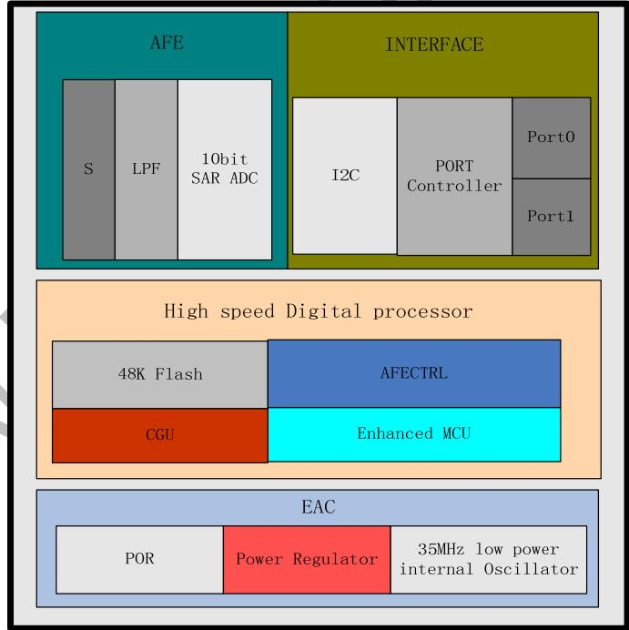  
Figure 2-1 FT6336U System Architecture Diagram

The FT6336U is comprised of five main functional parts listed below,

- Touch Panel Interface Circuits

The main function for the AFE and AFE controller is to interface with the touch panel. It scans the panel by sending AC signals to the panel and processes the received signals from the panel. So it supports both driver and Sensor functions. Key parameters to configure this circuit can be sent via serial interfaces.

- Enhanced MCU

For the Enhanced MCU, larger program and data memories are supported. Furthermore, A Flash ROM is implemented to store

> This document contains information proprietary to FocalTech Systems Co., Ltd., and may not be reproduced, disclosed, or used without written permission from FocalTech Systems Co., Ltd.

programs and some key parameters.

Complex signal processing algorithms are implemented by MCU to detect the touches reliably and efficiently.

Communication protocol software is also implemented on this MCU to exchange data and control information with the host processor.

- External Interface

- I2C: an interface for data exchange with host   
- INT: an interrupt signal to inform the host processor that touch data is ready for read
- RSTN: an external low signal reset the chip.

- A watch dog timer is implemented to ensure the robustness of the chip.

- A voltage regulator to generate 1.5V for digital circuits from the input VDDA supply.

# 2.2 MCU

This section describes some critical features and operations supported by the Enhanced MCU.

Figure 2-2 shows the overall structure of the MCU block. In addition to the Enhanced MCU core, we have added the following circuits,

- Memory: 48KB Flash   
- Data Memory: 5KB SRAM   
- Timer: A number of timers are available to generate different clocks   
- Master Clock:18MHz from a 36MHz RC Oscillator Clock Manager: To control various clocks under different operation conditions of the system

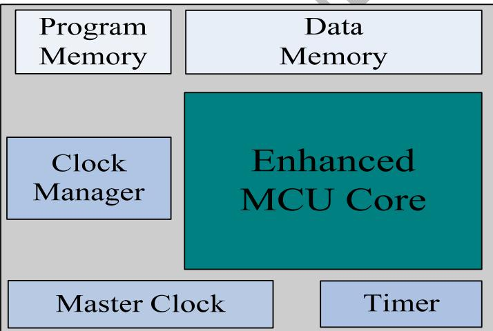  
Figure 2-2 MCU Block Diagram

# 2.3 Operation Modes

FT6336U operates in the following three modes:

- Active Mode

In this mode, FT6336U actively scans the panel. The default scan rate is 60 frames per second. The host processor can configure FT6336U to speed up or to slow down.

- Monitor Mode

In this mode, FT6336U scans the panel at a reduced speed. The default scan rate is 25 frames per second and the host processor can increase or decrease this rate. When in this mode, most algorithms are stopped. A simpler algorithm is being executed to determine if there is a touch or not. When a touch is detected, FT6336U shall enter the Active mode immediately to acquire the touch information quickly. During this mode, the serial port is closed and no data shall be transferred with the host processor

- Hibernation Mode

In this mode, the chip is set in a power down mode. It shall respond to the "RESET" or "Wakeup" signal from the host processor. The chip therefore consumes very little current, which help prolong the standby time for the portable devices.

Host Interface Figure 2-3 shows the interface between a host processor and FT6336U. This interface consists of the following three sets of signals:

- Serial Interface

> This document contains information proprietary to FocalTech Systems Co., Ltd., and may not be reproduced, disclosed, or used without written permission from FocalTech Systems Co., Ltd.

- Interrupt from FT6336U to the Host - Reset Signal from the Host to FT6336U

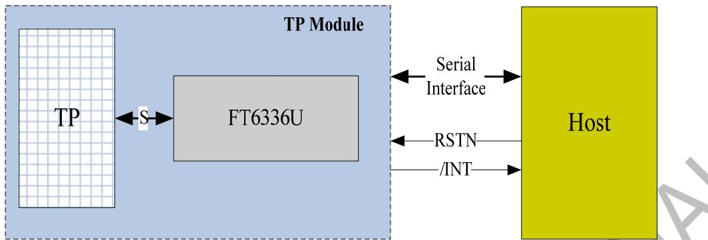  
Figure 2-3 Host Interface Diagram

The serial interface of FT6336U is I2C. The details of this interface are described in detail in Section 2.4. The interrupt signal (/INT) is used for FT6336U to inform the host that data are ready for the host to receive. The RSTN signal is used for the host to reset FT6336U. After resetting, FT6336U shall enter the Active mode.

# 2.4 Serial Interface

FT6336U supports the I2C interfaces, which can be used by a host processor or other devices.

# 2.4.1 I2C

The I2C is always configured in the Slave mode. The data transfer format is shown in Figure 2-4.

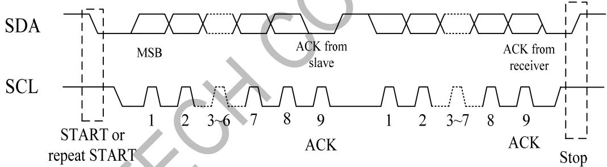  
Figure 2-4 I2C Serial Data Transfer Format

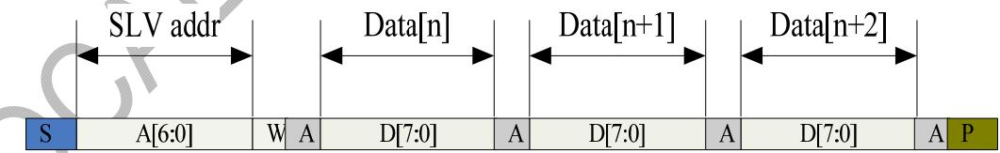  
Figure 2-5 I2C master write, slave read

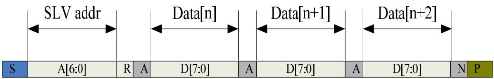  
Figure 2-6 I2C master read, slave write

Table 2-1 lists the meanings of the mnemonics used in the above figures.

> This document contains information proprietary to FocalTech Systems Co., Ltd., and may not be reproduced, disclosed, or used without written permission from FocalTech Systems Co., Ltd.

I2C Interface Timing Characteristics is shown in Table 2-2.   

<table><tr><td rowspan=1 colspan=1>Mnemonics</td><td rowspan=1 colspan=1>Description</td></tr><tr><td rowspan=1 colspan=1>S</td><td rowspan=1 colspan=1>I2C Start or I2C Restart</td></tr><tr><td rowspan=1 colspan=1>A[6:0]</td><td rowspan=1 colspan=1>Slave address</td></tr><tr><td rowspan=1 colspan=1>R/W</td><td rowspan=1 colspan=1>READ/WRITE bit, &#x27;1&#x27; for read, &#x27;0&#x27;for write</td></tr><tr><td rowspan=1 colspan=1>A(N)</td><td rowspan=1 colspan=1>ACK(NACK)</td></tr><tr><td rowspan=1 colspan=1>P</td><td rowspan=1 colspan=1>STP: the indication of the end of a packet (f this bit is missing, S wil indicate the end of the currentpacket and the beginning of the next packet)</td></tr></table>

Table 2-2 I2C Timing Characteristics   

<table><tr><td rowspan=1 colspan=1>Parameter</td><td rowspan=1 colspan=1>Min</td><td rowspan=1 colspan=1>Max</td><td rowspan=1 colspan=1>Unit</td></tr><tr><td rowspan=1 colspan=1>SCL frequency</td><td rowspan=1 colspan=1>10</td><td rowspan=1 colspan=1>400</td><td rowspan=1 colspan=1>KHz</td></tr><tr><td rowspan=1 colspan=1>Bus free time between a STOP and START condition</td><td rowspan=1 colspan=1>4.7</td><td rowspan=1 colspan=1>-></td><td rowspan=1 colspan=1>us</td></tr><tr><td rowspan=1 colspan=1>Hold time (repeated) START condition</td><td rowspan=1 colspan=1>4.0</td><td rowspan=1 colspan=1>|</td><td rowspan=1 colspan=1>us</td></tr><tr><td rowspan=1 colspan=1>Data setup time</td><td rowspan=1 colspan=1>250</td><td rowspan=1 colspan=1>|</td><td rowspan=1 colspan=1>ns</td></tr><tr><td rowspan=1 colspan=1>Setup time for a repeated START condition</td><td rowspan=1 colspan=1>cYmalo</td><td rowspan=1 colspan=1>|</td><td rowspan=1 colspan=1>us</td></tr><tr><td rowspan=1 colspan=1>Setup Time for STOP condition</td><td rowspan=1 colspan=1>4.0</td><td rowspan=1 colspan=1>|</td><td rowspan=1 colspan=1>us</td></tr></table>

# 3 ELECTRICAL SPECIFICATIONS

# 3.1 Absolute Maximum Ratings

Table 3-1 Absolute Maximum Ratings   

<table><tr><td rowspan=1 colspan=1>Item</td><td rowspan=1 colspan=1>Symbol</td><td rowspan=1 colspan=1>Value</td><td rowspan=1 colspan=1>Unit</td><td rowspan=1 colspan=1>Note</td></tr><tr><td rowspan=1 colspan=1>Power Supply Voltage</td><td rowspan=1 colspan=1>VDDA - VSSA</td><td rowspan=1 colspan=1>-0.3 ~ +3.6</td><td rowspan=1 colspan=1>V</td><td rowspan=1 colspan=1>1,2</td></tr><tr><td rowspan=1 colspan=1>Power Supply Voltage2</td><td rowspan=1 colspan=1>VDD3 - VSS</td><td rowspan=1 colspan=1>-0.3 ~ +3.6</td><td rowspan=1 colspan=1>V</td><td rowspan=1 colspan=1>1,3</td></tr><tr><td rowspan=1 colspan=1>I/O Digital Voltage</td><td rowspan=1 colspan=1>IoVCC</td><td rowspan=1 colspan=1>1.8~3.6</td><td rowspan=1 colspan=1>V</td><td rowspan=1 colspan=1>1</td></tr><tr><td rowspan=1 colspan=1>Operating Temperature</td><td rowspan=1 colspan=1>Topr</td><td rowspan=1 colspan=1>-40 ~ +85</td><td rowspan=1 colspan=1>C</td><td rowspan=1 colspan=1>1</td></tr><tr><td rowspan=1 colspan=1>Storage Temperature</td><td rowspan=1 colspan=1>Tstg</td><td rowspan=1 colspan=1>-55~+150</td><td rowspan=1 colspan=1>C</td><td rowspan=1 colspan=1>1</td></tr></table>

# Notes

1. If used beyond the absolute maximum ratings, FT6336U may be permanently damaged. It is strongly recommended that the device be used within the electrical characteristics in normal operations. If exposed to the condition not within the electrical characteristics, it may affect the reliability of the device.   
2. Make sure VDDA (high) ${ \ge } \mathrm { V S S A }$ (low).   
3. Make sure VDD3(high) ${ \ge } \mathrm { V S S }$ (low).

# 3.2 DC Characteristics

Table 3-2 DC Characteristics (VDDA=2.8\~3.6V, Ta=-40\~85degC)   

<table><tr><td rowspan=1 colspan=1>Item</td><td rowspan=1 colspan=1>Symbol</td><td rowspan=1 colspan=1>Test Condition</td><td rowspan=1 colspan=1>Min.</td><td rowspan=1 colspan=1>Typ.</td><td rowspan=1 colspan=1>Max.</td><td rowspan=1 colspan=1>Unit</td><td rowspan=1 colspan=1>Note</td></tr><tr><td rowspan=1 colspan=1>Input high-level voltage</td><td rowspan=1 colspan=1>VIH</td><td rowspan=1 colspan=1></td><td rowspan=1 colspan=1>0.7 x IOVCC</td><td rowspan=1 colspan=1>-</td><td rowspan=1 colspan=1>IOVCC</td><td rowspan=1 colspan=1>V</td><td rowspan=1 colspan=1></td></tr><tr><td rowspan=1 colspan=1>Input low -level voltage</td><td rowspan=1 colspan=1>VIL</td><td rowspan=1 colspan=1></td><td rowspan=1 colspan=1>-0.3</td><td rowspan=1 colspan=1>-</td><td rowspan=1 colspan=1>0.3 x IOVCC</td><td rowspan=1 colspan=1>V</td><td rowspan=1 colspan=1></td></tr><tr><td rowspan=1 colspan=1>Output high -level voltage</td><td rowspan=1 colspan=1>VOH</td><td rowspan=1 colspan=1>IOH=-0.1mA</td><td rowspan=1 colspan=1>0.7 x IOVCC</td><td rowspan=1 colspan=1>-</td><td rowspan=1 colspan=1>-</td><td rowspan=1 colspan=1>V</td><td rowspan=1 colspan=1></td></tr><tr><td rowspan=1 colspan=1>Output low -level voltage</td><td rowspan=1 colspan=1>VOL</td><td rowspan=1 colspan=1>IOH=0.1mA</td><td rowspan=1 colspan=1>-</td><td rowspan=1 colspan=1>-</td><td rowspan=1 colspan=1>0.3 x IOVCC</td><td rowspan=1 colspan=1>V</td><td rowspan=1 colspan=1></td></tr><tr><td rowspan=1 colspan=1>I/O leakage current</td><td rowspan=1 colspan=1>ILI</td><td rowspan=1 colspan=1>Vin=0~VDDA</td><td rowspan=1 colspan=1>-1</td><td rowspan=1 colspan=1>-</td><td rowspan=1 colspan=1>1</td><td rowspan=1 colspan=1>uA</td><td rowspan=1 colspan=1></td></tr></table>

> This document contains information proprietary to FocalTech Systems Co., Ltd., and may not be reproduced, disclosed, or used without written permission from FocalTech Systems Co., Ltd.

<table><tr><td rowspan=1 colspan=1>Current consumption( Normal operation mode )</td><td rowspan=1 colspan=1>Iopr</td><td rowspan=1 colspan=1>VDDA =VDD3= 2.8VTa=25MCLK=18MHz</td><td rowspan=1 colspan=1></td><td rowspan=1 colspan=1>4.32*1</td><td rowspan=1 colspan=1></td><td rowspan=1 colspan=1>mA</td></tr><tr><td rowspan=1 colspan=1>Current consumption( Monitor mode )</td><td rowspan=1 colspan=1>Imon</td><td rowspan=1 colspan=1>VDDA =VDD3= 2.8VTa=25MCLK=18MHz</td><td rowspan=1 colspan=1></td><td rowspan=1 colspan=1>220*2</td><td rowspan=1 colspan=1>-</td><td rowspan=1 colspan=1>uA</td></tr><tr><td rowspan=1 colspan=1>Current consumption( Sleep mode )</td><td rowspan=1 colspan=1>Islp</td><td rowspan=1 colspan=1>VDDA =VDD3= 2.8VTa=25</td><td rowspan=1 colspan=1></td><td rowspan=1 colspan=1>55</td><td rowspan=1 colspan=1>-</td><td rowspan=1 colspan=1>uA</td></tr><tr><td rowspan=1 colspan=1>Step-up output voltage</td><td rowspan=1 colspan=1>VDD5</td><td rowspan=1 colspan=1>VDDA = VDD3=2.8V</td><td rowspan=1 colspan=1>-</td><td rowspan=1 colspan=1>5</td><td rowspan=1 colspan=1>-</td><td rowspan=1 colspan=1>V^</td></tr><tr><td rowspan=1 colspan=1>Power Supply voltage</td><td rowspan=1 colspan=1>VDDAVDD3</td><td rowspan=1 colspan=1></td><td rowspan=1 colspan=1>2.8</td><td rowspan=1 colspan=1>-</td><td rowspan=1 colspan=1>3.3</td><td rowspan=1 colspan=1>V</td></tr></table>

\*1: Report Rate: 75Hz $@$ 4"TP \*2: Report Rate: 25Hz $@$ 4"TP 3.3 AC Characteristics

Table 3-3 AC Characteristics of Oscillators   

<table><tr><td rowspan=1 colspan=1>Item</td><td rowspan=1 colspan=1>Symbol</td><td rowspan=1 colspan=1>Test Condition</td><td rowspan=1 colspan=1>Min</td><td rowspan=1 colspan=1>Typ.</td><td rowspan=1 colspan=1>Max</td><td rowspan=1 colspan=1>Unit</td><td rowspan=1 colspan=1>Note</td></tr><tr><td rowspan=1 colspan=1>OSC clock 1</td><td rowspan=1 colspan=1>fosc1</td><td rowspan=1 colspan=1>VDDA= 2.8V;Ta=25</td><td rowspan=1 colspan=1>34.64</td><td rowspan=1 colspan=1>36</td><td rowspan=1 colspan=1>36.36</td><td rowspan=1 colspan=1>MHz</td><td rowspan=1 colspan=1></td></tr></table>

Table 3-4 AC Characteristics of sensor   

<table><tr><td rowspan=1 colspan=1>Item</td><td rowspan=1 colspan=1>Symbol</td><td rowspan=1 colspan=1>Test Condition</td><td rowspan=1 colspan=1>Min</td><td rowspan=1 colspan=1>Typ.</td><td rowspan=1 colspan=1>Max</td><td rowspan=1 colspan=1>Unit</td><td rowspan=1 colspan=1>Note</td></tr><tr><td rowspan=1 colspan=1>Sensor acceptable clock</td><td rowspan=1 colspan=1>ftx</td><td rowspan=1 colspan=1>VDDA=2.8VTa=25</td><td rowspan=1 colspan=1>0</td><td rowspan=1 colspan=1>100</td><td rowspan=1 colspan=1>300</td><td rowspan=1 colspan=1>KHz</td><td rowspan=1 colspan=1></td></tr><tr><td rowspan=1 colspan=1>Sensor output rise time</td><td rowspan=1 colspan=1>Ttxr</td><td rowspan=1 colspan=1>VDDA=2.8V; Ta=25</td><td rowspan=1 colspan=1>-</td><td rowspan=1 colspan=1>100</td><td rowspan=1 colspan=1>-</td><td rowspan=1 colspan=1>nS</td><td rowspan=1 colspan=1></td></tr><tr><td rowspan=1 colspan=1>Sensor output fall time</td><td rowspan=1 colspan=1>Ttxf</td><td rowspan=1 colspan=1>VDDA=2.8V Ta=25</td><td rowspan=1 colspan=1>-</td><td rowspan=1 colspan=1>80</td><td rowspan=1 colspan=1>-</td><td rowspan=1 colspan=1>nS</td><td rowspan=1 colspan=1></td></tr><tr><td rowspan=1 colspan=1>Sensor input voltage</td><td rowspan=1 colspan=1>Trxi</td><td rowspan=1 colspan=1>VDDA=2.8VTa=25&gt;</td><td rowspan=1 colspan=1>-</td><td rowspan=1 colspan=1>5</td><td rowspan=1 colspan=1>-</td><td rowspan=1 colspan=1>V</td><td rowspan=1 colspan=1></td></tr></table>

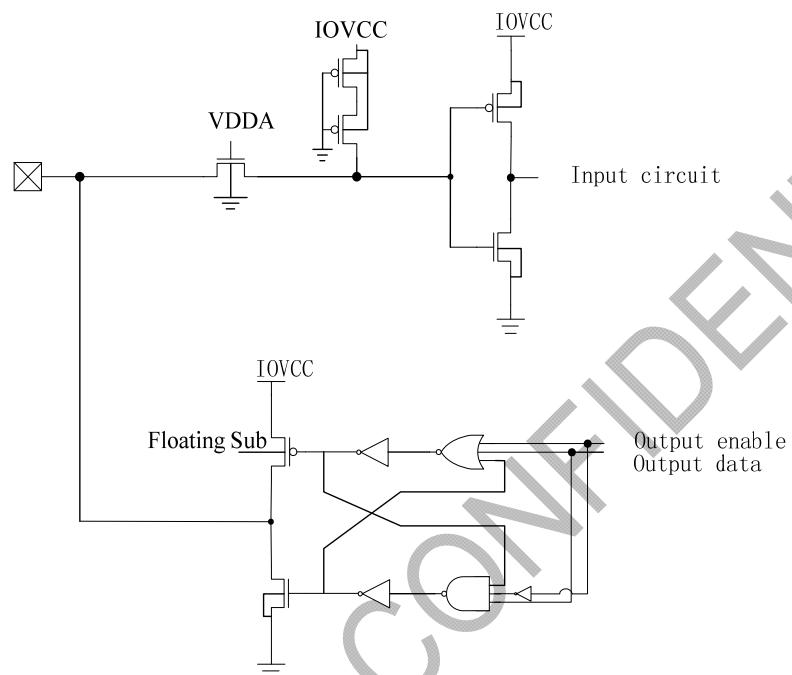  
Figure 3-1 Digital In/Out Port Circuit

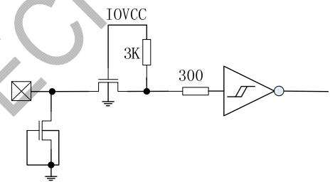  
Figure 3-2 Reset Input Port Circuits

# 3.5 POWER ON/Reset/Wake Sequence

The GPIO such as INT and I2C are advised to be low before powering on. Reset should be pulled down to be low before powering on. INT signal will be sent to the host after initializing all parameters and then start to report points to the host. If Power is down, the voltage of supply must be below $0 . 3 \mathrm { V }$ and Trst is more than 5ms.

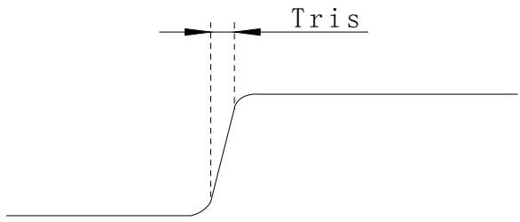

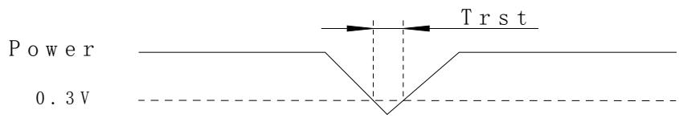

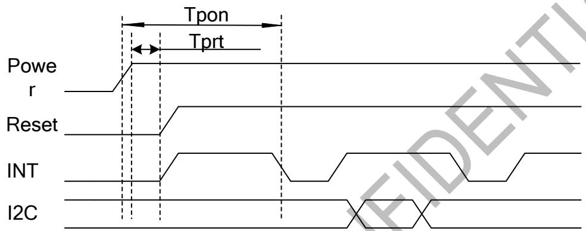  
Figure 3-8 Power Cycle requirement   
Figure 3-9 Power on Sequence

Reset time must be enough to guarantee reliable reset, the time of starting to report point after resetting approach to the time of starting to report point after powering on.

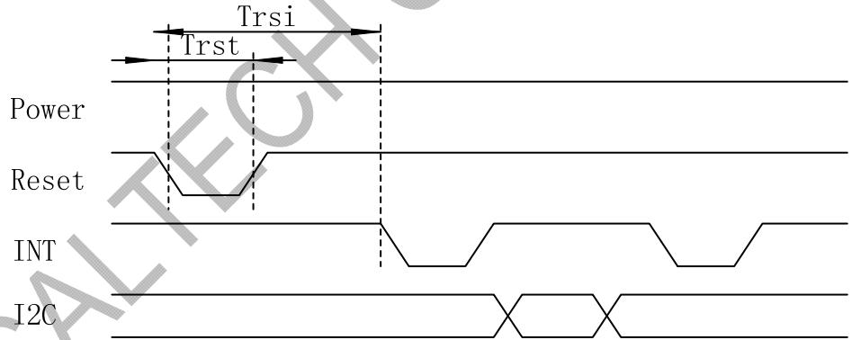  
Figure 3-10 Reset Sequence

Table 3-5 Power on/Reset/Wake Sequence Parameters   

<table><tr><td rowspan=1 colspan=1>Parameter</td><td rowspan=1 colspan=1>Description</td><td rowspan=1 colspan=1>Min</td><td rowspan=1 colspan=1>Max</td><td rowspan=1 colspan=1>Units</td></tr><tr><td rowspan=1 colspan=1>Tris</td><td rowspan=1 colspan=1>Rise time from 0.1VDD to 0.9VDD</td><td rowspan=1 colspan=1>-</td><td rowspan=1 colspan=1>3</td><td rowspan=1 colspan=1>ms</td></tr><tr><td rowspan=1 colspan=1>Tpon</td><td rowspan=1 colspan=1>Time of starting to report point after powering on</td><td rowspan=1 colspan=1>300</td><td rowspan=1 colspan=1>-</td><td rowspan=1 colspan=1>ms</td></tr><tr><td rowspan=1 colspan=1>Tprt</td><td rowspan=1 colspan=1>Time of being low after powering on</td><td rowspan=1 colspan=1>1</td><td rowspan=1 colspan=1>-</td><td rowspan=1 colspan=1>ms</td></tr><tr><td rowspan=1 colspan=1>Trsi</td><td rowspan=1 colspan=1>Time of starting to report point after resetting</td><td rowspan=1 colspan=1>300</td><td rowspan=1 colspan=1>-</td><td rowspan=1 colspan=1>ms</td></tr><tr><td rowspan=1 colspan=1>Trst</td><td rowspan=1 colspan=1>Reset time</td><td rowspan=1 colspan=1>5</td><td rowspan=1 colspan=1>-</td><td rowspan=1 colspan=1>ms</td></tr></table>

> This document contains information proprietary to FocalTech Systems Co., Ltd., and may not be reproduced, disclosed, or used without written permission from FocalTech Systems Co., Ltd.

Table 4-1 Pin Definition of FT6336U   

<table><tr><td rowspan=1 colspan=1>Name</td><td rowspan=1 colspan=1>Pin No.</td><td rowspan=1 colspan=1>Type</td><td rowspan=1 colspan=1>Description</td></tr><tr><td rowspan=1 colspan=1>VREF</td><td rowspan=1 colspan=1>46</td><td rowspan=1 colspan=1>PWR</td><td rowspan=1 colspan=1>Generated internal reference voltage.A 1uF ceramic capacitor to ground isrequired.</td></tr><tr><td rowspan=1 colspan=1>S1</td><td rowspan=1 colspan=1>47</td><td rowspan=1 colspan=1>I/O</td><td rowspan=1 colspan=1>Capacitance sensor /driver channel</td></tr><tr><td rowspan=1 colspan=1>S2</td><td rowspan=1 colspan=1>48</td><td rowspan=1 colspan=1>I/O</td><td rowspan=1 colspan=1>Capacitance sensor /driver channel</td></tr><tr><td rowspan=1 colspan=1>S3</td><td rowspan=1 colspan=1>1</td><td rowspan=1 colspan=1>I/O</td><td rowspan=1 colspan=1>Capacitance sensor /driver channel</td></tr><tr><td rowspan=1 colspan=1>S4</td><td rowspan=1 colspan=1>2</td><td rowspan=1 colspan=1>I/O</td><td rowspan=1 colspan=1>Capacitance sensor /driver channel</td></tr><tr><td rowspan=1 colspan=1>S5</td><td rowspan=1 colspan=1>3</td><td rowspan=1 colspan=1>I/O</td><td rowspan=1 colspan=1>Capacitance sensor /driver channel</td></tr><tr><td rowspan=1 colspan=1>S6</td><td rowspan=1 colspan=1>4</td><td rowspan=1 colspan=1>I/O</td><td rowspan=1 colspan=1>Capacitance sensor /driver channel</td></tr><tr><td rowspan=1 colspan=1>S7</td><td rowspan=1 colspan=1>5</td><td rowspan=1 colspan=1>I/O</td><td rowspan=1 colspan=1>Capacitance sensor /driver channel</td></tr><tr><td rowspan=1 colspan=1>S8</td><td rowspan=1 colspan=1>6</td><td rowspan=1 colspan=1>I/O</td><td rowspan=1 colspan=1>Capacitance sensor /driver channel</td></tr><tr><td rowspan=1 colspan=1>S9</td><td rowspan=1 colspan=1>7</td><td rowspan=1 colspan=1>I/O</td><td rowspan=1 colspan=1>Capacitance sensor /driver channel</td></tr><tr><td rowspan=1 colspan=1>S10</td><td rowspan=1 colspan=1>8</td><td rowspan=1 colspan=1>I/O</td><td rowspan=1 colspan=1>Capacitance sensor /driver channel</td></tr><tr><td rowspan=1 colspan=1>S11</td><td rowspan=1 colspan=1>9</td><td rowspan=1 colspan=1>I/O</td><td rowspan=1 colspan=1>Capacitance sensor /driver channel</td></tr><tr><td rowspan=1 colspan=1>S12</td><td rowspan=1 colspan=1>10</td><td rowspan=1 colspan=1>I/O</td><td rowspan=1 colspan=1>Capacitance sensor /driver channel</td></tr><tr><td rowspan=1 colspan=1>S13</td><td rowspan=1 colspan=1>11</td><td rowspan=1 colspan=1>I/O</td><td rowspan=1 colspan=1>Capacitance sensor /driver channel</td></tr><tr><td rowspan=1 colspan=1>S14</td><td rowspan=1 colspan=1>12</td><td rowspan=1 colspan=1>I/O</td><td rowspan=1 colspan=1>Capacitance sensor /driver channel</td></tr><tr><td rowspan=1 colspan=1>S15</td><td rowspan=1 colspan=1>13</td><td rowspan=1 colspan=1>I/O</td><td rowspan=1 colspan=1>Capacitance sensor /driver channel</td></tr><tr><td rowspan=1 colspan=1>S16</td><td rowspan=1 colspan=1>14</td><td rowspan=1 colspan=1>I/O</td><td rowspan=1 colspan=1>Capacitance sensor /driver channel</td></tr><tr><td rowspan=1 colspan=1>S17</td><td rowspan=1 colspan=1>15</td><td rowspan=1 colspan=1>I/O</td><td rowspan=1 colspan=1>Capacitance sensor /driver channel</td></tr><tr><td rowspan=1 colspan=1>S18</td><td rowspan=1 colspan=1>16</td><td rowspan=1 colspan=1>1O</td><td rowspan=1 colspan=1>Capacitance sensor /driver channel</td></tr><tr><td rowspan=1 colspan=1>S19</td><td rowspan=1 colspan=1>17</td><td rowspan=1 colspan=1>10</td><td rowspan=1 colspan=1>Capacitance sensor /driver channel</td></tr><tr><td rowspan=1 colspan=1>S20</td><td rowspan=1 colspan=1>18</td><td rowspan=1 colspan=1>vo</td><td rowspan=1 colspan=1>Capacitance sensor /driver channel</td></tr><tr><td rowspan=1 colspan=1>S21</td><td rowspan=1 colspan=1>19.</td><td rowspan=1 colspan=1>1/0</td><td rowspan=1 colspan=1>Capacitance sensor /driver channel</td></tr><tr><td rowspan=1 colspan=1>S22</td><td rowspan=1 colspan=1>20</td><td rowspan=1 colspan=1>I/O</td><td rowspan=1 colspan=1>Capacitance sensor /driver channel</td></tr><tr><td rowspan=1 colspan=1>S23</td><td rowspan=1 colspan=1>21</td><td rowspan=1 colspan=1>I/O</td><td rowspan=1 colspan=1>Capacitance sensor /driver channel</td></tr><tr><td rowspan=1 colspan=1>S24</td><td rowspan=1 colspan=1>22</td><td rowspan=1 colspan=1>I/O</td><td rowspan=1 colspan=1>Capacitance sensor /driver channel</td></tr><tr><td rowspan=1 colspan=1>S25</td><td rowspan=1 colspan=1>23</td><td rowspan=1 colspan=1>I/O</td><td rowspan=1 colspan=1>Capacitance sensor /driver channel</td></tr><tr><td rowspan=1 colspan=1>S26</td><td rowspan=1 colspan=1>24</td><td rowspan=1 colspan=1>I/O</td><td rowspan=1 colspan=1>Capacitance sensor /driver channel</td></tr><tr><td rowspan=1 colspan=1>S27</td><td rowspan=1 colspan=1>25</td><td rowspan=1 colspan=1>I/O</td><td rowspan=1 colspan=1>Capacitance sensor /driver channel</td></tr><tr><td rowspan=1 colspan=1>S28</td><td rowspan=1 colspan=1>26</td><td rowspan=1 colspan=1>I/O</td><td rowspan=1 colspan=1>Capacitance sensor /driver channel</td></tr><tr><td rowspan=1 colspan=1>S29</td><td rowspan=1 colspan=1>27</td><td rowspan=1 colspan=1>I/O</td><td rowspan=1 colspan=1>Capacitance sensor /driver channel</td></tr><tr><td rowspan=1 colspan=1>S30</td><td rowspan=1 colspan=1>28</td><td rowspan=1 colspan=1>I/O</td><td rowspan=1 colspan=1>Capacitance sensor /driver channel</td></tr><tr><td rowspan=1 colspan=1>S31</td><td rowspan=1 colspan=1>29</td><td rowspan=1 colspan=1>I/O</td><td rowspan=1 colspan=1>Capacitance sensor /driver channel</td></tr><tr><td rowspan=1 colspan=1>S32</td><td rowspan=1 colspan=1>30</td><td rowspan=1 colspan=1>I/O</td><td rowspan=1 colspan=1>Capacitance sensor /driver channel</td></tr><tr><td rowspan=1 colspan=1>S33</td><td rowspan=1 colspan=1>31</td><td rowspan=1 colspan=1>I/O</td><td rowspan=1 colspan=1>Capacitance sensor /driver channel</td></tr><tr><td rowspan=1 colspan=1>S34</td><td rowspan=1 colspan=1>32</td><td rowspan=1 colspan=1>I/O</td><td rowspan=1 colspan=1>Capacitance sensor /driver channel</td></tr><tr><td rowspan=1 colspan=1>S35</td><td rowspan=1 colspan=1>33</td><td rowspan=1 colspan=1>I/O</td><td rowspan=1 colspan=1>Capacitance sensor /driver channel</td></tr><tr><td rowspan=1 colspan=1>S36</td><td rowspan=1 colspan=1>34</td><td rowspan=1 colspan=1>I/O</td><td rowspan=1 colspan=1>Capacitance sensor /driver channel</td></tr><tr><td rowspan=1 colspan=1>S37</td><td rowspan=1 colspan=1>35</td><td rowspan=1 colspan=1>I/O</td><td rowspan=1 colspan=1>Capacitance sensor /driver channel</td></tr><tr><td rowspan=1 colspan=1>S38</td><td rowspan=1 colspan=1>36</td><td rowspan=1 colspan=1>I/O</td><td rowspan=1 colspan=1>Capacitance sensor /driver channel</td></tr><tr><td rowspan=1 colspan=1>S39</td><td rowspan=1 colspan=1>37</td><td rowspan=1 colspan=1>I/O</td><td rowspan=1 colspan=1>Capacitance sensor /driver channel</td></tr><tr><td rowspan=1 colspan=1>VDD5</td><td rowspan=1 colspan=1>38</td><td rowspan=1 colspan=1>PWR</td><td rowspan=1 colspan=1>High voltage power supply from the</td></tr></table>

> This document contains information proprietary to FocalTech Systems Co., Ltd., and may not be reproduced, disclosed, or used without written permission from FocalTech Systems Co., Ltd.

<table><tr><td rowspan=1 colspan=1></td><td rowspan=1 colspan=1></td><td rowspan=1 colspan=1></td><td rowspan=1 colspan=1>charge pump LDO generated inter-nally. A 1uF ceramic to ground isrequired.</td></tr><tr><td rowspan=1 colspan=1>VDDA</td><td rowspan=1 colspan=1>39</td><td rowspan=1 colspan=1>PWR</td><td rowspan=1 colspan=1>Analog power supply, A 1uF ceramiccapacitor to ground is required.</td></tr><tr><td rowspan=1 colspan=1>VDDD</td><td rowspan=1 colspan=1>40</td><td rowspan=1 colspan=1>PWR</td><td rowspan=1 colspan=1>Digital power supply. A 1uF ceramiccapacitor to ground is required.</td></tr><tr><td rowspan=1 colspan=1>RSTN</td><td rowspan=1 colspan=1>41</td><td rowspan=1 colspan=1>I</td><td rowspan=1 colspan=1>External Reset, Low is active</td></tr><tr><td rowspan=1 colspan=1>IOVCC</td><td rowspan=1 colspan=1>42</td><td rowspan=1 colspan=1>PWR</td><td rowspan=1 colspan=1>I/O power supply</td></tr><tr><td rowspan=1 colspan=1>SCL</td><td rowspan=1 colspan=1>43</td><td rowspan=1 colspan=1>I/O</td><td rowspan=1 colspan=1>I2C clock input</td></tr><tr><td rowspan=1 colspan=1>SDA</td><td rowspan=1 colspan=1>44</td><td rowspan=1 colspan=1>I/O</td><td rowspan=1 colspan=1>I2C data input and output</td></tr><tr><td rowspan=1 colspan=1>INT</td><td rowspan=1 colspan=1>45</td><td rowspan=1 colspan=1>I/O</td><td rowspan=1 colspan=1>External interrupt to the host</td></tr></table>

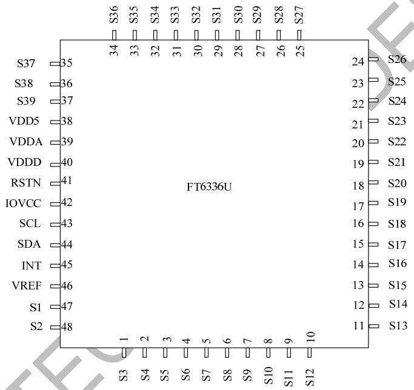  
FT6336U Package Diagram

# 5.1 Package Information of QFN-5x5-48L Package

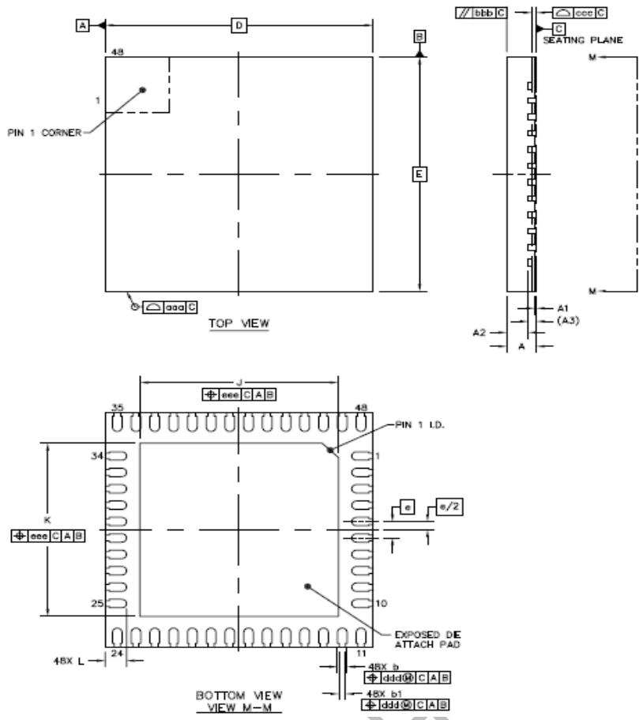

<table><tr><td rowspan=2 colspan=1>Item</td><td rowspan=2 colspan=1>Symbol</td><td rowspan=1 colspan=3>Millimeter</td></tr><tr><td rowspan=1 colspan=1>Min</td><td rowspan=1 colspan=1>Type</td><td rowspan=1 colspan=1>Max</td></tr><tr><td rowspan=1 colspan=1>Total Thickness</td><td rowspan=1 colspan=1>A</td><td rowspan=1 colspan=1>0.5</td><td rowspan=1 colspan=1>0.55</td><td rowspan=1 colspan=1>0.6</td></tr><tr><td rowspan=1 colspan=1>Stand Off</td><td rowspan=1 colspan=1>A1</td><td rowspan=1 colspan=1>0</td><td rowspan=1 colspan=1>0.035</td><td rowspan=1 colspan=1>0.05</td></tr><tr><td rowspan=1 colspan=1>Mold Thickness   Y</td><td rowspan=1 colspan=1>A2</td><td rowspan=1 colspan=1>----</td><td rowspan=1 colspan=1>0.4</td><td rowspan=1 colspan=1>----</td></tr><tr><td rowspan=1 colspan=1>L/F Thickness</td><td rowspan=1 colspan=1>A3</td><td rowspan=1 colspan=3>0.152 REF</td></tr><tr><td rowspan=2 colspan=1>Lead Width</td><td rowspan=1 colspan=1>b</td><td rowspan=1 colspan=1>0.13</td><td rowspan=1 colspan=1>0.18</td><td rowspan=1 colspan=1>0.23</td></tr><tr><td rowspan=1 colspan=1>b1</td><td rowspan=1 colspan=1>0.07</td><td rowspan=1 colspan=1>0.12</td><td rowspan=1 colspan=1>0.17</td></tr><tr><td rowspan=2 colspan=1>BodySize</td><td rowspan=1 colspan=1>D</td><td rowspan=1 colspan=3>5 BSC</td></tr><tr><td rowspan=1 colspan=1>E</td><td rowspan=1 colspan=3>5 BSC</td></tr><tr><td rowspan=1 colspan=1>Lead Pitch</td><td rowspan=1 colspan=1>e</td><td rowspan=1 colspan=3>0.35 BSC</td></tr><tr><td rowspan=2 colspan=1>EP Size</td><td rowspan=1 colspan=1>J</td><td rowspan=1 colspan=1>3.6</td><td rowspan=1 colspan=1>3.7</td><td rowspan=1 colspan=1>3.8</td></tr><tr><td rowspan=1 colspan=1>K</td><td rowspan=1 colspan=1>3.6</td><td rowspan=1 colspan=1>3.7</td><td rowspan=1 colspan=1>3.8</td></tr><tr><td rowspan=1 colspan=1>Lead Length</td><td rowspan=1 colspan=1>L</td><td rowspan=1 colspan=1>0.35</td><td rowspan=1 colspan=1>0.4</td><td rowspan=1 colspan=1>0.45</td></tr><tr><td rowspan=1 colspan=1>Package Edge Tolerance</td><td rowspan=1 colspan=1>aaa</td><td rowspan=1 colspan=3>0.1</td></tr><tr><td rowspan=1 colspan=1>Mold Flatness</td><td rowspan=1 colspan=1>bbb</td><td rowspan=1 colspan=3>0.1</td></tr><tr><td rowspan=1 colspan=1>Co Planarity</td><td rowspan=1 colspan=1>ccc</td><td rowspan=1 colspan=3>0.08</td></tr><tr><td rowspan=1 colspan=1>Lead Offset</td><td rowspan=1 colspan=1>ddd</td><td rowspan=1 colspan=3>0.1</td></tr><tr><td rowspan=1 colspan=1>Exposed Pad Offset</td><td rowspan=1 colspan=1>eee</td><td rowspan=1 colspan=3>0.1</td></tr></table>