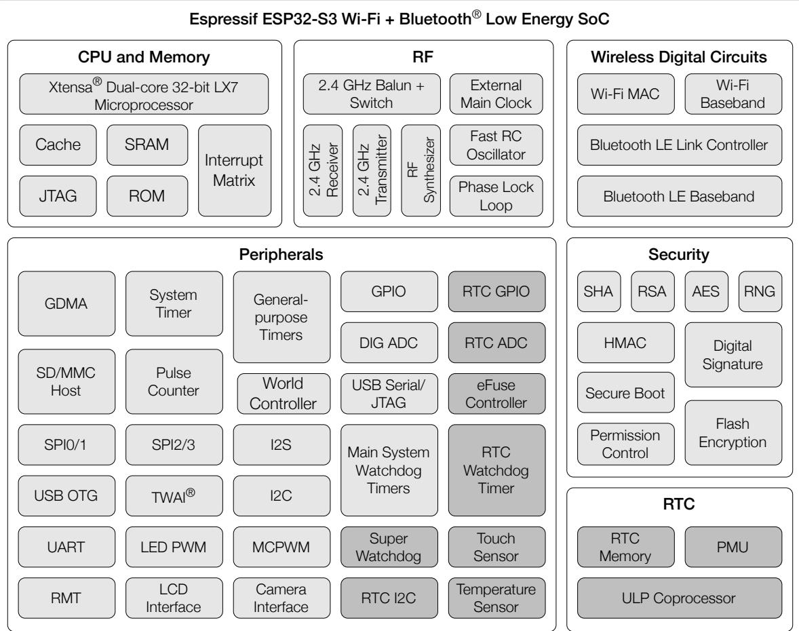
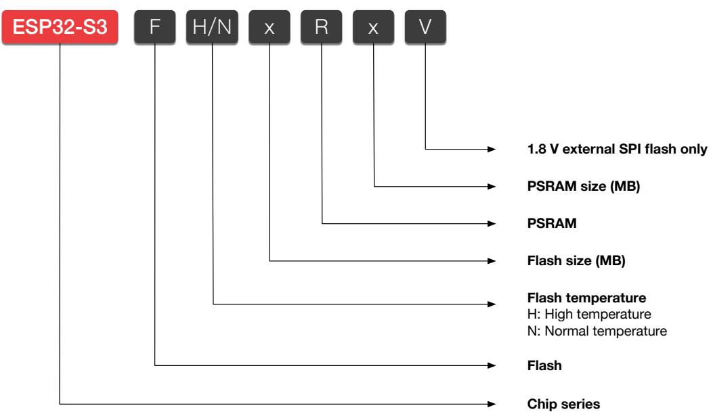
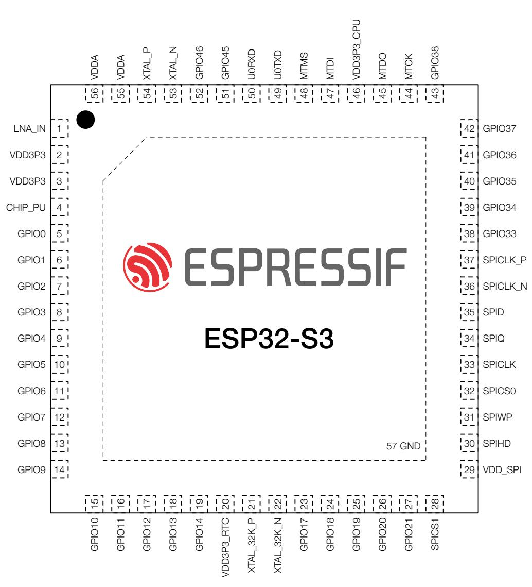
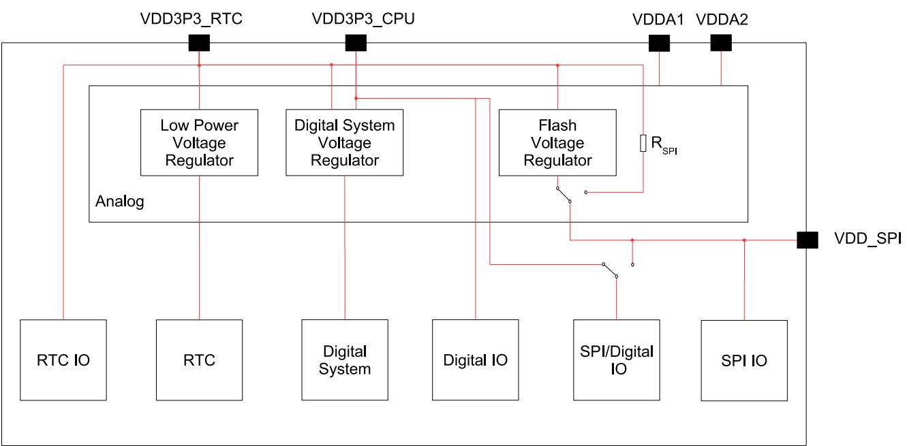
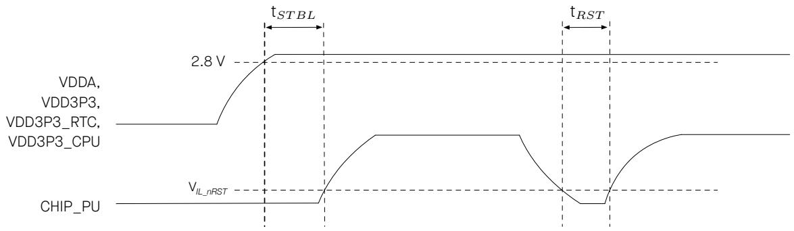
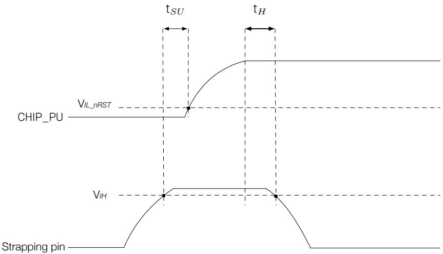
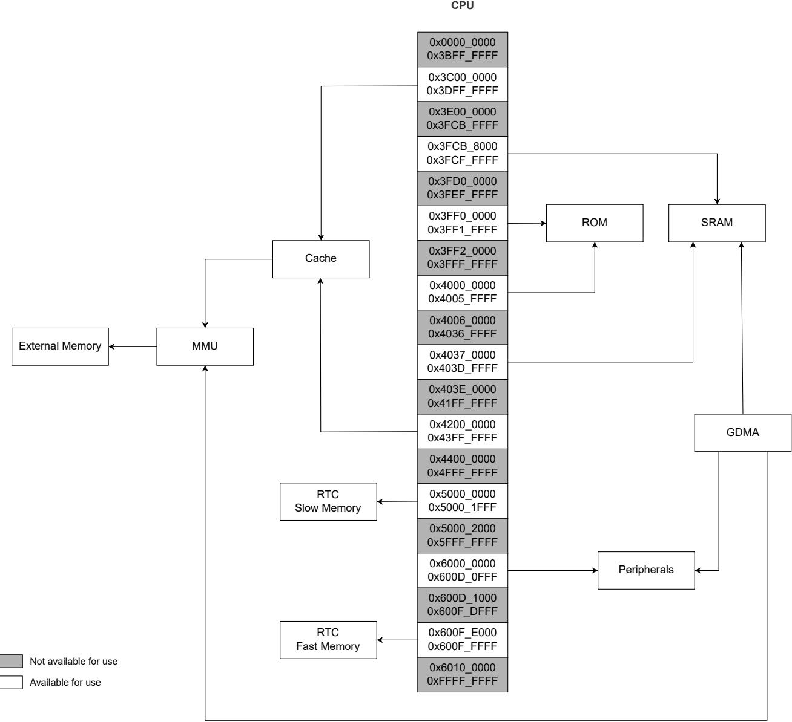
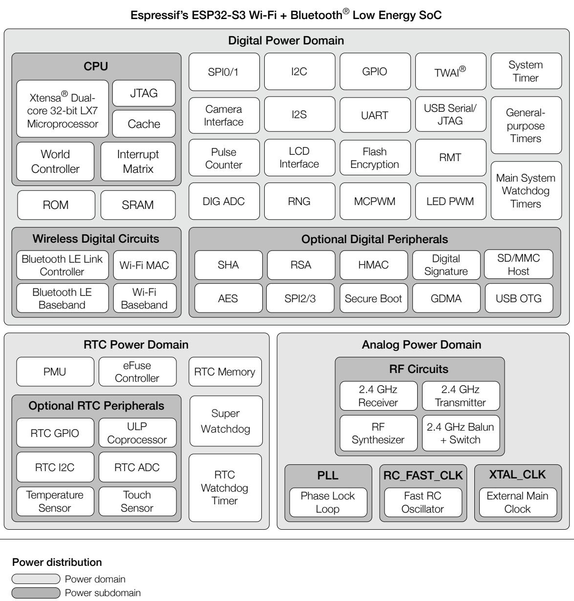
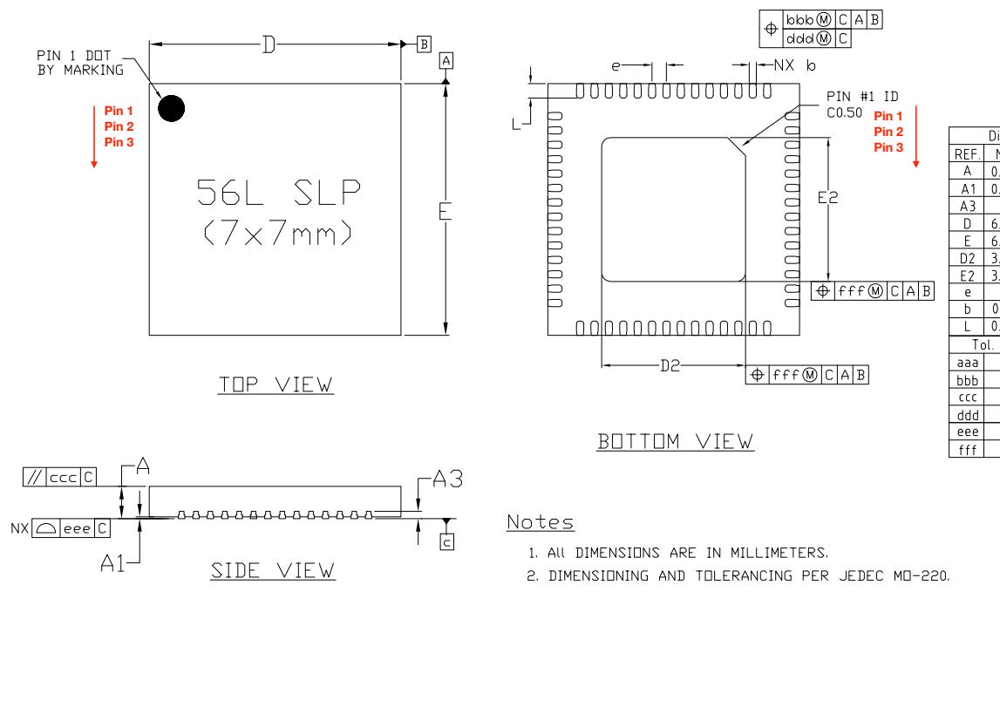
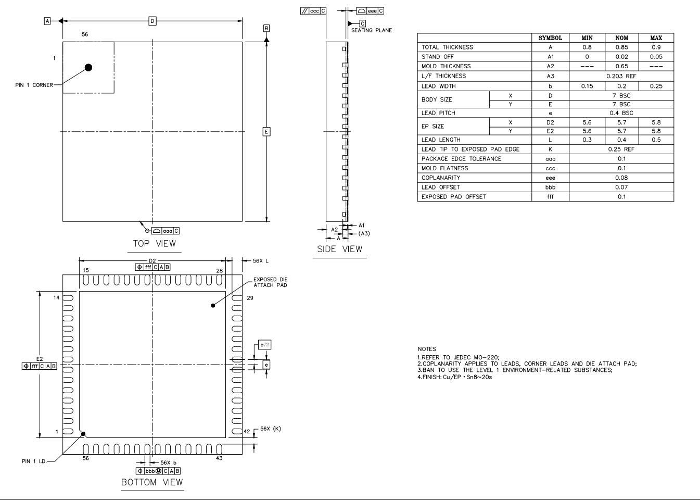

# ESP32-S3 Series

Datasheet Version 2.0

Xtensa® 32-bit LX7 dual-core microprocessor   
2.4 GHz Wi-Fi (IEEE 802.11b/g/n) and Bluetooth® 5 (LE)   
Optional 1.8 V or 3.3 V flash and PSRAM in the chip’s package   
45 GPIOs   
QFN56 $( 7 \times 7 ~ \mathsf { m m } )$ ) Package

Including: ESP32-S3 ESP32-S3FN8 ESP32-S3R2 ESP32-S3R8 ESP32-S3R8V – End of Life (EOL) ESP32-S3R16V ESP32-S3FH4R2

ESP32-S3 is a low-power MCU-based system on a chip (SoC) with integrated 2.4 GHz Wi-Fi and Bluetooth® Low Energy (Bluetooth LE). It consists of high-performance dual-core microprocessor (Xtensa® 32-bit LX7), a ULP coprocessor, a Wi-Fi baseband, a Bluetooth LE baseband, RF module, and numerous peripherals.

The functional block diagram of the SoC is shown below.

# Power consumption

Normal Low power consumption components capable of working in Deep-sleep mode

# ESP32-S3 Functional Block Diagram

# Features

# Wi-Fi

• IEEE 802.11b/g/n-compliant   
• Supports 20 MHz and 40 MHz bandwidth in 2.4 GHz band   
• 1T1R mode with data rate up to 150 Mbps   
• Wi-Fi Multimedia (WMM)   
• TX/RX A-MPDU, TX/RX A-MSDU   
• Immediate Block ACK   
• Fragmentation and defragmentation   
• Automatic Beacon monitoring (hardware TSF)   
• Four virtual Wi-Fi interfaces   
• Simultaneous support for Infrastructure BSS in Station, SoftAP, or Station $^ +$ SoftAP modes Note that when ESP32-S3 scans in Station mode, the SoftAP channel will change along with the Station channel   
• Antenna diversity   
• 802.11mc FTM

# Bluetooth

• Bluetooth LE: Bluetooth 5, Bluetooth mesh   
• High power mode (20 dBm)   
• Speed: 125 Kbps, 500 Kbps, 1 Mbps, 2 Mbps   
• Advertising extensions   
• Multiple advertisement sets   
• Channel selection algorithm #2   
• Internal co-existence mechanism between Wi-Fi and Bluetooth to share the same antenna

# CPU and Memory

• Xtensa® dual-core 32-bit LX7 microprocessor • Clock speed: up to 240 MHz

• CoreMark® score: – Two cores at 240 MHz: 1329.92 CoreMark; 5.54 CoreMark/MHz

• Five-stage pipeline

128-bit data bus and dedicated SIMD instructions • Single precision floating point unit (FPU)

• L1 cache   
ROM: 384 KB   
• SRAM: 512 KB   
• SRAM in RTC: 16 KB   
• Supported SPI protocols: SPI, Dual SPI, Quad SPI, Octal SPI, QPI and OPI interfaces that allow connection to flash, external RAM, and other SPI devices   
• Flash controller with cache is supported   
• Flash in-Circuit Programming (ICP) is supported

# Advanced Peripheral Interfaces

• 45 programmable GPIOs – 4 strapping GPIOs – 6 or 7 GPIOs needed for in-package flash or PSRAM \* ESP32-S3FN8、ESP32-S3R2、ESP32-S3R8、ESP32-S3R8V、ESP32-S3R16V: 6 GPIOs needed \* ESP32-S3FH4R2: 7 GPIOs needed

• Digital interfaces:

– Two SPI ports for communication with flash and RAM   
– Two general-purpose SPI ports   
– LCD interface (8-bit \~ 16-bit parallel RGB, I8080 and MOTO6800), supporting conversion betwee RGB565, YUV422, YUV420 and YUV411   
– DVP 8-bit \~ 16-bit camera interface   
– Three UARTs   
– Two I2Cs   
– Two I2Ss   
– RMT (TX/RX)   
– Pulse counter   
– LED PWM controller, up to 8 channels   
– Full-speed USB OTG   
– USB Serial/JTAG controller   
– Two Motor Control PWMs (MCPWM)   
– SD/MMC host controller with 2 slots   
– General DMA controller (GDMA), with 5 transmit channels and 5 receive channels   
– TWAI® controller, compatible with ISO 11898-1 (CAN Specification 2.0)   
– On-chip debug functionality via JTAG

• Analog interfaces:

– Two 12-bit SAR ADCs, up to 20 channels   
– Temperature sensor   
– 14 touch sensing IOs

• Timers:

– Four 54-bit general-purpose timers – 52-bit system timer – Three watchdog timers

# Low Power Management

• Fine-resolution power control through a selection of clock frequency, duty cycle, Wi-Fi operating modes, and individual power control of internal components

• Four power modes designed for typical scenarios: Active, Modem-sleep, Light-sleep, Deep-sleep

• Power consumption in Deep-sleep mode is as low as 7 µA

• Ultra-Low-Power (ULP) coprocessors:

– ULP-RISC-V coprocessor – ULP-FSM coprocessor

• RTC memory remains powered on in Deep-sleep mode

# Security

Secure boot• Flash encryption

4-Kbit OTP, up to 1792 bits for users • Cryptographic hardware acceleration:

– AES-128/256 (FIPS PUB 197)   
– SHA (FIPS PUB 180-4)   
– RSA   
– Random Number Generator (RNG)   
– HMAC   
– Digital signature

# Applications

With low power consumption, ESP32-S3 is an ideal choice for IoT devices in the following areas:

• Smart Home   
• Industrial Automation   
• Health Care   
• Consumer Electronics   
• Smart Agriculture   
• POS machines   
• Service robot   
• Audio Devices   
• Generic Low-power IoT Sensor Hubs   
• Generic Low-power IoT Data Loggers   
• Cameras for Video Streaming   
• USB Devices   
• Speech Recognition   
• Image Recognition   
• Wi-Fi $^ +$ Bluetooth Networking Card   
• Touch and Proximity Sensing

# Note:

Check the link or the QR code to make sure that you use the latest version of this document: https://www.espressif.com/documentation/esp32-s3_datasheet_en.pdf

# Contents

# Product Overview

2

Features Applications

3   
5

# ESP32-S3 Series Comparison 13

1.1 Nomenclature 13   
1.2 Comparison 13

2 Pins 14

2.1 Pin Layout 14   
2.2 Pin Overview 15   
2.3.1 IO MUX Functions 19   
2.3.2 RTC Functions 21   
2.3.3 Analog Functions 22   
2.3.4 Restrictions for GPIOs and RTC_GPIOs 24

2.4 Analog Pins 25

2.5 Power Supply 26

2.5.2 Power Scheme 26

2.5.3 Chip Power-up and Reset 27

2.6 Pin Mapping Between Chip and Flash/PSRAM 28

3 Boot Configurations 29

3.1 Chip Boot Mode Control 30

3.2 VDD_SPI Voltage Control 31

3.3 ROM Messages Printing Control 31

3.4 JTAG Signal Source Control 31

4 Functional Description 33

4.1 System 33

4.1.1 Microprocessor and Master 33

4.1.1.1 CPU 33

4.1.1.2 Processor Instruction Extensions (PIE) 33

4.1.1.3 Ultra-Low-Power Coprocessor (ULP) 34

4.1.1.4 GDMA Controller (GDMA) 34

Espressif Systems 7 ESP32-S3 Series Datasheet v2.0 Submit Documentation Feedback

# 4.1.2 Memory Organization 35

4.1.2.1 Internal Memory 36   
4.1.2.2 External Flash and RAM 36   
4.1.2.3 Cache 37   
4.1.2.4 eFuse Controller 37   
4.1.3 System Components 37   
4.1.3.1 IO MUX and GPIO Matrix 37   
4.1.3.2 Reset 38   
4.1.3.3 Clock 39   
4.1.3.4 Interrupt Matrix 39   
4.1.3.5 Power Management Unit (PMU) 40   
4.1.3.6 System Timer 42   
4.1.3.7 General Purpose Timers 42   
4.1.3.8 Watchdog Timers 42   
4.1.3.9 XTAL32K Watchdog Timers 43   
4.1.3.10 Permission Control 43   
4.1.3.11 World Controller 44   
4.1.3.12 System Registers 44   
4.1.4 Cryptography and Security Component 45   
4.1.4.1 SHA Accelerator 45   
4.1.4.2 AES Accelerator 45   
4.1.4.3 RSA Accelerator 46   
4.1.4.4 Secure Boot 46   
4.1.4.5 HMAC Accelerator 46   
4.1.4.6 Digital Signature 47   
4.1.4.7 External Memory Encryption and Decryption 47   
4.1.4.8 Clock Glitch Detection 47   
4.1.4.9 Random Number Generator 47

# 4.2 Peripherals

48

# 4.2.1 Connectivity Interface 48

4.2.1.1 UART Controller 48   
4.2.1.2 I2C Interface 49   
4.2.1.3 I2S Interface 49   
4.2.1.4 LCD and Camera Controller 50   
4.2.1.5 Serial Peripheral Interface (SPI) 50   
4.2.1.6 Two-Wire Automotive Interface (TWAI®) 53   
4.2.1.7 USB 2.0 OTG Full-Speed Interface 53   
4.2.1.8 USB Serial/JTAG Controller 55   
4.2.1.9 SD/MMC Host Controller 55   
4.2.1.10 LED PWM Controller 56   
4.2.1.11 Motor Control PWM (MCPWM) 56   
4.2.1.12 Remote Control Peripheral (RMT) 57   
4.2.1.13 Pulse Count Controller (PCNT) 57   
4.2.2 Analog Signal Processing 58   
4.2.2.1 SAR ADC 58   
4.2.2.2 Temperature Sensor 59

# 4.2.2.3 Touch Sensor 59

4.3 Wireless Communication

60

4.3.1 Radio 60   
4.3.1.1 2.4 GHz Receiver 60   
4.3.1.2 2.4 GHz Transmitter 60   
4.3.1.3 Clock Generator 60

4.3.2.1 Wi-Fi Radio and Baseband 61

4.3.2.2 Wi-Fi MAC 61

4.3.2.3 Networking Features 61

4.3.3 Bluetooth LE 61

4.3.3.1 Bluetooth LE PHY 62

4.3.3.2 Bluetooth LE Link Controller 62

# 5 Electrical Characteristics 63

5.1 Absolute Maximum Ratings 63

5.2 Recommended Power Supply Characteristics 63

5.3 VDD_SPI Output Characteristics 64

5.4 DC Characteristics (3.3 V, $2 5 ^ { \circ } \mathrm { C }$ ) 64

5.6 Current Consumption 65

5.6.1 RF Current Consumption in Active Mode 65

5.6.2 Current Consumption in Other Modes 65

5.7 Reliability 68

6 RF Characteristics 69

.1 Wi-Fi Radio 69   
6.1.1 Wi-Fi RF Transmitter (TX) Specifications 69   
6.1.2 Wi-Fi RF Receiver (RX) Specifications 70

6.2 Bluetooth LE Radio 71

6.2.1 Bluetooth LE RF Transmitter (TX) Specifications 71   
6.2.2 Bluetooth LE RF Receiver (RX) Specifications 73

7 Packaging 76

# Appendix A – ESP32-S3 Consolidated Pin Overview

# Related Documentation and Resources 79

Revision History 80

# List of Tables

1-1 ESP32-S3 Series Comparison 13   
2-1 Pin Overview 15   
2-2 Power-Up Glitches on Pins 17   
2-3 Peripheral Signals Routed via IO MUX 19   
2-4 IO MUX Pin Functions 20   
2-5 RTC Peripheral Signals Routed via RTC IO MUX 22   
2-6 RTC Functions 22   
2-7 Analog Signals Routed to Analog Functions 23   
2-8 Analog Functions 23   
2-9 Analog Pins 25   
2-10 Power Pins 26   
2-11 Voltage Regulators 26   
2-12 Description of Timing Parameters for Power-up and Reset 27   
2-13 Pin Mapping Between Chip and In-package Flash/ PSRAM 28   
3-1 Default Configuration of Strapping Pins 29   
3-2 Description of Timing Parameters for the Strapping Pins 30   
3-3 Chip Boot Mode Control 30   
3-4 VDD_SPI Voltage Control 31   
3-5 JTAG Signal Source Control 32   
4-1 Components and Power Domains 41   
5-1 Absolute Maximum Ratings 63   
5-2 Recommended Power Characteristics 63   
5-3 VDD_SPI Internal and Output Characteristics 64   
5-4 DC Characteristics (3.3 V, $2 5 ^ { \circ } \mathrm { C }$ ) 64   
5-5 ADC Characteristics 65   
5-6 ADC Calibration Results 65   
5-7 Wi-Fi Current Consumption Depending on RF Modes 65   
5-8 Current Consumption in Modem-sleep Mode 66   
5-9 Current Consumption in Low-Power Modes 66   
5-10 Reliability Qualifications 68   
6-1 Wi-Fi RF Characteristics 69   
6-2 TX Power with Spectral Mask and EVM Meeting 802.11 Standards 69   
6-3 TX EVM Test1 69   
6-4 RX Sensitivity 70   
6-5 Maximum RX Level 71   
6-6 RX Adjacent Channel Rejection 71   
6-7 Bluetooth LE Frequency 71   
6-8 Transmitter Characteristics - Bluetooth LE 1 Mbps 71   
6-9 Transmitter Characteristics - Bluetooth LE 2 Mbps 72   
6-10 Transmitter Characteristics - Bluetooth LE 125 Kbps 72   
6-11 Transmitter Characteristics - Bluetooth LE 500 Kbps 73   
6-12 Receiver Characteristics - Bluetooth LE 1 Mbps 73   
6-13 Receiver Characteristics - Bluetooth LE 2 Mbps 74

# List of Figures

1-1 ESP32-S3 Series Nomenclature 13

2-1 ESP32-S3 Pin Layout (Top View) 14

2-2 ESP32-S3 Power Scheme 27

2-3 Visualization of Timing Parameters for Power-up and Reset 27

3-1 Visualization of Timing Parameters for the Strapping Pins 30

4-1 Address Mapping Structure 35

4-2 Components and Power Domains 41

7-1 QFN56 $7 { \times } 7 ~ \mathsf { m m }$ ) Package 76

7-2 QFN56 $( 7 { \times } 7 ~ \mathsf { m m }$ ) Package (Only for ESP32-S3FH4R2) 77

# 1 ESP32-S3 Series Comparison

# 1.1 Nomenclature

  
Figure 1-1. ESP32-S3 Series Nomenclature

# 1.2 Comparison

Table 1-1. ESP32-S3 Series Comparison   

<table><tr><td rowspan=1 colspan=1>Ordering Code1</td><td rowspan=1 colspan=1>In-Package Flash2</td><td rowspan=1 colspan=1>In-Package PSRAM</td><td rowspan=1 colspan=1>Ambient Temp.3(C)</td><td rowspan=1 colspan=1>VDD_SPIVoltage4</td></tr><tr><td rowspan=1 colspan=1>ESP32-S3</td><td rowspan=1 colspan=1></td><td rowspan=1 colspan=1>−</td><td rowspan=1 colspan=1>-40 ~ 105</td><td rowspan=1 colspan=1>3.3 V/1.8 V</td></tr><tr><td rowspan=1 colspan=1>ESP32-S3FN8</td><td rowspan=1 colspan=1>8 MB (Quad SPI)5</td><td rowspan=1 colspan=1>−</td><td rowspan=1 colspan=1>-40 ~ 85</td><td rowspan=1 colspan=1>3.3 V</td></tr><tr><td rowspan=1 colspan=1>ESP32-S3R2</td><td rowspan=1 colspan=1></td><td rowspan=1 colspan=1>2 MB (Quad SPI)</td><td rowspan=1 colspan=1>-40 ~ 85</td><td rowspan=1 colspan=1>3.3 V</td></tr><tr><td rowspan=1 colspan=1>ESP32-S3R8</td><td rowspan=1 colspan=1>−</td><td rowspan=1 colspan=1>8 MB(Octal SPI)</td><td rowspan=1 colspan=1>-40 ~ 65</td><td rowspan=1 colspan=1>3.3 V</td></tr><tr><td rowspan=1 colspan=1>ESP32-S3R8V (End of Life)</td><td rowspan=1 colspan=1>−</td><td rowspan=1 colspan=1>8 MB(Octal SPI)</td><td rowspan=1 colspan=1>-40 ~ 65</td><td rowspan=1 colspan=1>1.8 V</td></tr><tr><td rowspan=1 colspan=1>ESP32-S3R16V</td><td rowspan=1 colspan=1>−</td><td rowspan=1 colspan=1>16 MB(Octal SPI)</td><td rowspan=1 colspan=1>-40 ~ 65</td><td rowspan=1 colspan=1>1.8 V</td></tr><tr><td rowspan=1 colspan=1>ESP32-S3FH4R2</td><td rowspan=1 colspan=1>4 MB (Quad SPI)</td><td rowspan=1 colspan=1>2 MB (Quad SPI)</td><td rowspan=1 colspan=1>-40 ~ 85</td><td rowspan=1 colspan=1>3.3 V</td></tr></table>

1 For details on chip marking and packing, see Section 7 Packaging. 2 By default, the SPI flash on the chip operates at a maximum clock frequency of 80 MHz and does not support the auto suspend feature. If you have a requirement for a higher flash clock frequency of 120 MHz or if you need the flash auto suspend feature, please contact us. 3 Ambient temperature specifies the recommended temperature range of the environment immediately outside an Espressif chip. For chips with Octal SPI PSRAM (ESP32-S3R8, ESP32-S3R8V, and ESP32- S3R16V), if the PSRAM ECC function is enabled, the maximum ambient temperature can be improved to $8 5 ~ ^ { \circ } \mathrm { C }$ , while the usable size of PSRAM will be reduced by 1/16. 4 For more information on VDD_SPI, see Section 2.5 Power Supply. 5 For details about SPI modes, see Section 2.6 Pin Mapping Between Chip and Flash/PSRAM.

# 2 Pins

# 2.1 Pin Layout

  
Figure 2-1. ESP32-S3 Pin Layout (Top View)

# 2.2 Pin Overview

The ESP32-S3 chip integrates multiple peripherals that require communication with the outside world. To keep the chip package size reasonably small, the number of available pins has to be limited. So the only way to route all the incoming and outgoing signals is through pin multiplexing. Pin muxing is controlled via software programmable registers (see ESP32-S3 Technical Reference Manual $>$ Chapter IO MUX and GPIO Matrix).

All in all, the ESP32-S3 chip has the following types of pins:

IO pins with the following predefined sets of functions to choose from:

– Each IO pin has predefined IO MUX functions – see Table 2-4 IO MUX Pin Functions – Some IO pins have predefined RTC functions – see Table 2-6 RTC Functions – Some IO pins have predefined analog functions – see Table 2-8 Analog Functions

Predefined functions means that each IO pin has a set of direct connections to certain on-chip components. During run-time, the user can configure which component from a predefined set to connect to a certain pin at a certain time via memory mapped registers (see ESP32-S3 Technical Reference Manual $>$ Chapter IO MUX and GPIO pins).

• Analog pins that have exclusively-dedicated analog functions – see Table 2-9 Analog Pins • Power pins that supply power to the chip components and non-power pins – see Table 2-10 Power Pins

Table 2-1 Pin Overview gives an overview of all the pins. For more information, see the respective sections for each pin type below, or Appendix A – ESP32-S3 Consolidated Pin Overview.

Table 2-1. Pin Overview   

<table><tr><td rowspan=1 colspan=1>Pin</td><td rowspan=2 colspan=1>PinName</td><td rowspan=1 colspan=1>Pin</td><td rowspan=2 colspan=1>Pin ProvidingPower 3-6</td><td rowspan=1 colspan=2>Pin Settings</td><td rowspan=1 colspan=3>Pin Function Sets 1,2</td></tr><tr><td rowspan=1 colspan=1>No.</td><td rowspan=1 colspan=1>Type1</td><td rowspan=1 colspan=1>At Reset</td><td rowspan=1 colspan=1>After Reset</td><td rowspan=1 colspan=1>IO MUX</td><td rowspan=1 colspan=1>RTC</td><td rowspan=1 colspan=1>Analog</td></tr><tr><td rowspan=1 colspan=1>1</td><td rowspan=1 colspan=1>LNA_IN</td><td rowspan=1 colspan=1>Analog</td><td rowspan=1 colspan=1></td><td rowspan=1 colspan=1></td><td rowspan=1 colspan=1></td><td rowspan=1 colspan=1></td><td rowspan=1 colspan=1></td><td rowspan=1 colspan=1></td></tr><tr><td rowspan=1 colspan=1>2</td><td rowspan=1 colspan=1>VDD3P3</td><td rowspan=1 colspan=1>Power</td><td rowspan=1 colspan=1></td><td rowspan=1 colspan=1></td><td rowspan=1 colspan=1></td><td rowspan=1 colspan=1></td><td rowspan=1 colspan=1></td><td rowspan=1 colspan=1></td></tr><tr><td rowspan=1 colspan=1>3</td><td rowspan=1 colspan=1>VDD3P3</td><td rowspan=1 colspan=1>Power</td><td rowspan=1 colspan=1></td><td rowspan=1 colspan=1></td><td rowspan=1 colspan=1></td><td rowspan=1 colspan=1></td><td rowspan=1 colspan=1></td><td rowspan=1 colspan=1></td></tr><tr><td rowspan=1 colspan=1>4</td><td rowspan=1 colspan=1>CHIP_PU</td><td rowspan=1 colspan=1>Analog</td><td rowspan=1 colspan=1>VDD3P3_RTC</td><td rowspan=1 colspan=1></td><td rowspan=1 colspan=1></td><td rowspan=1 colspan=1></td><td rowspan=1 colspan=1></td><td rowspan=1 colspan=1></td></tr><tr><td rowspan=1 colspan=1>5</td><td rowspan=1 colspan=1>GPIOO</td><td rowspan=1 colspan=1>IO</td><td rowspan=1 colspan=1>VDD3P3_RTC</td><td rowspan=1 colspan=1>IE, WPU</td><td rowspan=1 colspan=1>IE, WPU</td><td rowspan=1 colspan=1>IO MUX</td><td rowspan=1 colspan=1>RTC</td><td rowspan=1 colspan=1></td></tr><tr><td rowspan=1 colspan=1>6</td><td rowspan=1 colspan=1>GPIO1</td><td rowspan=1 colspan=1>IO</td><td rowspan=1 colspan=1>VDD3P3_RTC</td><td rowspan=1 colspan=1>IE</td><td rowspan=1 colspan=1>IE</td><td rowspan=1 colspan=1>IO MUX</td><td rowspan=1 colspan=1>RTC</td><td rowspan=1 colspan=1>Analog</td></tr><tr><td rowspan=1 colspan=1>7</td><td rowspan=1 colspan=1>GPI02</td><td rowspan=1 colspan=1>IO</td><td rowspan=1 colspan=1>VDD3P3_RTC</td><td rowspan=1 colspan=1>IE</td><td rowspan=1 colspan=1>IE</td><td rowspan=1 colspan=1>IO MUX</td><td rowspan=1 colspan=1>RTC</td><td rowspan=1 colspan=1>Analog</td></tr><tr><td rowspan=1 colspan=1>8</td><td rowspan=1 colspan=1>GPI03</td><td rowspan=1 colspan=1>IO</td><td rowspan=1 colspan=1>VDD3P3_RTC</td><td rowspan=1 colspan=1>IE</td><td rowspan=1 colspan=1>IE</td><td rowspan=1 colspan=1>IO MUX</td><td rowspan=1 colspan=1>RTC</td><td rowspan=1 colspan=1>Analog</td></tr><tr><td rowspan=1 colspan=1>9</td><td rowspan=1 colspan=1>GPI04</td><td rowspan=1 colspan=1>IO</td><td rowspan=1 colspan=1>VDD3P3_RTC</td><td rowspan=1 colspan=1></td><td rowspan=1 colspan=1></td><td rowspan=1 colspan=1>IO MUX</td><td rowspan=1 colspan=1>RTC</td><td rowspan=1 colspan=1>Analog</td></tr><tr><td rowspan=1 colspan=1>10</td><td rowspan=1 colspan=1>GPI05</td><td rowspan=1 colspan=1>IO</td><td rowspan=1 colspan=1>VDD3P3_RTC</td><td rowspan=1 colspan=1></td><td rowspan=1 colspan=1></td><td rowspan=1 colspan=1>IO MUX</td><td rowspan=1 colspan=1>RTC</td><td rowspan=1 colspan=1>Analog</td></tr><tr><td rowspan=1 colspan=1>11</td><td rowspan=1 colspan=1>GPI06</td><td rowspan=1 colspan=1>IO</td><td rowspan=1 colspan=1>VDD3P3_RTC</td><td rowspan=1 colspan=1></td><td rowspan=1 colspan=1></td><td rowspan=1 colspan=1>IO MUX</td><td rowspan=1 colspan=1>RTC</td><td rowspan=1 colspan=1>Analog</td></tr><tr><td rowspan=1 colspan=1>12</td><td rowspan=1 colspan=1>GPI07</td><td rowspan=1 colspan=1>IO</td><td rowspan=1 colspan=1>VDD3P3_RTC</td><td rowspan=1 colspan=1></td><td rowspan=1 colspan=1></td><td rowspan=1 colspan=1>IO MUX</td><td rowspan=1 colspan=1>RTC</td><td rowspan=1 colspan=1>Analog</td></tr><tr><td rowspan=1 colspan=1>13</td><td rowspan=1 colspan=1>GPIO8</td><td rowspan=1 colspan=1>IO</td><td rowspan=1 colspan=1>VDD3P3_RTC</td><td rowspan=1 colspan=1></td><td rowspan=1 colspan=1></td><td rowspan=1 colspan=1>IO MUX</td><td rowspan=1 colspan=1>RTC</td><td rowspan=1 colspan=1>Analog</td></tr><tr><td rowspan=1 colspan=1>14</td><td rowspan=1 colspan=1>GPI09</td><td rowspan=1 colspan=1>I0</td><td rowspan=1 colspan=1>VDD3P3_RTC</td><td rowspan=1 colspan=1></td><td rowspan=1 colspan=1>IE</td><td rowspan=1 colspan=1>IO MUX</td><td rowspan=1 colspan=1>RTC</td><td rowspan=1 colspan=1>Analog</td></tr><tr><td rowspan=1 colspan=1>15</td><td rowspan=1 colspan=1>GPI010</td><td rowspan=1 colspan=1>IO</td><td rowspan=1 colspan=1>VDD3P3_RTC</td><td rowspan=1 colspan=1></td><td rowspan=1 colspan=1>IE</td><td rowspan=1 colspan=1>IO MUX</td><td rowspan=1 colspan=1>RTC</td><td rowspan=1 colspan=1>Analog</td></tr><tr><td rowspan=1 colspan=1>16</td><td rowspan=1 colspan=1>GPI011</td><td rowspan=1 colspan=1>IO</td><td rowspan=1 colspan=1>VDD3P3_B_RTC</td><td rowspan=1 colspan=1></td><td rowspan=1 colspan=1>IE</td><td rowspan=1 colspan=1>IO MUX</td><td rowspan=1 colspan=1>RTC</td><td rowspan=1 colspan=1>Analog</td></tr><tr><td rowspan=1 colspan=1>17</td><td rowspan=1 colspan=1>GPI012</td><td rowspan=1 colspan=1>IO</td><td rowspan=1 colspan=1>VDD3P3_B_RTC</td><td rowspan=1 colspan=1></td><td rowspan=1 colspan=1>IE</td><td rowspan=1 colspan=1>IO MUX</td><td rowspan=1 colspan=1>RTC</td><td rowspan=1 colspan=1>Analog</td></tr><tr><td rowspan=1 colspan=1>18</td><td rowspan=1 colspan=1>GPI013</td><td rowspan=1 colspan=1>IO</td><td rowspan=1 colspan=1>VDD3P3_RTC</td><td rowspan=1 colspan=1></td><td rowspan=1 colspan=1>IE</td><td rowspan=1 colspan=1>IO MUX</td><td rowspan=1 colspan=1>RTC</td><td rowspan=1 colspan=1>Analog</td></tr></table>

Cont’d on next page

Table 2-1 – cont’d from previous page   

<table><tr><td rowspan=2 colspan=1>PinNo.</td><td rowspan=2 colspan=1>PinName</td><td rowspan=2 colspan=1>PinType 1</td><td rowspan=2 colspan=1>Pin ProvidingPower 3-6</td><td rowspan=1 colspan=2>Pin Settings</td><td rowspan=1 colspan=3>Pin Function Sets 1,2</td></tr><tr><td rowspan=1 colspan=1>At Reset</td><td rowspan=1 colspan=1>After Reset</td><td rowspan=1 colspan=1>IO MUX</td><td rowspan=1 colspan=1>RTC</td><td rowspan=1 colspan=1>Analog</td></tr><tr><td rowspan=1 colspan=1>19</td><td rowspan=1 colspan=1>GPI014</td><td rowspan=1 colspan=1>10</td><td rowspan=1 colspan=1>VDD3P3_RTC</td><td rowspan=1 colspan=1></td><td rowspan=1 colspan=1>IE</td><td rowspan=1 colspan=1>IO MUX</td><td rowspan=1 colspan=1>RTC</td><td rowspan=1 colspan=1>Analog</td></tr><tr><td rowspan=1 colspan=1>20</td><td rowspan=1 colspan=1>VDD3P3_RTC</td><td rowspan=1 colspan=1>Power</td><td rowspan=1 colspan=1></td><td rowspan=1 colspan=1></td><td rowspan=1 colspan=1></td><td rowspan=1 colspan=1></td><td rowspan=1 colspan=1></td><td rowspan=1 colspan=1></td></tr><tr><td rowspan=1 colspan=1>21</td><td rowspan=1 colspan=1>XTAL_32K_P</td><td rowspan=1 colspan=1>10</td><td rowspan=1 colspan=1>VDD3P3_RTC</td><td rowspan=1 colspan=1></td><td rowspan=1 colspan=1></td><td rowspan=1 colspan=1>IO MUX</td><td rowspan=1 colspan=1>RTC</td><td rowspan=1 colspan=1>Analog</td></tr><tr><td rowspan=1 colspan=1>22</td><td rowspan=1 colspan=1>XTAL_32K_N</td><td rowspan=1 colspan=1>10</td><td rowspan=1 colspan=1>VDD3P3_RTC</td><td rowspan=1 colspan=1></td><td rowspan=1 colspan=1></td><td rowspan=1 colspan=1>IO MUX</td><td rowspan=1 colspan=1>RTC</td><td rowspan=1 colspan=1>Analog</td></tr><tr><td rowspan=1 colspan=1>23</td><td rowspan=1 colspan=1>GPI017</td><td rowspan=1 colspan=1>IO</td><td rowspan=1 colspan=1>VDD3P3_RTC</td><td rowspan=1 colspan=1></td><td rowspan=1 colspan=1>IE</td><td rowspan=1 colspan=1>IO MUX</td><td rowspan=1 colspan=1>RTC</td><td rowspan=1 colspan=1>Analog</td></tr><tr><td rowspan=1 colspan=1>24</td><td rowspan=1 colspan=1>GPI018</td><td rowspan=1 colspan=1>IO</td><td rowspan=1 colspan=1>VDD3P3_RTC</td><td rowspan=1 colspan=1></td><td rowspan=1 colspan=1>IE</td><td rowspan=1 colspan=1>IO MUX</td><td rowspan=1 colspan=1>RTC</td><td rowspan=1 colspan=1>Analog</td></tr><tr><td rowspan=1 colspan=1>25</td><td rowspan=1 colspan=1>GPI019</td><td rowspan=1 colspan=1>IO</td><td rowspan=1 colspan=1>VDD3P3_RTC</td><td rowspan=1 colspan=1></td><td rowspan=1 colspan=1></td><td rowspan=1 colspan=1>IO MUX</td><td rowspan=1 colspan=1>RTC</td><td rowspan=1 colspan=1>Analog</td></tr><tr><td rowspan=1 colspan=1>26</td><td rowspan=1 colspan=1>GPI020</td><td rowspan=1 colspan=1>IO</td><td rowspan=1 colspan=1>VDD3P3_RTC</td><td rowspan=1 colspan=1>USB_PU</td><td rowspan=1 colspan=1>USB_PU</td><td rowspan=1 colspan=1>IO MUX</td><td rowspan=1 colspan=1>RTC</td><td rowspan=1 colspan=1>Analog</td></tr><tr><td rowspan=1 colspan=1>27</td><td rowspan=1 colspan=1>GPI021</td><td rowspan=1 colspan=1>IO</td><td rowspan=1 colspan=1>VDD3P3_RTC</td><td rowspan=1 colspan=1></td><td rowspan=1 colspan=1></td><td rowspan=1 colspan=1>IO MUX</td><td rowspan=1 colspan=1>RTC</td><td rowspan=1 colspan=1></td></tr><tr><td rowspan=1 colspan=1>28</td><td rowspan=1 colspan=1>SPICS1</td><td rowspan=1 colspan=1>I0</td><td rowspan=1 colspan=1>VDD_SPI</td><td rowspan=1 colspan=1>IE, WPU</td><td rowspan=1 colspan=1>IE, WPU</td><td rowspan=1 colspan=1>IO MUX</td><td rowspan=1 colspan=1></td><td rowspan=1 colspan=1></td></tr><tr><td rowspan=1 colspan=1>29</td><td rowspan=1 colspan=1>VDD_SPI</td><td rowspan=1 colspan=1>Power</td><td rowspan=1 colspan=1></td><td rowspan=1 colspan=1></td><td rowspan=1 colspan=1></td><td rowspan=1 colspan=1></td><td rowspan=1 colspan=1></td><td rowspan=1 colspan=1></td></tr><tr><td rowspan=1 colspan=1>30</td><td rowspan=1 colspan=1>SPIHD</td><td rowspan=1 colspan=1>IO</td><td rowspan=1 colspan=1>VDD_SPI</td><td rowspan=1 colspan=1>IE, WPU</td><td rowspan=1 colspan=1>IE, WPU</td><td rowspan=1 colspan=1>IO MUX</td><td rowspan=1 colspan=1></td><td rowspan=1 colspan=1></td></tr><tr><td rowspan=1 colspan=1>31</td><td rowspan=1 colspan=1>SPIWP</td><td rowspan=1 colspan=1>IO</td><td rowspan=1 colspan=1>VDD_SPI</td><td rowspan=1 colspan=1>IE, WPU</td><td rowspan=1 colspan=1>IE, WPU</td><td rowspan=1 colspan=1>IO MUX</td><td rowspan=1 colspan=1></td><td rowspan=1 colspan=1></td></tr><tr><td rowspan=1 colspan=1>32</td><td rowspan=1 colspan=1>SPICSO</td><td rowspan=1 colspan=1>10</td><td rowspan=1 colspan=1>VDD_SPI</td><td rowspan=1 colspan=1>IE, WPU</td><td rowspan=1 colspan=1>IE, WPU</td><td rowspan=1 colspan=1>IO MUX</td><td rowspan=1 colspan=1></td><td rowspan=1 colspan=1></td></tr><tr><td rowspan=1 colspan=1>33</td><td rowspan=1 colspan=1>SPICLK</td><td rowspan=1 colspan=1>IO</td><td rowspan=1 colspan=1>VDD_SPI</td><td rowspan=1 colspan=1>IE, WPU</td><td rowspan=1 colspan=1>IE, WPU</td><td rowspan=1 colspan=1>IO MUX</td><td rowspan=1 colspan=1></td><td rowspan=1 colspan=1></td></tr><tr><td rowspan=1 colspan=1>34</td><td rowspan=1 colspan=1>SPIQ</td><td rowspan=1 colspan=1>IO</td><td rowspan=1 colspan=1>VDD_SPI</td><td rowspan=1 colspan=1>IE, WPU</td><td rowspan=1 colspan=1>IE, WPU</td><td rowspan=1 colspan=1>IO MUX</td><td rowspan=1 colspan=1></td><td rowspan=1 colspan=1></td></tr><tr><td rowspan=1 colspan=1>35</td><td rowspan=1 colspan=1>SPID</td><td rowspan=1 colspan=1>IO</td><td rowspan=1 colspan=1>VDD_SPI</td><td rowspan=1 colspan=1>IE, WPU</td><td rowspan=1 colspan=1>IE, WPU</td><td rowspan=1 colspan=1>IO MUX</td><td rowspan=1 colspan=1></td><td rowspan=1 colspan=1></td></tr><tr><td rowspan=1 colspan=1>36</td><td rowspan=1 colspan=1>SPICLK_N</td><td rowspan=1 colspan=1>IO</td><td rowspan=1 colspan=1>VDD_SPI/VDD3P3_CPU</td><td rowspan=1 colspan=1>IE</td><td rowspan=1 colspan=1>IE</td><td rowspan=1 colspan=1>IO MUX</td><td rowspan=1 colspan=1></td><td rowspan=1 colspan=1></td></tr><tr><td rowspan=1 colspan=1>37</td><td rowspan=1 colspan=1>SPICLK_P</td><td rowspan=1 colspan=1>IO</td><td rowspan=1 colspan=1>VDD_SPI/VDD3P3_CPU</td><td rowspan=1 colspan=1>IE</td><td rowspan=1 colspan=1>IE</td><td rowspan=1 colspan=1>IO MUX</td><td rowspan=1 colspan=1></td><td rowspan=1 colspan=1></td></tr><tr><td rowspan=1 colspan=1>38</td><td rowspan=1 colspan=1>GPI033</td><td rowspan=1 colspan=1>10</td><td rowspan=1 colspan=1>VDD_SPI /VDD3P3_CPU</td><td rowspan=1 colspan=1></td><td rowspan=1 colspan=1>IE</td><td rowspan=1 colspan=1>IO MUX</td><td rowspan=1 colspan=1></td><td rowspan=1 colspan=1></td></tr><tr><td rowspan=1 colspan=1>39</td><td rowspan=1 colspan=1>GPI034</td><td rowspan=1 colspan=1>IO</td><td rowspan=1 colspan=1>VDD_SPI/VDD3P3_CPU</td><td rowspan=1 colspan=1></td><td rowspan=1 colspan=1>IE</td><td rowspan=1 colspan=1>IO MUX</td><td rowspan=1 colspan=1></td><td rowspan=1 colspan=1></td></tr><tr><td rowspan=1 colspan=1>40</td><td rowspan=1 colspan=1>GPI035</td><td rowspan=1 colspan=1>IO</td><td rowspan=1 colspan=1>VDD_SPI/VDD3P3_CPU</td><td rowspan=1 colspan=1></td><td rowspan=1 colspan=1>IE</td><td rowspan=1 colspan=1>IO MUX</td><td rowspan=1 colspan=1></td><td rowspan=1 colspan=1></td></tr><tr><td rowspan=1 colspan=1>41</td><td rowspan=1 colspan=1>GPI036</td><td rowspan=1 colspan=1>IO</td><td rowspan=1 colspan=1>VDD_SPI/VDD3P3_CPU</td><td rowspan=1 colspan=1></td><td rowspan=1 colspan=1>IE</td><td rowspan=1 colspan=1>IO MUX</td><td rowspan=1 colspan=1></td><td rowspan=1 colspan=1></td></tr><tr><td rowspan=1 colspan=1>42</td><td rowspan=1 colspan=1>GPI037</td><td rowspan=1 colspan=1>IO</td><td rowspan=1 colspan=1>VDD_SPI/VDD3P3_CPU</td><td rowspan=1 colspan=1></td><td rowspan=1 colspan=1>IE</td><td rowspan=1 colspan=1>IO MUX</td><td rowspan=1 colspan=1></td><td rowspan=1 colspan=1></td></tr><tr><td rowspan=1 colspan=1>43</td><td rowspan=1 colspan=1>GPI038</td><td rowspan=1 colspan=1>IO</td><td rowspan=1 colspan=1>VDD3P3_CPU</td><td rowspan=1 colspan=1></td><td rowspan=1 colspan=1>IE</td><td rowspan=1 colspan=1>IO MUX</td><td rowspan=1 colspan=1></td><td rowspan=1 colspan=1></td></tr><tr><td rowspan=1 colspan=1>44</td><td rowspan=1 colspan=1>MTCK</td><td rowspan=1 colspan=1>IO</td><td rowspan=1 colspan=1>VDD3P3_CPU</td><td rowspan=1 colspan=1></td><td rowspan=1 colspan=1>IE 8</td><td rowspan=1 colspan=1>IO MUX</td><td rowspan=1 colspan=1></td><td rowspan=1 colspan=1></td></tr><tr><td rowspan=1 colspan=1>45</td><td rowspan=1 colspan=1>MTDO</td><td rowspan=1 colspan=1>IO</td><td rowspan=1 colspan=1>VDD3P3_CPU</td><td rowspan=1 colspan=1></td><td rowspan=1 colspan=1>IE</td><td rowspan=1 colspan=1>IO MUX</td><td rowspan=1 colspan=1></td><td rowspan=1 colspan=1></td></tr><tr><td rowspan=1 colspan=1>46</td><td rowspan=1 colspan=1>VDD3P3_CPU</td><td rowspan=1 colspan=1>Power</td><td rowspan=1 colspan=1></td><td rowspan=1 colspan=1></td><td rowspan=1 colspan=1></td><td rowspan=1 colspan=1></td><td rowspan=1 colspan=1></td><td rowspan=1 colspan=1></td></tr><tr><td rowspan=1 colspan=1>47</td><td rowspan=1 colspan=1>MTDI</td><td rowspan=1 colspan=1>I0</td><td rowspan=1 colspan=1>VDD3P3_CPU</td><td rowspan=1 colspan=1></td><td rowspan=1 colspan=1>IE</td><td rowspan=1 colspan=1>IO MUX</td><td rowspan=1 colspan=1></td><td rowspan=1 colspan=1></td></tr><tr><td rowspan=1 colspan=1>48</td><td rowspan=1 colspan=1>MTMS</td><td rowspan=1 colspan=1>10</td><td rowspan=1 colspan=1>VDD3P3_CPU</td><td rowspan=1 colspan=1></td><td rowspan=1 colspan=1>IE</td><td rowspan=1 colspan=1>IO MUX</td><td rowspan=1 colspan=1></td><td rowspan=1 colspan=1></td></tr><tr><td rowspan=1 colspan=1>49</td><td rowspan=1 colspan=1>UOTXD</td><td rowspan=1 colspan=1>10</td><td rowspan=1 colspan=1>VDD3P3_CPU</td><td rowspan=1 colspan=1>IE, WPU</td><td rowspan=1 colspan=1>IE, WPU</td><td rowspan=1 colspan=1>IO MUX</td><td rowspan=1 colspan=1></td><td rowspan=1 colspan=1></td></tr><tr><td rowspan=1 colspan=1>50</td><td rowspan=1 colspan=1>UORXD</td><td rowspan=1 colspan=1>IO</td><td rowspan=1 colspan=1>VDD3P3_CPU</td><td rowspan=1 colspan=1>IE, WPU</td><td rowspan=1 colspan=1>IE, WPU</td><td rowspan=1 colspan=1>IO MUX</td><td rowspan=1 colspan=1></td><td rowspan=1 colspan=1></td></tr><tr><td rowspan=1 colspan=1>51</td><td rowspan=1 colspan=1>GPI045</td><td rowspan=1 colspan=1>IO</td><td rowspan=1 colspan=1>VDD3P3_CPU</td><td rowspan=1 colspan=1>IE, WPD</td><td rowspan=1 colspan=1>IE, WPD</td><td rowspan=1 colspan=1>IO MUX</td><td rowspan=1 colspan=1></td><td rowspan=1 colspan=1></td></tr><tr><td rowspan=1 colspan=1>52</td><td rowspan=1 colspan=1>GPI046</td><td rowspan=1 colspan=1>10</td><td rowspan=1 colspan=1>VDD3P3_CPU</td><td rowspan=1 colspan=1>IE, WPD</td><td rowspan=1 colspan=1>IE, WPD</td><td rowspan=1 colspan=1>IO MUX</td><td rowspan=1 colspan=1></td><td rowspan=1 colspan=1></td></tr><tr><td rowspan=1 colspan=1>53</td><td rowspan=1 colspan=1>XTAL_N</td><td rowspan=1 colspan=1>Analog</td><td rowspan=1 colspan=1></td><td rowspan=1 colspan=1></td><td rowspan=1 colspan=1></td><td rowspan=1 colspan=1></td><td rowspan=1 colspan=1></td><td rowspan=1 colspan=1></td></tr><tr><td rowspan=1 colspan=1>54</td><td rowspan=1 colspan=1>XTAL_P</td><td rowspan=1 colspan=1>Analog</td><td rowspan=1 colspan=1></td><td rowspan=1 colspan=1></td><td rowspan=1 colspan=1></td><td rowspan=1 colspan=1></td><td rowspan=1 colspan=1></td><td rowspan=1 colspan=1></td></tr><tr><td rowspan=1 colspan=1>55</td><td rowspan=1 colspan=1>VDDA</td><td rowspan=1 colspan=1>Power</td><td rowspan=1 colspan=1></td><td rowspan=1 colspan=1></td><td rowspan=1 colspan=1></td><td rowspan=1 colspan=1></td><td rowspan=1 colspan=1></td><td rowspan=1 colspan=1></td></tr><tr><td rowspan=1 colspan=1>56</td><td rowspan=1 colspan=1>VDDA</td><td rowspan=1 colspan=1>Power</td><td rowspan=1 colspan=1></td><td rowspan=1 colspan=1></td><td rowspan=1 colspan=1></td><td rowspan=1 colspan=1></td><td rowspan=1 colspan=1></td><td rowspan=1 colspan=1></td></tr><tr><td rowspan=1 colspan=1>57</td><td rowspan=1 colspan=1>GND</td><td rowspan=1 colspan=1>Power</td><td rowspan=1 colspan=1></td><td rowspan=1 colspan=1></td><td rowspan=1 colspan=1></td><td rowspan=1 colspan=1></td><td rowspan=1 colspan=1></td><td rowspan=1 colspan=1></td></tr></table>

1. For more information, see respective sections below. Alternatively, see Appendix A – ESP32-S3 Consolidated Pin Overview.

2. Bold marks the pin function set in which a pin has its default function in the default boot mode. For more information about the boot mode，see Section 3.1 Chip Boot Mode Control.

3. In column Pin Providing Power, regarding pins powered by VDD_SPI:

• Power actually comes from the internal power rail supplying power to VDD_SPI. For details, see Section 2.5.2 Power Scheme.

4. In column Pin Providing Power, regarding pins powered by VDD3P3_CPU / VDD_SPI:

Pin Providing Power (either VDD3P3_CPU or VDD_SPI) is decided by eFuse bit EFUSE_PIN_POWER_SELECTION (see ESP32-S3 Technical Reference Manual $>$ Chapter eFuse Controller) and can be configured via the IO_MUX_PAD_POWER_CTRL bit (see ESP32-S3 Technical Reference Manual $>$ Chapter IO MUX and GPIO pins).

5. For ESP32-S3R8V chip, as the VDD_SPI voltage has been set to $1 . 8 \lor ,$ the working voltage for pins SPICLK_N and SPICLK_P (GPIO47 and GPIO48) would also be 1.8 V, which is different from other GPIOs.

6. The default drive strengths for each pin are as follows:

GPIO17 and GPIO18: 10 mA GPIO19 and GPIO20: 40 mA All other pins: 20 mA

7. Column Pin Settings shows predefined settings at reset and after reset with the following abbreviations:

IE – input enabled   
WPU – internal weak pull-up resistor enabled   
WPD – internal weak pull-down resistor enabled   
USB_PU – USB pull-up resistor enabled – By default, the USB function is enabled for USB pins (i.e., GPIO19 and GPIO20), and the pin pull-up is decided by the USB pull-up. The USB pull-up is controlled by USB_SERIAL_JTAG_DP/DM_PULLUP and the pull-up resistor value is controlled by USB_SERIAL_JTAG_PULLUP_VALUE. For details, see ESP32-S3 Technical Reference Manual $>$ Chapter USB Serial/JTAG Controller). – When the USB function is disabled, USB pins are used as regular GPIOs and the pin’s internal weak pull-up and pull-down resistors are disabled by default (configurable by IO_MUX_FUN_ WPU/WPD). For details, see ESP32-S3 Technical Reference Manual $>$ Chapter IO MUX and GPIO Matrix.

8. Depends on the value of EFUSE_DIS_PAD_JTAG

0 - WPU is enabled • 1 - pin floating

Some pins have glitches during power-up. See details in Table 2-2.

Table 2-2. Power-Up Glitches on Pins   

<table><tr><td rowspan=1 colspan=1>Pin</td><td rowspan=1 colspan=1>Glitch1</td><td rowspan=1 colspan=1>Typical Time Period (μs)</td></tr><tr><td rowspan=1 colspan=1>GPI01</td><td rowspan=1 colspan=1>Low-level glitch</td><td rowspan=1 colspan=1>60</td></tr><tr><td rowspan=1 colspan=1>GPI02</td><td rowspan=1 colspan=1>Low-level glitch</td><td rowspan=1 colspan=1>60</td></tr><tr><td rowspan=1 colspan=1>GPI03</td><td rowspan=1 colspan=1>Low-level glitch</td><td rowspan=1 colspan=1>60</td></tr><tr><td rowspan=1 colspan=1>GPI04</td><td rowspan=1 colspan=1>Low-level glitch</td><td rowspan=1 colspan=1>60</td></tr><tr><td rowspan=1 colspan=1>GPI05</td><td rowspan=1 colspan=1>Low-level glitch</td><td rowspan=1 colspan=1>60</td></tr><tr><td rowspan=1 colspan=1>GPI06</td><td rowspan=1 colspan=1>Low-level glitch</td><td rowspan=1 colspan=1>60</td></tr><tr><td rowspan=1 colspan=1>GPI07</td><td rowspan=1 colspan=1>Low-level glitch</td><td rowspan=1 colspan=1>60</td></tr><tr><td rowspan=1 colspan=1>GPI08</td><td rowspan=1 colspan=1>Low-level glitch</td><td rowspan=1 colspan=1>60</td></tr><tr><td rowspan=1 colspan=1>GPI09</td><td rowspan=1 colspan=1>Low-level glitch</td><td rowspan=1 colspan=1>60</td></tr><tr><td rowspan=1 colspan=1>GPI010</td><td rowspan=1 colspan=1>Low-level glitch</td><td rowspan=1 colspan=1>60</td></tr><tr><td rowspan=1 colspan=1>GPI011</td><td rowspan=1 colspan=1>Low-level glitch</td><td rowspan=1 colspan=1>60</td></tr><tr><td rowspan=1 colspan=1>GPI012</td><td rowspan=1 colspan=1>Low-level glitch</td><td rowspan=1 colspan=1>60</td></tr><tr><td rowspan=1 colspan=1>GPI013</td><td rowspan=1 colspan=1>Low-level glitch</td><td rowspan=1 colspan=1>60</td></tr><tr><td rowspan=1 colspan=1>GPI014</td><td rowspan=1 colspan=1>Low-level glitch</td><td rowspan=1 colspan=1>60</td></tr><tr><td rowspan=1 colspan=1>XTAL_32K_P</td><td rowspan=1 colspan=1>Low-level glitch</td><td rowspan=1 colspan=1>60</td></tr><tr><td rowspan=1 colspan=1>XTAL_32K_N</td><td rowspan=1 colspan=1>Low-level glitch</td><td rowspan=1 colspan=1>60</td></tr><tr><td rowspan=1 colspan=1>GPI017</td><td rowspan=1 colspan=1>Low-level glitch</td><td rowspan=1 colspan=1>60</td></tr></table>

Cont’d on next page

Table 2-2 – cont’d from previous page   

<table><tr><td rowspan=1 colspan=1>Pin</td><td rowspan=1 colspan=1>Glitch1</td><td rowspan=1 colspan=1>Typical Time Period (μs)</td></tr><tr><td rowspan=2 colspan=1>GPI018</td><td rowspan=1 colspan=1>Low-level glitch</td><td rowspan=1 colspan=1>60</td></tr><tr><td rowspan=1 colspan=1>High-level glitch</td><td rowspan=1 colspan=1>60</td></tr><tr><td rowspan=2 colspan=1>GPI019</td><td rowspan=1 colspan=1>Low-level glitch</td><td rowspan=1 colspan=1>60</td></tr><tr><td rowspan=1 colspan=1>High-level glitch2</td><td rowspan=1 colspan=1>60</td></tr><tr><td rowspan=2 colspan=1>GPI020</td><td rowspan=1 colspan=1>Pull-down glitch</td><td rowspan=1 colspan=1>60</td></tr><tr><td rowspan=1 colspan=1>High-level glitch2</td><td rowspan=1 colspan=1>60</td></tr></table>

1 Low-level glitch: the pin is at a low level output status during the time period;   
High-level glitch: the pin is at a high level output status during the time period;   
Pull-down glitch: the pin is at an internal weak pulled-down status during the time period; Pull-up glitch: the pin is at an internal weak pulled-up status during the time period. Please refer to Table 5-4 DC Characteristics $( 3 . 3 ~ V ,$ $2 5 ^ { \circ } C )$ ) for detailed parameters about low/high-level and pull-down/up.   
2 GPIO19 and GPIO20 pins both have two high-level glitches during chip power-up, each lasting for about $6 0 ~ \mu \mathrm { s }$ . The total duration for the glitches and the delay are 3.2 ms and 2 ms respectively for GPIO19 and GPIO20.

# 2.3 IO Pins

# 2.3.1 IO MUX Functions

The IO MUX allows multiple input/output signals to be connected to a single input/output pin. Each IO pin of ESP32-S3 can be connected to one of the five signals (IO MUX functions, i.e., F0-F4), as listed in Table 2-4 IO MUX Pin Functions.

Among the five sets of signals:

• Some are routed via the GPIO Matrix (GPIO0, GPIO1, etc.), which incorporates internal signal routing circuitry for mapping signals programmatically. It gives the pin access to almost any peripheral signals. However, the flexibility of programmatic mapping comes at a cost as it might affect the latency of routed signals. For details about connecting to peripheral signals via GPIO Matrix, see ESP32-S3 Technical Reference Manual $>$ Chapter IO MUX and GPIO Matrix.

• Some are directly routed from certain peripherals (U0TXD, MTCK, etc.), including UART0/1, JTAG, SPI0/1, and SPI2 - see Table 2-3 Peripheral Signals Routed via IO MUX.

Table 2-3. Peripheral Signals Routed via IO MUX   

<table><tr><td>Pin Function</td><td>Signal</td><td>Description</td></tr><tr><td>U...TXD</td><td>Transmit data</td><td rowspan="3">UARTO/1 interface</td></tr><tr><td>U....RXD</td><td>Receive data Request to send</td></tr><tr><td>U...RTS U...CTS</td><td>Clear to send</td></tr><tr><td>MTCK</td><td>Test clock</td><td rowspan="3">JTAG interface for debugging</td></tr><tr><td>MTDO</td><td>Test Data Out</td></tr><tr><td>MTDI</td><td>Test Data In</td></tr><tr><td>MTMS</td><td>Test Mode Select</td><td></td></tr><tr><td>SPIQ SPID</td><td>Data out Data in</td><td>SPIO/1 interface (powered by VDD_SPI) for connection to in-package or</td></tr><tr><td>SPIHD</td><td>Hold</td><td>off-package flash/PSRAM via the SPI bus. It supports 1-, 2-, 4-line SPI</td></tr><tr><td>SPIWP SPICLK</td><td>Write protect Clock</td><td>modes. See also Section 2.6 Pin Mapping Between Chip and Flash/PSRAM</td></tr><tr><td>SPICS... SPIIO....</td><td>Chip select Data</td><td>SPIO/1 interface (powered by VDD_SPI or VDD3P3_CPU) for the higher</td></tr><tr><td>SPIDQS</td><td>Data strobe/data mask</td><td>4 bits data line interface and DQS interface in 8-line SPI mode</td></tr><tr><td>SPICLK_N_DIFF SPICLK_P_DIFF</td><td>Negative clock signal Positive clock signal</td><td>Differential clock negative/positive for the SPI bus</td></tr><tr><td>SUBSPIQ</td><td>Data out</td><td></td></tr><tr><td>SUBSPID SUBSPIHD</td><td>Data in</td><td>SPIO/1 interface (powered by VDD3P3_RTC or VDD3V3_CPU) for</td></tr><tr><td>SUBSPIWP</td><td>Hold</td><td></td></tr><tr><td></td><td>Write protect</td><td>connection to in-package or off-package flash/PSRAM via the SUBSPI</td></tr><tr><td>SUBSPICLK SUBSPICS...</td><td>Clock</td><td>bus. It supports 1-, 2-, 4-line SPI modes</td></tr></table>

Table 2-3 – cont’d from previous page   

<table><tr><td rowspan=1 colspan=1>Pin Function</td><td rowspan=1 colspan=1>Signal</td><td rowspan=1 colspan=1>Description</td></tr><tr><td rowspan=1 colspan=1>FSPIQFSPID</td><td rowspan=2 colspan=1>Data outData inHoldWrite protectClockChip select</td><td rowspan=2 colspan=1>SPI2 interface for fast SPI connection. It supports 1-, 2-, 4-line SPImodes</td></tr><tr><td rowspan=1 colspan=1>FSPIHDFSPIWPFSPICLKFSPICSO</td></tr><tr><td rowspan=1 colspan=1>FSPIIO...FSPIDQS</td><td rowspan=1 colspan=1>DataData strobe/data mask</td><td rowspan=1 colspan=1>The higher 4 bits data line interface and DQS interface for SPI2 interfacein 8-line SPI mode</td></tr><tr><td rowspan=1 colspan=1>CLK_OUT...</td><td rowspan=1 colspan=1>Clock output</td><td rowspan=1 colspan=1>Output clock signals generated by the chip&#x27;s internal components</td></tr></table>

Table 2-4 IO MUX Pin Functions shows the IO MUX functions of IO pins.

Table 2-4. IO MUX Pin Functions   

<table><tr><td rowspan=2 colspan=1>PinNo.</td><td rowspan=1 colspan=1>IO MUX /</td><td rowspan=1 colspan=11>I0 MUX Function 1, 2, 3</td></tr><tr><td rowspan=1 colspan=1>GPIOName 2</td><td rowspan=1 colspan=1>FO</td><td rowspan=1 colspan=1>Type 3</td><td rowspan=1 colspan=1>F1</td><td rowspan=1 colspan=1>Type</td><td rowspan=1 colspan=2>F2</td><td rowspan=1 colspan=1>Type</td><td rowspan=1 colspan=1>F3</td><td rowspan=1 colspan=1>Type</td><td rowspan=1 colspan=1>F4</td><td rowspan=1 colspan=1>Type</td></tr><tr><td rowspan=1 colspan=1>5</td><td rowspan=1 colspan=1>GPIOO</td><td rowspan=1 colspan=1>GPIOO</td><td rowspan=1 colspan=1>I/O/T</td><td rowspan=1 colspan=1>GPIOO</td><td rowspan=1 colspan=1>I/O/T</td><td rowspan=1 colspan=2></td><td rowspan=1 colspan=1></td><td rowspan=1 colspan=1></td><td rowspan=1 colspan=1></td><td rowspan=1 colspan=1></td><td rowspan=1 colspan=1></td></tr><tr><td rowspan=1 colspan=1>6</td><td rowspan=1 colspan=1>GPIO1</td><td rowspan=1 colspan=1>GPI01</td><td rowspan=1 colspan=1>I/O/T</td><td rowspan=1 colspan=1>GPI01</td><td rowspan=1 colspan=1>I/O/T</td><td rowspan=1 colspan=2></td><td rowspan=1 colspan=1></td><td rowspan=1 colspan=1></td><td rowspan=1 colspan=1></td><td rowspan=1 colspan=1></td><td rowspan=1 colspan=1></td></tr><tr><td rowspan=1 colspan=1>7</td><td rowspan=1 colspan=1>GPI02</td><td rowspan=1 colspan=1>GPI02</td><td rowspan=1 colspan=1>I/O/T</td><td rowspan=1 colspan=1>GPI02</td><td rowspan=1 colspan=1>I/O/T</td><td rowspan=1 colspan=2></td><td rowspan=1 colspan=1></td><td rowspan=1 colspan=1></td><td rowspan=1 colspan=1></td><td rowspan=1 colspan=1></td><td rowspan=1 colspan=1></td></tr><tr><td rowspan=1 colspan=1>8</td><td rowspan=1 colspan=1>GPIO3</td><td rowspan=1 colspan=1>GPIO3</td><td rowspan=1 colspan=1>I/O/T</td><td rowspan=1 colspan=1>GPI03</td><td rowspan=1 colspan=1>I/O/T</td><td rowspan=1 colspan=2></td><td rowspan=1 colspan=1></td><td rowspan=1 colspan=1></td><td rowspan=1 colspan=1></td><td rowspan=1 colspan=1></td><td rowspan=1 colspan=1></td></tr><tr><td rowspan=1 colspan=1>9</td><td rowspan=1 colspan=1>GPI04</td><td rowspan=1 colspan=1>GPI04</td><td rowspan=1 colspan=1>I/O/T</td><td rowspan=1 colspan=1>GPI04</td><td rowspan=1 colspan=1>I/O/T</td><td rowspan=1 colspan=2></td><td rowspan=1 colspan=1></td><td rowspan=1 colspan=1></td><td rowspan=1 colspan=1></td><td rowspan=1 colspan=1></td><td rowspan=1 colspan=1></td></tr><tr><td rowspan=1 colspan=1>10</td><td rowspan=1 colspan=1>GPI05</td><td rowspan=1 colspan=1>GPI05</td><td rowspan=1 colspan=1>I/O/T</td><td rowspan=1 colspan=1>GPI05</td><td rowspan=1 colspan=1>I/O/T</td><td rowspan=1 colspan=2></td><td rowspan=1 colspan=1></td><td rowspan=1 colspan=1></td><td rowspan=1 colspan=1></td><td rowspan=1 colspan=1></td><td rowspan=1 colspan=1></td></tr><tr><td rowspan=1 colspan=1>11</td><td rowspan=1 colspan=1>GPI06</td><td rowspan=1 colspan=1>GPI06</td><td rowspan=1 colspan=1>I/O/T</td><td rowspan=1 colspan=1>GPI06</td><td rowspan=1 colspan=1>I/O/T</td><td rowspan=1 colspan=2></td><td rowspan=1 colspan=1></td><td rowspan=1 colspan=1></td><td rowspan=1 colspan=1></td><td rowspan=1 colspan=1></td><td rowspan=1 colspan=1></td></tr><tr><td rowspan=1 colspan=1>12</td><td rowspan=1 colspan=1>GPI07</td><td rowspan=1 colspan=1>GPI07</td><td rowspan=1 colspan=1>I/O/T</td><td rowspan=1 colspan=1>GPI07</td><td rowspan=1 colspan=1>I/O/T</td><td rowspan=1 colspan=2></td><td rowspan=1 colspan=1></td><td rowspan=1 colspan=1></td><td rowspan=1 colspan=1>4d</td><td rowspan=1 colspan=1></td><td rowspan=1 colspan=1></td></tr><tr><td rowspan=1 colspan=1>13</td><td rowspan=1 colspan=1>GPI08</td><td rowspan=1 colspan=1>GPIO8</td><td rowspan=1 colspan=1>I/O/T</td><td rowspan=1 colspan=1>GPI08</td><td rowspan=1 colspan=1>I/O/T</td><td rowspan=1 colspan=2></td><td rowspan=1 colspan=1></td><td rowspan=1 colspan=1>SUBSPICS1</td><td rowspan=1 colspan=1>O/T</td><td rowspan=1 colspan=1></td><td rowspan=1 colspan=1>4c</td></tr><tr><td rowspan=1 colspan=1>14</td><td rowspan=1 colspan=1>GPI09</td><td rowspan=1 colspan=1>GPI09</td><td rowspan=1 colspan=1>I/O/T</td><td rowspan=1 colspan=1>GPI09</td><td rowspan=1 colspan=1>I/O/T</td><td rowspan=1 colspan=2>4g</td><td rowspan=1 colspan=1></td><td rowspan=1 colspan=1>SUBSPIHD</td><td rowspan=1 colspan=1>11/0/T</td><td rowspan=1 colspan=1>FSPIHD</td><td rowspan=1 colspan=1>11/0/T</td></tr><tr><td rowspan=1 colspan=1>15</td><td rowspan=1 colspan=1>GPI010</td><td rowspan=1 colspan=1>GPI010</td><td rowspan=1 colspan=1>I/O/T</td><td rowspan=1 colspan=1>GPI010</td><td rowspan=1 colspan=1>I/O/T</td><td rowspan=1 colspan=1>FSPII04</td><td rowspan=1 colspan=1></td><td rowspan=1 colspan=1>11/0/T</td><td rowspan=1 colspan=1>SUBSPICSO</td><td rowspan=1 colspan=1>O/T</td><td rowspan=1 colspan=1>FSPICSO</td><td rowspan=1 colspan=1>11/0/T</td></tr><tr><td rowspan=1 colspan=1>16</td><td rowspan=1 colspan=1>GPI011</td><td rowspan=1 colspan=1>GPIO11</td><td rowspan=1 colspan=1>I/O/T</td><td rowspan=1 colspan=1>GPI011</td><td rowspan=1 colspan=1>I/O/T</td><td rowspan=1 colspan=1>FSPII05</td><td rowspan=1 colspan=1></td><td rowspan=1 colspan=1>11/0/T</td><td rowspan=1 colspan=1>SUBSPID</td><td rowspan=1 colspan=1>I1/0/T</td><td rowspan=1 colspan=1>FSPID</td><td rowspan=1 colspan=1>11/O/T</td></tr><tr><td rowspan=1 colspan=1>17</td><td rowspan=1 colspan=1>GPI012</td><td rowspan=1 colspan=1>GPI012</td><td rowspan=1 colspan=1>I/O/T</td><td rowspan=1 colspan=1>GPI012</td><td rowspan=1 colspan=1>I/O/T</td><td rowspan=1 colspan=1>FSPII06</td><td rowspan=1 colspan=1></td><td rowspan=1 colspan=1>11/O/T</td><td rowspan=1 colspan=1>SUBSPICLK</td><td rowspan=1 colspan=1>O/T</td><td rowspan=1 colspan=1>FSPICLK</td><td rowspan=1 colspan=1>11/0/T</td></tr><tr><td rowspan=1 colspan=1>18</td><td rowspan=1 colspan=1>GPI013</td><td rowspan=1 colspan=1>GPI013</td><td rowspan=1 colspan=1>I/O/T</td><td rowspan=1 colspan=1>GPI013</td><td rowspan=1 colspan=1>I/O/T</td><td rowspan=1 colspan=1>FSPIIO7</td><td rowspan=1 colspan=1></td><td rowspan=1 colspan=1>11/0/T</td><td rowspan=1 colspan=1>SUBSPIQ</td><td rowspan=1 colspan=1>I1/0/T</td><td rowspan=1 colspan=1>FSPIQ</td><td rowspan=1 colspan=1>11/0/T</td></tr><tr><td rowspan=1 colspan=1>19</td><td rowspan=1 colspan=1>GPI014</td><td rowspan=1 colspan=1>GPI014</td><td rowspan=1 colspan=1>I/O/T</td><td rowspan=1 colspan=1>GPI014</td><td rowspan=1 colspan=1>I/O/T</td><td rowspan=1 colspan=1>FSPIDQS</td><td rowspan=1 colspan=1></td><td rowspan=1 colspan=1>O/T</td><td rowspan=1 colspan=1>SUBSPIWP</td><td rowspan=1 colspan=1>11/0/T</td><td rowspan=1 colspan=1>FSPIWP</td><td rowspan=1 colspan=1>11/0/T</td></tr><tr><td rowspan=1 colspan=1>21</td><td rowspan=1 colspan=1>GPI015</td><td rowspan=1 colspan=1>GPI015</td><td rowspan=1 colspan=1>I/O/T</td><td rowspan=1 colspan=1>GPI015</td><td rowspan=1 colspan=1>I/O/T</td><td rowspan=1 colspan=2>UORTS</td><td rowspan=1 colspan=1>O</td><td rowspan=1 colspan=1></td><td rowspan=1 colspan=1></td><td rowspan=1 colspan=1></td><td rowspan=1 colspan=1></td></tr><tr><td rowspan=1 colspan=1>22</td><td rowspan=1 colspan=1>GPI016</td><td rowspan=1 colspan=1>GPI016</td><td rowspan=1 colspan=1>I/O/T</td><td rowspan=1 colspan=1>GPI016</td><td rowspan=1 colspan=1>I/O/T</td><td rowspan=1 colspan=2>UOCTS</td><td rowspan=1 colspan=1>11</td><td rowspan=1 colspan=1></td><td rowspan=1 colspan=1></td><td rowspan=1 colspan=1></td><td rowspan=1 colspan=1></td></tr><tr><td rowspan=1 colspan=1>23</td><td rowspan=1 colspan=1>GPI017</td><td rowspan=1 colspan=1>GPI017</td><td rowspan=1 colspan=1>I/O/T</td><td rowspan=1 colspan=1>GPI017</td><td rowspan=1 colspan=1>I/O/T</td><td rowspan=1 colspan=2>U1TXD</td><td rowspan=1 colspan=1>O</td><td rowspan=1 colspan=1></td><td rowspan=1 colspan=1></td><td rowspan=1 colspan=1></td><td rowspan=1 colspan=1></td></tr><tr><td rowspan=1 colspan=1>24</td><td rowspan=1 colspan=1>GPI018</td><td rowspan=1 colspan=1>GPI018</td><td rowspan=1 colspan=1>I/O/T</td><td rowspan=1 colspan=1>GPI018</td><td rowspan=1 colspan=1>I/O/T</td><td rowspan=1 colspan=2>U1RXD</td><td rowspan=1 colspan=1>11</td><td rowspan=1 colspan=1>CLK_OUT3</td><td rowspan=1 colspan=1>O</td><td rowspan=1 colspan=1></td><td rowspan=1 colspan=1></td></tr><tr><td rowspan=1 colspan=1>25</td><td rowspan=1 colspan=1>GPIO19</td><td rowspan=1 colspan=1>GPI019</td><td rowspan=1 colspan=1>I/O/T</td><td rowspan=1 colspan=1>GPI019</td><td rowspan=1 colspan=1>I/O/T</td><td rowspan=1 colspan=2>U1RTS</td><td rowspan=1 colspan=1>O</td><td rowspan=1 colspan=1>CLK_OUT2</td><td rowspan=1 colspan=1>O</td><td rowspan=1 colspan=1></td><td rowspan=1 colspan=1></td></tr><tr><td rowspan=1 colspan=1>26</td><td rowspan=1 colspan=1>GPIO20</td><td rowspan=1 colspan=1>GPI020</td><td rowspan=1 colspan=1>I/O/T</td><td rowspan=1 colspan=1>GPI020</td><td rowspan=1 colspan=1>I/O/T</td><td rowspan=1 colspan=2>U1CTS</td><td rowspan=1 colspan=1>11</td><td rowspan=1 colspan=1>CLK_OUT1</td><td rowspan=1 colspan=1>O</td><td rowspan=1 colspan=1></td><td rowspan=1 colspan=1></td></tr><tr><td rowspan=1 colspan=1>27</td><td rowspan=1 colspan=1>GPI021</td><td rowspan=1 colspan=1>GPI021</td><td rowspan=1 colspan=1>I/O/T</td><td rowspan=1 colspan=1>GPI021</td><td rowspan=1 colspan=1>I/O/T</td><td rowspan=1 colspan=2></td><td rowspan=1 colspan=1></td><td rowspan=1 colspan=1></td><td rowspan=1 colspan=1></td><td rowspan=1 colspan=1></td><td rowspan=1 colspan=1></td></tr></table>

Table 2-4 – cont’d from previous page   

<table><tr><td rowspan=2 colspan=1>PinNo.</td><td rowspan=2 colspan=1>IO MUX /GPIOName 2</td><td rowspan=1 colspan=12>I0 MUX Function 1, 2, 3</td></tr><tr><td rowspan=1 colspan=2>FO4a</td><td rowspan=1 colspan=1>Type 3</td><td rowspan=1 colspan=1>F1</td><td rowspan=1 colspan=1>Type</td><td rowspan=1 colspan=2>F2</td><td rowspan=1 colspan=1>Type</td><td rowspan=1 colspan=1>F3</td><td rowspan=1 colspan=1>Type</td><td rowspan=1 colspan=1>F4</td><td rowspan=1 colspan=1>Type</td></tr><tr><td rowspan=1 colspan=1>28</td><td rowspan=1 colspan=1>GPI026</td><td rowspan=1 colspan=1>SPICS1</td><td rowspan=1 colspan=1></td><td rowspan=1 colspan=1>O/T</td><td rowspan=1 colspan=1>GPI026</td><td rowspan=1 colspan=1>I/O/T</td><td rowspan=1 colspan=2></td><td rowspan=1 colspan=1></td><td rowspan=1 colspan=1></td><td rowspan=1 colspan=1></td><td rowspan=1 colspan=1></td><td rowspan=1 colspan=1></td></tr><tr><td rowspan=1 colspan=1>30</td><td rowspan=1 colspan=1>GPI027</td><td rowspan=1 colspan=1>SPIHD</td><td rowspan=1 colspan=1></td><td rowspan=1 colspan=1>11/O/T</td><td rowspan=1 colspan=1>GPI027</td><td rowspan=1 colspan=1>I/O/T</td><td rowspan=1 colspan=2></td><td rowspan=1 colspan=1></td><td rowspan=1 colspan=1></td><td rowspan=1 colspan=1></td><td rowspan=1 colspan=1></td><td rowspan=1 colspan=1></td></tr><tr><td rowspan=1 colspan=1>31</td><td rowspan=1 colspan=1>GPI028</td><td rowspan=1 colspan=1>SPIWP</td><td rowspan=1 colspan=1></td><td rowspan=1 colspan=1>11/0/T</td><td rowspan=1 colspan=1>GPI028</td><td rowspan=1 colspan=1>I/O/T</td><td rowspan=1 colspan=2></td><td rowspan=1 colspan=1></td><td rowspan=1 colspan=1></td><td rowspan=1 colspan=1></td><td rowspan=1 colspan=1></td><td rowspan=1 colspan=1></td></tr><tr><td rowspan=1 colspan=1>32</td><td rowspan=1 colspan=1>GPI029</td><td rowspan=1 colspan=1>SPICSO</td><td rowspan=1 colspan=1></td><td rowspan=1 colspan=1>O/T</td><td rowspan=1 colspan=1>GPI029</td><td rowspan=1 colspan=1>I/O/T</td><td rowspan=1 colspan=2></td><td rowspan=1 colspan=1></td><td rowspan=1 colspan=1></td><td rowspan=1 colspan=1></td><td rowspan=1 colspan=1></td><td rowspan=1 colspan=1></td></tr><tr><td rowspan=1 colspan=1>33</td><td rowspan=1 colspan=1>GPI030</td><td rowspan=1 colspan=1>SPICLK</td><td rowspan=1 colspan=1></td><td rowspan=1 colspan=1>O/T</td><td rowspan=1 colspan=1>GPI030</td><td rowspan=1 colspan=1>I/O/T</td><td rowspan=1 colspan=2></td><td rowspan=1 colspan=1></td><td rowspan=1 colspan=1></td><td rowspan=1 colspan=1></td><td rowspan=1 colspan=1></td><td rowspan=1 colspan=1></td></tr><tr><td rowspan=1 colspan=1>34</td><td rowspan=1 colspan=1>GPI031</td><td rowspan=1 colspan=1>SPIQ</td><td rowspan=1 colspan=1></td><td rowspan=1 colspan=1>11/0/T</td><td rowspan=1 colspan=1>GPI031</td><td rowspan=1 colspan=1>I/O/T</td><td rowspan=1 colspan=2></td><td rowspan=1 colspan=1></td><td rowspan=1 colspan=1></td><td rowspan=1 colspan=1></td><td rowspan=1 colspan=1></td><td rowspan=1 colspan=1></td></tr><tr><td rowspan=1 colspan=1>35</td><td rowspan=1 colspan=1>GPI032</td><td rowspan=1 colspan=1>SPID</td><td rowspan=1 colspan=1></td><td rowspan=1 colspan=1>11/0/T</td><td rowspan=1 colspan=1>GPI032</td><td rowspan=1 colspan=1>I/O/T</td><td rowspan=1 colspan=2>4f</td><td rowspan=1 colspan=1></td><td rowspan=1 colspan=1></td><td rowspan=1 colspan=1>4e</td><td rowspan=1 colspan=1></td><td rowspan=1 colspan=1></td></tr><tr><td rowspan=1 colspan=1>38</td><td rowspan=1 colspan=1>GPI033</td><td rowspan=1 colspan=2>GPI033</td><td rowspan=1 colspan=1>I/O/T</td><td rowspan=1 colspan=1>GPI033</td><td rowspan=1 colspan=1>I/O/T</td><td rowspan=1 colspan=1>FSPIHD</td><td rowspan=1 colspan=1></td><td rowspan=1 colspan=1>11/0/T</td><td rowspan=1 colspan=1>SUBSPIHD</td><td rowspan=1 colspan=1>11/0/T</td><td rowspan=1 colspan=1>SPIIO4</td><td rowspan=1 colspan=1>11/O/T</td></tr><tr><td rowspan=1 colspan=1>39</td><td rowspan=1 colspan=1>GPI034</td><td rowspan=1 colspan=2>GPI034</td><td rowspan=1 colspan=1>I/O/T</td><td rowspan=1 colspan=1>GPI034</td><td rowspan=1 colspan=1>I/O/T</td><td rowspan=1 colspan=1>FSPICSO</td><td rowspan=1 colspan=1></td><td rowspan=1 colspan=1>11/0/T</td><td rowspan=1 colspan=1>SUBSPICSO</td><td rowspan=1 colspan=1>O/T</td><td rowspan=1 colspan=1>SPIIO5</td><td rowspan=1 colspan=1>11/0/T</td></tr><tr><td rowspan=1 colspan=1>40</td><td rowspan=1 colspan=1>GPI035</td><td rowspan=1 colspan=2>GPI035</td><td rowspan=1 colspan=1>I/O/T</td><td rowspan=1 colspan=1>GPI035</td><td rowspan=1 colspan=1>I/O/T</td><td rowspan=1 colspan=1>FSPID</td><td rowspan=1 colspan=1></td><td rowspan=1 colspan=1>11/0/T</td><td rowspan=1 colspan=1>SUBSPID</td><td rowspan=1 colspan=1>11/0/T</td><td rowspan=1 colspan=1>SPIIO6</td><td rowspan=1 colspan=1>11/O/T</td></tr><tr><td rowspan=1 colspan=1>41</td><td rowspan=1 colspan=1>GPI036</td><td rowspan=1 colspan=2>GPI036</td><td rowspan=1 colspan=1>I/O/T</td><td rowspan=1 colspan=1>GPI036</td><td rowspan=1 colspan=1>I/O/T</td><td rowspan=1 colspan=1>FSPICLK</td><td rowspan=1 colspan=1></td><td rowspan=1 colspan=1>11/0/T</td><td rowspan=1 colspan=1>SUBSPICLK</td><td rowspan=1 colspan=1>O/T</td><td rowspan=1 colspan=1>SPIIO7</td><td rowspan=1 colspan=1>11/0/T</td></tr><tr><td rowspan=1 colspan=1>42</td><td rowspan=1 colspan=1>GPIO37</td><td rowspan=1 colspan=2>GPI037</td><td rowspan=1 colspan=1>I/O/T</td><td rowspan=1 colspan=1>GPI037</td><td rowspan=1 colspan=1>I/O/T</td><td rowspan=1 colspan=1>FSPIQ</td><td rowspan=1 colspan=1></td><td rowspan=1 colspan=1>11/0/T</td><td rowspan=1 colspan=1>SUBSPIQ</td><td rowspan=1 colspan=1>11/O/T</td><td rowspan=1 colspan=1>SPIDQS</td><td rowspan=1 colspan=1>I0/0/T</td></tr><tr><td rowspan=1 colspan=1>43</td><td rowspan=1 colspan=1>GPI038</td><td rowspan=1 colspan=2>GPI038</td><td rowspan=1 colspan=1>I/O/T</td><td rowspan=1 colspan=1>GPI038</td><td rowspan=1 colspan=1>I/O/T</td><td rowspan=1 colspan=1>FSPIWP</td><td rowspan=1 colspan=1></td><td rowspan=1 colspan=1>11/0/T</td><td rowspan=1 colspan=1>SUBSPIWP</td><td rowspan=1 colspan=1>11/0/T</td><td rowspan=1 colspan=1></td><td rowspan=1 colspan=1></td></tr><tr><td rowspan=1 colspan=1>44</td><td rowspan=1 colspan=1>GPI039</td><td rowspan=1 colspan=2>MTCK</td><td rowspan=1 colspan=1>11</td><td rowspan=1 colspan=1>GPI039</td><td rowspan=1 colspan=1>I/O/T</td><td rowspan=1 colspan=2>CLK_OUT3</td><td rowspan=1 colspan=1>0</td><td rowspan=1 colspan=1>SUBSPICS1</td><td rowspan=1 colspan=1>O/T</td><td rowspan=1 colspan=1></td><td rowspan=1 colspan=1></td></tr><tr><td rowspan=1 colspan=1>45</td><td rowspan=1 colspan=1>GPI040</td><td rowspan=1 colspan=2>MTDO</td><td rowspan=1 colspan=1>O/T</td><td rowspan=1 colspan=1>GPI040</td><td rowspan=1 colspan=1>I/O/T</td><td rowspan=1 colspan=2>CLK_OUT2</td><td rowspan=1 colspan=1>O</td><td rowspan=1 colspan=1></td><td rowspan=1 colspan=1></td><td rowspan=1 colspan=1></td><td rowspan=1 colspan=1></td></tr><tr><td rowspan=1 colspan=1>47</td><td rowspan=1 colspan=1>GPI041</td><td rowspan=1 colspan=2>MTDI</td><td rowspan=1 colspan=1>11</td><td rowspan=1 colspan=1>GPI041</td><td rowspan=1 colspan=1>I/O/T</td><td rowspan=1 colspan=2>CLK_OUT1</td><td rowspan=1 colspan=1>O</td><td rowspan=1 colspan=1></td><td rowspan=1 colspan=1></td><td rowspan=1 colspan=1></td><td rowspan=1 colspan=1></td></tr><tr><td rowspan=1 colspan=1>48</td><td rowspan=1 colspan=1>GPI042</td><td rowspan=1 colspan=2>MTMS</td><td rowspan=1 colspan=1>11</td><td rowspan=1 colspan=1>GPI042</td><td rowspan=1 colspan=1>I/O/T</td><td rowspan=1 colspan=2></td><td rowspan=1 colspan=1></td><td rowspan=1 colspan=1></td><td rowspan=1 colspan=1></td><td rowspan=1 colspan=1></td><td rowspan=1 colspan=1></td></tr><tr><td rowspan=1 colspan=1>49</td><td rowspan=1 colspan=1>GPI043</td><td rowspan=1 colspan=2>UOTXD</td><td rowspan=1 colspan=1>O</td><td rowspan=1 colspan=1>GPI043</td><td rowspan=1 colspan=1>I/O/T</td><td rowspan=1 colspan=2>CLK_OUT1</td><td rowspan=1 colspan=1>O</td><td rowspan=1 colspan=1></td><td rowspan=1 colspan=1></td><td rowspan=1 colspan=1></td><td rowspan=1 colspan=1></td></tr><tr><td rowspan=1 colspan=1>50</td><td rowspan=1 colspan=1>GPI044</td><td rowspan=1 colspan=2>UORXD</td><td rowspan=1 colspan=1>11</td><td rowspan=1 colspan=1>GPI044</td><td rowspan=1 colspan=1>I/O/T</td><td rowspan=1 colspan=2>CLK_OUT2</td><td rowspan=1 colspan=1>O</td><td rowspan=1 colspan=1></td><td rowspan=1 colspan=1></td><td rowspan=1 colspan=1></td><td rowspan=1 colspan=1></td></tr><tr><td rowspan=1 colspan=1>51</td><td rowspan=1 colspan=1>GPI045</td><td rowspan=1 colspan=2>GPI045</td><td rowspan=1 colspan=1>I/O/T</td><td rowspan=1 colspan=1>GPI045</td><td rowspan=1 colspan=1>I/O/T</td><td rowspan=1 colspan=2></td><td rowspan=1 colspan=1></td><td rowspan=1 colspan=1></td><td rowspan=1 colspan=1></td><td rowspan=1 colspan=1></td><td rowspan=1 colspan=1></td></tr><tr><td rowspan=1 colspan=1>52</td><td rowspan=1 colspan=1>GPI046</td><td rowspan=1 colspan=2>GPI046</td><td rowspan=1 colspan=1>I/O/T</td><td rowspan=1 colspan=1>GPI046</td><td rowspan=1 colspan=1>I/O/T</td><td rowspan=1 colspan=2></td><td rowspan=1 colspan=1></td><td rowspan=1 colspan=1></td><td rowspan=1 colspan=1></td><td rowspan=1 colspan=1></td><td rowspan=1 colspan=1></td></tr><tr><td rowspan=1 colspan=1>37</td><td rowspan=1 colspan=1>GPI047</td><td rowspan=1 colspan=2>SPICLK_P_DIFF</td><td rowspan=1 colspan=1>O/T</td><td rowspan=1 colspan=1>GPI047</td><td rowspan=1 colspan=1>I/O/T</td><td rowspan=1 colspan=2>SUBSPICLK_P_DIFF</td><td rowspan=1 colspan=1>O/T</td><td rowspan=1 colspan=1></td><td rowspan=1 colspan=1></td><td rowspan=1 colspan=1></td><td rowspan=1 colspan=1></td></tr><tr><td rowspan=1 colspan=1>36</td><td rowspan=1 colspan=1>GPI048</td><td rowspan=1 colspan=2>SPICLK_N_DIFF</td><td rowspan=1 colspan=1>O/T</td><td rowspan=1 colspan=1>GPI048</td><td rowspan=1 colspan=1>I/O/T</td><td rowspan=1 colspan=2>SUBSPICLK_N_DIFF</td><td rowspan=1 colspan=1>O/T</td><td rowspan=1 colspan=1></td><td rowspan=1 colspan=1></td><td rowspan=1 colspan=1></td><td rowspan=1 colspan=1></td></tr></table>

1 Bold marks the default pin functions in the default boot mode. For more information about the boot mode，see Section 3.1 Chip Boot Mode Control.

2 Regarding highlighted cells, see Section 2.3.4 Restrictions for GPIOs and RTC_GPIOs.

3 Each IO MUX function (Fn, $\mathit { \Delta } = 0 \sim 4 \mathit { \Delta }$ ) is associated with a type. The description of type is as follows:

• I – input. O – output. T – high impedance.   
• I1 – input; if the pin is assigned a function other than Fn, the input signal of Fn is always 1.

• I0 – input; if the pin is assigned a function other than Fn, the input signal of Fn is always 0.

$>$

# 2.3.2 RTC Functions

When the chip is in Deep-sleep mode, the IO MUX described in Section 2.3.1 IO MUX Functions will not work. That is where the RTC IO MUX comes in. It allows multiple input/output signals to be a single input/output pin in Deep-sleep mode, as the pin is connected to the RTC system and powered by VDD3P3_RTC.

RTC IO pins can be assigned to RTC functions. They can

• Either work as RTC GPIOs (RTC_GPIO0, RTC_GPIO1, etc.), connected to the ULP coprocessor • Or connect to RTC peripheral signals (sar_i2c_scl_0, sar_i2c_sda_0, etc.) - see Table 2-5 RTC Peripheral Signals Routed via RTC IO MUX

Table 2-5. RTC Peripheral Signals Routed via RTC IO MUX   

<table><tr><td rowspan=1 colspan=1>Pin Function</td><td rowspan=1 colspan=1>Signal</td><td rowspan=1 colspan=1>Description</td></tr><tr><td rowspan=1 colspan=1>sar_i2c_scl...sar_i2c_sda...</td><td rowspan=1 colspan=1>Serial clockSerial data</td><td rowspan=1 colspan=1>RTC 12C0/1 interface</td></tr></table>

Table 2-6 RTC Functions shows the RTC functions of RTC IO pins.

Table 2-6. RTC Functions   

<table><tr><td rowspan=1 colspan=1>Pin</td><td rowspan=2 colspan=1>RTCI0 Name1</td><td rowspan=2 colspan=4>RTC Function 2FO             F1 F2 F3</td></tr><tr><td rowspan=1 colspan=1>No.</td><td rowspan=1 colspan=1>FO</td><td rowspan=1 colspan=1>F1</td><td rowspan=1 colspan=1>F2</td></tr><tr><td rowspan=1 colspan=1>5</td><td rowspan=1 colspan=1>RTC_GPIOO</td><td rowspan=1 colspan=1>RTC_GPIOO</td><td rowspan=1 colspan=1></td><td rowspan=1 colspan=1></td><td rowspan=1 colspan=1>sari2c__scl_o</td></tr><tr><td rowspan=1 colspan=1>6</td><td rowspan=1 colspan=1>RTC_GPIO1</td><td rowspan=1 colspan=1>RTC__GPIO1</td><td rowspan=1 colspan=1></td><td rowspan=1 colspan=1></td><td rowspan=1 colspan=1>sar_i2c__sda_O</td></tr><tr><td rowspan=1 colspan=1>7</td><td rowspan=1 colspan=1>RTC_GPI02</td><td rowspan=1 colspan=1>RTC__GPI02</td><td rowspan=1 colspan=1></td><td rowspan=1 colspan=1></td><td rowspan=1 colspan=1>sari2c__scl_1</td></tr><tr><td rowspan=1 colspan=1>8</td><td rowspan=1 colspan=1>RTC_GPIO3</td><td rowspan=1 colspan=1>RTC__GPI03</td><td rowspan=1 colspan=1></td><td rowspan=1 colspan=1></td><td rowspan=1 colspan=1>sar_i2c_sda_1</td></tr><tr><td rowspan=1 colspan=1>9</td><td rowspan=1 colspan=1>RTC_GPI04</td><td rowspan=1 colspan=1>RTC__GPI04</td><td rowspan=1 colspan=1></td><td rowspan=1 colspan=1></td><td rowspan=1 colspan=1></td></tr><tr><td rowspan=1 colspan=1>10</td><td rowspan=1 colspan=1>RTC__GPI05</td><td rowspan=1 colspan=1>RTC__GPI05</td><td rowspan=1 colspan=1></td><td rowspan=1 colspan=1></td><td rowspan=1 colspan=1></td></tr><tr><td rowspan=1 colspan=1>11</td><td rowspan=1 colspan=1>RTC__GPI06</td><td rowspan=1 colspan=1>RTC_GPI06</td><td rowspan=1 colspan=1></td><td rowspan=1 colspan=1></td><td rowspan=1 colspan=1></td></tr><tr><td rowspan=1 colspan=1>12</td><td rowspan=1 colspan=1>RTC__GPI07</td><td rowspan=1 colspan=1>RTC__GPI07</td><td rowspan=1 colspan=1></td><td rowspan=1 colspan=1></td><td rowspan=1 colspan=1></td></tr><tr><td rowspan=1 colspan=1>13</td><td rowspan=1 colspan=1>RTC__GPI08</td><td rowspan=1 colspan=1>RTC__GPI08</td><td rowspan=1 colspan=1></td><td rowspan=1 colspan=1></td><td rowspan=1 colspan=1></td></tr><tr><td rowspan=1 colspan=1>14</td><td rowspan=1 colspan=1>RTC__GPI09</td><td rowspan=1 colspan=1>RTC__GPI09</td><td rowspan=1 colspan=1></td><td rowspan=1 colspan=1></td><td rowspan=1 colspan=1></td></tr><tr><td rowspan=1 colspan=1>15</td><td rowspan=1 colspan=1>RTC__GPI010</td><td rowspan=1 colspan=1>RTC_GPI010</td><td rowspan=1 colspan=1></td><td rowspan=1 colspan=1></td><td rowspan=1 colspan=1></td></tr><tr><td rowspan=1 colspan=1>16</td><td rowspan=1 colspan=1>RTC__GPIO11</td><td rowspan=1 colspan=1>RTC__GPIO11</td><td rowspan=1 colspan=1></td><td rowspan=1 colspan=1></td><td rowspan=1 colspan=1></td></tr><tr><td rowspan=1 colspan=1>17</td><td rowspan=1 colspan=1>RTC__GPI012</td><td rowspan=1 colspan=1>RTC__GPI012</td><td rowspan=1 colspan=1></td><td rowspan=1 colspan=1></td><td rowspan=1 colspan=1></td></tr><tr><td rowspan=1 colspan=1>18</td><td rowspan=1 colspan=1>RTC__GPI013</td><td rowspan=1 colspan=1>RTC__GPI013</td><td rowspan=1 colspan=1></td><td rowspan=1 colspan=1></td><td rowspan=1 colspan=1></td></tr><tr><td rowspan=1 colspan=1>19</td><td rowspan=1 colspan=1>RTC_GPI014</td><td rowspan=1 colspan=1>RTC_GPI014</td><td rowspan=1 colspan=1></td><td rowspan=1 colspan=1></td><td rowspan=1 colspan=1></td></tr><tr><td rowspan=1 colspan=1>21</td><td rowspan=1 colspan=1>RTC__GPI015</td><td rowspan=1 colspan=1>RTC__GPI015</td><td rowspan=1 colspan=1></td><td rowspan=1 colspan=1></td><td rowspan=1 colspan=1></td></tr><tr><td rowspan=1 colspan=1>22</td><td rowspan=1 colspan=1>RTC__GPI016</td><td rowspan=1 colspan=1>RTC__GPI016</td><td rowspan=1 colspan=1></td><td rowspan=1 colspan=1></td><td rowspan=1 colspan=1></td></tr><tr><td rowspan=1 colspan=1>23</td><td rowspan=1 colspan=1>RTC__GPIO17</td><td rowspan=1 colspan=1>RTC__GPIO17</td><td rowspan=1 colspan=1></td><td rowspan=1 colspan=1></td><td rowspan=1 colspan=1></td></tr><tr><td rowspan=1 colspan=1>24</td><td rowspan=1 colspan=1>RTC__GPI018</td><td rowspan=1 colspan=1>RTC_GPI018</td><td rowspan=1 colspan=1></td><td rowspan=1 colspan=1></td><td rowspan=1 colspan=1></td></tr><tr><td rowspan=1 colspan=1>25</td><td rowspan=1 colspan=1>RTC__GPI019</td><td rowspan=1 colspan=1>RTC__GPI019</td><td rowspan=1 colspan=1></td><td rowspan=1 colspan=1></td><td rowspan=1 colspan=1></td></tr><tr><td rowspan=1 colspan=1>26</td><td rowspan=1 colspan=1>RTC__GPI020</td><td rowspan=1 colspan=1>RTC__GPI020</td><td rowspan=1 colspan=1></td><td rowspan=1 colspan=1></td><td rowspan=1 colspan=1></td></tr><tr><td rowspan=1 colspan=1>27</td><td rowspan=1 colspan=1>RTC_GPI021</td><td rowspan=1 colspan=1>RTC_GPI021</td><td rowspan=1 colspan=1></td><td rowspan=1 colspan=1></td><td rowspan=1 colspan=1></td></tr></table>

1 This column lists the RTC GPIO names, since RTC functions are configured with RTC GPIO registers that use RTC GPIO numbering. 2 Regarding highlighted cells, see Section 2.3.4 Restrictions for GPIOs and RTC_GPIOs.

# 2.3.3 Analog Functions

Some IO pins also have analog functions, for analog peripherals (such as ADC) in any power mode. Internal analog signals are routed to these analog functions, see Table 2-7 Analog Signals Routed to Analog Functions.

Table 2-7. Analog Signals Routed to Analog Functions   

<table><tr><td rowspan=1 colspan=1>Pin Function</td><td rowspan=1 colspan=1>Signal</td><td rowspan=1 colspan=1>Description</td></tr><tr><td rowspan=1 colspan=1>TOUCH...</td><td rowspan=1 colspan=1>Touch sensor channel ... signal</td><td rowspan=1 colspan=1>Touch sensor interface</td></tr><tr><td rowspan=1 colspan=1>ADC.._.CH....</td><td rowspan=1 colspan=1>ADC1/2 channel ... signal</td><td rowspan=1 colspan=1>ADC1/2 interface</td></tr><tr><td rowspan=1 colspan=1>XTAL_32K_NXTAL_32K_P</td><td rowspan=1 colspan=1>Negative clock signalPositive clock signal</td><td rowspan=1 colspan=1>32 kHz external clock input/outputconnected to ESP32-S3&#x27;s oscillator</td></tr><tr><td rowspan=1 colspan=1>USB_D-USB_D+</td><td rowspan=1 colspan=1>Data -Data +</td><td rowspan=1 colspan=1>USB OTG and USB Serial/JTAG function</td></tr></table>

Table 2-8 Analog Functions shows the analog functions of IO pins.

Table 2-8. Analog Functions   

<table><tr><td rowspan=2 colspan=1>PinNo.</td><td rowspan=2 colspan=1>AnalogI0 Name 1, 2</td><td rowspan=1 colspan=2>Analog Function3</td></tr><tr><td rowspan=1 colspan=1>FO</td><td rowspan=1 colspan=1>F1</td></tr><tr><td rowspan=1 colspan=1>5</td><td rowspan=1 colspan=1>RTC_GPIOO</td><td rowspan=1 colspan=1></td><td rowspan=1 colspan=1></td></tr><tr><td rowspan=1 colspan=1>6</td><td rowspan=1 colspan=1>RTC__GPIO1</td><td rowspan=1 colspan=1>TOUCH1</td><td rowspan=1 colspan=1>ADC1_CHO</td></tr><tr><td rowspan=1 colspan=1>7</td><td rowspan=1 colspan=1>RTC_GPIO2</td><td rowspan=1 colspan=1>TOUCH2</td><td rowspan=1 colspan=1>ADC1_CH1</td></tr><tr><td rowspan=1 colspan=1>8</td><td rowspan=1 colspan=1>RTC_GPIO3</td><td rowspan=1 colspan=1>TOUCH3</td><td rowspan=1 colspan=1>ADC1_CH2</td></tr><tr><td rowspan=1 colspan=1>9</td><td rowspan=1 colspan=1>RTC_GPI04</td><td rowspan=1 colspan=1>TOUCH4</td><td rowspan=1 colspan=1>ADC1_CH3</td></tr><tr><td rowspan=1 colspan=1>10</td><td rowspan=1 colspan=1>RTC__GPIO5</td><td rowspan=1 colspan=1>TOUCH5</td><td rowspan=1 colspan=1>ADC1_CH4</td></tr><tr><td rowspan=1 colspan=1>11</td><td rowspan=1 colspan=1>RTC__GPI06</td><td rowspan=1 colspan=1>TOUCH6</td><td rowspan=1 colspan=1>ADC1_CH5</td></tr><tr><td rowspan=1 colspan=1>12</td><td rowspan=1 colspan=1>RTC_GPIO7</td><td rowspan=1 colspan=1>TOUCH7</td><td rowspan=1 colspan=1>ADC1_CH6</td></tr><tr><td rowspan=1 colspan=1>13</td><td rowspan=1 colspan=1>RTC__GPI08</td><td rowspan=1 colspan=1>TOUCH8</td><td rowspan=1 colspan=1>ADC1_CH7</td></tr><tr><td rowspan=1 colspan=1>14</td><td rowspan=1 colspan=1>RTC__GPI09</td><td rowspan=1 colspan=1>TOUCH9</td><td rowspan=1 colspan=1>ADC1_CH8</td></tr><tr><td rowspan=1 colspan=1>15</td><td rowspan=1 colspan=1>RTC__GPI010</td><td rowspan=1 colspan=1>TOUCH10</td><td rowspan=1 colspan=1>ADC1_CH9</td></tr><tr><td rowspan=1 colspan=1>16</td><td rowspan=1 colspan=1>RTC__GPIO11</td><td rowspan=1 colspan=1>TOUCH11</td><td rowspan=1 colspan=1>ADC2_CHO</td></tr><tr><td rowspan=1 colspan=1>17</td><td rowspan=1 colspan=1>RTC__GPI012</td><td rowspan=1 colspan=1>TOUCH12</td><td rowspan=1 colspan=1>ADC2_CH1</td></tr><tr><td rowspan=1 colspan=1>18</td><td rowspan=1 colspan=1>RTC__GPI013</td><td rowspan=1 colspan=1>TOUCH13</td><td rowspan=1 colspan=1>ADC2_CH2</td></tr><tr><td rowspan=1 colspan=1>19</td><td rowspan=1 colspan=1>RTC__GPI014</td><td rowspan=1 colspan=1>TOUCH14</td><td rowspan=1 colspan=1>ADC2_CH3</td></tr><tr><td rowspan=1 colspan=1>21</td><td rowspan=1 colspan=1>RTC__GPI015</td><td rowspan=1 colspan=1>XTAL_32K_P</td><td rowspan=1 colspan=1>ADC2_CH4</td></tr><tr><td rowspan=1 colspan=1>22</td><td rowspan=1 colspan=1>RTC__GPI016</td><td rowspan=1 colspan=1>XTAL_32K_N</td><td rowspan=1 colspan=1>ADC2_CH5</td></tr><tr><td rowspan=1 colspan=1>23</td><td rowspan=1 colspan=1>RTC__GPIO17</td><td rowspan=1 colspan=1></td><td rowspan=1 colspan=1>ADC2_CH6</td></tr><tr><td rowspan=1 colspan=1>24</td><td rowspan=1 colspan=1>RTC__GPI018</td><td rowspan=1 colspan=1></td><td rowspan=1 colspan=1>ADC2_CH7</td></tr><tr><td rowspan=1 colspan=1>25</td><td rowspan=1 colspan=1>RTC__GPI019</td><td rowspan=1 colspan=1>USB_D-</td><td rowspan=1 colspan=1>ADC2_CH8</td></tr><tr><td rowspan=1 colspan=1>26</td><td rowspan=1 colspan=1>RTC__GPI020</td><td rowspan=1 colspan=1>USB_D+</td><td rowspan=1 colspan=1>ADC2_CH9</td></tr><tr><td rowspan=1 colspan=1>27</td><td rowspan=1 colspan=1>RTC_GPI021</td><td rowspan=1 colspan=1></td><td rowspan=1 colspan=1></td></tr></table>

1 Bold marks the default pin functions in the default boot mode. For more information about the boot mode，see Section 3.1 Chip Boot Mode Control. 2 This column lists the RTC GPIO names, since analog functions are configured with RTC GPIO registers that use RTC GPIO numbering. 3 Regarding highlighted cells, see Section 2.3.4 Restrictions for GPIOs and RTC_GPIOs.

# 2.3.4 Restrictions for GPIOs and RTC_GPIOs

All IO pins of ESP32-S3 have GPIO and some have RTC_GPIO pin functions. However, the IO pins are multiplexed and can be configured for different purposes based on the requirements. Some IOs have restrictions for usage. It is essential to consider the multiplexed nature and the limitations when using these IO pins.

In tables of this chapter, some pin functions are highlighted . The non-highlighted GPIO or RTC_GPIO pins are recommended for use first. If more pins are needed, the highlighted GPIOs or RTC_GPIOs should be chosen carefully to avoid conflicts with important pin functions.

The highlighted IO pins have the following important pin functions:

GPIO allocated for communication with in-package flash/PSRAM and NOT recommended for other uses. For details, see Section 2.6 Pin Mapping Between Chip and Flash/PSRAM.

GPIO – no restrictions, unless the chip is connected to flash/PSRAM using 8-line SPI mode. For details, see Section 2.6 Pin Mapping Between Chip and Flash/PSRAM.

GPIO – have one of the following important functions:

– Strapping pins – need to be at certain logic levels at startup. See Section 3 Boot Configurations.

– USB_D+/- – by default, connected to the USB Serial/JTAG Controller. To function as GPIOs, these pins need to be reconfigured via the IO_MUX_MCU_SEL bit (see ESP32-S3 Technical Reference Manual $>$ Chapter IO MUX and GPIO Matrix for details).

– JTAG interface – often used for debugging. See Table 2-4 IO MUX Pin Functions. To free these pins up, the pin functions USB_D+/- of the USB Serial/JTAG Controller can be used instead. See also Section 3.4 JTAG Signal Source Control.

– UART interface – often used for debugging. See Table 2-4 IO MUX Pin Functions.

See also Appendix A – ESP32-S3 Consolidated Pin Overview.

# 2.4 Analog Pins

Table 2-9. Analog Pins   

<table><tr><td rowspan=1 colspan=1>PinNo.</td><td rowspan=1 colspan=1>PinName</td><td rowspan=1 colspan=1>PinType</td><td rowspan=1 colspan=1>PinFunction</td></tr><tr><td rowspan=1 colspan=1>1</td><td rowspan=1 colspan=1>LNA_IN</td><td rowspan=1 colspan=1>I/O</td><td rowspan=1 colspan=1>Low Noise Amplifier (RF LNA) input/output signals</td></tr><tr><td rowspan=1 colspan=1>4</td><td rowspan=1 colspan=1>CHIP_PU</td><td rowspan=1 colspan=1>|</td><td rowspan=1 colspan=1>High: on, enables the chip (powered up).Low: off, disables the chip (powered down).Note: Do not leave the CHIP_PU pin floating.</td></tr><tr><td rowspan=1 colspan=1>53</td><td rowspan=1 colspan=1>XTAL_N</td><td rowspan=1 colspan=1>—</td><td rowspan=2 colspan=1>External clock input/output connected to chip&#x27;s crystal or oscillatorP/N means differential clock positive/negative.</td></tr><tr><td rowspan=1 colspan=1>54</td><td rowspan=1 colspan=1>XTAL_P</td><td rowspan=1 colspan=1>—</td></tr></table>

# 2.5 Power Supply

# 2.5.1 Power Pins

The chip is powered via the power pins described in Table 2-10 Power Pins.

Table 2-10. Power Pins   

<table><tr><td rowspan=2 colspan=1>PinNo.</td><td rowspan=2 colspan=1>PinName</td><td rowspan=2 colspan=1>Direction</td><td rowspan=2 colspan=2>Power Supply 1,2Power Domain / Other                        I0 Pins 5</td></tr><tr><td rowspan=1 colspan=1>I0 Pins 5</td></tr><tr><td rowspan=1 colspan=1>2</td><td rowspan=1 colspan=1>VDD3P3</td><td rowspan=1 colspan=1>Input</td><td rowspan=1 colspan=1>Analog power domain</td><td rowspan=1 colspan=1></td></tr><tr><td rowspan=1 colspan=1>3</td><td rowspan=1 colspan=1>VDD3P3</td><td rowspan=1 colspan=1>Input</td><td rowspan=1 colspan=1>Analog power domain</td><td rowspan=1 colspan=1></td></tr><tr><td rowspan=1 colspan=1>20</td><td rowspan=1 colspan=1>VDD3P3_RTC</td><td rowspan=1 colspan=1>Input</td><td rowspan=1 colspan=1>RTC and part of Digital power domains</td><td rowspan=1 colspan=1>RTC IO</td></tr><tr><td rowspan=2 colspan=1>29</td><td rowspan=2 colspan=1>VDD_ SPI 3,4</td><td rowspan=1 colspan=1>Input</td><td rowspan=1 colspan=1>In-package memory (backup power line)</td><td rowspan=1 colspan=1></td></tr><tr><td rowspan=1 colspan=1>Output</td><td rowspan=1 colspan=1>In-package and off-package flash/PSRAM</td><td rowspan=1 colspan=1>SPI IO</td></tr><tr><td rowspan=1 colspan=1>46</td><td rowspan=1 colspan=1>VDD3P3_CPU</td><td rowspan=1 colspan=1>Input</td><td rowspan=1 colspan=1>Digital power domain</td><td rowspan=1 colspan=1>Digital I0</td></tr><tr><td rowspan=1 colspan=1>55</td><td rowspan=1 colspan=1>VDDA</td><td rowspan=1 colspan=1>Input</td><td rowspan=1 colspan=1>Analog power domain</td><td rowspan=1 colspan=1></td></tr><tr><td rowspan=1 colspan=1>56</td><td rowspan=1 colspan=1>VDDA</td><td rowspan=1 colspan=1>Input</td><td rowspan=1 colspan=1>Analog power domain</td><td rowspan=1 colspan=1></td></tr><tr><td rowspan=1 colspan=1>57</td><td rowspan=1 colspan=1>GND</td><td rowspan=1 colspan=1>-</td><td rowspan=1 colspan=1>External ground connection</td><td rowspan=1 colspan=1></td></tr></table>

1 See in conjunction with Section 2.5.2 Power Scheme.   
2 For recommended and maximum voltage and current, see Section 5.1 Absolute Maximum Ratings and Section 5.2 Recommended Power Supply Characteristics.   
3 To configure VDD_SPI as input or output, see ESP32-S3 Technical Reference Manual > Chapter Low-power Management.   
4 To configure output voltage, see Section 3.2 VDD_SPI Voltage Control and Section 5.3 VDD_SPI Output Characteristics.   
5 RTC IO pins are those powered by VDD3P3_RTC and so on, as shown in Figure 2-2 ESP32- S3 Power Scheme. See also Table 2-1 Pin Overview $>$ Column Pin Providing Power.

# 2.5.2 Power Scheme

The power scheme is shown in Figure 2-2 ESP32-S3 Power Scheme.

The components on the chip are powered via voltage regulators.

Table 2-11. Voltage Regulators   

<table><tr><td rowspan=1 colspan=1>Voltage Regulator</td><td rowspan=1 colspan=1>Output</td><td rowspan=1 colspan=1>Power Supply</td></tr><tr><td rowspan=1 colspan=1>Digital</td><td rowspan=1 colspan=1>1.1 V</td><td rowspan=1 colspan=1>DigitalI power domain</td></tr><tr><td rowspan=1 colspan=1>Low-power</td><td rowspan=1 colspan=1>1.1 V</td><td rowspan=1 colspan=1>RTCpowerrdomain</td></tr><tr><td rowspan=1 colspan=1>Flash</td><td rowspan=1 colspan=1>1.8 V</td><td rowspan=1 colspan=1>Can beconfigured to powerin-package flash/PSRAM oroff-packagememory</td></tr></table>

  
Figure 2-2. ESP32-S3 Power Scheme

# 2.5.3 Chip Power-up and Reset

Once the power is supplied to the chip, its power rails need a short time to stabilize. After that, CHIP_PU – the pin used for power-up and reset – is pulled high to activate the chip. For information on CHIP_PU as well as power-up and reset timing, see Figure 2-3 and Table 2-12.

  
Figure 2-3. Visualization of Timing Parameters for Power-up and Reset

Table 2-12. Description of Timing Parameters for Power-up and Reset   

<table><tr><td rowspan=1 colspan=1>Parameter</td><td rowspan=1 colspan=1>Description</td><td rowspan=1 colspan=1>Min (μs)</td></tr><tr><td rowspan=1 colspan=1>tSTBL</td><td rowspan=1 colspan=1>Time reserved for the power rails of VDDA, VDD3P3,VDD3P3_RTC, and VDD3P3_CPU to stabilize before the CHIP_PUpin is pulled high to activate the chip</td><td rowspan=1 colspan=1>50</td></tr><tr><td rowspan=1 colspan=1>tRST</td><td rowspan=1 colspan=1>Time reserved for CHIP_PU to stay below VIL_nRsT to reset thechip (see Table 5-4)</td><td rowspan=1 colspan=1>50</td></tr></table>

# 2.6 Pin Mapping Between Chip and Flash/PSRAM

Table 2-13 lists the pin mapping between the chip and flash/PSRAM for all SPI modes.

For chip variants with in-package flash/PSRAM (see Table 1-1 ESP32-S3 Series Comparison), the pins allocated for communication with in-package flash/PSRAM can be identified depending on the SPI mode used.

For off-package flash/PSRAM, these are the recommended pin mappings.

For more information on SPI controllers, see also Section 4.2.1.5 Serial Peripheral Interface $( \mathsf { S } P I )$

# Notice:

It is not recommended to use the pins connected to flash/PSRAM for any other purposes.

Table 2-13. Pin Mapping Between Chip and In-package Flash/ PSRAM   

<table><tr><td rowspan=2 colspan=1>PinNo.</td><td rowspan=2 colspan=1>Pin Name</td><td rowspan=1 colspan=2>Single SPI</td><td rowspan=1 colspan=2>Dual SPI</td><td rowspan=1 colspan=2>Quad SPI / QPI</td><td rowspan=1 colspan=2>Octal SPI / OPI</td></tr><tr><td rowspan=1 colspan=1>Flash</td><td rowspan=1 colspan=1>PSRAM</td><td rowspan=1 colspan=1>Flash</td><td rowspan=1 colspan=1>PSRAM</td><td rowspan=1 colspan=1>Flash</td><td rowspan=1 colspan=1>PSRAM</td><td rowspan=1 colspan=1>Flash</td><td rowspan=1 colspan=1>PSRAM</td></tr><tr><td rowspan=1 colspan=1>33</td><td rowspan=1 colspan=1>SPICLK</td><td rowspan=1 colspan=1>CLK</td><td rowspan=1 colspan=1>CLK</td><td rowspan=1 colspan=1>CLK</td><td rowspan=1 colspan=1>CLK</td><td rowspan=1 colspan=1>CLK</td><td rowspan=1 colspan=1>CLK</td><td rowspan=1 colspan=1>CLK</td><td rowspan=1 colspan=1>CLK</td></tr><tr><td rowspan=1 colspan=1>32</td><td rowspan=1 colspan=1>SPICSO 1</td><td rowspan=1 colspan=1>CS#</td><td rowspan=1 colspan=1></td><td rowspan=1 colspan=1>CS#</td><td rowspan=1 colspan=1></td><td rowspan=1 colspan=1>CS#</td><td rowspan=1 colspan=1></td><td rowspan=1 colspan=1>CS#</td><td rowspan=1 colspan=1></td></tr><tr><td rowspan=1 colspan=1>28</td><td rowspan=1 colspan=1>SPICS1 2</td><td rowspan=1 colspan=1></td><td rowspan=1 colspan=1>CE#</td><td rowspan=1 colspan=1></td><td rowspan=1 colspan=1>CE#</td><td rowspan=1 colspan=1></td><td rowspan=1 colspan=1>CE#</td><td rowspan=1 colspan=1></td><td rowspan=1 colspan=1>CE#</td></tr><tr><td rowspan=1 colspan=1>35</td><td rowspan=1 colspan=1>SPID</td><td rowspan=1 colspan=1>DI</td><td rowspan=1 colspan=1>SI/SIOO</td><td rowspan=1 colspan=1>DI</td><td rowspan=1 colspan=1>SI/SIOO</td><td rowspan=1 colspan=1>DI</td><td rowspan=1 colspan=1>SI/SIOO</td><td rowspan=1 colspan=1>DQO</td><td rowspan=1 colspan=1>DQO</td></tr><tr><td rowspan=1 colspan=1>34</td><td rowspan=1 colspan=1>SPIQ</td><td rowspan=1 colspan=1>DO</td><td rowspan=1 colspan=1>SO/SI01</td><td rowspan=1 colspan=1>DO</td><td rowspan=1 colspan=1>SO/SI01</td><td rowspan=1 colspan=1>DO</td><td rowspan=1 colspan=1>SO/SI01</td><td rowspan=1 colspan=1>DQ1</td><td rowspan=1 colspan=1>DQ1</td></tr><tr><td rowspan=1 colspan=1>31</td><td rowspan=1 colspan=1>SPIWP</td><td rowspan=1 colspan=1>WP#</td><td rowspan=1 colspan=1>SIO2</td><td rowspan=1 colspan=1>WP#</td><td rowspan=1 colspan=1>SI02</td><td rowspan=1 colspan=1>WP#</td><td rowspan=1 colspan=1>SIO2</td><td rowspan=1 colspan=1>DQ2</td><td rowspan=1 colspan=1>DQ2</td></tr><tr><td rowspan=1 colspan=1>30</td><td rowspan=1 colspan=1>SPIHD</td><td rowspan=1 colspan=1>HOLD#</td><td rowspan=1 colspan=1>SIO3</td><td rowspan=1 colspan=1>HOLD#</td><td rowspan=1 colspan=1>SIO3</td><td rowspan=1 colspan=1>HOLD#</td><td rowspan=1 colspan=1>SIO3</td><td rowspan=1 colspan=1>DQ3</td><td rowspan=1 colspan=1>DQ3</td></tr><tr><td rowspan=1 colspan=1>38</td><td rowspan=1 colspan=1>GPI033</td><td rowspan=1 colspan=1></td><td rowspan=1 colspan=1></td><td rowspan=1 colspan=1></td><td rowspan=1 colspan=1></td><td rowspan=1 colspan=1></td><td rowspan=1 colspan=1></td><td rowspan=1 colspan=1>DQ4</td><td rowspan=1 colspan=1>DQ4</td></tr><tr><td rowspan=1 colspan=1>39</td><td rowspan=1 colspan=1>GPI034</td><td rowspan=1 colspan=1></td><td rowspan=1 colspan=1></td><td rowspan=1 colspan=1></td><td rowspan=1 colspan=1></td><td rowspan=1 colspan=1></td><td rowspan=1 colspan=1></td><td rowspan=1 colspan=1>DQ5</td><td rowspan=1 colspan=1>DQ5</td></tr><tr><td rowspan=1 colspan=1>40</td><td rowspan=1 colspan=1>GPI035</td><td rowspan=1 colspan=1></td><td rowspan=1 colspan=1></td><td rowspan=1 colspan=1></td><td rowspan=1 colspan=1></td><td rowspan=1 colspan=1></td><td rowspan=1 colspan=1></td><td rowspan=1 colspan=1>DQ6</td><td rowspan=1 colspan=1>DQ6</td></tr><tr><td rowspan=1 colspan=1>41</td><td rowspan=1 colspan=1>GPI036</td><td rowspan=1 colspan=1></td><td rowspan=1 colspan=1></td><td rowspan=1 colspan=1></td><td rowspan=1 colspan=1></td><td rowspan=1 colspan=1></td><td rowspan=1 colspan=1></td><td rowspan=1 colspan=1>DQ7</td><td rowspan=1 colspan=1>DQ7</td></tr><tr><td rowspan=1 colspan=1>42</td><td rowspan=1 colspan=1>GPI037</td><td rowspan=1 colspan=1></td><td rowspan=1 colspan=1></td><td rowspan=1 colspan=1></td><td rowspan=1 colspan=1></td><td rowspan=1 colspan=1></td><td rowspan=1 colspan=1></td><td rowspan=1 colspan=1>DQS/DM</td><td rowspan=1 colspan=1>DQS/DM</td></tr></table>

1 CS0 is for in-package flash 2 CS1 is for in-package PSRAM

# 3 Boot Configurations

The chip allows for configuring the following boot parameters through strapping pins and eFuse bits at power-up or a hardware reset, without microcontroller interaction.

• Chip boot mode – Strapping pin: GPIO0 and GPIO46

• VDD_SPI voltage – Strapping pin: GPIO45 – eFuse parameter: EFUSE_VDD_SPI_FORCE and EFUSE_VDD_SPI_TIEH

• ROM message printing

– Strapping pin: GPIO46 – eFuse parameter: EFUSE_UART_PRINT_CONTROL and EFUSE_DIS_USB_SERIAL_JTAG_ROM_PRINT

# • JTAG signal source

– Strapping pin: GPIO3 – eFuse parameter: EFUSE_DIS_PAD_JTAG, EFUSE_DIS_USB_JTAG, and EFUSE_STRAP_JTAG_SEL

The default values of all the above eFuse parameters are 0, which means that they are not burnt. Given that eFuse is one-time programmable, once programmed to 1, it can never be reverted to 0. For how to program eFuse parameters, please refer to ESP32-S3 Technical Reference Manual $>$ Chapter eFuse Controller.

The default values of the strapping pins, namely the logic levels, are determined by pins’ internal weak pull-up/pull-down resistors at reset if the pins are not connected to any circuit, or connected to an external high-impedance circuit.

Table 3-1. Default Configuration of Strapping Pins   

<table><tr><td rowspan=1 colspan=1>Strapping Pin</td><td rowspan=1 colspan=1>Default Configuration</td><td rowspan=1 colspan=1>Bit Value</td></tr><tr><td rowspan=1 colspan=1>GPIOO</td><td rowspan=1 colspan=1>Weak pull-up</td><td rowspan=1 colspan=1>1</td></tr><tr><td rowspan=1 colspan=1>GPIO3</td><td rowspan=1 colspan=1>Floating</td><td rowspan=1 colspan=1>-</td></tr><tr><td rowspan=1 colspan=1>GPI045</td><td rowspan=1 colspan=1>Weak pull-down</td><td rowspan=1 colspan=1>0</td></tr><tr><td rowspan=1 colspan=1>GPI046</td><td rowspan=1 colspan=1>Weak pull-down</td><td rowspan=1 colspan=1>O</td></tr></table>

To change the bit values, the strapping pins should be connected to external pull-down/pull-up resistances. If the ESP32-S3 is used as a device by a host MCU, the strapping pin voltage levels can also be controlled by the host MCU.

All strapping pins have latches. At system reset, the latches sample the bit values of their respective strapping pins and store them until the chip is powered down or shut down. The states of latches cannot be changed in any other way. It makes the strapping pin values available during the entire chip operation, and the pins are freed up to be used as regular IO pins after reset.

The timing of signals connected to the strapping pins should adhere to the setup time and hold time specifications in Table 3-2 and Figure 3-1.

Table 3-2. Description of Timing Parameters for the Strapping Pins   

<table><tr><td rowspan=1 colspan=1>Parameter</td><td rowspan=1 colspan=1>Description</td><td rowspan=1 colspan=1>Min (ms)</td></tr><tr><td rowspan=1 colspan=1>tsu</td><td rowspan=1 colspan=1>Setup time is the time reserved for the power rails to stabilize be-fore the CHIP_PU pin is pulled high to activate the chip.</td><td rowspan=1 colspan=1>0</td></tr><tr><td rowspan=1 colspan=1>tH</td><td rowspan=1 colspan=1>Hold time is the time reserved for the chip to read the strappingpin values after CHIP_PU is already high and before these pinsstart operating as regular IO pins.</td><td rowspan=1 colspan=1>3</td></tr></table>

  
Figure 3-1. Visualization of Timing Parameters for the Strapping Pins

# 3.1 Chip Boot Mode Control

GPIO0 and GPIO46 control the boot mode after the reset is released. See Table 3-3 Chip Boot Mode Control.

Table 3-3. Chip Boot Mode Control   

<table><tr><td rowspan=1 colspan=1>Boot Mode</td><td rowspan=1 colspan=1>GPIOO</td><td rowspan=1 colspan=1>GPI046</td></tr><tr><td rowspan=1 colspan=1>SPI Boot</td><td rowspan=1 colspan=1>1</td><td rowspan=1 colspan=1>Any value</td></tr><tr><td rowspan=1 colspan=1>Joint Download Boot 2</td><td rowspan=1 colspan=1>0</td><td rowspan=1 colspan=1>O</td></tr></table>

1 Bold marks the default value and configuration.

2 Joint Download Boot mode supports the following download methods:

USB Download Boot:– USB-Serial-JTAG Download Boot– USB-OTG Download Boot  
• UART Download Boot

In SPI Boot mode, the ROM bootloader loads and executes the program from SPI flash to boot the system.

In Joint Download Boot mode, users can download binary files into flash using UART0 or USB interface. It is also possible to download binary files into SRAM and execute it from SRAM.

In addition to SPI Boot and Joint Download Boot modes, ESP32-S3 also supports SPI Download Boot mode.   
For details, please see ESP32-S3 Technical Reference Manual $>$ Chapter Chip Boot Control.

# 3.2 VDD_SPI Voltage Control

The required VDD_SPI voltage for the chips of the ESP32-S3 series can be found in Table 1-1 ESP32-S3 Series Comparison.

Depending on the value of EFUSE_VDD_SPI_FORCE, the voltage can be controlled in two ways.

Table 3-4. VDD_SPI Voltage Control   

<table><tr><td rowspan=1 colspan=1>VDD_SPI power source 2</td><td rowspan=1 colspan=1>Voltage</td><td rowspan=1 colspan=1>EFUSE_VDD_SPI_FORCE</td><td rowspan=1 colspan=1>GPI045</td><td rowspan=1 colspan=1>EFUSE_VDD_SPI_TIEH</td></tr><tr><td rowspan=1 colspan=1>VDD3P3_RTC via RSPI</td><td rowspan=1 colspan=1>3.3 V</td><td rowspan=2 colspan=1>0</td><td rowspan=1 colspan=1>0</td><td rowspan=2 colspan=1>Ignored</td></tr><tr><td rowspan=1 colspan=1>Flash Voltage Regulator</td><td rowspan=1 colspan=1>1.8 V</td><td rowspan=1 colspan=1>1</td></tr><tr><td rowspan=1 colspan=1>Flash Voltage Regulator</td><td rowspan=1 colspan=1>1.8 V</td><td rowspan=2 colspan=1>1</td><td rowspan=2 colspan=1>Ignored</td><td rowspan=1 colspan=1>O</td></tr><tr><td rowspan=1 colspan=1>VDD3P3_RTC via RsPI</td><td rowspan=1 colspan=1>3.3 V</td><td rowspan=1 colspan=1>1</td></tr></table>

1 Bold marks the default value and configuration. 2 See Section 2.5.2 Power Scheme.

# 3.3 ROM Messages Printing Control

During boot process the messages by the ROM code can be printed to:

• (Default) UART0 and USB Serial/JTAG controller   
• USB Serial/JTAG controller   
• UART0

The ROM messages printing to UART or USB Serial/JTAG controller can be respectively disabled by configuring registers and eFuse. For detailed information, please refer to ESP32-S3 Technical Reference Manual > Chapter Chip Boot Control.

# 3.4 JTAG Signal Source Control

The strapping pin GPIO3 can be used to control the source of JTAG signals during the early boot process. This pin does not have any internal pull resistors and the strapping value must be controlled by the external circuit that cannot be in a high impedance state.

As Table 3-5 shows, GPIO3 is used in combination with EFUSE_DIS_PAD_JTAG, EFUSE_DIS_USB_JTAG, and EFUSE_STRAP_JTAG_SEL.

Table 3-5. JTAG Signal Source Control   

<table><tr><td rowspan=1 colspan=1>JTAG Signal Source</td><td rowspan=1 colspan=1>EFUSE_DIS_PAD_JTAG</td><td rowspan=1 colspan=1>EFUSE_DIS_USB_JTAG</td><td rowspan=1 colspan=1>EFUSE_STRAP_JTAG_SEL</td><td rowspan=1 colspan=1>GPI03</td></tr><tr><td rowspan=3 colspan=1>USB Serial/JTAG Controller</td><td rowspan=1 colspan=1>0</td><td rowspan=1 colspan=1>0</td><td rowspan=1 colspan=1>0</td><td rowspan=1 colspan=1>Ignored</td></tr><tr><td rowspan=1 colspan=1>O</td><td rowspan=1 colspan=1>O</td><td rowspan=1 colspan=1>1</td><td rowspan=1 colspan=1>1</td></tr><tr><td rowspan=1 colspan=1>1</td><td rowspan=1 colspan=1>O</td><td rowspan=1 colspan=1>Ignored</td><td rowspan=1 colspan=1>Ignored</td></tr><tr><td rowspan=2 colspan=1>JTAG pins 2</td><td rowspan=1 colspan=1>0</td><td rowspan=1 colspan=1>0</td><td rowspan=1 colspan=1>1</td><td rowspan=1 colspan=1>O</td></tr><tr><td rowspan=1 colspan=1>0</td><td rowspan=1 colspan=1>1</td><td rowspan=1 colspan=1>Ignored</td><td rowspan=1 colspan=1>Ignored</td></tr><tr><td rowspan=1 colspan=1>JTAG is disabled</td><td rowspan=1 colspan=1>1</td><td rowspan=1 colspan=1>1</td><td rowspan=1 colspan=1>Ignored</td><td rowspan=1 colspan=1>Ignored</td></tr></table>

1 Bold marks the default value and configuration. 2 JTAG pins refer to MTDI, MTCK, MTMS, and MTDO.

# 4 Functional Description

# 4.1 System

This section describes the core of the chip’s operation, covering its microprocessor, memory organization, system components, and security features.

# 4.1.1 Microprocessor and Master

This subsection describes the core processing units within the chip and their capabilities.

# 4.1.1.1 CPU

ESP32-S3 has a low-power Xtensa® dual-core 32-bit LX7 microprocessor.

# Feature List

• Five-stage pipeline that supports the clock frequency of up to 240 MHz   
• 16-bit/24-bit instruction set providing high code density   
• 32-bit customized instruction set and 128-bit data bus that provide high computing performance   
• Support for single-precision floating-point unit (FPU)   
• 32-bit multiplier and 32-bit divider   
• Unbuffered GPIO instructions   
• 32 interrupts at six levels   
• Windowed ABI with 64 physical general registers   
• Trace function with TRAX compressor, up to 16 KB trace memory   
• JTAG for debugging

For information about the Xtensa® Instruction Set Architecture, please refer to Xtensa® Instruction Set Architecture (ISA) Summary.

# 4.1.1.2 Processor Instruction Extensions (PIE)

ESP32-S3 contains a series of new extended instruction set in order to improve the operation efficiency of specific AI and DSP (Digital Signal Processing) algorithms.

# Feature List

• 128-bit new general-purpose registers   
• 128-bit vector operations, e.g., complex multiplication, addition, subtraction, multiplication, shifting, comparison, etc   
Data handling instructions and load/store operation instructions combined   
• Non-aligned 128-bit vector data

Saturation operation

For details, see ESP32-S3 Technical Reference Manual $>$ Chapter Processor Instruction Extensions.

# 4.1.1.3 Ultra-Low-Power Coprocessor (ULP)

The ULP coprocessor is designed as a simplified, low-power replacement of CPU in sleep modes. It can be also used to supplement the functions of the CPU in normal working mode. The ULP coprocessor and RTC memory remain powered up during the Deep-sleep mode. Hence, the developer can store a program for the ULP coprocessor in the RTC slow memory to access RTC GPIO, RTC peripheral devices, RTC timers and internal sensors in Deep-sleep mode.

ESP32-S3 has two ULP coprocessors, one based on RISC-V instruction set architecture (ULP-RISC-V) and the other on finite state machine (ULP-FSM). The clock of the coprocessors is the internal fast RC oscillator.

# Feature List

ULP-RISC-V:

– Support for RV32IMC instruction set   
– Thirty-two 32-bit general-purpose registers   
– 32-bit multiplier and divider   
– Support for interrupts   
– Booted by the CPU, its dedicated timer, or RTC GPIO

• ULP-FSM:

– Support for common instructions including arithmetic, jump, and program control instructions   
– Support for on-board sensor measurement instructions   
– Booted by the CPU, its dedicated timer, or RTC GPIO

# Note:

Note that these two coprocessors cannot work simultaneously.

For details, see ESP32-S3 Technical Reference Manual $>$ Chapter ULP Coprocessor.

# 4.1.1.4 GDMA Controller (GDMA)

ESP32-S3 has a general-purpose DMA controller (GDMA) with five independent channels for transmitting and another five independent channels for receiving. These ten channels are shared by peripherals that have DMA feature, and support dynamic priority.

The GDMA controller controls data transfer using linked lists. It allows peripheral-to-memory and memory-to-memory data transfer at a high speed. All channels can access internal and external RAM.

The ten peripherals on ESP32-S3 with DMA feature are SPI2, SPI3, UHCI0, I2S0, I2S1, LCD/CAM, AES, SHA, ADC, and RMT.

For details, see ESP32-S3 Technical Reference Manual > Chapter GDMA Controller.

# 4.1.2 Memory Organization

This subsection describes the memory arrangement to explain how data is stored, accessed, and managed for efficient operation.

  
Figure 4-1 illustrates the address mapping structure of ESP32-S3.   
Figure 4-1. Address Mapping Structure

# Note:

The memory space with gray background is not available to users.

# 4.1.2.1 Internal Memory

The internal memory of ESP32-S3 refers to the memory integrated on the chip die or in the chip package, including ROM, SRAM, eFuse, and flash.

# Feature List

• 384 KB ROM: for booting and core functions

• 512 KB on-chip SRAM: for data and instructions, running at a configurable frequency of up to 240 MHz • RTC FAST memory: 8 KB SRAM that supports read/write/instruction fetch by the main CPU (LX7 dual-core processor). It can retain data in Deep-sleep mode

• RTC SLOW Memory: 8 KB SRAM that supports read/write/instruction fetch by the main CPU (LX7 dual-core processor) or coprocessors. It can retain data in Deep-sleep mode

4 Kbit eFuse: 1792 bits are available for users, such as encryption key and device ID. See also Section 4.1.2.4 eFuse Controller

• In-package flash:

– See flash size in Chapter 1 ESP32-S3 Series Comparison – More than 100,000 program/erase cycles – More than 20 years of data retention time – Clock frequency up to 80 MHz by default

• In-package PSRAM: See details in Table 1-1 ESP32-S3 Series Comparison

For details, see ESP32-S3 Technical Reference Manual $>$ Chapter System and Memory.

# 4.1.2.2 External Flash and RAM

ESP32-S3 supports SPI, Dual SPI, Quad SPI, Octal SPI, QPI, and OPI interfaces that allow connection to multiple external flash and RAM.

The external flash and RAM can be mapped into the CPU instruction memory space and read-only data memory space. The external RAM can also be mapped into the CPU data memory space. ESP32-S3 supports up to 1 GB of external flash and RAM, and hardware encryption/decryption based on XTS-AES to protect users’ programs and data in flash and external RAM.

Through high-speed caches, ESP32-S3 can support at a time up to:

• External flash or RAM mapped into 32 MB instruction space as individual blocks of 64 KB • External RAM mapped into 32 MB data space as individual blocks of 64 KB. 8-bit, 16-bit, 32-bit, and 128-bit reads and writes are supported. External flash can also be mapped into 32 MB data space as individual blocks of 64 KB, but only supporting 8-bit, 16-bit, 32-bit and 128-bit reads.

Note: After ESP32-S3 is initialized, firmware can customize the mapping of external RAM or flash into the CPU address space.

# 4.1.2.3 Cache

ESP32-S3 has an instruction cache and a data cache shared by the two CPU cores. Each cache can be partitioned into multiple banks.

# Feature List

• Instruction cache: 16 KB (one bank) or 32 KB (two banks) Data cache: 32 KB (one bank) or 64 KB (two banks)   
• Instruction cache: four-way or eight-way set associative Data cache: four-way set associative   
• Block size of 16 bytes or 32 bytes for both instruction cache and data cache   
Pre-load function   
• Lock function   
• Critical word first and early restart

For details, see ESP32-S3 Technical Reference Manual $>$ Chapter System and Memory.

# 4.1.2.4 eFuse Controller

ESP32-S3 contains a 4-Kbit eFuse to store parameters, which are burned and read by an eFuse controller.

# Feature List

• 4 Kbits in total, with 1792 bits reserved for users, e.g., encryption key and device ID   
• One-time programmable storage   
• Configurable write protection   
• Configurable read protection   
• Various hardware encoding schemes to protect against data corruption

For details, see ESP32-S3 Technical Reference Manual $>$ Chapter eFuse Controller.

# 4.1.3 System Components

This subsection describes the essential components that contribute to the overall functionality and control of the system.

# 4.1.3.1 IO MUX and GPIO Matrix

The IO MUX and GPIO Matrix in the ESP32-S3 chip provide flexible routing of peripheral input and output signals to the GPIO pins. These peripherals enhance the functionality and performance of the chip by allowing the configuration of I/O, support for multiplexing, and signal synchronization for peripheral inputs.

# Feature List

GPIO Matrix:

– A full-switching matrix between the peripheral input/output signals and the GPIO pins   
– 175 digital peripheral input signals can be sourced from the input of any GPIO pins   
– The output of any GPIO pins can be from any of the 184 digital peripheral output signals   
– Supports signal synchronization for peripheral inputs based on APB clock bus   
– Provides input signal filter   
– Supports sigma delta modulated output   
– Supports GPIO simple input and output

• IO MUX:

– Provides one configuration register IO_MUX_GPIOn_REG for each GPIO pin. The pin can be configured to

\* perform GPIO function routed by GPIO matrix \* or perform direct connection bypassing GPIO matrix – Supports some high-speed digital signals (SPI, JTAG, UART) bypassing GPIO matrix for better high-frequency digital performance (IO MUX is used to connect these pins directly to peripherals)

• RTC IO MUX:

– Controls low power feature of 22 RTC GPIO pins – Controls analog functions of 22 RTC GPIO pins – Redirects 22 RTC input/output signals to RTC system

For details, see ESP32-S3 Technical Reference Manual $>$ Chapter IO MUX and GPIO Matrix.

# 4.1.3.2 Reset

ESP32-S3 provides four reset levels, namely CPU Reset, Core Reset, System Reset, and Chip Reset.

# Feature List

Support four reset levels:

– CPU Reset: only resets CPUx core. CPUx can be CPU0 or CPU1 here. Once such reset is released, programs will be executed from CPUx reset vector. Each CPU core has its own reset logic. If CPU Reset is from CPU0, the sensitive registers will be reset, too.   
– Core Reset: resets the whole digital system except RTC, including CPU0, CPU1, peripherals, Wi-Fi, Bluetooth® LE (BLE), and digital GPIOs.   
– System Reset: resets the whole digital system, including RTC.   
– Chip Reset: resets the whole chip.

• Support software reset and hardware reset:

– Software reset is triggered by CPUx configuring its corresponding registers. Refer to ESP32-S3 Technical Reference Manual $>$ Chapter Low-power Management for more details.

– Hardware reset is directly triggered by the circuit.

For details, see ESP32-S3 Technical Reference Manual $>$ Chapter Reset and Clock.

# 4.1.3.3 Clock

# CPU Clock

The CPU clock has three possible sources:

• External main crystal clock   
• Internal fast RC oscillator (typically about 17.5 MHz, adjustable)   
• PLL clock

The application can select the clock source from the three clocks above. The selected clock source drives the CPU clock directly, or after division, depending on the application. Once the CPU is reset, the default clock source would be the external main crystal clock divided by 2.

# Note:

ESP32-S3 is unable to operate without an external main crystal clock.

# RTC Clock

The RTC slow clock is used for RTC counter, RTC watchdog and low-power controller. It has three possible sources:

External low-speed (32 kHz) crystal clock   
• Internal slow RC oscillator (typically about 136 kHz, adjustable)   
• Internal fast RC oscillator divided clock (derived from the internal fast RC oscillator divided by 256)

The RTC fast clock is used for RTC peripherals and sensor controllers. It has two possible sources:

• External main crystal clock divided by 2 • Internal fast RC oscillator (typically about 17.5 MHz, adjustable)

For details, see ESP32-S3 Technical Reference Manual > Chapter Reset and Clock.

# 4.1.3.4 Interrupt Matrix

The interrupt matrix embedded in ESP32-S3 independently allocates peripheral interrupt sources to the two CPUs’ peripheral interrupts, to timely inform CPU0 or CPU1 to process the interrupts once the interrupt signals are generated.

# Feature List

• 99 peripheral interrupt sources as input

• Generate 26 peripheral interrupts to CPU0 and 26 peripheral interrupts to CPU1 as output. Note that the remaining six CPU0 interrupts and six CPU1 interrupts are internal interrupts.   
• Disable CPU non-maskable interrupt (NMI) sources   
• Query current interrupt status of peripheral interrupt sources

For details, see ESP32-S3 Technical Reference Manual > Chapter Interrupt Matrix.

# 4.1.3.5 Power Management Unit (PMU)

ESP32-S3 has an advanced Power Management Unit (PMU). It can be flexibly configured to power up different power domains of the chip to achieve the best balance between chip performance, power consumption, and wakeup latency.

The integrated Ultra-Low-Power (ULP) coprocessors allow ESP32-S3 to operate in Deep-sleep mode with most of the power domains turned off, thus achieving extremely low-power consumption.

Configuring the PMU is a complex procedure. To simplify power management for typical scenarios, there are the following predefined power modes that power up different combinations of power domains:

• Active mode – The CPU, RF circuits, and all peripherals are on. The chip can process data, receive, transmit, and listen.

Modem-sleep mode – The CPU is on, but the clock frequency can be reduced. The wireless connections can be configured to remain active as RF circuits are periodically switched on when required.

• Light-sleep mode – The CPU stops running, and can be optionally powered on. The RTC peripherals, as well as the ULP coprocessor can be woken up periodically by the timer. The chip can be woken up via all wake up mechanisms: MAC, RTC timer, or external interrupts. Wireless connections can remain active. Some groups of digital peripherals can be optionally powered off.

• Deep-sleep mode – Only RTC is powered on. Wireless connection data is stored in RTC memory.

For power consumption in different power modes, see Section 5.6 Current Consumption.

Figure 4-2 Components and Power Domains and the following Table 4-1 show the distribution of chip components between power domains and power subdomains .

  
Figure 4-2. Components and Power Domains

Table 4-1. Components and Power Domains   

<table><tr><td rowspan=2 colspan=1>PowerDomainPowerMode</td><td rowspan=2 colspan=2>RTCOptionalRTCPeriph</td><td rowspan=1 colspan=4>Digital</td><td rowspan=1 colspan=5>Analog</td></tr><tr><td rowspan=1 colspan=1>OptionalRTCPeriph</td><td rowspan=1 colspan=1></td><td rowspan=1 colspan=1>CPU</td><td rowspan=1 colspan=1>OptionalDigitalPeriph</td><td rowspan=1 colspan=1>WirelessDigitalCircuits</td><td rowspan=1 colspan=1></td><td rowspan=1 colspan=1>RC_FAST_CLK</td><td rowspan=1 colspan=1>XTAL_CLK</td><td rowspan=1 colspan=1>PLL</td><td rowspan=1 colspan=1>RFCircuits</td></tr><tr><td rowspan=1 colspan=1>Active</td><td rowspan=1 colspan=1>ON</td><td rowspan=1 colspan=1>ON</td><td rowspan=1 colspan=1>ON</td><td rowspan=1 colspan=1>ON</td><td rowspan=1 colspan=1>ON</td><td rowspan=1 colspan=1>ON</td><td rowspan=1 colspan=1>ON</td><td rowspan=1 colspan=1>ON</td><td rowspan=1 colspan=1>ON</td><td rowspan=1 colspan=1>ON</td><td rowspan=1 colspan=1>ON</td></tr><tr><td rowspan=1 colspan=1>Modem-sleep</td><td rowspan=1 colspan=1>ON</td><td rowspan=1 colspan=1>ON</td><td rowspan=1 colspan=1>ON</td><td rowspan=1 colspan=1>ON</td><td rowspan=1 colspan=1>ON</td><td rowspan=1 colspan=1>ON1</td><td rowspan=1 colspan=1>ON</td><td rowspan=1 colspan=1>ON</td><td rowspan=1 colspan=1>ON</td><td rowspan=1 colspan=1>ON</td><td rowspan=1 colspan=1>OFF2</td></tr><tr><td rowspan=1 colspan=1>Light-sleep</td><td rowspan=1 colspan=1>ON</td><td rowspan=1 colspan=1>ON</td><td rowspan=1 colspan=1>ON</td><td rowspan=1 colspan=1>OFF1</td><td rowspan=1 colspan=1>ON1</td><td rowspan=1 colspan=1>OFF1</td><td rowspan=1 colspan=1>ON</td><td rowspan=1 colspan=1>OFF</td><td rowspan=1 colspan=1>OFF</td><td rowspan=1 colspan=1>OFF</td><td rowspan=1 colspan=1>OFF2</td></tr><tr><td rowspan=1 colspan=1>Deep-sleep</td><td rowspan=1 colspan=1>ON</td><td rowspan=1 colspan=1>ONT</td><td rowspan=1 colspan=1>OFF</td><td rowspan=1 colspan=1>OFF</td><td rowspan=1 colspan=1>OFF</td><td rowspan=1 colspan=1>OFF</td><td rowspan=1 colspan=1>ON</td><td rowspan=1 colspan=1>OFF</td><td rowspan=1 colspan=1>OFF</td><td rowspan=1 colspan=1>OFF</td><td rowspan=1 colspan=1>OFF</td></tr></table>

# 4.1.3.6 System Timer

ESP32-S3 integrates a 52-bit system timer, which has two 52-bit counters and three comparators.

# Feature List

• Counters with a clock frequency of 16 MHz   
• Three types of independent interrupts generated according to alarm value   
• Two alarm modes: target mode and period mode   
52-bit target alarm value and 26-bit periodic alarm value   
• Read sleep time from RTC timer when the chip is awaken from Deep-sleep or Light-sleep mode   
Counters can be stalled if the CPU is stalled or in OCD mode

For details, see ESP32-S3 Technical Reference Manual $>$ Chapter System Timer.

# 4.1.3.7 General Purpose Timers

ESP32-S3 is embedded with four 54-bit general-purpose timers, which are based on 16-bit prescalers and 54-bit auto-reload-capable up/down-timers.

# Feature List

• 16-bit clock prescaler, from 2 to 65536   
• 54-bit time-base counter programmable to be incrementing or decrementing   
• Able to read real-time value of the time-base counter   
• Halting and resuming the time-base counter   
• Programmable alarm generation   
• Timer value reload (Auto-reload at alarm or software-controlled instant reload)   
• Level interrupt generation

For details, see ESP32-S3 Technical Reference Manual $>$ Chapter Timer Group.

# 4.1.3.8 Watchdog Timers

ESP32-S3 contains three watchdog timers: one in each of the two timer groups (called Main System Watchdog Timers, or MWDT) and one in the RTC Module (called the RTC Watchdog Timer, or RWDT).

During the flash boot process, RWDT and the first MWDT are enabled automatically in order to detect and recover from booting errors.

# Feature List

• Four stages:

– Each with a programmable timeout value – Each stage can be configured, enabled and disabled separately

• Upon expiry of each stage:

– Interrupt, CPU reset, or core reset occurs for MWDT – Interrupt, CPU reset, core reset, or system reset occurs for RWDT

• 32-bit expiry counter   
• Write protection, to prevent RWDT and MWDT configuration from being altered inadvertently   
• Flash boot protection: If the boot process from an SPI flash does not complete within a predetermined period of time, the watchdog will reboot the entire main system

For details, see ESP32-S3 Technical Reference Manual $>$ Chapter Watchdog Timers.

# 4.1.3.9 XTAL32K Watchdog Timers

# Interrupt and Wake-Up

When the XTAL32K watchdog timer detects the oscillation failure of XTAL32K_CLK, an oscillation failure interrupt RTC_XTAL32K_DEAD_INT (for interrupt description, please refer to   
ESP32-S3 Technical Reference Manual $>$ Chapter Low-power Management) is generated. At this point, the CPU will be woken up if in Light-sleep mode or Deep-sleep mode.

# BACKUP32K_CLK

Once the XTAL32K watchdog timer detects the oscillation failure of XTAL32K_CLK, it replaces XTAL32K_CLK with BACKUP32K_CLK (with a frequency of 32 kHz or so) derived from RTC_CLK as RTC’s SLOW_CLK, so as to ensure proper functioning of the system.

For details, see ESP32-S3 Technical Reference Manual > Chapter XTAL32K Watchdog Timers.

# 4.1.3.10 Permission Control

In ESP32-S3, the Permission Control module is used to control access to the slaves (including internal memory, peripherals, external flash, and RAM). The host can access its slave only if it has the right permission. In this way, data and instructions are protected from illegitimate read or write.

The ESP32-S3 CPU can run in both Secure World and Non-secure World where independent permission controls are adopted. The Permission Control module is able to identify which World the host is running and then proceed with its normal operations.

# Feature List

• Manage access to internal memory by:

– CPU   
– CPU trace module   
– GDMA

• Manage access to external flash and RAM by:

– MMU – SPI1

– GDMA – CPU through Cache

• Manage access to peripherals, supporting

– independent permission control for each peripheral – monitoring non-aligned access – access control for customized address range

• Integrate permission lock register

– All permission registers can be locked with the permission lock register. Once locked, the permission register and the lock register cannot be modified, unless the CPU is reset.

• Integrate permission monitor interrupt

– In case of illegitimate access, the permission monitor interrupt will be triggered and the CPU will be informed to handle the interrupt.

For details, see ESP32-S3 Technical Reference Manual $>$ Chapter Permission Control.

# 4.1.3.11 World Controller

ESP32-S3 can divide the hardware and software resources into a Secure World and a Non-Secure World to prevent sabotage or access to device information. Switching between the two worlds is performed by the World Controller.

# Feature List

• Control of the CPU switching between secure and non-secure worlds   
• Control of 15 DMA peripherals switching between secure and non-secure worlds   
• Record of CPU’s world switching logs   
• Shielding of the CPU’s NMI interrupt

For details, see ESP32-S3 Technical Reference Manual $>$ Chapter World Controller.

# 4.1.3.12 System Registers

ESP32-S3 system registers can be used to control the following peripheral blocks and core modules:

• System and memory   
• Clock   
• Software Interrupt   
• Low-power management   
• Peripheral clock gating and reset   
• CPU Control

For details, see ESP32-S3 Technical Reference Manual $>$ Chapter System Registers.

# 4.1.4 Cryptography and Security Component

This subsection describes the security features incorporated into the chip, which safeguard data and operations.

# 4.1.4.1 SHA Accelerator

ESP32-S3 integrates an SHA accelerator, which is a hardware device that speeds up SHA algorithm significantly.

# Feature List

• All the hash algorithms introduced in FIPS PUB 180-4 Spec.

– SHA-1   
– SHA-224   
– SHA-256   
– SHA-384   
– SHA-512   
– SHA-512/224   
– SHA-512/256   
– SHA-512/t

• Two working modes – Typical SHA – DMA-SHA

• interleaved function when working in Typical SHA working mode • Interrupt function when working in DMA-SHA working mode

For details, see ESP32-S3 Technical Reference Manual $>$ Chapter SHA Accelerator.

# 4.1.4.2 AES Accelerator

ESP32-S3 integrates an Advanced Encryption Standard (AES) Accelerator, which is a hardware device that speeds up AES algorithm significantly.

# Feature List

• Typical AES working mode – AES-128/AES-256 encryption and decryption • DMA-AES working mode – AES-128/AES-256 encryption and decryption – Block cipher mode \* ECB (Electronic Codebook)

\* CBC (Cipher Block Chaining) \* OFB (Output Feedback) \* CTR (Counter) \* CFB8 (8-bit Cipher Feedback) \* CFB128 (128-bit Cipher Feedback) – Interrupt on completion of computation

For details, see ESP32-S3 Technical Reference Manual $>$ Chapter AES Accelerator.

# 4.1.4.3 RSA Accelerator

The RSA Accelerator provides hardware support for high precision computation used in various RSA asymmetric cipher algorithms.

# Feature List

• Large-number modular exponentiation with two optional acceleration options   
• Large-number modular multiplication, up to 4096 bits   
• Large-number multiplication, with operands up to 2048 bits   
• Operands of different lengths   
• Interrupt on completion of computation

For details, see ESP32-S3 Technical Reference Manual $>$ Chapter RSA Accelerator.

# 4.1.4.4 Secure Boot

Secure Boot feature uses a hardware root of trust to ensure only signed firmware (with RSA-PSS signature) can be booted.

# 4.1.4.5 HMAC Accelerator

The Hash-based Message Authentication Code (HMAC) module computes Message Authentication Codes (MACs) using Hash algorithm and keys as described in RFC 2104.

# Feature List

• Standard HMAC-SHA-256 algorithm   
• Hash result only accessible by configurable hardware peripheral (in downstream mode)   
• Compatible to challenge-response authentication algorithm   
• Generates required keys for the Digital Signature (DS) peripheral (in downstream mode)   
• Re-enables soft-disabled JTAG (in downstream mode)

For details, see ESP32-S3 Technical Reference Manual $>$ Chapter HMAC Accelerator.

# 4.1.4.6 Digital Signature

A Digital Signature is used to verify the authenticity and integrity of a message using a cryptographic algorithm.

# Feature List

• RSA Digital Signatures with key length up to 4096 bits • Encrypted private key data, only decryptable by DS peripheral • SHA-256 digest to protect private key data against tampering by an attacker

For details, see ESP32-S3 Technical Reference Manual $>$ Chapter Digital Signature.

# 4.1.4.7 External Memory Encryption and Decryption

ESP32-S3 integrates an External Memory Encryption and Decryption module that complies with the XTS-AES standard.

# Feature List

• General XTS-AES algorithm, compliant with IEEE Std 1619-2007   
• Software-based manual encryption   
• High-speed auto encryption, without software’s participation   
• High-speed auto decryption, without software’s participation   
• Encryption and decryption functions jointly determined by registers configuration, eFuse parameters, and boot mode

For details, see ESP32-S3 Technical Reference Manual $>$ Chapter External Memory Encryption and Decryption.

# 4.1.4.8 Clock Glitch Detection

The Clock Glitch Detection module on ESP32-S3 monitors input clock signals from XTAL_CLK. If it detects a glitch with a width shorter than 3 ns, input clock signals from XTAL_CLK are blocked.

For details, see ESP32-S3 Technical Reference Manual $>$ Chapter Clock Glitch Detection.

# 4.1.4.9 Random Number Generator

The random number generator (RNG) in ESP32-S3 generates true random numbers, which means random number generated from a physical process, rather than by means of an algorithm. No number generated within the specified range is more or less likely to appear than any other number.

For details, see ESP32-S3 Technical Reference Manual $>$ Chapter Random Number Generator.

# 4.2 Peripherals

This section describes the chip’s peripheral capabilities, covering connectivity interfaces and on-chip sensors that extend its functionality.

# 4.2.1 Connectivity Interface

This subsection describes the connectivity interfaces on the chip that enable communication and interaction with external devices and networks.

# 4.2.1.1 UART Controller

ESP32-S3 has three UART (Universal Asynchronous Receiver Transmitter) controllers, i.e., UART0, UART1, and UART2, which support IrDA and asynchronous communication (RS232 and RS485) at a speed of up to 5 Mbps.

# Feature List

• Three clock sources that can be divided   
• Programmable baud rate   
• $1 0 2 4 \times 8$ -bit RAM shared by TX FIFOs and RX FIFOs of the three UART controllers   
• Full-duplex asynchronous communication   
• Automatic baud rate detection of input signals   
• Data bits ranging from 5 to 8   
• Stop bits of 1, 1.5, 2, or 3 bits   
• Parity bit   
• Special character AT_CMD detection   
• RS485 protocol   
• IrDA protocol   
• High-speed data communication using GDMA   
• UART as wake-up source   
• Software and hardware flow control

For details, see ESP32-S3 Technical Reference Manual $>$ Chapter UART Controller.

# Pin Assignment

• UART0

– The pins U0TXD and U0RXD that are connected to transmit and receive signals are multiplexed with GPIO43 $\sim$ GPIO44 via IO MUX, and can also be connected to any GPIO via the GPIO Matrix.

– The pins U0RTS and U0CTS that are connected to hardware flow control signals are multiplexed with GPIO15 \~ GPIO16, RTC_GPIO15 $\sim$ RTC_GPIO16, XTAL_32K_P and XTAL_32K_N, and SAR ADC2 interface via IO MUX, and can also be connected to any GPIO via the GPIO Matrix.

– The pins U0DTR and U0DSR that are connected to hardware flow control signals can be chosen from any GPIO via the GPIO Matrix.

• UART1

– The pins U1TXD and U1RXD that are connected to transmit and receive signals are multiplexed with GPIO17 $\sim$ GPIO18, RTC_GPIO17 $\tilde { }$ RTC_GPIO18, and SAR ADC2 interface via IO MUX, and can also be connected to any GPIO via the GPIO Matrix.

– The pins U1RTS and U1CTS that are connected to hardware flow control signals are multiplexed with GPIO19 \~ GPIO20, RTC_GPIO19 \~ RTC_GPIO20, USB_D- and USB_ $\mathsf { D } ^ { + }$ pins, and SAR ADC2 interface via IO MUX, and can also be connected to any GPIO via the GPIO Matrix.

– The pins U1DTR and U1DSR that are connected to hardware flow control signals can be chosen from any GPIO via the GPIO Matrix.

• UART2: The pins used can be chosen from any GPIO via the GPIO Matrix.

For more information about the pin assignment, see Section 2.3 IO Pins and ESP32-S3 Technical Reference Manual $>$ Chapter IO MUX and GPIO Matrix.

# 4.2.1.2 I2C Interface

ESP32-S3 has two I2C bus interfaces which are used for I2C master mode or slave mode, depending on the user’s configuration.

# Feature List

• Standard mode (100 kbit/s)   
• Fast mode (400 kbit/s)   
• Up to 800 kbit/s (constrained by SCL and SDA pull-up strength)   
• 7-bit and 10-bit addressing mode   
• Double addressing mode (slave addressing and slave register addressing)

The hardware provides a command abstraction layer to simplify the usage of the I2C peripheral.

For details, see ESP32-S3 Technical Reference Manual $>$ Chapter I2C Controller.

# Pin Assignment

For I2C, the pins used can be chosen from any GPIOs via the GPIO Matrix.

For more information about the pin assignment, see Section 2.3 IO Pins and ESP32-S3 Technical Reference Manual $>$ Chapter IO MUX and GPIO Matrix.

# 4.2.1.3 I2S Interface

ESP32-S3 includes two standard I2S interfaces. They can operate in master mode or slave mode, in full-duplex mode or half-duplex communication mode, and can be configured to operate with an 8-bit, 16-bit, 24-bit, or 32-bit resolution as an input or output channel. BCK clock frequency, from 10 kHz up to 40 MHz, is supported.

The I2S interface has a dedicated DMA controller. It supports TDM PCM, TDM MSB alignment, TDM LSB alignment, TDM Phillips, and PDM interface.

# Pin Assignment

For I2S, the pins used can be chosen from any GPIOs via the GPIO Matrix.

For more information about the pin assignment, see Section 2.3 IO Pins and ESP32-S3 Technical Reference Manual $>$ Chapter IO MUX and GPIO Matrix.

# 4.2.1.4 LCD and Camera Controller

The LCD and Camera controller of ESP32-S3 consists of a LCD module and a camera module.

The LCD module is designed to send parallel video data signals, and its bus supports 8-bit \~ 16-bit parallel RGB, I8080, and MOTO6800 interfaces. These interfaces operate at 40 MHz or lower, and support conversion among RGB565, YUV422, YUV420, and YUV411.

The camera module is designed to receive parallel video data signals, and its bus supports an 8-bit \~ 16-bit DVP image sensor, with clock frequency of up to 40 MHz. The camera interface supports conversion among RGB565, YUV422, YUV420, and YUV411.

# Pin Assignment

For LCD and Camera controller, the pins used can be chosen from any GPIOs via the GPIO Matrix.

For more information about the pin assignment, see Section 2.3 IO Pins and ESP32-S3 Technical Reference Manual > Chapter IO MUX and GPIO Matrix.

# 4.2.1.5 Serial Peripheral Interface (SPI)

ESP32-S3 has the following SPI interfaces:

• SPI0 used by ESP32-S3’s GDMA controller and cache to access in-package or off-package flash/PSRAM • SPI1 used by the CPU to access in-package or off-package flash/PSRAM • SPI2 is a general purpose SPI controller with access to a DMA channel allocated by the GDMA controller • SPI3 is a general purpose SPI controller with access to a DMA channel allocated by the GDMA controller

# Feature List

SPI0 and SPI1:

– Supports Single SPI, Dual SPI, Quad SPI, Octal SPI, QPI, and OPI modes – 8-line SPI mode supports single data rate (SDR) and double data rate (DDR) – Configurable clock frequency with a maximum of 120 MHz for 8-line SPI SDR/DDR modes – Data transmission is in bytes

• SPI2: – Supports operation as a master or slave – Connects to a DMA channel allocated by the GDMA controller – Supports Single SPI, Dual SPI, Quad SPI, Octal SPI, QPI, and OPI modes – Configurable clock polarity (CPOL) and phase (CPHA)

– Configurable clock frequency – Data transmission is in bytes

– Configurable read and write data bit order: most-significant bit (MSB) first, or least-significant bit (LSB) first

– As a master

\* Supports 2-line full-duplex communication with clock frequency up to 80 MHz   
\* Full-duplex 8-line SPI mode supports single data rate (SDR) only   
\* Supports 1-, 2-, 4-, 8-line half-duplex communication with clock frequency up to 80 MHz   
\* Half-duplex 8-line SPI mode supports both single data rate (up to 80 MHz) and double data rate (up to 40 MHz)   
\* Provides six SPI_CS pins for connection with six independent SPI slaves   
\* Configurable CS setup time and hold time

– As a slave

\* Supports 2-line full-duplex communication with clock frequency up to 60 MHz \* Supports 1-, 2-, 4-line half-duplex communication with clock frequency up to 60 MHz \* Full-duplex and half-duplex 8-line SPI mode supports single data rate (SDR) only

• SPI3:

– Supports operation as a master or slave   
– Connects to a DMA channel allocated by the GDMA controller   
– Supports Single SPI, Dual SPI, Quad SPI, and QPI modes   
– Configurable clock polarity (CPOL) and phase (CPHA)   
– Configurable clock frequency   
– Data transmission is in bytes   
– Configurable read and write data bit order: most-significant bit (MSB) first, or least-significant bit (LSB) first   
– As a master

\* Supports 2-line full-duplex communication with clock frequency up to 80 MHz \* Supports 1-, 2-, 4-line half-duplex communication with clock frequency up to 80 MHz \* Provides three SPI_CS pins for connection with three independent SPI slaves \* Configurable CS setup time and hold time

– As a slave

\* Supports 2-line full-duplex communication with clock frequency up to 60 MHz \* Supports 1-, 2-, 4-line half-duplex communication with clock frequency up to 60 MHz

For details, see ESP32-S3 Technical Reference Manual > Chapter SPI Controller.

# Pin Assignment

• SPI0/1 – Via IO MUX:

\* Interface 4a (see Table 2-4) is multiplexed with GPIO26 \~ GPIO32 via IO MUX. When used in conjunction with 4b, it can operate as the lower 4 bits data line interface and the CLK, CS0, and CS1 interfaces in 8-line SPI mode.

\* Interface 4b (see Table 2-4) is multiplexed with GPIO33 $\tilde { }$ GPIO37 and SPI interfaces 4e and 4f via IO MUX. When used in conjunction with 4a, it can operate as the higher 4 bits data line interface and DQS interface in 8-line SPI mode.

\* Interface 4d (see Table 2-4) is multiplexed with GPIO8 \~ GPIO14, RTC_GPIO8 \~ RTC_GPIO14, Touch Sensor interface, SAR ADC interface, and SPI interfaces 4c and 4g via IO MUX. Note that the fast SPI2 interface will not be available.

\* Interface 4e (see Table 2-4) is multiplexed with GPIO33 $\tilde { }$ GPIO39, JTAG MTCK interface, and SPI interfaces 4b and 4f via IO MUX. It is an alternative group of signal lines that can be used if SPI0/1 does not use 8-line SPI connection.

– Via GPIO Matrix: The pins used can be chosen from any GPIOs via the GPIO Matrix.

• SPI2 – Via IO MUX:

\* Interface 4c (see Table 2-4) is multiplexed with GPIO9 \~ GPIO14, RTC_GPIO9 \~ RTC_GPIO14, Touch Sensor interface, SAR ADC interface, and SPI interfaces 4d and 4g via IO MUX. It is the SPI2 main interface for fast SPI connection.

\* (not recommended) Interface 4f (see Table 2-4) is multiplexed with GPIO33 \~ GPIO38, SPI interfaces 4e and 4b via IO MUX. It is the alternative SPI2 interface if the main SPI2 is not available. Its performance is comparable to SPI2 via GPIO matrix, so use the GPIO matrix instead.

\* (not recommended) Interface 4g (see Table 2-4) is multiplexed with GPIO10 \~ GPIO14, RTC_GPIO10 $\sim$ RTC_GPIO14, Touch Sensor interface, SAR ADC interface, and SPI interfaces 4c and 4d via IO MUX. It is the alternative SPI2 interface signal lines for 8-line SPI connection.

– Via GPIO Matrix: The pins used can be chosen from any GPIOs via the GPIO Matrix.

• SPI3: The pins used can be chosen from any GPIOs via the GPIO Matrix.

# 4.2.1.6 Two-Wire Automotive Interface $( \mathsf { T } \mathsf { W } \mathsf { A } \mathsf { I } ^ { \otimes } )$ )

The Two-Wire Automotive Interface $( \mathsf { T } \mathsf { W } \mathsf { A } | ^ { \mathbb { B } } )$ ) is a multi-master, multi-cast communication protocol with error detection and signaling as well as inbuilt message priorities and arbitration.

# Feature List

• Compatible with ISO 11898-1 protocol (CAN Specification 2.0)

• Standard frame format (11-bit ID) and extended frame format (29-bit ID)

Bit rates from 1 Kbit/s to 1 Mbit/s • Multiple modes of operation:

– Normal   
– Listen Only   
– Self-Test (no acknowledgment required)

• 64-byte receive FIFO

• Acceptance filter (single and dual filter modes)

• Error detection and handling:

– Error counters   
– Configurable error interrupt threshold   
– Error code capture   
– Arbitration lost capture

For details, see ESP32-S3 Technical Reference Manual $>$ Chapter Two-wire Automotive Interface.

# Pin Assignment

For TWAI, the pins used can be chosen from any GPIOs via the GPIO Matrix.

For more information about the pin assignment, see Section 2.3 IO Pins and ESP32-S3 Technical Reference Manual $>$ Chapter IO MUX and GPIO Matrix.

# 4.2.1.7 USB 2.0 OTG Full-Speed Interface

ESP32-S3 features a full-speed USB OTG interface along with an integrated transceiver. The USB OTG interface complies with the USB 2.0 specification.

# General Features

• FS and LS data rates • HNP and SRP as A-device or B-device • Dynamic FIFO (DFIFO) sizing • Multiple modes of memory access – Scatter/Gather DMA mode – Buffer DMA mode – Slave mode

• Can choose integrated transceiver or external transceiver • Utilizing integrated transceiver with USB Serial/JTAG by time-division multiplexing when only integrated transceiver is used

• Support USB OTG using one of the transceivers while USB Serial/JTAG using the other one when both integrated transceiver or external transceiver are used

# Device Mode Features

• Endpoint number 0 always present (bi-directional, consisting of EP0 IN and EP0 OUT)

• Six additional endpoints (endpoint numbers 1 to 6), configurable as IN or OUT

• Maximum of five IN endpoints concurrently active at any time (including EP0 IN)

• All OUT endpoints share a single RX FIFO

Each IN endpoint has a dedicated TX FIFO

# Host Mode Features

• Eight channels (pipes)

– A control pipe consists of two channels (IN and OUT), as IN and OUT transactions must be handled separately. Only Control transfer type is supported.   
– Each of the other seven channels is dynamically configurable to be IN or OUT, and supports Bulk, Isochronous, and Interrupt transfer types.

• All channels share an RX FIFO, non-periodic TX FIFO, and periodic TX FIFO. The size of each FIFO is configurable.

For details, see ESP32-S3 Technical Reference Manual $>$ Chapter USB On-The-Go.

# Pin Assignment

When using the on-chip PHY, the differential signal pins USB_D- and $\mathsf { U S B \_ D + }$ of the USB OTG are multiplexed with GPIO19 $\tilde { }$ GPIO20, RTC_GPIO19 $\tilde { }$ RTC_GPIO20, UART1 interface, and SAR ADC2 interface via IO MUX.

When using external PHY, the USB OTG pins are multiplexed with GPIO21, RTC_GPIO21, GPIO38 $\tilde { }$ GPIO42, and SPI interface via IO MUX:

• VP signal connected to MTMS pin • VM signal connected to MTDI pin • RCV signal connected to GPIO21 • OEN signal connected to MTDO pin • VPO signal connected to MTCK pin

VMO signal connected to GPIO38

For more information about the pin assignment, see Section 2.3 IO Pins and ESP32-S3 Technical Reference Manual $>$ Chapter IO MUX and GPIO Matrix.

# 4.2.1.8 USB Serial/JTAG Controller

ESP32-S3 integrates a USB Serial/JTAG controller.

# Feature List

USB Full-speed device.   
• Can be configured to either use internal USB PHY of ESP32-S3 or external PHY via GPIO matrix.   
• Fixed function device, hardwired for CDC-ACM (Communication Device Class - Abstract Control Model) and JTAG adapter functionality.   
• Two OUT Endpoints, three IN Endpoints in addition to Control Endpoint 0; Up to 64-byte data payload size.   
• Internal PHY, so no or very few external components needed to connect to a host computer.   
• CDC-ACM adherent serial port emulation is plug-and-play on most modern OSes.   
• JTAG interface allows fast communication with CPU debug core using a compact representation of JTAG instructions.   
• CDC-ACM supports host controllable chip reset and entry into download mode.

For details, see ESP32-S3 Technical Reference Manual $>$ Chapter USB Serial/JTAG Controller.

# Pin Assignment

When using the on-chip PHY, the differential signal pins USB_D- and USB_D+ of the USB Serial/JTAG controller are multiplexed with GPIO19 \~ GPIO20, RTC_GPIO19 $\tilde { }$ RTC_GPIO20, UART1 interface, and SAR ADC2 interface via IO MUX.

When using external PHY, the USB Serial/JTAG controller pins are multiplexed with GPIO38 \~ GPIO42 and SPI interface via IO MUX:

• VP signal connected to MTMS pin • VM signal connected to MTDI pin • OEN signal connected to MTDO pin • VPO signal connected to MTCK pin • VMO signal connected to GPIO38

For more information about the pin assignment, see Section 2.3 IO Pins and ESP32-S3 Technical Reference Manual $>$ Chapter IO MUX and GPIO Matrix.

# 4.2.1.9 SD/MMC Host Controller

ESP32-S3 has an SD/MMC Host controller.

# Feature List

• Secure Digital (SD) memory version 3.0 and version 3.01   
• Secure Digital I/O (SDIO) version 3.0   
• Consumer Electronics Advanced Transport Architecture (CE-ATA) version 1.1   
• Multimedia Cards (MMC version 4.41, eMMC version 4.5 and version 4.51)   
• Up to 80 MHz clock output

• Three data bus modes:

– 1-bit   
– 4-bit (supports two SD/SDIO/MMC 4.41 cards, and one SD card operating at 1.8 V in 4-bit mode)   
– 8-bit

For details, see ESP32-S3 Technical Reference Manual $>$ Chapter SD/MMC Host Controller.

# Pin Assignment

For SD/MMC Host, the pins used can be chosen from any GPIOs via the GPIO Matrix.

For more information about the pin assignment, see Section 2.3 IO Pins and ESP32-S3 Technical Reference Manual $>$ Chapter IO MUX and GPIO Matrix.

# 4.2.1.10 LED PWM Controller

The LED PWM controller can generate independent digital waveforms on eight channels.

# Feature List

• Can generate a digital waveform with configurable periods and duty cycle. The duty cycle resolution can be up to 14 bits within a 1 ms period   
• Multiple clock sources, including APB clock and external main crystal clock   
• Can operate when the CPU is in Light-sleep mode   
• Gradual increase or decrease of duty cycle, useful for the LED RGB color-fading generator

For details, see ESP32-S3 Technical Reference Manual > Chapter LED PWM Controller.

# Pin Assignment

For LED PWM, the pins used can be chosen from any GPIOs via the GPIO Matrix.

For more information about the pin assignment, see Section 2.3 IO Pins and ESP32-S3 Technical Reference Manual $>$ Chapter IO MUX and GPIO Matrix.

# 4.2.1.11 Motor Control PWM (MCPWM)

ESP32-S3 integrates two MCPWMs that can be used to drive digital motors and smart light. Each MCPWM peripheral has one clock divider (prescaler), three PWM timers, three PWM operators, and a capture module.

PWM timers are used for generating timing references. The PWM operators generate desired waveform based on the timing references. Any PWM operator can be configured to use the timing references of any PWM timers. Different PWM operators can use the same PWM timer’s timing references to produce related PWM signals. PWM operators can also use different PWM timers’ values to produce the PWM signals that work alone. Different PWM timers can also be synchronized together.

For details, see ESP32-S3 Technical Reference Manual $>$ Chapter Motor Control PWM.

# Pin Assignment

For MCPWM, the pins used can be chosen from any GPIOs via the GPIO Matrix.

For more information about the pin assignment, see Section 2.3 IO Pins and ESP32-S3 Technical Reference Manual $>$ Chapter IO MUX and GPIO Matrix.

# 4.2.1.12 Remote Control Peripheral (RMT)

The Remote Control Peripheral (RMT) is designed to send and receive infrared remote control signals.

# Feature List

• Four TX channels   
• Four RX channels   
• Support multiple channels (programmable) transmitting data simultaneously   
• Eight channels share a 384 x 32-bit RAM   
• Support modulation on TX pulses   
• Support filtering and demodulation on RX pulses   
• Wrap TX mode   
• Wrap RX mode   
• Continuous TX mode   
• DMA access for TX mode on channel 3   
• DMA access for RX mode on channel 7

For details, see ESP32-S3 Technical Reference Manual $>$ Chapter Remote Control Peripheral.

# Pin Assignment

For RMT, the pins used can be chosen from any GPIOs via the GPIO Matrix.

For more information about the pin assignment, see Section 2.3 IO Pins and ESP32-S3 Technical Reference Manual $>$ Chapter IO MUX and GPIO Matrix.

# 4.2.1.13 Pulse Count Controller (PCNT)

The pulse count controller (PCNT) captures pulse and counts pulse edges through multiple modes.

# Feature List

• Four independent pulse counters (units) that count from 1 to 65535   
• Each unit consists of two independent channels sharing one pulse counter   
• All channels have input pulse signals (e.g. sig_ch0_un) with their corresponding control signals (e.g. ctrl_ch0_un)   
• Independently filter glitches of input pulse signals (sig_ch0_un and sig_ch1_un) and control signals (ctrl_ch0_un and ctrl_ch1_un) on each unit   
• Each channel has the following parameters: 1. Selection between counting on positive or negative edges of the input pulse signal 2. Configuration to Increment, Decrement, or Disable counter mode for control signal’s high and low states

For details, see ESP32-S3 Technical Reference Manual $>$ Chapter Pulse Count Controller.

# Pin Assignment

For pulse count controller, the pins used can be chosen from any GPIOs via the GPIO Matrix.

For more information about the pin assignment, see Section 2.3 IO Pins and ESP32-S3 Technical Reference Manual $>$ Chapter IO MUX and GPIO Matrix.

# 4.2.2 Analog Signal Processing

This subsection describes components on the chip that sense and process real-world data.

# 4.2.2.1 SAR ADC

ESP32-S3 integrates two 12-bit SAR ADCs and supports measurements on 20 channels (analog-enabled pins). For power-saving purpose, the ULP coprocessors in ESP32-S3 can also be used to measure voltage in sleep modes. By using threshold settings or other methods, we can awaken the CPU from sleep modes.

Note:   
Please note that the ADC2_CH… analog functions (see Table 2-8 Analog Functions) cannot be used with Wi-Fi simultaneously.

For more details, see ESP32-S3 Technical Reference Manual $>$ Chapter On-Chip Sensors and Analog Signal Processing.

# Pin Assignment

The pins for the SAR ADC are multiplexed with GPIO1 $\tilde { }$ GPIO20, RTC_GPIO1 $\tilde { }$ RTC_GPIO20, Touch Sensor interface, SPI interface, UART interface, and USB_D- and USB_D+ pins via IO MUX.

For more information about the pin assignment, see Section 2.3 IO Pins and ESP32-S3 Technical Reference Manual $>$ Chapter IO MUX and GPIO Matrix.

# 4.2.2.2 Temperature Sensor

The temperature sensor generates a voltage that varies with temperature. The voltage is internally converted via an ADC into a digital value.

The temperature sensor has a range of $- 4 0 { } ^ { \circ } \mathrm { C }$ to $1 2 5 ^ { \circ } \mathrm { C }$ . It is designed primarily to sense the temperature changes inside the chip. The temperature value depends on factors such as microcontroller clock frequency or I/O load. Generally, the chip’s internal temperature is higher than the ambient temperature.

For more details, see ESP32-S3 Technical Reference Manual $>$ Chapter On-Chip Sensors and Analog Signal Processing.

# 4.2.2.3 Touch Sensor

ESP32-S3 has 14 capacitive-sensing GPIOs, which detect variations induced by touching or approaching the GPIOs with a finger or other objects. The low-noise nature of the design and the high sensitivity of the circuit allow relatively small pads to be used. Arrays of pads can also be used, so that a larger area or more points can be detected. The touch sensing performance can be further enhanced by the waterproof design and digital filtering feature.

# Note:

ESP32-S3 touch sensor has not passed the Conducted Susceptibility (CS) test for now, and thus has limited application scenarios.

For more details, see ESP32-S3 Technical Reference Manual $>$ Chapter On-Chip Sensors and Analog Signal Processing.

# Pin Assignment

The pins for touch sensor are multiplexed with GPIO1 $\tilde { }$ GPIO14, RTC_GPIO1 \~ RTC_GPIO14, SAR ADC interface, and SPI interface via IO MUX.

For more information about the pin assignment, see Section 2.3 IO Pins and ESP32-S3 Technical Reference Manual $>$ Chapter IO MUX and GPIO Matrix.

# 4.3 Wireless Communication

This section describes the chip’s wireless communication capabilities, spanning radio technology, Wi-Fi, Bluetooth, and 802.15.4.

# 4.3.1 Radio

This subsection describes the fundamental radio technology embedded in the chip that facilitates wireless communication and data exchange.

# 4.3.1.1 2.4 GHz Receiver

The 2.4 GHz receiver demodulates the 2.4 GHz RF signal to quadrature baseband signals and converts them to the digital domain with two high-resolution, high-speed ADCs. To adapt to varying signal channel conditions, ESP32-S3 integrates RF filters, Automatic Gain Control (AGC), DC offset cancelation circuits, and baseband filters.

# 4.3.1.2 2.4 GHz Transmitter

The $2 . 4 ~ \mathsf { G H z }$ transmitter modulates the quadrature baseband signals to the 2.4 GHz RF signal, and drives the antenna with a high-powered CMOS power amplifier. The use of digital calibration further improves the linearity of the power amplifier.

To compensate for receiver imperfections, additional calibration methods are built into the chip, including:

• Carrier leakage compensation • I/Q amplitude/phase matching • Baseband nonlinearities suppression • RF nonlinearities suppression • Antenna matching

These built-in calibration routines reduce the cost and time to the market for your product, and eliminate the need for specialized testing equipment.

# 4.3.1.3 Clock Generator

The clock generator produces quadrature clock signals of $2 . 4 \ : \mathrm { G H z }$ for both the receiver and the transmitter. All components of the clock generator are integrated into the chip, including inductors, varactors, filters, regulators, and dividers.

The clock generator has built-in calibration and self-test circuits. Quadrature clock phases and phase noise are optimized on chip with patented calibration algorithms which ensure the best performance of the receiver and the transmitter.

# 4.3.2 Wi-Fi

This subsection describes the chip’s Wi-Fi capabilities, which facilitate wireless communication at a high data rate.

# 4.3.2.1 Wi-Fi Radio and Baseband

The ESP32-S3 Wi-Fi radio and baseband support the following features:

• 802.11b/g/n   
• 802.11n MCS0-7 that supports 20 MHz and 40 MHz bandwidth   
• 802.11n MCS32   
• 802.11n 0.4 µs guard-interval   
• Data rate up to 150 Mbps   
• RX STBC (single spatial stream)   
• Adjustable transmitting power   
• Antenna diversity: ESP32-S3 supports antenna diversity with an external RF switch. This switch is controlled by one or more GPIOs, and used to select the best antenna to minimize the effects of channel imperfections.

# 4.3.2.2 Wi-Fi MAC

ESP32-S3 implements the full 802.11b/g/n Wi-Fi MAC protocol. It supports the Basic Service Set (BSS) STA and SoftAP operations under the Distributed Control Function (DCF). Power management is handled automatically with minimal host interaction to minimize the active duty period.

The ESP32-S3 Wi-Fi MAC applies the following low-level protocol functions automatically:

• Four virtual Wi-Fi interfaces   
Simultaneous Infrastructure BSS Station mode, SoftAP mode, and Station $^ +$ SoftAP mode   
• RTS protection, CTS protection, Immediate Block ACK   
• Fragmentation and defragmentation   
• TX/RX A-MPDU, TX/RX A-MSDU   
• TXOP   
• WMM   
• GCMP, CCMP, TKIP, WAPI, WEP, BIP, WPA2-PSK/WPA2-Enterprise, and WPA3-PSK/WPA3-Enterprise   
• Automatic beacon monitoring (hardware TSF)   
• 802.11mc FTM

# 4.3.2.3 Networking Features

Users are provided with libraries for TCP/IP networking, ESP-WIFI-MESH networking, and other networking protocols over Wi-Fi. TLS 1.2 support is also provided.

# 4.3.3 Bluetooth LE

This subsection describes the chip’s Bluetooth capabilities, which facilitate wireless communication for low-power, short-range applications. ESP32-S3 includes a Bluetooth Low Energy subsystem that integrates a

hardware link layer controller, an RF/modem block and a feature-rich software protocol stack. It supports the core features of Bluetooth 5 and Bluetooth mesh.

# 4.3.3.1 Bluetooth LE PHY

Bluetooth Low Energy radio and PHY in ESP32-S3 support:

• 1 Mbps PHY   
• 2 Mbps PHY for high transmission speed and high data throughput   
• Coded PHY for high RX sensitivity and long range (125 Kbps and 500 Kbps)   
• Class 1 transmit power without external PA   
• HW Listen before talk (LBT)

# 4.3.3.2 Bluetooth LE Link Controller

Bluetooth Low Energy Link Layer Controller in ESP32-S3 supports:

• LE advertising extensions, to enhance broadcasting capacity and broadcast more intelligent d   
• Multiple advertisement sets   
• Simultaneous advertising and scanning   
• Multiple connections in simultaneous central and peripheral roles   
• Adaptive frequency hopping and channel assessment   
• LE channel selection algorithm #2   
• Connection parameter update   
• High duty cycle non-connectable advertising   
• LE privacy 1.2   
• LE data packet length extension   
• Link layer extended scanner filter policies   
• Low duty cycle directed advertising   
• Link layer encryption   
• LE Ping

# 5 Electrical Characteristics

# 5.1 Absolute Maximum Ratings

Stresses above those listed in Table 5-1 Absolute Maximum Ratings may cause permanent damage to the device. These are stress ratings only and normal operation of the device at these or any other conditions beyond those indicated in Section 5.2 Recommended Power Supply Characteristics is not implied. Exposure to absolute-maximum-rated conditions for extended periods may affect device reliability.

Table 5-1. Absolute Maximum Ratings   

<table><tr><td rowspan=1 colspan=1>Parameter</td><td rowspan=1 colspan=1>Description</td><td rowspan=1 colspan=1>Min</td><td rowspan=1 colspan=1>Max</td><td rowspan=1 colspan=1>Unit</td></tr><tr><td rowspan=1 colspan=1>Input power pins1</td><td rowspan=1 colspan=1>Allowed input voltage</td><td rowspan=1 colspan=1>-0.3</td><td rowspan=1 colspan=1>3.6</td><td rowspan=1 colspan=1>V</td></tr><tr><td rowspan=1 colspan=1>loutput2</td><td rowspan=1 colspan=1>Cumulative I0output current</td><td rowspan=1 colspan=1></td><td rowspan=1 colspan=1>1500</td><td rowspan=1 colspan=1>mA</td></tr><tr><td rowspan=1 colspan=1>TstoRE</td><td rowspan=1 colspan=1>Storage temperature</td><td rowspan=1 colspan=1>-40</td><td rowspan=1 colspan=1>150</td><td rowspan=1 colspan=1>°C</td></tr></table>

1 For more information on input power pins, see Section 2.5.1 Power Pins. 2 The product proved to be fully functional after all its IO pins were pulled high while being connected to ground for 24 consecutive hours at ambient temperature of ${ 2 5 ^ { \circ } } \mathsf { C }$ .

# 5.2 Recommended Power Supply Characteristics

For recommended ambient temperature, see Section 1 ESP32-S3 Series Comparison.

Table 5-2. Recommended Power Characteristics   

<table><tr><td rowspan=1 colspan=1>Parameter 1</td><td rowspan=1 colspan=1>Description</td><td rowspan=1 colspan=1>Min</td><td rowspan=1 colspan=1>Typ</td><td rowspan=1 colspan=1>Max</td><td rowspan=1 colspan=1>Unit</td></tr><tr><td rowspan=1 colspan=1>VDDA, VDD3P3</td><td rowspan=1 colspan=1>Recommended input voltage</td><td rowspan=1 colspan=1>3.0</td><td rowspan=1 colspan=1>3.3</td><td rowspan=1 colspan=1>3.6</td><td rowspan=1 colspan=1>V</td></tr><tr><td rowspan=1 colspan=1>VDD3P3_RTC 2</td><td rowspan=1 colspan=1>Recommended input voltage</td><td rowspan=1 colspan=1>3.0</td><td rowspan=1 colspan=1>3.3</td><td rowspan=1 colspan=1>3.6</td><td rowspan=1 colspan=1>V</td></tr><tr><td rowspan=1 colspan=1>VDD_SPI (as input)</td><td rowspan=1 colspan=1></td><td rowspan=1 colspan=1>1.8</td><td rowspan=1 colspan=1>3.3</td><td rowspan=1 colspan=1>3.6</td><td rowspan=1 colspan=1>V</td></tr><tr><td rowspan=1 colspan=1>VDD3P3_CPU 3</td><td rowspan=1 colspan=1>Recommended input voltage</td><td rowspan=1 colspan=1>3.0</td><td rowspan=1 colspan=1>3.3</td><td rowspan=1 colspan=1>3.6</td><td rowspan=1 colspan=1>V</td></tr><tr><td rowspan=1 colspan=1>|V 4</td><td rowspan=1 colspan=1>Cumulative input current</td><td rowspan=1 colspan=1>0.5</td><td rowspan=1 colspan=1></td><td rowspan=1 colspan=1></td><td rowspan=1 colspan=1>A</td></tr></table>

1 See in conjunction with Section 2.5 Power Supply.   
2 If VDD3P3_RTC is used to power VDD_SPI (see Section 2.5.2 Power Scheme), the voltage drop on ${ \sf R } _ { S P I }$ should be accounted for. See also Section 5.3 VDD_SPI Output Characteristics.   
3 If writing to eFuses, the voltage on VDD3P3_CPU should not exceed 3.3 V as the circuits responsible for burning eFuses are sensitive to higher voltages.   
4 If you use a single power supply, the recommended output current is 500 mA or more.

# 5.3 VDD_SPI Output Characteristics

Table 5-3. VDD_SPI Internal and Output Characteristics   

<table><tr><td rowspan=1 colspan=1>Parameter</td><td rowspan=1 colspan=1>Description 1</td><td rowspan=1 colspan=1>Typ</td><td rowspan=1 colspan=1>Unit</td></tr><tr><td rowspan=1 colspan=1>RSPI</td><td rowspan=1 colspan=1>VDD_SPI powered by VDD3P3_RTC via RsPIfor 3.3 V flash/PSRAM 2</td><td rowspan=1 colspan=1>14</td><td rowspan=1 colspan=1>Ω</td></tr><tr><td rowspan=1 colspan=1>|sPI</td><td rowspan=1 colspan=1>Output current when VDD_SPI is powered byFlash Voltage Regulator for 1.8 V flash/PSRAM</td><td rowspan=1 colspan=1>40</td><td rowspan=1 colspan=1>mA</td></tr></table>

1 See in conjunction with Section 2.5.2 Power Scheme.   
2 VDD3P3_RTC must be more than VDD_flash_min $^ +$ I_flash_ $m a x ^ { \star } R _ { S P I }$ ; where VDD_flash_min – minimum operating voltage of flash/PSRAM • I_flash_max – maximum operating current of flash/PSRAM

# 5.4 DC Characteristics (3.3 V, 25 $^ { \circ } \mathrm { C }$ )

Table 5-4. DC Characteristics (3.3 V, $2 5 ^ { \circ } \mathsf { C }$ )   

<table><tr><td rowspan=1 colspan=1>Parameter</td><td rowspan=1 colspan=1>Description</td><td rowspan=1 colspan=1>Min</td><td rowspan=1 colspan=1>Typ</td><td rowspan=1 colspan=1>Max</td><td rowspan=1 colspan=1>Unit</td></tr><tr><td rowspan=1 colspan=1>CIN</td><td rowspan=1 colspan=1>Pin capacitance</td><td rowspan=1 colspan=1></td><td rowspan=1 colspan=1>2</td><td rowspan=1 colspan=1></td><td rowspan=1 colspan=1>pF$</td></tr><tr><td rowspan=1 colspan=1>VIH</td><td rowspan=1 colspan=1>High-level input voltage</td><td rowspan=1 colspan=1>0.75 × VDD1</td><td rowspan=1 colspan=1>−</td><td rowspan=1 colspan=1>VDD1 + 0.3</td><td rowspan=1 colspan=1>V</td></tr><tr><td rowspan=1 colspan=1>VIL</td><td rowspan=1 colspan=1>Low-level input voltage</td><td rowspan=1 colspan=1>-0.3</td><td rowspan=1 colspan=1></td><td rowspan=1 colspan=1>0.25 × VDD1</td><td rowspan=1 colspan=1>V</td></tr><tr><td rowspan=1 colspan=1>IH</td><td rowspan=1 colspan=1>High-level input current</td><td rowspan=1 colspan=1>−</td><td rowspan=1 colspan=1>−</td><td rowspan=1 colspan=1>50</td><td rowspan=1 colspan=1>nA</td></tr><tr><td rowspan=1 colspan=1>|L</td><td rowspan=1 colspan=1>Low-level input current</td><td rowspan=1 colspan=1></td><td rowspan=1 colspan=1></td><td rowspan=1 colspan=1>50</td><td rowspan=1 colspan=1>nA</td></tr><tr><td rowspan=1 colspan=1>Vo^{2}$</td><td rowspan=1 colspan=1>High-level output voltage</td><td rowspan=1 colspan=1>0.8 × VDD1</td><td rowspan=1 colspan=1>−</td><td rowspan=1 colspan=1></td><td rowspan=1 colspan=1>V</td></tr><tr><td rowspan=1 colspan=1>VoL2</td><td rowspan=1 colspan=1>Low-level output voltage</td><td rowspan=1 colspan=1></td><td rowspan=1 colspan=1>−</td><td rowspan=1 colspan=1>0.1 × VDD1</td><td rowspan=1 colspan=1>V</td></tr><tr><td rowspan=1 colspan=1>loH</td><td rowspan=1 colspan=1>High-level source current (VDD1 = 3.3 V, VoH&gt;= 2.64 V, PAD_DRIVER = 3)</td><td rowspan=1 colspan=1>—</td><td rowspan=1 colspan=1>40</td><td rowspan=1 colspan=1>7</td><td rowspan=1 colspan=1>mA</td></tr><tr><td rowspan=1 colspan=1>loL</td><td rowspan=1 colspan=1>Low-level sink current (VDD1 = 3.3 V, VoL =0.495 V, PAD_DRIVER = 3)</td><td rowspan=1 colspan=1>—</td><td rowspan=1 colspan=1>28</td><td rowspan=1 colspan=1></td><td rowspan=1 colspan=1>mA</td></tr><tr><td rowspan=1 colspan=1>RPU</td><td rowspan=1 colspan=1>Internal weak pull-up resistor</td><td rowspan=1 colspan=1></td><td rowspan=1 colspan=1>45</td><td rowspan=1 colspan=1></td><td rowspan=1 colspan=1>$kΩ</td></tr><tr><td rowspan=1 colspan=1>RPD</td><td rowspan=1 colspan=1>Internal weak pull-down resistor</td><td rowspan=1 colspan=1></td><td rowspan=1 colspan=1>45</td><td rowspan=1 colspan=1></td><td rowspan=1 colspan=1>kΩ</td></tr><tr><td rowspan=1 colspan=1>VIH_nRST</td><td rowspan=1 colspan=1>Chip reset release voltage (CHIP_PU voltageis within the specified range)</td><td rowspan=1 colspan=1>0.75 × VDD1</td><td rowspan=1 colspan=1></td><td rowspan=1 colspan=1>VDD1 + 0.3</td><td rowspan=1 colspan=1>V</td></tr><tr><td rowspan=1 colspan=1>VIL_nRST</td><td rowspan=1 colspan=1>Chip reset voltage (CHIP_PU voltage is withinthe specified range)</td><td rowspan=1 colspan=1>-0.3</td><td rowspan=1 colspan=1>—</td><td rowspan=1 colspan=1>0.25 × VDD1</td><td rowspan=1 colspan=1>V</td></tr></table>

1 VDD – voltage from a power pin of a respective power domain. $^ 2 \mathsf { V } _ { O H }$ and $\mathsf { V } _ { O L }$ are measured using high-impedance load.

# 5.5 ADC Characteristics

The measurements in this section are taken with an external 100 nF capacitor connected to the ADC, using DC signals as input, and at an ambient temperature of ${ 2 5 ^ { \circ } } \mathsf { C }$ with disabled Wi-Fi.

Table 5-5. ADC Characteristics   

<table><tr><td rowspan=1 colspan=1>Symbol</td><td rowspan=1 colspan=1>Min</td><td rowspan=1 colspan=1>Max</td><td rowspan=1 colspan=1>Unit</td></tr><tr><td rowspan=1 colspan=1>DNL (Differential nonlinearity) 1</td><td rowspan=1 colspan=1>-4</td><td rowspan=1 colspan=1>4</td><td rowspan=1 colspan=1>LSB</td></tr><tr><td rowspan=1 colspan=1>INL (Integral nonlinearity)</td><td rowspan=1 colspan=1>-8</td><td rowspan=1 colspan=1>8</td><td rowspan=1 colspan=1>LSB</td></tr><tr><td rowspan=1 colspan=1>Sampling rate</td><td rowspan=1 colspan=1></td><td rowspan=1 colspan=1>100</td><td rowspan=1 colspan=1>kSPS 2</td></tr></table>

1 To get better DNL results, you can sample multiple times and apply a filter, or calculate the average value. 2 kSPS means kilo samples-per-second.

The calibrated ADC results after hardware calibration and software calibration are shown in Table 5-6. For higher accuracy, you may implement your own calibration methods.

Table 5-6. ADC Calibration Results   

<table><tr><td rowspan=1 colspan=1>Parameter</td><td rowspan=1 colspan=1>Description</td><td rowspan=1 colspan=1>Min</td><td rowspan=1 colspan=1>Max</td><td rowspan=1 colspan=1>Unit</td></tr><tr><td rowspan=4 colspan=1>Total error</td><td rowspan=1 colspan=1>ATTENO, effective measurement range of O ~ 850</td><td rowspan=1 colspan=1>-5</td><td rowspan=1 colspan=1>5</td><td rowspan=1 colspan=1>mV</td></tr><tr><td rowspan=1 colspan=1>ATTEN1, effective measurement range of 0 ~ 1100</td><td rowspan=1 colspan=1>-6</td><td rowspan=1 colspan=1>6</td><td rowspan=1 colspan=1>mV</td></tr><tr><td rowspan=1 colspan=1>ATTEN2, effective measurement range of 0 ~ 1600</td><td rowspan=1 colspan=1>-10</td><td rowspan=1 colspan=1>10</td><td rowspan=1 colspan=1>mV</td></tr><tr><td rowspan=1 colspan=1>ATTEN3, effective measurement range of 0 ~ 2900</td><td rowspan=1 colspan=1>-50</td><td rowspan=1 colspan=1>50</td><td rowspan=1 colspan=1>mV</td></tr></table>

# 5.6 Current Consumption

# 5.6.1 RF Current Consumption in Active Mode

The current consumption measurements are taken with a $3 . 3 \lor$ supply at ${ 2 5 ^ { \circ } } \mathsf { C }$ of ambient temperature at the RF port. All transmitters’ measurements are based on a $1 0 0 \%$ duty cycle.

Table 5-7. Wi-Fi Current Consumption Depending on RF Modes   

<table><tr><td rowspan=1 colspan=1>Work Mode 1</td><td rowspan=1 colspan=2>Description</td><td rowspan=1 colspan=1>Peak (mA)</td></tr><tr><td rowspan=6 colspan=1>Active (RF working)</td><td rowspan=4 colspan=1>TX</td><td rowspan=1 colspan=1>802.11b, 1 Mbps, @21 dBm</td><td rowspan=1 colspan=1>340</td></tr><tr><td rowspan=1 colspan=1>802.11g,,54 Mbps,@199dBm</td><td rowspan=1 colspan=1>291</td></tr><tr><td rowspan=1 colspan=1>802.11n,HT20,MCS7,@18.5 dBm</td><td rowspan=1 colspan=1>283</td></tr><tr><td rowspan=1 colspan=1>802.11n, HT4O,,MCS7,@18 dBm</td><td rowspan=1 colspan=1>286</td></tr><tr><td rowspan=2 colspan=1>RX</td><td rowspan=1 colspan=1>802.11b/g/n, HT20</td><td rowspan=1 colspan=1>88</td></tr><tr><td rowspan=1 colspan=1>802.11n, HT4O</td><td rowspan=1 colspan=1>91</td></tr></table>

1 The CPU work mode: Single core runs 32-bit data access instructions at 80 MHz, the other core is in idle state.

# 5.6.2 Current Consumption in Other Modes

The measurements below are applicable to ESP32-S3 and ESP32-S3FH8. Since ESP32-S3R2, ESP32-S3R8, ESP32-S3R8V, ESP32-S3R16V, and ESP32-S3FN4R2 are embedded with PSRAM, their current consumption

might be higher.

Table 5-8. Current Consumption in Modem-sleep Mode   

<table><tr><td rowspan=1 colspan=1>Work mode</td><td rowspan=1 colspan=1>Frequency(MHz)</td><td rowspan=1 colspan=1>Description</td><td rowspan=1 colspan=1>Typ1(mA)</td><td rowspan=1 colspan=1>Typ{2(mA)</td></tr><tr><td rowspan=20 colspan=1>Modem-sleep3</td><td rowspan=3 colspan=1>40</td><td rowspan=1 colspan=1>WAITI (Dual core in idle state)</td><td rowspan=1 colspan=1>13.2</td><td rowspan=1 colspan=1>18.8</td></tr><tr><td rowspan=1 colspan=1>Single core running 32-bit data access instructions, theother core in idle state</td><td rowspan=1 colspan=1>16.2</td><td rowspan=1 colspan=1>21.8</td></tr><tr><td rowspan=1 colspan=1>Dual core running 32-bit data access instructions</td><td rowspan=1 colspan=1>18.7</td><td rowspan=1 colspan=1>24.4</td></tr><tr><td rowspan=2 colspan=1></td><td rowspan=1 colspan=1>Single core running 128-bit data access instructions, theother core in idle state</td><td rowspan=1 colspan=1>19.9</td><td rowspan=1 colspan=1>25.4</td></tr><tr><td rowspan=1 colspan=1>Dual core running 128-bit data access instructions</td><td rowspan=1 colspan=1>23.0</td><td rowspan=1 colspan=1>28.8</td></tr><tr><td rowspan=2 colspan=1></td><td rowspan=1 colspan=1>WAITI</td><td rowspan=1 colspan=1>22.0</td><td rowspan=1 colspan=1>36.1</td></tr><tr><td rowspan=1 colspan=1>Single core running 32-bit data access instructions, theother core in idle state</td><td rowspan=1 colspan=1>28.4</td><td rowspan=1 colspan=1>42.6</td></tr><tr><td rowspan=1 colspan=1>80</td><td rowspan=1 colspan=1>Dual core running 32-bit data access instructions</td><td rowspan=1 colspan=1>33.1</td><td rowspan=1 colspan=1>47.3</td></tr><tr><td rowspan=2 colspan=1></td><td rowspan=1 colspan=1>Single core running 128-bit data access instructions, theother core in idle state</td><td rowspan=1 colspan=1>35.1</td><td rowspan=1 colspan=1>49.6</td></tr><tr><td rowspan=1 colspan=1>Dual core running 128-bit data access instructions</td><td rowspan=1 colspan=1>41.8</td><td rowspan=1 colspan=1>56.3</td></tr><tr><td rowspan=2 colspan=1></td><td rowspan=1 colspan=1>WAITI</td><td rowspan=1 colspan=1>27.6</td><td rowspan=1 colspan=1>42.3</td></tr><tr><td rowspan=1 colspan=1>Single core running 32-bit data access instructions, theother core in idle state</td><td rowspan=1 colspan=1>39.9</td><td rowspan=1 colspan=1>54.6</td></tr><tr><td rowspan=1 colspan=1>160</td><td rowspan=1 colspan=1>Dual core running 32-bit data access instructions</td><td rowspan=1 colspan=1>49.6</td><td rowspan=1 colspan=1>64.1</td></tr><tr><td rowspan=2 colspan=1></td><td rowspan=1 colspan=1>Single core running 128-bit data access instructions, theother core in idle state</td><td rowspan=1 colspan=1>54.4</td><td rowspan=1 colspan=1>69.2</td></tr><tr><td rowspan=1 colspan=1>Dual core running 128-bit data access instructions</td><td rowspan=1 colspan=1>66.7</td><td rowspan=1 colspan=1>81.1</td></tr><tr><td rowspan=3 colspan=1>240</td><td rowspan=1 colspan=1>WAITI</td><td rowspan=1 colspan=1>32.9</td><td rowspan=1 colspan=1>47.6</td></tr><tr><td rowspan=1 colspan=1>Single core running 32-bit data access instructions, theother core in idle state</td><td rowspan=1 colspan=1>51.2</td><td rowspan=1 colspan=1>65.9</td></tr><tr><td rowspan=1 colspan=1>Dual core running 32-bit data access instructions</td><td rowspan=1 colspan=1>66.2</td><td rowspan=1 colspan=1>81.3</td></tr><tr><td rowspan=2 colspan=1></td><td rowspan=1 colspan=1>Single core running 128-bit data access instructions, theother core in idle state</td><td rowspan=1 colspan=1>72.4</td><td rowspan=1 colspan=1>87.9</td></tr><tr><td rowspan=1 colspan=1>Dual core running 128-bit data access instructions</td><td rowspan=1 colspan=1>91.7</td><td rowspan=1 colspan=1>107.9</td></tr></table>

1 Current consumption when all peripheral clocks are disabled. 2 Current consumption when all peripheral clocks are enabled. In practice, the current consumption might be different depending on which peripherals are enabled. 3 In Modem-sleep mode, Wi-Fi is clock gated, and the current consumption might be higher when accessing flash. For a flash rated at 80 Mbit/s, in SPI 2-line mode the consumption is ${ \mathsf { 1 0 } } { \mathsf { m A } }$ .

Table 5-9. Current Consumption in Low-Power Modes   

<table><tr><td>Work mode</td><td>Description</td><td>Typ (μA)</td></tr><tr><td>Light-sleep1</td><td>VDD_ SPI and Wi-Fi are powered down, and all GPIOs are high-impedance.</td><td>240</td></tr><tr><td>Deep-sleep</td><td>RTC memory and RTC peripherals are powered up.</td><td>8</td></tr><tr><td colspan="1" rowspan="1"></td><td colspan="1" rowspan="1">RTC memory is powered up. RTC peripherals arepowered down.</td><td colspan="1" rowspan="1">7</td></tr><tr><td colspan="1" rowspan="1">Power off</td><td colspan="1" rowspan="1">CHIP_PU is set to low level. The chip is shut down.</td><td colspan="1" rowspan="1">1</td></tr></table>

1 In Light-sleep mode, all related SPI pins are pulled up. For chips embedded with PSRAM, please add corresponding PSRAM consumption values, e.g., 140 $\mu \mathsf { A }$ for 8 MB Octal PSRAM (3.3 V), 200 $\mu \mathsf { A }$ for 8 MB Octal PSRAM (1.8 V) and 40 $\mu \mathsf { A }$ for 2 MB Quad PSRAM (3.3 V).

# 5.7 Reliability

Table 5-10. Reliability Qualifications   

<table><tr><td rowspan=1 colspan=1>Test Item</td><td rowspan=1 colspan=1>Test Conditions</td><td rowspan=1 colspan=1>Test Standard</td></tr><tr><td rowspan=1 colspan=1>HTOL (High TemperatureOperating Life)</td><td rowspan=1 colspan=1>125 °C, 1000 hours</td><td rowspan=1 colspan=1>JESD22-A108</td></tr><tr><td rowspan=2 colspan=1>ESD (Electro-StaticDischarge Sensitivity)</td><td rowspan=1 colspan=1>HBM (Human Body Mode)1 ± 2000 V</td><td rowspan=1 colspan=1>JS-001</td></tr><tr><td rowspan=1 colspan=1>CDM (Charge Device Mode)² ± 1000 V</td><td rowspan=1 colspan=1>JS-002</td></tr><tr><td rowspan=2 colspan=1>Latch up</td><td rowspan=1 colspan=1>Current trigger ± 200 mA</td><td rowspan=2 colspan=1>JESD78</td></tr><tr><td rowspan=1 colspan=1>Voltage trigger 1.5 × VDDmax</td></tr><tr><td rowspan=1 colspan=1>Preconditioning</td><td rowspan=1 colspan=1>Bake 24 hours @125 °CMoisture soak (level 3: 192 hours @30 °C, 60% RH)IR reflow solder: 260 + 0 °C, 20 seconds, three times</td><td rowspan=1 colspan=1>J-STD-020, JESD47,JESD22-A113</td></tr><tr><td rowspan=1 colspan=1>TCT (Temperature CyclingTest)</td><td rowspan=1 colspan=1>-65 °C / 150 °C, 500 cycles</td><td rowspan=1 colspan=1>JESD22-A104</td></tr><tr><td rowspan=1 colspan=1>uHAST (HighlyAccelerated Stress Test,unbiased)</td><td rowspan=1 colspan=1>130 °C, 85% RH, 96 hours</td><td rowspan=1 colspan=1>JESD22-A118</td></tr><tr><td rowspan=1 colspan=1>HTSL (High TemperatureStorage Life)</td><td rowspan=1 colspan=1>150 °C, 1000 hours</td><td rowspan=1 colspan=1>JESD22-A103</td></tr><tr><td rowspan=1 colspan=1>LTSL (Low TemperatureStorage Life)</td><td rowspan=1 colspan=1>-40 °C, 1000 hours</td><td rowspan=1 colspan=1>JESD22-A119</td></tr></table>

1 JEDEC document JEP155 states that 500 V HBM allows safe manufacturing with a standard ESD control process. 2 JEDEC document JEP157 states that 250 V CDM allows safe manufacturing with a standard ESD control process.

# 6 RF Characteristics

This section contains tables with RF characteristics of the Espressif product.

The RF data is measured at the antenna port, where RF cable is connected, including the front-end loss. The front-end circuit is a 0 $\Omega$ resistor.

Devices should operate in the center frequency range allocated by regional regulatory authorities. The target center frequency range and the target transmit power are configurable by software. See ESP RF Test Tool and Test Guide for instructions.

Unless otherwise stated, the RF tests are conducted with a $3 . 3 \lor$ $( \pm 5 \% )$ ) supply at $2 5 ^ { \circ } \mathrm { C }$ ambient temperature.

# 6.1 Wi-Fi Radio

Table 6-1. Wi-Fi RF Characteristics   

<table><tr><td rowspan=1 colspan=1>Name</td><td rowspan=1 colspan=1>Description</td></tr><tr><td rowspan=1 colspan=1>Center frequency range of operating channel</td><td rowspan=1 colspan=1>2412 ~ 2484 MHz</td></tr><tr><td rowspan=1 colspan=1>Wi-Fi wireless standard</td><td rowspan=1 colspan=1>IEEE 802.11b/g/n</td></tr></table>

# 6.1.1 Wi-Fi RF Transmitter (TX) Specifications

Table 6-2. TX Power with Spectral Mask and EVM Meeting 802.11 Standards   

<table><tr><td rowspan=1 colspan=1>Rate</td><td rowspan=1 colspan=1>Min(dBm)</td><td rowspan=1 colspan=1>Typ(dBm)</td><td rowspan=1 colspan=1>Max(dBm)</td></tr><tr><td rowspan=1 colspan=1>802.11b, 1 Mbps</td><td rowspan=1 colspan=1></td><td rowspan=1 colspan=1>21.0</td><td rowspan=1 colspan=1></td></tr><tr><td rowspan=1 colspan=1>802.11b, 11 Mbps</td><td rowspan=1 colspan=1></td><td rowspan=1 colspan=1>21.0</td><td rowspan=1 colspan=1></td></tr><tr><td rowspan=1 colspan=1>802.11g,, 6 Mbps</td><td rowspan=1 colspan=1></td><td rowspan=1 colspan=1>20.5</td><td rowspan=1 colspan=1></td></tr><tr><td rowspan=1 colspan=1>802.11g,, 54 Mbps</td><td rowspan=1 colspan=1></td><td rowspan=1 colspan=1>19.0</td><td rowspan=1 colspan=1></td></tr><tr><td rowspan=1 colspan=1>802.11n,HT2O,MCSO</td><td rowspan=1 colspan=1></td><td rowspan=1 colspan=1>19.5</td><td rowspan=1 colspan=1></td></tr><tr><td rowspan=1 colspan=1>802.11n,HT2O,MCS7</td><td rowspan=1 colspan=1></td><td rowspan=1 colspan=1>18.5</td><td rowspan=1 colspan=1></td></tr><tr><td rowspan=1 colspan=1>802.11n,HT4O,MCSO</td><td rowspan=1 colspan=1></td><td rowspan=1 colspan=1>19.5</td><td rowspan=1 colspan=1></td></tr><tr><td rowspan=1 colspan=1>802.11n, HT4O,MCS7</td><td rowspan=1 colspan=1></td><td rowspan=1 colspan=1>18.0</td><td rowspan=1 colspan=1></td></tr></table>

Table 6-3. TX EVM Test1   

<table><tr><td rowspan=1 colspan=1>Rate</td><td rowspan=1 colspan=1>Min(dB)</td><td rowspan=1 colspan=1>Typ(dB)</td><td rowspan=1 colspan=1>Limit(dB)</td></tr><tr><td rowspan=1 colspan=1>802.11b, 1 Mbps, @21 dBm</td><td rowspan=1 colspan=1>1</td><td rowspan=1 colspan=1>-24.5</td><td rowspan=1 colspan=1>-10</td></tr><tr><td rowspan=1 colspan=1>802.11b,, 11 Mbps,@21 dBm</td><td rowspan=1 colspan=1></td><td rowspan=1 colspan=1>-24.5</td><td rowspan=1 colspan=1>-10</td></tr><tr><td rowspan=1 colspan=1>802.11g,6Mbps,@20.5 dBm</td><td rowspan=1 colspan=1></td><td rowspan=1 colspan=1>-21.5</td><td rowspan=1 colspan=1>-5</td></tr><tr><td rowspan=1 colspan=1>802.11g,,54 Mbps,@19dBm</td><td rowspan=1 colspan=1></td><td rowspan=1 colspan=1>28.0</td><td rowspan=1 colspan=1>-25</td></tr><tr><td rowspan=1 colspan=1>802.11n, HT2O, MCSO,@19.5 dBm</td><td rowspan=1 colspan=1>—</td><td rowspan=1 colspan=1>-23.0</td><td rowspan=1 colspan=1>-5</td></tr><tr><td rowspan=1 colspan=1>802.11n, HT20, MCS7, @18.5 dBm</td><td rowspan=1 colspan=1>—</td><td rowspan=1 colspan=1>-29.5</td><td rowspan=1 colspan=1>-27</td></tr></table>

Cont’d on next page

Table 6-3 – cont’d from previous page   

<table><tr><td rowspan=1 colspan=1>Rate</td><td rowspan=1 colspan=1>Min(dB)</td><td rowspan=1 colspan=1>Typ(dB)</td><td rowspan=1 colspan=1>Limit(dB)</td></tr><tr><td rowspan=1 colspan=1>802.11n, HT4O, MCSO,@19.5 dBm</td><td rowspan=1 colspan=1></td><td rowspan=1 colspan=1>-23.0</td><td rowspan=1 colspan=1>-5</td></tr><tr><td rowspan=1 colspan=1>802.11n, HT4O, MCS7, @18 dBm</td><td rowspan=1 colspan=1></td><td rowspan=1 colspan=1>-29.5</td><td rowspan=1 colspan=1>-27</td></tr></table>

1 EVM is measured at the corresponding typical TX power provided in Table 6-2 TX Power with Spectral Mask and EVM Meeting 802.11 Standards above.

# 6.1.2 Wi-Fi RF Receiver (RX) Specifications

For RX tests, the PER (packet error rate) limit is $8 \%$ for 802.11b, and $1 0 \%$ for 802.11g/n.

Table 6-4. RX Sensitivity   

<table><tr><td rowspan=1 colspan=1>Rate</td><td rowspan=1 colspan=1>Min(dBm)</td><td rowspan=1 colspan=1>Typ(dBm)</td><td rowspan=1 colspan=1>Max(dBm)</td></tr><tr><td rowspan=1 colspan=1>802.11b, 1 Mbps</td><td rowspan=1 colspan=1>−</td><td rowspan=1 colspan=1>-98.4</td><td rowspan=1 colspan=1></td></tr><tr><td rowspan=1 colspan=1>802.11b, 2 Mbps</td><td rowspan=1 colspan=1>−</td><td rowspan=1 colspan=1>-95.4</td><td rowspan=1 colspan=1>—</td></tr><tr><td rowspan=1 colspan=1>802.11b, 5.5 Mbps</td><td rowspan=1 colspan=1></td><td rowspan=1 colspan=1>-93.0</td><td rowspan=1 colspan=1>—</td></tr><tr><td rowspan=1 colspan=1>802.11b, 11 Mbps</td><td rowspan=1 colspan=1></td><td rowspan=1 colspan=1>-88.6</td><td rowspan=1 colspan=1></td></tr><tr><td rowspan=1 colspan=1>802.11g, 6 Mbps</td><td rowspan=1 colspan=1></td><td rowspan=1 colspan=1>-93.2</td><td rowspan=1 colspan=1></td></tr><tr><td rowspan=1 colspan=1>802.11g, 9 Mbps</td><td rowspan=1 colspan=1></td><td rowspan=1 colspan=1>-91.8</td><td rowspan=1 colspan=1>−</td></tr><tr><td rowspan=1 colspan=1>802.11g, 12 Mbps</td><td rowspan=1 colspan=1></td><td rowspan=1 colspan=1>-91.2</td><td rowspan=1 colspan=1>1</td></tr><tr><td rowspan=1 colspan=1>802.11g, 18 Mbps</td><td rowspan=1 colspan=1></td><td rowspan=1 colspan=1>-88.6</td><td rowspan=1 colspan=1></td></tr><tr><td rowspan=1 colspan=1>802.11g, 24 Mbps</td><td rowspan=1 colspan=1>−</td><td rowspan=1 colspan=1>-86.0</td><td rowspan=1 colspan=1></td></tr><tr><td rowspan=1 colspan=1>802.11g, 36 Mbps</td><td rowspan=1 colspan=1></td><td rowspan=1 colspan=1>-82.4</td><td rowspan=1 colspan=1></td></tr><tr><td rowspan=1 colspan=1>802.11g, 48 Mbps</td><td rowspan=1 colspan=1></td><td rowspan=1 colspan=1>-78.2</td><td rowspan=1 colspan=1></td></tr><tr><td rowspan=1 colspan=1>802.11g, 54 Mbps</td><td rowspan=1 colspan=1>−</td><td rowspan=1 colspan=1>-76.5</td><td rowspan=1 colspan=1></td></tr><tr><td rowspan=1 colspan=1>802.11n, HT2O, MCSO</td><td rowspan=1 colspan=1></td><td rowspan=1 colspan=1>-92.6</td><td rowspan=1 colspan=1></td></tr><tr><td rowspan=1 colspan=1>802.11n, HT2O,, MCS1</td><td rowspan=1 colspan=1></td><td rowspan=1 colspan=1>-91.0</td><td rowspan=1 colspan=1></td></tr><tr><td rowspan=1 colspan=1>802.11n, HT2O,MCS2</td><td rowspan=1 colspan=1>−</td><td rowspan=1 colspan=1>-88.2</td><td rowspan=1 colspan=1>−</td></tr><tr><td rowspan=1 colspan=1>802.11n, HT20,MCS3</td><td rowspan=1 colspan=1></td><td rowspan=1 colspan=1>-85.0</td><td rowspan=1 colspan=1></td></tr><tr><td rowspan=1 colspan=1>802.11n, HT2O,MCS4</td><td rowspan=1 colspan=1></td><td rowspan=1 colspan=1>-81.8</td><td rowspan=1 colspan=1></td></tr><tr><td rowspan=1 colspan=1>802.11n, HT20,MCS5</td><td rowspan=1 colspan=1></td><td rowspan=1 colspan=1>-77.4</td><td rowspan=1 colspan=1></td></tr><tr><td rowspan=1 colspan=1>802.11n, HT20, MCS6</td><td rowspan=1 colspan=1></td><td rowspan=1 colspan=1>-75.8</td><td rowspan=1 colspan=1></td></tr><tr><td rowspan=1 colspan=1>802.11n, HT20, MCS7</td><td rowspan=1 colspan=1></td><td rowspan=1 colspan=1>-74.2</td><td rowspan=1 colspan=1></td></tr><tr><td rowspan=1 colspan=1>802.11n, HT4O, MCSO</td><td rowspan=1 colspan=1></td><td rowspan=1 colspan=1>-90.0</td><td rowspan=1 colspan=1></td></tr><tr><td rowspan=1 colspan=1>802.11n, HT4O, MCS1</td><td rowspan=1 colspan=1></td><td rowspan=1 colspan=1>-88.0</td><td rowspan=1 colspan=1></td></tr><tr><td rowspan=1 colspan=1>802.11n, HT40, MCS2</td><td rowspan=1 colspan=1></td><td rowspan=1 colspan=1>-85.2</td><td rowspan=1 colspan=1></td></tr><tr><td rowspan=1 colspan=1>802.11n, HT4O, MCS3</td><td rowspan=1 colspan=1></td><td rowspan=1 colspan=1>82.0</td><td rowspan=1 colspan=1></td></tr><tr><td rowspan=1 colspan=1>802.11n, HT4O, MCS4</td><td rowspan=1 colspan=1></td><td rowspan=1 colspan=1>79.0</td><td rowspan=1 colspan=1></td></tr><tr><td rowspan=1 colspan=1>802.11n, HT4O, MCS5</td><td rowspan=1 colspan=1></td><td rowspan=1 colspan=1>-74.4</td><td rowspan=1 colspan=1></td></tr><tr><td rowspan=1 colspan=1>802.11n, HT4O, MCS6</td><td rowspan=1 colspan=1></td><td rowspan=1 colspan=1>72.8</td><td rowspan=1 colspan=1></td></tr><tr><td rowspan=1 colspan=1>802.11n, HT40, MCS7</td><td rowspan=1 colspan=1></td><td rowspan=1 colspan=1>-71.4</td><td rowspan=1 colspan=1></td></tr></table>

Table 6-5. Maximum RX Level   

<table><tr><td rowspan=1 colspan=1>Rate</td><td rowspan=1 colspan=1>Min(dBm)</td><td rowspan=1 colspan=1>Typ(dBm)</td><td rowspan=1 colspan=1>Max(dBm)</td></tr><tr><td rowspan=1 colspan=1>802.11b, 1 Mbps</td><td rowspan=1 colspan=1></td><td rowspan=1 colspan=1>5</td><td rowspan=1 colspan=1></td></tr><tr><td rowspan=1 colspan=1>802.11b, 11 Mbps</td><td rowspan=1 colspan=1></td><td rowspan=1 colspan=1>5</td><td rowspan=1 colspan=1></td></tr><tr><td rowspan=1 colspan=1>802.11g,,6 Mbps</td><td rowspan=1 colspan=1></td><td rowspan=1 colspan=1>5</td><td rowspan=1 colspan=1></td></tr><tr><td rowspan=1 colspan=1>802.11g,, 54 Mbps</td><td rowspan=1 colspan=1></td><td rowspan=1 colspan=1>0</td><td rowspan=1 colspan=1></td></tr><tr><td rowspan=1 colspan=1>802.11n,HT20,,MCSO</td><td rowspan=1 colspan=1></td><td rowspan=1 colspan=1>5</td><td rowspan=1 colspan=1></td></tr><tr><td rowspan=1 colspan=1>802.11n,HT2O,MCS7</td><td rowspan=1 colspan=1></td><td rowspan=1 colspan=1>O</td><td rowspan=1 colspan=1></td></tr><tr><td rowspan=1 colspan=1>802.11n,HT4O,MCSO</td><td rowspan=1 colspan=1></td><td rowspan=1 colspan=1>5</td><td rowspan=1 colspan=1></td></tr><tr><td rowspan=1 colspan=1>802.11n, HT40,, MCS7</td><td rowspan=1 colspan=1></td><td rowspan=1 colspan=1>0</td><td rowspan=1 colspan=1></td></tr></table>

Table 6-6. RX Adjacent Channel Rejection   

<table><tr><td rowspan=1 colspan=1>Rate</td><td rowspan=1 colspan=1>Min(dB)</td><td rowspan=1 colspan=1>Typ(dB)</td><td rowspan=1 colspan=1>Max(dB)</td></tr><tr><td rowspan=1 colspan=1>802.11b, 1 Mbps</td><td rowspan=1 colspan=1></td><td rowspan=1 colspan=1>35</td><td rowspan=1 colspan=1></td></tr><tr><td rowspan=1 colspan=1>802.11b, 11 Mbps</td><td rowspan=1 colspan=1></td><td rowspan=1 colspan=1>35</td><td rowspan=1 colspan=1></td></tr><tr><td rowspan=1 colspan=1>802.11g,, 6 Mbps</td><td rowspan=1 colspan=1></td><td rowspan=1 colspan=1>31</td><td rowspan=1 colspan=1></td></tr><tr><td rowspan=1 colspan=1>802.11g,, 54 Mbps</td><td rowspan=1 colspan=1></td><td rowspan=1 colspan=1>20</td><td rowspan=1 colspan=1></td></tr><tr><td rowspan=1 colspan=1>802.11n,HT2O,MCSO</td><td rowspan=1 colspan=1></td><td rowspan=1 colspan=1>31</td><td rowspan=1 colspan=1></td></tr><tr><td rowspan=1 colspan=1>802.11n,HT2O,MCS7</td><td rowspan=1 colspan=1></td><td rowspan=1 colspan=1>16</td><td rowspan=1 colspan=1></td></tr><tr><td rowspan=1 colspan=1>802.11n,HT4O,MCSO</td><td rowspan=1 colspan=1></td><td rowspan=1 colspan=1>25</td><td rowspan=1 colspan=1></td></tr><tr><td rowspan=1 colspan=1>802.11n, HT40,, MCS7</td><td rowspan=1 colspan=1></td><td rowspan=1 colspan=1>11</td><td rowspan=1 colspan=1></td></tr></table>

# 6.2 Bluetooth LE Radio

Table 6-7. Bluetooth LE Frequency   

<table><tr><td rowspan=1 colspan=1>Parameter</td><td rowspan=1 colspan=1>Min(MHz)</td><td rowspan=1 colspan=1>Typ(MHz)</td><td rowspan=1 colspan=1>Max(MHz)</td></tr><tr><td rowspan=1 colspan=1>Center frequency of operating channel</td><td rowspan=1 colspan=1>2402</td><td rowspan=1 colspan=1></td><td rowspan=1 colspan=1>2480</td></tr></table>

# 6.2.1 Bluetooth LE RF Transmitter (TX) Specifications

Table 6-8. Transmitter Characteristics - Bluetooth LE 1 Mbps   

<table><tr><td rowspan=1 colspan=1>Parameter</td><td rowspan=1 colspan=1>Description</td><td rowspan=1 colspan=1>Min</td><td rowspan=1 colspan=1>Typ</td><td rowspan=1 colspan=1>Max</td><td rowspan=1 colspan=1>Unit</td></tr><tr><td rowspan=2 colspan=1>RF transmit power</td><td rowspan=1 colspan=1>RF power control range</td><td rowspan=1 colspan=1>-24.00</td><td rowspan=1 colspan=1>0</td><td rowspan=1 colspan=1>20.00</td><td rowspan=1 colspan=1>dBm</td></tr><tr><td rowspan=1 colspan=1>Gain control step</td><td rowspan=1 colspan=1></td><td rowspan=1 colspan=1>3.00</td><td rowspan=1 colspan=1>—</td><td rowspan=1 colspan=1>dB</td></tr><tr><td rowspan=3 colspan=1>Carrier frequency offset and drift</td><td rowspan=1 colspan=1>Max|fn|n=0, 1, 2,, .k</td><td rowspan=1 colspan=1></td><td rowspan=1 colspan=1>2.50</td><td rowspan=1 colspan=1></td><td rowspan=1 colspan=1>kHz</td></tr><tr><td rowspan=1 colspan=1>Max|fo - fn|</td><td rowspan=1 colspan=1>−</td><td rowspan=1 colspan=1>2.00</td><td rowspan=1 colspan=1></td><td rowspan=1 colspan=1>kHz</td></tr><tr><td rowspan=1 colspan=1>Max|fn − fn−5|</td><td rowspan=1 colspan=1></td><td rowspan=1 colspan=1>1.39</td><td rowspan=1 colspan=1>−</td><td rowspan=1 colspan=1>kHz</td></tr></table>

Cont’d on next page

Table 6-8 – cont’d from previous page   

<table><tr><td rowspan=1 colspan=1>Parameter</td><td rowspan=1 colspan=1>Description</td><td rowspan=1 colspan=1>Min</td><td rowspan=1 colspan=1>Typ</td><td rowspan=1 colspan=1>Max</td><td rowspan=1 colspan=1>Unit</td></tr><tr><td rowspan=1 colspan=1></td><td rowspan=1 colspan=1>|f1 - fo|</td><td rowspan=1 colspan=1></td><td rowspan=1 colspan=1>0.80</td><td rowspan=1 colspan=1></td><td rowspan=1 colspan=1>kHz</td></tr><tr><td rowspan=3 colspan=1>Modulation characteristics</td><td rowspan=1 colspan=1>Δ f 1avg</td><td rowspan=1 colspan=1></td><td rowspan=1 colspan=1>249.00</td><td rowspan=1 colspan=1>−</td><td rowspan=1 colspan=1>kHz</td></tr><tr><td rowspan=1 colspan=1>Min Δ f2max (for at least99.9% of all Δ f2max)</td><td rowspan=1 colspan=1></td><td rowspan=1 colspan=1>198.00</td><td rowspan=1 colspan=1></td><td rowspan=1 colspan=1>kHz</td></tr><tr><td rowspan=1 colspan=1>Δ f 2avg/Δ f 1avg</td><td rowspan=1 colspan=1></td><td rowspan=1 colspan=1>0.86</td><td rowspan=1 colspan=1></td><td rowspan=1 colspan=1></td></tr><tr><td rowspan=3 colspan=1>In-band spurious emissions</td><td rowspan=1 colspan=1>±2 MHz offset</td><td rowspan=1 colspan=1>−</td><td rowspan=1 colspan=1>-37.00</td><td rowspan=1 colspan=1>—</td><td rowspan=1 colspan=1>dBm</td></tr><tr><td rowspan=1 colspan=1>±3 MHz offset</td><td rowspan=1 colspan=1></td><td rowspan=1 colspan=1>-42.00</td><td rowspan=1 colspan=1></td><td rowspan=1 colspan=1>dBm</td></tr><tr><td rowspan=1 colspan=1>&gt;±3 MHz offset</td><td rowspan=1 colspan=1>—</td><td rowspan=1 colspan=1>-44.00</td><td rowspan=1 colspan=1></td><td rowspan=1 colspan=1>dBm</td></tr></table>

Table 6-9. Transmitter Characteristics - Bluetooth LE 2 Mbps   

<table><tr><td rowspan=1 colspan=1>Parameter</td><td rowspan=1 colspan=1>Description</td><td rowspan=1 colspan=1>Min</td><td rowspan=1 colspan=1>Typ</td><td rowspan=1 colspan=1>Max</td><td rowspan=1 colspan=1>Unit</td></tr><tr><td rowspan=2 colspan=1>RF transmit power</td><td rowspan=1 colspan=1>RF power control range</td><td rowspan=1 colspan=1>-24.00</td><td rowspan=1 colspan=1>0</td><td rowspan=1 colspan=1>20.00</td><td rowspan=1 colspan=1>dBm</td></tr><tr><td rowspan=1 colspan=1>Gain control step</td><td rowspan=1 colspan=1></td><td rowspan=1 colspan=1>3.00</td><td rowspan=1 colspan=1></td><td rowspan=1 colspan=1>dB</td></tr><tr><td rowspan=4 colspan=1>Carrier frequency offset and drift</td><td rowspan=1 colspan=1>Max |fn|n=0, 1, 2, ..k</td><td rowspan=1 colspan=1></td><td rowspan=1 colspan=1>2.50</td><td rowspan=1 colspan=1></td><td rowspan=1 colspan=1>kHz</td></tr><tr><td rowspan=1 colspan=1>Max ||fo - fn|</td><td rowspan=1 colspan=1></td><td rowspan=1 colspan=1>1.90</td><td rowspan=1 colspan=1></td><td rowspan=1 colspan=1>kHz</td></tr><tr><td rowspan=1 colspan=1>Max |fn − fn−5|</td><td rowspan=1 colspan=1></td><td rowspan=1 colspan=1>1.40</td><td rowspan=1 colspan=1></td><td rowspan=1 colspan=1>kHz</td></tr><tr><td rowspan=1 colspan=1>|f1 − fo|</td><td rowspan=1 colspan=1>−</td><td rowspan=1 colspan=1>1.10</td><td rowspan=1 colspan=1></td><td rowspan=1 colspan=1>kHz</td></tr><tr><td rowspan=3 colspan=1>Modulation characteristics</td><td rowspan=1 colspan=1>Δflavg</td><td rowspan=1 colspan=1></td><td rowspan=1 colspan=1>499.00</td><td rowspan=1 colspan=1></td><td rowspan=1 colspan=1>kHz</td></tr><tr><td rowspan=1 colspan=1>Min Δ f2max (for at least99.9% of all Δ f2max)</td><td rowspan=1 colspan=1></td><td rowspan=1 colspan=1>416.00</td><td rowspan=1 colspan=1></td><td rowspan=1 colspan=1>kHz</td></tr><tr><td rowspan=1 colspan=1>Δ f 2avg/Δ f 1avg</td><td rowspan=1 colspan=1>−</td><td rowspan=1 colspan=1>0.89</td><td rowspan=1 colspan=1></td><td rowspan=1 colspan=1></td></tr><tr><td rowspan=3 colspan=1>In-band spurious emissions</td><td rowspan=1 colspan=1>±4 MHz offset</td><td rowspan=1 colspan=1>−</td><td rowspan=1 colspan=1>-43.80</td><td rowspan=1 colspan=1></td><td rowspan=1 colspan=1>dBm</td></tr><tr><td rowspan=1 colspan=1>±5 MHz offset</td><td rowspan=1 colspan=1></td><td rowspan=1 colspan=1>-45.80</td><td rowspan=1 colspan=1></td><td rowspan=1 colspan=1>dBm</td></tr><tr><td rowspan=1 colspan=1>&gt;±5 MHz offset</td><td rowspan=1 colspan=1></td><td rowspan=1 colspan=1>-47.00</td><td rowspan=1 colspan=1></td><td rowspan=1 colspan=1>dBm</td></tr></table>

Table 6-10. Transmitter Characteristics - Bluetooth LE 125 Kbps   

<table><tr><td rowspan=1 colspan=1>Parameter</td><td rowspan=1 colspan=1>Description</td><td rowspan=1 colspan=1>Min</td><td rowspan=1 colspan=1>Typ</td><td rowspan=1 colspan=1>Max</td><td rowspan=1 colspan=1>Unit</td></tr><tr><td rowspan=2 colspan=1>RF transmit power</td><td rowspan=1 colspan=1>RF power control range</td><td rowspan=1 colspan=1>-24.00</td><td rowspan=1 colspan=1>0</td><td rowspan=1 colspan=1>20.00</td><td rowspan=1 colspan=1>dBm</td></tr><tr><td rowspan=1 colspan=1>Gain control step</td><td rowspan=1 colspan=1>−</td><td rowspan=1 colspan=1>3.00</td><td rowspan=1 colspan=1>−</td><td rowspan=1 colspan=1>dB</td></tr><tr><td rowspan=4 colspan=1>Carrier frequency offset and drift</td><td rowspan=1 colspan=1>Max |fn|n=0, 1, 2, .k</td><td rowspan=1 colspan=1></td><td rowspan=1 colspan=1>0.80</td><td rowspan=1 colspan=1>−</td><td rowspan=1 colspan=1>kHz</td></tr><tr><td rowspan=1 colspan=1>Max |\fo - fn|</td><td rowspan=1 colspan=1>−</td><td rowspan=1 colspan=1>0.98</td><td rowspan=1 colspan=1></td><td rowspan=1 colspan=1>kHz</td></tr><tr><td rowspan=1 colspan=1>|fn -fn−3|</td><td rowspan=1 colspan=1></td><td rowspan=1 colspan=1>0.30</td><td rowspan=1 colspan=1></td><td rowspan=1 colspan=1>kHz</td></tr><tr><td rowspan=1 colspan=1>|fo − f3|</td><td rowspan=1 colspan=1></td><td rowspan=1 colspan=1>1.00</td><td rowspan=1 colspan=1></td><td rowspan=1 colspan=1>kHz</td></tr><tr><td rowspan=2 colspan=1>Modulation characteristics</td><td rowspan=1 colspan=1>Δ f lavg</td><td rowspan=1 colspan=1></td><td rowspan=1 colspan=1>248.00</td><td rowspan=1 colspan=1></td><td rowspan=1 colspan=1>kHz</td></tr><tr><td rowspan=1 colspan=1>Min Δ f1max (for at least99.9% of all∆ f1max)</td><td rowspan=1 colspan=1></td><td rowspan=1 colspan=1>222.00</td><td rowspan=1 colspan=1></td><td rowspan=1 colspan=1>kHz</td></tr><tr><td rowspan=3 colspan=1>In-band spurious emissions</td><td rowspan=1 colspan=1>±2 MHz offset</td><td rowspan=1 colspan=1>−</td><td rowspan=1 colspan=1>-37.00</td><td rowspan=1 colspan=1></td><td rowspan=1 colspan=1>dBm</td></tr><tr><td rowspan=1 colspan=1>±3 MHz offset</td><td rowspan=1 colspan=1>−</td><td rowspan=1 colspan=1>-42.00</td><td rowspan=1 colspan=1></td><td rowspan=1 colspan=1>dBm</td></tr><tr><td rowspan=1 colspan=1>&gt;±3 MHz offset</td><td rowspan=1 colspan=1>−</td><td rowspan=1 colspan=1>-44.00</td><td rowspan=1 colspan=1>−</td><td rowspan=1 colspan=1>dBm</td></tr></table>

Table 6-11. Transmitter Characteristics - Bluetooth LE 500 Kbps   

<table><tr><td rowspan=1 colspan=1>Parameter</td><td rowspan=1 colspan=1>Description</td><td rowspan=1 colspan=1>Min</td><td rowspan=1 colspan=1>Typ</td><td rowspan=1 colspan=1>Max</td><td rowspan=1 colspan=1>Unit</td></tr><tr><td rowspan=2 colspan=1>RF transmit power</td><td rowspan=1 colspan=1>RF power control range</td><td rowspan=1 colspan=1>-24.00</td><td rowspan=1 colspan=1>0</td><td rowspan=1 colspan=1>20.00</td><td rowspan=1 colspan=1>dBm</td></tr><tr><td rowspan=1 colspan=1>Gain control step</td><td rowspan=1 colspan=1>−</td><td rowspan=1 colspan=1>3.00</td><td rowspan=1 colspan=1></td><td rowspan=1 colspan=1>dB</td></tr><tr><td rowspan=4 colspan=1>Carrier frequency offset and dif</td><td rowspan=1 colspan=1>Max |fn|n=0, 1, 2, ..k</td><td rowspan=1 colspan=1></td><td rowspan=1 colspan=1>0.70</td><td rowspan=1 colspan=1></td><td rowspan=1 colspan=1>kHz</td></tr><tr><td rowspan=1 colspan=1>Max |fo - fn|</td><td rowspan=1 colspan=1></td><td rowspan=1 colspan=1>0.90</td><td rowspan=1 colspan=1></td><td rowspan=1 colspan=1>kHz</td></tr><tr><td rowspan=1 colspan=1>|fn -fn−3|</td><td rowspan=1 colspan=1></td><td rowspan=1 colspan=1>0.85</td><td rowspan=1 colspan=1>−</td><td rowspan=1 colspan=1>kHz</td></tr><tr><td rowspan=1 colspan=1>|f0 - f3|</td><td rowspan=1 colspan=1>−</td><td rowspan=1 colspan=1>0.34</td><td rowspan=1 colspan=1></td><td rowspan=1 colspan=1>kHz</td></tr><tr><td rowspan=2 colspan=1>Modulation characteristics</td><td rowspan=1 colspan=1>Δ f 2avg</td><td rowspan=1 colspan=1>−</td><td rowspan=1 colspan=1>213.00</td><td rowspan=1 colspan=1></td><td rowspan=1 colspan=1>kHz</td></tr><tr><td rowspan=1 colspan=1>Min Δ f 2max (for at least99.9% of all Δ f2max)</td><td rowspan=1 colspan=1></td><td rowspan=1 colspan=1>196.00</td><td rowspan=1 colspan=1></td><td rowspan=1 colspan=1>kHz</td></tr><tr><td rowspan=3 colspan=1>In-band spurious emissions</td><td rowspan=1 colspan=1>±2 MHz offset</td><td rowspan=1 colspan=1>−</td><td rowspan=1 colspan=1>-37.00</td><td rowspan=1 colspan=1></td><td rowspan=1 colspan=1>dBm</td></tr><tr><td rowspan=1 colspan=1>±3 MHz offset</td><td rowspan=1 colspan=1></td><td rowspan=1 colspan=1>-42.00</td><td rowspan=1 colspan=1></td><td rowspan=1 colspan=1>dBm</td></tr><tr><td rowspan=1 colspan=1>&gt;±3 MHz offset</td><td rowspan=1 colspan=1></td><td rowspan=1 colspan=1>-44.00</td><td rowspan=1 colspan=1>—</td><td rowspan=1 colspan=1>dBm</td></tr></table>

# 6.2.2 Bluetooth LE RF Receiver (RX) Specifications

Table 6-12. Receiver Characteristics - Bluetooth LE 1 Mbps   

<table><tr><td rowspan=1 colspan=1>Parameter</td><td rowspan=1 colspan=1>Description</td><td rowspan=1 colspan=1>Min</td><td rowspan=1 colspan=1>Typ</td><td rowspan=1 colspan=1>Max</td><td rowspan=1 colspan=1>Unit</td></tr><tr><td rowspan=1 colspan=1>Sensitivity @30.8% PER</td><td rowspan=1 colspan=1>−</td><td rowspan=1 colspan=1>−</td><td rowspan=1 colspan=1>-97.5</td><td rowspan=1 colspan=1></td><td rowspan=1 colspan=1>dBm</td></tr><tr><td rowspan=1 colspan=1>Maximum received signal @30.8% PER</td><td rowspan=1 colspan=1></td><td rowspan=1 colspan=1>−</td><td rowspan=1 colspan=1>8</td><td rowspan=1 colspan=1></td><td rowspan=1 colspan=1>dBm</td></tr><tr><td rowspan=1 colspan=1>Co-channel C/I</td><td rowspan=1 colspan=1>F = FO MHz</td><td rowspan=1 colspan=1>−</td><td rowspan=1 colspan=1>9</td><td rowspan=1 colspan=1></td><td rowspan=1 colspan=1>dB</td></tr><tr><td rowspan=1 colspan=1></td><td rowspan=1 colspan=1>F = FO + 1 MHz</td><td rowspan=1 colspan=1></td><td rowspan=1 colspan=1>-3</td><td rowspan=1 colspan=1></td><td rowspan=1 colspan=1>dB</td></tr><tr><td rowspan=7 colspan=1>Adjacent channel selectivity C/I</td><td rowspan=1 colspan=1>F = FO - 1 MHz</td><td rowspan=1 colspan=1>−</td><td rowspan=1 colspan=1>-3</td><td rowspan=1 colspan=1>−</td><td rowspan=1 colspan=1>dB</td></tr><tr><td rowspan=1 colspan=1>F = FO + 2 MHz</td><td rowspan=1 colspan=1>−</td><td rowspan=1 colspan=1>-28</td><td rowspan=1 colspan=1></td><td rowspan=1 colspan=1>dB</td></tr><tr><td rowspan=1 colspan=1>F = FO - 2 MHz</td><td rowspan=1 colspan=1>−</td><td rowspan=1 colspan=1>-30</td><td rowspan=1 colspan=1></td><td rowspan=1 colspan=1>dB</td></tr><tr><td rowspan=1 colspan=1>F = FO + 3 MHz</td><td rowspan=1 colspan=1>−</td><td rowspan=1 colspan=1>-31</td><td rowspan=1 colspan=1></td><td rowspan=1 colspan=1>dB</td></tr><tr><td rowspan=1 colspan=1>F = FO - 3 MHz</td><td rowspan=1 colspan=1>−</td><td rowspan=1 colspan=1>-33</td><td rowspan=1 colspan=1>−</td><td rowspan=1 colspan=1>dB</td></tr><tr><td rowspan=1 colspan=1>F &gt; FO + 3 MHz</td><td rowspan=1 colspan=1>−</td><td rowspan=1 colspan=1>-32</td><td rowspan=1 colspan=1>−</td><td rowspan=1 colspan=1>dB</td></tr><tr><td rowspan=1 colspan=1>F &gt; FO - 3 MHz</td><td rowspan=1 colspan=1></td><td rowspan=1 colspan=1>-36</td><td rowspan=1 colspan=1></td><td rowspan=1 colspan=1>dB</td></tr><tr><td rowspan=1 colspan=1>Image frequency</td><td rowspan=1 colspan=1>−</td><td rowspan=1 colspan=1>−</td><td rowspan=1 colspan=1>-32</td><td rowspan=1 colspan=1></td><td rowspan=1 colspan=1>dB</td></tr><tr><td rowspan=2 colspan=1>Adjacent channel to image frequency</td><td rowspan=1 colspan=1>F = Fimage+ 1 MHz</td><td rowspan=1 colspan=1></td><td rowspan=1 colspan=1>-39</td><td rowspan=1 colspan=1>−</td><td rowspan=1 colspan=1>dB</td></tr><tr><td rowspan=1 colspan=1>F = Fimage- 1 MHz</td><td rowspan=1 colspan=1></td><td rowspan=1 colspan=1>-31</td><td rowspan=1 colspan=1></td><td rowspan=1 colspan=1>dB</td></tr><tr><td rowspan=4 colspan=1>Out-of-band blocking performance</td><td rowspan=1 colspan=1>30 MHz ~ 2000 MHz</td><td rowspan=1 colspan=1>−</td><td rowspan=1 colspan=1>-9</td><td rowspan=1 colspan=1></td><td rowspan=1 colspan=1>dBm</td></tr><tr><td rowspan=1 colspan=1>2003 MHz ~ 2399 MHz</td><td rowspan=1 colspan=1>−</td><td rowspan=1 colspan=1>-19</td><td rowspan=1 colspan=1></td><td rowspan=1 colspan=1>dBm</td></tr><tr><td rowspan=1 colspan=1>2484 MHz ~ 2997 MHz</td><td rowspan=1 colspan=1></td><td rowspan=1 colspan=1>-16</td><td rowspan=1 colspan=1></td><td rowspan=1 colspan=1>dBm</td></tr><tr><td rowspan=1 colspan=1>3000 MHz ~ 12.75 GHz</td><td rowspan=1 colspan=1></td><td rowspan=1 colspan=1>-5</td><td rowspan=1 colspan=1>—</td><td rowspan=1 colspan=1>dBm</td></tr><tr><td rowspan=1 colspan=1>Intermodulation</td><td rowspan=1 colspan=1>−</td><td rowspan=1 colspan=1></td><td rowspan=1 colspan=1>-31</td><td rowspan=1 colspan=1></td><td rowspan=1 colspan=1>dBm</td></tr></table>

Table 6-13. Receiver Characteristics - Bluetooth LE 2 Mbps   

<table><tr><td rowspan=1 colspan=1>Parameter</td><td rowspan=1 colspan=1>Description</td><td rowspan=1 colspan=1>Min</td><td rowspan=1 colspan=1>Typ</td><td rowspan=1 colspan=1>Max</td><td rowspan=1 colspan=1>Unit</td></tr><tr><td rowspan=1 colspan=1>Sensitivity @30.8% PER</td><td rowspan=1 colspan=1>−</td><td rowspan=1 colspan=1>−</td><td rowspan=1 colspan=1>-93.5</td><td rowspan=1 colspan=1></td><td rowspan=1 colspan=1>dBm</td></tr><tr><td rowspan=1 colspan=1>Maximum received signal @30.8% PER</td><td rowspan=1 colspan=1></td><td rowspan=1 colspan=1>−</td><td rowspan=1 colspan=1>3</td><td rowspan=1 colspan=1></td><td rowspan=1 colspan=1>dBm</td></tr><tr><td rowspan=1 colspan=1>Co-channel C/I</td><td rowspan=1 colspan=1>F = FO MHz</td><td rowspan=1 colspan=1>−</td><td rowspan=1 colspan=1>10</td><td rowspan=1 colspan=1></td><td rowspan=1 colspan=1>dB</td></tr><tr><td rowspan=8 colspan=1>Adjacent channel selectivity C/I</td><td rowspan=1 colspan=1>F = FO + 2 MHz</td><td rowspan=1 colspan=1>−</td><td rowspan=1 colspan=1>-8</td><td rowspan=1 colspan=1></td><td rowspan=1 colspan=1>dB</td></tr><tr><td rowspan=1 colspan=1>F = FO - 2 MHz</td><td rowspan=1 colspan=1>−</td><td rowspan=1 colspan=1>-5</td><td rowspan=1 colspan=1></td><td rowspan=1 colspan=1>dB</td></tr><tr><td rowspan=1 colspan=1>F = FO + 4 MHz</td><td rowspan=1 colspan=1></td><td rowspan=1 colspan=1>-31</td><td rowspan=1 colspan=1></td><td rowspan=1 colspan=1>dB</td></tr><tr><td rowspan=1 colspan=1>F = FO - 4 MHz</td><td rowspan=1 colspan=1>−</td><td rowspan=1 colspan=1>-33</td><td rowspan=1 colspan=1></td><td rowspan=1 colspan=1>dB</td></tr><tr><td rowspan=1 colspan=1>F = FO + 6 MHz</td><td rowspan=1 colspan=1>−</td><td rowspan=1 colspan=1>-37</td><td rowspan=1 colspan=1>−</td><td rowspan=1 colspan=1>dB</td></tr><tr><td rowspan=1 colspan=1>F = FO - 6 MHz</td><td rowspan=1 colspan=1></td><td rowspan=1 colspan=1>-37</td><td rowspan=1 colspan=1></td><td rowspan=1 colspan=1>dB</td></tr><tr><td rowspan=1 colspan=1>F &gt; FO + 6 MHZ</td><td rowspan=1 colspan=1>−</td><td rowspan=1 colspan=1>-40</td><td rowspan=1 colspan=1>−</td><td rowspan=1 colspan=1>dB</td></tr><tr><td rowspan=1 colspan=1>F &gt; FO - 6 MHz</td><td rowspan=1 colspan=1></td><td rowspan=1 colspan=1>-40</td><td rowspan=1 colspan=1></td><td rowspan=1 colspan=1>dB</td></tr><tr><td rowspan=1 colspan=1>Image frequency</td><td rowspan=1 colspan=1></td><td rowspan=1 colspan=1></td><td rowspan=1 colspan=1>-31</td><td rowspan=1 colspan=1>7</td><td rowspan=1 colspan=1>dB</td></tr><tr><td rowspan=2 colspan=1>Adjacent channel to image frequency</td><td rowspan=1 colspan=1>F = Fimage + 2 MHz</td><td rowspan=1 colspan=1>−</td><td rowspan=1 colspan=1>-37</td><td rowspan=1 colspan=1></td><td rowspan=1 colspan=1>dB</td></tr><tr><td rowspan=1 colspan=1>F = Fimage - 2 MHz</td><td rowspan=1 colspan=1></td><td rowspan=1 colspan=1>-8</td><td rowspan=1 colspan=1></td><td rowspan=1 colspan=1>dB</td></tr><tr><td rowspan=4 colspan=1>Out-of-band blocking performance</td><td rowspan=1 colspan=1>30 MHz ~ 2000 MHz</td><td rowspan=1 colspan=1></td><td rowspan=1 colspan=1>-16</td><td rowspan=1 colspan=1></td><td rowspan=1 colspan=1>dBm</td></tr><tr><td rowspan=1 colspan=1>2003 MHz ~ 2399 MHz</td><td rowspan=1 colspan=1></td><td rowspan=1 colspan=1>-20</td><td rowspan=1 colspan=1>7</td><td rowspan=1 colspan=1>dBm</td></tr><tr><td rowspan=1 colspan=1>2484 MHz ~ 2997 MHz</td><td rowspan=1 colspan=1></td><td rowspan=1 colspan=1>-16</td><td rowspan=1 colspan=1></td><td rowspan=1 colspan=1>dBm</td></tr><tr><td rowspan=1 colspan=1>3000 MHz ~ 12.75 GHz</td><td rowspan=1 colspan=1>−</td><td rowspan=1 colspan=1>-16</td><td rowspan=1 colspan=1></td><td rowspan=1 colspan=1>dBm</td></tr><tr><td rowspan=1 colspan=1>Intermodulation</td><td rowspan=1 colspan=1></td><td rowspan=1 colspan=1></td><td rowspan=1 colspan=1>-30</td><td rowspan=1 colspan=1>—</td><td rowspan=1 colspan=1>dBm</td></tr></table>

Table 6-14. Receiver Characteristics - Bluetooth LE 125 Kbps   

<table><tr><td rowspan=1 colspan=1>Parameter</td><td rowspan=1 colspan=1>Description</td><td rowspan=1 colspan=1>Min</td><td rowspan=1 colspan=1>Typ</td><td rowspan=1 colspan=1>Max</td><td rowspan=1 colspan=1>Unit</td></tr><tr><td rowspan=1 colspan=1>Sensitivity @30.8% PER</td><td rowspan=1 colspan=1>−</td><td rowspan=1 colspan=1></td><td rowspan=1 colspan=1>-104.5</td><td rowspan=1 colspan=1></td><td rowspan=1 colspan=1>dBm</td></tr><tr><td rowspan=1 colspan=1>Maximum received signal @30.8% PER</td><td rowspan=1 colspan=1></td><td rowspan=1 colspan=1>−</td><td rowspan=1 colspan=1>8</td><td rowspan=1 colspan=1></td><td rowspan=1 colspan=1>dBm</td></tr><tr><td rowspan=1 colspan=1>Co-channel C/I</td><td rowspan=1 colspan=1>F = FO MHz</td><td rowspan=1 colspan=1>-</td><td rowspan=1 colspan=1>6</td><td rowspan=1 colspan=1></td><td rowspan=1 colspan=1>dB</td></tr><tr><td rowspan=3 colspan=1></td><td rowspan=1 colspan=1>F = FO + 1 MHz</td><td rowspan=1 colspan=1>−</td><td rowspan=1 colspan=1>-6</td><td rowspan=1 colspan=1></td><td rowspan=1 colspan=1>dB</td></tr><tr><td rowspan=1 colspan=1>F = FO - 1 MHz</td><td rowspan=1 colspan=1></td><td rowspan=1 colspan=1>-5</td><td rowspan=1 colspan=1></td><td rowspan=1 colspan=1>dB</td></tr><tr><td rowspan=1 colspan=1>F = FO + 2 MHz</td><td rowspan=1 colspan=1></td><td rowspan=1 colspan=1>-32</td><td rowspan=1 colspan=1>−</td><td rowspan=1 colspan=1>dB</td></tr><tr><td rowspan=5 colspan=1>Adjacent channel selectivity C/I</td><td rowspan=1 colspan=1>F = FO - 2 MHz</td><td rowspan=1 colspan=1></td><td rowspan=1 colspan=1>-39</td><td rowspan=1 colspan=1></td><td rowspan=1 colspan=1>dB</td></tr><tr><td rowspan=1 colspan=1>F = FO + 3 MHz</td><td rowspan=1 colspan=1>−</td><td rowspan=1 colspan=1>-35</td><td rowspan=1 colspan=1>−</td><td rowspan=1 colspan=1>dB</td></tr><tr><td rowspan=1 colspan=1>F = FO - 3 MHz</td><td rowspan=1 colspan=1></td><td rowspan=1 colspan=1>-45</td><td rowspan=1 colspan=1></td><td rowspan=1 colspan=1>dB</td></tr><tr><td rowspan=1 colspan=1>F &gt; FO + 3 MHz</td><td rowspan=1 colspan=1></td><td rowspan=1 colspan=1>-35</td><td rowspan=1 colspan=1></td><td rowspan=1 colspan=1>dB</td></tr><tr><td rowspan=1 colspan=1>F &gt; FO - 3 MHz</td><td rowspan=1 colspan=1></td><td rowspan=1 colspan=1>-48</td><td rowspan=1 colspan=1>−</td><td rowspan=1 colspan=1>dB</td></tr><tr><td rowspan=1 colspan=1>Image frequency</td><td rowspan=1 colspan=1></td><td rowspan=1 colspan=1></td><td rowspan=1 colspan=1>-35</td><td rowspan=1 colspan=1></td><td rowspan=1 colspan=1>dB</td></tr><tr><td rowspan=2 colspan=1>Adjacent channel to image frequency</td><td rowspan=1 colspan=1>F = Fimage+ 1 MHz</td><td rowspan=1 colspan=1>−</td><td rowspan=1 colspan=1>-49</td><td rowspan=1 colspan=1>−</td><td rowspan=1 colspan=1>dB</td></tr><tr><td rowspan=1 colspan=1>F = Fimage - 1 MHz</td><td rowspan=1 colspan=1></td><td rowspan=1 colspan=1>-32</td><td rowspan=1 colspan=1></td><td rowspan=1 colspan=1>dB</td></tr></table>

Table 6-15. Receiver Characteristics - Bluetooth LE 500 Kbps   

<table><tr><td rowspan=1 colspan=1>Parameter</td><td rowspan=1 colspan=1>Description</td><td rowspan=1 colspan=1>Min</td><td rowspan=1 colspan=1>Typ</td><td rowspan=1 colspan=1>Max</td><td rowspan=1 colspan=1>Unit</td></tr><tr><td rowspan=1 colspan=1>Sensitivity @30.8% PER</td><td rowspan=1 colspan=1>−</td><td rowspan=1 colspan=1></td><td rowspan=1 colspan=1>-101</td><td rowspan=1 colspan=1></td><td rowspan=1 colspan=1>dBm</td></tr><tr><td rowspan=1 colspan=1>Maximum received signal @30.8% PER</td><td rowspan=1 colspan=1>−</td><td rowspan=1 colspan=1>−</td><td rowspan=1 colspan=1>8</td><td rowspan=1 colspan=1></td><td rowspan=1 colspan=1>dBm</td></tr><tr><td rowspan=1 colspan=1>Co-channel C/I</td><td rowspan=1 colspan=1>F = FO MHz</td><td rowspan=1 colspan=1>−</td><td rowspan=1 colspan=1>4</td><td rowspan=1 colspan=1></td><td rowspan=1 colspan=1>dB</td></tr><tr><td rowspan=8 colspan=1>Adjacent channel selectivity C/I</td><td rowspan=1 colspan=1>F = FO + 1 MHz</td><td rowspan=1 colspan=1>−</td><td rowspan=1 colspan=1>-5</td><td rowspan=1 colspan=1></td><td rowspan=1 colspan=1>dB</td></tr><tr><td rowspan=1 colspan=1>F = FO - 1 MHz</td><td rowspan=1 colspan=1></td><td rowspan=1 colspan=1>-5</td><td rowspan=1 colspan=1></td><td rowspan=1 colspan=1>dB</td></tr><tr><td rowspan=1 colspan=1>F = FO + 2 MHz</td><td rowspan=1 colspan=1></td><td rowspan=1 colspan=1>-28</td><td rowspan=1 colspan=1>—</td><td rowspan=1 colspan=1>dB</td></tr><tr><td rowspan=1 colspan=1>F = FO - 2 MHz</td><td rowspan=1 colspan=1></td><td rowspan=1 colspan=1>-36</td><td rowspan=1 colspan=1></td><td rowspan=1 colspan=1>dB</td></tr><tr><td rowspan=1 colspan=1>F = FO + 3 MHz</td><td rowspan=1 colspan=1></td><td rowspan=1 colspan=1>-36</td><td rowspan=1 colspan=1>−</td><td rowspan=1 colspan=1>dB</td></tr><tr><td rowspan=1 colspan=1>F = FO - 3 MHz</td><td rowspan=1 colspan=1></td><td rowspan=1 colspan=1>-38</td><td rowspan=1 colspan=1></td><td rowspan=1 colspan=1>dB</td></tr><tr><td rowspan=1 colspan=1>F &gt; FO + 3 MHz</td><td rowspan=1 colspan=1></td><td rowspan=1 colspan=1>-37</td><td rowspan=1 colspan=1></td><td rowspan=1 colspan=1>dB</td></tr><tr><td rowspan=1 colspan=1>F &gt; FO - 3 MHz</td><td rowspan=1 colspan=1></td><td rowspan=1 colspan=1>-41</td><td rowspan=1 colspan=1></td><td rowspan=1 colspan=1>dB</td></tr><tr><td rowspan=1 colspan=1>Image frequency</td><td rowspan=1 colspan=1></td><td rowspan=1 colspan=1></td><td rowspan=1 colspan=1>-37</td><td rowspan=1 colspan=1></td><td rowspan=1 colspan=1>dB</td></tr><tr><td rowspan=2 colspan=1>Adjacent channel to image frequency</td><td rowspan=1 colspan=1>F = Fimage+ 1 MHz</td><td rowspan=1 colspan=1></td><td rowspan=1 colspan=1>-44</td><td rowspan=1 colspan=1></td><td rowspan=1 colspan=1>dB</td></tr><tr><td rowspan=1 colspan=1>F = Fimage - 1 MHz</td><td rowspan=1 colspan=1>−</td><td rowspan=1 colspan=1>-28</td><td rowspan=1 colspan=1>−</td><td rowspan=1 colspan=1>dB</td></tr></table>

# 7 Packaging

• For information about tape, reel, and product marking, please refer to ESP32-S3 Chip Packaging Information.

The pins of the chip are numbered in anti-clockwise order starting from Pin 1 in the top view. For pin numbers and pin names, see also Figure 2-1 ESP32-S3 Pin Layout (Top View).

• The recommended land pattern source file (asc) is available for download. You can import the file with software such as PADS and Altium Designer.

• All ESP32-S3 chip variants have identical land pattern (see Figure 7-1) except ESP32-S3FH4R2 has a bigger EPAD (see Figure 7-2). The source file (asc) may be adopted for ESP32-S3FH4R2 by altering the size of the EPAD (see dimensions D2 and E2 in Figure 7-2).

<table><tr><td rowspan=1 colspan=4>Dimensional Ref.</td></tr><tr><td rowspan=1 colspan=1>REF.</td><td rowspan=1 colspan=1>Min.</td><td rowspan=1 colspan=1>Nom.</td><td rowspan=1 colspan=1>Max.</td></tr><tr><td rowspan=1 colspan=1>A</td><td rowspan=1 colspan=1>0.800</td><td rowspan=1 colspan=1>0.850</td><td rowspan=1 colspan=1>0.900</td></tr><tr><td rowspan=1 colspan=1>A1</td><td rowspan=1 colspan=1>0.000</td><td rowspan=1 colspan=1></td><td rowspan=1 colspan=1>0.050</td></tr><tr><td rowspan=1 colspan=1>A3</td><td rowspan=1 colspan=1></td><td rowspan=1 colspan=1>0.203 Ref.</td><td rowspan=1 colspan=1></td></tr><tr><td rowspan=1 colspan=1>D</td><td rowspan=1 colspan=1>6.950</td><td rowspan=1 colspan=1>7.000</td><td rowspan=1 colspan=1>7.050</td></tr><tr><td rowspan=1 colspan=1>E</td><td rowspan=1 colspan=1>6.950</td><td rowspan=1 colspan=1>7.000</td><td rowspan=1 colspan=1>7.050</td></tr><tr><td rowspan=1 colspan=1>D2</td><td rowspan=1 colspan=1>3.950</td><td rowspan=1 colspan=1>4.000</td><td rowspan=1 colspan=1>4.050</td></tr><tr><td rowspan=1 colspan=1>E2</td><td rowspan=1 colspan=1>3.950</td><td rowspan=1 colspan=1>4.000</td><td rowspan=1 colspan=1>4.050</td></tr><tr><td rowspan=1 colspan=1>e</td><td rowspan=1 colspan=1></td><td rowspan=1 colspan=1>400 B:</td><td rowspan=1 colspan=1></td></tr><tr><td rowspan=1 colspan=1>b</td><td rowspan=1 colspan=1>0.150</td><td rowspan=1 colspan=1>0.200</td><td rowspan=1 colspan=1>0.250</td></tr><tr><td rowspan=1 colspan=1>L</td><td rowspan=1 colspan=1>0.350</td><td rowspan=1 colspan=1>0.400</td><td rowspan=1 colspan=1>0.450</td></tr><tr><td rowspan=1 colspan=1></td><td rowspan=1 colspan=3>Tol. of Form&amp;Position</td></tr><tr><td rowspan=1 colspan=1>aaa</td><td rowspan=1 colspan=3>0.10</td></tr><tr><td rowspan=1 colspan=1>bbb</td><td rowspan=1 colspan=3>0.10</td></tr><tr><td rowspan=1 colspan=1>CCC</td><td rowspan=1 colspan=3>0.10</td></tr><tr><td rowspan=1 colspan=1>ddd</td><td rowspan=1 colspan=3>0.05</td></tr><tr><td rowspan=1 colspan=1>eee</td><td rowspan=1 colspan=3>0.08</td></tr><tr><td rowspan=1 colspan=1>fff</td><td rowspan=1 colspan=3>0.10</td></tr></table>

  
Figure 7-1. QFN56 $( 7 \times 7 ~ \mathsf { m m } )$ Package

  
Figure 7-2. QFN56 $( 7 \times 7 ~ \mathsf { m m } )$ ) Package (Only for ESP32-S3FH4R2)

Appendix A – ESP32-S3 Consolidated Pin Overview   

<table><tr><td rowspan=1 colspan=1>No.</td><td rowspan=1 colspan=1></td><td rowspan=1 colspan=1>Type</td><td rowspan=1 colspan=1>Power</td><td rowspan=1 colspan=1>At Reset</td><td rowspan=1 colspan=1>After Reset</td><td rowspan=1 colspan=1>0</td><td rowspan=1 colspan=1>3</td><td rowspan=1 colspan=1>0</td><td rowspan=1 colspan=1>| 1</td><td rowspan=1 colspan=1>0</td><td rowspan=1 colspan=1>Type</td><td rowspan=1 colspan=1>1</td><td rowspan=1 colspan=1>Type</td><td rowspan=1 colspan=1>2</td><td rowspan=1 colspan=1>Type</td><td rowspan=1 colspan=1></td><td rowspan=1 colspan=1>Type</td><td rowspan=1 colspan=1>4</td><td rowspan=1 colspan=1>Type</td></tr><tr><td rowspan=1 colspan=1></td><td rowspan=1 colspan=1>LNA_IN</td><td rowspan=1 colspan=1>nalog</td><td rowspan=1 colspan=1></td><td rowspan=1 colspan=1></td><td rowspan=1 colspan=1></td><td rowspan=1 colspan=1></td><td rowspan=1 colspan=1></td><td rowspan=1 colspan=1></td><td rowspan=1 colspan=1></td><td rowspan=1 colspan=1></td><td rowspan=1 colspan=1></td><td rowspan=1 colspan=1></td><td rowspan=1 colspan=1></td><td rowspan=1 colspan=1></td><td rowspan=1 colspan=1></td><td rowspan=1 colspan=1></td><td rowspan=1 colspan=1></td><td rowspan=1 colspan=1></td><td rowspan=1 colspan=1></td></tr><tr><td rowspan=1 colspan=1></td><td rowspan=1 colspan=1>VDD3P3</td><td rowspan=1 colspan=1>Power</td><td rowspan=1 colspan=1></td><td rowspan=1 colspan=1></td><td rowspan=1 colspan=1></td><td rowspan=1 colspan=1></td><td rowspan=1 colspan=1></td><td rowspan=1 colspan=1></td><td rowspan=1 colspan=1></td><td rowspan=1 colspan=1></td><td rowspan=1 colspan=1></td><td rowspan=1 colspan=1></td><td rowspan=1 colspan=1></td><td rowspan=1 colspan=1></td><td rowspan=1 colspan=1></td><td rowspan=1 colspan=1></td><td rowspan=1 colspan=1></td><td rowspan=1 colspan=1></td><td rowspan=1 colspan=1></td></tr><tr><td rowspan=1 colspan=1>3</td><td rowspan=1 colspan=1>VDD3P3</td><td rowspan=1 colspan=1>Power</td><td rowspan=1 colspan=1></td><td rowspan=1 colspan=1></td><td rowspan=1 colspan=1></td><td rowspan=1 colspan=1></td><td rowspan=1 colspan=1></td><td rowspan=1 colspan=1></td><td rowspan=1 colspan=1></td><td rowspan=1 colspan=1></td><td rowspan=1 colspan=1></td><td rowspan=1 colspan=1></td><td rowspan=1 colspan=1></td><td rowspan=1 colspan=1></td><td rowspan=1 colspan=1></td><td rowspan=1 colspan=1></td><td rowspan=1 colspan=1></td><td rowspan=1 colspan=1></td><td rowspan=1 colspan=1></td></tr><tr><td rowspan=1 colspan=1>4</td><td rowspan=1 colspan=1>CHIP_PU</td><td rowspan=1 colspan=1>Analog</td><td rowspan=1 colspan=1>VDD3P3_RTC</td><td rowspan=1 colspan=1></td><td rowspan=1 colspan=1></td><td rowspan=1 colspan=1></td><td rowspan=1 colspan=1></td><td rowspan=1 colspan=1></td><td rowspan=1 colspan=1></td><td rowspan=1 colspan=1></td><td rowspan=1 colspan=1></td><td rowspan=1 colspan=1></td><td rowspan=1 colspan=1></td><td rowspan=1 colspan=1></td><td rowspan=1 colspan=1></td><td rowspan=1 colspan=1></td><td rowspan=1 colspan=1></td><td rowspan=1 colspan=1></td><td rowspan=1 colspan=1></td></tr><tr><td rowspan=1 colspan=1>5</td><td rowspan=1 colspan=1>GPIOO</td><td rowspan=1 colspan=1>10</td><td rowspan=1 colspan=1>VDD3P3_RTC</td><td rowspan=1 colspan=1>IE, WPU</td><td rowspan=1 colspan=1>IE, WPU</td><td rowspan=1 colspan=1>RTC_GPIOO</td><td rowspan=1 colspan=1>sar_i2c_scl_0</td><td rowspan=1 colspan=1></td><td rowspan=1 colspan=1></td><td rowspan=1 colspan=1>GPIOO</td><td rowspan=1 colspan=1>I/O/T</td><td rowspan=1 colspan=1>GPIOO</td><td rowspan=1 colspan=1>I/O/T</td><td rowspan=1 colspan=1></td><td rowspan=1 colspan=1></td><td rowspan=1 colspan=1></td><td rowspan=1 colspan=1></td><td rowspan=1 colspan=1></td><td rowspan=1 colspan=1></td></tr><tr><td rowspan=1 colspan=1>6</td><td rowspan=1 colspan=1>GPIO1</td><td rowspan=1 colspan=1>IO</td><td rowspan=1 colspan=1>VDD3P3_RTC</td><td rowspan=1 colspan=1>IE</td><td rowspan=1 colspan=1>IE</td><td rowspan=1 colspan=1>RTC_GPIO1</td><td rowspan=1 colspan=1>sar_i2c_sda_0</td><td rowspan=1 colspan=1>TOUCH1</td><td rowspan=1 colspan=1>ADC1_CHO</td><td rowspan=1 colspan=1>GPI01</td><td rowspan=1 colspan=1>I/O/T</td><td rowspan=1 colspan=1>GPI01</td><td rowspan=1 colspan=1>I/O/T</td><td rowspan=1 colspan=1></td><td rowspan=1 colspan=1></td><td rowspan=1 colspan=1></td><td rowspan=1 colspan=1></td><td rowspan=1 colspan=1></td><td rowspan=1 colspan=1></td></tr><tr><td rowspan=1 colspan=1>7</td><td rowspan=1 colspan=1>GPIO2</td><td rowspan=1 colspan=1>I0</td><td rowspan=1 colspan=1>VDD3P3_RTC</td><td rowspan=1 colspan=1>IE</td><td rowspan=1 colspan=1>IE</td><td rowspan=1 colspan=1>RTC_GPIO2</td><td rowspan=1 colspan=1>sar_i2c_scl_1</td><td rowspan=1 colspan=1>TOUCH2</td><td rowspan=1 colspan=1>ADC1_CH1</td><td rowspan=1 colspan=1>GPI02</td><td rowspan=1 colspan=1>I/O/T</td><td rowspan=1 colspan=1>GPI02</td><td rowspan=1 colspan=1>I/O/T</td><td rowspan=1 colspan=1></td><td rowspan=1 colspan=1></td><td rowspan=1 colspan=1></td><td rowspan=1 colspan=1></td><td rowspan=1 colspan=1></td><td rowspan=1 colspan=1></td></tr><tr><td rowspan=1 colspan=1>8</td><td rowspan=1 colspan=1>GPIO3</td><td rowspan=1 colspan=1>10</td><td rowspan=1 colspan=1>VDD3P3_RTC</td><td rowspan=1 colspan=1>IE</td><td rowspan=1 colspan=1>IE</td><td rowspan=1 colspan=1>RTC_GPIO3</td><td rowspan=1 colspan=1>sar_i2c_sda_1</td><td rowspan=1 colspan=1>TOUCH3</td><td rowspan=1 colspan=1>ADC1_CH2</td><td rowspan=1 colspan=1>GPIO3</td><td rowspan=1 colspan=1>I/O/T</td><td rowspan=1 colspan=1>GPI03</td><td rowspan=1 colspan=1>I/O/T</td><td rowspan=1 colspan=1></td><td rowspan=1 colspan=1></td><td rowspan=1 colspan=1></td><td rowspan=1 colspan=1></td><td rowspan=1 colspan=1></td><td rowspan=1 colspan=1></td></tr><tr><td rowspan=1 colspan=1>9</td><td rowspan=1 colspan=1>GPI04</td><td rowspan=1 colspan=1>IO</td><td rowspan=1 colspan=1>VDD3P3_RTC</td><td rowspan=1 colspan=1></td><td rowspan=1 colspan=1></td><td rowspan=1 colspan=1>RTC_GPI04</td><td rowspan=1 colspan=1></td><td rowspan=1 colspan=1>TOUCH4</td><td rowspan=1 colspan=1>ADC1_CH3</td><td rowspan=1 colspan=1>GPI04</td><td rowspan=1 colspan=1>I/O/T</td><td rowspan=1 colspan=1>GPI04</td><td rowspan=1 colspan=1>I/O/T</td><td rowspan=1 colspan=1></td><td rowspan=1 colspan=1></td><td rowspan=1 colspan=1></td><td rowspan=1 colspan=1></td><td rowspan=1 colspan=1></td><td rowspan=1 colspan=1></td></tr><tr><td rowspan=1 colspan=1>10</td><td rowspan=1 colspan=1>GPI05</td><td rowspan=1 colspan=1>IO</td><td rowspan=1 colspan=1>VDD3P3_RTC</td><td rowspan=1 colspan=1></td><td rowspan=1 colspan=1></td><td rowspan=1 colspan=1>RTC_GPIO5</td><td rowspan=1 colspan=1></td><td rowspan=1 colspan=1>TOUCH5</td><td rowspan=1 colspan=1>ADC1_CH4</td><td rowspan=1 colspan=1>GPI05</td><td rowspan=1 colspan=1>I/O/T</td><td rowspan=1 colspan=1>GPI05</td><td rowspan=1 colspan=1>I/O/T</td><td rowspan=1 colspan=1></td><td rowspan=1 colspan=1></td><td rowspan=1 colspan=1></td><td rowspan=1 colspan=1></td><td rowspan=1 colspan=1></td><td rowspan=1 colspan=1></td></tr><tr><td rowspan=1 colspan=1>11</td><td rowspan=1 colspan=1>GPIO6</td><td rowspan=1 colspan=1>I0</td><td rowspan=1 colspan=1>VDD3P3_RTC</td><td rowspan=1 colspan=1></td><td rowspan=1 colspan=1></td><td rowspan=1 colspan=1>RTC_GPIO6</td><td rowspan=1 colspan=1></td><td rowspan=1 colspan=1>TOUCH6</td><td rowspan=1 colspan=1>ADC1_CH5</td><td rowspan=1 colspan=1>GPI06</td><td rowspan=1 colspan=1>V/O/T</td><td rowspan=1 colspan=1>GPI06</td><td rowspan=1 colspan=1>I/O/T</td><td rowspan=1 colspan=1></td><td rowspan=1 colspan=1></td><td rowspan=1 colspan=1></td><td rowspan=1 colspan=1></td><td rowspan=1 colspan=1></td><td rowspan=1 colspan=1></td></tr><tr><td rowspan=1 colspan=1>12</td><td rowspan=1 colspan=1>GPI07</td><td rowspan=1 colspan=1>I0</td><td rowspan=1 colspan=1>VDD3P3_RTC</td><td rowspan=1 colspan=1></td><td rowspan=1 colspan=1></td><td rowspan=1 colspan=1>RTC_GPI07</td><td rowspan=1 colspan=1></td><td rowspan=1 colspan=1>TOUCH7</td><td rowspan=1 colspan=1>ADC1_CH6</td><td rowspan=1 colspan=1>GPI07</td><td rowspan=1 colspan=1>I/O/T</td><td rowspan=1 colspan=1>GPI07</td><td rowspan=1 colspan=1>I/O/T</td><td rowspan=1 colspan=1></td><td rowspan=1 colspan=1></td><td rowspan=1 colspan=1></td><td rowspan=1 colspan=1></td><td rowspan=1 colspan=1></td><td rowspan=1 colspan=1></td></tr><tr><td rowspan=1 colspan=1>13</td><td rowspan=1 colspan=1>GPIO8</td><td rowspan=1 colspan=1>IO</td><td rowspan=1 colspan=1>VDD3P3_RTC</td><td rowspan=1 colspan=1></td><td rowspan=1 colspan=1></td><td rowspan=1 colspan=1>RTC_GPIO8</td><td rowspan=1 colspan=1></td><td rowspan=1 colspan=1>TOUCH8</td><td rowspan=1 colspan=1>ADC1_CH7</td><td rowspan=1 colspan=1>GPIO8</td><td rowspan=1 colspan=1>I/O/T</td><td rowspan=1 colspan=1>GPI08</td><td rowspan=1 colspan=1>I/O/T</td><td rowspan=1 colspan=1></td><td rowspan=1 colspan=1></td><td rowspan=1 colspan=1>SUBSPICS1</td><td rowspan=1 colspan=1>O/T</td><td rowspan=1 colspan=1></td><td rowspan=1 colspan=1></td></tr><tr><td rowspan=1 colspan=1>14</td><td rowspan=1 colspan=1>GPI09</td><td rowspan=1 colspan=1>I0</td><td rowspan=1 colspan=1>VDD3P3_RTC</td><td rowspan=1 colspan=1></td><td rowspan=1 colspan=1>IE</td><td rowspan=1 colspan=1>RTC_GPI09</td><td rowspan=1 colspan=1></td><td rowspan=1 colspan=1>TOUCH9</td><td rowspan=1 colspan=1>ADC1_CH8</td><td rowspan=1 colspan=1>GPI09</td><td rowspan=1 colspan=1>I/O/T</td><td rowspan=1 colspan=1>GPI09</td><td rowspan=1 colspan=1>I/O/T</td><td rowspan=1 colspan=1></td><td rowspan=1 colspan=1></td><td rowspan=1 colspan=1>SUBSPIHD</td><td rowspan=1 colspan=1>11/0/T</td><td rowspan=1 colspan=1>FSPIHD</td><td rowspan=1 colspan=1>11/0/T</td></tr><tr><td rowspan=1 colspan=1></td><td rowspan=1 colspan=1>GPI010</td><td rowspan=1 colspan=1>IO</td><td rowspan=1 colspan=1>VDD3P3_RTC</td><td rowspan=1 colspan=1></td><td rowspan=1 colspan=1>IE</td><td rowspan=1 colspan=1>RTC_GPI010</td><td rowspan=1 colspan=1></td><td rowspan=1 colspan=1>TOUCH10</td><td rowspan=1 colspan=1>ADC1_CH9</td><td rowspan=1 colspan=1>GPI010</td><td rowspan=1 colspan=1>I/O/T</td><td rowspan=1 colspan=1>GPI010</td><td rowspan=1 colspan=1>I/O/T</td><td rowspan=1 colspan=1>FSPI104</td><td rowspan=1 colspan=1>I1/0/T</td><td rowspan=1 colspan=1>SUBSPICSO</td><td rowspan=1 colspan=1>O/T</td><td rowspan=1 colspan=1>FSPICSO</td><td rowspan=1 colspan=1>I1/0/T</td></tr><tr><td rowspan=1 colspan=1>16</td><td rowspan=1 colspan=1>GPI011</td><td rowspan=1 colspan=1>I0</td><td rowspan=1 colspan=1>VDD3P3_RTC</td><td rowspan=1 colspan=1></td><td rowspan=1 colspan=1>IE</td><td rowspan=1 colspan=1>RTC_GPI011</td><td rowspan=1 colspan=1></td><td rowspan=1 colspan=1>TOUCH11</td><td rowspan=1 colspan=1>ADC2_CHO</td><td rowspan=1 colspan=1>GPIO11</td><td rowspan=1 colspan=1>I/O/T</td><td rowspan=1 colspan=1>GPI011</td><td rowspan=1 colspan=1>I/O/T</td><td rowspan=1 colspan=1>FSPIIO5</td><td rowspan=1 colspan=1>I1/0/T</td><td rowspan=1 colspan=1>SUBSPID</td><td rowspan=1 colspan=1>11/0/T</td><td rowspan=1 colspan=1>FSPID</td><td rowspan=1 colspan=1>11/0/T</td></tr><tr><td rowspan=1 colspan=1>17</td><td rowspan=1 colspan=1>GPI012</td><td rowspan=1 colspan=1>IO</td><td rowspan=1 colspan=1>VDD3P3_RTC</td><td rowspan=1 colspan=1></td><td rowspan=1 colspan=1>IE</td><td rowspan=1 colspan=1>RTC_GPI012</td><td rowspan=1 colspan=1></td><td rowspan=1 colspan=1>TOUCH12</td><td rowspan=1 colspan=1>ADC2_CH1</td><td rowspan=1 colspan=1>GPIO12</td><td rowspan=1 colspan=1>I/O/T</td><td rowspan=1 colspan=1>GPI012</td><td rowspan=1 colspan=1>I/O/T</td><td rowspan=1 colspan=1>FSPI106</td><td rowspan=1 colspan=1>11/0/T</td><td rowspan=1 colspan=1>SUBSPICLK</td><td rowspan=1 colspan=1>O/T</td><td rowspan=1 colspan=1>FSPICLK</td><td rowspan=1 colspan=1>11/0/T</td></tr><tr><td rowspan=1 colspan=1>18</td><td rowspan=1 colspan=1>GPI013</td><td rowspan=1 colspan=1>IO</td><td rowspan=1 colspan=1>VDD3P3_RTC</td><td rowspan=1 colspan=1></td><td rowspan=1 colspan=1>IE</td><td rowspan=1 colspan=1>RTC_GPI013</td><td rowspan=1 colspan=1></td><td rowspan=1 colspan=1>TOUCH13</td><td rowspan=1 colspan=1>ADC2_CH2</td><td rowspan=1 colspan=1>GPI013</td><td rowspan=1 colspan=1>V/O/T</td><td rowspan=1 colspan=1>GPI013</td><td rowspan=1 colspan=1>I/O/T</td><td rowspan=1 colspan=1>FSPIIO7</td><td rowspan=1 colspan=1>I1/0/T</td><td rowspan=1 colspan=1>SUBSPIQ</td><td rowspan=1 colspan=1>11/0/T</td><td rowspan=1 colspan=1>FSPIQ</td><td rowspan=1 colspan=1>11/0/T</td></tr><tr><td rowspan=1 colspan=1>19</td><td rowspan=1 colspan=1>GPI014</td><td rowspan=1 colspan=1>IO</td><td rowspan=1 colspan=1>VDD3P3_RTC</td><td rowspan=1 colspan=1></td><td rowspan=1 colspan=1>IE</td><td rowspan=1 colspan=1>RTC_GPI014</td><td rowspan=1 colspan=1></td><td rowspan=1 colspan=1>TOUCH14</td><td rowspan=1 colspan=1>ADC2C CH3</td><td rowspan=1 colspan=1>GPI014</td><td rowspan=1 colspan=1>I/O/T</td><td rowspan=1 colspan=1>GPI014</td><td rowspan=1 colspan=1>I/O/T</td><td rowspan=1 colspan=1>FSPIDQS</td><td rowspan=1 colspan=1>O/T</td><td rowspan=1 colspan=1>SUBSPIWP</td><td rowspan=1 colspan=1>11/0/T</td><td rowspan=1 colspan=1>FSPIWP</td><td rowspan=1 colspan=1>11/0/T</td></tr><tr><td rowspan=1 colspan=1>20</td><td rowspan=1 colspan=1>VDD3P3_RTC</td><td rowspan=1 colspan=1>Power</td><td rowspan=1 colspan=1></td><td rowspan=1 colspan=1></td><td rowspan=1 colspan=1></td><td rowspan=1 colspan=1></td><td rowspan=1 colspan=1></td><td rowspan=1 colspan=1></td><td rowspan=1 colspan=1></td><td rowspan=1 colspan=1></td><td rowspan=1 colspan=1></td><td rowspan=1 colspan=1></td><td rowspan=1 colspan=1></td><td rowspan=1 colspan=1></td><td rowspan=1 colspan=1></td><td rowspan=1 colspan=1></td><td rowspan=1 colspan=1></td><td rowspan=1 colspan=1></td><td rowspan=1 colspan=1></td></tr><tr><td rowspan=1 colspan=1>21</td><td rowspan=1 colspan=1>XTAL_32K_P</td><td rowspan=1 colspan=1>IO</td><td rowspan=1 colspan=1>VDD3P3_RTC</td><td rowspan=1 colspan=1></td><td rowspan=1 colspan=1></td><td rowspan=1 colspan=1>RTC_GPI015</td><td rowspan=1 colspan=1></td><td rowspan=1 colspan=1>XTAL_32K_P</td><td rowspan=1 colspan=1>ADC2_CH4</td><td rowspan=1 colspan=1>GPI015</td><td rowspan=1 colspan=1>I/O/T</td><td rowspan=1 colspan=1>GPI015</td><td rowspan=1 colspan=1>I/O/T</td><td rowspan=1 colspan=1>UORTS</td><td rowspan=1 colspan=1>0</td><td rowspan=1 colspan=1></td><td rowspan=1 colspan=1></td><td rowspan=1 colspan=1></td><td rowspan=1 colspan=1></td></tr><tr><td rowspan=1 colspan=1>22</td><td rowspan=1 colspan=1>XTAL_32K_N</td><td rowspan=1 colspan=1>IO</td><td rowspan=1 colspan=1>VDD3P3_RTC</td><td rowspan=1 colspan=1></td><td rowspan=1 colspan=1></td><td rowspan=1 colspan=1>RTC_GPI016</td><td rowspan=1 colspan=1></td><td rowspan=1 colspan=1>XTAL_32K_N</td><td rowspan=1 colspan=1>ADC2_CH5</td><td rowspan=1 colspan=1>GPI016</td><td rowspan=1 colspan=1>I/O/T</td><td rowspan=1 colspan=1>GPI016</td><td rowspan=1 colspan=1>I/O/T</td><td rowspan=1 colspan=1>UOCTS</td><td rowspan=1 colspan=1>I1</td><td rowspan=1 colspan=1></td><td rowspan=1 colspan=1></td><td rowspan=1 colspan=1></td><td rowspan=1 colspan=1></td></tr><tr><td rowspan=1 colspan=1>23</td><td rowspan=1 colspan=1>GPI017</td><td rowspan=1 colspan=1>IO</td><td rowspan=1 colspan=1>VDD3P3_RTC</td><td rowspan=1 colspan=1></td><td rowspan=1 colspan=1>IE</td><td rowspan=1 colspan=1>RTC_GPIO17</td><td rowspan=1 colspan=1></td><td rowspan=1 colspan=1></td><td rowspan=1 colspan=1>ADC2_CH6</td><td rowspan=1 colspan=1>GPI017</td><td rowspan=1 colspan=1>I/O/T</td><td rowspan=1 colspan=1>GPI017</td><td rowspan=1 colspan=1>I/O/T</td><td rowspan=1 colspan=1>U1TXD</td><td rowspan=1 colspan=1>0</td><td rowspan=1 colspan=1></td><td rowspan=1 colspan=1></td><td rowspan=1 colspan=1></td><td rowspan=1 colspan=1></td></tr><tr><td rowspan=1 colspan=1>24</td><td rowspan=1 colspan=1>GPIO18</td><td rowspan=1 colspan=1>IO</td><td rowspan=1 colspan=1>VDD3P3_RTC</td><td rowspan=1 colspan=1></td><td rowspan=1 colspan=1>IE</td><td rowspan=1 colspan=1>RTC_GPIO18</td><td rowspan=1 colspan=1></td><td rowspan=1 colspan=1></td><td rowspan=1 colspan=1>ADC2_CH7</td><td rowspan=1 colspan=1>GPIO18</td><td rowspan=1 colspan=1>I/O/T</td><td rowspan=1 colspan=1>GPI018</td><td rowspan=1 colspan=1>I/O/T</td><td rowspan=1 colspan=1>U1RXD</td><td rowspan=1 colspan=1>11</td><td rowspan=1 colspan=1>CLK_OUT3</td><td rowspan=1 colspan=1>O</td><td rowspan=1 colspan=1></td><td rowspan=1 colspan=1></td></tr><tr><td rowspan=1 colspan=1>25</td><td rowspan=1 colspan=1>GPI019</td><td rowspan=1 colspan=1>10</td><td rowspan=1 colspan=1>VDD3P3_RTC</td><td rowspan=1 colspan=1></td><td rowspan=1 colspan=1></td><td rowspan=1 colspan=1>RTC_GPI019</td><td rowspan=1 colspan=1></td><td rowspan=1 colspan=1>USB_D-</td><td rowspan=1 colspan=1>ADC2_CH8</td><td rowspan=1 colspan=1>GPI019</td><td rowspan=1 colspan=1>I/0/T</td><td rowspan=1 colspan=1>GPI019</td><td rowspan=1 colspan=1>I/O/T</td><td rowspan=1 colspan=1>U1RTS</td><td rowspan=1 colspan=1>0</td><td rowspan=1 colspan=1>CLK_OUT2</td><td rowspan=1 colspan=1>O</td><td rowspan=1 colspan=1></td><td rowspan=1 colspan=1></td></tr><tr><td rowspan=1 colspan=1>26</td><td rowspan=1 colspan=1>GPI020</td><td rowspan=1 colspan=1>10</td><td rowspan=1 colspan=1>VDD3P3_RTC</td><td rowspan=1 colspan=1>USB_PU</td><td rowspan=1 colspan=1>USB_PU</td><td rowspan=1 colspan=1>RTC_GPIO20</td><td rowspan=1 colspan=1></td><td rowspan=1 colspan=1>USB_D+</td><td rowspan=1 colspan=1>ADC2_CH9</td><td rowspan=1 colspan=1>GPI020</td><td rowspan=1 colspan=1>I/O/T</td><td rowspan=1 colspan=1>GPI020</td><td rowspan=1 colspan=1>I/O/T</td><td rowspan=1 colspan=1>U1CTS</td><td rowspan=1 colspan=1>11</td><td rowspan=1 colspan=1>CLK_OUT1</td><td rowspan=1 colspan=1>O</td><td rowspan=1 colspan=1></td><td rowspan=1 colspan=1></td></tr><tr><td rowspan=1 colspan=1>27</td><td rowspan=1 colspan=1>GPI021</td><td rowspan=1 colspan=1>I0</td><td rowspan=1 colspan=1>VDD3P3_RTC</td><td rowspan=1 colspan=1></td><td rowspan=1 colspan=1></td><td rowspan=1 colspan=1>RTC_GPI021</td><td rowspan=1 colspan=1></td><td rowspan=1 colspan=1></td><td rowspan=1 colspan=1></td><td rowspan=1 colspan=1>GPI021</td><td rowspan=1 colspan=1>I/O/T</td><td rowspan=1 colspan=1>GPI021</td><td rowspan=1 colspan=1>I/O/T</td><td rowspan=1 colspan=1></td><td rowspan=1 colspan=1></td><td rowspan=1 colspan=1></td><td rowspan=1 colspan=1></td><td rowspan=1 colspan=1></td><td rowspan=1 colspan=1></td></tr><tr><td rowspan=1 colspan=1>28</td><td rowspan=1 colspan=1>SPICS1</td><td rowspan=1 colspan=1>10</td><td rowspan=1 colspan=1>VDD_SPI</td><td rowspan=1 colspan=1>IE, WPU</td><td rowspan=1 colspan=1>IE, WPU</td><td rowspan=1 colspan=1></td><td rowspan=1 colspan=1></td><td rowspan=1 colspan=1></td><td rowspan=1 colspan=1></td><td rowspan=1 colspan=1>SPICS1</td><td rowspan=1 colspan=1>O/T</td><td rowspan=1 colspan=1>GPI026</td><td rowspan=1 colspan=1>I/O/T</td><td rowspan=1 colspan=1></td><td rowspan=1 colspan=1></td><td rowspan=1 colspan=1></td><td rowspan=1 colspan=1></td><td rowspan=1 colspan=1></td><td rowspan=1 colspan=1></td></tr><tr><td rowspan=1 colspan=1>29</td><td rowspan=1 colspan=1>VDD_SPI</td><td rowspan=1 colspan=1>Power</td><td rowspan=1 colspan=1></td><td rowspan=1 colspan=1></td><td rowspan=1 colspan=1></td><td rowspan=1 colspan=1></td><td rowspan=1 colspan=1></td><td rowspan=1 colspan=1></td><td rowspan=1 colspan=1></td><td rowspan=1 colspan=1></td><td rowspan=1 colspan=1></td><td rowspan=1 colspan=1></td><td rowspan=1 colspan=1></td><td rowspan=1 colspan=1></td><td rowspan=1 colspan=1></td><td rowspan=1 colspan=1></td><td rowspan=1 colspan=1></td><td rowspan=1 colspan=1></td><td rowspan=1 colspan=1></td></tr><tr><td rowspan=1 colspan=1>30</td><td rowspan=1 colspan=1>SPIHD</td><td rowspan=1 colspan=1>10</td><td rowspan=1 colspan=1>VDD_SPI</td><td rowspan=1 colspan=1>IE, WPU</td><td rowspan=1 colspan=1>IE, WPU</td><td rowspan=1 colspan=1></td><td rowspan=1 colspan=1></td><td rowspan=1 colspan=1></td><td rowspan=1 colspan=1></td><td rowspan=1 colspan=1>SPIHD</td><td rowspan=1 colspan=1>11/0/T</td><td rowspan=1 colspan=1>GPI027</td><td rowspan=1 colspan=1>I/0/T</td><td rowspan=1 colspan=1></td><td rowspan=1 colspan=1></td><td rowspan=1 colspan=1></td><td rowspan=1 colspan=1></td><td rowspan=1 colspan=1></td><td rowspan=1 colspan=1></td></tr><tr><td rowspan=1 colspan=1>31</td><td rowspan=1 colspan=1>SPIWP</td><td rowspan=1 colspan=1>10</td><td rowspan=1 colspan=1>VDD_SPI</td><td rowspan=1 colspan=1>IE, WPU</td><td rowspan=1 colspan=1>IE, WPU</td><td rowspan=1 colspan=1></td><td rowspan=1 colspan=1></td><td rowspan=1 colspan=1></td><td rowspan=1 colspan=1></td><td rowspan=1 colspan=1>SPIWP</td><td rowspan=1 colspan=1>11/0/T</td><td rowspan=1 colspan=1>GPI028</td><td rowspan=1 colspan=1>I/O/T</td><td rowspan=1 colspan=1></td><td rowspan=1 colspan=1></td><td rowspan=1 colspan=1></td><td rowspan=1 colspan=1></td><td rowspan=1 colspan=1></td><td rowspan=1 colspan=1></td></tr><tr><td rowspan=1 colspan=1>32</td><td rowspan=1 colspan=1>SPICSO</td><td rowspan=1 colspan=1></td><td rowspan=1 colspan=1>VDD_SPI</td><td rowspan=1 colspan=1>IE, WPU</td><td rowspan=1 colspan=1>IE, WPU</td><td rowspan=1 colspan=1></td><td rowspan=1 colspan=1></td><td rowspan=1 colspan=1></td><td rowspan=1 colspan=1></td><td rowspan=1 colspan=1>SPICSO</td><td rowspan=1 colspan=1>O/T</td><td rowspan=1 colspan=1>GPIO029</td><td rowspan=1 colspan=1>I/0/T</td><td rowspan=1 colspan=1></td><td rowspan=1 colspan=1></td><td rowspan=1 colspan=1></td><td rowspan=1 colspan=1></td><td rowspan=1 colspan=1></td><td rowspan=1 colspan=1></td></tr><tr><td rowspan=1 colspan=1>33</td><td rowspan=1 colspan=1>SPICLK</td><td rowspan=1 colspan=1></td><td rowspan=1 colspan=1>VDD_SPI</td><td rowspan=1 colspan=1>IE, WPU</td><td rowspan=1 colspan=1>IE, WPU</td><td rowspan=1 colspan=1></td><td rowspan=1 colspan=1></td><td rowspan=1 colspan=1></td><td rowspan=1 colspan=1></td><td rowspan=1 colspan=1>SPICLK</td><td rowspan=1 colspan=1>O/T</td><td rowspan=1 colspan=1>GPI030</td><td rowspan=1 colspan=1>I/O/T</td><td rowspan=1 colspan=1></td><td rowspan=1 colspan=1></td><td rowspan=1 colspan=1></td><td rowspan=1 colspan=1></td><td rowspan=1 colspan=1></td><td rowspan=1 colspan=1></td></tr><tr><td rowspan=1 colspan=1>34</td><td rowspan=1 colspan=1>SPIQ</td><td rowspan=1 colspan=1>10</td><td rowspan=1 colspan=1>VDD_SPI</td><td rowspan=1 colspan=1>IE, WPU</td><td rowspan=1 colspan=1>IE, WPU</td><td rowspan=1 colspan=1></td><td rowspan=1 colspan=1></td><td rowspan=1 colspan=1></td><td rowspan=1 colspan=1></td><td rowspan=1 colspan=1>SPIQ</td><td rowspan=1 colspan=1>I1/0/T</td><td rowspan=1 colspan=1>GPI031</td><td rowspan=1 colspan=1>I/O/T</td><td rowspan=1 colspan=1></td><td rowspan=1 colspan=1></td><td rowspan=1 colspan=1></td><td rowspan=1 colspan=1></td><td rowspan=1 colspan=1></td><td rowspan=1 colspan=1></td></tr><tr><td rowspan=1 colspan=1>35</td><td rowspan=1 colspan=1>SPID</td><td rowspan=1 colspan=1>10</td><td rowspan=1 colspan=1>VDD_SPI</td><td rowspan=1 colspan=1>IE, WPU</td><td rowspan=1 colspan=1>IE, WPU</td><td rowspan=1 colspan=1></td><td rowspan=1 colspan=1></td><td rowspan=1 colspan=1></td><td rowspan=1 colspan=1></td><td rowspan=1 colspan=1>SPID</td><td rowspan=1 colspan=1>I1/0/T</td><td rowspan=1 colspan=1>GPI032</td><td rowspan=1 colspan=1>I/O/T</td><td rowspan=1 colspan=1></td><td rowspan=1 colspan=1></td><td rowspan=1 colspan=1></td><td rowspan=1 colspan=1></td><td rowspan=1 colspan=1></td><td rowspan=1 colspan=1></td></tr><tr><td rowspan=1 colspan=1>36</td><td rowspan=1 colspan=1>SPICLK_N</td><td rowspan=1 colspan=1>IO</td><td rowspan=1 colspan=1>VDD_SPI/VDD3P3_CPU</td><td rowspan=1 colspan=1>IE</td><td rowspan=1 colspan=1>IE</td><td rowspan=1 colspan=1></td><td rowspan=1 colspan=1></td><td rowspan=1 colspan=1></td><td rowspan=1 colspan=1></td><td rowspan=1 colspan=1>SPI CLK_N_DIFF</td><td rowspan=1 colspan=1>O/T</td><td rowspan=1 colspan=1>GPI048</td><td rowspan=1 colspan=1>I/O/T</td><td rowspan=1 colspan=1>SUBSPI CLK_N_DIFF</td><td rowspan=1 colspan=1>O/T</td><td rowspan=1 colspan=1></td><td rowspan=1 colspan=1></td><td rowspan=1 colspan=1></td><td rowspan=1 colspan=1></td></tr><tr><td rowspan=1 colspan=1>37</td><td rowspan=1 colspan=1>SPICLK_P</td><td rowspan=1 colspan=1>IO</td><td rowspan=1 colspan=1>VDD_SPI/VDD3P3_CPU</td><td rowspan=1 colspan=1></td><td rowspan=1 colspan=1>IE</td><td rowspan=1 colspan=1></td><td rowspan=1 colspan=1></td><td rowspan=1 colspan=1></td><td rowspan=1 colspan=1></td><td rowspan=1 colspan=1>SPI CLK_P_DIFF</td><td rowspan=1 colspan=1>O/T</td><td rowspan=1 colspan=1>GPI047</td><td rowspan=1 colspan=1>I/O/T</td><td rowspan=1 colspan=1>SUBSPI CLK_P_DIFF</td><td rowspan=1 colspan=1>O/T</td><td rowspan=1 colspan=1></td><td rowspan=1 colspan=1></td><td rowspan=1 colspan=1></td><td rowspan=1 colspan=1></td></tr><tr><td rowspan=1 colspan=1>38</td><td rowspan=1 colspan=1>GPIO33</td><td rowspan=1 colspan=1>10</td><td rowspan=1 colspan=1>VDD_SPI/VDD3P3_CPU</td><td rowspan=1 colspan=1></td><td rowspan=1 colspan=1>IE</td><td rowspan=1 colspan=1></td><td rowspan=1 colspan=1></td><td rowspan=1 colspan=1></td><td rowspan=1 colspan=1></td><td rowspan=1 colspan=1>GPIO33</td><td rowspan=1 colspan=1>I/O/T</td><td rowspan=1 colspan=1>GPI033</td><td rowspan=1 colspan=1>I/O/T</td><td rowspan=1 colspan=1>FSPIHD</td><td rowspan=1 colspan=1>11/0/T</td><td rowspan=1 colspan=1>SUBSPIHD</td><td rowspan=1 colspan=1>I1/0/T</td><td rowspan=1 colspan=1>SPIIO4</td><td rowspan=1 colspan=1>11/0/T</td></tr><tr><td rowspan=1 colspan=1>39</td><td rowspan=1 colspan=1>GPI034</td><td rowspan=1 colspan=1></td><td rowspan=1 colspan=1>VDD_SPI/VDD3P3_CPU</td><td rowspan=1 colspan=1></td><td rowspan=1 colspan=1></td><td rowspan=1 colspan=1></td><td rowspan=1 colspan=1></td><td rowspan=1 colspan=1></td><td rowspan=1 colspan=1></td><td rowspan=1 colspan=1>GPI034</td><td rowspan=1 colspan=1>I/O/T</td><td rowspan=1 colspan=1>GPI034</td><td rowspan=1 colspan=1>I/O/T</td><td rowspan=1 colspan=1>FSPICSO</td><td rowspan=1 colspan=1>11/0/T</td><td rowspan=1 colspan=1>SUBSPICSO</td><td rowspan=1 colspan=1>O/T</td><td rowspan=1 colspan=1>SPIIO5</td><td rowspan=1 colspan=1>11/0/T</td></tr><tr><td rowspan=1 colspan=1>40</td><td rowspan=1 colspan=1>GPI035</td><td rowspan=1 colspan=1></td><td rowspan=1 colspan=1>VDD_SPI/VDD3P3_CPU</td><td rowspan=1 colspan=1></td><td rowspan=1 colspan=1></td><td rowspan=1 colspan=1></td><td rowspan=1 colspan=1></td><td rowspan=1 colspan=1></td><td rowspan=1 colspan=1></td><td rowspan=1 colspan=1>GPI035</td><td rowspan=1 colspan=1>I/O/T</td><td rowspan=1 colspan=1>GPI035</td><td rowspan=1 colspan=1>I/O/T</td><td rowspan=1 colspan=1>FSPID</td><td rowspan=1 colspan=1>I1/0/T</td><td rowspan=1 colspan=1>SUBSPID</td><td rowspan=1 colspan=1>11/0/T</td><td rowspan=1 colspan=1>SPIIO6</td><td rowspan=1 colspan=1>1/0/T</td></tr><tr><td rowspan=1 colspan=1>41</td><td rowspan=1 colspan=1>GPI036</td><td rowspan=1 colspan=1>10</td><td rowspan=1 colspan=1>VDD_SPI/VDD3P3_CPU</td><td rowspan=1 colspan=1></td><td rowspan=1 colspan=1>IE</td><td rowspan=1 colspan=1></td><td rowspan=1 colspan=1></td><td rowspan=1 colspan=1></td><td rowspan=1 colspan=1></td><td rowspan=1 colspan=1>GPI036</td><td rowspan=1 colspan=1>I/O/T</td><td rowspan=1 colspan=1>GPI036</td><td rowspan=1 colspan=1>I/O/T</td><td rowspan=1 colspan=1>FSPICLK</td><td rowspan=1 colspan=1>I1/0/T</td><td rowspan=1 colspan=1>SUBSPICLK</td><td rowspan=1 colspan=1>O/T</td><td rowspan=1 colspan=1>SPIIO7</td><td rowspan=1 colspan=1>11/0/T</td></tr><tr><td rowspan=1 colspan=1>42</td><td rowspan=1 colspan=1>GPI037</td><td rowspan=1 colspan=1>10</td><td rowspan=1 colspan=1>VDD_SPI/VDD3P3_CPU</td><td rowspan=1 colspan=1></td><td rowspan=1 colspan=1>IE</td><td rowspan=1 colspan=1></td><td rowspan=1 colspan=1></td><td rowspan=1 colspan=1></td><td rowspan=1 colspan=1></td><td rowspan=1 colspan=1>GPI037</td><td rowspan=1 colspan=1>I//T</td><td rowspan=1 colspan=1>GPI037</td><td rowspan=1 colspan=1>I/O/T</td><td rowspan=1 colspan=1>FSPIQ</td><td rowspan=1 colspan=1>11/0/T</td><td rowspan=1 colspan=1>SUBSPIQ</td><td rowspan=1 colspan=1>I1/0/T</td><td rowspan=1 colspan=1>SPIDQS</td><td rowspan=1 colspan=1>I0/0/T</td></tr><tr><td rowspan=1 colspan=1>43</td><td rowspan=1 colspan=1>GPI038</td><td rowspan=1 colspan=1>IO</td><td rowspan=1 colspan=1>VDD3P3_CPU</td><td rowspan=1 colspan=1></td><td rowspan=1 colspan=1>IE</td><td rowspan=1 colspan=1></td><td rowspan=1 colspan=1></td><td rowspan=1 colspan=1></td><td rowspan=1 colspan=1></td><td rowspan=1 colspan=1>GPI038</td><td rowspan=1 colspan=1>I/O/T</td><td rowspan=1 colspan=1>GPI038</td><td rowspan=1 colspan=1>I/O/T</td><td rowspan=1 colspan=1>FSPIWP</td><td rowspan=1 colspan=1>11/0/T</td><td rowspan=1 colspan=1>SUBSPIWP</td><td rowspan=1 colspan=1>11/0/T</td><td rowspan=1 colspan=1></td><td rowspan=1 colspan=1></td></tr><tr><td rowspan=1 colspan=1>44</td><td rowspan=1 colspan=1>MTCK</td><td rowspan=1 colspan=1>10</td><td rowspan=1 colspan=1>VDD3P3_CPU</td><td rowspan=1 colspan=1></td><td rowspan=1 colspan=1>IE*</td><td rowspan=1 colspan=1></td><td rowspan=1 colspan=1></td><td rowspan=1 colspan=1></td><td rowspan=1 colspan=1></td><td rowspan=1 colspan=1>MTCK</td><td rowspan=1 colspan=1></td><td rowspan=1 colspan=1>GPI039</td><td rowspan=1 colspan=1>I/O/T</td><td rowspan=1 colspan=1>CLK_OUT3</td><td rowspan=1 colspan=1>0</td><td rowspan=1 colspan=1>SUBSPICS1</td><td rowspan=1 colspan=1>O/T</td><td rowspan=1 colspan=1></td><td rowspan=1 colspan=1></td></tr><tr><td rowspan=1 colspan=1>45</td><td rowspan=1 colspan=1>MTDO</td><td rowspan=1 colspan=1>10</td><td rowspan=1 colspan=1>VDD3P3_CPU</td><td rowspan=1 colspan=1></td><td rowspan=1 colspan=1>IE</td><td rowspan=1 colspan=1></td><td rowspan=1 colspan=1></td><td rowspan=1 colspan=1></td><td rowspan=1 colspan=1></td><td rowspan=1 colspan=1>MTDO</td><td rowspan=1 colspan=1>O/T</td><td rowspan=1 colspan=1>GPI040</td><td rowspan=1 colspan=1>I/O/T</td><td rowspan=1 colspan=1>CLK_OUT2</td><td rowspan=1 colspan=1>0</td><td rowspan=1 colspan=1></td><td rowspan=1 colspan=1></td><td rowspan=1 colspan=1></td><td rowspan=1 colspan=1></td></tr><tr><td rowspan=1 colspan=1>46</td><td rowspan=1 colspan=1>VDD3P3CPU</td><td rowspan=1 colspan=1>Power</td><td rowspan=1 colspan=1></td><td rowspan=1 colspan=1></td><td rowspan=1 colspan=1></td><td rowspan=1 colspan=1></td><td rowspan=1 colspan=1></td><td rowspan=1 colspan=1></td><td rowspan=1 colspan=1></td><td rowspan=1 colspan=1></td><td rowspan=1 colspan=1></td><td rowspan=1 colspan=1></td><td rowspan=1 colspan=1></td><td rowspan=1 colspan=1></td><td rowspan=1 colspan=1></td><td rowspan=1 colspan=1></td><td rowspan=1 colspan=1></td><td rowspan=1 colspan=1></td><td rowspan=1 colspan=1></td></tr><tr><td rowspan=1 colspan=1>47</td><td rowspan=1 colspan=1>MTDI</td><td rowspan=1 colspan=1>10</td><td rowspan=1 colspan=1>VDD3P3_CPU</td><td rowspan=1 colspan=1></td><td rowspan=1 colspan=1>IE</td><td rowspan=1 colspan=1></td><td rowspan=1 colspan=1></td><td rowspan=1 colspan=1></td><td rowspan=1 colspan=1></td><td rowspan=1 colspan=1>MTDI</td><td rowspan=1 colspan=1>11</td><td rowspan=1 colspan=1>GPI041</td><td rowspan=1 colspan=1>1/0/T</td><td rowspan=1 colspan=1>CLK_OUT1</td><td rowspan=1 colspan=1>0</td><td rowspan=1 colspan=1></td><td rowspan=1 colspan=1></td><td rowspan=1 colspan=1></td><td rowspan=1 colspan=1></td></tr><tr><td rowspan=1 colspan=1>48</td><td rowspan=1 colspan=1>MTMS</td><td rowspan=1 colspan=1>10</td><td rowspan=1 colspan=1>VDD3P3_CPU</td><td rowspan=1 colspan=1></td><td rowspan=1 colspan=1>IE</td><td rowspan=1 colspan=1></td><td rowspan=1 colspan=1></td><td rowspan=1 colspan=1></td><td rowspan=1 colspan=1></td><td rowspan=1 colspan=1>MTMS</td><td rowspan=1 colspan=1>11</td><td rowspan=1 colspan=1>GPI042</td><td rowspan=1 colspan=1>I/O/T</td><td rowspan=1 colspan=1></td><td rowspan=1 colspan=1></td><td rowspan=1 colspan=1></td><td rowspan=1 colspan=1></td><td rowspan=1 colspan=1></td><td rowspan=1 colspan=1></td></tr><tr><td rowspan=1 colspan=1>49</td><td rowspan=1 colspan=1>UOTXD</td><td rowspan=1 colspan=1>10</td><td rowspan=1 colspan=1>VDD3P3_CPU</td><td rowspan=1 colspan=1>IE, WPU</td><td rowspan=1 colspan=1>IE, WPU</td><td rowspan=1 colspan=1></td><td rowspan=1 colspan=1></td><td rowspan=1 colspan=1></td><td rowspan=1 colspan=1></td><td rowspan=1 colspan=1>UOTXD</td><td rowspan=1 colspan=1>0</td><td rowspan=1 colspan=1>GPI043</td><td rowspan=1 colspan=1>I/O/T</td><td rowspan=1 colspan=1>CLK_OUT1</td><td rowspan=1 colspan=1>O</td><td rowspan=1 colspan=1></td><td rowspan=1 colspan=1></td><td rowspan=1 colspan=1></td><td rowspan=1 colspan=1></td></tr><tr><td rowspan=1 colspan=1>50</td><td rowspan=1 colspan=1>UORXD</td><td rowspan=1 colspan=1>10</td><td rowspan=1 colspan=1>VDD3P3_CPU</td><td rowspan=1 colspan=1>IE, WPU</td><td rowspan=1 colspan=1>IE, WPU</td><td rowspan=1 colspan=1></td><td rowspan=1 colspan=1></td><td rowspan=1 colspan=1></td><td rowspan=1 colspan=1></td><td rowspan=1 colspan=1>UORXD</td><td rowspan=1 colspan=1>11</td><td rowspan=1 colspan=1>GPI044</td><td rowspan=1 colspan=1>I/O/T</td><td rowspan=1 colspan=1>CLK_OUT2</td><td rowspan=1 colspan=1>0</td><td rowspan=1 colspan=1></td><td rowspan=1 colspan=1></td><td rowspan=1 colspan=1></td><td rowspan=1 colspan=1></td></tr><tr><td rowspan=1 colspan=1>51</td><td rowspan=1 colspan=1>GPI045</td><td rowspan=1 colspan=1>10</td><td rowspan=1 colspan=1>VDD3P3_CPU</td><td rowspan=1 colspan=1>IE, WPD</td><td rowspan=1 colspan=1>IE, WPD</td><td rowspan=1 colspan=1></td><td rowspan=1 colspan=1></td><td rowspan=1 colspan=1></td><td rowspan=1 colspan=1></td><td rowspan=1 colspan=1>GPI045</td><td rowspan=1 colspan=1>I/O/T</td><td rowspan=1 colspan=1>GPI045</td><td rowspan=1 colspan=1>I/O/T</td><td rowspan=1 colspan=1></td><td rowspan=1 colspan=1></td><td rowspan=1 colspan=1></td><td rowspan=1 colspan=1></td><td rowspan=1 colspan=1></td><td rowspan=1 colspan=1></td></tr><tr><td rowspan=1 colspan=1>52</td><td rowspan=1 colspan=1>GPI046</td><td rowspan=1 colspan=1>10</td><td rowspan=1 colspan=1>VDD3P3_CPU</td><td rowspan=1 colspan=1>IE, WPD</td><td rowspan=1 colspan=1>IE, WPD</td><td rowspan=1 colspan=1></td><td rowspan=1 colspan=1></td><td rowspan=1 colspan=1></td><td rowspan=1 colspan=1></td><td rowspan=1 colspan=1>GPI046</td><td rowspan=1 colspan=1>I/O/T</td><td rowspan=1 colspan=1>GP46</td><td rowspan=1 colspan=1>I/O/T</td><td rowspan=1 colspan=1></td><td rowspan=1 colspan=1></td><td rowspan=1 colspan=1></td><td rowspan=1 colspan=1></td><td rowspan=1 colspan=1></td><td rowspan=1 colspan=1></td></tr><tr><td rowspan=1 colspan=1>53</td><td rowspan=1 colspan=1>XTAL_N</td><td rowspan=1 colspan=1>Analog</td><td rowspan=1 colspan=1></td><td rowspan=1 colspan=1></td><td rowspan=1 colspan=1></td><td rowspan=1 colspan=1></td><td rowspan=1 colspan=1></td><td rowspan=1 colspan=1></td><td rowspan=1 colspan=1></td><td rowspan=1 colspan=1></td><td rowspan=1 colspan=1></td><td rowspan=1 colspan=1></td><td rowspan=1 colspan=1></td><td rowspan=1 colspan=1></td><td rowspan=1 colspan=1></td><td rowspan=1 colspan=1></td><td rowspan=1 colspan=1></td><td rowspan=1 colspan=1></td><td rowspan=1 colspan=1></td></tr><tr><td rowspan=1 colspan=1>54</td><td rowspan=1 colspan=1>XTAL_P</td><td rowspan=1 colspan=1>Analog</td><td rowspan=1 colspan=1></td><td rowspan=1 colspan=1></td><td rowspan=1 colspan=1></td><td rowspan=1 colspan=1></td><td rowspan=1 colspan=1></td><td rowspan=1 colspan=1></td><td rowspan=1 colspan=1></td><td rowspan=1 colspan=1></td><td rowspan=1 colspan=1></td><td rowspan=1 colspan=1></td><td rowspan=1 colspan=1></td><td rowspan=1 colspan=1></td><td rowspan=1 colspan=1></td><td rowspan=1 colspan=1></td><td rowspan=1 colspan=1></td><td rowspan=1 colspan=1></td><td rowspan=1 colspan=1></td></tr><tr><td rowspan=1 colspan=1>55</td><td rowspan=1 colspan=1>VDDA</td><td rowspan=1 colspan=1>Power</td><td rowspan=1 colspan=1></td><td rowspan=1 colspan=1></td><td rowspan=1 colspan=1></td><td rowspan=1 colspan=1></td><td rowspan=1 colspan=1></td><td rowspan=1 colspan=1></td><td rowspan=1 colspan=1></td><td rowspan=1 colspan=1></td><td rowspan=1 colspan=1></td><td rowspan=1 colspan=1></td><td rowspan=1 colspan=1></td><td rowspan=1 colspan=1></td><td rowspan=1 colspan=1></td><td rowspan=1 colspan=1></td><td rowspan=1 colspan=1></td><td rowspan=1 colspan=1></td><td rowspan=1 colspan=1></td></tr><tr><td rowspan=1 colspan=1>56</td><td rowspan=1 colspan=1>VDDA</td><td rowspan=1 colspan=1>Power</td><td rowspan=1 colspan=1></td><td rowspan=1 colspan=1></td><td rowspan=1 colspan=1></td><td rowspan=1 colspan=1></td><td rowspan=1 colspan=1></td><td rowspan=1 colspan=1></td><td rowspan=1 colspan=1></td><td rowspan=1 colspan=1></td><td rowspan=1 colspan=1></td><td rowspan=1 colspan=1></td><td rowspan=1 colspan=1></td><td rowspan=1 colspan=1></td><td rowspan=1 colspan=1></td><td rowspan=1 colspan=1></td><td rowspan=1 colspan=1></td><td rowspan=1 colspan=1></td><td rowspan=1 colspan=1></td></tr></table>

# Related Documentation and Resources

# Related Documentation

• ESP32-S3 Technical Reference Manual – Detailed information on how to use the ESP32-S3 memory and peripherals.   
• ESP32-S3 Hardware Design Guidelines – Guidelines on how to integrate the ESP32-S3 into your hardware product. ESP32-S3 Series SoC Errata – Descriptions of known errors in ESP32-S3 series of SoCs.   
• Certificates https://espressif.com/en/support/documents/certificates   
• ESP32-S3 Product/Process Change Notifications (PCN) https://espressif.com/en/support/documents/pcns?keys $\cdot =$ ESP32-S3   
• ESP32-S3 Advisories – Information on security, bugs, compatibility, component reliability. https://espressif.com/en/support/documents/advisories?keys=ESP32-S3   
• Documentation Updates and Update Notification Subscription https://espressif.com/en/support/download/documents

# Developer Zone

• ESP-IDF Programming Guide for ESP32-S3 – Extensive documentation for the ESP-IDF development framework.   
• ESP-IDF and other development frameworks on GitHub. https://github.com/espressif   
• ESP32 BBS Forum – Engineer-to-Engineer (E2E) Community for Espressif products where you can post questions, share knowledge, explore ideas, and help solve problems with fellow engineers. https://esp32.com/   
• The ESP Journal – Best Practices, Articles, and Notes from Espressif folks. https://blog.espressif.com/   
• See the tabs SDKs and Demos, Apps, Tools, AT Firmware. https://espressif.com/en/support/download/sdks-demos

# Products

ESP32-S3 Series SoCs – Browse through all ESP32-S3 SoCs. https://espressif.com/en/products/socs?id=ESP32-S3   
• ESP32-S3 Series Modules – Browse through all ESP32-S3-based modules. https://espressif.com/en/products/modules?id=ESP32-S3   
ESP32-S3 Series DevKits – Browse through all ESP32-S3-based devkits. https://espressif.com/en/products/devkits?id=ESP32-S3   
• ESP Product Selector – Find an Espressif hardware product suitable for your needs by comparing or applying filters. https://products.espressif.com/#/product-selector?language $=$ en

# Contact Us

• See the tabs Sales Questions, Technical Enquiries, Circuit Schematic & PCB Design Review, Get Samples (Online stores), Become Our Supplier, Comments & Suggestions. https://espressif.com/en/contact-us/sales-questions

# Revision History

<table><tr><td colspan="1" rowspan="1">Date</td><td colspan="1" rowspan="1">Version</td><td colspan="1" rowspan="1">Release notes</td></tr><tr><td colspan="1" rowspan="1">2025-04-24</td><td colspan="1" rowspan="1">v2.0</td><td colspan="1" rowspan="1">Updated the status of ESP32-S3R8V to End of LifeUpdated the CoreMark® score in Section CPU and MemoryUpdated Figure 4.1.2 Memory Organization in Section 4-1 Address Map-ping StructureUpdated the temperature sensor's measurement range in Section 4.2.2.2Temperature SensorAdded some notes in Chapter 6 RF CharacteristicsUpdated the source file link for the recommended land pattern in Chapter7 Packaging</td></tr><tr><td colspan="1" rowspan="1">2024-09-11</td><td colspan="1" rowspan="1">V1.9</td><td colspan="1" rowspan="1">Updated descriptions on the title pageUpdated feature descriptions in Section Features and adjusted the formatUpdated the pin introduction in Section 2.2 Pin Overview and adjustedthe formatUpdated descriptions in Section 2.3 IO Pins, and divided Section RTC andAnalog Pin Functions into Section 2.3.3 Analog Functions and Section2.3.2 RTC FunctionsUpdated Section Strapping Pins to Section 3 Boot ConfigurationsAdjusted the structure and section order in Section 4 Functional Descrip-tion, deleted Section Peripheral Pin Configurations, and added the PinAssignment part in each subsection in Section 4.2 Peripherals</td></tr><tr><td colspan="1" rowspan="1">2023-11-24</td><td colspan="1" rowspan="1">V1.8</td><td colspan="1" rowspan="1">Added chip variant ESP32-S3R16V and updated related informationAdded the second and third table notes in Table 1-1 ESP32-S3 SeriesComparisonUpdated Section 3.1 Chip Boot Mode ControlUpdated Section 5.5 ADC CharacteristicsOther minor updates</td></tr><tr><td colspan="3" rowspan="1">Cont'd from previous page</td></tr><tr><td colspan="1" rowspan="1">Date</td><td colspan="1" rowspan="1">Version</td><td colspan="1" rowspan="1">Release notes</td></tr><tr><td colspan="1" rowspan="1">2023-06</td><td colspan="1" rowspan="1">V1.7</td><td colspan="1" rowspan="1">Removed the sample status for ESP32-S3FH4R2Updated Figure ESP32-S3 Functional Block Diagram and Figure 4-2 Com-ponents and Power DomainsAdded the predefined settings at reset and after reset for GPlo20 in Table2-1 Pin OverviewUpdated notes for Table 2-4 IO MUx Pin FunctionsUpdated the clock name "FOSC_CLK" to "RC_FAST_CLK" in Section4.1.3.5 Power Management Unit (PMU)Updated descriptions in Section 4.2.1.5 Serial Peripheral Interface (SPI)and Section 4.1.4.3 RSA AcceleratorOther minor updates</td></tr><tr><td colspan="1" rowspan="1">2023-02</td><td colspan="1" rowspan="1">V1.6</td><td colspan="1" rowspan="1">Improved the content in the following sections:- Section Product Overview- Section 2 Pins- Section 4.1.3.5 Power Management Unit (PMU)- Section 4.2.1.5 Serial Peripheral Interface (SPI)- Section 5.1 Absolute Maximum Ratings- Section 5.2 Recommended Power Supply Characteristics- Section 5.3 VDD_SPI Output Characteristics- Section 5.5 ADC CharacteristicsAdded Appendix AUpdated the notes in Section 1 ESP32-S3 Series Comparison and Section7 PackagingUpdated the effective measurement range in Table 5-5 ADC Characteris-ticsUpdated the Bluetooth maximum transmit powerOther minor updates</td></tr><tr><td colspan="1" rowspan="1">2022-12</td><td colspan="1" rowspan="1">V1.5</td><td colspan="1" rowspan="1">Removed the "External PA is supported" feature from Section FeaturesUpdated the ambient temperature for ESP32-S3FH4R2 from —40 ~ 105C to -40 ~ 85 °Added two notes in Section 7</td></tr><tr><td colspan="1" rowspan="1">2022-11</td><td colspan="1" rowspan="1">V1.4</td><td colspan="1" rowspan="1">Added the package information for ESP32-S3FH4R2 in Section 7Added ESP32-S3 Series SoC Errata in SectionOther minor updates</td></tr></table>

# Cont’d from previous page

<table><tr><td>Date</td><td>Version</td><td>on previodo page Release notes</td></tr><tr><td>2022-09</td><td>V1.3</td><td>Added a note about the maximum ambient temperature of R8 series chips to Table 1-1 and Table 5-2 Added information about power-up glitches for some pins in Section 2.2 Added the information about VDD3P3 power pins to Table 2.2 and Sec- tion 2.5.2 Updated section 4.3.3.1 Added the fourth note in Table 2-1 Updated the minimum and maximum values of Bluetooth LE RF transmit power in Section 6.2.1 Other minor updates</td></tr><tr><td>2022-07</td><td>V1.2</td><td>Updated description of ROM code printing in Section 3 Updated Figure ESP32-S3 Functional Block Diagram Update Section 5.6 Deleted the hyperlinks in Application</td></tr><tr><td>2022-04</td><td>V1.1</td><td>Synchronized eFuse size throughout Updated pin description in Table 2-1 Updated SPI resistance in Table 5-3 Added information about chip ESP32-S3FH4R2 Added wake-up sources for Deep-sleep mode</td></tr><tr><td>2022-01</td><td>V1.0</td><td>Added Table 3-4 for default configurations of VDD_SPI Added ADC calibration results in Table 5-5 Added typical values when all peripherals and peripheral clocks are en- abled to Table 5-8 Added more descriptions of modules/peripherals in Section 4 Updated Figure ESP32-S3 Functional Block Diagram Updated JEDEC specification Updated Wi-Fi RF data in Section 5.6 Updated temperature for ESP32-S3R8 and ESP32-S3R8V Updated description of Deep-sleep mode in Table 5-9 Updated wording throughout</td></tr><tr><td>2021-10-12</td><td>vO.6.1</td><td>Updated text description</td></tr></table>

# Cont’d from previous page

<table><tr><td rowspan=1 colspan=1>Date</td><td rowspan=1 colspan=1>Version</td><td rowspan=1 colspan=1>Release notes</td></tr><tr><td rowspan=1 colspan=1>2021-09-30</td><td rowspan=1 colspan=1>v0.6</td><td rowspan=1 colspan=1>Updated to chip revision 1 by swapping pin 53 and pin 54 (XTAL_P andXTAL_N)Updated Figure ESP32-S3 Functional Block DiagramAdded CoreMark score in section FeaturesUpdated Section 3Added data for cumulative IO output current in Table 5-1Added data for Modem-sleep current consumption in Table 5-8Updated data in section 5.6, 6.1, and 6.2Updated wording throughout</td></tr><tr><td rowspan=1 colspan=1>2021-07-19</td><td rowspan=1 colspan=1>v0.5.1</td><td rowspan=1 colspan=1>Added &quot;for chip revision O&quot; on cover, in footer and watermark to indicatethat the current and previous versions of this datasheet are for chip ver-sion 0Corrected a few typos</td></tr><tr><td rowspan=1 colspan=1>2021-07-09</td><td rowspan=1 colspan=1>VO.5</td><td rowspan=1 colspan=1>Preliminary version</td></tr></table>

# ESPRESSIF

# Disclaimer and Copyright Notice

Information in this document, including URL references, is subject to change without notice.

ALL THIRD PARTY’S INFORMATION IN THIS DOCUMENT IS PROVIDED AS IS WITH NO WARRANTIES TO ITS AUTHENTICITY AND ACCURACY.

NO WARRANTY IS PROVIDED TO THIS DOCUMENT FOR ITS MERCHANTABILITY, NON-INFRINGEMENT, FITNESS FOR ANY PARTICULAR PURPOSE, NOR DOES ANY WARRANTY OTHERWISE ARISING OUT OF ANY PROPOSAL, SPECIFICATION OR SAMPLE.

All liability, including liability for infringement of any proprietary rights, relating to use of information in this document is disclaimed. No licenses express or implied, by estoppel or otherwise, to any intellectual property rights are granted herein.

The Wi-Fi Alliance Member logo is a trademark of the Wi-Fi Alliance. The Bluetooth logo is a registered trademark of Bluetooth SIG.

All trade names, trademarks and registered trademarks mentioned in this document are property of their respective owners, and are hereby acknowledged.

Copyright $\circledcirc$ 2025 Espressif Systems (Shanghai) Co., Ltd. All rights reserved.