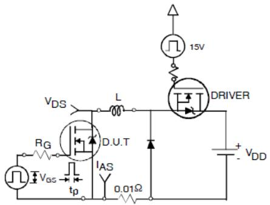

# IRFP4668PBF Datasheet (Markdown Extract)

> Source PDF: https://www.infineon.com/dgdl/Infineon-IRFP4668-DataSheet-v02_02-EN.pdf?fileId=5546d462533600a40153562c8528201d

<table><tr><td rowspan=1 colspan=1>VDsS</td><td rowspan=1 colspan=1>200V</td></tr><tr><td rowspan=1 colspan=1>RDs(on) typ.</td><td rowspan=1 colspan=1>8.0mΩ</td></tr><tr><td rowspan=1 colspan=1>max.</td><td rowspan=1 colspan=1>9.7mΩ</td></tr><tr><td rowspan=1 colspan=1>ID</td><td rowspan=1 colspan=1>130A</td></tr></table>

# Applications

• High Efficiency Synchronous Rectification in SMPS   
• Uninterruptible Power Supply   
• High Speed Power Switching   
• Hard Switched and High Frequency Circuits

# Benefits

• Improved Gate, Avalanche and Dynamic dV/dt Ruggedness   
• Fully Characterized Capacitance and Avalanche SOA   
• Enhanced body diode dV/dt and dI/dt Capability   
• Lead-Free

<table><tr><td rowspan=2 colspan=1>Base Part Number</td><td rowspan=2 colspan=1>Package Type</td><td rowspan=1 colspan=2>Standard Pack</td><td rowspan=2 colspan=1>Orderable Part Number</td></tr><tr><td rowspan=1 colspan=1>Form</td><td rowspan=1 colspan=1>Quantity</td></tr><tr><td rowspan=1 colspan=1>IRFP4668PbF</td><td rowspan=1 colspan=1>TO-247AC</td><td rowspan=1 colspan=1>Tube</td><td rowspan=1 colspan=1>25</td><td rowspan=1 colspan=1>IRFP4668PbF</td></tr></table>

Absolute Maximum Ratings   

<table><tr><td rowspan=1 colspan=1>Symbol</td><td rowspan=1 colspan=1>Parameter</td><td rowspan=1 colspan=1>Max.</td><td rowspan=1 colspan=1>Units</td></tr><tr><td rowspan=1 colspan=1>ID @ Tc = 25°C</td><td rowspan=1 colspan=1>Continuous Drain Current, Vgs @ 10V</td><td rowspan=1 colspan=1>130</td><td rowspan=3 colspan=1>A</td></tr><tr><td rowspan=1 colspan=1>ID @ Tc = 100°C</td><td rowspan=1 colspan=1>Continuous Drain Current, Vgs @ 10V</td><td rowspan=1 colspan=1>92</td><td rowspan=1 colspan=1></td></tr><tr><td rowspan=1 colspan=1>IDM</td><td rowspan=1 colspan=1>Pulsed Drain Current</td><td rowspan=1 colspan=1>520</td></tr><tr><td rowspan=1 colspan=1>PD @Tc = 25°C</td><td rowspan=1 colspan=1>Maximum Power Dissipation</td><td rowspan=1 colspan=1>520</td><td rowspan=1 colspan=1>W</td></tr><tr><td rowspan=1 colspan=1></td><td rowspan=1 colspan=1>Linear Derating Factor</td><td rowspan=1 colspan=1>3.5</td><td rowspan=1 colspan=1>W/C</td></tr><tr><td rowspan=1 colspan=1>VGs</td><td rowspan=1 colspan=1>Gate-to-Source Voltage</td><td rowspan=1 colspan=1>± 30</td><td rowspan=1 colspan=1>V</td></tr><tr><td rowspan=1 colspan=1>dv/dt</td><td rowspan=1 colspan=1>Peak Diode Recovery </td><td rowspan=1 colspan=1>57</td><td rowspan=1 colspan=1>V/ns</td></tr><tr><td rowspan=1 colspan=1>TJTsTG</td><td rowspan=1 colspan=1>Operating Junction andStorage Temperature Range</td><td rowspan=1 colspan=1>-55 to + 175</td><td rowspan=2 colspan=1>C</td></tr><tr><td rowspan=1 colspan=1></td><td rowspan=1 colspan=1>Soldering Temperature, for 10 seconds(1.6mm from case)</td><td rowspan=1 colspan=1>300</td></tr><tr><td rowspan=1 colspan=1></td><td rowspan=1 colspan=1>Mounting torque, 6-32 or M3 screw</td><td rowspan=1 colspan=1>10lbf.in (1.1N.m)</td><td rowspan=1 colspan=1></td></tr></table>

# Avalanche Characteristics

<table><tr><td rowspan=1 colspan=1>EAs (Thermally limited)</td><td rowspan=1 colspan=1>Single Pulse Avalanche Energy </td><td rowspan=1 colspan=1>760</td><td rowspan=1 colspan=1>mJ</td></tr><tr><td rowspan=1 colspan=1>|AR</td><td rowspan=1 colspan=1>Avalanche Current</td><td rowspan=2 colspan=1>See Fig. 14, 15, 22a, 22b</td><td rowspan=1 colspan=1>A</td></tr><tr><td rowspan=1 colspan=1>EAR</td><td rowspan=1 colspan=1>Repetitive Avalanche Energy</td><td rowspan=1 colspan=1>mJ</td></tr></table>

Thermal Resistance   

<table><tr><td rowspan=1 colspan=1>Symbol</td><td rowspan=1 colspan=1>Parameter</td><td rowspan=1 colspan=1>Typ.</td><td rowspan=1 colspan=1>Max.</td><td rowspan=1 colspan=1>Units</td></tr><tr><td rowspan=1 colspan=1>RθJc</td><td rowspan=1 colspan=1>Junction-to-Case</td><td rowspan=1 colspan=1></td><td rowspan=1 colspan=1>0.29</td><td rowspan=3 colspan=1>C/W</td></tr><tr><td rowspan=1 colspan=1>Rθcs</td><td rowspan=1 colspan=1>Case-to-Sink, Flat Greased Surface</td><td rowspan=1 colspan=1>0.24</td><td rowspan=1 colspan=1></td></tr><tr><td rowspan=1 colspan=1>RoJA</td><td rowspan=1 colspan=1>Junction-to-Ambient②⑧</td><td rowspan=1 colspan=1></td><td rowspan=1 colspan=1>40</td></tr></table>

Static $\textcircled { \bullet } \mathsf { T } _ { \mathsf { J } } = 2 5 ^ { \circ } \mathsf { C }$ (unless otherwise specified)   
Dynamic $\textcircled { \sc 1 } \mathsf { T } _ { \mathsf { J } } = 2 5 ^ { \circ } \mathsf { C }$ (unless otherwise specified)   

<table><tr><td rowspan=1 colspan=1>Symbol</td><td rowspan=1 colspan=1>Parameter</td><td rowspan=1 colspan=1>Min.</td><td rowspan=1 colspan=1>Typ.</td><td rowspan=1 colspan=1>Max.</td><td rowspan=1 colspan=1>Units</td><td rowspan=1 colspan=1>Conditions</td></tr><tr><td rowspan=1 colspan=1>V(BR)DSS</td><td rowspan=1 colspan=1>Drain-to-Source Breakdown Voltage</td><td rowspan=1 colspan=1>200</td><td rowspan=1 colspan=1>—</td><td rowspan=1 colspan=1>—</td><td rowspan=1 colspan=1>V</td><td rowspan=1 colspan=1>VGs = 0V, ID = 250μA</td></tr><tr><td rowspan=1 colspan=1>ΔV(BR)Ss/ΔTJ</td><td rowspan=1 colspan=1>Breakdown Voltage Temp. Coefficient</td><td rowspan=1 colspan=1></td><td rowspan=1 colspan=1>0.21</td><td rowspan=1 colspan=1></td><td rowspan=1 colspan=1>V/</td><td rowspan=1 colspan=1>Reference to 25°C, ID = 5mA①</td></tr><tr><td rowspan=1 colspan=1>RDS(on)</td><td rowspan=1 colspan=1>Static Drain-to-Source On-Resistance</td><td rowspan=1 colspan=1></td><td rowspan=1 colspan=1>8.0</td><td rowspan=1 colspan=1>9.7</td><td rowspan=1 colspan=1>mΩ</td><td rowspan=1 colspan=1>VGs = 10V, ID = 81A ④</td></tr><tr><td rowspan=1 colspan=1>VGs(th)</td><td rowspan=1 colspan=1>Gate Threshold Voltage</td><td rowspan=1 colspan=1>3.0</td><td rowspan=1 colspan=1>—</td><td rowspan=1 colspan=1>5.0</td><td rowspan=1 colspan=1>V</td><td rowspan=1 colspan=1>VDs = Vgs, ID = 250μA</td></tr><tr><td rowspan=2 colspan=1>|Dss</td><td rowspan=2 colspan=1>Drain-to-Source Leakage Current</td><td rowspan=1 colspan=1></td><td rowspan=1 colspan=1>—</td><td rowspan=1 colspan=1>20</td><td rowspan=1 colspan=1>μA</td><td rowspan=1 colspan=1>VDs = 200V, Vgs = 0V</td></tr><tr><td rowspan=1 colspan=1></td><td rowspan=1 colspan=1>—</td><td rowspan=1 colspan=1>250</td><td rowspan=1 colspan=1></td><td rowspan=1 colspan=1>VDs = 200V, VGs = 0V, TJ = 125°C</td></tr><tr><td rowspan=2 colspan=1>IGss</td><td rowspan=1 colspan=1>Gate-to-Source Forward Leakage</td><td rowspan=1 colspan=1>—</td><td rowspan=1 colspan=1></td><td rowspan=1 colspan=1>100</td><td rowspan=1 colspan=1>nA</td><td rowspan=1 colspan=1>VGs = 20V</td></tr><tr><td rowspan=1 colspan=1>Gate-to-Source Reverse Leakage</td><td rowspan=1 colspan=1>—</td><td rowspan=1 colspan=1>—</td><td rowspan=1 colspan=1>-100</td><td rowspan=1 colspan=1></td><td rowspan=1 colspan=1>VGs =-20V</td></tr><tr><td rowspan=1 colspan=1>RG</td><td rowspan=1 colspan=1>Internal Gate Resistance</td><td rowspan=1 colspan=1></td><td rowspan=1 colspan=1>1.0</td><td rowspan=1 colspan=1>—</td><td rowspan=1 colspan=1>Ω</td><td rowspan=1 colspan=1></td></tr></table>

Diode Characteristics   

<table><tr><td rowspan=1 colspan=1>Symbol</td><td rowspan=1 colspan=1>Parameter</td><td rowspan=1 colspan=1>Min.</td><td rowspan=1 colspan=1>Typ.</td><td rowspan=1 colspan=1>Max.</td><td rowspan=1 colspan=3>Units</td><td rowspan=1 colspan=1>Conditions</td></tr><tr><td rowspan=1 colspan=1>gfs</td><td rowspan=1 colspan=1>Forward Transconductance</td><td rowspan=1 colspan=1>150</td><td rowspan=1 colspan=1>—</td><td rowspan=1 colspan=1>—</td><td rowspan=1 colspan=3>S</td><td rowspan=1 colspan=1>VDs = 50V, ID = 81A</td></tr><tr><td rowspan=1 colspan=1>Qg</td><td rowspan=1 colspan=1>Total Gate Charge</td><td rowspan=1 colspan=1>—</td><td rowspan=1 colspan=1>161</td><td rowspan=1 colspan=1>241</td><td rowspan=1 colspan=3></td><td rowspan=5 colspan=1>|D = 81AVDs =100VVGs = 10V ④</td></tr><tr><td rowspan=3 colspan=1>Qgs</td><td rowspan=3 colspan=1>Gate-to-Source Charge</td><td rowspan=3 colspan=1></td><td rowspan=3 colspan=1>54</td><td rowspan=3 colspan=1>—</td><td rowspan=3 colspan=1></td><td></td><td></td></tr><tr><td rowspan=2 colspan=2>nc</td><td></td></tr><tr><td rowspan=1 colspan=1></td><td></td></tr><tr><td rowspan=1 colspan=1>Qgd</td><td rowspan=1 colspan=1>Gate-to-Drain (&quot;Miller&quot;) Charge</td><td rowspan=1 colspan=1></td><td rowspan=1 colspan=1>52</td><td rowspan=1 colspan=1>—</td><td rowspan=1 colspan=3></td></tr><tr><td rowspan=1 colspan=1>Qsync</td><td rowspan=1 colspan=1>Total Gate Charge Sync. (Qg - Qgd)</td><td rowspan=1 colspan=1></td><td rowspan=1 colspan=1>109</td><td rowspan=1 colspan=1>—</td><td rowspan=1 colspan=3></td><td rowspan=1 colspan=1>|D = 81A, VDs =0V, VGs = 10V</td></tr><tr><td rowspan=1 colspan=1>td(on)</td><td rowspan=1 colspan=1>Turn-On Delay Time</td><td rowspan=1 colspan=1></td><td rowspan=1 colspan=1>41</td><td rowspan=1 colspan=1>—</td><td rowspan=1 colspan=3></td><td rowspan=4 colspan=1>VDD = 130V|D = 81ARG = 2.7ΩVGs = 10V ④</td></tr><tr><td rowspan=1 colspan=1>tr</td><td rowspan=1 colspan=1>Rise Time</td><td rowspan=1 colspan=1></td><td rowspan=1 colspan=1>105</td><td rowspan=1 colspan=1>—</td><td rowspan=1 colspan=3>ns</td></tr><tr><td rowspan=1 colspan=1>ta(off)</td><td rowspan=1 colspan=1>Turn-Off Delay Time</td><td rowspan=1 colspan=1></td><td rowspan=1 colspan=1>64</td><td rowspan=1 colspan=1>—</td><td rowspan=1 colspan=3>ns</td></tr><tr><td rowspan=1 colspan=1>tf</td><td rowspan=1 colspan=1>Fall Time</td><td rowspan=1 colspan=1></td><td rowspan=1 colspan=1>74</td><td rowspan=1 colspan=1></td><td rowspan=1 colspan=3></td></tr><tr><td rowspan=1 colspan=1>Ciss</td><td rowspan=1 colspan=1>Input Capacitance</td><td rowspan=1 colspan=1></td><td rowspan=1 colspan=1>10720</td><td rowspan=1 colspan=1>—</td><td rowspan=3 colspan=3></td><td rowspan=3 colspan=1>VGs = 0VVDs = 50Vf = 1.0 MHz, See Fig. 5</td></tr><tr><td rowspan=1 colspan=1>Coss</td><td rowspan=1 colspan=1>Output Capacitance</td><td rowspan=1 colspan=1></td><td rowspan=1 colspan=1>810</td><td rowspan=1 colspan=1>—</td></tr><tr><td rowspan=1 colspan=1>Crss</td><td rowspan=1 colspan=1>Reverse Transfer Capacitance</td><td rowspan=1 colspan=1></td><td rowspan=1 colspan=1>160</td><td rowspan=1 colspan=1>—</td><td rowspan=1 colspan=2></td></tr><tr><td rowspan=1 colspan=1>Coss eff. (ER)</td><td rowspan=1 colspan=1>Effective Output Capacitance(Energy Related)</td><td rowspan=1 colspan=1></td><td rowspan=1 colspan=1>630</td><td rowspan=1 colspan=1></td><td rowspan=2 colspan=3>pF</td><td rowspan=1 colspan=1>VGs = 0V, VDs = 0V to 160V ⑥</td></tr><tr><td rowspan=1 colspan=1>Coss eff. (TR)</td><td rowspan=1 colspan=1>Effective Output Capacitance(Time Related)</td><td rowspan=1 colspan=1></td><td rowspan=1 colspan=1>790</td><td rowspan=1 colspan=1></td><td rowspan=1 colspan=1>VGs = 0V, VDs = 0V to 160V </td></tr></table>

<table><tr><td rowspan=1 colspan=1>Symbol</td><td rowspan=1 colspan=1>Parameter</td><td rowspan=1 colspan=1>Min.</td><td rowspan=1 colspan=1>Typ.</td><td rowspan=1 colspan=1>Max.</td><td rowspan=1 colspan=2>Units</td><td rowspan=1 colspan=1>Conditions</td></tr><tr><td rowspan=1 colspan=1>Is</td><td rowspan=1 colspan=1>Continuous Source Current(Body Diode)</td><td rowspan=1 colspan=1></td><td rowspan=1 colspan=1></td><td rowspan=1 colspan=1>130</td><td rowspan=1 colspan=2>A</td><td rowspan=2 colspan=1>MOSFET symbolshowing the                   4lintegral reverse           Gp-n junction diode.                 |s</td></tr><tr><td rowspan=1 colspan=1>IsM</td><td rowspan=1 colspan=1>Pulsed Source Current(Body Diode)</td><td rowspan=1 colspan=1></td><td rowspan=1 colspan=1></td><td rowspan=1 colspan=1>520</td><td rowspan=1 colspan=2>A</td></tr><tr><td rowspan=1 colspan=1>VsD</td><td rowspan=1 colspan=1>Diode Forward Voltage</td><td rowspan=1 colspan=1>—</td><td rowspan=1 colspan=1>—</td><td rowspan=1 colspan=1>1.3</td><td rowspan=1 colspan=2>V</td><td rowspan=1 colspan=1>Tj = 25°C, Is = 81A, VGs = 0V ④</td></tr><tr><td rowspan=2 colspan=1>trr</td><td rowspan=2 colspan=1>Reverse Recovery Time</td><td rowspan=1 colspan=1>—</td><td rowspan=1 colspan=1>130</td><td rowspan=1 colspan=1>—</td><td rowspan=1 colspan=2></td><td rowspan=5 colspan=1>Tj = 25°CVR = 100V,Tj = 125°CIF = 81ATj = 25°C         di/dt = 100A/μs ④Tj = 125°CTj =25°C</td></tr><tr><td rowspan=1 colspan=1>—</td><td rowspan=1 colspan=1>155</td><td rowspan=1 colspan=1>—</td><td rowspan=1 colspan=2>ns</td></tr><tr><td rowspan=2 colspan=1>Qrr</td><td rowspan=2 colspan=1>Reverse Recovery Charge</td><td rowspan=1 colspan=1>—</td><td rowspan=1 colspan=1>633</td><td rowspan=1 colspan=1>—</td><td rowspan=1 colspan=2>nC</td><td rowspan=1 colspan=1>−</td></tr><tr><td rowspan=1 colspan=1></td><td rowspan=1 colspan=1>944</td><td rowspan=1 colspan=1>—</td><td rowspan=1 colspan=2>nC</td><td rowspan=1 colspan=1>Tj = 125°C</td></tr><tr><td rowspan=1 colspan=1>IRRM</td><td rowspan=1 colspan=1>Reverse Recovery Current</td><td rowspan=1 colspan=1></td><td rowspan=1 colspan=1>8.7</td><td rowspan=1 colspan=1>—</td><td rowspan=1 colspan=2>A</td></tr><tr><td rowspan=1 colspan=1>ton</td><td rowspan=1 colspan=1>Forward Turn-On Time</td><td rowspan=1 colspan=6>ntriic turn-on time is negligible (turn-on is dominated by L+L</td></tr></table>

# Notes:

$\textcircled{1}$ Repetitive rating; pulse width limited by max. Junction temperature.   
$\textcircled{2}$ Limited by $\tau _ { \mathrm { J m a x } }$ , starting ${ \sf T } _ { \mathsf { J } } = 2 5 ^ { \circ } { \sf C }$ , $\mathsf { L } = 0 . 2 3 \mathsf { m H }$ , $\mathsf { R } _ { \mathsf { G } } = 2 5 \Omega$ , $\mathsf { I } _ { \mathsf { A S } } = 8 1 \mathsf { A }$ , $\mathsf { V } _ { \mathsf { G S } } = 1 0 \mathsf { V }$ . Part not recommended for use above this value.   
$\textcircled{3}$ $\mathsf { I } _ { \mathtt { S D } } \leq 8 1 \mathsf { A }$ , di/dt $\leq 5 2 0 \mathsf { A } / \mu \mathsf { s }$ , $\mathsf { V } _ { \mathsf { D } \mathsf { D } } \leq \mathsf { V } _ { ( \mathsf { B R } ) \mathsf { D } \mathsf { S } \mathsf { S } }$ , $\mathsf { T } _ { \mathsf { J } } \leq 1 7 5 ^ { \circ } \mathsf { C }$ .   
$\textcircled{4}$ Pulse width $\leq 4 0 0 \mu \mathsf { s }$ ; duty cycle $\leq 2 \%$ .   
$\textcircled{5}$ Coss eff. (TR) is a fixed capacitance that gives the same charging time as Coss while $\mathsf { V } _ { \mathsf { D } \mathsf { S } }$ is rising from 0 to $80 \%$ VDSS.   
$\textcircled{6}$ Coss eff. (ER) is a fixed capacitance that gives the same energy as Coss while $\mathsf { V } _ { \mathsf { D } \mathsf { S } }$ is rising from 0 to $80 \%$ VDSS.   
$\textcircled{7}$ When mounted on 1" square PCB (FR-4 or $_ { \mathsf { G } - 1 0 }$ Material). For recommended footprint and soldering techniques.   
$\textcircled{8}$ $\mathsf { R } _ { \Theta }$ is measured at ${ \mathsf T } _ { \mathsf J }$ approximately $9 0 ^ { \circ } \mathsf { C }$ .

  
Fig 1. Typical Output Characteristics

  
Fig 3. Typical Transfer Characteristics

  
Fig 5. Typical Capacitance vs. Drain-to-Source Voltage

  
Fig 2. Typical Output Characteristics

  
Fig 4. Normalized On-Resistance vs. Temperature

  
Fig 6. Typical Gate Charge vs. Gate-to-Source Voltage

  
Fig 7. Typical Source-to-Drain Diode Forward Voltage

  
Fig 9. Maximum Drain Current vs. Case Temperature

  
Fig 11. Typical Coss Stored Energy

  
Fig 8. Maximum Safe Operating Area

  
Fig 10. Drain-to-Source Breakdown Voltage

  
Fig 12. Maximum Avalanche Energy vs. Drain Current

  
Fig 13. Maximum Effective Transient Thermal Impedance, Junction-to-Case

  
Fig 14. Typical Avalanche Current vs. Pulsewidth

  
Fig 15. Maximum Avalanche Energy vs. Temperature

# Notes on Repetitive Avalanche Curves , Figures 14, 15: (For further info, see AN-1005 at www.irf.com)

1. Avalanche failures assumption: Purely a thermal phenomenon and failure occurs at a temperature far in excess of Tjmax. This is validated for every part type.   
2. Safe operation in Avalanche is allowed as long as Tjmax is not exceeded.   
3. Equation below based on circuit and waveforms shown in Figures   
16a, 16b.   
4. $\mathsf { P } _ { \mathsf { D } ( \mathsf { a v e } ) } =$ Average power dissipation per single avalanche pulse.   
5. $\mathsf { B V } =$ Rated breakdown voltage (1.3 factor accounts for voltage increase during avalanche).   
6. $\mathsf { I } _ { \mathsf { a v } } =$ Allowable avalanche current.   
7. $\Delta \mathsf { T } =$ Allowable rise in junction temperature, not to exceed Tjmax (assumed as $\boldsymbol { 2 5 ^ { \circ } \mathrm { C } }$ in Figure 14, 15). $\mathfrak { t } _ { \mathfrak { a v } } =$ Average time in avalanche. $\mathsf { D } =$ Duty cycle in avalanche $=$ tav ·f $Z _ { \mathrm { t h J C } } ( \mathsf { D } , \mathsf { \bar { t } _ { a v } } ) =$ Transient thermal resistance, see Figures 13)

$$
\begin{array} { r l } & { \mathsf { P } _ { \mathsf { D } ( \mathsf { a v e } ) } = 1 / 2 ( \mathbf { \nabla } 1 . 3 { \cdot } \mathsf { B V } { \cdot } \mathsf { I } _ { \mathsf { a v } } ) = \Delta \mathsf { T } / \mathsf { Z } _ { \mathsf { t h , J C } } } \\ & { \qquad \mathsf { I } _ { \mathsf { a v } } = 2 \Delta \mathsf { T } / \left[ \mathsf { 1 } . 3 { \cdot } \mathsf { B V } { \cdot } \mathsf { Z } _ { \mathsf { t h } } \right] } \\ & { \qquad \mathsf { E } _ { \mathsf { A S } ( \mathsf { A R } ) } = \mathsf { P } _ { \mathsf { D } ( \mathsf { a v e } ) } { \cdot } \mathsf { I } _ { \mathsf { a v } } } \end{array}
$$

  
Fig. 16 Threshold Voltage vs. Temperature

  
Fig 18. Typical Recovery Current vs. dif/dt

  
Fig. 17 Typical Recovery Current vs. dif/dt

  
Fig 19. Typical Stored Charge vs. dif/dt

  
Fig 20. Typical Stored Charge vs. dif/dt

  
Fig 21. Peak Diode Recovery dv/dt Test Circuit for N-Channel HEXFET $\textsuperscript { \textregistered }$ Power MOSFETs

  
Fig 22a. Unclamped Inductive Test Circuit

  
Fig 22b. Unclamped Inductive Waveforms

  
Fig 23a. Switching Time Test Circuit

  
Fig 23b. Switching Time Waveforms

  
Fig 24a. Gate Charge Test Circuit

  
Fig 24b. Gate Charge Waveform

# TO-247AC Package Outline (Dimensions are

# TO-247AC Part Marking Information

NOTES:   
1. DIMENSIONING AND TOLERANCING AS PER ASME Y14.5M 1994.   
DIMENSIONS ARE SHOWN IN INCHES. CONTOUR OF SLOT OPTIONAL. DIMENSION D & E DO NOT INCLUDE MOLD FLASH. MOLD FLASH SHALL NOT EXCEED .005" (0.127) PER SIDE. THESE DIMENSIONS ARE MEASURED AT THE OUTERMOST EXTREMES OF THE PLASTIC BODY.   
THERMAL PAD CONTOUR OPTIONAL WITHIN DIMENSIONS D1 & E1. LEAD FINISH UNCONTROLLED IN L1. ØP TO HAVE A MAXIMUM DRAFT ANGLE OF 1.5 \* TO THE TOP OF THE PART WTH A MAXIMUM HOLE DIAMETER OF .154 INCH. 8. OUTLINE CONFORMS TO JEDEC OUTLINE TO-247AC .

LEAD ASSIGNMENTS

HEXFET   
1.- GATE   
2.- DRAIN   
3.- SOURCE   
4.- DRAIN

# IGBTs, CoPACK

1.- GATE   
2.- COLLECTOR   
3.- EMITTER   
4.- COLLECTOR

DIODES

1.- ANODE/OPEN   
2.- CATHODE   
3.- ANODE

<table><tr><td rowspan="3">SYMBOL</td><td colspan="4">DIMENSIONS</td><td rowspan="3">NOTES</td></tr><tr><td colspan="2">INCHES</td><td colspan="2">MILLIME TERS</td></tr><tr><td>MIN.</td><td>MAX.</td><td>MIN.</td><td>MAX.</td></tr><tr><td>A</td><td>.183</td><td>.209</td><td>4.65</td><td>5.31</td><td></td></tr><tr><td>A1</td><td>.087</td><td>.102</td><td>2.21</td><td>2.59</td><td></td></tr><tr><td>A2</td><td>.059</td><td>.098</td><td>1.50</td><td>2.49</td><td></td></tr><tr><td>b</td><td>.039</td><td>.055</td><td>0.99</td><td>1.40</td><td></td></tr><tr><td>b1</td><td>.039</td><td>.053</td><td>0.99</td><td>1.35</td><td></td></tr><tr><td>b2</td><td>.065</td><td>.094</td><td>1.65</td><td>2.39</td><td></td></tr><tr><td>b3</td><td>.065</td><td>.092</td><td>1.65</td><td>2.34</td><td></td></tr><tr><td>b4</td><td>.102</td><td>.135</td><td>2.59</td><td>3.43</td><td></td></tr><tr><td>b5</td><td>.102</td><td>.133</td><td>2.59</td><td>3.38</td><td></td></tr><tr><td>c</td><td>.015</td><td>.035</td><td>0.38</td><td>0.89</td><td></td></tr><tr><td>c1</td><td>.015</td><td>.033</td><td>0.38</td><td>0.84</td><td></td></tr><tr><td>D</td><td>.776</td><td>.815</td><td>19.71</td><td>20.70</td><td>45</td></tr><tr><td>D1</td><td>.515</td><td>-</td><td>13.08</td><td></td><td></td></tr><tr><td>D2</td><td>.020</td><td>.053</td><td>0.51</td><td>1.35</td><td></td></tr><tr><td>E</td><td>.602</td><td>.625</td><td>15.29</td><td>15.87</td><td>4</td></tr><tr><td>E1 E2</td><td>.530</td><td>-</td><td>13.46</td><td>-</td><td></td></tr><tr><td>e</td><td>.178</td><td>.216</td><td>4.52</td><td>5.49</td><td></td></tr><tr><td>øk L</td><td colspan="2">.215 BSC</td><td colspan="2">5.46 BSC</td><td></td></tr><tr><td rowspan="8">L1 øP 0P1</td><td colspan="2">.010</td><td colspan="2">0.25</td><td></td></tr><tr><td colspan="2">.559 .634</td><td>14.20</td><td>16.10</td><td></td></tr><tr><td>.146</td><td>.169</td><td>3.71</td><td>4.29</td><td></td></tr><tr><td>.140</td><td>.144</td><td>3.56</td><td>3.66</td><td></td></tr><tr><td></td><td>.291</td><td></td><td>7.39</td><td></td></tr><tr><td>.209</td><td>.224</td><td>5.31</td><td>5.69</td><td></td></tr><tr><td></td><td>.217 BSC</td><td></td><td>5.51 BSC</td><td></td></tr><tr><td colspan="2">S</td><td></td><td></td><td></td><td></td></tr></table>

# Revision History

<table><tr><td>Date</td><td>Rev.</td><td>Comments</td></tr><tr><td>12/02/2021</td><td>2.1</td><td>Changed datasheet to Infineon format Corrected 10ms and 1ms labels of Fig.8_SOA curve Added disclaimer on last page.</td></tr><tr><td>10/30/2024</td><td>2.2</td><td>Updated Part marking -page 8</td></tr></table>

# Trademarks

All referenced product or service names and trademarks are the property of their respective owners.

# We Listen to Your Comments

Any information within this document that you feel is wrong, unclear or missing at all? Your feedback will help us to continuously improve the quality of this document. Please send your proposal (including a reference to this document) to: erratum@infineon.com

Published by   
Infineon Technologies AG   
81726 München, Germany   
$\textcircled{2} 2 0 2 4$ Infineon Technologies AG All Rights Reserved.

# Legal Disclaimer

The information given in this document shall in no event be regarded as a guarantee of conditions or characteristics

(“Beschaffenheitsgarantie”).

With respect to any examples, hints or any typical values stated herein and/or any information regarding the application of the product, Infineon Technologies hereby disclaims any and all warranties and liabilities of any kind, including without limitation warranties of non-infringement of intellectual property rights of any third party.

In addition, any information given in this document is subject to customer’s compliance with its obligations stated in this document and any applicable legal requirements, norms and standards concerning customer’s products and any use of the product of Infineon Technologies in customer’s applications.

The data contained in this document is exclusively intended for technically trained staff. It is the responsibility of customer’s technical departments to evaluate the suitability of the product for the intended application and the completeness of the product information given in this document with respect to such application.

# Information

For further information on the product, technology, delivery terms and conditions and prices please contact your nearest Infineon Technologies office (www.infineon.com).

# Warnings

Due to technical requirements products may contain dangerous substances. For information on the types in question please contact your nearest Infineon Technologies office.

The Infineon Technologies component described in this Data Sheet may be used in life support devices or systems and or automotive, aviation and aerospace applications or systems only with the express written approval of Infineon Technologies, if a failure of such components can reasonably be expected to cause the failure of that life support, automotive, aviation and aerospace device or system or to affect the safety or effectiveness of that device or system. Life support devices or systems are intended to be implanted in the human body or to support and/or maintain and sustain and/or protect human life. If they fail, it is reasonable to assume that the health of the user or other persons may be endangered.