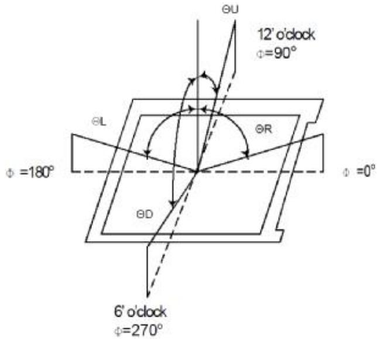
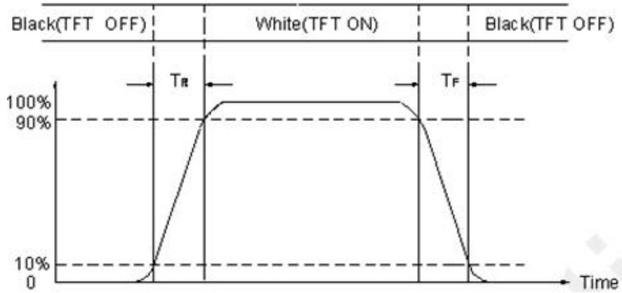
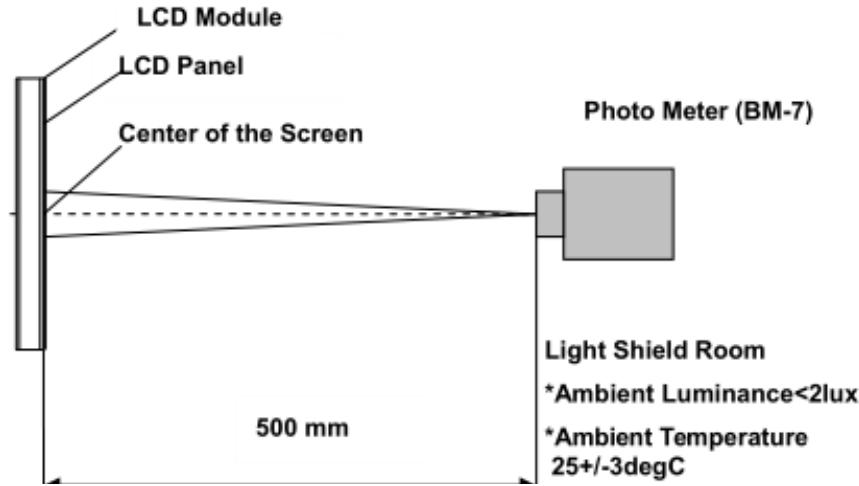
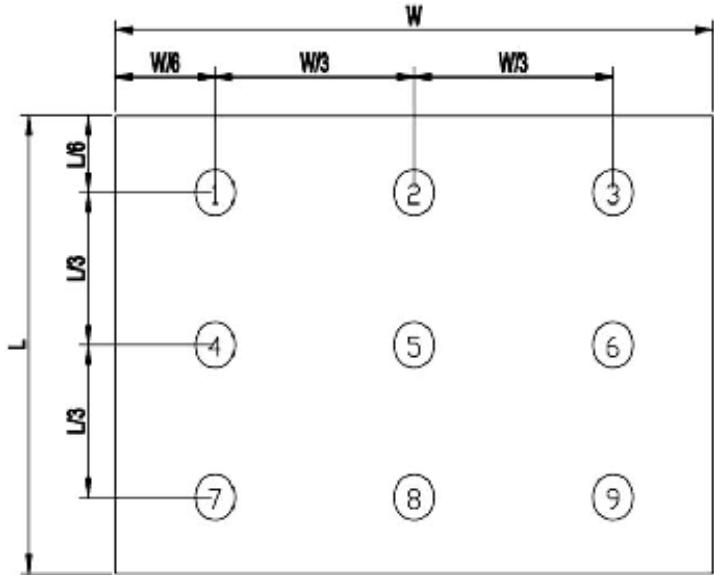
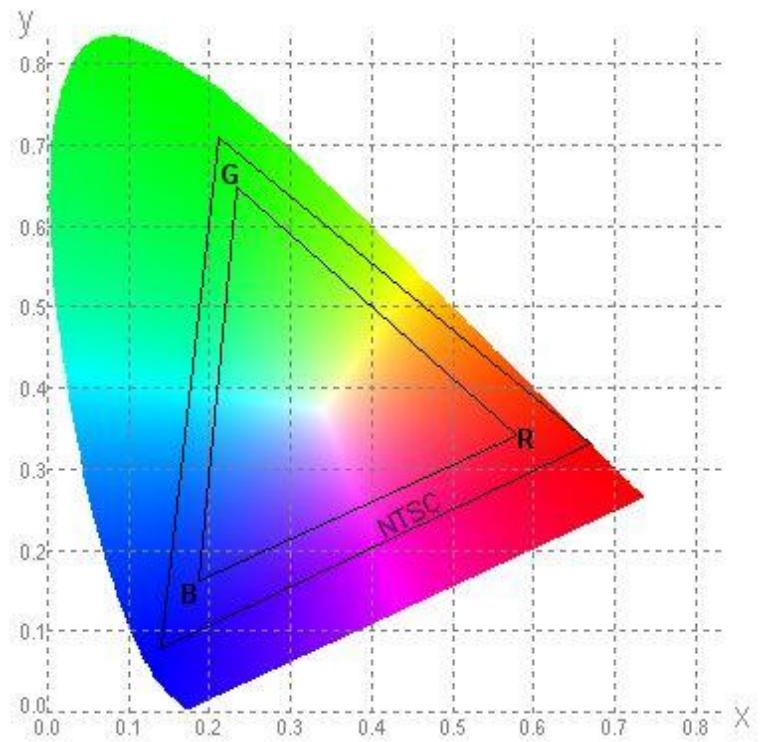
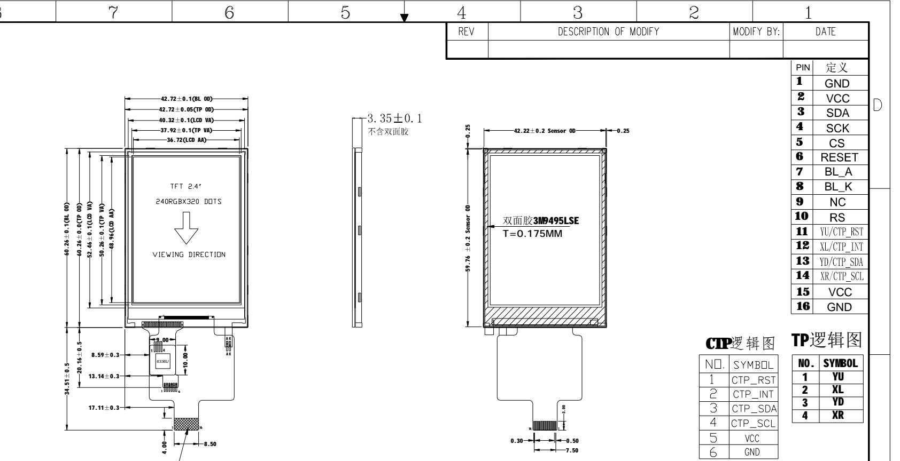

# P024C128-CTP Display Module Specification (Rev A)

<table><tr><td rowspan="2">Shenzhen P&amp;O Technology Co.,Limited</td><td>Rev No</td><td>Issued Date.</td><td>Page</td></tr><tr><td>A</td><td>2023.05.15</td><td>1/12</td></tr></table>

<table><tr><td rowspan=1 colspan=1>Project Size.</td><td rowspan=1 colspan=3>2.4 inch</td></tr><tr><td rowspan=1 colspan=1>Model No.</td><td rowspan=1 colspan=3>P024C128-CTP</td></tr><tr><td rowspan=1 colspan=1>Samples No.</td><td rowspan=1 colspan=3></td></tr><tr><td rowspan=1 colspan=1>Product type.</td><td rowspan=1 colspan=3>240xRGBx320SPI mode</td></tr><tr><td rowspan=1 colspan=4>Signature by customer:</td></tr><tr><td rowspan=1 colspan=2>Prepared</td><td rowspan=1 colspan=1>Checked</td><td rowspan=1 colspan=1>Approved</td></tr><tr><td rowspan=1 colspan=2></td><td rowspan=1 colspan=1></td><td rowspan=1 colspan=1></td></tr></table>

## Shenzhen P&O Technology Co., Limited

Email: polcd@polcd.com

Mobile: 86-136 0019 7172

## 1.0 General Description

<table><tr><td rowspan=1 colspan=1>Item</td><td rowspan=1 colspan=1>Specification</td><td rowspan=1 colspan=1>Unit</td></tr><tr><td rowspan=1 colspan=1>Screen Size</td><td rowspan=1 colspan=1>2.4 inch</td><td rowspan=1 colspan=1>Diagonal</td></tr><tr><td rowspan=1 colspan=1>Number of Pixel</td><td rowspan=1 colspan=1>240RGB(H)x320(V)</td><td rowspan=1 colspan=1>Pixels</td></tr><tr><td rowspan=1 colspan=1>Display area</td><td rowspan=1 colspan=1>36.72(H)x48.96(V)</td><td rowspan=1 colspan=1>mm</td></tr><tr><td rowspan=1 colspan=1>Pixel pitch</td><td rowspan=1 colspan=1>51(H)x153(V)</td><td rowspan=1 colspan=1>um</td></tr><tr><td rowspan=1 colspan=1>Outline Dimension</td><td rowspan=1 colspan=1>42.72x60.26x3.35</td><td rowspan=1 colspan=1>mm</td></tr><tr><td rowspan=1 colspan=1>Pixel arrangement</td><td rowspan=1 colspan=1>RGB Vertical Stripe</td><td rowspan=1 colspan=1> </td></tr><tr><td rowspan=1 colspan=1>Display mode</td><td rowspan=1 colspan=1>Normally White</td><td rowspan=1 colspan=1></td></tr><tr><td rowspan=1 colspan=1>Viewing Direction(eye)</td><td rowspan=1 colspan=1>12 0&#x27;CLOCK</td><td rowspan=1 colspan=1></td></tr><tr><td rowspan=1 colspan=1>Gray inversion direction</td><td rowspan=1 colspan=1>--</td><td rowspan=1 colspan=1></td></tr><tr><td rowspan=1 colspan=1>Display Color</td><td rowspan=1 colspan=1>262K</td><td rowspan=1 colspan=1></td></tr><tr><td rowspan=1 colspan=1>Luminance(cd/m^2)</td><td rowspan=1 colspan=1>260</td><td rowspan=1 colspan=1>nit</td></tr><tr><td rowspan=1 colspan=1>Contrast Ratio</td><td rowspan=1 colspan=1>250:1</td><td rowspan=1 colspan=1></td></tr><tr><td rowspan=1 colspan=1>Surface treatment</td><td rowspan=1 colspan=1></td><td rowspan=1 colspan=1></td></tr><tr><td rowspan=1 colspan=1>Interface</td><td rowspan=1 colspan=1>4W SPI</td><td rowspan=1 colspan=1></td></tr><tr><td rowspan=1 colspan=1>Back-light</td><td rowspan=1 colspan=1>LED Side-light type</td><td rowspan=1 colspan=1></td></tr><tr><td rowspan=1 colspan=1>Drive IC</td><td rowspan=1 colspan=1>ST7789V</td><td rowspan=1 colspan=1></td></tr><tr><td rowspan=1 colspan=1>CTP IC</td><td rowspan=1 colspan=1>FT6336U</td><td rowspan=1 colspan=1></td></tr><tr><td rowspan=1 colspan=1>Operation Temperature</td><td rowspan=1 colspan=1>-20~70</td><td rowspan=1 colspan=1>C</td></tr><tr><td rowspan=1 colspan=1>StorageTemperature</td><td rowspan=1 colspan=1>-30~80</td><td rowspan=1 colspan=1>C</td></tr><tr><td rowspan=1 colspan=1>Weight</td><td rowspan=1 colspan=1> </td><td rowspan=1 colspan=1>g</td></tr></table>

## 1.1 Features

n 4W SPI interface.

## 1.2 Applications

n MPOS Device.   
n Personal Navigation Device.   
n Other devices which require high quality displays.

## 2.0 Input Interface Pin Assignment

FPC connector is used for electronics interface.

<table><tr><td rowspan=1 colspan=1>PinNo.</td><td rowspan=1 colspan=1>Symbol</td><td rowspan=1 colspan=1>Function</td></tr><tr><td rowspan=1 colspan=1>1</td><td rowspan=1 colspan=1>GND</td><td rowspan=1 colspan=1>Ground</td></tr><tr><td rowspan=1 colspan=1>2</td><td rowspan=1 colspan=1>VCC</td><td rowspan=1 colspan=1>Power Supply. 2.8V</td></tr><tr><td rowspan=1 colspan=1>3</td><td rowspan=1 colspan=1>SDA</td><td rowspan=1 colspan=1>SPI interface input/output pin</td></tr><tr><td rowspan=1 colspan=1>4</td><td rowspan=1 colspan=1>SCK</td><td rowspan=1 colspan=1>Serial interface clock</td></tr><tr><td rowspan=1 colspan=1>5</td><td rowspan=1 colspan=1>CS</td><td rowspan=1 colspan=1>Chip select input pin</td></tr><tr><td rowspan=1 colspan=1>6</td><td rowspan=1 colspan=1>RESET</td><td rowspan=1 colspan=1>External reset input.</td></tr><tr><td rowspan=1 colspan=1>7</td><td rowspan=1 colspan=1>BL_A</td><td rowspan=1 colspan=1>LED back light(Anode)</td></tr><tr><td rowspan=1 colspan=1>8</td><td rowspan=1 colspan=1>BL_K</td><td rowspan=1 colspan=1>LED back light(Cathode)</td></tr><tr><td rowspan=1 colspan=1>9</td><td rowspan=1 colspan=1>NC</td><td rowspan=1 colspan=1>NC</td></tr><tr><td rowspan=1 colspan=1>10</td><td rowspan=1 colspan=1>RS</td><td rowspan=1 colspan=1>Display data/command selection pin in parallel</td></tr><tr><td rowspan=1 colspan=1>11</td><td rowspan=1 colspan=1>YU/CTP_RST</td><td rowspan=1 colspan=1>Touch the upper circuitCTP screen reset</td></tr><tr><td rowspan=1 colspan=1>12</td><td rowspan=1 colspan=1>XL/CTP_INT</td><td rowspan=1 colspan=1>Touch the left lineCTP screen interrupt signal</td></tr><tr><td rowspan=1 colspan=1>13</td><td rowspan=1 colspan=1>YD/CTP_SDA</td><td rowspan=1 colspan=1>Touch the lower lineCTP screen data signal</td></tr><tr><td rowspan=1 colspan=1>14</td><td rowspan=1 colspan=1>XR/CTP_SCL</td><td rowspan=1 colspan=1>Touch the right end lineCTP screen clock signal</td></tr><tr><td rowspan=1 colspan=1>15</td><td rowspan=1 colspan=1>vcc</td><td rowspan=1 colspan=1>Power Supply</td></tr><tr><td rowspan=1 colspan=1>16</td><td rowspan=1 colspan=1>GND</td><td rowspan=1 colspan=1>Ground</td></tr></table>

## 3.0 Optical Characteristics

### 3.1 Optical Specification

<table><tr><td rowspan=1 colspan=2>Item</td><td rowspan=1 colspan=1>Symbol</td><td rowspan=1 colspan=2>Condition</td><td rowspan=1 colspan=1>Min</td><td rowspan=1 colspan=1>Type</td><td rowspan=1 colspan=1>Max</td><td rowspan=1 colspan=1>Unit</td><td rowspan=1 colspan=1>Note</td></tr><tr><td rowspan=1 colspan=2>White luminance(Center)</td><td rowspan=1 colspan=1>Lv</td><td rowspan=2 colspan=2>0=0Normal</td><td rowspan=1 colspan=1>--</td><td rowspan=1 colspan=1>260</td><td rowspan=1 colspan=1>--</td><td rowspan=1 colspan=1>cd/m{2</td><td rowspan=1 colspan=1>(4)(5)(7)</td></tr><tr><td rowspan=1 colspan=2>Response time</td><td rowspan=1 colspan=1>Tr+Tf</td><td rowspan=1 colspan=1>--</td><td rowspan=1 colspan=1>30</td><td rowspan=1 colspan=1></td><td rowspan=1 colspan=1>ms</td><td rowspan=1 colspan=1>(3)</td></tr><tr><td rowspan=1 colspan=2>Contrast ratio</td><td rowspan=1 colspan=1>CR</td><td rowspan=1 colspan=2>Viewing</td><td rowspan=1 colspan=1>--</td><td rowspan=1 colspan=1>250</td><td rowspan=1 colspan=1>--</td><td rowspan=1 colspan=1>--</td><td rowspan=1 colspan=1>(2)(4)</td></tr><tr><td rowspan=2 colspan=1>ColorChromaticity(CIE1931)</td><td rowspan=2 colspan=1>white</td><td rowspan=1 colspan=1>Wx</td><td rowspan=2 colspan=2>AngleIBL=80mA</td><td rowspan=1 colspan=1></td><td rowspan=1 colspan=1>0.288</td><td rowspan=1 colspan=1>0.308</td><td rowspan=1 colspan=1>0.328</td><td rowspan=2 colspan=1></td></tr><tr><td rowspan=1 colspan=1>Wy</td><td rowspan=1 colspan=1>0.305</td><td rowspan=1 colspan=1>0.325</td><td rowspan=1 colspan=1>0.345</td><td></td></tr><tr><td rowspan=4 colspan=1>Viewing Angle</td><td rowspan=2 colspan=1>Hor</td><td rowspan=1 colspan=1>OL</td><td rowspan=4 colspan=2>CR>=10</td><td rowspan=1 colspan=1>--</td><td rowspan=1 colspan=1>45</td><td rowspan=1 colspan=1>--</td><td rowspan=4 colspan=1></td><td rowspan=4 colspan=1>(1)</td></tr><tr><td rowspan=1 colspan=1>OR</td><td rowspan=1 colspan=1>--</td><td rowspan=1 colspan=1>45</td><td rowspan=1 colspan=1>:</td></tr><tr><td rowspan=2 colspan=1>Ver</td><td rowspan=1 colspan=1>OU</td><td rowspan=1 colspan=1>--</td><td rowspan=1 colspan=1>45</td><td rowspan=1 colspan=1>--</td></tr><tr><td rowspan=1 colspan=1>0D</td><td rowspan=1 colspan=1>--</td><td rowspan=1 colspan=1>20</td><td rowspan=1 colspan=1>--</td></tr><tr><td rowspan=1 colspan=2>Brightness uniformity</td><td rowspan=1 colspan=1>Avg</td><td rowspan=1 colspan=2>Q=0</td><td rowspan=1 colspan=1>80</td><td rowspan=1 colspan=1>90</td><td rowspan=1 colspan=1></td><td rowspan=1 colspan=1>%</td><td rowspan=1 colspan=1>(5)</td></tr><tr><td rowspan=1 colspan=2>Color Gamut</td><td rowspan=1 colspan=1>NTSC</td><td rowspan=1 colspan=2>0=0</td><td rowspan=1 colspan=1>--</td><td rowspan=1 colspan=1>56</td><td rowspan=1 colspan=1>--</td><td rowspan=1 colspan=1>%</td><td rowspan=1 colspan=1>(6)</td></tr><tr><td rowspan=1 colspan=2>Optima View Direction</td><td rowspan=1 colspan=7>12 0&#x27;CLOCK</td><td rowspan=1 colspan=1>(1)</td></tr></table>

### 3.2 Measuring Condition

n Measuring surrounding: dark room n LED current IL: 80mA n Ambient temperature: $2 5 { \pm } 2 \mathrm { \bar { C } }$ n 15min. warm-up time

### 3.3 Measuring Equipment

n BM-7n Measuring spot size:20 \~ 21 mm

# Note (1) Definition of Viewing Angle

### Note (2) Definition of Contrast Ratio (CR) Definition of Contrast Ratio(CR): Measured at the center point of panel

Note (3) Definition of Response Time: Sum of TR and TF

Note (4) Definition of optical measurement setup

<table><tr><td rowspan="2">Shenzhen P&amp;O Technology Co.,Limited</td><td>Rev No</td><td>Issued Date.</td><td>Page</td></tr><tr><td>A</td><td>2023.05.15</td><td>6/12</td></tr></table>

Note (5) Definition of brightness uniformity The luminance uniformity is calculated by using following formula. $\triangle \mathsf { B p } = \mathsf { B p } \left( \mathsf { M i n . } \right) / \mathsf { B p } \left( \mathsf { M a x . } \right) \times 1 0 0 \left( \% \right)$ Bp (Max.) $=$ Maximum brightness in 9 measured spots Bp (Min.) $=$ Minimum brightness in 9 measured spots .

Note (6) Definition of Color of CIE1931 Coordinate and NTSC Ratio. Color gamut:

Area of RGB triangle S = x 100% Area of NTSC triangle

Note (7) Measured the luminance of white state at center point.

## 4.0 Electrical Characteristics

### 4.1 TFT LCD Module Specifications

<table><tr><td rowspan=1 colspan=1>Item</td><td rowspan=1 colspan=1>Symbol</td><td rowspan=1 colspan=1>Min.</td><td rowspan=1 colspan=1>Typ.</td><td rowspan=1 colspan=1>Max.</td><td rowspan=1 colspan=1>Unit</td><td rowspan=1 colspan=1>Remark</td></tr><tr><td rowspan=1 colspan=1>Analog supply voltage</td><td rowspan=1 colspan=1>VDD</td><td rowspan=1 colspan=1>2.4</td><td rowspan=1 colspan=1>2.8</td><td rowspan=1 colspan=1>3.3</td><td rowspan=1 colspan=1>V</td><td rowspan=1 colspan=1></td></tr><tr><td rowspan=1 colspan=1>Digital supply voltage</td><td rowspan=1 colspan=1>VDDI</td><td rowspan=1 colspan=1>1.65</td><td rowspan=1 colspan=1>1.8</td><td rowspan=1 colspan=1>3.3</td><td rowspan=1 colspan=1></td><td rowspan=1 colspan=1></td></tr><tr><td rowspan=2 colspan=1>Input signal Voltage</td><td rowspan=1 colspan=1>VIH</td><td rowspan=1 colspan=1>0.7VDDI</td><td rowspan=1 colspan=1>-</td><td rowspan=1 colspan=1>VDDI</td><td rowspan=1 colspan=1>V</td><td rowspan=1 colspan=1></td></tr><tr><td rowspan=1 colspan=1>VIL</td><td rowspan=1 colspan=1>GND</td><td rowspan=1 colspan=1>-</td><td rowspan=1 colspan=1>0.3VDDI</td><td rowspan=1 colspan=1>V</td><td rowspan=1 colspan=1></td></tr></table>

### 4.2 Back-Light Unit

The backlight system is an edge-lighting type with 4 LED Dies.   
The characteristics of the LED are shown in the following tables.

<table><tr><td rowspan=1 colspan=1>Item</td><td rowspan=1 colspan=1>Symbol</td><td rowspan=1 colspan=1>Min</td><td rowspan=1 colspan=1>Typ</td><td rowspan=1 colspan=1>Max</td><td rowspan=1 colspan=1>Unit</td><td rowspan=1 colspan=1>Note</td></tr><tr><td rowspan=1 colspan=1>LED current</td><td rowspan=1 colspan=1>IL</td><td rowspan=1 colspan=1>-</td><td rowspan=1 colspan=1>60</td><td rowspan=1 colspan=1>80</td><td rowspan=1 colspan=1>mA</td><td rowspan=1 colspan=1>(2)</td></tr><tr><td rowspan=1 colspan=1>LED voltage</td><td rowspan=1 colspan=1>VL</td><td rowspan=1 colspan=1></td><td rowspan=1 colspan=1>2.8</td><td rowspan=1 colspan=1>3.2</td><td rowspan=1 colspan=1>V</td><td rowspan=1 colspan=1></td></tr><tr><td rowspan=1 colspan=1>Operating LED life time</td><td rowspan=1 colspan=1>Hr</td><td rowspan=1 colspan=1>-</td><td rowspan=1 colspan=1>20000</td><td rowspan=1 colspan=1>15000</td><td rowspan=1 colspan=1>Hour</td><td rowspan=1 colspan=1>(1)(2)</td></tr></table>

Note (1) LED life time $( \mathsf { H r } )$ can be defined as the time in which it continues to operate under the condition: $\mathsf { T a } { = } 2 5 { \pm } 3 \mathrm { ~ \mathrm { ~ C ~ } ~ }$ , typical IL value indicated in the above table until the brightness becomes less than $50 \%$ .

Note (2) The "LED life time" is defined as the module brightness decrease to $50 \%$ original brightness at ${ \bar { \mathsf { T } } } { \mathsf { a } } { = } 2 5 ^ { \circ } \mathrm { C }$ and I $\mathtt { - } 8 0 \mathsf { m } \mathsf { A }$ . The LED lifetime could be decreased if operating IL is larger than 100mA. The constant current driving method is suggested.

<table><tr><td rowspan="2">Shenzhen P&amp;O Technology Co.,Limited</td><td>Rev No</td><td>Issued Date.</td><td>Page</td></tr><tr><td>A</td><td>2023.05.15</td><td>8/12</td></tr></table>

## 5.0 Reliability Conditions

<table><tr><td rowspan=1 colspan=1>NO</td><td rowspan=1 colspan=1>Item</td><td rowspan=1 colspan=4>Conditions</td><td rowspan=1 colspan=1>Notes</td></tr><tr><td rowspan=1 colspan=1>1</td><td rowspan=1 colspan=1>High Temperature Storage</td><td rowspan=1 colspan=4>Ta=80 +/-2, 72hrs</td><td rowspan=1 colspan=1></td></tr><tr><td rowspan=1 colspan=1>2</td><td rowspan=1 colspan=1>Low Temperature Storage</td><td rowspan=1 colspan=4>Ta=-30+/-2, 72hrs</td><td rowspan=1 colspan=1></td></tr><tr><td rowspan=1 colspan=1>3</td><td rowspan=1 colspan=1>High Temperature Operation</td><td rowspan=1 colspan=4>Ta=70 +/-2, 72hrs(Operation state)</td><td rowspan=1 colspan=1></td></tr><tr><td rowspan=1 colspan=1>4</td><td rowspan=1 colspan=1>Low Temperature Operation</td><td rowspan=1 colspan=4>Ta=-20 +/-2, 72hrs(Operation state)</td><td rowspan=1 colspan=1></td></tr><tr><td rowspan=1 colspan=1>5</td><td rowspan=1 colspan=1>High Temperature and High Humidity(Storage)</td><td rowspan=1 colspan=4>Ta=+60, 90%RH, 72hrs</td><td rowspan=1 colspan=1></td></tr><tr><td rowspan=1 colspan=1>6</td><td rowspan=1 colspan=1>Thermal Cycling Test (non operation)</td><td rowspan=1 colspan=4>-20(30min) -> +70(30min), 10cycles</td><td rowspan=1 colspan=1></td></tr><tr><td rowspan=4 colspan=1>7</td><td rowspan=4 colspan=1>Electro static Discharge</td><td rowspan=4 colspan=4>Human Body Mode100pF+/-10%/1500Ohm +/- 1%Air+/-8kV / contact+/-6kVConsecutive 1Otimes/ Each discharge{}olWDEVICECLASS   STR ESS LEVELSTETT mpjCLASS:     0-1897CLASS I    279-399[L.ASS .   405-15597</td><td rowspan=4 colspan=1></td></tr><tr><td rowspan=2 colspan=1>CLASS:CLASS I</td><td rowspan=1 colspan=1>0-1897</td></tr><tr><td rowspan=1 colspan=1>279-399</td></tr><tr><td rowspan=1 colspan=1>[L.ASS .</td><td rowspan=1 colspan=1>405-15597</td></tr><tr><td rowspan=1 colspan=1>8</td><td rowspan=1 colspan=1>Vibration test(with carton)</td><td rowspan=1 colspan=4>Total fixedamplitude:15mmVibration Frequency :10~55HzOne cycle 60 seconds to 3 directions ofX,Y,Z for Each 15 minutes</td><td rowspan=1 colspan=1></td></tr><tr><td rowspan=1 colspan=1>9</td><td rowspan=1 colspan=1>Drop (with carton)</td><td rowspan=1 colspan=4>Height: 60cm1 corner, 3 edges, 6 surfaces</td><td rowspan=1 colspan=1></td></tr></table>

Note: There is no display function NG issue occurred, all the cosmetic specification is judged before the reliability stress.

  
FPC+P=0.3+/-0.03

6
.
0
OUT
I
N
E
DIM
E
N
S
ION   

<table><tr><td rowspan=9 colspan=2>Display TypeNumber of pixelsAViewing DirectionDrive ICLCD manufaceureInterface8</td><td rowspan=2 colspan=2>Display Type</td><td rowspan=1 colspan=2>TFT</td><td rowspan=3 colspan=1>Backlight</td><td rowspan=3 colspan=2>sumK 0              0AR80mA, 3.2V</td><td rowspan=3 colspan=8>TMP&amp;O</td><td rowspan=8 colspan=1></td></tr><tr><td rowspan=1 colspan=2>Normally White</td><td></td></tr><tr><td rowspan=1 colspan=2>Number of pixels</td><td rowspan=1 colspan=2>240RGB*320</td><td></td></tr><tr><td rowspan=1 colspan=2>Viewing Direction</td><td rowspan=1 colspan=2>12 0&#x27;clock</td><td rowspan=1 colspan=2>Operating temperature</td><td rowspan=1 colspan=2>-20deg C TO 70degC</td><td rowspan=1 colspan=8>P024C128-CTP</td></tr><tr><td rowspan=2 colspan=2>Drive IC</td><td rowspan=2 colspan=2>ST7789T3-G4-1</td><td rowspan=2 colspan=2>Storage temperature</td><td rowspan=2 colspan=2>-30degC TO 70degC</td><td></td><td></td><td></td><td></td><td></td><td></td><td></td><td></td></tr><tr><td rowspan=3 colspan=1>UNITS:MMphi</td><td rowspan=1 colspan=3>SCALE: FIT</td><td rowspan=1 colspan=1>DESIGNED BY:</td><td rowspan=1 colspan=2>CHECKED BY:</td><td rowspan=1 colspan=1>APPROVED BY:</td></tr><tr><td rowspan=1 colspan=2>LCD manufaceure</td><td rowspan=1 colspan=2>CTC 2.4</td><td rowspan=1 colspan=2>RoHS</td><td rowspan=1 colspan=2></td><td rowspan=1 colspan=3>SHEET: 1 OF1</td><td rowspan=1 colspan=1>FB</td><td rowspan=1 colspan=2></td><td rowspan=1 colspan=1></td></tr><tr><td rowspan=1 colspan=2>Interface</td><td rowspan=1 colspan=2>4W1L</td><td rowspan=1 colspan=2></td><td rowspan=1 colspan=2></td><td rowspan=1 colspan=2>UNIT: MM</td><td rowspan=1 colspan=1>DATE</td><td rowspan=1 colspan=1>2023-05-17</td><td rowspan=1 colspan=2></td><td rowspan=1 colspan=1></td></tr><tr><td rowspan=1 colspan=2>7</td><td rowspan=1 colspan=2>6</td><td rowspan=1 colspan=2>5       A       4</td><td rowspan=1 colspan=3>3</td><td rowspan=1 colspan=4>2</td><td rowspan=1 colspan=1></td><td rowspan=1 colspan=2>1</td></tr></table>

<table><tr><td rowspan="2">Shenzhen P&amp;O Technology Co.,Limited</td><td>Rev No</td><td>Issued Date.</td><td>Page</td></tr><tr><td>A</td><td>2023.05.15</td><td>10/12</td></tr></table>

## 7.0 Items and Criteria

### 7.1 Guarantee

APEX warrants the quality of our products for 1 year (from the date of delivery). If there are functional defects found during the period of warranty, the defective products would be replaced on a one-to-one ba Apex would not be responsible for any direct /indirect liabilities consequential to any parties. All the products should be stored or used as specified conditions described in these sheets. If module productions are not stored or used as specified conditions, herein, it will be void the 1 year warranty(guarantee).

### 7.2 Visual Inspection Criteria (Cosmetic)

(1) Glass defect

<table><tr><td rowspan=1 colspan=4>Glass defect</td></tr><tr><td rowspan=1 colspan=1>NO</td><td rowspan=1 colspan=1>Defect</td><td rowspan=1 colspan=1>Criteria</td><td rowspan=1 colspan=1>Remark</td></tr><tr><td rowspan=1 colspan=1>1</td><td rowspan=1 colspan=1>Dimension(Minor)</td><td rowspan=1 colspan=1>By engineering diagram</td><td></td></tr><tr><td rowspan=1 colspan=1>2</td><td rowspan=1 colspan=1>Cracks(Major)</td><td></td><td></td></tr></table>

(2) LCM appearance defect   

<table><tr><td rowspan=1 colspan=1>NO</td><td rowspan=1 colspan=1>Defect</td><td rowspan=1 colspan=2>Criteria</td><td rowspan=1 colspan=1>Remark</td></tr><tr><td rowspan=4 colspan=1>1</td><td rowspan=4 colspan=1>Round type(Minor)</td><td rowspan=1 colspan=1>Spec</td><td rowspan=1 colspan=1>PermissibleQty</td><td rowspan=4 colspan=1>1.nu=(L+W)/2, L: Length,W: Width2. Disregard if out of A.A.w</td></tr><tr><td rowspan=1 colspan=1>psi=0.10mm</td><td rowspan=1 colspan=1>Disregard</td></tr><tr><td rowspan=1 colspan=1>0.10mm&lt;psi <= 0.20mm</td><td rowspan=1 colspan=1>3</td></tr><tr><td rowspan=1 colspan=1>0.20mm&lt;psi</td><td rowspan=1 colspan=1>0</td></tr><tr><td rowspan=5 colspan=1>2</td><td rowspan=5 colspan=1>Line type(Minor)</td><td rowspan=1 colspan=1>Spec</td><td rowspan=1 colspan=1>PermissibleQty</td><td rowspan=5 colspan=1>L: Length, W: Width2.Disregard if out of A.A.w</td></tr><tr><td rowspan=1 colspan=1>W<=0.03mm</td><td rowspan=1 colspan=1>Disregard</td></tr><tr><td rowspan=1 colspan=1>L<=3.0mm and0.03mm&lt;W=0.05mm</td><td rowspan=1 colspan=1>2</td></tr><tr><td rowspan=1 colspan=1>L>=3.0mm and0.05mm&lt;W>=0.10mm</td><td rowspan=1 colspan=1>1</td></tr><tr><td rowspan=1 colspan=1>W&gt;0.10mm orL&gt;3.0mm</td><td rowspan=1 colspan=1>0</td></tr><tr><td rowspan=4 colspan=1>3</td><td rowspan=4 colspan=1>Polarizerdent(Minor)</td><td rowspan=1 colspan=1>Spec.</td><td rowspan=1 colspan=1>PermissibleQty</td><td rowspan=4 colspan=1>1.psi=(L+W)/2 , L: Length,W: Width2.Disregard if out of A.A.</td></tr><tr><td rowspan=1 colspan=1>psi=0.20mm</td><td rowspan=1 colspan=1>Disregard</td></tr><tr><td rowspan=1 colspan=1>0.20mm&lt;psi= 0.30mm</td><td rowspan=1 colspan=1>2</td></tr><tr><td rowspan=1 colspan=1>0.30mm&lt;w= 0.50mm</td><td rowspan=1 colspan=1>1</td></tr></table>

<table><tr><td rowspan="2">Shenzhen P&amp;O Technology Co.,Limited</td><td>Rev No</td><td>Issued Date.</td><td>Page</td></tr><tr><td>A</td><td>2023.05.15</td><td>11/12</td></tr></table>

(3) FPC

<table><tr><td rowspan=1 colspan=4>(3) FPC</td></tr><tr><td rowspan=1 colspan=1>NO</td><td rowspan=1 colspan=1>Defect</td><td rowspan=1 colspan=1>Criteria</td><td rowspan=1 colspan=1>Remark</td></tr><tr><td rowspan=1 colspan=1>1</td><td rowspan=1 colspan=1>Copper peeling(Minor)</td><td rowspan=1 colspan=1>Copper peeling                                      Reject</td><td rowspan=1 colspan=1></td></tr><tr><td rowspan=1 colspan=1>2</td><td rowspan=1 colspan=1>Golden finger</td><td rowspan=1 colspan=1>FPC golden finger broken, dead fold, indentationmakes FPC surface broken   RejectTin plating layer(or gold plating) scratch, but not hurtcircuitAcceptExcept circuit, other position scratch but not exposemetal wireAccept</td><td rowspan=1 colspan=1></td></tr><tr><td rowspan=1 colspan=1>3</td><td rowspan=1 colspan=1>Pin</td><td rowspan=1 colspan=1>FPC PI layer delamination   RejectMaterial and color are inconsistent with sample, FPCburrs  RejectFPC Pin deformation but not affect function. AcceptFPC Pin area is dirty RejectOther than FPC Pin area is dirty but not affect functionAccept</td><td rowspan=1 colspan=1></td></tr><tr><td rowspan=1 colspan=1>4</td><td rowspan=1 colspan=1>Golden finger</td><td rowspan=1 colspan=1>Golden finger edge has burrs,foreign material [Reject]Golden finger oxidation (dark), uneven electroplating,pinhole, foreign material     RejectGolden finger soldering pad crack exceeds 1/3 lengthof soldering pad, and soldering pad crack exceed 2Pins [RejectGolden finger tin plating(or gold plating)scratch, butnot hurt circuit AcceptOther than golden finger area scratch but not exposemetal circuit Accept</td><td rowspan=1 colspan=1></td></tr><tr><td rowspan=1 colspan=1>5</td><td rowspan=1 colspan=1>FPC Silk printing</td><td rowspan=1 colspan=1>Ghosting, incomplete silk printing, wrong printingReject</td><td rowspan=1 colspan=1></td></tr><tr><td rowspan=1 colspan=1>6</td><td rowspan=1 colspan=1>FPC Circuit line width</td><td rowspan=1 colspan=1>Line width deviation exceed 1/3 line width [Reject]</td><td rowspan=1 colspan=1></td></tr></table>

(4) Black tape

<table><tr><td rowspan=1 colspan=1>NO</td><td rowspan=1 colspan=1>Defect</td><td rowspan=1 colspan=1>Criteria</td><td rowspan=1 colspan=1>Remark</td></tr><tr><td rowspan=1 colspan=1>1</td><td rowspan=1 colspan=1>Shift(Minor)</td><td rowspan=1 colspan=1>IC exposed   Reject</td><td rowspan=1 colspan=1></td></tr><tr><td rowspan=1 colspan=1>2</td><td rowspan=1 colspan=1>No black tape(Minor)</td><td rowspan=1 colspan=1>No black tapeReject</td><td rowspan=1 colspan=1></td></tr></table>

(5) Silicon

<table><tr><td rowspan=1 colspan=1>NO</td><td rowspan=1 colspan=1>Defect</td><td rowspan=1 colspan=1>Criteria</td><td rowspan=1 colspan=1>Remark</td></tr><tr><td rowspan=1 colspan=1>1</td><td rowspan=1 colspan=1>Amount of silicon(Minor)</td><td rowspan=1 colspan=1>ITO exposedReject</td><td rowspan=1 colspan=1></td></tr></table>

<table><tr><td rowspan="2">Shenzhen P&amp;O Technology Co.,Limited</td><td>Rev No</td><td>Issued Date.</td><td>Page</td></tr><tr><td>A</td><td>2023.05.15</td><td>12/12</td></tr></table>

7.3 Visual inspection criterion in electrical display   

<table><tr><td rowspan=5 colspan=6>7:JNO       Defect                                Criteria                                           Remark1   No display (Major)                   Not allowed2    Missing line (Major)                  Not allowed3    Darker or lighter                      Not allowedLine (Major)</td></tr><tr><td rowspan=1 colspan=1>NO</td><td rowspan=1 colspan=1>Defect</td><td rowspan=1 colspan=3>Criteria</td></tr><tr><td rowspan=1 colspan=1>1</td><td rowspan=1 colspan=1>No display (Major)</td><td rowspan=1 colspan=3>Not allowed</td></tr><tr><td rowspan=1 colspan=1>2</td><td rowspan=1 colspan=1>Missing line (Major)</td><td rowspan=1 colspan=3>Not allowed</td></tr><tr><td rowspan=1 colspan=1>3</td><td rowspan=1 colspan=1>Darker or lighterLine (Major)</td><td rowspan=1 colspan=3>Not allowed</td></tr><tr><td rowspan=1 colspan=1>4</td><td rowspan=1 colspan=1>Weak line(Major)</td><td rowspan=1 colspan=3>By limited sample</td><td rowspan=1 colspan=1></td></tr><tr><td rowspan=3 colspan=1>5</td><td rowspan=3 colspan=1>Bright / Dark point(Minor)</td><td rowspan=1 colspan=1>Spec.</td><td rowspan=1 colspan=2>PermissibleQty</td><td rowspan=3 colspan=1>1:1sub-pixel: 1R or 1G or1B2:Point defect area>= 1/2 subpixel.</td></tr><tr><td rowspan=1 colspan=1>Brightpoint</td><td rowspan=1 colspan=2>1</td></tr><tr><td rowspan=1 colspan=1>Darkpoint</td><td rowspan=1 colspan=2>2</td></tr><tr><td rowspan=4 colspan=1>6</td><td rowspan=4 colspan=1>Round type (Minor)</td><td rowspan=1 colspan=2>Spec</td><td rowspan=1 colspan=1>PermissibleQty</td><td rowspan=4 colspan=1>1.phinu=(L+W)/2, L: Length,W: WidthDisregard if out of A.A.ILW</td></tr><tr><td rowspan=1 colspan=2>psi0.10mm</td><td rowspan=1 colspan=1>Disregard</td></tr><tr><td rowspan=1 colspan=2>0.10mm&lt;psi<= 0.20mm</td><td rowspan=1 colspan=1>3</td></tr><tr><td rowspan=1 colspan=2>0.20mm&lt;psi</td><td rowspan=1 colspan=1>0</td></tr><tr><td rowspan=5 colspan=1>7</td><td rowspan=5 colspan=1>Line type (Minor)</td><td rowspan=1 colspan=2>Spec.</td><td rowspan=1 colspan=1>PermissibleQty</td><td rowspan=5 colspan=1>1. L: Length, W: Width2 Disregard if out of A.A.w</td></tr><tr><td rowspan=1 colspan=2>W0.03mm</td><td rowspan=1 colspan=1>Disregard</td></tr><tr><td rowspan=1 colspan=2>L<=3.0mm and0.03mm&lt;W=0.05mm</td><td rowspan=1 colspan=1>2</td></tr><tr><td rowspan=1 colspan=2>L<=3.0mm and0.05mm&lt;W=0.10mm</td><td rowspan=1 colspan=1>1</td></tr><tr><td rowspan=1 colspan=2>W&gt;0.10mm           orL&gt;3.0mm</td><td rowspan=1 colspan=1>0</td></tr><tr><td rowspan=1 colspan=1>8</td><td rowspan=1 colspan=1>Mura (Minor)</td><td rowspan=1 colspan=3>By 5% ND filter invisible</td><td rowspan=1 colspan=1></td></tr></table>