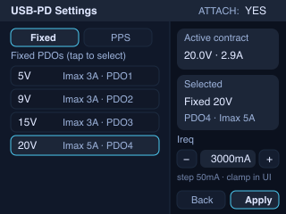
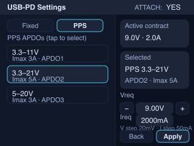
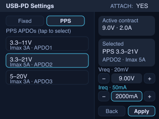
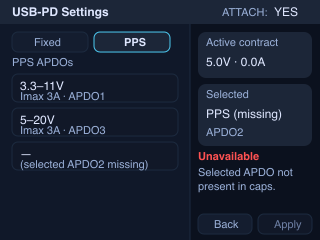

# USB‑PD 设置面板：Fixed PDO / PPS APDO（UI + UART 协议 + HTTP API）（#0013）

## 状态

- Status: 待实现
- Created: 2026-01-09
- Last: 2026-01-09

## 背景 / 问题陈述

- 当前硬件已验证 USB‑PD Sink 功能可用，但仍属于“验证性质”的最小交互。
- 需要提供正式的 USB‑PD 设置界面（Fixed / PPS），并补齐模拟板↔数字板的 PD 能力/合同信息闭环，以及数字板 HTTP API（供未来 Web 端使用）。
- 本阶段还希望保留“负载与 PD 独立”的特性，以便在不同 Source 上观察其保护行为（限流/掉电/重启等）。

## 目标 / 非目标

### Goals

- 数字板（ESP32‑S3）提供“USB‑PD 设置”界面：
  - 选择 `Fixed` 或 `PPS`；
  - `Fixed`：全量展示 Source 提供的 Fixed PDO 列表，并允许用户选择目标 PDO；
  - `PPS`：全量展示 Source 提供的 PPS APDO 列表，并要求用户显式选择目标 APDO（不做自动选）。
- 配置界面必须显示“当前选中 PDO/APDO 的能力摘要”：
  - Fixed：电压（视为 min=max）与最大电流；
  - PPS：电压范围（min/max）与最大电流。
- 允许用户设置 **PD 请求电流 Ireq**（Fixed/PPS 都需要），并且：
  - UI 交互上阻止把电压/电流设到超出能力范围；
  - HTTP API 层对越界请求返回明确错误（不隐式夹紧）。
- 完整打通：数字板 UI/HTTP → UART → 模拟板（STM32G431）PD 协商 → 模拟板回传能力/合同 → 数字板展示。
- PD 与负载控制暂不联动：PD 配置变更不会自动改变负载开关/设定值；负载行为可独立触发 Source 保护，用于实验与诊断。

### Non-goals

- Web 前端实现（仅做数字板 HTTP API）。
- PPS 的自动 APDO 选择（未来可扩展为可选项，本计划不实现）。
- 负载电流与 PD 合同电流的联动策略（例如自动夹紧/自动禁用负载）。
- EPR/AVS（48V/可调供电）支持（除非后续单独开计划）。

## 范围（Scope）

### In scope

- 数字板 UI：新增 USB‑PD 设置面板（Fixed/PPS + 选择/编辑/应用）。
- UI 入口（已决策）：主界面 PD 按钮 **短按** 进入 USB‑PD 设置；在该面板内完成 Fixed/PPS 选择与 Apply；`Back` 返回主界面。
- UART 协议：
  - `PD_STATUS`：能力摘要 + 当前合同信息（增强以支持“用户选 PDO/APDO”）。
  - `PD_SINK_REQUEST`：承载“用户选择的 PDO/APDO + 目标电压/电流”并要求 ACK。
- 模拟板 PD（STM32G431）：
  - 在 Fixed 模式下按用户选择的 **PDO object position** 请求固定电压，并携带 Ireq；
  - 在 PPS 模式下按用户选择的 **APDO object position** 请求目标电压/电流，并实现 PPS keep-alive。
- 数字板 HTTP API：提供读取 PD 能力/合同/配置、写入 PD 配置并应用的端点。
- 持久化：数字板将 PD 配置保存到 EEPROM；重启/断电后保持。

### Out of scope

- 不新增外部 discovery 服务；不引入新网络协议栈或新 Web 技术栈。
- 不新增“自动回退/自动纠错”类策略（例如选择不可用档位自动跳到最接近档位）。

## 需求（Requirements）

### MUST

- **入口（已决策）**：
  - 主界面 PD 按钮短按进入 USB‑PD 设置面板；`Back` 返回主界面。
- **全量展示能力**：
  - Fixed PDO：显示全部固定电压档（按 Source Capabilities 解析结果渲染）。
  - PPS APDO：显示全部 APDO（显示 min/max 电压与 Imax）。
- **用户显式选择**：
  - Fixed：用户选择目标 PDO（以 object position 标识）。
  - PPS：用户选择目标 APDO（以 object position 标识）。
- **可配置 Ireq**：
  - Fixed/PPS：均提供 Ireq 设定入口；默认值为**上次保存值**（EEPROM 持久化）；上限为 Imax（UI 越界阻止、HTTP 越界返回 `422 LIMIT_VIOLATION`）。
- **越界防护**：
  - UI：阻止把电压/电流设到超出选中 PDO/APDO 的能力范围（步进到边界即停止）。
  - HTTP：越界请求返回 `422 LIMIT_VIOLATION`（不夹紧、不自动改值）。
- **不可用能力的处理（已决策）**：
  - 若用户选择的 PDO/APDO 在当前 Source 上不存在：阻止 Apply（UI 禁用/提示；HTTP 返回错误）；模拟板侧收到此类请求也应 NACK。
- **可诊断性**：
  - UI 必须显示：Attach 状态、当前合同电压/电流、当前选中 PDO/APDO 的范围与 Imax、应用成功/失败状态。
  - 保留日志证据用于复现（例如打印所选 object position 与目标 V/I）。

### SHOULD

- 明确区分“已保存配置”与“已应用到当前 Source 的合同”（例如：Saved vs Active/Contract）。
- 当链路不可用或模拟板未就绪时，UI 与 HTTP 提供稳定一致的错误语义（`LINK_DOWN`/`ANALOG_NOT_READY` 等）。
- UI 对 Fixed 与 PPS 的信息架构一致（同一位置显示“范围 + Imax + Ireq”）。

### COULD

- 在后续版本加入“自动选择 APDO”选项（与当前“手动选择”并存）。
- 增加更丰富的 PD 诊断信息（例如协商阶段、Reject/Wait 计数、PPS keep-alive 状态）。

## UI 效果图（UI mock）

> 说明：以下效果图用于冻结“信息架构 / 状态 / 控件分区 / 文案口径”。像素级对齐与最终渲染细节，以实现阶段的真实 UI 渲染输出为准。

UI mock（320×240 PNG）：

### Fixed 模式（全量 Fixed PDO 列表 + Ireq）

### PPS 模式（全量 PPS APDO 列表 + Vreq/Ireq）

### PPS 模式（选择并编辑 Ireq）

### 所选能力不可用（Apply 禁用）

#### UI mock 资产一致性（冻结）

- 资产目录：`docs/assets/usb-pd-settings-panel/*.png`。
- 若本文修改了字段名/状态/布局分区，导致效果图表达不再准确，应在同一次推进中同步更新对应 PNG（实现阶段可替换为来自真实 UI 渲染的 mock）。

## 验收标准（Acceptance Criteria）

- Given 连接一个支持多档 Fixed PDO 的 PD Source，且 UART 链路健康
  When 在设备 UI 进入 USB‑PD 设置，选择 `Fixed`，从列表中选择某个 Fixed PDO，并设置 Ireq（≤ Imax）
  Then 数字板成功下发 `PD_SINK_REQUEST` 并收到 ACK；模拟板协商后 `PD_STATUS.contract_mv/contract_ma` 更新；UI 显示合同已生效且显示所选 PDO 电压与 Imax。

- Given 连接一个支持 PPS 的 PD Source，且其 Source Capabilities 至少包含 1 个 PPS APDO
  When 在 UI 选择 `PPS`，显式选择某个 APDO，设置目标电压（在 min/max 内）与 Ireq（≤ Imax），并点击 Apply
  Then 合同进入 PPS（`PD_STATUS` 反映新的合同信息），并且在持续连接 30 秒内不会因缺少 keep-alive 而退出（允许 Source 自身策略导致的短暂波动，但不得无 keep-alive 退出）。

- Given 当前选中的 PDO/APDO 在 Source Capabilities 中不存在（例如换了一个不支持该档位的充电器）
  When 用户尝试 Apply（UI 或 HTTP）
  Then 请求被拒绝：UI 禁用或提示不可用；HTTP 返回 `422 LIMIT_VIOLATION` 或 `409 CONFLICT`（以实现时统一口径为准）；不得向模拟板发送会触发协商的请求。

- Given 用户尝试把 PPS 电压调到超出 APDO 范围
  When 在 UI 中持续向上/向下调整
  Then 值在边界处停止（不允许越界）；HTTP 层对越界写入返回 `422 LIMIT_VIOLATION`。

- Given PD 配置已保存到 EEPROM
  When 设备重启或断电重启
  Then UI 显示保存的 PD 配置；当链路与 Source Capabilities 就绪且能力可用时允许 Apply；能力不可用时保持拒绝 Apply 的行为一致。

- Given 负载已开启并在运行
  When 用户仅修改 PD 配置（不触碰负载开关/设定值）
  Then 负载功能保持独立，不因 PD 配置变更而自动改变；允许负载行为触发 Source 保护（用于实验），系统以状态/日志可诊断呈现。

## 非功能性验收 / 质量门槛（Quality Gates）

### Testing

- Unit tests（Host）：
  - `libs/protocol`：新增/更新 `PD_STATUS` 与 `PD_SINK_REQUEST` 的编解码 round-trip 测试（覆盖 object position、范围字段、越界/错误路径）。
- Integration（HIL）：
  - 至少使用 2 个不同 PD Source（含 1 个支持 PPS）+ 至少 2 根不同线缆进行矩阵测试。
  - 记录关键日志：Source Capabilities 摘要、所选 object position、请求 V/I、合同 V/I、NACK/超时计数。

### Quality checks

- Rust fmt：`just fmt`（或 `cargo fmt --all`）。
-（可选）在不引入新工具前提下，按仓库已有约定运行现有 lint/check。

## 文档更新（Docs to Update）

- `docs/interfaces/uart-link.md`：补齐 PD 设置面板所需的 UART 消息契约（字段与语义更新）。
- `docs/interfaces/network-http-api.md`：新增 PD 相关端点与 JSON 类型（`/api/v1/pd` 等）。
- `docs/interfaces/main-display-ui.md`：补齐“USB‑PD 设置面板”UI 交互与视觉规范。

## 里程碑（Milestones）

- [ ] M1: UART 协议契约冻结（含 object position 与 Ireq）+ `libs/protocol` 单测补齐
- [ ] M2: 模拟板 PD：支持按 object position 请求 Fixed/PPS（含 Ireq）+ PPS keep-alive + `PD_STATUS` 完整上报
- [ ] M3: 数字板 UI：USB‑PD 设置面板（全量列表 + 越界阻止 + Apply/错误态 + EEPROM 持久化）
- [ ] M4: 数字板 HTTP API：读写 PD 配置 + 状态输出（与 UI 同口径错误码）
- [ ] M5: HIL 验收：多 Source/线缆矩阵验证 + 记录日志/结论

## 方案概述（Approach, high-level）

### A) “object position” 作为跨板稳定标识

- USB‑PD 的 Request 需要携带 **Object Position** 来选择目标 PDO/APDO。
- 因为数字板需要让用户“选 PDO/APDO”，因此 `PD_STATUS` 必须上报每个条目的 object position（不能只上报电压/范围）。

建议 `PD_STATUS` 能力列表条目结构（示意，最终以 `loadlynx-protocol` 定义为准）：

- Fixed PDO item：`[pos, mv, max_ma]`
- PPS APDO item：`[pos, min_mv, max_mv, max_ma]`

### B) `PD_SINK_REQUEST` 字段形状（示意）

- Fixed：
  - `mode = fixed`
  - `object_pos`（所选 Fixed PDO）
  - `i_req_ma`（用户设置）
- PPS：
  - `mode = pps`
  - `object_pos`（所选 PPS APDO）
  - `v_req_mv`（用户设置，20mV 步进）
  - `i_req_ma`（用户设置，50mA 步进）

### C) UI 步进与越界策略（已冻结）

- PPS 电压：20mV/step（与 PPS 电压单位对齐）。
- 电流（Fixed/PPS）：50mA/step（与 PPS 电流单位对齐；Fixed 内部可量化到 10mA，但 UI 保持一致性与可操作性）。
- 越界：阻止越界（调节到边界即停止）。

### D) “拒绝 Apply”策略（已冻结）

- 当所选 PDO/APDO 在当前能力列表中不存在：
  - UI：禁用 Apply 并提示原因；
  - HTTP：返回明确错误；
  - UART：不下发请求（若仍下发，模拟板应 NACK）。

### E) PPS keep-alive

- PPS 模式需要周期性维持（keep-alive）。实现上以 PD 协议栈/状态机的周期计时为准，保证在持续连接场景不因缺少 keep-alive 退出。

## 风险与开放问题（Risks & Open Questions）

- 风险：不同 PD Source 对 PPS/请求电流的容忍差异很大；需要通过矩阵测试收敛“推荐 Ireq”与错误呈现策略。
- 风险：若能力列表不携带 object position，将无法可靠实现“用户选 APDO”的跨板协议；该点必须优先冻结。
- 开放问题：无（已决策：UI 入口选 A；Ireq 默认值为上次保存值）。

## 参考（References）

- `docs/plan/0010:usb-pd-sink-toggle/PLAN.md`（PD 最小验证范围，作为演进基础）
- `docs/interfaces/uart-link.md`（MCU↔MCU 通信协议与消息集）
- `docs/interfaces/network-http-api.md`（HTTP API 统一错误格式与端点约定）
