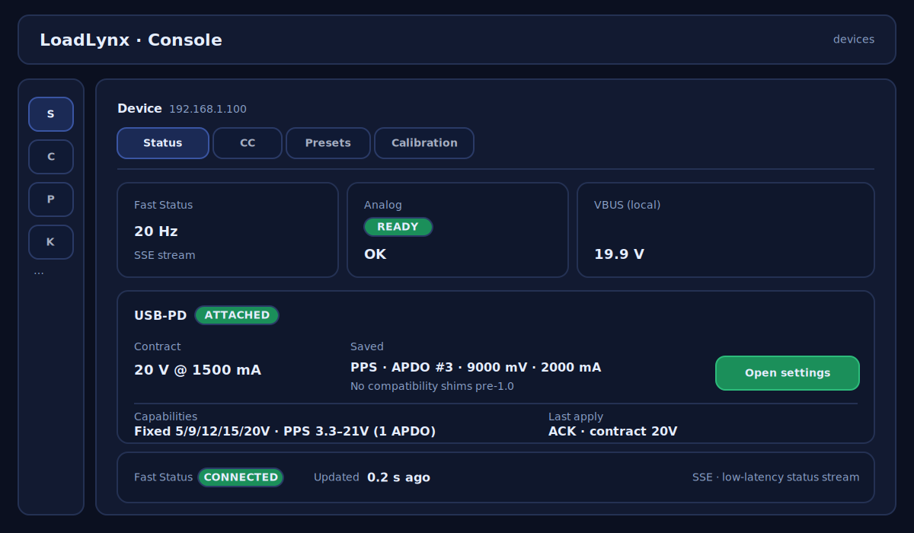
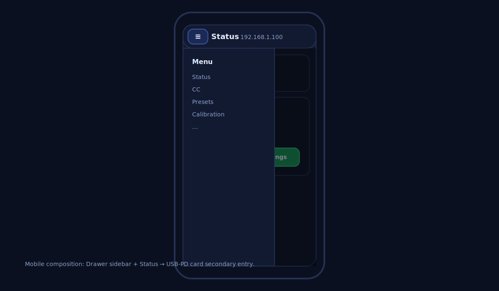
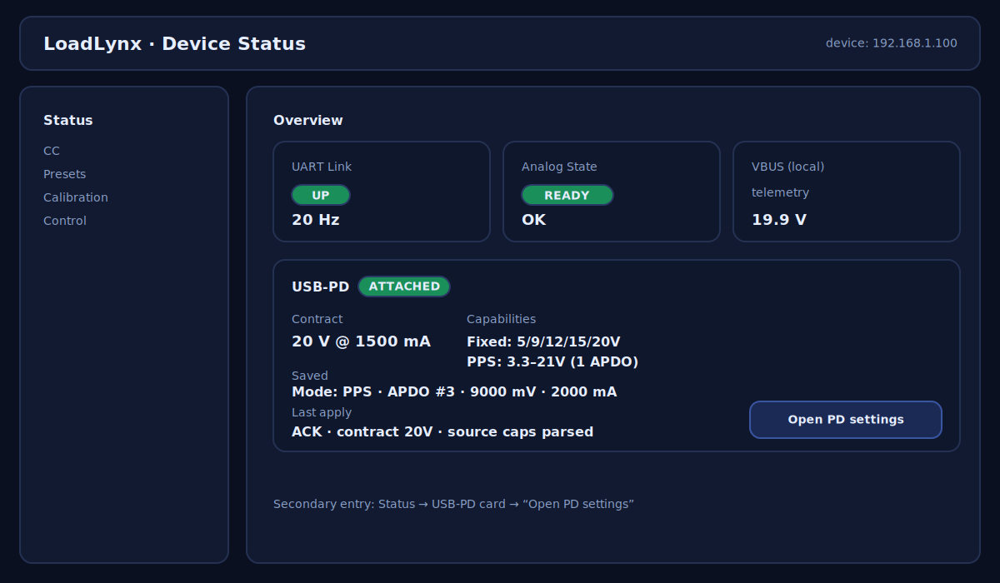
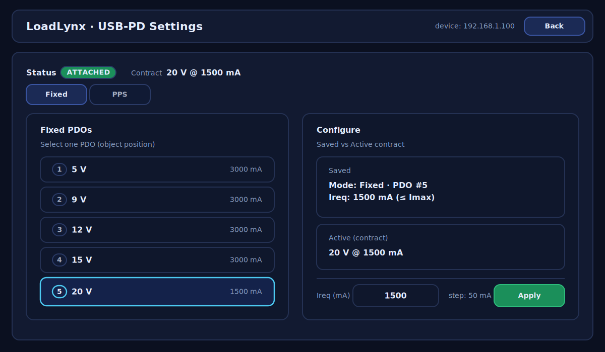
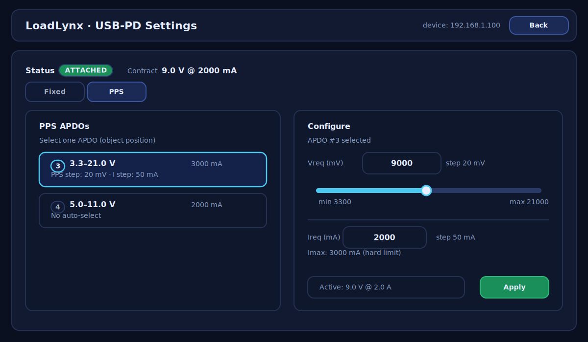
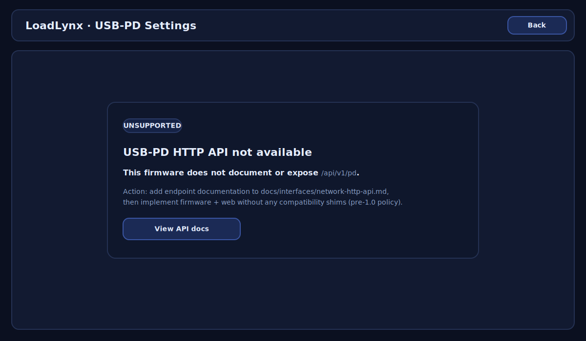

# Web：USB‑PD 设置页（对接 /api/v1/pd）（#0014）

## 状态

- Status: 已完成
- Design: 已冻结（效果图 + 文字规格已确认）
- Created: 2026-01-09
- Last: 2026-01-13

## 背景 / 问题陈述

- 目前 `web/` 已有可用的设备状态与控制页面（例如 CC、Presets、Calibration），但缺少对 USB‑PD Sink 的“可视化状态 + 可控配置”入口。
- 现有 PD 交互仍偏验证性质（例如两态切换），不满足“Web 端读写 PD Sink 功能模块”的长期需求（选择 PDO/APDO、设定 Ireq、观察合同与能力）。

## 目标 / 非目标

### Goals

- Web UI 提供一个“USB‑PD”设置页，能对设备的 USB‑PD Sink 功能进行**读写**：
  - 读取：Attach、当前合同（V/I）、Source 能力列表（Fixed/PPS）、已保存配置；
  - 写入：选择 Fixed PDO / PPS APDO、设置目标电压（PPS）与 Ireq，并触发 Apply。
- UI 的越界策略与设备端一致：前端阻止越界，服务端越界返回明确错误（不夹紧）。
- 复用现有 Web 技术栈与交互模式（TanStack Router/Query + `HttpApiError` 展示 + mock:// 设备）。

### Non-goals

- 不在本计划内实现固件侧的 PD 协议增强与 HTTP API（见 `docs/plan/0013:usb-pd-pps-and-fixed-settings/PLAN.md`）。
- 不实现账号体系/远程云访问；默认局域网直连设备。
- 不实现自动 APDO 选择、推荐 Ireq 等策略型功能（未来可扩展）。

## 范围（Scope）

### In scope

- Web 路由/页面：新增设备级 USB‑PD 设置页（入口：status 页二级入口）。
- Web API client：
  - 增加 `/api/v1/pd` 的读写封装函数与 TypeScript 类型；
  - 写入使用 `POST + Content-Type: text/plain`（遵循既有“避免私网预检”的约定）。
- Mock backend：
  - `mock://` 设备补齐 PD 能力/合同/配置的读写与错误路径，以支撑 Storybook/E2E。
- 测试与质量：
  - Storybook：为 USB‑PD 设置页的关键状态补齐 stories；
  - E2E：新增至少 1 个用例覆盖“读取 + 修改 + Apply + 错误态”。

### Out of scope

- 不修改主界面（其它页面）来“强制展示 PD 信息”；仅在需要时做最小的入口与摘要。
- 不引入新测试框架/新 UI 组件库；只复用仓库现有工具链（Biom/Playwright/Storybook）。

## 界面效果图（Design mock，实施需高度还原）

本节效果图为 **高保真目标**：实现阶段应以其作为 UI 规格，做到“高度还原”。

同时，为避免“把效果图里的瑕疵也高度还原”导致成品继承缺陷，本计划冻结以下原则：

- **以“主人确认通过”的效果图为准**：在主人明确确认效果图可作为实现规格之前，不允许进入实现阶段。
- **瑕疵必须在设计阶段消除**：发现瑕疵时，先修正效果图与本节文字规格，再进入实现；不允许“实现时顺手修、事后补文档”。

### 还原度要求（Freeze）

- 信息架构与导航层级必须一致：
  - Status 页存在 USB‑PD 区块，且提供二级入口（按钮文案与交互一致）。
  - USB‑PD 设置页为独立页面，有 Back 返回；包含 Fixed/PPS 两个 tab。
- 关键布局结构必须一致（同屏元素与相对位置不应改变）：
  - 桌面：左右两栏（能力列表 vs 配置区），底部 Apply；Saved 与 Active（合同）区块分离展示。
  - 移动：在窄屏下仍可完成“选择能力 → 编辑参数 → Apply”，不隐藏关键状态（Attach/合同/Saved/错误）。
- 样式需对齐现有 Web（`web/`）的主色调与组件观感：
  - 允许使用设计系统 token（如 DaisyUI/tailwind）替换纯色值，但整体观感应与效果图一致。
  - 不引入新的组件库或全局样式策略。
- 允许的偏差范围（避免被像素级噪音卡死）：
  - 字体与字号：以仓库现有字体栈为准；允许在 ±1 个字号档内微调以适配真实组件。
  - 间距：允许在 8px 网格内做小幅调整（例如 padding/margin ±8px），但不得改变整体栅格与分区。
  - 文案：可在不改变语义的前提下做微调（例如 “Open settings” vs “Open PD settings”），但交互意图必须一致。
  - 视觉层级：允许减少过多的 “card 边框/阴影” 层级，优先用扁平分区（背景块）收口；但不改变信息架构与栅格分区。

### 验收方式（实施阶段）

- 必须提供对照验证：
  - Storybook：为 Status 内 USB‑PD 区块、PD Settings（Fixed/PPS/Unsupported）各提供 story；
  - E2E：至少 1 个用例覆盖从 Status 二级入口进入 PD Settings，并能看到关键区块（tabs/列表/配置/Apply）。
- 若实现中需要改变该 UI 规格：必须先更新本节效果图并在计划中说明变更点（不允许“实现先改、再事后补文档”）。

### 瑕疵清单（Must fix before impl）

（主人指出的瑕疵请在此列出并打勾关闭；未关闭前不进入实现阶段。）

- [x] M0.1: Status 页 “UART Link” 的 `UP` badge 文案需在胶囊内水平/垂直居中（`assets/status-entry.svg`）。
- [x] M0.2: Status 页 PD 卡片 “Saved” 值行不得溢出容器（`assets/status-entry.svg`）。
- [x] M0.3: PD Settings Unsupported 页面 “UNSUPPORTED” badge 文案需在胶囊内水平/垂直居中（`assets/pd-settings-unsupported.svg`）。
- [x] M0.4: PD Settings Unsupported 页面 “View API docs” 按钮文案需水平/垂直居中（`assets/pd-settings-unsupported.svg`）。
- [x] M0.5: PD Settings PPS 列表项（items）上下内边距需对称，避免下沿贴近文字（`assets/pd-settings-pps.svg`）。
- [x] M0.6: PD Settings 页 Fixed/PPS tab 文案需在按钮内水平/垂直居中（`assets/pd-settings-fixed.svg`、`assets/pd-settings-pps.svg`）。
- [x] M0.7: PD Settings 页 Ireq 行需与输入框/step/Apply 垂直居中对齐（`assets/pd-settings-fixed.svg`、`assets/pd-settings-pps.svg`）。
- [x] M0.8: “与现有布局的组合”示意图中：侧栏图标、设备子导航 tabs、PD 卡片标签与按钮文案需居中对齐（`assets/console-integrated-desktop.svg`、`assets/console-integrated-mobile.svg`）。
- [x] M0.9: Status 二级入口示意图：顶栏标题与 device 文案不得重叠；PD 卡片下方空白需合理（补齐 Last apply 等信息），且 Last apply 行与容器底部需留出合理内边距（`assets/status-entry.svg`）。
- [x] M0.10: PD Settings Unsupported 页面 “View API docs” 按钮与容器需留出合理上下内边距（与正文保持间距、且不贴底）（`assets/pd-settings-unsupported.svg`）。
- [x] M0.11: Status 页 VBUS 卡片在无 badge 场景下不应出现异常大空位（调整数值与说明行的垂直间距）（`assets/status-entry.svg`）。
- [x] M0.12: PD Settings 页 Ireq 行：label 与输入框间距需合理（避免异常大空隙），并与同区块其它元素对齐（`assets/pd-settings-fixed.svg`、`assets/pd-settings-pps.svg`）。
- [x] M0.13: “与现有布局的组合”示意图中：PD 卡片下方不应出现突兀的大面积空白；应以页脚状态条/信息区收口，保持视觉平衡（`assets/console-integrated-desktop.svg`）。
- [x] M0.14: Status 页 Overview：`UP`/`READY` 等 badge 文案需与胶囊容器垂直居中对齐（`assets/status-entry.svg`）。
- [x] M0.15: Status 页 Overview：`VBUS (local)` 卡片不应出现突兀的大空白，且与其它卡片的“标题→副信息→数值”节奏一致；通过将 `telemetry` 作为副信息行并统一行距保持一致（`assets/status-entry.svg`）。
- [x] M0.16: PD Settings PPS 页面底部操作区：`Active` 信息框与 `Apply` 按钮必须同高、同基线对齐（`assets/pd-settings-pps.svg`）。
- [x] M0.17: Mobile 组合示意图：顶栏菜单按钮（≡）点击目标不应过小，图标需清晰醒目且在按钮内水平/垂直居中（`assets/console-integrated-mobile.svg`）。
- [x] M0.18: Desktop 组合示意图：Status 页 USB‑PD 卡片内部不得留大面积空白；需补齐能力摘要与最近一次 Apply 摘要以收口（`assets/console-integrated-desktop.svg`）。
- [x] M0.19: PD Settings（Fixed/PPS）列表项的 object position 序号不得仅用纯文本前缀；需使用独立序号 badge（胶囊）以提升可读性与一致性（`assets/pd-settings-fixed.svg`、`assets/pd-settings-pps.svg`）。
- [x] M0.20: PD Settings 页面卡片层级过多导致“圈太多”；需改为更扁平的分区视觉（减少边框/阴影层叠），并保持布局分区不变。

### 界面规格（冻结，实施需遵循）

> 目的：避免“高度还原”把瑕疵也复制到成品；本节以可量化的 UI 规则描述关键对齐与尺寸。

- **计划阶段产物边界（冻结）**
  - 本计划的所有界面效果图与资源文件必须存放在 `docs/plan/0014:web-usb-pd-settings/` 目录树下（当前为 `assets/`）。
  - 计划阶段不在 `docs/plan/` 目录之外新增或修改任何文件；任何临时预览图仅可生成在工作区外（例如系统临时目录），不得入库。

- **PPS 底部操作区（Active + Apply）**
  - `Active` 信息框与 `Apply` 按钮 **高度必须相同**：`44px`。
  - 两者 **顶部 y 坐标一致**（同一行排版），并保持同一圆角：`rx=12`。
  - 文案垂直居中：文本元素使用 `dominant-baseline="middle"`，y 坐标取容器垂直中心。

- **Mobile 顶栏菜单按钮（≡）**
  - 点击目标尺寸不小于 `48×36`，圆角与按钮一致（示意图为 `rx=12`）。
  - 图标字号为 `18px`，且在按钮内水平/垂直居中（`text-anchor="middle"` + `dominant-baseline="middle"`）。

- **Status 页 USB‑PD 卡片（Desktop 组合示意图）**
  - 卡片下半区不得留“纯空白”大块区域；必须补齐信息区收口：
    - `Capabilities`：摘要展示 `Fixed` 与 `PPS` 能力；
    - `Last apply`：摘要展示最近一次 Apply 结果（例如 `ACK` / `ERR` 与关键信息）。
  - 二级入口按钮放在卡片右侧，且与 `Last apply` 信息区形成左右呼应，避免右下角留空突兀。

- **列表项的 object position 序号（Fixed/PPS）**
  - 序号以独立 badge（胶囊）呈现，替代 `#n ·` 纯文本前缀。
  - badge 尺寸：`28×24`，圆角 `rx=12`；内部数字使用 `text-anchor="middle"` + `dominant-baseline="middle"`。
  - 未选中项 badge 使用弱化样式（可通过 `opacity=0.7`），选中项 badge 与选中描边一致（复用 `sel` 风格）。

### 与现有布局的组合（ConsoleLayout + DeviceLayout）

### Status 页二级入口

### USB‑PD 设置页：Fixed

### USB‑PD 设置页：PPS

### 不支持（缺少 /api/v1/pd 文档或端点）

## 需求（Requirements）

### MUST

- 读（Read path）：
  - 展示 Attach 状态、合同电压/电流（unknown 时明确显示未知）；
  - 全量展示 Fixed PDO 与 PPS APDO 列表（含 object position、能力摘要）；
  - 展示“已保存配置”（Saved）与“当前合同”（Contract/Active）并区分两者。
  - **未 attach/未就绪时不视为错误**：`GET /api/v1/pd` 仍返回 200，页面显示 `DETACHED`（或 `unknown`），不把“未插 PD 电源”误报成设备异常。
- 写（Write path）：
  - Fixed：用户显式选择目标 PDO（object position）与 Ireq；
  - PPS：用户显式选择目标 APDO（object position）与目标电压/电流；
  - Apply：触发设备端应用（并能反馈 ACK/错误码）。
- 越界与不可用处理：
  - UI 阻止越界输入（在边界处停止或禁用提交）；
  - 若选中项在当前能力列表中不存在，则禁用 Apply 并提示；
  - 对 `LINK_DOWN` / `ANALOG_NOT_READY` / `LIMIT_VIOLATION` 等错误码给出可理解提示（沿用 `HttpApiError`）。
- CORS/私网预检约束：
  - PD 写入接口必须沿用既有模式：`POST` + `Content-Type: text/plain`，避免触发浏览器私网预检导致无法访问设备。

### SHOULD

- 轮询/刷新策略：PD 信息变化频率低，采用低频轮询（例如 1–2 Hz）或事件触发（如用户操作后主动刷新），避免与 Fast Status SSE 争抢连接资源。
- 易诊断性：在 UI 中展示 “source capabilities 更新时间戳 / 最近一次 Apply 的结果”。

### COULD

- 在设备状态页增加一行 PD 摘要（例如 `Contract: 9V@2A`），并链接到 USB‑PD 设置页。

## 接口文档优先（Freeze）

> 说明：在我们发布 `1.0` 之前，不做有成本的向前兼容。本计划冻结以下策略：
>
> 1) **实现时先确认接口文档是否存在**：若 `docs/interfaces/network-http-api.md` 中不存在 `/api/v1/pd`（或缺少必要字段/错误码定义），则先补齐文档；  
> 2) **按文档实现**：Web 与固件只实现并消费“一个”当前口径，不做解析器/适配层来兼容多个 schema；  
> 3) **接口不够用就改接口**：当业务需要超出当前文档能力时，直接更新文档与固件实现，再更新 Web；不通过 Web 侧兼容来兜底历史版本。

### 实现阶段的接口确认流程（强制）

- 1) 检查 `docs/interfaces/network-http-api.md` 是否已定义 `/api/v1/pd`（端点、请求/响应字段、错误码与状态码映射）。
- 2) 若缺失或不完整：先补齐文档（以文档为准冻结字段），再进入固件与 Web 实现。
- 3) 若实现中发现接口不够用：先改文档，再改固件与 Web（同步演进），不增加兼容分支。

### 写入约束（冻结）

- `/api/v1/pd` 的写入必须可通过 `POST` 完成，且 `Content-Type: text/plain`（body 为 JSON 字符串），以遵循现有“避免私网预检”的约定（见 `web/src/api/client.ts`）。

### 错误语义（冻结）

- 统一错误包裹：`{ "error": { code, message, retryable, details } }`（见 `docs/interfaces/network-http-api.md`）。
- Web 必须至少正确处理以下错误码/状态（并给出可理解提示）：
  - `503 LINK_DOWN` / `503 UNAVAILABLE`
  - `422 LIMIT_VIOLATION`（含越界细节；包含“所选 PDO/APDO 不存在于当前能力列表”的场景）
  - `409 CONFLICT`（例如正在协商/忙）
  - `400 INVALID_REQUEST`
  - `404 UNSUPPORTED_OPERATION`（端点不存在/未启用）：视为“固件不支持 PD 设置”
  - `409 NOT_ATTACHED`（未 attach / PD 状态不可用）：视为“当前不可 Apply”，但不影响读取页面展示。

## 验收标准（Acceptance Criteria）

- Given Web 端已选中一个真实设备（非 `mock://`）且设备实现了 `/api/v1/pd`
  When 打开 USB‑PD 设置页
  Then 页面能正确展示 Attach、合同信息、能力列表与已保存配置，并在网络异常时显示可理解的错误提示。

- Given Source 支持多个 Fixed PDO
  When 用户选择某个 PDO 并设置 Ireq 后点击 Apply
  Then Web 端发起写入请求（`POST text/plain`），并在成功后刷新并展示新的“Saved 配置”与（若协商成功）更新后的合同信息。

- Given Source 支持 PPS 且能力列表包含至少 1 个 APDO
  When 用户选择 APDO 并将目标电压/电流设在范围内后 Apply
  Then 页面显示应用成功，并在后续刷新中持续显示有效合同；当用户尝试越界输入时 UI 必须阻止提交。

- Given 设备返回 `422 LIMIT_VIOLATION`（例如 Ireq 越界）
  When Web 端 Apply
  Then 页面展示错误码与可诊断信息，并保持用户输入不被静默修改。

## 非功能性验收 / 质量门槛（Quality Gates）

### Testing

- Web E2E：`bun run test:e2e`
  - 增加 1 个用例覆盖：打开页面 → 读取 → 修改配置 → Apply → 展示成功/错误。
- Storybook：`bun run test:storybook`（或 CI 版 `bun run test:storybook:ci`）
  - 覆盖：link down、能力为空、Fixed 列表、PPS 列表、越界错误提示。

### Quality checks

- `bun run check`（Biome check）
-（必要时）`bun run lint` / `bun run format`

## 文档更新（Docs to Update）

- `web/README.md`：补齐 USB‑PD 设置页的入口、依赖的 HTTP API 端点与开发/测试命令提示。
- `docs/interfaces/network-http-api.md`：新增/更新 `/api/v1/pd` 端点文档（按“接口文档优先（Freeze）”流程先补齐再实现）。

## 里程碑（Milestones）

- [x] M1: Web 端 API 契约对齐（TypeScript types + 错误码映射规则）
- [x] M2: mock:// 设备补齐 PD 读写与错误路径（支撑 Storybook/E2E）
- [x] M3: USB‑PD 设置页 UI（Fixed/PPS 切换 + 列表 + 编辑 + Apply）
- [x] M4: Storybook stories + E2E 用例落地
- [x] M5: 与真实设备联调验收（至少 1 个支持 PPS 的 Source）

## 方案概述（Approach, high-level）

- Web UI 分层沿用现有模式：
  - `web/src/api/*`：只做 HTTP 封装与错误映射；
  - `web/src/routes/*`：负责视图与交互状态机；
  - 复杂显示逻辑（如能力列表排序/格式化）抽到纯函数，方便 story 与单测复用（若仓库已有单测框架则用现有）。
- 刷新策略优先选低频轮询，避免占用设备端稀缺连接资源（设备端 SSE 已用于 Fast Status）。

## 风险与开放问题（Risks & Open Questions）

- 风险：设备端 HTTP worker 数量有限；若 Web 端额外开长连接或高频轮询，可能影响现有 SSE/控制稳定性。
- 风险：不同 PD Source 行为差异大；UI 需要把“应用成功/协商失败/能力不支持”明确区分，避免误导用户。
- 开放问题：
  - 无（在实现阶段通过“先补齐接口文档”的流程消除不确定性。）

## 假设（需主人确认）

- 假设：固件最终会提供可用的 PD HTTP API（目标为 `/api/v1/pd`）；若某固件版本不提供，则 Web 端在该设备上只能展示“不支持”，不保证读写能力。

## 冻结条件（从 `待设计` → `待实现`）

- [x] 主人确认 Web 导航入口为 status 页二级入口（已决策）。
- [x] 主人接受“接口文档优先（Freeze）”：不做兼容；实现时先确认/补齐接口文档；接口不够用就更新接口文档与实现。

## 参考（References）

- `docs/plan/0013:usb-pd-pps-and-fixed-settings/PLAN.md`（固件/UI/UART/HTTP 的 PD 能力与控制契约）
- `web/src/api/client.ts`（HTTP 封装、错误映射、`POST text/plain` 约定）
- `docs/interfaces/network-http-api.md`（HTTP API 统一错误格式与端点约定）
