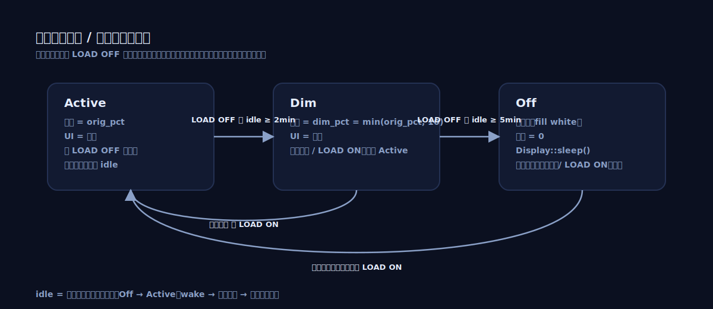

# 数字板：屏幕自动调暗与熄屏（#0015）

## 状态

- Status: 已完成
- Design: 已冻结（输入口径/亮度策略/熄屏流程/唤醒策略已确认）
- Created: 2026-01-10
- Last: 2026-01-13

## 背景 / 问题陈述

- 目前 digital 固件在启动时将背光 PWM 设为固定亮度（当前为 50%），之后缺少“无操作自动熄屏/调暗”的策略。
- 在负载未启用（LOAD OFF）且长时间无交互的场景下，持续高亮会带来不必要的耗电，并增加背光与面板的持续点亮时长。

## 目标 / 非目标

### Goals

- 在 **LOAD OFF** 且**无用户操作**时，自动进入分级省电：
  - `T+2min`：调暗背光到 `min(最大亮度的 10%, 原亮度)`（不得调亮）。
  - 之后 `+3min` 仍无操作：关闭背光，并进入 display sleep（`Display::sleep()`）以降低面板功耗。
- 在任意用户操作或 LOAD ON 时，能可靠唤醒并恢复到“正常亮度 + 正常 UI 显示”。
- 行为可验证（日志/可观测），且不引入高风险的并发背光控制。

### Non-goals

- 不做 ESP32 系统级 light sleep/deep sleep（仅管理 LCD/背光层面的省电）。
- 不引入新的“亮度设置 UI / 持久化亮度到 EEPROM”（本计划先按固件既定亮度策略工作）。
- 不改变 LOAD ON 场景下的显示策略（LOAD ON 时默认不自动熄屏）。

## 用户与场景

- 使用者：台架/桌面操作负载的工程人员。
- 场景：
  - 调试结束后 LOAD OFF，设备无人值守，期望自动降低背光与屏幕点亮时间；
  - 短暂离开后返回，通过一次交互即可唤醒屏幕继续操作；
  - 安全考虑：熄屏状态下的“唤醒动作”不应误触发负载开关或改动设置。

## 需求（Requirements）

### MUST

- **触发条件**
  - 仅在 `LOAD OFF` 时启用自动调暗/熄屏计时；`LOAD ON` 时禁止自动熄屏。
  - “无操作”以“用户输入事件”为准：**任意输入均视为有操作**（触控/旋钮/按键等）。
- **两段计时策略**
  - `T_dim = 2min`：当 `LOAD OFF` 且距上次用户操作 ≥ `T_dim` 时进入“调暗”。
  - `T_off = 5min`（=2min+3min）：当 `LOAD OFF` 且距上次用户操作 ≥ `T_off` 时进入“熄屏”。
  - 任意用户操作发生时：重置计时；若处于调暗/熄屏状态，需恢复到“正常亮度 + 正常 UI”。
- **调暗亮度公式（百分比 duty）**
  - 设 `orig_pct` 为进入调暗前的背光亮度（0–100）。
  - 设 `dim_pct = min(orig_pct, 10)`（不得调亮；`10` 表示最大亮度的 10%）。
  - 调暗时将背光设置为 `dim_pct`，并保留 `orig_pct` 用于后续恢复。
  - 示例：`orig_pct=80` ⇒ `dim_pct=10`；`orig_pct=8` ⇒ `dim_pct=8`。
- **熄屏行为**
  - 进入熄屏时：关闭背光（duty=0）。
  - 背光关闭后：进入 display sleep（例如 `lcd-async` 的 `Display::sleep()`）以进一步降低面板功耗；唤醒时使用对应 `wake()`。
- **唤醒行为**
  - 触发：任意用户操作或 `LOAD OFF → ON` 状态变化。
  - 动作：退出 display sleep（如有）、恢复背光到 `orig_pct`、恢复正常 UI 显示（必要时强制整帧刷新避免残影/旧画面闪烁）。
  - 安全：**熄屏状态下任何输入仅用于唤醒且会被消费**（不执行实际 UI 动作）。

### SHOULD

- 状态切换打印限频日志（例如 `screen_power: active->dim` / `dim->off` / `off->active`），便于硬件验收计时与边界。
- 时间比较使用 wrap-around 安全的 `wrapping_sub`（以 `u32` ms 计数为基准）。
- 在熄屏/睡眠期间尽量避免不必要的 SPI 刷屏（降低 CPU/SPI 占用），但不影响唤醒响应。

### COULD

- 将 `T_dim/T_off/orig_pct` 等策略参数提升为“可配置但仍是固件内配置”（非 UI 设置），以便未来按不同面板/背光做微调。

## 接口契约（Interfaces & Contracts）

None（本计划不新增/修改对外接口；实现仅涉及 digital 固件内部显示/背光策略与任务协作）。

## 约束与风险

- **已确认的驱动/硬件能力**：
  - 屏幕控制器为 ST7789V（P024C128-CTP 模组），支持 Display ON/OFF（`0x29`/`0x28`）与 Sleep OUT/IN（`0x11`/`0x10`）。
  - 当前固件已使用 `lcd-async`（ST7789 模型）驱动显示，并提供 `Display::sleep()/wake()`（基于 DCS `0x10`/`0x11`）。
  - 背光为独立 GPIO PWM（`BLK`，现固件使用 LEDC PWM 输出），可将 duty 设为 0 关闭背光。
- **并发风险**：背光 PWM 通道需要单点控制；若多个任务同时写 duty，容易出现抖动/竞态。
- **显示驱动状态机约束**：进入 display sleep 后必须在 `wake()` 之前避免发送其它显示命令（`lcd-async` 有明确约束）；需要在任务结构上保证这一点。
- **误触风险（安全）**：熄屏状态下用户看不到 UI，若触摸/按键同时触发 UI 动作可能造成误操作（例如误开负载）。需要明确“唤醒输入是否被消费”的策略。
- **计时语义**：若“无操作”的定义不一致（触摸 down vs up、旋钮旋转 vs 按下），会导致体验差异；需在设计阶段冻结。

## 验收标准（Acceptance Criteria）

- Given 设备处于 `LOAD OFF` 且从某时刻起无任何用户输入
  When 到达该时刻后 2 分钟
  Then 背光亮度在 1 秒内降至 `dim_pct=min(orig_pct, 10)`，并打印一次状态切换日志。

- Given 设备处于 `LOAD OFF` 且持续无用户输入
  When 到达该时刻后 5 分钟
  Then 在 1 秒内完成“关闭背光（0%）→ 进入 display sleep”，并打印一次状态切换日志。

- Given 设备处于“调暗”或“熄屏”状态
  When 用户发生一次输入（触控/旋钮/按键）
  Then 在 500ms 内恢复背光到 `orig_pct` 且 UI 可见；若此前进入 display sleep，则必须先 wake 再刷新画面。

- Given 设备处于“调暗”或“熄屏”状态
  When `LOAD OFF → ON`
  Then 屏幕在 500ms 内恢复到“正常亮度 + 正常 UI 显示”，且不会进入自动熄屏计时。

- Given 设备已进入“熄屏”
  When 用户执行“用于唤醒的第一次输入”
  Then 不应改变任何业务状态（例如不应误触发 LOAD 切换/改 setpoint）；该输入仅用于唤醒且会被消费。

## 非功能性验收 / 质量门槛（Quality Gates）

### Testing

- 建议将“亮度计算/状态机转移”抽成纯逻辑（可 `std` 测试），放到 `libs/` 侧做单元测试覆盖：
  - 边界：`orig_pct ∈ {0,1,9,10,11,49,50,80,100}` 的 `dim_pct` 结果；
  - 计时：`u32` wrap-around 场景下的阈值判断。
- 硬件验收（实现阶段）：通过日志与肉眼观察验证 2min/5min 的调暗/熄屏与唤醒响应。

### Quality checks

- `just fmt`
- `just d-build`（或等价的 digital release build）

## 文档更新（Docs to Update）

- `docs/dev-notes/software.md`：补充“digital 屏幕省电策略（2min 调暗 / 5min 熄屏 + sleep）”的简述，方便后续排查与统一口径。

## 里程碑（Milestones）

- [x] M1: 冻结“无操作”的定义与唤醒输入处理策略（任意输入算操作；熄屏输入仅唤醒且消费）
- [x] M2: 设计并落地屏幕电源状态机（Active/Dim/Off）与背光单点控制方案
- [x] M3: 验收与可观测性：日志、硬件验证步骤、边界用例确认

## 方案概述（Approach, high-level）

- 引入一个“屏幕电源管理”状态机（Active / Dim / Off），其输入仅包含：
  - `load_enabled`（来自现有控制状态）
  - `last_user_activity_ms`（由触控/旋钮/按键更新）
- 状态机输出包含：
  - `target_backlight_pct`（Active=orig_pct；Dim=dim_pct；Off=0）
  - `display_mode`（Normal UI / Solid White / Sleep）
- 关键取舍：
  - **背光控制单点化**：只允许一个任务/模块写背光 duty。
  - **熄屏安全**：熄屏后的任何输入“仅唤醒不执行动作”，且该输入会被消费。
  - **显示 sleep**：在背光关闭后调用 display sleep 进一步省电；唤醒时必须先 wake，再刷屏。

## 流程图（Flowchart）

说明：

- Active 状态下：任意输入会重置 idle 计时（仍保持 Active）。
- Off → Active 的唤醒流程：`wake()` → 恢复背光 → 强制整帧刷新。

（若阅读环境不支持 Mermaid 渲染，可参考下表。）

| 当前状态 | 条件（When） | 目标状态 | 动作（Then） |
| --- | --- | --- | --- |
| Active | `LOAD OFF` 且 `idle ≥ 2min` | Dim | `backlight = dim_pct` |
| Dim | `LOAD OFF` 且 `idle ≥ 5min` | Off | `backlight = 0` → `Display::sleep()` |
| Active | 任意输入 | Active | 重置 `idle` 计时 |
| Dim | 任意输入 | Active | 恢复背光；重置 `idle` 计时 |
| Off | 任意输入（被消费） | Active | `wake()` → 恢复背光 → 强制整帧刷新 |
| Dim/Off | `LOAD ON` | Active | 立即恢复显示；并停止/禁用自动熄屏计时 |

## 风险与开放问题（Risks & Open Questions）

### 已确认的口径（Decisions）

1. 任意输入均视为“有操作”，重置计时。
2. 熄屏后任何输入仅用于唤醒且会被消费。
3. 熄屏时不再做熄屏前强制刷屏；直接关闭背光并进入 display sleep（睡眠效果已在硬件上验证）。
4. 暂不引入“例外状态”（告警/诊断期等不豁免自动熄屏）。
5. 调暗阶段不得调亮：`dim_pct <= orig_pct`。
   - 具体公式：`dim_pct = min(orig_pct, 10)`。
