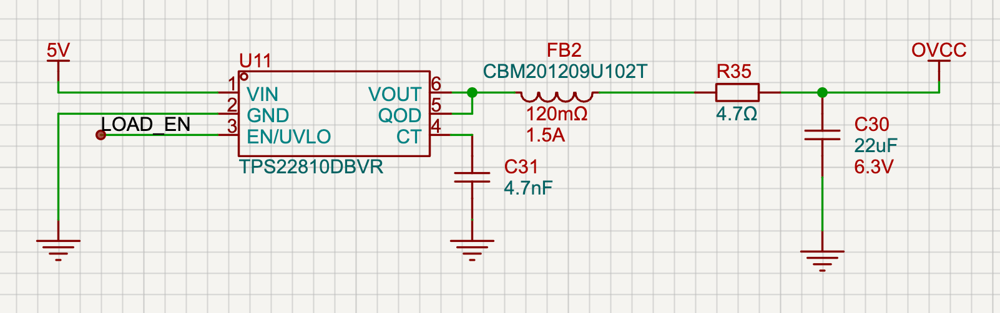

# TPS22810 作为恒流驱动前级电源开关的设计说明

目标：使用 TI TPS22810 负载开关，控制 +5V 供电给 OPA2365AIDR（双路运放），每路运放驱动 IRFP4468PBF 的栅极。要求 MCU 未工作或 EN 为低时，VOUT 拉低，使运放掉电、下游 NMOS 关断。

参考资料
- TI TPS22810 Datasheet（Markdown 版）：other-datasheets/tps22810.md
- 隔离 DC/DC：MORNSUN B0505S-1WR3（5V→5V/1W），官方手册 B_S‑1WR3（“Max. capacitive load ≈ 2400 µF”）

## 1. 连接与网络定义

- `VIN`：来自隔离 DC/DC 模块 B0505S‑1WR3 的 +5V 输出。
- `GND`：与 B0505S‑1WR3 的次级地相同；TPS22810 的 EN/UVLO、电容、QOD 等均参考此地。
- `VOUT`：通过 `FB4`（CBM201209U102T，工作频段内等效约 1 µH）与 `R103`（4.7 Ω）后送往运放 OPA2365AIDR 的电源引脚（网络标号 `OVCC`）。
  - 运放去耦：OVCC 就近放置 22 µF（C112）、100 nF 与 10 nF（并联，靠近引脚）。
- `EN/UVLO`：连接到 MCU 的 `LOAD_EN`（STM32 PB13）。
  - 外接 100 kΩ 下拉到 GND，确保 MCU 未工作时默认关断（EN 不能悬空）。
  - 可选：EN 对地并 1–10 nF 小电容以增强下降沿去抖与抗噪。
- `QOD`：仍与 `VOUT` 直接短接（0 Ω或直连走线）。
  - 启用内部放电电阻 RPD（典型 ~250–400 Ω，随 VIN 变化），在 EN 变低时为包括 22 µF 在内的输出电容提供受控放电通道。
- `CT`：推荐根据所需上升时间配置，详见 §3.2。若保持悬空（CT=0 pF），浪涌电流会显著增大。
- 去耦：`VIN` 侧靠近 TPS22810 放置 ≥1 µF X5R/X7R 陶瓷电容；如前级线路较软，可适当增大。

备注：若 MCU 与隔离 DC/DC 次级不共地（即跨隔离域控制 EN），需使用数字隔离器/光耦传递 `LOAD_EN`，并在隔离次级侧提供 EN 的下拉与去抖。EN 的参考地必须与 TPS22810 的 GND 一致。

## 2. 关键选择与理由

- QOD 直连 VOUT：满足“EN 低 ⇒ VOUT 快速为低”的需求；数据手册 9.3.2 指出三种连接方式，本设计继续选用“QOD 短接到 VOUT（使用内部 RPD）”。在 22 µF 输出电容的条件下，内部 RPD 加上 4.7 Ω 仍可将放电峰值电流限制在 ≈16 mA（见 §3.3）。
- CT 选值：输出侧新增 22 µF 后，上升沿浪涌电流显著增大；推荐根据目标浪涌/启动时间选用 2.2 nF–12 nF（见 §3.2），避免让 TPS22810 进入限流并减轻隔离 DC/DC 负担。
- EN 下拉必备：数据手册要求 EN/UVLO 不能悬空。100 kΩ 下拉可确保 MCU 上电前及复位时默认关断，且静态漏电极小。
- CIN ≥ CL：按 TPS22810 手册建议（10.3/10.4），输入电容宜不小于输出电容，有助于避免上电下陷与掉电反灌。

## 3. 上升/下降动态与滤波网络评估

### 3.1 L-R-C 输出网络的等效

`FB4`（铁氧体珠）在低频可视为 1–1.5 µH 的等效电感，串联 `R103`=4.7 Ω，再配合 `C112`=22 µF 与就近的 100 nF/10 nF，形成轻度阻尼的 LRC。阻尼因子

```
ζ = (R103 + RPD) / (2·√(L/CL)) ≫ 1
```

因此启动时不会出现明显振铃，但 L 会将瞬时 `di/dt` 限制在 ≈5 A/µs（5 V、1 µH 假设），对 TPS22810 的栅控 FET 起到一次缓冲。

### 3.2 上升时间与 CT 选择

- 现有输出电容：CL ≈ 22 µF + 0.11 µF ≈ 22.1 µF。
- 若 `CT = 0 pF`，根据数据手册表 2（VIN=5 V），典型上升时间 ≈ 60 µs，导致浪涌电流

```
I_inrush ≈ CL × ΔV / t_r ≈ 22 µF × 4 V / 60 µs ≈ 1.5 A (典型)
```

  该电流会穿过 TPS22810、串珠与隔离 DC/DC（B0505S-1WR3），易触发限流或跌落。

- 使用可调上升沿（手册 9.3.4，公式 SR = 46.62 / CT）可以设定目标浪涌：
  - 为将浪涌限制在 0.5 A（≈10% 余量留给负载），需 `t_r ≥ CL × ΔV / 0.5 A ≈ 176 µs`，代入公式得 `CT ≈ 2.0 nF`。
  - 若希望启动时间 ≈1 ms（便于 MCU 依序上电），取 `CT ≈ 11–12 nF`。
  - 当 CT ≥ 2.2 nF 时，单变量近似的误差大幅降低；TI 支持论坛也建议对小 CT 直接参考表格值，而对大 CT 使用公式【TI E2E, Rise Time Accuracy】【TI E2E, Rise Time Inquiry】。

**建议**：默认装配 `CT = 2.2 nF`（X7R，0402），在硬件调试阶段可根据实测浪涌与启动时序调整至 4.7 nF 或 10 nF。

### 3.3 下降阶段（QOD 放电）

- QOD 与 VOUT 短接时，放电阻抗为 RPD + R103 ≈ 305 Ω。
- 对 22 µF，时间常数 `τ ≈ 6.7 ms`，90%→10% 下降时间 ≈ 15 ms。
- 峰值放电电流 `I ≈ 5 V / 305 Ω ≈ 16 mA`，内部电阻的热耗 `≈ 81 mW`，低于 TPS22810 的热限制（θJA=182 °C/W 时温升 <15 °C）。
- 需要更快掉电时，可在 `QOD` 与 `VOUT` 之间增设小于 100 Ω 的外置电阻，不过务必重新验证合计功耗与温升。

## 4. 隔离电源相关注意

- B0505S‑1WR3 对输出电容容忍度高（规格“Max. capacitive load ≈ 2400 µF”），远大于本方案的 22 µF + 0.11 µF，无需额外限斜率。
- 若上游系统断电且 VIN 下降到 UVLO 以下后，器件内部 QOD 会停止工作（数据手册 9.3.2 注记）。应保证 VIN 侧有足够的电容与供电路径，使主要放电在 UVLO 之前完成；本设计 CL 很小，实际影响可忽略。

## 5. 下游 MOSFET 与运放的辅助建议

- IRFP4468PBF 的栅极加对地泄放电阻（如 100 kΩ），避免运放掉电时栅极漂浮被杂散耦合误导通。
- 运放输入适当串联小电阻（如 100 Ω–1 kΩ），避免输入端在电源掉电瞬间通过保护结构回灌电源轨。

## 6. 物料建议（BOM 摘要）

- TPS22810：SOT‑23‑6（DBV）或 WSON‑6（DRV），按布局选型。
- EN 下拉：100 kΩ，1%（必备）。
- EN 去抖（可选）：1–10 nF，C0G/X7R。
- VIN 去耦：≥1 µF，X5R/X7R（6.3 V/10 V 额定）。
- VOUT 去耦（运放本体）：22 µF + 100 nF + 10 nF（全部靠近 OPA2365 供电引脚，其中 22 µF 放在 LRC 后侧）。
- QOD‑VOUT：0 Ω 电阻或直连走线；当 CL > 200 µF 时，改为 QOD—R_EXT—VOUT（R_EXT 选值见手册 9.3.2 公式，限制放电电流与结温）。
- CT：默认 2.2 nF（X7R，0402）；调试阶段可根据浪涌与时序改为 4.7 nF 或 10 nF。

## 7. 简化原理图片段（文字版）

```
   B0505S-1WR3 (+5V iso)
        | VIN  +5V  ---> [CIN ≥ 1µF] ---> TPS22810 VIN
        | GND  0V   ---------------------> TPS22810 GND

MCU PB13 (LOAD_EN) ----> TPS22810 EN/UVLO
                           |-- 100kΩ --> GND
                           |-- 1–10nF --> GND (optional)

TPS22810 QOD -----------+ 
                         +----> TPS22810 VOUT ----> FB4 (≈1 µH) ----> R103 4.7 Ω ----> OVCC ----> OPA2365 V+
                         |                                   |                        |
                        (short)                           C112 22 µF              100nF || 10nF

OPA2365 outputs -> IRFP4468 gates (each gate with 100kΩ to GND recommended)
```

下图为当前原理图实现，与文字描述一致：



## 8. 测试与验收要点

- 示波器监测 VOUT：
  - EN 上升：确认目标上升时间（例如 CT=2.2 nF 时约 180–220 µs），浪涌峰值应低于 0.5 A；若出现尖峰，调高 CT 并复测。
  - EN 下降：预期 15 ms 量级的指数衰减；若需要更快关断，可实验性减小 R103 或添加并联放电支路，但要重新验证热耗。
- 断电测试：整体掉电时确认无异常反灌；VIN 侧电容与布线需满足手册布局建议（other-datasheets/tps22810.md 的“Layout”章节）。

## 9. 何时需要调整 CT/QOD

- 当 VOUT 侧新增较大电容（≥ 数十 µF）或需要更慢的受控上电时：
  - 依据 I_inrush 目标，反推所需上升时间，再由手册表 2 选择 CT（1–4.7 nF 起步）。
- 当 CL 增大到超过 200 µF：
  - 不应仅用内部 RPD，改为 `QOD—R_EXT—VOUT`，用 R_EXT 限制放电电流（见手册 9.3.2 公式与图表）。

参考资料补充
- 【TI E2E, Rise Time Accuracy】https://e2e.ti.com/support/power-management-group/power-management/f/power-management-forum/661124/tps22810-tps28810-rise-time-accuracy
- 【TI E2E, Rise Time Inquiry】https://e2e.ti.com/support/power-management-group/power-management/f/power-management-forum/1408637/tps22810-rise-time-inquiry

---

变更记录
- 初版：选用 QOD=VOUT、CT 悬空；EN 下拉 100 kΩ；VIN 去耦 ≥1 µF；运放去耦 100 nF + 10 nF。
