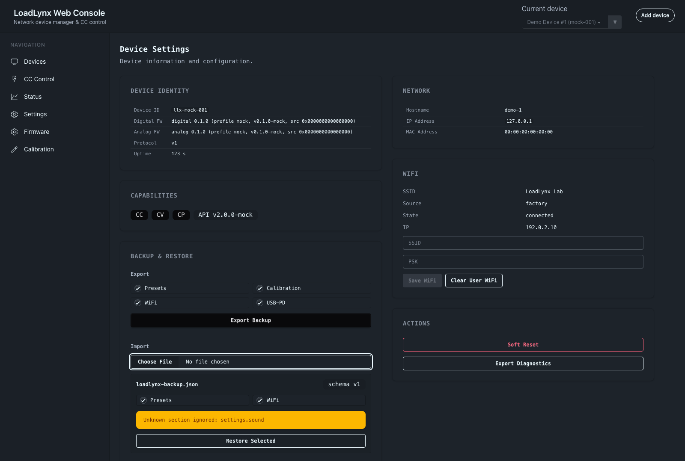
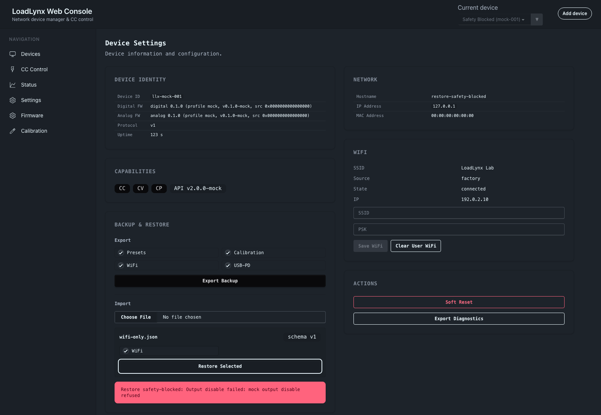

# LoadLynx Backup & Restore（#br7kq）

## 状态

- Status: 已完成

## 背景 / 问题陈述

LoadLynx 已经通过 CLI、devd USB bridge、LAN HTTP API 和 Web Settings 暴露了 preset、校准、WiFi 与 USB-PD 设置的分片读写能力，但缺少一个面向备份和恢复的 owner-facing 工作流。用户更换设备、重刷固件或迁移设置时，需要手动导出多类数据，恢复时也容易在负载仍开启的状态下写入 preset、校准或电源设置。

备份恢复必须复用现有小 API 聚合，不引入固件整包恢复接口；恢复开始前必须先关闭负载，且关闭失败时不允许写入任何数据。

## 目标 / 非目标

### Goals

- CLI 支持 `loadlynx backup export/import`，用单个 JSON 文件备份和恢复可选数据。
- Web Device Settings 提供 Backup & Restore 卡片，支持选择导出项、预览导入文件、选择恢复项和显示恢复结果。
- 备份格式稳定声明 `kind: "loadlynx.backup"` 与 `schema_version: 1`。
- 支持 `presets`、`calibration`、`settings.wifi`、`settings.pd` 四类 v1 数据。
- 非 dry-run 恢复在任何写入前必须先通过 control/output disable 关闭负载，并确认关闭成功。
- 新增最小 WiFi 凭据读取能力，允许 CLI/Web 通过 USB/devd 明文导出 `{ ssid, psk, source }`；LAN HTTP 不暴露明文 PSK 读取。
- 未知 future sections 和未知字段导入时忽略并警告。

### Non-goals

- 不新增固件整包备份/恢复 API。
- 不在导入失败时做跨分类回滚。
- 不自动应用 `active_preset_id`；该字段只作为备份上下文。
- 不让普通 status、diagnostics、trace 或日志回显 WiFi PSK。

## 备份格式

备份文件为 UTF-8 JSON object：

```json
{
  "kind": "loadlynx.backup",
  "schema_version": 1,
  "created_at": "2026-05-31T00:00:00Z",
  "sections": {
    "presets": {},
    "calibration": {},
    "settings": {
      "wifi": {},
      "pd": {}
    }
  }
}
```

- `presets`:
  - MUST 保存 5 个 preset 槽位。
  - MAY 保存 `active_preset_id` 作为上下文。
  - Import MUST restore preset slots only; it MUST NOT automatically apply the active preset.
- `calibration`:
  - MUST 保存当前 calibration profile。
  - Import MUST commit non-empty curves per curve.
  - Import MUST reset empty curves per curve.
  - If all curves are empty/default, import MAY use reset-all.
- `settings.wifi`:
  - MUST 保存 `{ ssid, psk, source }`。
  - `psk` 是明文，备份文件本身视为敏感文件。
  - Import MUST preserve `source`: `source="factory"` clears the user WiFi override; `source="user"` writes `{ ssid, psk, wait=false }`.
- `settings.pd`:
  - MUST 保存 `saved` 与 `allow_extended_voltage` only.
  - MUST NOT persist live PDO lists, live contract, attachment state, or measured status.

## CLI 行为

- `loadlynx backup export --file <path|-> [--include ...]`
- `loadlynx backup import --file <path|-> [--include ...] [--dry-run] [--allow-insecure-lan-wifi]`

Include values:

- `presets`
- `calibration`
- `settings.wifi`
- `settings.pd`
- `settings` expands to `settings.wifi` and `settings.pd`
- `all` selects all supported v1 sections

默认 include 为 `all`。Export 和 dry-run import MUST NOT disable output. Non-dry-run import MUST:

1. Read and validate the backup envelope.
2. Compute selected supported sections and collect unknown-section warnings.
3. Call control/output disable.
4. Confirm the resulting control state reports output disabled.
5. Restore non-network sections before network-affecting WiFi writes: `presets -> calibration -> settings.pd -> settings.wifi`. This preserves the owner-visible restore contract while reducing the chance that LAN WiFi reconfiguration interrupts later selected sections.

If step 3 or 4 fails, import MUST return a safety-blocked error and MUST NOT write any section.

When `settings.wifi` is restored through a LAN HTTP selector, CLI MUST require `--allow-insecure-lan-wifi`. USB/devd restore does not require that LAN safety override.

## Web 行为

Device Settings route MUST include a Backup & Restore card:

- Export:
  - Checkbox selection defaults to all supported sections.
  - Download a `.json` backup generated from current device APIs.
- Import:
  - File picker reads local JSON.
  - Preview shows supported sections, unknown-section warnings and parse/format errors.
  - Restorable supported sections default selected.
  - Restore Selected first disables output and confirms disabled state.
  - Disable `settings.wifi` export when the Web app is connected through direct LAN HTTP instead of local USB/devd.
  - If selected restore includes `settings.wifi` over LAN HTTP, show an explicit WiFi credential write confirmation before starting restore.
  - If safety disable fails, show a safety-blocked error and do not restore any section.
  - Partial restore failures should show per-section results without hiding earlier successes.

## API / Firmware

- USB/devd MUST expose a minimal WiFi credential read operation for backup export.
- LAN HTTP MUST NOT expose plaintext WiFi credential reads without an authentication or local-authorization mechanism.
- The existing WiFi status endpoint and diagnostics export MUST continue to omit PSK.
- USB/devd traces MUST continue to redact sensitive keys such as `psk`.
- Backup/restore aggregation belongs in CLI/Web/devd client code, not firmware.

## 验收标准

- Given CLI export includes only `presets`, When export completes, Then the JSON contains only `sections.presets` among supported sections.
- Given CLI import is dry-run, When the backup contains writable sections, Then no output-disable request or write request is sent.
- Given CLI import is non-dry-run and output disable fails, Then the command reports safety-blocked and performs no writes.
- Given Web import reads a backup containing unknown future sections, Then preview warns and still allows known supported sections.
- Given Web Restore Selected cannot confirm output disabled, Then it shows safety-blocked and performs no writes.
- Given WiFi credentials are exported, Then backup contains `ssid`, plaintext `psk`, and `source`, while ordinary status and diagnostics still do not include `psk`.
- Given calibration import has an empty curve, Then that curve is reset instead of committed with an empty points list.
- Given presets import has `active_preset_id`, Then preset slots are restored but active preset is not applied automatically.

## Visual Evidence

- source_type: storybook_canvas
  story_id_or_title: `Routes/Settings/BackupRestorePreview`
  state: import preview with supported sections and unknown future setting warning
  capture_scope: element
  requested_viewport: `none`
  viewport_strategy: storybook-canvas iframe
  target_program: mock-only
  sensitive_exclusion: mock PSK only; no real secrets
  evidence_note: verifies Settings route renders Backup & Restore export options, import preview, supported restore checkboxes, and unknown future-section warning.



- source_type: storybook_canvas
  story_id_or_title: `Routes/Settings/BackupRestoreSafetyBlocked`
  state: restore safety-blocked
  capture_scope: element
  requested_viewport: `none`
  viewport_strategy: storybook-canvas iframe
  target_program: mock-only
  sensitive_exclusion: mock PSK only; no real secrets
  evidence_note: verifies Restore Selected reports safety-blocked when output disable cannot be confirmed and does not continue restore.


