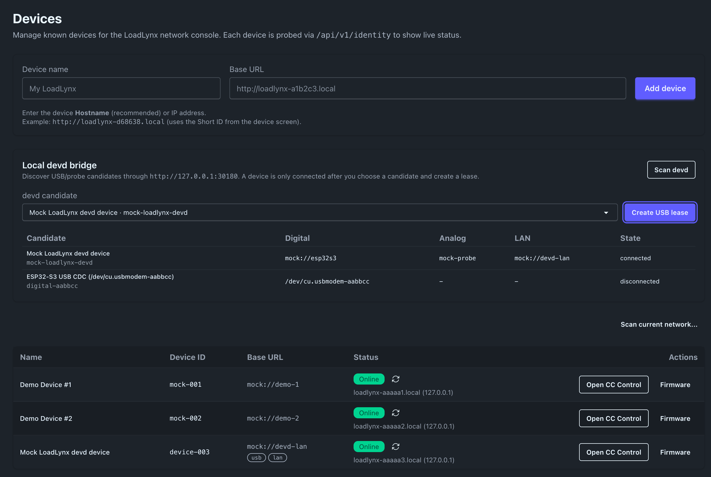
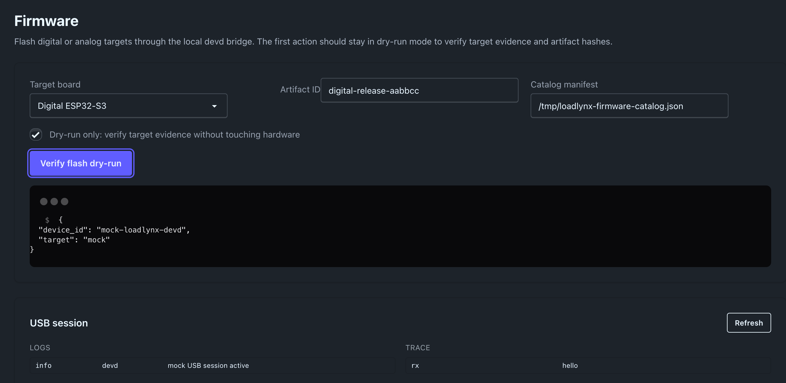
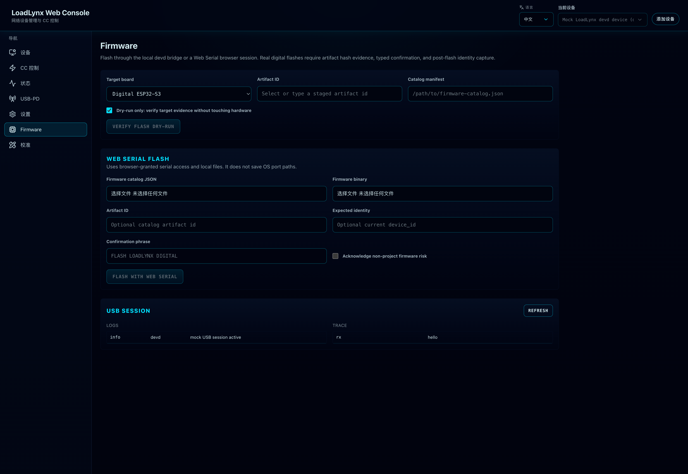
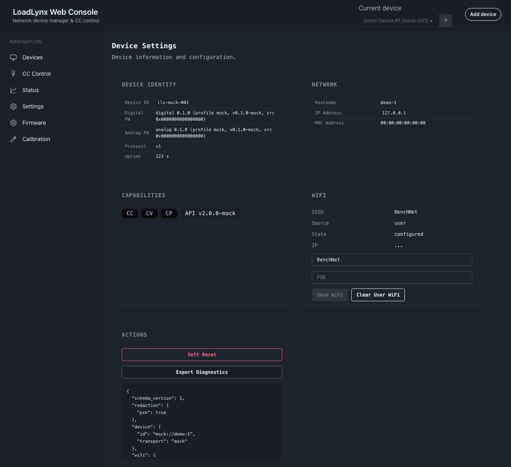

# LoadLynx devd control plane（#e3rv6）

## 背景 / 问题陈述

LoadLynx 已有 ESP32-S3 数字板的局域网 HTTP API、mDNS 设计草案、Web 控制台、早期分散的硬件在环入口，以及 STM32G431 模拟板的 probe-rs 烧录路径。现有入口曾分散在浏览器 LAN API、Web Serial/USB 设想、外部工具命令和人工选择串口/探针流程之间。

`mains-aegis` 的 `tools/mains-aegis-devd` 已验证一个更稳的模式：本地 daemon 作为 Web/App/CLI 的唯一 USB HTTP bridge，负责设备扫描、显式绑定、独占 lease、固件 artifact 校验、烧录、reset、monitor 与 bounded logs。LoadLynx 需要类似能力，但不能直接照搬，因为 LoadLynx 有两个烧录目标、两个硬件选择器、ESP32-S3 到 STM32G431 的 UART 控制链路，以及高风险电子负载输出控制。

## 目标 / 非目标

### Goals

- 新增 LoadLynx 专用 `loadlynx-devd` 本地 daemon，提供 CLI IPC 控制面和浏览器用 loopback-only HTTP bridge。
- Web 界面支持固件烧录、局域网设备发现（mDNS/DNS-SD + 手工 `.local` + 受控子网扫描）、devd HTTP bridge、正式 Web Serial 路径和 USB/LAN 双连接合并。
- CLI 支持通过以太网/LAN 与 USB/devd 操控硬件，并覆盖 discovery、status、flash、reset、monitor、safe control 与诊断导出。
- 固件 artifact catalog 成为 Web、devd、CLI、本地构建和 release 的统一合同。
- 将烧录、reset、digital monitor 与 bounded logs 的硬件操作职责收敛到 `loadlynx-devd`，owner-facing 和开发者 HIL 都通过 `loadlynx` CLI + devd 执行；analog RTT/defmt monitor 在 devd 后端实现前必须显式拒绝。
- 复用 `mains-aegis` 的安全模型：scan 不自动连接，多候选必须用户选择，USB 控制必须持有有效 lease，PSK/敏感字段不得回显，日志解码必须匹配 artifact identity。

### Non-goals

- 不在首轮实现远程高风险写控制的鉴权/TLS/账号体系；LAN 写控制仍按现有安全边界推进。
- 不把浏览器端直接接管 probe-rs 或 espflash；非 Web Serial 直烧统一经 devd/CLI 调用本地工具。
- 不让 devd 自动选择或切换 `.esp32-port` / `.stm32-port` selector。
- 不要求跨 VLAN/跨网段 discovery；复杂网络以后用单独 discovery relay。
- 不用 devd 取代固件内实时保护；模拟板仍必须本地独立限流、限压、过温和失联保护。

## 范围

### In Scope

- `tools/loadlynx-devd/` Rust daemon。
- `tools/loadlynx-devd/` 内的 `loadlynx` CLI 子命令。
- Web 管理端新增 Firmware、Connect/Discovery、USB session、Logs/Monitor 能力。
- `schemas/firmware-catalog.schema.json` 与 artifact generator。
- ESP32-S3 固件 identity、USB CDC JSONL bridge、mDNS/DNS-SD 发布与 HTTP API 小幅扩展。
- STM32G431 firmware identity 通过构建产物/defmt metadata 与数字板桥接状态暴露。

### Out of Scope

- 云端 fleet、账号、远程 NAT 穿透。
- 浏览器内 probe-rs、浏览器内 STM32 烧录。
- 未经用户明确确认的 selector 写入、端口切换或真实硬件 reset/flash。

## 需求列表

- MUST: `loadlynx-devd serve` 不接收固定设备端口；设备必须通过 `scan -> user selects -> bind/connect/lease` 流程进入控制。
- MUST: `POST /api/v1/devices/scan` 返回 ESP32-S3 serial candidates、STM32 probe candidates、LAN discovered devices、mock devices，并保留完整候选信息。
- MUST: 多个候选存在时 Web 和 CLI 均不得自动选择第一个、最近、已连接或已识别设备。
- MUST: USB CDC 写入、WiFi 配网、safe settings、ESP32-S3 flash/reset/monitor 等需要占用数字板 USB CDC 的操作必须持有有效 per-device lease 或明确的 CLI exclusive session。同一 device/port 可以有多个有效 lease；普通 JSONL 写操作进入 per-port bounded FIFO 串行执行。STM32G431 analog probe-rs flash/reset 不是 USB CDC 操作，不得要求 saved USB device 或 USB lease；它必须使用 devd 扫描出的 `.stm32-port` probe selector evidence。
- MUST: 固件烧录前校验 artifact 文件 SHA-256，并用 firmware identity 匹配 `build_id`、profile、features、target chip 和 defmt metadata。
- MUST: ESP32-S3 烧录与 STM32G431 烧录目标分离；同一设备记录可包含 `digital_target` 与 `analog_target`。
- MUST: Web 页面能通过 LAN 只读 API 使用 mDNS `.local`、DNS-SD 结果或用户手工 URL 连接设备。
- MUST: CLI 同时支持 LAN base URL 和 devd USB target，输出 JSON 与人类可读摘要。
- SHOULD: devd 可以托管生产 Web 静态文件，并为 Vite dev server 提供 `/api` proxy 目标。
- SHOULD: devd bounded session 返回 structured logs、raw USB traces、defmt decode 状态和最近 flash/reset/digital monitor 操作。Analog RTT/defmt monitor 尚未实现时，CLI/devd 必须返回结构化错误，不得悄悄监视 digital USB session。
- MUST: Web Serial 是 GitHub Pages 与 release Web bundle 的正式浏览器路径；支持身份/状态/控制/PD/输出/预设/校准/WiFi/诊断和 ESP32-S3 flash，并在不支持 Serial API 的浏览器引导到 released CLI/devd。

## 功能与行为规格

### 设备模型

LoadLynx devd 的顶层设备记录应允许把同一实体的多个连接面合并：

- `identity.device_id`: 稳定 LoadLynx 设备 ID，优先来自 ESP32-S3 HTTP/USB identity。
- `digital_target`: ESP32-S3 candidate，包含 serial port、USB VID/PID/serial、artifact target、firmware identity。
- `analog_target`: STM32G431 candidate，包含 probe selector、probe serial、chip、artifact target、firmware identity 或 defmt ELF provenance。
- `lan_endpoint`: `.local` hostname 或 IP base URL。
- `connection_marks`: `lan`, `usb`, `digital_flash`, `analog_flash`, `uart_link`。
- `lease`: devd/Web/CLI 内部授权凭证；同一 device 可有多个有效 lease，但同一物理 USB port 在同一时刻只能归属一个已确认 device。

### devd IPC and HTTP bridge

`loadlynx-devd serve` is the CLI IPC daemon. It binds a native local IPC
endpoint, serves JSONL IPC requests, auto-exits after idle timeout, and does
not expose ordinary browser HTTP. macOS/Linux use Unix sockets and Windows uses
named pipes. `loadlynx` uses this IPC surface and may auto-start a sibling
`loadlynx-devd serve`; ordinary CLI workflows must not require or expose
the legacy daemon-URL CLI flag.

CLI-to-devd IPC must use an operation envelope, not HTTP-over-IPC. The request
shape is `{"op": "<domain.operation>", "params": {...}}`, and the response shape
is `{"ok": true, "result": ...}` or `{"ok": false, "error": ApiError}`. The CLI
must not send HTTP `method`, URL `path`, headers, status codes, or raw
`/api/v1/...` routes as the devd IPC protocol. The daemon must dispatch IPC
operations directly to the control-plane handlers instead of starting an
internal HTTP server or proxying IPC to `bridge-http`.

HTTP URLs are valid only for explicit LAN device access (`--url`) or saved HTTP
device transports. If a devd endpoint value starts with `http://` or
`https://`, the CLI must reject it as an invalid devd endpoint instead of
falling back to HTTP. This keeps the browser/debug bridge out of ordinary CLI
hardware workflows.

`loadlynx-devd bridge-http` is the browser/debug bridge. It may serve the Web
bundle and compatibility API, but it must reject non-loopback binds. GitHub
Pages and release Web bundles should prefer Web Serial where available and use
the bridge only when the user has started it locally.

### devd HTTP bridge API

- `GET /api/v1/ping`
- `GET /api/v1/devices`
- `POST /api/v1/devices/scan`
- `POST /api/v1/devices/{id}/bind`
- `DELETE /api/v1/devices/{id}/binding`
- `POST /api/v1/devices/{id}/connect`
- `POST /api/v1/devices/{id}/disconnect`
- `GET /api/v1/devices/{id}/identity`
- `GET /api/v1/devices/{id}/status`
- `GET /api/v1/devices/{id}/network`
- `GET /api/v1/devices/{id}/session`
- `GET /api/v1/devices/{id}/events`
- `GET|POST /api/v1/devices/{id}/artifact`
- `POST /api/v1/devices/{id}/flash`
- `POST /api/v1/devices/{id}/reset`
- `POST /api/v1/devices/{id}/monitor/start`
- `POST /api/v1/devices/{id}/monitor/stop`
- `POST /api/v1/serial/lease`
- `POST|DELETE /api/v1/serial/lease/{lease_id}`
- `GET /api/v1/serial/session`
- `GET /api/v1/serial/events`

Compatibility endpoints (`/api/v1/identity`, `/api/v1/status`, `/api/v1/network`) may exist only when an explicit `device_id/lease_id` or an unambiguous active lease selects the device; otherwise they return `device_selection_required`. User-facing CLI commands do not expose lease IDs; the CLI creates, heartbeats and releases devd leases internally.

### mDNS / LAN discovery

- ESP32-S3 publishes hostname `loadlynx-<short-id>.local`.
- DNS-SD service should be `_loadlynx._tcp.local` on the firmware HTTP port.
- TXT records should include `device_id`, `short_id`, `api=v1`, `product=loadlynx`, `cap=net_http`.
- Web discovery priority:
  1. Saved devices and explicit URL.
  2. Browser-accessible `.local` manual entry.
  3. devd DNS-SD/mDNS scan result.
  4. User-triggered limited `/24` HTTP scan.
- Browser-only subnet scan remains explicit, bounded, and non-background.

### USB-HTTP bridge

ESP32-S3 USB CDC uses LF-delimited JSON frames. The bridge protocol should align with:

- `hello`: protocol, capabilities, identity.
- `request`: `get_identity`, `get_status`, `get_pd`, `set_pd_policy`, `set_output_enabled`, `set_cc_target`, `get_control`, `set_control`, `get_presets`, `set_preset`, `apply_preset`, `get_calibration_profile`, `calibration_apply`, `calibration_commit`, `calibration_reset`, `calibration_mode`, `get_wifi_status`, `set_wifi_config`, `clear_wifi_config`, `soft_reset`, `get_diagnostics`.
- `response` / `error`: API-compatible envelope with `request_id`.
- `status`: periodic or requested status snapshot.
- `log`: structured firmware log.
- WiFi config operations are compact request ops, not full HTTP-over-USB. User PSKs are never echoed and devd recursively redacts `psk`, `password`, `passphrase`, `secret` and `token` fields from traces/diagnostics.
- Calibration profile reads may use a compact USB response (`cal_profile_v1`) so maximum-size valid calibration curves fit in one JSONL frame. devd must expand that compact response into the HTTP/Web calibration profile shape before returning it to CLI or Web callers.
- The saved-device USB compat read path for `status --device` and `control get --device` must treat `serial_response_timeout`, `serial_response_mismatch`, `serial_response_missing` and `serial_response_invalid` as bounded retryable serial response gap failures. Recovery stays operation-scoped, tied to one queued request window, and must not relax `request_id` matching.
- Firmware `get_status` and `get_control` USB responses should stay compact and operation-specific. They must fit the JSONL frame budget without relying on the full LAN/HTTP response body shape, while still carrying the owner-facing fields required by `status` and `control get`.

The daemon owns each USB CDC port through a per-port serial owner while any lease for that port is active. HTTP commands enqueue JSONL requests through that owner, devd generates a unique `request_id` per operation, and only matching responses may satisfy the request. Mismatched responses are trace evidence, not success. The owner continuously reads unsolicited monitor frames and publishes them through bounded session/event state. Serial open or I/O failures must be retryable per command; a transient failure must not poison the owner until the lease is released.

Status and output-control response recovery may compensate for ESP32-S3 USB Serial/JTAG log noise only inside the same queued command window. A recovered success must be derived from frames after the matching transmit frame and must have the operation-specific payload shape; unrelated response IDs or stale monitor frames are not valid command responses. Saved-device USB compat read path retries are bounded and must leave trace/session evidence for each failed or recovered request window instead of silently waiting for the full operation timeout.

Flash/reset operations that need vendor tools such as `espflash --port` must pause and close the per-port serial owner before running. During that exclusive window, JSONL status/control/PD requests for the same port must fail fast with a clear `operation_in_progress` / `device_busy` style error; they must never open the same serial port concurrently or wait behind a long flash/reset operation.

### 固件烧录

Artifact catalog entries must represent both boards:

- `target`: `digital_esp32s3` or `analog_stm32g431`.
- `artifact_id`, `name`, `package_version`, `git_sha`, `build_id`, `build_profile`, `features`, `protocol`.
- `defmt`: enabled, encoding, table/ELF hashes.
- `files[]`: `kind=image|elf|manifest|metadata`, path, SHA-256, size, optional `flash_address`.

Flash behavior:

- `target=digital_esp32s3`: devd/Web firmware flows use devd's lease-gated direct `espflash` backend with the approved `.esp32-port` serial target. ELF artifacts use `espflash flash`; raw image artifacts require `flash_address` and use `espflash write-bin`.
- `target=analog_stm32g431`: devd/CLI owns the analog firmware flow and may invoke `probe-rs` internally, with exact `.stm32-port` probe selector evidence required. Analog flash/reset must not resolve `--device` through the saved USB registry or create a USB CDC lease.
- `dry_run=true` must validate target resolution, artifact presence and hashes without touching hardware.
- Real flash must refuse if the requested target does not match the selected device/board identity.
- Real ESP32-S3 flash through CLI/devd/Web Serial must require artifact/hash/target evidence, explicit `yes` confirmation, explicit non-project firmware acknowledgement when applicable, and post-flash identity capture. A successful vendor-tool exit code alone is not sufficient.
- If flashing digital firmware disrupts USB CDC, devd must release affected leases and surface reconnect instructions.

### CLI

CLI devd access is IPC-only. `loadlynx` auto-starts a sibling `loadlynx-devd serve` on the default IPC endpoint when a command needs devd. `--ipc <endpoint>` selects an alternate IPC endpoint for deliberate multi-instance or debugging overrides, `--no-auto-start` disables sibling daemon startup, and LAN/device HTTP still remains available through explicit `--url` or saved HTTP transport.

CLI commands should map 1:1 to devd/LAN operations:

- `loadlynx discover --mdns --lan-scan --json`
- `loadlynx devices`
- `loadlynx device list`
- `loadlynx device add`
- `loadlynx device add --usb-port /dev/cu.usbmodemXXXX`
- `loadlynx device add --url http://loadlynx-xxxxxx.local`
- `loadlynx device use <device-id>`
- `loadlynx device use --global <device-id>`
- `loadlynx status`
- `loadlynx status --device <device-id>`
- `loadlynx status --url http://loadlynx-xxxxxx.local`
- `loadlynx flash digital --device <device-id> --artifact <artifact_id> [--dry-run] [--confirm yes]`
- `loadlynx flash analog --artifact <artifact_id> [--dry-run]`
- `loadlynx reset digital --device <device-id>`
- `loadlynx reset analog`
- `loadlynx monitor digital --device <device-id> --tail 200`
- `loadlynx pd set --device <device-id> --mode fixed|pps --object-pos <n> --target-mv <mv> --i-req-ma <ma>`
- `loadlynx cc <target_i_ma> --device <id>`
- `loadlynx cv <target_v_mv> --device <id>`
- `loadlynx cp <target_p_mw> --device <id>`
- `loadlynx cc|cv|cp <target> --device <id> --disable`
- `loadlynx wifi show|set|clear --device <id>`
- `loadlynx control get --device <id>`
- `loadlynx control set --device <id> --enable|--disable`
- `loadlynx preset list|set|apply --device <id>`
- `loadlynx calibration profile|mode|apply|commit|reset --device <id>`
- `loadlynx soft-reset --device <id> --reason manual`
- `loadlynx diagnostics export --device <id>`

Temporary devd candidate IDs are discovery outputs, not operation targets. A USB candidate may only enter user operations through `loadlynx device add`; the bind flow must read identity over a short bind-probe lease and reject firmware that does not expose a stable `identity.device_id` such as `loadlynx-<short-id>`. `loadlynx device add --usb-port <path>` is the non-interactive USB bind form for automation and HIL: devd still scans candidates, matches the explicit port path, and then runs the same identity-confirming bind-probe flow. Bind-probe leases are restricted to identity binding and must not authorize normal control, diagnostics, reset or flash operations. Saved device records use that stable ID as the registry key, may hold both USB and HTTP transport locators, remember `last_transport`, and expose a global default plus nearest-ancestor `.loadlynx` local selection for selector-free automation. Saved USB operations on a fresh auto-started devd may trigger scan before lease creation, then must confirm the current firmware identity still matches the saved device ID; a missing lease identity is a failed confirmation, not a permissive legacy fallback.

LAN WiFi writes require the explicit `--allow-insecure-lan-wifi` CLI flag. USB/devd WiFi writes do not require that LAN safety override because they are local physical access operations.

CLI must print target evidence before hardware-changing operations: device id, transport, port/probe, artifact id, SHA-256 and dry-run/real mode.

### Web UI

- Connect page: LAN manual URL, devd local bridge, USB candidates, mDNS/DNS-SD result list, limited subnet scan.
- Devices/Fleet: merge LAN and USB marks for the same `identity.device_id`.
- Device detail: status, CC/CV/PD/control, calibration, firmware, logs/API.
- Firmware page: artifact source, target board selector, match/mismatch warning, dry-run, flash progress, reconnect state.
- Web Serial firmware path: browser file inputs for release catalog and firmware file, SHA-256 verification, `yes` confirmation, identity confirmation, non-project acknowledgement, esptool-js flash, and post-flash identity/profile capture without saving OS port paths.
- USB session page/panel: lease state, heartbeat/reconnect, bounded logs, raw trace with sensitive redaction.

## 验收标准

- Given devd has two ESP32-S3 USB serial candidates, When Web opens Connect, Then it lists both and does not create a lease until the user selects one.
- Given devd has one active USB lease, When another page requests the same device, Then devd may create another lease for the same device and all ordinary JSONL writes are serialized through the per-port queue.
- Given flash/reset owns the port exclusively, When another client requests JSONL work for the same port, Then devd returns `operation_in_progress` or `device_busy` without opening the port.
- Given no heartbeat arrives for the lease TTL, When cleanup runs, Then devd disconnects the USB session and releases the port within the configured bound.
- Given a digital artifact with mismatched `build_id`, When selecting it for a connected digital target, Then log decode remains `unverified` and real flash requires explicit target confirmation.
- Given an analog artifact is selected for a digital target, When flash is requested, Then devd returns a non-retryable target mismatch error.
- Given mDNS is unavailable, When the owner enters `http://loadlynx-xxxxxx.local` and it fails, Then Web offers IP fallback without marking the device as broken.
- Given CLI receives `--dry-run`, When `flash analog` is called, Then it verifies artifact hashes and target resolution but does not invoke probe-rs/espflash.
- Given CLI runs `flash analog` or `reset analog`, When there is no saved ESP32-S3 USB device or the digital USB device is busy, Then the analog path still reaches devd's `.stm32-port` probe-rs operation and does not create a USB CDC lease.
- Given CLI needs local devd, When it sends a request to `loadlynx-devd serve`, Then the wire payload is a native IPC operation envelope and never an HTTP method/path proxy.
- Given a devd endpoint is configured as `http://...`, When CLI attempts a devd-backed USB workflow, Then CLI rejects that endpoint and does not call the HTTP bridge.
- Given CLI sets a USB target to 12V PD and enables a 2A CC load, When `status` is read through devd, Then the response shows the PD contract, CC target, output enabled state and measured current without direct CLI serial access.
- Given CLI disables output, When `status` is read through devd, Then output enabled and analog enable are false and measured current is near zero.
- Given a USB CDC `set_wifi_config` request contains PSK, When session traces or diagnostics are fetched, Then PSK is redacted.
- Given Storybook exists, Web UI changes for Connect/Firmware/USB session must have stable stories and visual evidence before merge.

## Visual Evidence

- source_type: storybook_canvas
  story_id_or_title: `Routes/Devices/DevdLeaseCreated`
  state: devd candidate scan and USB lease creation
  capture_scope: element
  requested_viewport: `loadlynxLarge`
  viewport_strategy: storybook-viewport
  target_program: mock-only
  sensitive_exclusion: N/A
  evidence_note: verifies the Devices route can scan local devd candidates, create a USB lease, and merge the devd-bound device into the registry with Firmware navigation.

- source_type: storybook_canvas
  story_id_or_title: `Routes/Firmware/DryRunEvidence`
  state: devd firmware dry-run evidence
  capture_scope: element
  requested_viewport: `loadlynxLarge`
  viewport_strategy: storybook-viewport
  target_program: mock-only
  sensitive_exclusion: N/A
  evidence_note: verifies the Firmware route can submit a devd dry-run flash request and render target evidence plus USB session logs/traces.

- source_type: storybook_canvas
  story_id_or_title: `Routes/Firmware/WebSerialGate`
  state: Web Serial ESP32-S3 flash gate
  capture_scope: browser-viewport
  requested_viewport: `loadlynxLarge`
  viewport_strategy: storybook-viewport
  target_program: mock-only
  sensitive_exclusion: N/A
  evidence_note: verifies the Firmware route exposes the official Web Serial flash path with local catalog/binary inputs, typed confirmation, identity field and non-project risk acknowledgement.

- source_type: storybook_canvas
  story_id_or_title: `Routes/Settings/WifiAndDiagnostics`
  state: devd-backed WiFi settings and diagnostics export controls
  capture_scope: browser-viewport
  requested_viewport: `1280x900`
  viewport_strategy: playwright-headless
  target_program: mock-only
  sensitive_exclusion: mock PSK only; diagnostics output remains redacted
  evidence_note: verifies the Settings route renders WiFi status, accepts user WiFi input through the API layer, and renders a diagnostics export without exposing PSK.

## 非功能性验收 / 质量门槛

- Rust daemon unit tests cover candidate filtering, stable IDs, lease expiry, artifact matching, target mismatch, PSK redaction, error envelopes.
- CLI tests cover JSON output and dry-run target evidence.
- Web typecheck, Storybook, and route-level mock tests pass.
- Firmware builds for digital and analog remain green.
- HIL verification uses devd's approved `.esp32-port` evidence for digital flashing and devd-owned target evidence for analog/probe operations. It never changes selector caches without explicit owner approval.

## 风险与开放问题

- STM32G431 identity may need a UART bridge request rather than direct probe metadata.
- Web Serial ESP32 flashing has different browser support and should not be on the critical path.
- LAN write operations need a separate safety review before exposing high-risk load control beyond existing HTTP APIs.
- mDNS reliability varies by OS/router; UI must treat it as convenience, not the only path.
- devd must avoid competing with Web Serial or another active local session for the same USB port.

## 假设

- The owner wants a local-first toolchain with no cloud dependency.
- The digital board remains the LAN/Web control endpoint.
- Hardware-changing operations require explicit target evidence before execution.
- Existing no-guessing selector guardrails continue to apply to any devd backend integration.
