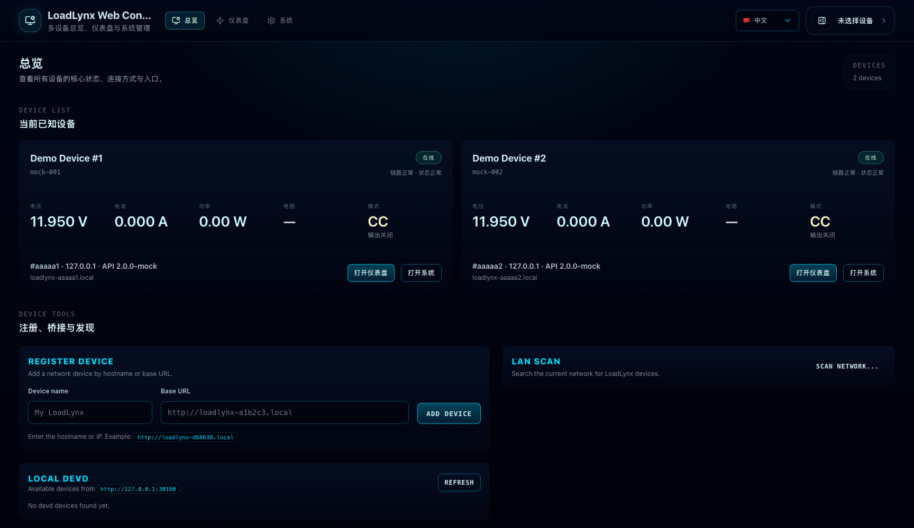
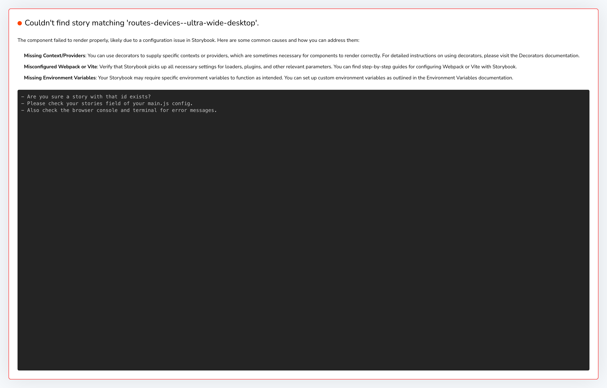
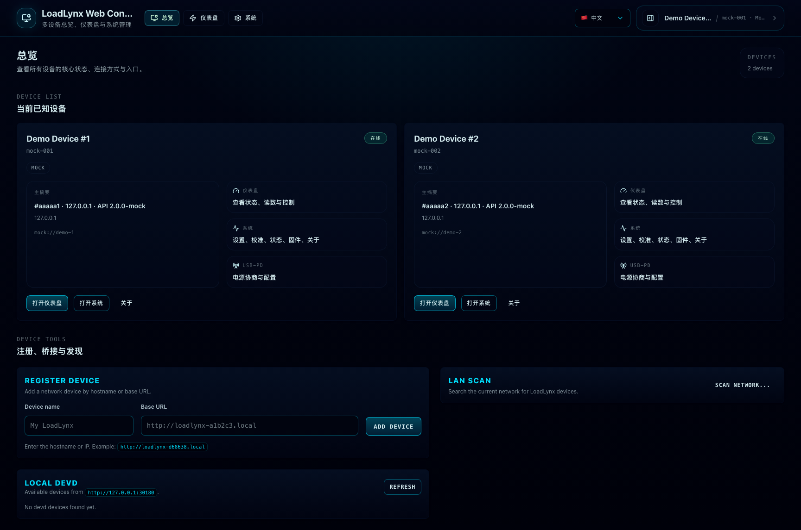
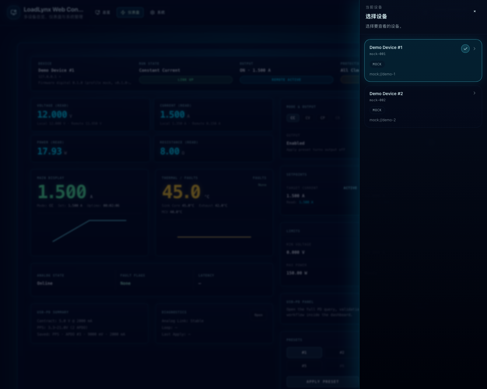
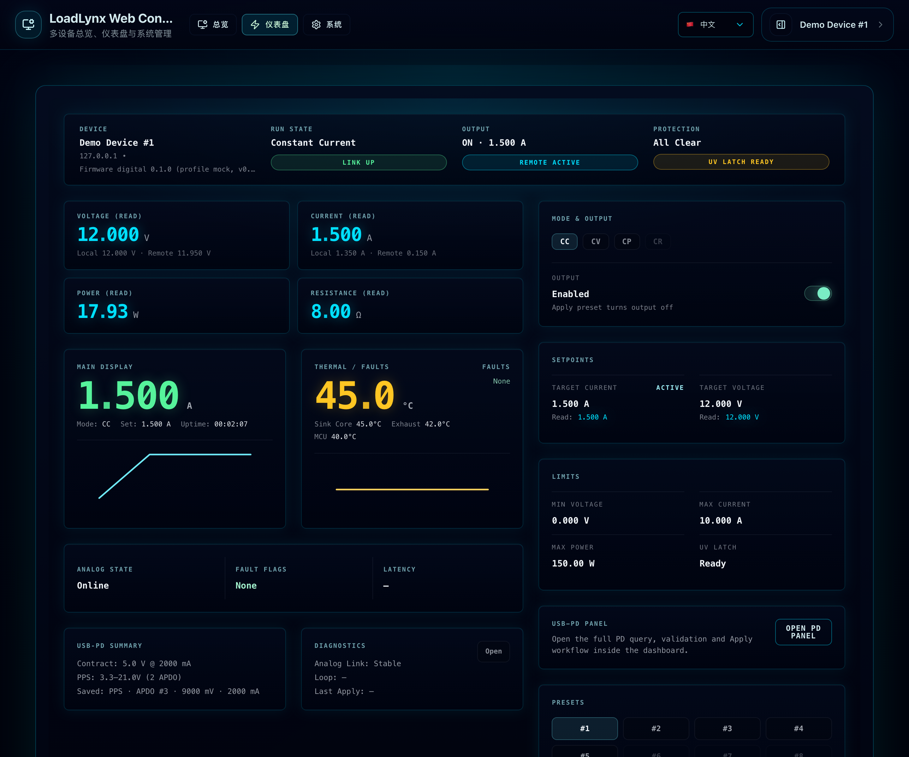
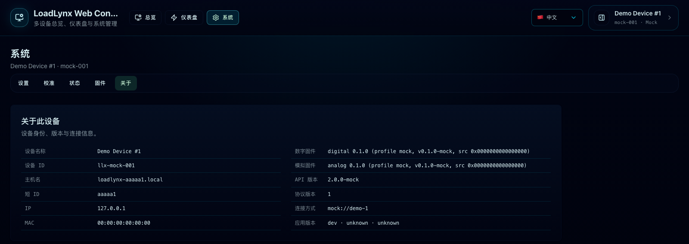
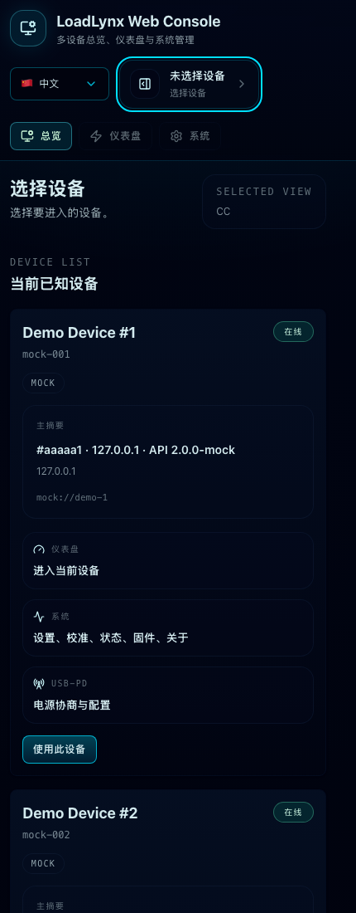
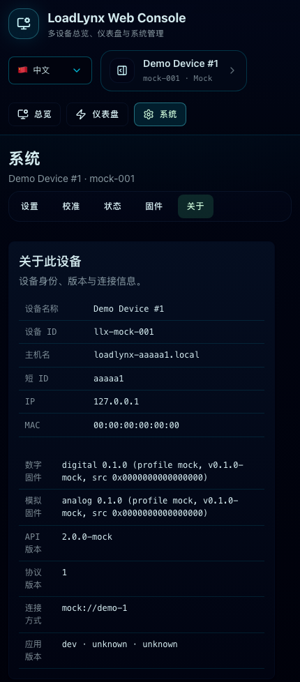

# Web Console 顶部导航与设备工作面（#m3n8p）

## 背景

LoadLynx Web Console 原先围绕左侧 sidebar / icon rail / mobile drawer 组织导航，并把 `CC Control`、`USB-PD`、设备列表拆成彼此平级的心智入口。随着仪表盘密度、设备切换和系统管理能力继续增长，这套结构已经出现三类问题：

- 一级导航被左栏占据，移动端还需要额外抽屉，导致导航与当前设备切换分裂。
- `CC Control`、`USB-PD`、Status/Settings 之间职责交叉，用户难以形成“总览 / 主工作面 / 管理域”的稳定认知。
- 桌面与移动端的设备切换路径不一致，旧 drawer 语义也与当前 sticky 顶部壳层冲突。

本规格冻结新的 Web Console shell：一级导航统一收口到页头，术语统一为 `总览 / 仪表盘 / 系统`，并将桌面设备切换改为右侧 sheet、移动端改为回到总览选设备。

## 目标

- 固定一级导航为 `总览 / 仪表盘 / 系统`，任何 viewport 下都不再渲染左栏、icon rail 或移动导航抽屉。
- `/` 与 `/devices` 统一为 `总览`，承担多设备观察与切换，不再等同“设备列表页”。
- `/$deviceId/cc` 统一命名为 `仪表盘`，继续保留深链并吸收完整 USB-PD 配置 / Apply 工作流。
- `系统` 成为当前设备管理域，为 `设置 / 校准 / 状态 / 固件 / 关于` 提供统一二级导航。
- 设备切换逻辑统一：桌面端从页头当前设备入口打开右侧 sheet，移动端则跳到总览选择设备后再返回原工作面。

## 非目标

- 不修改 firmware、devd、HTTP API 或协议语义。
- 不在总览直接提供高风险写操作，例如启停输出或直接 Apply USB-PD。
- 不删除历史深链；通过保留路径或 redirect 继续兼容既有书签。
- 不重做全站主题，仅在现有 cyberpunk/instrument 方向上调整壳层与信息架构。

## 术语与信息架构

### 一级导航

- `总览`
  - 路径：`/`、`/devices`
  - 责任：多设备状态观察、连接方式摘要、当前设备切换入口、进入 `仪表盘` / `系统`
- `仪表盘`
  - 路径：`/$deviceId/cc`
  - 责任：当前设备的“信息展示 + 控制”主工作面
- `系统`
  - 路径：`/$deviceId/settings|calibration|status|firmware|about`
  - 责任：当前设备配置、维护、诊断与身份信息

### 二级导航（系统域）

- `设置`
- `校准`
- `状态`
- `固件`
- `关于`
- 这里的承载面命名为“系统页导航”，不是泛化的“二级导航”。
- 桌面端以系统工作区左侧纵向导航呈现；移动端回退为内容上方的横向滚动导航。
- `校准` 之下存在真正的第二层：`电压 / 电流通道1 / 电流通道2`。
- `校准` 一级项本身是不可点击的分组标题，不承担跳转。
- 这组校准子项必须直接出现在系统页导航内，视觉上比 `校准` 更轻一级，但不通过缩进表达层级，也不能在内容区重复渲染一排同义 tabs。

### 设备切换

- 页头右侧当前设备入口不显示显式 label，仅通过设备名 / ID / 连接方式自描述。
- 页头当前设备入口承担唯一的设备在线状态主出口，使用单一状态灯表达：绿色=已连接，闪烁橙色=连接中/重连中，红色=故障/错误，灰色=未连接。
- 桌面端点击当前设备入口后，必须从右侧滑出设备 sheet。
- 移动端点击当前设备入口后，必须跳回 `总览`，并通过 `returnTo` 机制在选择设备后返回原工作面；若无法恢复原路径，则默认进入 `仪表盘`。
- 设备 sheet 的连接方式不是“重新添加设备”的入口；同一硬件的 `WiFi/LAN`、`USB/devd`、`Web Serial` 必须以 `identity.device_id` 合并为一个设备，再在该设备内切换通道。
- 只要 `USB/devd` 或 `Web Serial` 成功读取到设备身份，Web 必须尝试从 identity、WiFi status、devd network 或 mDNS/DNS-SD 结果推导 LAN 管理地址，并自动把 `WiFi` 通道绑定到同一设备；优先使用 `.local` mDNS hostname，无法得到 hostname 时使用设备报告的 IP，端口按显式 endpoint 保留，否则使用 HTTP 默认端口。
- 当 Web 通过 WiFi/LAN 发现设备且 identity 校验成功，必须用同一规则反向合并已有 `USB/devd` / `Web Serial` 记录；列表中不应出现同一 `identity.device_id` 的两台设备。
- 自动绑定 WiFi 通道不得绕过 WiFi 写入安全门禁：`Save WiFi`、`Clear User WiFi` 和 WiFi backup restore 仍必须先切换到已验证的非 WiFi 管理通道。

## 布局与交互契约

### 顶部壳层

- 页头 sticky，左侧为品牌，中央为一级导航，右侧仅保留语言切换与当前设备入口。
- 一级导航在移动端必须保持在页头内可横向滚动，不再从侧边打开导航。
- 语言切换器不显示 “Language” / “语言” label，而以 `🇨🇳 中文` 与 `🇺🇸 EN` 自描述。
- 设备入口不显示 “Current device” / “当前设备” 可见 label，但必须有可访问名称。

### 总览

- 每张设备卡至少展示：
  - 设备名 / ID
  - 连接方式标签
  - 电压 / 电流 / 功率 / 电阻 / 模式（含输出关闭状态）这组核心读数
  - 链路 / 保护 / 连接方式等次级状态摘要
  - 一个主摘要区（例如 hostname / IP / API version）
  - 进入 `仪表盘` / `系统` 的动作
- 总览卡只承担“多设备态势观察 + 切换入口”，不能退化成当前设备详情页的缩略版，也不能在卡内重复解释 `仪表盘 / 系统 / USB-PD` 的页面职责。
- 总览卡的核心读数必须稳定、可扫读，并在视觉权重上与设备名称并列为主信息；优先让用户横向比较多台设备的 `电压 / 电流 / 功率 / 电阻 / 模式`，而不是展示一堆页面说明型文案。
- 总览下方可保留登记、扫描、devd bridge 等次级管理区，但它们不应占据主心智。
- 任意单设备请求失败不得阻塞其它设备卡片渲染。

### 仪表盘

- 仪表盘继续保持左监右控的信息层级。
- 仪表盘顶部状态条不再重复展示设备名、IP、固件等壳层级身份摘要；这些信息统一留在页头当前设备入口。
- USB-PD 的完整查询、校验、Apply 流程必须以内嵌 panel 形式出现在仪表盘控制区，不再保留独立一级导航页面。
- 监视区可以继续保留 PD 摘要卡，但它只是摘要，不是主编辑面。

### 系统

- `系统` 通过 pathless layout 提供统一二级导航。
- `关于` 是只读页，只展示 identity、firmware、API/protocol、transport 与 app version，不承载新的控制动作。
- `状态` 保持诊断页定位，但其中与 USB-PD 相关的次级入口应指向仪表盘的 PD panel，而不是独立 PD 页面。

## 路由兼容契约

- 保留 `/` 与 `/devices` 两个总览入口。
- 保留 `/$deviceId/cc` 作为仪表盘 canonical route。
- 新增 `/$deviceId/about`。
- 历史 `/$deviceId/pd` 必须作为兼容入口重定向到 `/$deviceId/cc?panel=pd`。
- 现有 `/$deviceId/settings|calibration|status|firmware` 路径继续有效，并统一归入 `系统` 一级导航。

## 可访问性与文案要求

- 无 visible label 的语言 / 设备控件必须提供清晰的 `aria-label`。
- 语言切换、设备 sheet 开关、移动端设备回跳都不能产生 focus regression。
- 中文术语统一使用 `总览 / 仪表盘 / 系统 / 关于 / 设备抽屉 / 连接方式`。
- `CC Control` 作为 owner-facing 页面名称退场；技术缩写 `CC/CV/CP/USB-PD/PPS` 仍可在域内保留。

## 验收标准

- Given 任意 viewport
  When 打开 Web Console
  Then 页面中不再出现左侧导航栏、icon rail 或移动导航抽屉，一级导航始终位于页头。

- Given 打开 `/` 或 `/devices`
  When 总览渲染完成
  Then 每台设备至少展示设备名/ID、连接方式、关键状态摘要，以及进入 `仪表盘` / `系统` 的动作。

- Given 打开 `/$deviceId/cc`
  When 进入当前设备主工作面
  Then owner-facing 文案为 `仪表盘`，且可以在同一路由下打开完整 USB-PD panel。

- Given 打开 `/$deviceId/pd`
  When 路由解析完成
  Then 会落到 `/$deviceId/cc?panel=pd`，而不是保留独立页面语义。

- Given 打开 `/$deviceId/settings|calibration|status|firmware|about`
  When `系统` 一级导航高亮
  Then 二级导航可在这些子页间切换，且 `关于` 只展示只读元数据。

- Given 用户切换语言或设备
  When 使用页头右侧控件
  Then 控件没有 visible label 但仍可自描述、可访问且不会产生裁切或 focus regression。

- Given 设备已通过 USB/devd 或 Web Serial 成功连接
  When Web 读取到 identity 和 WiFi/LAN 地址信息
  Then 同一设备的 sheet 自动出现可用 WiFi 通道，而不是要求用户重新添加设备。

- Given 设备已通过 WiFi/LAN 发现且 identity 与已有 USB/devd 或 Web Serial 记录相同
  When 保存设备记录
  Then Web 合并为同一个设备，并保留所有已知连接方式。

## 视觉证据

## 参考

- `CONTEXT.md`
- `DESIGN.md`
- `docs/specs/cqu4e-web-layouts/SPEC.md`
- `docs/specs/t4zh9-web-responsive-drawer-sidebar/SPEC.md`
- `docs/specs/t5x4k-web-instrument-control-ui/SPEC.md`
