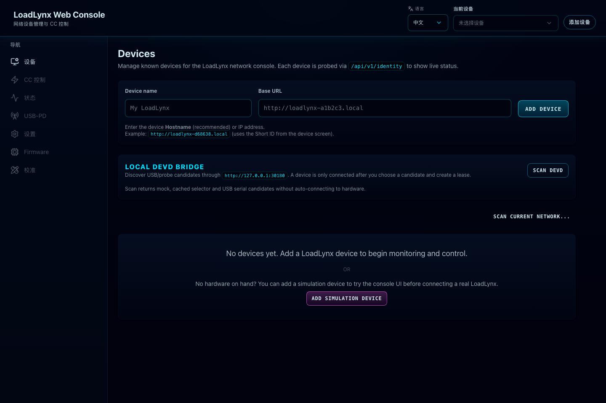

# Web production preview smoke 与 chunk-cycle regression（#n5nwv）

## 背景 / 问题陈述

- `https://loadlynx.ivanli.cc/` 在 GitHub Pages 上返回了完整 HTML、CSS 与 JS，但首屏实际白屏，没有把 React 应用挂载出来。
- 同一问题可在当前源码的 `bun run build` + `bun run preview` 本地复现，而 `bun run dev` 正常，说明故障属于 production bundle runtime，而不是开发态逻辑或网络慢。
- 这类故障的共同根因是手工 `manualChunks` 把运行时强耦合的图表依赖链拆散，形成 production-only 的循环初始化或半初始化读取；历史上表现为 `vendor` ↔ `react-vendor`，当前也覆盖 `recharts` ↔ `reselect/state-vendor` 一类回归。

## Goals

- 修复 production-only 的首屏启动崩溃，让 GitHub Pages 与本地 `vite preview` 都能正常挂载首页。
- 为已构建 `dist` 增加独立的 preview smoke，覆盖“dev 正常、prod 白屏”的回归形态。
- 把 preview smoke 前移到 `web-check` 与 `web-pages`，在 PR 和部署上传前拦截坏包。

## Non-goals

- 不做首屏性能优化、CDN/缓存调优或更大规模的 bundle 重构。
- 不改动 Web 路由、设备 API、文案协议或视觉设计。
- 不修改 GitHub Pages 域名、部署目录结构或非 Web 的发布流程。

## Scope

### In scope

- `web/scripts/chunking.ts` 的生产手工拆包策略。
- 基于 `bun run preview` 的 production smoke Playwright 配置与测试。
- `.github/workflows/web-check.yml`、`.github/workflows/web-pages.yml` 的 preview smoke 门禁。
- 相关 spec、solution、项目文档与视觉证据。

### Out of scope

- Storybook bundle budget 规则本身。
- Web 业务组件逻辑、mock/devd 数据路径语义。
- Pages 站点之外的其它部署入口。

## Requirements

### MUST

- `manualChunks` 不得再把会形成运行时初始化环的耦合依赖链拆到不同 chunk；已知高风险对象至少包括 `react/react-dom` 与 `recharts` 内部状态图。
- 若未来需要继续拆包，只允许拆出纯非核心运行时依赖；不得重新引入会让图表运行时、状态 selector 或 React runtime 在初始化期读取到半初始化绑定的独立 chunk。
- `bun run build` 后，`bun run preview` 下的首页与 `/$deviceId/cc` 仪表盘路由都必须可见，且不再出现白屏或 route-level error boundary。
- 仓库必须提供独立的 production preview smoke，直接针对已构建 `dist` 运行，而不是复用 dev-server E2E。
- preview smoke 必须断言首页标题可见，且无 uncaught `pageerror` / `console error`。
- `web-check.yml` 必须在 `bun run build` 与 app bundle budget 之后运行 preview smoke。
- `web-pages.yml` 必须在上传 Pages artifact 之前运行同一条 preview smoke；smoke 失败时不得上传产物。

## Acceptance Criteria

- Given 执行 `cd web && bun run build`
  When 执行 `cd web && bun run test:preview-smoke`
  Then 生产 bundle 首页正常挂载，标题可见，且浏览器未捕获任何 uncaught `pageerror` / `console error`。

- Given 执行 `cd web && bun run build`
  When 执行 `cd web && bun run test:preview-smoke`
  Then 生产 bundle 的 `/$deviceId/cc` 仪表盘路由也必须正常挂载，`Primary dashboard monitor` 与 `USB-PD` 控件可见，且不出现 route-level error boundary。

- Given `web-check.yml` 在 CI 中执行
  When build 或 app bundle budget 通过后运行 preview smoke
  Then production bundle 若启动崩溃，CI 必须失败。

- Given `web-pages.yml` 在部署前执行
  When preview smoke 未通过
  Then workflow 必须在上传 Pages artifact 前失败，阻止坏包发布。

- Given 运行 `cd web && bun run test:e2e`
  When 本次修复完成后
  Then 现有 dev 路径回归保持通过，说明修复没有破坏开发态与既有交互。

## Quality Gates

- `cd web && bun run build`
- `cd web && bun run check:bundle:app`
- `cd web && bun run test:preview-smoke`
- `cd web && bun run test:e2e`

## Visual Evidence

- Bound SHA: `48b94eb`
- source_type: mock_ui
  story_id_or_title: `local production preview`
  state: homepage mounted from built `dist` bundle after removing standalone `react-vendor`
  capture_scope: browser-viewport
  requested_viewport: `1440x960`
  viewport_strategy: devtools-emulate-equivalent headless capture
  target_program: mock-only
  sensitive_exclusion: no real device data; homepage mock/demo-safe state only
  evidence_note: verifies the built production bundle mounts the `LoadLynx Web Console` homepage in `vite preview` instead of white-screening.

## Related Specs

- `docs/specs/m8k2v-web-bundle-budget-gates/SPEC.md`：继续约束 app bundle 预算，但不拥有本次 production runtime crash 的 smoke contract。
- `docs/specs/rjkcw-web-pages-deploy-lockfile/SPEC.md`：继续约束 Pages 部署与 lockfile/CI 安装路径，但不拥有 built bundle runtime health。

## References

- `web/scripts/chunking.ts`
- `web/playwright.preview.config.ts`
- `web/tests/e2e/preview-smoke.spec.ts`
- `.github/workflows/web-check.yml`
- `.github/workflows/web-pages.yml`
