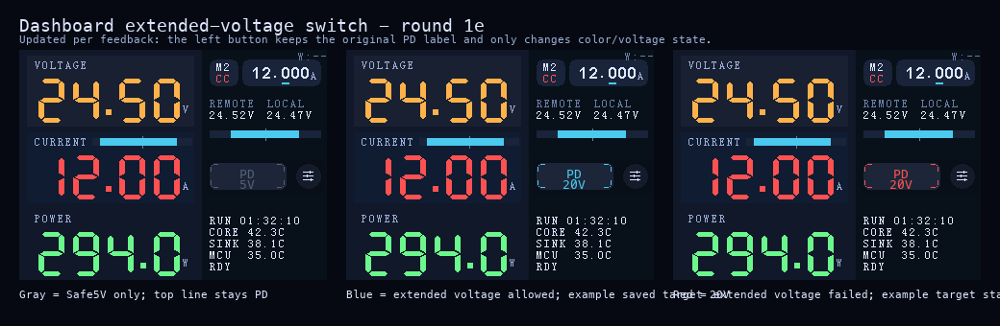

# Dashboard「扩展电压」开关与 PD 设置入口重构（#w4cpd）

## 背景 / 问题陈述

- 当前主界面左侧 `PD` 按钮用于显示/进入 PD 相关状态，右侧圆形按钮用于 on-screen LOAD 开关。
- 现有数字侧会记忆 `pd_saved`，并在 attach / link 恢复时自动重发它；在接入未知 USB-C 电源作为 DUT 时，这会把设备直接带回上一次使用过的非 Safe5V 档位。
- 主人要求把主界面的控制语义改成“先从 Safe5V 起步，再由明确开关决定是否允许离开 Safe5V”，并把 PD 设置入口从左侧按钮迁移到右侧圆形按钮。
- 不做这次改造的话，未知 DUT 重新接入后仍可能直接恢复到历史高压档位，存在误操作与安全心智不一致的问题。

## 目标 / 非目标

### Goals

- 把主界面左侧原位控件改成“扩展电压”开关，用于控制是否允许从 Safe5V 进入已保存的非 Safe5V PD 配置。
- 把右侧原位圆形按钮改成 PD 设置入口，进入当前仪表盘内的 PD panel（兼容上仍可通过历史 `/pd` 深链抵达）。
- 移除主界面的 on-screen LOAD 按钮，但保留触摸弹簧/物理 LOAD 控制路径。
- 为后续实现冻结 Safe5V 门控、三态颜色、持久化规则与最小 HTTP API 变更。

### Non-goals

- 本规格不改动触摸弹簧/物理 LOAD 控制逻辑。
- 本规格不重做 PD panel 布局，只重定义主界面入口与 `Apply` 的 Safe5V 门控语义。
- 本规格不引入新的协议层错误分类，也不扩展模拟侧 PD wire format。

## 范围（Scope）

### In scope

- 主界面 control row 下方两个控件的视觉与点击语义重排。
- `allow_extended_voltage` 的状态模型、持久化、Safe5V 门控与三态显示规则。
- `GET/PUT /api/v1/pd` 的最小字段扩展（含 `allow_extended_voltage`、`saved.pps_target_mv`）。
- 第一轮设计稿与实现前冻结规则。

### Out of scope

- Web 端 UI 的视觉改造。
- 新增主界面第三个按钮或替代性的 on-screen LOAD 入口。
- 模拟侧 PD 会话流程的大改；保持现有 Safe5V first / follow-up desired request 架构。

## 需求（Requirements）

### MUST

- 左侧原位按钮必须是“扩展电压”开关，而不是新的额外控件。
- 右侧原位圆形按钮必须变成 PD panel 入口。
- `allow_extended_voltage=false` 时，所有自动/手动 PD 下发路径都必须只使用 Safe5V fixed 策略。
- `allow_extended_voltage` 必须持久化，且旧 EEPROM 数据迁移默认值为 `false`。
- 红色失败态必须复用现有失败判定窗口与失败来源，不能新增新的协议层错误分类。

### SHOULD

- 第一轮设计稿应保持现有右侧信息密度与按钮行节奏，不让主界面显得拥挤。
- 左侧开关应延续现有 PD 按钮的容器风格与交互视觉，而不是换成陌生组件。
- 右侧设置入口应一眼能看出“进入设置”，但不再承担 PD 成功/失败状态色。

### COULD

- 左侧开关的文案可以根据状态变化，只要最终能稳定表达“仅 Safe5V / 允许扩展电压 / 失败”。
- 右侧设置入口可以用纯图标或图标+极短文本，只要在 27 px 圆形按钮里可辨识。

## 功能与行为规格（Functional/Behavior Spec）

### Core flows

- 主界面左侧原位按钮：
  - 点击时切换 `allow_extended_voltage`。
  - `off -> on`：若当前已 attach，立即按 `pd_saved` 发起重协商；若未 attach，仅保存状态，等待下次 attach 自动应用。
  - `on -> off`：若当前已 attach，立即切回 Safe5V；若未 attach，仅保存状态。
- 主界面右侧原位圆形按钮：
  - 点击时进入当前仪表盘内的 `PD panel`。
  - 不再承担 on-screen LOAD 开关语义。
- `PD settings` 页面：
  - 继续编辑 `pd_saved`。
  - `Apply` 继续保存配置；仅当 `allow_extended_voltage=true` 时才立即尝试离开 Safe5V。
  - `allow_extended_voltage=false` 时，`Apply` 保存成功但设备保持/回到 Safe5V。
- 主界面三态：
  - 灰色：`allow_extended_voltage=false`，语义为“仅 Safe5V”。
  - 蓝色：`allow_extended_voltage=true` 且当前无失败态。
  - 红色：`allow_extended_voltage=true` 且最近一次非 Safe5V 请求命中现有失败条件。

### Edge cases / errors

- 若 `pd_saved` 本身就是 Safe5V，打开“扩展电压”不应报错；行为视为“允许使用保存配置”，只是结果仍停在 Safe5V。
- 当 `allow_extended_voltage=true` 且保存的目标需要离开 Safe5V，但当前 source 能力列表缺失对应 PDO/APDO（导致无法构建请求）时，可以进入红态；语义视为“本次非 Safe5V 请求失败/不可达”，而不是静默回退或自动改写保存配置。
- 红态的“成功清除”以 `PD_STATUS` 观测到的合同为准（例如 `contract_mv != 5V`）；`PD_SINK_REQUEST` 的 ACK/NACK 仅表示“策略接收/拒绝”，不作为协商成功判据。
- detach、新会话开始、成功拿到非 Safe5V 合同、手动关闭开关、设备重启，都必须清除红色失败态。
- attach 上升沿、link 恢复、设置页 `Apply`、HTTP API 更新配置，都不得绕过 `allow_extended_voltage` 直接恢复非 Safe5V。

## 设计冻结（Round 1）

### Approved mock

### Approved visual contract

- 左侧保留现有 `PD` 按钮矩形位置 `(198,118)-(277,145)` 与圆角尺寸，只改成功能开关。
- 右侧保留现有圆形按钮位置 `(287,118)-(314,145)`，使用无蓝色外边框的深色圆底 + 白色调节滑杆图标来表达“进入设置”。
- 当前确认稿：
  - 灰：`PD / 5V`
  - 蓝：`PD / 20V`（示意保存目标为 20V）
  - 红：`PD / 20V`（示意允许扩展电压但最近一次非 Safe5V 请求失败）
- 顶部文案固定保留 `PD`；主界面不再额外引入 `EXT`、`FIXED` 等新标签。

## 接口契约（Interfaces & Contracts）

### 接口清单（Inventory）

| 接口（Name） | 类型（Kind） | 范围（Scope） | 变更（Change） | 契约文档（Contract Doc） | 负责人（Owner） | 使用方（Consumers） | 备注（Notes） |
| --- | --- | --- | --- | --- | --- | --- | --- |
| `DashboardExtendedVoltageToggle` | UI Component | internal | New | ./contracts/ui-components.md | digital UI | dashboard main screen | 左侧原位按钮的语义从 PD 状态/入口改为 Safe5V 门控开关 |
| `DashboardPdSettingsEntry` | UI Component | internal | Modify | ./contracts/ui-components.md | digital UI | dashboard main screen | 右侧原位圆形按钮改成 PD panel 入口 |
| `/api/v1/pd` | HTTP API | external | Modify | ./contracts/http-apis.md | digital net | web / automation / diagnostics | 新增 `allow_extended_voltage` 字段 |

### 契约文档（按 Kind 拆分）

- [contracts/README.md](./contracts/README.md)
- [contracts/ui-components.md](./contracts/ui-components.md)
- [contracts/http-apis.md](./contracts/http-apis.md)

## 验收标准（Acceptance Criteria）

- Given 设备启动且 `allow_extended_voltage=false`
  When 主界面渲染
  Then 左侧原位按钮以灰色表达“仅 Safe5V”，右侧圆形按钮表达“进入 PD 设置”。
- Given 主界面左侧按钮被打开且当前已 attach
  When 系统发起新的 PD 请求
  Then 有效策略使用 `pd_saved`，而不是 Safe5V。
- Given 主界面左侧按钮被关闭且当前已 attach
  When 系统处理这次切换
  Then 设备立即回到 Safe5V。
- Given `allow_extended_voltage=false`
  When attach 上升沿、link 恢复、设置页 `Apply`、或 `PUT /api/v1/pd` 更新配置发生
  Then 设备仍只停在 Safe5V。
- Given 最近一次非 Safe5V 请求命中现有失败条件
  When `allow_extended_voltage=true`
  Then 左侧原位按钮显示红色失败态，且该失败态会在手动关闭、成功协商、detach、新会话或重启时清除。
- Given 主界面
  When 点击右侧原位圆形按钮
  Then 进入当前仪表盘内的 `PD panel`，而不是切换 LOAD。

## 非功能性验收 / 质量门槛（Quality Gates）

### Testing

- Unit tests: 覆盖 `allow_extended_voltage` 对有效 PD 策略选择的门控逻辑，以及旧 EEPROM blob 的默认迁移值。
- Integration tests: 覆盖 `GET/PUT /api/v1/pd` 的新字段与默认行为。
- E2E / HIL: 覆盖 Safe5V 起步、打开后升到保存档位、关闭后回 Safe5V、失败时红态出现。

### UI / Storybook (if applicable)

- 以 dashboard 渲染截图作为视觉回归基线；本仓库无 Storybook 要求。

### Quality checks

- `cargo fmt --all`
- 与改动直接相关的 host/unit tests
- `just d-build`（至少覆盖 digital firmware build）

## Visual Evidence

待实现阶段补充真实证据图。

## 方案概述（Approach, high-level）

- 复用当前数字侧 PD 状态机和模拟侧 Safe5V-first 架构，只在数字侧新增一个统一的“有效策略选择层”。
- UI 只做主界面两个按钮的语义重排，不重做右侧 telemetry 区块的整体布局。
- 先用 spec + mock 冻结控件设计，再进入代码实现，避免写完后反复返工控件语义。

## 风险 / 开放问题 / 假设（Risks, Open Questions, Assumptions）

- 风险：27 px 圆形设置入口在实机亮度/视角下的辨识度仍需在实现后做一次真机回看。
- 假设：主界面不再保留 on-screen LOAD 控制不会影响当前操作流，因为触摸弹簧/物理 LOAD 控制仍然可用。

## 参考（References）

- `docs/interfaces/main-display-ui.md`
- `docs/specs/h3gz5-usb-pd-sink-toggle/SPEC.md`
- `docs/specs/j24my-usb-pd-pps-and-fixed-settings/SPEC.md`
- `docs/specs/wjhba-dashboard-pd-button-label/SPEC.md`
- `firmware/digital/src/ui/mod.rs`
- `firmware/digital/src/main.rs`
