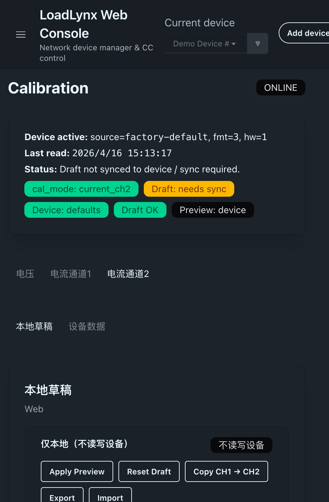

# Calibration 页面模式同步与状态链路稳定化（#wh4s9）

## 状态

- Status: 已完成
- Created: 2026-04-16
- Last: 2026-04-16
- Notes: 本地校准页稳定性修复已完成；本地验证通过；待主人决定后续提交/推送。

## 背景 / 问题陈述

- Web 校准页同时依赖设备 `calibration mode`、SSE `status` 流和浏览器本地 draft 存储；其中任一环节抖动都会直接影响 RAW / DAC / Active 读数的展示。
- 现有实现里，页签切换、草稿恢复与页面生命周期对设备 mode 有竞争性写入；在真实设备和 mock 下都能观察到 `expected=current_ch2`，但设备 `cal_mode` 仍停在 `voltage` 的错位状态。
- 校准页只依赖 SSE；当 SSE 短暂断流时，页面会把 `status` 直接清空并判成 offline，导致主人看到“数据偶尔掉光 / 操作卡住 / RAW 变成 --”。

## 目标 / 非目标

### Goals

- 把 calibration mode 的设备写入收口到单一协调入口，避免 mount / tab / action 互相打架。
- 让校准页在 SSE 抖动时保留 last-good status，并自动回退到轻量 polling，而不是瞬时判离线。
- 让当前页签只消费与自身校准模式一致的 RAW / DAC 数据，避免旧模式数据误映射到新页签。
- 为该修复补齐稳定的 Storybook + E2E 回归，并留下可复查的视觉证据。

### Non-goals

- 不改动设备 HTTP API 的路径或 payload shape。
- 不重做校准算法、硬件采样策略或固件端 `CalMode` 协议。
- 不改动 calibration 页的整体布局、按钮文案或交互主流程。

## 范围（Scope）

### In scope

- `web/src/routes/device-calibration.tsx` 的 mode sync、status stream fallback、storage hydrate 顺序与 RAW 展示门控。
- `web/src/stories/routes/calibration-route.stories.tsx` 与相关 harness 的稳定 story/play 覆盖。
- `web/tests/e2e/calibration.spec.ts` 的校准页 reload / storage restore 回归。
- 对应 spec、solution 与视觉证据资产。

### Out of scope

- 真实设备的 PD/CC 队列优先级重构。
- Calibration 页外的其它路由（如 CC/Status）的轮询策略重写。
- 数字板/模拟板固件逻辑改动。

## 需求（Requirements）

### MUST

- Calibration 页对设备 `postCalibrationMode(...)` 的写入必须只经由单一协调入口发出。
- 本地 draft 恢复必须早于自动 mode sync，避免先用默认 `voltage` 再被存储页签覆盖。
- SSE 暂时断流时，页面必须保留 last-good status，并在可见页面上自动 fallback 到 `GET /api/v1/status` 轮询。
- 当前页签在设备 `cal_mode` 未对齐时，必须明确提示“正在同步”，并且 RAW / DAC 只能显示占位值，不能把旧模式数据误显示给当前页签。
- Storybook 与 E2E 都必须覆盖“恢复已保存 current tab 且无 mode mismatch”的场景。

### SHOULD

- 校准页应在模式不同步时提供轻量、可理解的提示，而不是只让主人看到 `--`。
- Storybook 覆盖应优先使用 mock/stable state，而不是依赖高时序敏感的页面交互。

### COULD

- 对校准页的 status fallback 进一步做退避/节流调优，只要不影响当前 fix 的稳定性。

## 功能与行为规格（Functional/Behavior Spec）

### Core flows

- 页面加载：
  - 先同步读取浏览器中的 calibration draft；若存在 `active_tab`，立即以它作为初始页签。
  - draft hydrate 完成后，才允许自动 mode sync 协调器根据当前页签对齐设备 `cal_mode`。
- 页签切换：
  - 页签只更新当前期望页签；实际设备 mode 切换统一由协调器完成。
  - 当设备尚未切到目标 mode 时，页面显示“正在同步校准模式”，并把 RAW / DAC 面板收敛为占位。
- 状态同步：
  - 默认优先使用 SSE；一旦 stream 成功收到事件，即视为已连通。
  - 若 stream 暂时断流，页面不清空 last-good status，而是启用 500 ms 级别的 fallback `getStatus()` 轮询；stream 恢复后自动停止 fallback。
- `Set Output` / `Capture`：
  - 在执行前必须通过同一 mode 协调入口确认设备已经进入当前页签对应的 calibration mode。
  - 若设备 mode 未对齐，则提示 mismatch，不直接消费错误 mode 的 RAW 数据。

### Edge cases / errors

- 若设备真实 offline / faulted，仍允许页面展示 offline 状态并阻止校准写入；本规格不改变该语义。
- 离开 calibration 页时，`DeviceLayout` 的 best-effort `off` 仍保留；本规格仅移除 calibration 页面内部重复的 cleanup `off`。
- 空 draft 不再用于保存 calibration points，但 `active_tab` 的恢复逻辑必须可从已有 draft 中稳定生效。

## 验收标准（Acceptance Criteria）

- Given 浏览器中存在 `active_tab=current_ch2` 的 calibration draft
  When 主人重新加载 calibration 页
  Then 页面直接落在 `电流通道2`，并且 `cal_mode` 最终对齐到 `current_ch2`，不会先打回 `voltage`。
- Given calibration 页的 SSE 短暂断流
  When 页面仍处于前台可见状态
  Then 页面保留 last-good status，并通过 fallback polling 继续更新，而不是瞬时显示 offline / RAW 全空。
- Given 主人切到某个 calibration tab，但设备仍处于旧 mode
  When 对齐尚未完成
  Then 页面明确显示“正在同步校准模式”，并把 RAW / DAC 保持为占位值，而不是复用旧 mode 的数据。
- Given Storybook 的 `RestoresStoredCurrentTab` 场景
  When story 运行 play 覆盖
  Then 能稳定看到保存的 current 页签与对齐后的 `cal_mode`。
- Given Playwright 的校准页回归
  When 页面 reload
  Then `电流通道2` 保持激活，`cal_mode` 与 RAW 读数不发生 mismatch。

## 实现前置条件（Definition of Ready / Preconditions）

- 已满足：主人已确认问题表现来自校准页数据/模式偶发错位，并授权直接实现与更新 SPEC。

## 非功能性验收 / 质量门槛（Quality Gates）

### Testing

- `npm run check`
- `npm run test:e2e -- calibration.spec.ts`
- `npm run test:storybook:ci`

### UI / Storybook

- 必须提供稳定的 calibration route Storybook canvas story，能复现“恢复已保存 current tab”和“output applied”状态。
- 视觉证据优先使用 Storybook canvas，而不是临时浏览器截图。

## 文档更新（Docs to Update）

- `docs/specs/README.md`
- `docs/solutions/web/calibration-mode-single-owner-and-status-fallback.md`

## Visual Evidence

- Source: Storybook canvas `Routes/Calibration/Restores Stored Current Tab`
- Bound SHA: `484b965`

## 实现里程碑（Milestones / Delivery checklist）

- [x] M1: 收口 calibration mode 协调入口，移除页面内重复 cleanup `off`，并让 storage hydrate 早于自动 sync。
- [x] M2: 为 calibration 页补齐 last-good status + fallback polling，并对 mismatch 的 RAW / DAC 展示做显式门控。
- [x] M3: 补齐 Storybook / E2E 回归，保留稳定视觉证据与文档更新。

## 方案概述（Approach, high-level）

- 复用现有 `ensureActiveTabCalMode(...)` 协调函数作为 calibration 页内唯一的 mode writer。
- 把 draft hydrate 提前到 `useLayoutEffect` + 初始 state 阶段，避免 mount 时默认 `voltage` 抢写。
- 保留 SSE 主路径，但在 stream 断开时启用按设备串行化的 `getStatus()` fallback query；同时不再把错误当作“立即离线”。
- Storybook 使用显式 seeded mock state，而不是高时序敏感的点击链，确保故事在 test-runner 下稳定。

## 风险 / 开放问题 / 假设（Risks, Open Questions, Assumptions）

- 风险：真实硬件在 Wi‑Fi 抖动下仍可能出现更高层级的请求排队/延迟；本规格只修复 calibration 页自身的 mode/status 协调，不等于全面解决所有 HTTP 队列问题。
- 假设：校准页外由 `DeviceLayout` 负责 best-effort `off` 的语义保持不变，且不会被其他页面的未来改动破坏。

## 参考（References）

- `docs/dev-notes/http-connection-and-frontend-fifo.md`
- `docs/dev-notes/user-calibration.md`
- `/Users/ivan/Projects/Ivan/loadlynx/web/src/routes/device-calibration.tsx`
- `/Users/ivan/Projects/Ivan/loadlynx/web/src/stories/routes/calibration-route.stories.tsx`
- `/Users/ivan/Projects/Ivan/loadlynx/web/tests/e2e/calibration.spec.ts`
