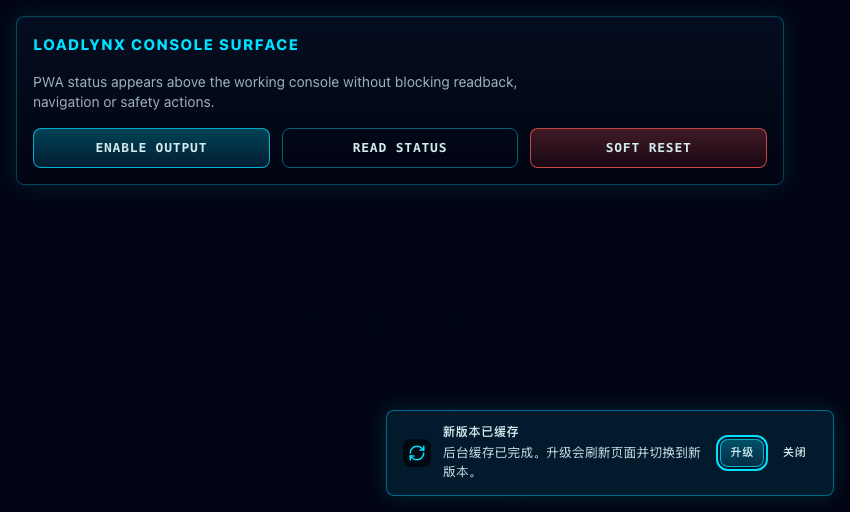

# Web PWA Offline Shell and Update Prompt

## Background

LoadLynx Web Console is used as an operator surface beside real hardware. The app must remain reachable after the first successful visit, even when the frontend static server is temporarily unavailable, while still making device/API connectivity failures explicit.

The existing version display is build-time injected and visible in the console. PWA update behavior must preserve that model: the app can cache a new build in the background, but it must not refresh an operator's active session without confirmation.

## Goals

- Provide a real PWA app shell for the production Web Console.
- Cache core static assets after the first successful visit so the console can reload offline.
- Show a non-blocking update prompt after a new service worker has cached the next version.
- Refresh into the new version only after the user chooses the upgrade action.
- Keep device/devd/API requests network-only so offline hardware state cannot be mistaken for fresh data.

## Non-goals

- No offline write queue or background sync.
- No cached device readbacks, firmware artifacts, Web Serial sessions, devd responses, or control writes.
- No automatic demo/mock-mode switching when the browser is offline.
- No forced modal refresh for ordinary app updates.

## Requirements

- Vite production builds must emit a manifest, service worker, and Workbox runtime.
- `version.json` must be generated before Vite build copies and precaches public assets.
- The service worker must use prompt-style updates, not auto-refresh.
- Precache and runtime caching must not include LoadLynx device APIs, devd endpoints, firmware artifacts, Web Serial flows, or `/version.json`.
- The PWA update UI must use the existing LoadLynx console visual language and remain accessible through `role="status"` or `role="alert"`.
- Storybook must expose stable states for update-ready, offline-ready, registration-error, and hidden states without registering a real service worker.
- Production preview smoke must prove app-shell reload works while offline and that API fetches are not served from cache.

## Acceptance

- `cd web && bun run build` emits `dist/sw.js`, `dist/workbox-*.js`, and `dist/manifest.webmanifest`.
- `cd web && bun run test:preview-smoke` passes a PWA offline reload scenario.
- After first online load and service worker control, a browser offline reload still shows the `LoadLynx Web Console` app shell.
- With the browser offline, `fetch("/api/v1/status", { cache: "no-store" })` and `fetch("/version.json", { cache: "no-store" })` fail instead of returning cached app-shell, stale API data, or stale version metadata.
- When `needRefresh` is true, the UI shows a new-version prompt and calls `updateServiceWorker(true)` only after the user clicks the upgrade action.
- Storybook CI passes the PWA prompt stories and existing route stories.

## Visual Evidence

- source_type: storybook_canvas
  story_id_or_title: `PWA/UpdatePrompt/UpdateReady`
  state: update-ready
  capture_scope: element
  requested_viewport: `900x520`
  viewport_strategy: devtools-emulate
  target_program: mock-only
  sensitive_exclusion: no real device data; Storybook mock console surface only
  evidence_note: verifies the cached-update prompt is visible, non-blocking, and consistent with the LoadLynx instrument console UI.

## Related Specs

- `docs/specs/yff7v-web-version-github-link/SPEC.md`
- `docs/specs/n5nwv-web-production-preview-smoke/SPEC.md`
- `docs/specs/m8k2v-web-bundle-budget-gates/SPEC.md`
- `docs/specs/hthpy-storybook-component-workshop/SPEC.md`

## References

- `web/vite.config.ts`
- `web/src/pwa/pwa-update-prompt.tsx`
- `web/src/pwa/pwa-update-prompt-view.tsx`
- `web/tests/e2e/pwa-preview.spec.ts`
- `web/src/pwa/pwa-update-prompt.stories.tsx`
