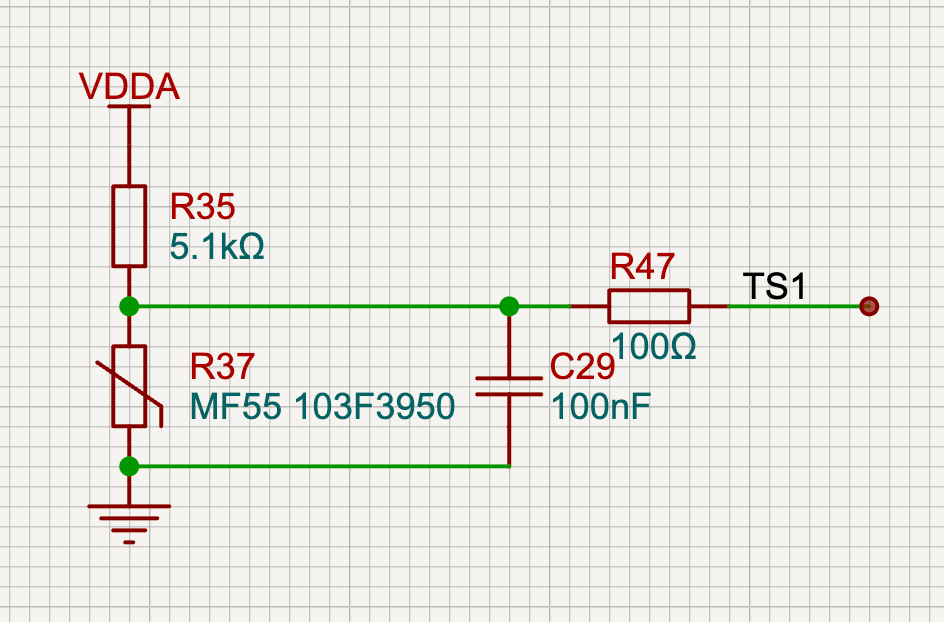

NTC Temperature Sensing (G431 + ESP32‑S3)
=========================================

Scope
-----
- Supply: 3.3 V. ADC usable range: 0–2.9 V.
- Two temperature ranges: 0–100 °C and 0–150 °C.
- Two MCUs sample these sensors: STM32G431 (analog) and ESP32‑S3 (digital).
- Total: 4 identical NTC channels (each range × each MCU).

Sensor Selection
----------------
- Baseline: MF55 thin‑film NTC, 10 kΩ @25 °C, B = 3950 K, tolerance 1 %.
- 0–100 °C: MF55 thin‑film is fine.
- 0–150 °C: prefer either
  - a verified MF55 variant rated to ≥150–200 °C (vendor must provide datasheet for the exact part), or
  - a glass‑encapsulated high‑temp NTC (e.g. EPCOS/TDK B57560/B57561 series) for better margin.

Per‑Channel Circuit (identical for all four)
--------------------------------------------
3.3 V ─ Rpullup ──●─── to ADC pin  
                  │  
                 NTC  
                  │  
                 GND

Recommended values:
- Rpullup = 5.11 kΩ (E96, 1 %). 
- Series to ADC: 100 Ω (limits inrush for S/H and adds ESD robustness).
- Node to GND: 100 nF (X7R) close to the MCU pin (forms a small RC for S/H charge bucket and EMI filtering).
- Optional at the connector/long cable: 100 Ω (or small ferrite bead) in series and a 5 V‑class TVS to GND.

Why 5.11 kΩ for both ranges?
- At 0 °C (10k/3950 model) Vnode ≈ 2.865 V (typ), below the 2.9 V ADC limit. Worst‑case with Rpullup −1 %, NTC +1 % R25 and +1 % B still ≈ 2.877 V, leaving ~23 mV margin.
- At high temperatures the NTC is small (≈700 Ω @100 °C to ≈200 Ω @150 °C). A 5.11 kΩ pull‑up provides good sensitivity without violating the 2.9 V headroom at the cold end.
- Unified BOM and software across four channels.

Typical Voltages (Vs=3.3 V, Rpullup=5.11 kΩ):

| Temp (°C) | NTC (Ω) | Vnode (V) | 12‑bit ADC @2.9 V FS (counts) |
|-----------|---------|-----------|--------------------------------|
| 0         | 33620   | 2.865     | ~4045                          |
| 25        | 10000   | 2.184     | ~3084                          |
| 50        | 3588    | 1.361     | ~1922                          |
| 75        | 1492    | 0.746     | ~1053                          |
| 100       | 698     | 0.396     | ~560                           |
| 125       | 359     | 0.217     | ~306                           |
| 150       | 200     | 0.124     | ~175                           |

Sensitivity (approx.): −33 mV/°C near 25 °C. With 2.9 V full‑scale on a 12‑bit ADC, LSB ≈ 0.709 mV → ~46 LSB/°C near room temperature.

Self‑Heating Check
------------------
With 5.11 kΩ pull‑up the power on the NTC stays low (typ. ≤0.52 mW worst case around 30–60 °C). For thin‑film MF55 parts this corresponds to <~1 °C self‑heating in still air; usually acceptable. Reduce sampling duty (or average multiple low‑dwell samples) if further minimizing is desired.

MCU‑Specific Notes
------------------
STM32G431
- Use Vrefint sampling to ratio‑metric calibrate out 3.3 V drift.
- ADC sample time: choose a longer S/H due to the 100 nF filter (e.g., ≥47.5 cycles) and enable hardware/software oversampling (×4–×16).
- Place the 100 nF close to the ADC pin and reference the return to analog ground.

ESP32‑S3
- Use ADC1 and an attenuation that covers up to ~3.0 V (commonly 11 dB). Enable the official ADC calibration (eFuse‑based) and linearization helpers.
- Similar RC and layout guidance as above; apply averaging and a small IIR filter in firmware.

Firmware Conversion
-------------------
Model: Beta equation is sufficient and light‑weight.
- R0 = 10 kΩ, T0 = 25 °C (298.15 K), B = 3950 K.
- Divider: Rntc = Rpullup · Vout / (Vs − Vout).
- Temperature: T(K) = 1 / (1/T0 + (1/B)·ln(R/R0)),  T(°C) = T(K) − 273.15.

Example (Rust, no_std friendly):
```rust
pub fn adc_counts_to_celsius(adc: u16, adc_fs: u16, vsup: f32, r_pull: f32) -> f32 {
    const R0: f32 = 10_000.0;
    const B: f32 = 3950.0;
    const T0: f32 = 273.15 + 25.0;
    let vout = vsup * (adc as f32) / (adc_fs as f32);
    let r = r_pull * vout / (vsup - vout).max(1e-6);
    let inv_t = 1.0 / T0 + (1.0 / B) * (r / R0).ln();
    (1.0 / inv_t) - 273.15
}
```

Calibration
-----------
- Per channel do 2‑ or 3‑point calibration:
  - 2‑point: 0 °C ice bath and 100 °C boiling water (record ADC and compute offsets/scale).
  - 3‑point: add ambient (~25 °C) for better linearization across the span.
- On G431 apply Vrefint ratioing; on S3 use ADC calibration APIs. Store per‑channel coefficients in NVM if available.

Layout and EMC
--------------
- Short trace from NTC node to ADC; place RC close to MCU.
- Guard ring or ground shielding around the node if routed near power stages.
- For remote sensors add series resistance/CM bead and consider a small TVS at the connector.
- Series resistor rationale (100 Ω):
  - Limits the instantaneous charge/discharge current into the ADC sample/hold capacitor, reducing kickback and inter‑channel coupling during multiplexing.
  - Together with the 100 nF at the ADC pin forms a small RC (fc ≈ 1/(2π·100 Ω·100 nF) ≈ 15.9 kHz) that filters high‑frequency digital/EMI noise without affecting slow thermal signals.
  - Improves settling for higher source impedance dividers by sourcing most of the sampling current from the local 100 nF “charge bucket” rather than the NTC divider.
  - Adds light input protection (injection current spikes, minor ESD) even without hot-plug support.
  - Place the 100 nF at the ADC pin side of the 100 Ω (see figure below); keep loop small and reference to analog ground.

Figure: Recommended RC Placement


Reference Schematic (User)
--------------------------
Equivalent schematic implementation (5.1 kΩ pull-up, 100 nF at ADC side, 100 Ω series resistor):



BOM (per channel)
-----------------
- NTC: 10 kΩ @25 °C, B=3950 K, 1 %.  
  - 0–150 °C: if MF55 is not available with ≥150 °C rating for the exact code, use a glass‑encapsulated 10 kΩ/3950 K part (e.g., EPCOS/TDK B57560/B57561).
- Rpullup: 5.11 kΩ, 1 % (E96).
- Rseries (ADC): 100 Ω, 1 %.
- Cnode: 100 nF, X7R, 25–50 V.

Quick Test Plan
---------------
1) Build both firmware targets.
   - G431: `just a-build`
   - S3: `just d-build`
2) Flash and enable periodic logging of the four channels (temperature plus raw ADC).
3) Verify cold (0 °C), ambient, hot (≥90 °C) points; compare against an external thermometer.
4) Confirm that at 0 °C node voltage < 2.9 V (scope or ADC count) and that ADC counts decrease monotonically with temperature.

References
----------
- MF55 thin‑film NTC (several vendors): typical operating −30..+125 °C; some variants specify up to 200 °C (verify exact part code/datasheet before use).  
- High‑temperature alternative: EPCOS/TDK glass‑encapsulated NTC (B57560/B57561), suitable up to ~150–200 °C.
- STM32 ADC accuracy and source‑impedance guidelines: ST AN2834 “How to get the best ADC accuracy in STM32 MCUs” (sections 3.2.7, 4.2.6, 4.4).
- ESP32‑S3 Hardware Design Guidelines: ADC section recommends a 0.1 µF filter capacitor at the ADC pin and use of ADC1 for better accuracy.

Notes
-----
- Using 5.11 kΩ for both ranges keeps 0 °C below the 2.9 V ADC ceiling with component tolerances while maximizing high‑temperature sensitivity. If extra margin at the cold end is desired, 5.36 kΩ or 5.60 kΩ can be used at the cost of slightly reduced sensitivity near 150 °C.
